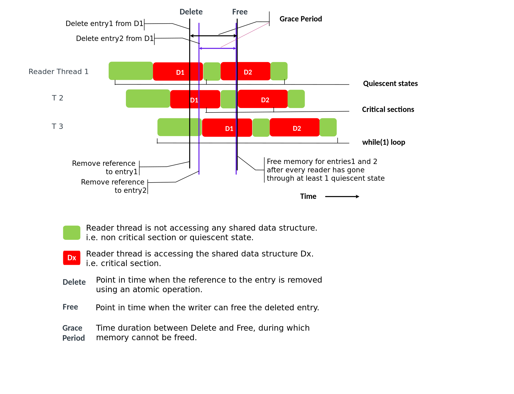

	 

 
 

DPDK RCU库(Read-Copy Update)

 
 

RToax

2020年9月

 
 
 
 

[RCU库](https://doc.dpdk.org/guides/prog_guide/rcu_lib.html)

无锁数据结构提供可伸缩性和确定性。它们启用了可能不允许锁定的用例（例如实时应用程序）。

在以下各节中，术语“内存”是指由典型的API（如malloc（））分配的内存或代表内存的任何事物，例如，自由元素数组的索引。

由于这些数据结构是无锁的，因此写入者和读取者正在同时访问数据结构。因此，在从数据结构中删除元素时，编写者无法在不知道读者不再引用该元素/内存的情况下将内存返回给分配器。因此，需要将删除元素的操作分为两个步骤：

1.删除：在此步骤中，编写器从数据结构中删除对该元素的引用，但不将关联的内存返回给分配器。这将确保新读者不会获得对已删除元素的引用。删除引用是一个原子操作。
2.释放（回收）：在此步骤中，仅在知道所有读取器都已停止引用已删除元素之后，编写器才将内存返回给内存分配器。

该库通过使用线程静态状态（QS）帮助作者确定何时安全释放内存。

# 1. 什么是静态状态
静态状态可以定义为“线程执行中线程不持有对共享内存的引用的任何点”。应用程序有责任确定其静态状态。

让我们考虑下图：

图6.1 静态状态模型中的阶段。

如图6.1所示，读取器线程1访问数据结构D1和D2。当它访问D1时，如果编写器必须从D1中删除一个元素，那么编写器将无法立即释放与该元素关联的内存。仅在读取器停止引用D1之后，写入器才能将内存返回给分配器。换句话说，读取器线程RT1必须进入静态。

同样，由于读取器线程2也正在访问D1，因此写入器必须等待直到线程2也进入静态状态。

但是，编写器不需要等待读取器线程3进入静止状态。删除操作发生时，读取器线程3未访问D1。因此，阅读器线程3将没有对已删除条目的引用。

可以注意到，D2的临界区是D1的静态。也就是说，对于给定的数据结构Dx，线程执行中不引用Dx的任何点都是静止状态。

由于不能立即释放内存，因此可能需要根据应用程序要求配置其他内存。

# 2. 影响RCU机制的因素
重要的是要确保此库将识别宽限期结束和随后释放内存的开销降至最低。以下各段说明宽限期和关键部分如何影响此开销。

作者必须对读者进行投票，以确定宽限期的结束。轮询会引入内存访问并浪费CPU周期。在宽限期内，该内存不可重用。较长的宽限期会激怒这些条件。

关键部分的长度和读取器线程的数量与宽限期的持续时间成比例。保持关键部分较小将使宽限期较小。但是，使关键部分保持较小状态需要在阅读器中使用额外的CPU周期（由于附加报告）。

因此，我们需要小宽限期和大临界区的特征。该库通过允许编写者执行其他工作而不必阻塞，直到读者报告其静态状态为止，满足了这些特征。

# 3. DPDK中的RCU
对于DPDK应用程序，while(1)循环的开始和结束（不保留对共享数据结构的引用）可充当完美的静态状态。这会将所有共享数据结构的访问合并到一个大的关键部分，这有助于将读取器侧的开销降至最低。

DPDK支持数据包处理和服务核心的管道模型。在这些用例中，应用程序中的所有工作人员可能不会使用给定的数据结构。编写者只需要等待使用数据结构的工人报告其静止状态即可。为了提供所需的灵活性，该库具有QS变量的概念。如果需要，应用程序可以为每个数据结构创建一个QS变量，以帮助它跟踪每个数据结构的宽限期的结束。这有助于将宽限期的长度保持为最小。

# 4. 如何使用这个库
应用程序必须分配内存并初始化QS变量。

应用程序可以调用rte_rcu_qsbr_get_memsize()以计算要分配的内存大小。使用此变量作为参数，此API占用读取器线程的最大数量。

此外，应用程序可以使用API​​初始化QS变量 rte_rcu_qsbr_init()。

假定每个阅读器线程都有唯一的线程ID。当前，线程ID的管理（例如分配/空闲）留给应用程序。创建QS变量时，线程ID的范围应为0到提供的最大线程数。如果适用，该应用程序也可以lcore_id用作线程ID。

该rte_rcu_qsbr_thread_register()API将注册一个读线程报告其静止状态。可以从阅读器线程中调用它。控制平面线程也可以代表读取器线程调用此方法。阅读器线程必须调用rte_rcu_qsbr_thread_online()API才能开始报告其静态状态。

一些用例可能需要读取器线程进行阻塞的API调用（例如，在使用eventdev API时）。编写器线程不应等待此类读取器线程进入静止状态。阅读器线程必须rte_rcu_qsbr_thread_offline()在调用阻塞API之前调用API。rte_rcu_qsbr_thread_online()一旦阻塞的API调用返回，它便可以调用API。

编写器线程可以通过调用API触发读取器线程报告其静态状态rte_rcu_qsbr_start()。多个编写器线程可以同时查询静态状态。因此， rte_rcu_qsbr_start()向每个调用者返回一个令牌。

编写器线程必须rte_rcu_qsbr_check()使用令牌调用API，以获取当前的静态状态。提供了阻止直到所有读取器线程都进入静止状态的选项。如果此API指示所有阅读器线程均已进入静止状态，则应用程序可以释放已删除的条目。

API rte_rcu_qsbr_start()和rte_rcu_qsbr_check()是无锁的。因此，即使在作为工作线程运行时，也可以从多个编写器中同时调用它们。

触发报告与查询状态的分离使编写者线程可以灵活地执行有用的工作，而不是阻止读取者线程进入静态或脱机。由于持续轮询状态，因此减少了内存访问。但是，由于资源是在以后释放的，因此令牌和对已删除资源的引用需要存储以供以后查询。

该rte_rcu_qsbr_synchronize()API将的功能rte_rcu_qsbr_start()和阻止功能组合 rte_rcu_qsbr_check()到一个API中。该API触发读取器线程报告其静态状态并进行轮询，直到所有读取器进入静态或脱机。该API不允许编写者在等待时做有用的工作，并且由于连续轮询而引入了额外的内存访问。但是，应用程序不必存储令牌或对已删除资源的引用。rte_rcu_qsbr_synchronize()API返回后可以立即释放资源。

阅读器线程必须调用rte_rcu_qsbr_thread_offline()和 rte_rcu_qsbr_thread_unregister()API才能将自身从报告其静态状态中移除。该rte_rcu_qsbr_check()API将不会等待这位读者线程报告了静止状态的状态。

阅读器线程应调用rte_rcu_qsbr_quiescent()API以指示它们进入了静态状态。该API检查编写者是否触发了静态状态查询并相应地更新状态。

该rte_rcu_qsbr_lock()和rte_rcu_qsbr_unlock()是空的功能。但是，CONFIG_RTE_LIBRTE_RCU_DEBUG启用后，这些API有助于调试问题。可以使用这些API在读取器端标记对共享数据结构的访问。该rte_rcu_qsbr_quiescent()会检查所有的锁被解锁。

# 5. DPDK的资源回收框架
无锁算法在应用程序上增加了资源回收的负担。当编写器从数据结构中删除条目时，该编写器：

必须开始宽限期
必须在FIFO中存储对已删除资源的引用
应该检查读者是否已经完成宽限期并释放资源。
提供了几种API来帮助完成此过程。编写者可以使用创建一个FIFO，以存储对已删除资源的引用rte_rcu_qsbr_dq_create()。可以使用将资源排队到此FIFO中rte_rcu_qsbr_dq_enqueue()。如果FIFO已满，rte_rcu_qsbr_dq_enqueue将在排队之前回收资源。它还将定期回收资源，以防止FIFO变得太大。如果编写器用完了资源，编写器可以调用rte_rcu_qsbr_dq_reclaimAPI来回收资源。rte_rcu_qsbr_dq_delete提供回收任何剩余资源并在关闭时释放FIFO。

但是，如果将此资源回收过程集成到无锁数据结构库中，则它将对应用程序隐藏这种复杂性，并使应用程序更容易采用无锁算法。以下各段讨论如何将回收过程集成到DPDK库中。

在任何DPDK应用程序中，使用QSBR的资源回收过程可以分为4部分：

* 初始化 Initialization
* 静态状态报告 Quiescent State Reporting
* 回收资源 Reclaiming Resources
* 关掉 Shutdown

此处提出的设计将此过程的不同部分分配给客户端库和应用程序。术语“客户端库”是指无锁的数据结构库，例如DPDK中的rte_hash，rte_lpm等，或DPDK之外的类似库。术语“应用程序”是指使用DPDK的数据包处理应用程序，例如L3转发示例应用程序，OVS，VPP等。

该应用程序必须处理“初始化”和“静态状态报告”。所以，

* 应用程序必须创建RCU变量并注册读取器线程以报告其静态状态。
* 应用程序必须在客户端库中注册相同的RCU变量。
* 应用程序中的读取器线程必须报告静态状态。这允许应用程序控制关键部分的长度/应用程序要报告静态状态的频率。
客户端库将处理流程的“回收资源”部分。客户端库将利用编写器线程上下文来执行内存回收算法。所以，

* 客户端库应提供一个API，以注册将要使用的RCU变量。它应该调用rte_rcu_qsbr_dq_create()创建FIFO来存储对已删除条目的引用。
* 客户端库rte_rcu_qsbr_dq_enqueue应用于将已删除的资源排入FIFO并开始宽限期。
* 如果库在添加条目时资源不足，则应调用rte_rcu_qsbr_dq_reclaim回收资源并再次尝试分配资源。
需要在应用程序和客户端库之间共享“关闭”过程。

* 应用程序应确保读取器线程未使用共享数据结构，请在调用客户端库的关闭函数之前从QSBR变量中注销读取器线程。
* 客户端库应调用rte_rcu_qsbr_dq_delete以回收任何剩余资源并释放FIFO。
将资源回收与客户端库集成在一起，可以减轻应用程序的负担，并使使用无锁算法变得容易。

与当前已知的方法相比，该设计具有多个优点。

* 应用程序不需要专用线程来回收资源。内存回收是写入器线程的一部分，对性能几乎没有影响。
* 客户端库可以更好地控制资源。例如：客户端库在资源用尽时可以尝试回收。

 

以上内容由RTOAX翻译整理。
	 

