<div align=center>
	 
</div>
<br/>
<br/>

<center><font size='20'>DPDK笔记 RSS(receive side scaling)网卡分流机制</font></center>
<br/>
<br/>
<center><font size='5'>RToax</font></center>
<center><font size='5'>2020年9月</font></center>
<br/>
<br/>
<br/>
<br/>

[DPDK 网卡RSS（receive side scaling）简介](https://www.cnblogs.com/danxi/p/6761997.html)
[DPDK-RSS负载均衡分流](https://blog.csdn.net/Gerald_Jones/article/details/103909669)
[DPDK设计技巧（第1部分-RSS）](http://galsagie.github.io/2015/02/26/dpdk-tips-1/)
[接收端缩放介绍](https://docs.microsoft.com/en-us/windows-hardware/drivers/network/introduction-to-receive-side-scaling)

# 1. 缩略词
* RSS    receive side scaling    接收端缩放
* DPC    Delayed procedure call    延迟过程调用
* LSB    Least significant bit    最低有效位
* MSI    Message signal interruption    消息信号中断
* RETA    redirection table     重定向表
* DMA    Direct Memory Access     直接内存访问
* NDIS    Network Driver Interface Specification    网络驱动接口类型
* MSI     Message Signaled Interrupt 消息信号中断

# 2. RSS简介
RSS是一种网卡驱动技术，能让多核系统中跨多个处理器的网络收包处理能力高效能分配。
注意：由于同一个核的处理器超线程共享同一个执行引擎，这个效果跟有多个物理核的处理器不一样。因此，**RSS不能使用超线程处理器**。

为了有效的处理收包，一个miniport的驱动的接收中断服务功能调度了一个**延迟过程调用(DPC)**。*如果没有RSS，一个典型的DPC标识了所有的收包数据都在这个DPC调用里。因此，所有收包处理关联的中断都会运行在这些中断发生的CPU上。*

如有RSS功能，网卡和miniport驱动就会提供调度这些收包DPC（延迟过程调用）到其他处理器上的能力。同样，RSS设计保证对于一个给定连接的处理继续停留在一个分配好的CPU上。*网卡实现了一个hash散列功能和作为结果的hash值来选择一个CPU。*

下图说明了用于确定CPU的RSS机制。

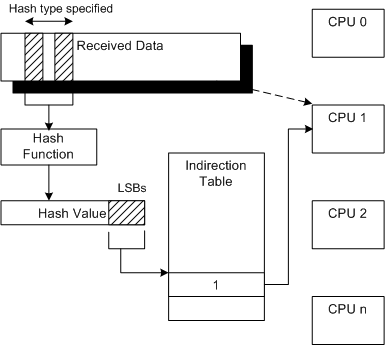

NIC使用哈希函数来计算接收到的网络数据内定义区域（哈希类型）上的哈希值。定义的区域可以是不连续的。

哈希值的多个`最低有效位（LSB）`用于索引间接表。间接表中的值用于将接收到的数据分配给CPU。

有关指定间接表，哈希类型和哈希函数的更多详细信息，请参阅[RSS配置](https://docs.microsoft.com/en-us/windows-hardware/drivers/network/rss-configuration)。

借助`消息信号中断（MSI）`支持，NIC也可以中断关联的CPU。有关NDIS对MSI的支持的更多信息，请参见[NDIS MSI-X](https://docs.microsoft.com/en-us/windows-hardware/drivers/network/ndis-msi-x)。

## 2.1. 什么是RSS

接收方缩放（RSS）是一种网络驱动程序技术，可在多处理器系统中的多个CPU之间有效分配网络接收处理。

接收方缩放（RSS）也称为多队列接收，它在多个基于硬件的接收队列之间分配网络接收处理，从而允许多个CPU处理入站网络流量。RSS可用于缓解单个CPU过载导致的接收中断处理瓶颈，并减少网络延迟。

它的作用是在每个传入的数据包上发出带有预定义哈希键的哈希函数。哈希函数将数据包的IP地址，协议（UDP或TCP）和端口（5个元组）作为键并计算哈希值。（如果配置的话，RSS哈希函数只能使用2,3或4个元组来创建密钥）。

哈希值的多个最低有效位（LSB）用于索引间接表。间接表中的值用于将接收到的数据分配给CPU。

下图描述了在每个传入数据包上完成的过程：
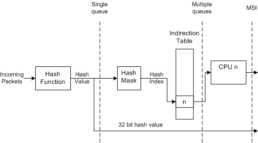

这意味着多进程应用程序可以使用硬件在CPU之间分配流量。在此过程中，间接表的使用对于实现`动态负载平衡`非常有用，因为间接表可以由驱动程序/应用程序重新编程。

* 网卡对接收到的报文进行解析，获取IP地址、协议和端口五元组信息
* 网卡通过配置的HASH函数根据五元组信息计算出HASH值,也可以根据二、三或四元组进行计算。
* 取HASH值的低几位(这个具体网卡可能不同)作为`RETA(redirection table)`的索引
* 根据RETA中存储的值分发到对应的CPU

**RSS通过减少如下开销来提高网络性能：**

* 1、跨多个CPU分派`一个网卡`上的收包处理的延迟。这个也保证了不会有的CPU负载过重而另外的CPU处于空闲。
* 2、执行在同一个CPU上的软件算法因共享数据带来的增加`自旋锁开销`的可能性。自旋锁开销的发生，比如，当一个函数执行在CPU0上，对一个数据加了自旋锁，但是另一个函数运行在CPU1上必须访问这个数据，CPU1就会一直自旋等待CPU0释放锁。
* 3、执行在同一个CPU上的软件算法因共享数据带来的`缓存重新加载`和其他资源开销增加的可能性。这些重新加载的发生，比如，当一个函数执行并访问了CPU0上的共享数据，执行在CPU1时随之来了一个中断。

**为了能在一个安全的环境中获取这些性能的提升，RSS提供如下机制：**

* 1、分布式处理：RSS在DPC（延迟过程调用）里分派给定网卡的收包处理到多个CPU上去。
* 2、顺序处理

## 2.2. 非RSS接收处理

[非RSS接收处理](https://docs.microsoft.com/en-us/windows-hardware/drivers/network/non-rss-receive-processing)

下图说明了非RSS接收处理。
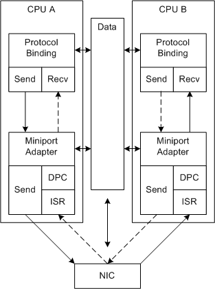

在图中，虚线路径表示发送和接收处理的备用路径。由于系统控制缩放比例，因此处理并非总是在提供最佳性能的CPU上进行。仅在偶然的中断下通过连续中断在同一CPU上处理连接。

**对于每个非RSS中断周期，重复以下过程：**

* **NIC使用DMA将接收到的数据填充到缓冲区中并中断系统**。初始化期间，微型端口驱动程序在共享内存中分配了接收缓冲区。
* **在此中断周期内，NIC可以随时填充其他接收缓冲区。**但是，直到微型端口驱动程序启用了中断，NIC才会再次中断。系统在一个中断周期中处理的接收缓冲区可以与许多不同的网络连接相关联。
* **NDIS 在系统确定的CPU上调用微型端口驱动程序的微型端口中断功能（ISR）**。理想情况下，ISR应该转到最不繁忙的CPU。但是，在某些系统中，系统将ISR分配给可用的CPU或与NIC关联的CPU。
* ISR禁用中断并请求NDIS（网络驱动接口类型）将延迟过程调用（DPC）排队以处理接收到的数据。
* NDIS（网络驱动接口类型） 在当前CPU上调用MiniportInterruptDPC函数（DPC）。
* DPC（延迟过程调用）为所有接收到的缓冲区建立接收描述符，并在驱动程序堆栈上指示数据。对于许多不同的连接可能有许多缓冲区，并且可能有很多处理要完成。可以在其他CPU上处理与后续中断周期相关的接收数据。给定网络连接的发送处理也可以在其他CPU上运行。
* DPC使能中断。该中断周期完成，该过程再次开始。


## 2.3. 相关命令

[接收端缩放（RSS）](https://access.redhat.com/documentation/en-us/red_hat_enterprise_linux/6/html/performance_tuning_guide/network-rss)

要确定您的网络接口卡**是否支持RSS**，请检查中的接口是否有多个中断请求队列`/proc/interrupts`。

例如，如果您对p1p1接口感兴趣：
```
# egrep 'CPU|p1p1' /proc/interrupts
      CPU0    CPU1    CPU2    CPU3    CPU4    CPU5
89:   40187       0       0       0       0       0   IR-PCI-MSI-edge   p1p1-0
90:       0     790       0       0       0       0   IR-PCI-MSI-edge   p1p1-1
91:       0       0     959       0       0       0   IR-PCI-MSI-edge   p1p1-2
92:       0       0       0    3310       0       0   IR-PCI-MSI-edge   p1p1-3
93:       0       0       0       0     622       0   IR-PCI-MSI-edge   p1p1-4
94:       0       0       0       0       0    2475   IR-PCI-MSI-edge   p1p1-5
```

前面的输出显示NIC驱动程序为p1p1接口创建了6个接收队列（p1p1-0通过p1p1-5）。它还显示每个队列处理了多少个中断，以及哪个CPU为该中断服务。在这种情况下，有6个队列，因为默认情况下，此特定的NIC驱动程序为每个CPU创建一个队列，并且此系统有6个CPU。在NIC驱动程序中，这是相当普遍的模式。
或者，您可以在加载网络驱动程序后检查的输出。

```bash
ls -1 /sys/devices/*/*/device_pci_address/msi_irqs
```
例如，如果您对PCI地址为`0000:01:00.0`的设备感兴趣，则可以使用以下命令列出该设备的中断请求队列：
```
# ls -1 /sys/devices/*/*/0000:01:00.0/msi_irqs
101
102
103
104
105
106
107
108
109
```
**默认情况下启用RSS**。在适当的网络设备驱动程序中配置RSS的队列数（或应该处理网络活动的CPU）。对于`bnx2x`驱动程序，它在中配置num_queues。对于sfc驱动程序，它在rss_cpus参数中配置。无论如何，通常都在中配置它，
```
/sys/class/net/device/queues/rx-queue/
```
其中device是网络设备的名称（例如eth1），rx-queue是适当的接收队列的名称。

**在配置RSS时，Red Hat建议将每个物理CPU内核的队列数限制为一个**。**在分析工具中通常将超线程表示为单独的核心，但是尚未证明为包括逻辑核心（例如超线程）在内的所有核心配置队列对网络性能没有好处。**

启用后，RSS根据每个CPU排队的处理量在可用CPU之间平均分配网络处理。但是，您可以使用`ethtool --show-rxfh-indir`和`--set-rxfh-indir`参数来修改网络活动的分布方式，并将某些类型的网络活动的权重设置为比其他类型重要。
该irqbalance守护程序可以与RSS结合使用，以减少跨节点内存传输和高速缓存行反弹的可能性。这降低了处理网络数据包的延迟。如果同时irqbalance使用RSS和RSS，则通过确保irqbalance将与网络设备关联的中断定向到适当的RSS队列来实现最低的延迟。

# 3. RSS的作用

**RSS是网卡提供的分流机制**。用来将报表分流到不同的收包队列，以提高收包性能。
RSS及Flow Director都是靠网卡上的资源来达到分类的目的，所以在初始化配置网卡时，我们需要传递相应的配置信息去使能网卡的RSS及Flow Director功能。
`RSS（receive side scaling）`是由微软提出的一种负载分流方法，通过计算网络数据报文中的网络层&传输层二/三/四元组HASH值，取HASH值的最低有效位(LSB)用于索引间接寻址表RETA(Redirection Table)，间接寻址表RETA中的保存索引值用于分配数据报文到不同的CPU接收处理。现阶段RSS基本已有硬件实现，通过这项技术能够将网络流量分载到多个CPU上，降低操作系统单个CPU的占用率。

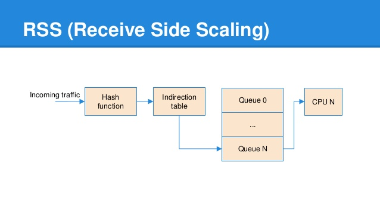

## 3.1. 没有开启 rss负载分流情况下：

* 所有报文只会从一个硬件队列来收包。

## 3.2. 开启 rss进行负载分流情况下：

* rss 会解释报文的 **l3 层信息**：`ip 地址`。甚至 **l4 层信息**：`tcp/udp 端口`。
* 报文会经过 hash function 计算出一个 `uint32_t` 的 `rss hash`。填充到 `struct rte_mbuf `的 `hash.rss`字段中。
* rss hash 的 低7位 会映射到 4位长 的 RSS output index。
* 无法解释的 报文，rss hash 和 RSS output index 设置为`0`。


# 4. RSS的硬件支持
[RSS的硬件支持](https://docs.microsoft.com/en-us/windows-hardware/drivers/network/introduction-to-receive-side-scaling)
下图说明了RSS的硬件支持级别。


对RSS的硬件支持分为三种级别：

**使用单个队列进行哈希计算**
NIC计算哈希值，并且微型端口驱动程序将接收到的数据包分配给与CPU关联的队列。有关更多信息，请参阅[带有单个硬件接收队列的RSS](https://docs.microsoft.com/en-us/windows-hardware/drivers/network/rss-with-a-single-hardware-receive-queue)。

**具有多个接收队列**
具有多个接收队列的哈希计算NIC将接收到的数据缓冲区分配给与CPU关联的队列。有关更多信息，请参阅[带有硬件队列的RSS](https://docs.microsoft.com/en-us/windows-hardware/drivers/network/rss-with-hardware-queuing)。

**消息信号中断（MSI）**
NIC中断应该处理接收到的数据包的CPU。有关更多信息，请参见[带有消息信号中断的RSS](https://docs.microsoft.com/en-us/windows-hardware/drivers/network/rss-with-message-signaled-interrupts)。

NIC始终传递32位哈希值。

## 4.1. 具有单个硬件接收队列的RSS

[具有单个硬件接收队列的RSS](https://docs.microsoft.com/en-us/windows-hardware/drivers/network/rss-with-a-single-hardware-receive-queue)
微型端口驱动程序可以为支持RSS哈希计算和单个接收描述符队列的NIC支持RSS。

下图说明了具有单个接收描述符队列的RSS处理。

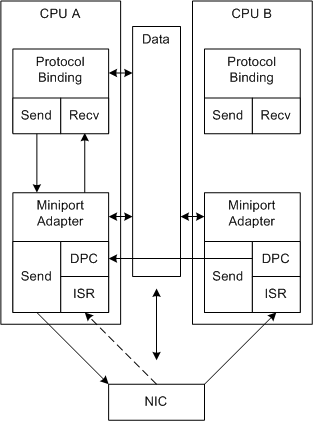

在图中，虚线箭头表示接收处理的备用路径。RSS无法控制接收初始ISR调用的CPU。

**与非RSS接收处理不同，基于RSS的接收处理分布在多个CPU上**。同样，给定连接的处理可以绑定到给定CPU。

**对每个中断重复以下过程**：

* **NIC使用DMA将接收到的数据填充到缓冲区中并中断系统**。初始化期间，微型端口驱动程序在共享内存中分配了接收缓冲区。
* NIC可以随时填充其他接收缓冲区，但是**直到微型端口驱动程序启用中断后才可以再次中断**。系统在一个中断中处理的接收缓冲区可以与许多不同的网络连接相关联。
* NDIS 在系统确定的CPU上调用微型端口驱动程序的微型端口中断功能（ISR）。
* ISR禁用中断并请求NDIS将延迟过程调用（DPC）排队以处理接收到的数据。
* NDIS 在当前CPU上调用MiniportInterruptDPC函数（DPC）。在DPC中：
    a.微型端口驱动程序使用NIC为每个接收到的缓冲区计算的哈希值，并将每个接收到的缓冲区重新分配给与CPU关联的接收队列。
    b.当前DPC请求NDIS为与非空接收队列关联的其他每个CPU的DPC排队。
    c.如果当前DPC在与非空队列关联的CPU上运行，则当前DPC处理关联的接收缓冲区，并在驱动程序堆栈上指示接收到的数据。
    d.分配队列和排队其他DPC需要额外的处理开销。为了提高系统性能，必须通过更好地利用可用CPU来抵消此开销。

* 给定CPU上的DPC：
    a.处理与其接收队列关联的接收缓冲区，并在驱动程序堆栈上指示数据。
    b.如果它是最后一个要完成的DPC，则启用中断。该中断已完成，该过程再次开始。驱动程序必须使用原子操作来标识要完成的最后一个DPC。例如，驱动程序可以使用NdisInterlockedDecrement函数来实现原子计数器。

## 4.2. 带有硬件队列的RSS

[带有硬件排队的RSS](https://docs.microsoft.com/en-us/windows-hardware/drivers/network/rss-with-hardware-queuing)

与具有单个硬件接收队列解决方案的RSS相比，具有硬件排队的RSS可以提高系统性能。支持硬件排队的NIC将接收到的数据分配给多个接收队列。接收队列与CPU相关联。NIC根据哈希值和间接表将接收到的数据分配给CPU。

下图说明了带有NIC接收队列的RSS。
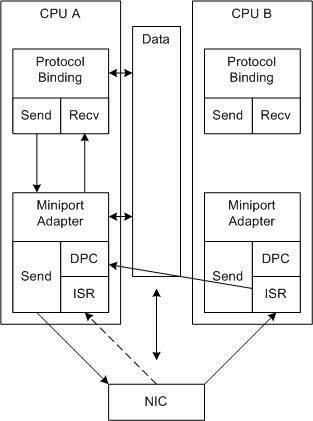

在图中，虚线箭头表示接收处理的备用路径。RSS无法控制接收初始ISR调用的CPU。驱动程序不必将数据排队，因此它可以立即在正确的CPU上调度初始DPC。

对每个中断重复以下过程：

1. **NIC**：

* 使用DMA用接收到的数据填充缓冲区。初始化期间，微型端口驱动程序在共享内存中分配了接收缓冲区。
* 计算哈希值。
* 对CPU的缓冲区进行排队，并将队列分配提供给微型端口驱动程序。例如，在接收到一定数量的数据包之后，NIC可以循环执行步骤1-3和DMA DMA CPU分配列表。具体机制留给NIC设计。
中断系统。系统在一个中断中处理的接收缓冲区在CPU之间分配。

2. NDIS 在系统确定的CPU上调用微型端口驱动程序的[微型端口](https://docs.microsoft.com/en-us/windows-hardware/drivers/ddi/ndis/nc-ndis-miniport_isr)中断功能（ISR）。


3. 微型端口驱动程序请求NDIS将具有非空队列的每个CPU的延迟过程调用（DPC）排队。请注意，所有DPC必须在驱动程序允许中断之前完成。另外，请注意，ISR可能正在没有缓冲区要处理的CPU上运行。

4. NDIS 为每个排队的DPC 调用[MiniportInterruptDPC](https://docs.microsoft.com/en-us/windows-hardware/drivers/ddi/ndis/nc-ndis-miniport_interrupt_dpc)函数。给定CPU上的DPC：

* 生成队列中所有已接收缓冲区的接收描述符，并在驱动程序堆栈上指示数据。有关更多信息，请参见[指示RSS接收数据](https://docs.microsoft.com/en-us/windows-hardware/drivers/network/indicating-rss-receive-data)。
* 如果它是最后一个要完成的DPC，则启用中断。该中断已完成，该过程再次开始。驱动程序必须使用原子操作来标识要完成的最后一个DPC。例如，驱动程序可以使用NdisInterlockedDecrement函数来实现原子计数器。

## 4.3. 带有消息信号中断的RSS

[带有消息信号中断的RSS](https://docs.microsoft.com/en-us/windows-hardware/drivers/network/rss-with-message-signaled-interrupts)

Miniport驱动程序可以支持消息信号中断（MSI），以提高RSS性能。MSI使NIC可以请求CPU上的中断，该中断将处理接收到的数据。有关NDIS对MSI的支持的更多信息，请参见[NDIS MSI-X](https://docs.microsoft.com/en-us/windows-hardware/drivers/network/ndis-msi-x)。

下图说明了带有MSI-X的RSS。

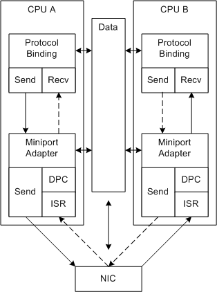


在图中，虚线箭头表示对其他连接的处理。具有MSI-X的RSS允许NIC中断用于连接的正确CPU。

对每个中断重复以下过程：

1. NIC：

* 使用DMA用接收到的数据填充缓冲区。初始化期间，微型端口驱动程序在共享内存中分配了接收缓冲区。
* 计算哈希值。
* 将缓冲区排队到CPU，并将队列分配提供给微型端口驱动程序。例如，在接收到一定数量的数据包之后，NIC可以循环执行步骤1-3和DMA DMA CPU分配列表。具体机制留给NIC设计。
* 使用MSI-X，中断与非空队列关联的CPU。

2. NIC可以随时填充其他接收缓冲区，并将它们添加到队列中，但是直到微型端口驱动程序为该CPU启用中断之前，它才不会再次中断该CPU。

3. NDIS 在当前CPU上调用微型端口驱动程序的ISR（MiniportInterrupt）。

4. ISR禁用当前CPU上的中断，并使DPC在当前CPU上排队。当DPC在当前CPU上运行时，其他CPU上仍然可能发生中断。

5. NDIS 为每个排队的DPC 调用MiniportInterruptDPC函数。每个DPC：

* 生成队列中所有已接收缓冲区的接收描述符，并在驱动程序堆栈上指示数据。有关更多信息，请参见指示RSS接收数据。
* 为当前CPU启用中断。该中断已完成，该过程再次开始。请注意，不需要原子操作即可跟踪其他DPC的进度。


# 5. RSS如何提高系统性能

[RSS如何提高系统性能](https://docs.microsoft.com/en-us/windows-hardware/drivers/network/introduction-to-receive-side-scaling)

**RSS可以通过减少以下方面来提高网络系统的性能：**

* 通过将来自NIC的接收处理**分配到多个CPU**中来处理延迟。这有助于确保在另一个CPU空闲时没有CPU重负荷。
* 通过增加共享数据的软件算法在同一CPU上执行的可能性来增加**自旋锁开销**。例如，当在CPU0上执行的功能拥有对CPU1上运行的功能必须访问的数据的旋转锁时，就会发生旋转锁开销。CPU1旋转（等待），直到CPU0释放锁定。
* 通过增加共享数据的软件算法在同一CPU上执行的可能性来**重新加载缓存**和其他资源。例如，当正在执行并访问CPU0上的共享数据的功能在随后的中断中在CPU1上执行时，会发生这种重新加载。

**为了在安全的环境中实现这些性能改进，RSS提供了以下机制：**

* **分布式处理**：RSS将来自DPC中给定NIC的接收指示的处理分配到多个CPU。
* **有序处理**：RSS保留接收到的数据包的传递顺序。对于每个网络连接，RSS进程在关联的CPU上接收指示。有关RSS接收处理的更多信息，请参阅[指示RSS接收数据](https://docs.microsoft.com/en-us/windows-hardware/drivers/network/indicating-rss-receive-data)。
* **动态负载平衡**：RSS提供了一种随着主机系统负载变化而在CPU之间重新平衡网络处理负载的方法。为了重新平衡负载，上层驱动程序可以更改间接表。有关指定间接表，哈希类型和哈希函数的更多信息，请参见[RSS Configuration](https://docs.microsoft.com/en-us/windows-hardware/drivers/network/rss-configuration)。
* **发送端缩放**：RSS使驱动程序堆栈可以处理同一CPU上给定连接的发送和接收方数据。通常，上层驱动程序（例如TCP）发送数据块的一部分，并在发送剩余数据之前等待确认。然后，确认会触发后续的发送请求。RSS间接表标识用于接收数据处理的特定CPU。默认情况下，如果发送处理由接收确认触发，则在同一CPU上运行。驱动程序还可以指定CPU（例如，如果使用计时器）。
* **安全哈希**：RSS包含一个可提供更高安全性的`签名`。此签名可保护系统免受可能试图迫使系统进入不平衡状态的恶意远程主机的侵害。
* **MSI-X支持**：支持MSI-X（消息信号中断）的RSS在随后执行DPC的同一CPU上运行中断服务程序（ISR）。这减少了自旋锁开销和缓存的重新加载。

[PCIe系列第八讲、MSI和MSI-X中断机制](https://cloud.tencent.com/developer/article/1661649)


# 6. RSS散列类型

[RSS散列类型](https://docs.microsoft.com/en-us/windows-hardware/drivers/network/rss-hashing-types)

RSS哈希类型指定NIC必须用来计算RSS哈希值的接收网络数据部分。

上层驱动程序设置哈希类型，函数和间接表。上层驱动程序设置的哈希类型可以是微型端口驱动程序可以支持的类型的子集。

哈希类型是以下标志的有效组合的或：

* NDIS_HASH_IPV4
* NDIS_HASH_TCP_IPV4
* NDIS_HASH_UDP_IPV4
* NDIS_HASH_IPV6
* NDIS_HASH_TCP_IPV6
* NDIS_HASH_UDP_IPV6
* NDIS_HASH_IPV6_EX
* NDIS_HASH_TCP_IPV6_EX
* NDIS_HASH_UDP_IPV6_EX

```c

/* hash type DPDK 20.05 */
#define	NDIS_HASH_IPV4			0x00000100
#define	NDIS_HASH_TCP_IPV4		0x00000200
#define	NDIS_HASH_IPV6			0x00000400
#define	NDIS_HASH_IPV6_EX		0x00000800
#define	NDIS_HASH_TCP_IPV6		0x00001000
#define	NDIS_HASH_TCP_IPV6_EX		0x00002000

```

这些是有效标志组合的集合：

* IPv4（NDIS_HASH_IPV4，NDIS_HASH_TCP_IPV4和NDIS_HASH_UDP_IPV4的组合）
* IPv6（NDIS_HASH_IPV6，NDIS_HASH_TCP_IPV6和NDIS_HASH_UDP_IPV6的组合）
* 具有扩展头的IPv6（NDIS_HASH_IPV6_EX，NDIS_HASH_TCP_IPV6_EX和NDIS_HASH_UDP_IPV6_EX的组合）

NIC必须支持IPv4集中的一种组合。其他集合和组合是可选的。NIC一次可以支持多个集。在这种情况下，接收到的数据类型将确定NIC使用哪种哈希类型。

通常，如果NIC无法正确解释接收到的数据，则它一定不能计算哈希值。例如，如果NIC仅支持IPv4并且接收到无法正确解释的IPv6数据包，则它不得计算哈希值。如果NIC收到其不支持的传输类型的数据包，则它不得计算哈希值。例如，如果NIC在计算TCP数据包的哈希值时接收到UDP数据包，则它不得计算哈希值。在这种情况下，像在非RSS情况下一样处理分组。有关非RSS接收处理的更多信息，请参见[非RSS接收处理](https://docs.microsoft.com/en-us/windows-hardware/drivers/network/non-rss-receive-processing)。

## 6.1. IPv4哈希类型组合

IPv4集中的有效哈希类型组合为：

* NDIS_HASH_IPV4
* NDIS_HASH_TCP_IPV4
* NDIS_HASH_UDP_IPV4
* NDIS_HASH_TCP_IPV4 | NDIS_HASH_IPV4
* NDIS_HASH_UDP_IPV4 | NDIS_HASH_IPV4
* NDIS_HASH_TCP_IPV4 | NDIS_HASH_UDP_IPV4 | NDIS_HASH_IPV4

### 6.1.1. NDIS_HASH_IPV4

如果仅设置此标志，则NIC应该在以下IPv4标头字段上计算哈希值：

* 源IPv4地址
* 目的IPv4地址

注意：如果NIC收到同时具有IP和TCP标头的数据包，则不应始终使用NDIS_HASH_TCP_IPV4。对于分段IP数据包，必须使用NDIS_HASH_IPV4。这包括同时包含IP和TCP标头的第一个片段。

### 6.1.2. NDIS_HASH_TCP_IPV4
如果仅设置此标志，则NIC应该解析接收到的数据以标识包含TCP段的IPv4数据包。

NIC必须识别并跳过存在的任何IP选项。如果NIC无法跳过任何IP选项，则不应计算哈希值。

NIC应该在以下字段上计算哈希值：

* 源IPv4地址
* 目的IPv4地址
* 源TCP端口
* 目标TCP端口

### 6.1.3. NDIS_HASH_UDP_IPV4

如果仅设置此标志，则NIC应该解析收到的数据，以识别包含UDP数据报的IPv4数据包。

NIC必须识别并跳过存在的任何IP选项。如果NIC无法跳过任何IP选项，则不应计算哈希值。

NIC应该在以下字段上计算哈希值：

* 源IPv4地址
* 目的IPv4地址
* 源UDP端口
* 目的UDP端口

### 6.1.4. NDIS_HASH_TCP_IPV4 | NDIS_HASH_IPV4
如果设置了此标志组合，则NIC应该执行针对NDIS_HASH_TCP_IPV4情况指定的哈希计算。但是，如果数据包不包含TCP头，则NIC应该按照NDIS_HASH_IPV4情况指定的方式计算哈希值。

### 6.1.5. NDIS_HASH_UDP_IPV4 | NDIS_HASH_IPV4
如果设置了此标志组合，则NIC应该执行针对NDIS_HASH_UDP_IPV4情况指定的哈希计算。但是，如果数据包不包含UDP标头，则NIC应该按照NDIS_HASH_IPV4情况指定的方式计算哈希值。

### 6.1.6. NDIS_HASH_TCP_IPV4 | NDIS_HASH_UDP_IPV4 | NDIS_HASH_IPV4
如果设置了此标志组合，则NIC应该按照数据包中的传输指定的方式执行哈希计算。但是，如果数据包不包含TCP或UDP标头，则NIC应该按照NDIS_HASH_IPV4情况指定的方式计算哈希值。

## 6.2. IPv6哈希类型组合
IPv6集中的有效哈希类型组合为：

* NDIS_HASH_IPV6
* NDIS_HASH_TCP_IPV6
* NDIS_HASH_UDP_IPV6
* NDIS_HASH_TCP_IPV6 | NDIS_HASH_IPV6
* NDIS_HASH_UDP_IPV6 | NDIS_HASH_IPV6
* NDIS_HASH_TCP_IPV6 | NDIS_HASH_UDP_IPV6 | NDIS_HASH_IPV6

### 6.2.1. NDIS_HASH_IPV6
如果仅设置此标志，则NIC应该在以下字段上计算哈希：

* 源-IPv6-地址
* 目的IPv6地址

### 6.2.2. NDIS_HASH_TCP_IPV6
如果仅设置此标志，则NIC应该解析接收到的数据以标识包含TCP段的IPv6数据包。NIC必须识别并跳过数据包中存在的所有IPv6扩展标头。如果NIC无法跳过任何IPv6扩展头，则不应计算哈希值。

NIC应该在以下字段上计算哈希值：

* 源IPv6地址
* 目的IPv6地址
* 源TCP端口
* 目标TCP端口

### 6.2.3. NDIS_HASH_UDP_IPV6
如果仅设置此标志，则NIC应该解析接收到的数据，以识别包含UDP数据报的IPv6数据包。NIC必须识别并跳过数据包中存在的所有IPv6扩展标头。如果NIC无法跳过任何IPv6扩展头，则不应计算哈希值。

NIC应该在以下字段上计算哈希值：

* 源-IPv6-地址
* 目的IPv6地址
* 源UDP端口
* 目的UDP端口

### 6.2.4. NDIS_HASH_TCP_IPV6 | NDIS_HASH_IPV6
如果设置了此标志组合，则NIC应该执行针对NDIS_HASH_TCP_IPV6情况指定的哈希计算。但是，如果数据包不包含TCP头，则NIC应该按照NDIS_HASH_IPV6情况指定的方式计算哈希值。

### 6.2.5. NDIS_HASH_UDP_IPV6 | NDIS_HASH_IPV6
如果设置了此标志组合，则NIC应该执行针对NDIS_HASH_UDP_IPV6情况指定的哈希计算。但是，如果数据包不包含UDP标头，则NIC应该按照NDIS_HASH_IPV6情况指定的方式计算哈希值。

### 6.2.6. NDIS_HASH_TCP_IPV6 | NDIS_HASH_UDP_IPV6 | NDIS_HASH_IPV6
如果设置了此标志组合，则NIC应该按照数据包中的传输指定的方式执行哈希计算。但是，如果数据包不包含TCP或UDP标头，则NIC应该按照NDIS_HASH_IPV6情况下指定的方式计算哈希值。


## 6.3. 具有扩展标头哈希类型组合的IPv6
IPv6中设置了扩展头的有效组合为：

* NDIS_HASH_IPV6_EX
* NDIS_HASH_TCP_IPV6_EX
* NDIS_HASH_UDP_IPV6_EX
* NDIS_HASH_TCP_IPV6_EX | NDIS_HASH_IPV6_EX
* NDIS_HASH_UDP_IPV6_EX | NDIS_HASH_IPV6_EX
* NDIS_HASH_TCP_IPV6_EX | NDIS_HASH_UDP_IPV6_EX | NDIS_HASH_IPV6_EX

### 6.3.1. NDIS_HASH_IPV6_EX
如果仅设置此标志，则NIC应该在以下字段上计算哈希：

* IPv6目标选项标头中的“家庭地址”选项中的家庭地址。如果扩展头不存在，请使用源IPv6地址。
* 关联的扩展头中包含在Routing-Header-Type-2中的IPv6地址。如果扩展头不存在，请使用目标IPv6地址。

### 6.3.2. NDIS_HASH_TCP_IPV6_EX
如果仅设置此标志，则NIC应该在以下字段上计算哈希：

* IPv6目标选项标头中的“家庭地址”选项中的家庭地址。如果扩展头不存在，请使用源IPv6地址。
* 关联的扩展头中包含在Routing-Header-Type-2中的IPv6地址。如果扩展头不存在，请使用目标IPv6地址。
* 源TCP端口
* 目标TCP端口

### 6.3.3. NDIS_HASH_UDP_IPV6_EX
如果仅设置此标志，则NIC应该在以下字段上计算哈希：

* IPv6目标选项标头中的“家庭地址”选项中的家庭地址。如果扩展头不存在，请使用源IPv6地址。
* 关联的扩展头中包含在Routing-Header-Type-2中的IPv6地址。如果扩展头不存在，请使用目标IPv6地址。
* 源UDP端口
* 目的UDP端口

### 6.3.4. NDIS_HASH_TCP_IPV6_EX | NDIS_HASH_IPV6_EX
如果设置了此标志组合，则NIC应该执行针对NDIS_HASH_TCP_IPV6_EX情况指定的哈希计算。但是，如果数据包不包含TCP头，则NIC应该按照NDIS_HASH_IPV6_EX情况指定的方式计算哈希值。

### 6.3.5. NDIS_HASH_UDP_IPV6_EX | NDIS_HASH_IPV6_EX
如果设置了此标志组合，则NIC应该执行针对NDIS_HASH_UDP_IPV6_EX情况指定的哈希计算。但是，如果数据包不包含UDP标头，则NIC应该按照NDIS_HASH_IPV6_EX情况指定的方式计算哈希值。

### 6.3.6. NDIS_HASH_TCP_IPV6_EX | NDIS_HASH_UDP_IPV6_EX | NDIS_HASH_IPV6_EX
如果设置了此标志组合，则NIC应该执行由数据包传输指定的哈希计算。但是，如果数据包不包含TCP或UDP标头，则NIC应该按照NDIS_HASH_IPV6_EX情况指定的方式计算哈希值。

* 注意：如果微型端口驱动程序报告NIC的NDIS_RSS_CAPS_HASH_TYPE_TCP_IPV6_EX和/或NDIS_RSS_CAPS_HASH_TYPE_UDP_IPV6_EX功能，则NIC必须根据协议驱动程序设置的IPv6扩展哈希类型来计算哈希值（通过IPv6扩展头中的字段）。NIC可以将扩展哈希类型或常规哈希类型存储在IPv6数据包的NET_BUFFER_LIST结构中，为其计算哈希值。

微型端口驱动程序在指示接收到的数据之前，先在NET_BUFFER_LIST结构中设置哈希类型。有关更多信息，请参见[指示RSS接收数据](https://docs.microsoft.com/en-us/windows-hardware/drivers/network/indicating-rss-receive-data)。


# 7. RSS哈希函数
[RSS哈希函数](https://docs.microsoft.com/en-us/windows-hardware/drivers/network/rss-hashing-functions)

NIC或其微型端口驱动程序使用RSS哈希函数来计算RSS哈希值。

上层驱动程序设置哈希类型，函数和表以将连接分配给CPU。有关更多信息，请参见RSS配置。

哈希函数可以是以下之一：

* NdisHashFunctionToeplitz
* NdisHashFunctionReserved1
* NdisHashFunctionReserved2
* NdisHashFunctionReserved3

```c
/* hash function */
#define	NDIS_HASH_FUNCTION_TOEPLITZ	0x00000001
```

*** 注意：当前，NdisHashFunctionToeplitz是唯一可用于微型端口驱动程序的哈希函数。其他哈希函数保留给NDIS使用。 ***

微型端口驱动程序应在驱动程序指示接收到的数据之前，确定其在每个NET_BUFFER_LIST结构中使用的哈希函数和值。有关更多信息，请参见[指示RSS接收数据](https://docs.microsoft.com/en-us/windows-hardware/drivers/network/indicating-rss-receive-data)。

## 7.1. 例子

以下四个伪代码示例显示了如何计算NdisHashFunctionToeplitz哈希值。这些示例表示NdisHashFunctionToeplitz可用的四种可能的哈希类型。有关哈希类型的更多信息，请参见[RSS哈希类型](https://docs.microsoft.com/en-us/windows-hardware/drivers/network/rss-hashing-types)。

为了简化示例，需要一种处理输入字节流的通用算法。稍后在四个示例中定义字节流的特定格式。

上层驱动程序将`密钥（K）`提供给微型端口驱动程序，以供哈希计算中使用。**密钥的长度为40个字节（320位）**。有关密钥的更多信息，请参见[RSS配置](https://docs.microsoft.com/en-us/windows-hardware/drivers/network/rss-configuration)。

给定一个包含n个字节的输入数组，字节流的定义如下：

```c
input[0] input[1] input[2] ... input[n-1]
```
最左边的字节是输入[0]，输入[0]的最高有效位是最左边的位。最右边的字节是输入[n-1]，而输入[n-1]的最低有效位是最右边的位。

给定上述定义，用于处理一般输入字节流的伪代码定义如下：
```c
ComputeHash(input[], n)

result = 0
For each bit b in input[] from left to right
{
if (b == 1) result ^= (left-most 32 bits of K)
shift K left 1 bit position
}

return result
```
伪代码包含@nm形式的条目。这些条目标识TCP数据包中每个元素的字节范围。

## 7.2. 使用TCP标头对IPv4进行哈希计算的示例

将数据包的SourceAddress，DestinationAddress，SourcePort和DestinationPort字段串联到一个字节数组中，保留它们在数据包中出现的顺序：

```c
Input[12] = @12-15, @16-19, @20-21, @22-23
Result = ComputeHash(Input, 12)
```

## 7.3. 仅适用于IPv4的示例哈希计算
将数据包的SourceAddress和DestinationAddress字段串联到一个字节数组中。

```c
Input[8] = @12-15, @16-19
Result = ComputeHash(Input, 8)
```

## 7.4. 使用TCP标头对IPv6进行哈希计算的示例
将数据包的SourceAddress，DestinationAddress，SourcePort和DestinationPort字段串联成一个字节数组，以保留它们在数据包中的出现顺序。

```c
Input[36] = @8-23, @24-39, @40-41, @42-43
Result = ComputeHash(Input, 36)
```

## 7.5. 仅适用于IPv6的示例哈希计算
将数据包的SourceAddress和DestinationAddress字段串联到一个字节数组中。

```c
Input[32] = @8-23, @24-39
Result = ComputeHash(Input, 32)
```


# 8. 验证RSS哈希计算
[验证RSS哈希计算](https://docs.microsoft.com/en-us/windows-hardware/drivers/network/verifying-the-rss-hash-calculation)
您应该验证您对RSS哈希计算的实现。要验证对NdisHashFunctionToeplitz哈希函数的计算，请使用以下密钥数据：
```
0x6d, 0x5a, 0x56, 0xda, 0x25, 0x5b, 0x0e, 0xc2,
0x41, 0x67, 0x25, 0x3d, 0x43, 0xa3, 0x8f, 0xb0,
0xd0, 0xca, 0x2b, 0xcb, 0xae, 0x7b, 0x30, 0xb4,
0x77, 0xcb, 0x2d, 0xa3, 0x80, 0x30, 0xf2, 0x0c,
0x6a, 0x42, 0xb7, 0x3b, 0xbe, 0xac, 0x01, 0xfa
```
下表提供了NdisHashFunctionToeplitz哈希函数的IPv4版本的验证数据。Destination和Source列包含输入数据，而IPv4列包含结果哈希值。

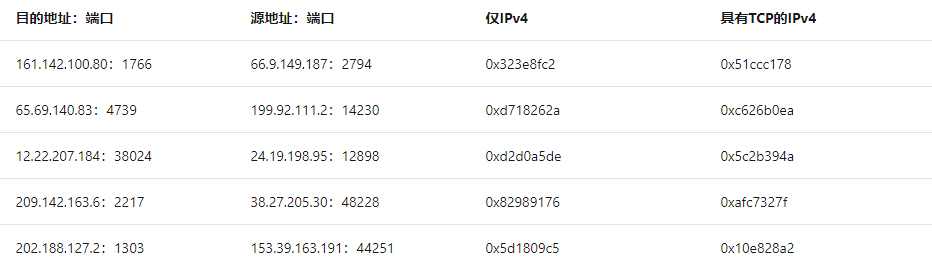

下表包含RSS哈希算法的IPv6版本的验证数据。Destination和Source列包含输入数据，而IPv6列包含结果哈希值。请注意，提供的IPv6地址仅用于验证算法。它们作为实际地址可能没有意义。

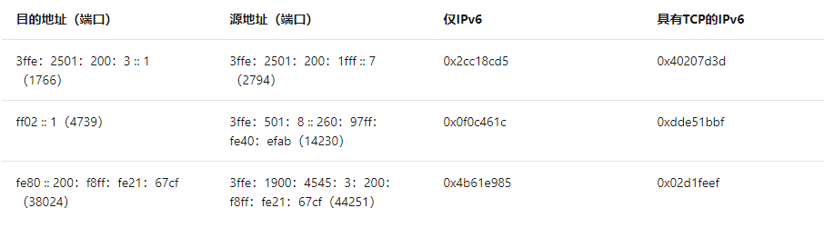

# 9. RSS配置

[RSS配置](https://docs.microsoft.com/en-us/windows-hardware/drivers/network/rss-configuration)

要获取RSS配置信息，上层驱动程序可以将[OID_GEN_RECEIVE_SCALE_CAPABILITIES](https://docs.microsoft.com/en-us/windows-hardware/drivers/network/oid-gen-receive-scale-capabilities)的OID查询发送到微型端口驱动程序。在初始化期间，NDIS还向[NDIS_BIND_PARAMETERS](https://docs.microsoft.com/en-us/windows-hardware/drivers/ddi/ndis/ns-ndis-_ndis_bind_parameters)结构中的上层协议驱动程序提供RSS配置信息。

上层驱动程序选择哈希函数，类型和间接表。要设置这些配置选项，驱动程序将[OID_GEN_RECEIVE_SCALE_PARAMETERS](https://docs.microsoft.com/en-us/windows-hardware/drivers/network/oid-gen-receive-scale-parameters)的OID设置请求发送到微型端口驱动程序。上层驱动程序也可以查询此OID以获取当前的RSS设置。OID_GEN_RECEIVE_SCALE_PARAMETERS OID的信息缓冲区包含一个指向[NDIS_RECEIVE_SCALE_PARAMETERS](https://docs.microsoft.com/en-us/windows-hardware/drivers/ddi/ntddndis/ns-ntddndis-_ndis_receive_scale_parameters)结构的指针。

上层驱动程序可以禁用NIC上的RSS。在这种情况下，驱动程序在NDIS_RECEIVE_SCALE_PARAMETERS结构的Flags成员中设置NDIS_RSS_PARAM_FLAG_DISABLE_RSS标志。设置此标志后，微型端口驱动程序应忽略所有其他标志和设置，并禁用NIC上的RSS。

NDIS在将`OID_GEN_RECEIVE_SCALE_PARAMETERS`传递给微型端口驱动程序之前会对其进行处理，并根据需要更新微型端口适配器的* RSS标准化关键字。有关* RSS关键字的更多信息，请参见RSS的[标准化INF关键字](https://docs.microsoft.com/en-us/windows-hardware/drivers/network/standardized-inf-keywords-for-rss)。

收到设置了NDIS_RSS_PARAM_FLAG_DISABLE_RSS标志的[OID_GEN_RECEIVE_SCALE_PARAMETERS](https://docs.microsoft.com/en-us/windows-hardware/drivers/network/oid-gen-receive-scale-parameters)设置请求后，微型端口驱动程序应在初始化后将NIC的RSS状态设置为NIC的初始状态。因此，如果微型端口驱动程序收到随后清除了NDIS_RSS_PARAM_FLAG_DISABLE_RSS标志的后续OID_GEN_RECEIVE_SCALE_PARAMETERS设置请求，则所有参数都应具有与微型端口驱动程序在微型端口适配器首次初始化后收到OID_GEN_RECEIVE_SCALE_PARAMETERS设置请求之后设置的相同值。

上层驱动程序可以使用[OID_GEN_RECEIVE_HASH](https://docs.microsoft.com/en-us/windows-hardware/drivers/network/oid-gen-receive-hash) OID启用和配置接收帧上的哈希计算，而无需启用RSS。上层驱动程序也可以查询此OID以获取当前的接收哈希设置。

OID_GEN_RECEIVE_HASH OID的信息缓冲区包含一个指向[NDIS_RECEIVE_HASH_PARAMETERS](https://docs.microsoft.com/en-us/windows-hardware/drivers/ddi/ntddndis/ns-ntddndis-_ndis_receive_hash_parameters)结构的指针。对于设置请求，OID指定微型端口适配器应使用的哈希参数。对于查询请求，OID返回微型端口适配器正在使用的哈希参数。对于支持RSS的驱动程序，此OID是可选的。

注意   如果启用了接收哈希计算，则NDIS在启用RSS之前会禁用接收哈希计算。如果启用了RSS，则NDIS在启用接收哈希计算之前将禁用RSS。

微型端口驱动程序支持的所有微型端口适配器必须为所有后续协议绑定提供相同的哈希配置设置。该OID还包括微型端口驱动程序或NIC必须用于哈希计算的密钥。密钥长320位（40字节），可以包含上层驱动程序选择的任何数据，例如，随机字节流。

为了重新平衡处理负载，上层驱动程序可以设置RSS参数并修改间接表。通常，除间接表外，所有参数均保持不变。但是，初始化RSS后，上层驱动程序可能会更改其他RSS初始化参数。如有必要，微型端口驱动程序可以重置NIC硬件，以更改哈希函数，哈希密钥，哈希类型，基本CPU编号或用于索引间接表的位数。

注意   上层驱动程序可以随时设置这些参数。这可能会导致乱序接收指示。在这种情况下，不需要支持TCP的Miniport驱动程序清除其接收队列。

下图提供了间接表两个实例的示例内容。

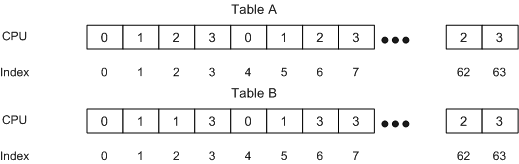

上图假定为四个处理器配置，并且从哈希值使用的最低有效位的数量为6位。因此，间接表包含64个条目。

在图中，表A列出了初始化后立即在间接表中的值。后来，随着正常流量负载的变化，处理器负载会变得不平衡。上层驱动程序检测到不平衡状况，并通过定义新的间接表来尝试重新平衡负载。表B列出了新的间接表值。在表B中，来自CPU 2的部分负载已移至CPU 1和3。

注意   更改间接表后，在短时间内（正在处理当前接收描述符队列时），可以在错误的CPU上处理数据包。这是正常的瞬态情况。

间接表的大小通常是系统中处理器数量的2至8倍。

当微型端口驱动程序将数据包分发给CPU时，如果CPU太多，则分配负载所花费的精力可能会变得过高。在这种情况下，上层驱动程序应选择在其上进行网络数据处理的一部分CPU。

在某些情况下，可用硬件接收队列的数量可能少于系统上的CPU数量。微型端口驱动程序必须检查间接表以确定与硬件队列关联的CPU号。如果出现在间接表中的不同CPU数量的总数大于NIC支持的硬件队列的数量，则微型端口驱动程序必须从间接表中选择CPU数量的子集。该子集的数量等于硬件队列的数量。微型端口驱动程序从[OID_GEN_RECEIVE_SCALE_PARAMETERS](https://docs.microsoft.com/en-us/windows-hardware/drivers/network/oid-gen-receive-scale-parameters)获得了IndirectionTableSize参数。微型端口驱动程序为响应OID_GEN_RECEIVE_SCALE_CAPABILITIES 指定了NumberOfReceiveQueues值。


# 10. 指示RSS接收数据

[指示RSS接收数据](https://docs.microsoft.com/en-us/windows-hardware/drivers/network/indicating-rss-receive-data)

微型端口驱动程序通过从其[MiniportInterruptDPC](https://docs.microsoft.com/en-us/windows-hardware/drivers/ddi/ndis/nc-ndis-miniport_interrupt_dpc)函数调用[NdisMIndicateReceiveNetBufferLists](https://docs.microsoft.com/en-us/windows-hardware/drivers/ddi/ndis/nf-ndis-ndismindicatereceivenetbufferlists)函数来指示接收到的数据。

```c
void NdisMIndicateReceiveNetBufferLists(
  NDIS_HANDLE      MiniportAdapterHandle,
  PNET_BUFFER_LIST NetBufferList,
  NDIS_PORT_NUMBER PortNumber,
  ULONG            NumberOfNetBufferLists,
  ULONG            ReceiveFlags
);
```

NIC成功计算RSS哈希值之后，驱动程序应使用以下宏在[NET_BUFFER_LIST](https://docs.microsoft.com/en-us/windows-hardware/drivers/ddi/ndis/ns-ndis-_net_buffer_list)结构中存储哈希类型，哈希函数和哈希值：

```c
typedef struct _NET_BUFFER_LIST {
  union {
    struct {
      PNET_BUFFER_LIST Next;
      PNET_BUFFER      FirstNetBuffer;
    };
    SLIST_HEADER           Link;
    NET_BUFFER_LIST_HEADER NetBufferListHeader;
  };
  PNET_BUFFER_LIST_CONTEXT Context;
  PNET_BUFFER_LIST         ParentNetBufferList;
  NDIS_HANDLE              NdisPoolHandle;
  PVOID                    NdisReserved[2];
  PVOID                    ProtocolReserved[4];
  PVOID                    MiniportReserved[2];
  PVOID                    Scratch;
  NDIS_HANDLE              SourceHandle;
  ULONG                    NblFlags;
  LONG                     ChildRefCount;
  ULONG                    Flags;
  union {
    NDIS_STATUS Status;
    ULONG       NdisReserved2;
  };
  PVOID                    NetBufferListInfo[MaxNetBufferListInfo];
} NET_BUFFER_LIST, *PNET_BUFFER_LIST;
```

[NET_BUFFER_LIST_SET_HASH_TYPE](https://docs.microsoft.com/en-us/windows-hardware/drivers/ddi/ndis/nf-ndis-net_buffer_list_set_hash_type)
```c
void NET_BUFFER_LIST_SET_HASH_TYPE(
  PNET_BUFFER_LIST _NBL,
  volatile ULONG   _HashType
);
```
[NET_BUFFER_LIST_SET_HASH_FUNCTION](https://docs.microsoft.com/en-us/windows-hardware/drivers/ddi/ndis/nf-ndis-net_buffer_list_set_hash_function)
```c
void NET_BUFFER_LIST_SET_HASH_FUNCTION(
  PNET_BUFFER_LIST _NBL,
  volatile ULONG   _HashFunction
);
```

[NET_BUFFER_LIST_SET_HASH_VALUE](https://docs.microsoft.com/en-us/windows-hardware/drivers/ddi/ndis/nf-ndis-net_buffer_list_set_hash_function)

```c
void NET_BUFFER_LIST_SET_HASH_VALUE(
   _NBL,
   _HashValue
);
```

散列类型标识了应在其上计算散列的接收数据包区域。有关哈希类型的更多信息，请参见[RSS哈希类型](https://docs.microsoft.com/en-us/windows-hardware/drivers/network/rss-hashing-types)。散列函数标识用于计算散列值的函数。有关哈希函数的更多信息，请参见[RSS哈希函数](https://docs.microsoft.com/en-us/windows-hardware/drivers/network/rss-hashing-functions)。协议驱动程序在初始化时选择哈希类型和功能。有关更多信息，请参见[RSS配置](https://docs.microsoft.com/en-us/windows-hardware/drivers/network/rss-configuration)。

如果NIC无法识别哈希类型指定的数据包区域，则不应进行任何哈希计算或缩放。在这种情况下，微型端口驱动程序或NIC应该将接收到的数据分配给默认CPU。

如果NIC用完接收缓冲区，则必须在原始接收DPC返回后立即返回每个缓冲区。微型端口驱动程序可以使用NDIS_STATUS_RESOURCES状态指示接收到的数据。在这种情况下，上层驱动程序必须经过一条缓慢的路径，即复制缓冲区描述符并立即放弃对原始描述符的所有权。

有关接收网络数据的更多信息，请参阅[接收网络数据](https://docs.microsoft.com/en-us/windows-hardware/drivers/network/receiving-network-data)。


# 11. 使用DPDK配置RSS

DPDK支持RSS功能，静态哈希键和间接表的配置。每个端口都配置RSS，分发取决于端口上配置的RX队列的数量。

DPDK要做的是获取端口的RX队列，并开始在间接表中重复写入它们。

例如，如果我们有一个配置了RSS的端口和3个配置了索引0、1和2的RX队列，那么大小为128的间接表将如下所示：

```
{0,1,2,0,1,2,0……}（索引0..127）
```

流量分布在这些RX队列之间，应用程序负责（如果选择的话）负责轮询不同CPU中的每个队列。

* 要在DPDK中配置RSS，必须在端口rte_eth_conf结构中启用它。
* 设置rx_mode.mq_mode = ETH_MQ_RX_RSS
* 编辑RSS配置结构：rx_adv_conf.rss_conf（更改哈希键或将NULL保留为默认值，然后选择RSS模式）


启用RSS时，每个传入的数据包（`rte_mbuf`）的元数据结构中都具有RSS哈希值结果，因此可以在mbuf.hash.rss中对其进行访问，因为其他应用程序（提示：流表）以后可以使用，所以将其全部使用此哈希值，而无需重新计算哈希。

可以在运行时重新配置间接表（称为RETA），这意味着应用程序可以动态更改每个间接表索引发送流量的队列。

RETA配置功能是针对每个轮询模式驱动程序实现的，例如，对于ixgbe驱动程序，请查找以下功能：

`ixgbe_dev_rss_reta_update`和`ixgbe_dev_rss_reta_query`


# 12. DPDK的RSS数据结构

```c
/**
 * A structure used to configure the Receive Side Scaling (RSS) feature
 * of an Ethernet port.
 * If not NULL, the *rss_key* pointer of the *rss_conf* structure points
 * to an array holding the RSS key to use for hashing specific header
 * fields of received packets. The length of this array should be indicated
 * by *rss_key_len* below. Otherwise, a default random hash key is used by
 * the device driver.
 *
 * The *rss_key_len* field of the *rss_conf* structure indicates the length
 * in bytes of the array pointed by *rss_key*. To be compatible, this length
 * will be checked in i40e only. Others assume 40 bytes to be used as before.
 *
 * The *rss_hf* field of the *rss_conf* structure indicates the different
 * types of IPv4/IPv6 packets to which the RSS hashing must be applied.
 * Supplying an *rss_hf* equal to zero disables the RSS feature.
 */
struct rte_eth_rss_conf {
	uint8_t *rss_key;    /**< If not NULL, 40-byte hash key. */
	uint8_t rss_key_len; /**< hash key length in bytes. */
	uint64_t rss_hf;     /**< Hash functions to apply - see below. */
};
```

* rss_key：rss_key 数组。如果 为 NULL，留给网卡设置 rss_key。
* rss_key_len：rss_key数组的字节数。
* rss_hf：需要对报文的分析的元组类型。常用的组合有 l3: ETH_RSS_IP, l3+l4: ETH_RSS_IP | ETH_RSS_UDP | ETH_RSS_TCP。

# 13. RSS在`port_init`的配置

```c
// 端口的配置信息
struct rte_eth_conf port_conf =
{
#if 1
	.rxmode = {
    	//.split_hdr_size = 0,
    	.mq_mode = ETH_MQ_RX_RSS,	// 使用RSS分流
	},
	.rx_adv_conf = {
		.rss_conf = {
			.rss_key = NULL,		// 留给网卡设置 rss_key	
			// .rss_key_len = 0,		// rss_key数组的字节数
			.rss_hf = ETH_RSS_IP	// 通过l3层 tuple计算rss hash
					| ETH_RSS_UDP	// 通过l4层 UDP tuple计算rss hash
					| ETH_RSS_TCP,
					// | ETH_RSS_SCTP,	// 通过l4层 TCP tuple计算rss hash
			// .rss_hf  = ETH_RSS_IP ,	// l3层tuple计算rss hash
		},
	},
#endif
#if 0		
		.fdir_conf = {
		.mode = RTE_FDIR_MODE_PERFECT,
		.pballoc = RTE_FDIR_PBALLOC_64K,
		.status = RTE_FDIR_REPORT_STATUS,
		.drop_queue = 127,
		.mask = {
			.vlan_tci_mask = 0x0,
			.ipv4_mask = {
				.src_ip = 0xFFFFFFFF,
				.dst_ip = 0xFFFFFFFF,
			},
			.src_port_mask = 0xFFFF,
			.dst_port_mask = 0xFF00,

			.mac_addr_byte_mask = 0xFF,
			.tunnel_type_mask = 1,
			.tunnel_id_mask = 0xFFFFFFFF,

		},
		.drop_queue = 127,
	},
#endif

#if 0
	.txmode = {
		.offloads =
			DEV_TX_OFFLOAD_VLAN_INSERT |
			DEV_TX_OFFLOAD_IPV4_CKSUM |
			DEV_TX_OFFLOAD_UDP_CKSUM |
			DEV_TX_OFFLOAD_TCP_CKSUM |
			DEV_TX_OFFLOAD_SCTP_CKSUM |
			DEV_TX_OFFLOAD_TCP_TSO,
	},
#endif
};
```

`DPDK 20.05`的`rte_eth_conf`结构如下：

```c
/**
 * A structure used to configure an Ethernet port.
 * Depending upon the RX multi-queue mode, extra advanced
 * configuration settings may be needed.
 */
struct rte_eth_conf {
	uint32_t link_speeds; /**< bitmap of ETH_LINK_SPEED_XXX of speeds to be
				used. ETH_LINK_SPEED_FIXED disables link
				autonegotiation, and a unique speed shall be
				set. Otherwise, the bitmap defines the set of
				speeds to be advertised. If the special value
				ETH_LINK_SPEED_AUTONEG (0) is used, all speeds
				supported are advertised. */
	struct rte_eth_rxmode rxmode; /**< Port RX configuration. */
	struct rte_eth_txmode txmode; /**< Port TX configuration. */
	uint32_t lpbk_mode; /**< Loopback operation mode. By default the value
			         is 0, meaning the loopback mode is disabled.
				 Read the datasheet of given ethernet controller
				 for details. The possible values of this field
				 are defined in implementation of each driver. */
	struct {
		struct rte_eth_rss_conf rss_conf; /**< Port RSS configuration */
		struct rte_eth_vmdq_dcb_conf vmdq_dcb_conf;
		/**< Port vmdq+dcb configuration. */
		struct rte_eth_dcb_rx_conf dcb_rx_conf;
		/**< Port dcb RX configuration. */
		struct rte_eth_vmdq_rx_conf vmdq_rx_conf;
		/**< Port vmdq RX configuration. */
	} rx_adv_conf; /**< Port RX filtering configuration. */
	union {
		struct rte_eth_vmdq_dcb_tx_conf vmdq_dcb_tx_conf;
		/**< Port vmdq+dcb TX configuration. */
		struct rte_eth_dcb_tx_conf dcb_tx_conf;
		/**< Port dcb TX configuration. */
		struct rte_eth_vmdq_tx_conf vmdq_tx_conf;
		/**< Port vmdq TX configuration. */
	} tx_adv_conf; /**< Port TX DCB configuration (union). */
	/** Currently,Priority Flow Control(PFC) are supported,if DCB with PFC
	    is needed,and the variable must be set ETH_DCB_PFC_SUPPORT. */
	uint32_t dcb_capability_en;
	struct rte_fdir_conf fdir_conf; /**< FDIR configuration. DEPRECATED */
	struct rte_intr_conf intr_conf; /**< Interrupt mode configuration. */
};
```


# 14. rss_key条件

* `对称rss_key`条件下，一共四个队列，结果rss通过hash之后分流到其中两个队列 0和3，`分流效果不好`（相同的IP在同一个队列）。
* `非对称rss_key`条件下，rss通过hash之后分流到四个队列，`分流效果均衡`（相同的IP分到不同的队列）


# 15. 对称RSS

[对称RSS](http://galsagie.github.io/2015/02/26/dpdk-tips-1/)
[DPDK 之 Symmetric Receive-side Scaling](https://blog.csdn.net/force_eagle/article/details/82461141)


在网络应用程序中，具有相同CPU处理连接的两侧（称为**对称流**）非常重要。许多网络应用程序需要保存有关连接的信息，并且您不希望在两个CPU之间共享此信息，这会引入锁定，这是性能不佳的选择。

RSS算法通常使用`Toeplitz哈希函数`，此函数需要两个输入：**静态哈希密钥和从数据包中提取的元组**。

问题在于，DPDK中使用的默认哈希密钥（也是Microsoft推荐的密钥）不会将对称流分配给同一CPU。

**例如，如果我们有以下数据包**
```
{src ip = 1.1.1.1，dst ip = 2.2.2.2，src port = 123，dst port = 88}，
```
**则对称数据包**
```
{src ip = 2.2.2.2，dst ip = 1.1.1.1，src port = 88，dst port = 123}
```
可能没有相同的哈希结果。

我不想过多地了解哈希计算的内部原理，但是可以通过更改哈希键（如我先前所示，可以在DPDK配置中对其进行更改）来`实现对称的RSS`，因此键的前32位必须相同到第二个32位，随后的16位应与接下来的16位相同。

使用该密钥可实现对称的RSS，问题在于更改此密钥会导致不同核心之间的流量分配不正确。

但是不要害怕！因为有解决这个问题的方法。一群聪明的人发现，有一个特定的哈希键既可以为您提供对称的流量分布，又可以为您提供统一的`哈希键`（与默认键相同）

我可以说我做了一些测试，以检查此密钥与随机ip流量的均匀分布，发现它是好的（对称的）。哈希键（以防您不想阅读文档）是：

```c
/*
 * It is used to allocate the memory for hash key.
 * The hash key size is NIC dependent.
 */
#define RSS_HASH_KEY_LENGTH 64

static uint8_t hash_key [RSS_HASH_KEY_LENGTH] = {
    0x6D，0x5A，0x6D，0x5A，0x6D，0x5A，0x6D，0x5A，0x6D，0x5A，0x6D，0x5A，0x6D，0x5A，0x6，0x6，0x6，0x6A 0x5A，0x6D，0x5A，0x6D，0x5A，0x6D，0x5A，0x6D，0x5A，0x6D，0x5A，0x6D，0x5A，0x6D，0x5A，0x6D，0x5A，0x6D，0x5A，}
```

您可以将DPDK配置为在RSS高级配置结构中使用它，如上所示。


## 15.1. DNA中基于硬件的对称流平衡
[Hardware-based Symmetric Flow Balancing in DNA](https://www.ntop.org/pf_ring/hardware-based-symmetric-flow-balancing-in-dna/)

多年前，`Microsoft定义了RSS（接收方缩放）`，其目标是通过使多个内核同时处理数据包来改善数据包处理。如今，RSS已在现代的`1-10 Gbit`网络适配器中实现，作为一种跨RX队列分发数据包的方式。当接收到传入的数据包时，网络适配器（在硬件中）对数据包进行解码，并对主要数据包头字段（例如IP地址和端口）进行哈希处理。`哈希结果用于标识数据包将排队进入哪个入口RX队列`。

为了均匀地平衡RX队列上的流量，RSS实现了**非对称哈希**。这意味着属于主机A和主机B之间的TCP连接的数据包将进入两个不同的队列：A到B进入队列X，B到A进入队列Y。此机制保证流量尽可能在所有可用队列上分配，但是它有一些缺点，因为需要分析双向流量的应用程序（例如，网络监视和安全应用程序）将需要从所有队列中读取数据包同时接收两个指示。**这意味着非对称RSS限制了应用程序的可伸缩性**，因为每个RX队列无法启动一个应用程序（因此，您拥有的队列更多，您可以启动的应用越多），有必要从所有队列中读取数据包，以便同时接收两个通路信息。相反，在可伸缩系统中，应用程序必须能够独立运行，以便每个应用程序都是一个独立的系统，如下图所示。

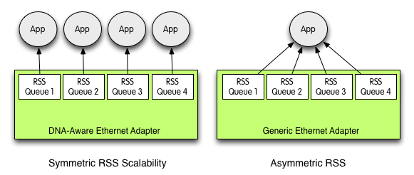

在PF_RING DNA中，我们添加了通过**软件重新配置RSS机制**的功能，以便DNA / libzero应用程序可以确定所需的RSS类型（非DNA应用程序尚不能重新配置RSS）。通常，非对称RSS对于按分组运行的应用程序（例如，网桥）就足够了，而对称RSS是IDS / IPS和网络监控应用程序等需要完整流可见性的应用程序的理想解决方案。

对称RSS的优点在于，现在可以通过将应用程序绑定到各个队列来实现可伸缩性。例如，假设您有一个8队列可识别DNA的网络适配器，则可以启动8个snort实例，并将每个实例绑定到不同的队列（即`dna0 @ 0，dna0 @ 1…，dna0 @ 7`）和核心。然后，每个实例都独立于其他实例，并且可以看到流量的两个方向，因此可以正常运行。

对于那些需要不基于数据包头的高级流量平衡的用户（例如，您要根据呼叫者的电话号码来平衡VoIP呼叫），可以使用libzero。在PF_RING演示应用程序中，我们基于[libzero](https://www.ntop.org/products/pf_ring/libzero-for-dna/)创建了几个示例（[pfdbacluster_master](https://svn.ntop.org/svn/ntop/trunk/PF_RING/userland/examples/pfdnacluster_master.c)和[pfdnacluster_multithread](https://svn.ntop.org/svn/ntop/trunk/PF_RING/userland/examples/pfdnacluster_multithread.c)），演示了如何实现灵活的数据包平衡（请参见两个应用程序的-m命令行选项）。


# 16. 软件RSS

RSS的一大优势是，它可以在硬件中完成，当然也可以在不支持RSS的情况下完成软件实现，或者也可以在TX端执行统一分发。

在本系列的后面部分中，我将描述动态负载分配的实现，但是与此同时，您可以看看toeplitz hash的这种软件实现作为参考。


# 17. DPDK中的多队列和RSS

[Multiple queue and RSS in DPDK](http://hustcat.github.io/rss-in-dpdk/)

## 17.1. 接收队列

rte_eth_dev->data（对应结构体rte_eth_dev_data）保存设备的（接收／发送）队列信息：
```c
struct rte_eth_dev_data {
	char name[RTE_ETH_NAME_MAX_LEN]; /**< Unique identifier name */

	void **rx_queues; /**< Array of pointers to RX queues. */
	void **tx_queues; /**< Array of pointers to TX queues. */
	uint16_t nb_rx_queues; /**< Number of RX queues. */
	uint16_t nb_tx_queues; /**< Number of TX queues. */
///...
```

rx_queues为接收队列指针数组，每个指针指向和一个具体的接收队列，以igb驱动(drivers/net/e1000)为例：

```c
/**
 * Structure associated with each RX queue.
 */
struct igb_rx_queue {
	struct rte_mempool  *mb_pool;   /**< mbuf pool to populate RX ring. */
	volatile union e1000_adv_rx_desc *rx_ring; /**< RX ring virtual address. */
	uint64_t            rx_ring_phys_addr; /**< RX ring DMA address. */
	volatile uint32_t   *rdt_reg_addr; /**< RDT register address. */
	volatile uint32_t   *rdh_reg_addr; /**< RDH register address. */
	struct igb_rx_entry *sw_ring;   /**< address of RX software ring. */
	struct rte_mbuf *pkt_first_seg; /**< First segment of current packet. */
	struct rte_mbuf *pkt_last_seg;  /**< Last segment of current packet. */
	uint16_t            nb_rx_desc; /**< number of RX descriptors. */
	uint16_t            rx_tail;    /**< current value of RDT register. */
	uint16_t            nb_rx_hold; /**< number of held free RX desc. */
	uint16_t            rx_free_thresh; /**< max free RX desc to hold. */
	uint16_t            queue_id;   /**< RX queue index. */
	uint16_t            reg_idx;    /**< RX queue register index. */
	uint8_t             port_id;    /**< Device port identifier. */
	uint8_t             pthresh;    /**< Prefetch threshold register. */
	uint8_t             hthresh;    /**< Host threshold register. */
	uint8_t             wthresh;    /**< Write-back threshold register. */
	uint8_t             crc_len;    /**< 0 if CRC stripped, 4 otherwise. */
	uint8_t             drop_en;  /**< If not 0, set SRRCTL.Drop_En. */
};
```
每个队列包含一个硬件描述符`ring(rx_ring)`和一个软件描述符`ring(sw_ring)`，`rx_ring`主要由驱动与硬件使用，`sw_ring`实际上是是一个`mbuf`指针，主要由DPDK应用程序使用。

* e1000_adv_rx_desc
* 
硬件描述符，所有的`e1000_adv_rx_desc`构成一个环形DMA缓冲区。对于接收数据时，pkt_addr指向rte_mbuf->buf_physaddr，从而使得网卡收到数据时，将数据写到mbuf对应的数据缓冲区。

```c
/* Receive Descriptor - Advanced */
union e1000_adv_rx_desc {
	struct {
		__le64 pkt_addr; /* Packet buffer address */
		__le64 hdr_addr; /* Header buffer address */
	} read;
	struct {
		struct {
			union {
				__le32 data;
				struct {
					__le16 pkt_info; /*RSS type, Pkt type*/
					/* Split Header, header buffer len */
					__le16 hdr_info;
				} hs_rss;
			} lo_dword;
			union {
				__le32 rss; /* RSS Hash */
				struct {
					__le16 ip_id; /* IP id */
					__le16 csum; /* Packet Checksum */
				} csum_ip;
			} hi_dword;
		} lower;
		struct {
			__le32 status_error; /* ext status/error */
			__le16 length; /* Packet length */
			__le16 vlan; /* VLAN tag */
		} upper;
	} wb;  /* writeback */
};
```

* igb_rx_entry
每个硬件描述符都有一个对应的软件描述符，它是DPDK应用程序与DPDK驱动之间进行数据传递的桥梁，它实际上是一个rte_mbuf的指针，`rte_mbuf->buf_physaddr`为DMA的物理地址，由网卡硬件使用，`rte_mbuf->buf_addr`为buffer的虚拟地址，由DPDK应用程序使用。

```c
/**
 * Structure associated with each descriptor of the RX ring of a RX queue.
 */
struct igb_rx_entry {
	struct rte_mbuf *mbuf; /**< mbuf associated with RX descriptor. */
};

/**
 * The generic rte_mbuf, containing a packet mbuf.
 */
struct rte_mbuf {
	MARKER cacheline0;

	void *buf_addr;           /**< Virtual address of segment buffer. */
	/**
	 * Physical address of segment buffer.
	 * Force alignment to 8-bytes, so as to ensure we have the exact
	 * same mbuf cacheline0 layout for 32-bit and 64-bit. This makes
	 * working on vector drivers easier.
	 */
	phys_addr_t buf_physaddr __rte_aligned(sizeof(phys_addr_t));
///...
```

## 17.2. 配置队列

DPDK应用程序可以调用rte_eth_dev_configure设置Port的队列数量：

```c
ret = rte_eth_dev_configure(portid, nb_rx_queue,
					(uint16_t)n_tx_queue, &port_conf);
```

rte_eth_dev_configure会调用rte_eth_dev_rx_queue_config和rte_eth_dev_tx_queue_config设置接收队列和发送队列：


```
rte_eth_dev_configure
|---rte_eth_dev_rx_queue_config
|---rte_eth_dev_tx_queue_config
```

配置接收队列：
```c
static int
rte_eth_dev_rx_queue_config(struct rte_eth_dev *dev, uint16_t nb_queues)
{
	uint16_t old_nb_queues = dev->data->nb_rx_queues;
	void **rxq;
	unsigned i;

	if (dev->data->rx_queues == NULL && nb_queues != 0) { /* first time configuration */
		dev->data->rx_queues = rte_zmalloc("ethdev->rx_queues",
				sizeof(dev->data->rx_queues[0]) * nb_queues,
				RTE_CACHE_LINE_SIZE);
		if (dev->data->rx_queues == NULL) {
			dev->data->nb_rx_queues = 0;
			return -(ENOMEM);
		}
	}
///...
```

接收队列建立：rte_eth_rx_queue_setup

DPDK application都会调用rte_eth_rx_queue_setup初始化接收队列。

```c
int
rte_eth_rx_queue_setup(uint8_t port_id, uint16_t rx_queue_id,
		       uint16_t nb_rx_desc, unsigned int socket_id,
		       const struct rte_eth_rxconf *rx_conf,
		       struct rte_mempool *mp)
{
///...
	ret = (*dev->dev_ops->rx_queue_setup)(dev, rx_queue_id, nb_rx_desc,
					      socket_id, rx_conf, mp); ///eth_igb_ops, eth_igb_rx_queue_setup
}
```
eth_igb_rx_queue_setup会创建接收队列igb_rx_queue，分配RX ring hardware descriptors(e1000_adv_rx_desc)和software ring(igb_rx_entry):

```c
int
eth_igb_rx_queue_setup(struct rte_eth_dev *dev,
			 uint16_t queue_idx,
			 uint16_t nb_desc,
			 unsigned int socket_id,
			 const struct rte_eth_rxconf *rx_conf,
			 struct rte_mempool *mp)
{
	const struct rte_memzone *rz;
	struct igb_rx_queue *rxq;
	struct e1000_hw     *hw;
	unsigned int size;

	hw = E1000_DEV_PRIVATE_TO_HW(dev->data->dev_private);
///...
	/* First allocate the RX queue data structure. */
	rxq = rte_zmalloc("ethdev RX queue", sizeof(struct igb_rx_queue),
			  RTE_CACHE_LINE_SIZE);
///...
	/*
	 *  Allocate RX ring hardware descriptors. A memzone large enough to
	 *  handle the maximum ring size is allocated in order to allow for
	 *  resizing in later calls to the queue setup function.
	 */
	size = sizeof(union e1000_adv_rx_desc) * E1000_MAX_RING_DESC;
	rz = rte_eth_dma_zone_reserve(dev, "rx_ring", queue_idx, size,
				      E1000_ALIGN, socket_id);
///...
	rxq->rdt_reg_addr = E1000_PCI_REG_ADDR(hw, E1000_RDT(rxq->reg_idx));
	rxq->rdh_reg_addr = E1000_PCI_REG_ADDR(hw, E1000_RDH(rxq->reg_idx));
	rxq->rx_ring_phys_addr = rte_mem_phy2mch(rz->memseg_id, rz->phys_addr);
	rxq->rx_ring = (union e1000_adv_rx_desc *) rz->addr;

	/* Allocate software ring. */
	rxq->sw_ring = rte_zmalloc("rxq->sw_ring",
				   sizeof(struct igb_rx_entry) * nb_desc,
				   RTE_CACHE_LINE_SIZE);
}
```
eth_igb_rx_queue_setup主要完成DMA描述符环形队列的初始化。

## 17.3. RSS

通过`rx_mode.mq_mode = ETH_MQ_RX_RSS`（rte_eth_dev_configure）可以开启Port的RSS，以`l3fwd`为例：
```c
static struct rte_eth_conf port_conf = {
	.rxmode = {
		.mq_mode = ETH_MQ_RX_RSS,
		.max_rx_pkt_len = ETHER_MAX_LEN,
		.split_hdr_size = 0,
		.header_split   = 0, /**< Header Split disabled */
		.hw_ip_checksum = 1, /**< IP checksum offload enabled */
		.hw_vlan_filter = 0, /**< VLAN filtering disabled */
		.jumbo_frame    = 0, /**< Jumbo Frame Support disabled */
		.hw_strip_crc   = 1, /**< CRC stripped by hardware */
	},
	.rx_adv_conf = {
		.rss_conf = {
			.rss_key = NULL,
			.rss_hf = ETH_RSS_IP,
		},
	},
	.txmode = {
		.mq_mode = ETH_MQ_TX_NONE,
	},
};
```

驱动igb的RSS配置

`eth_igb_start -> eth_igb_rx_init -> igb_dev_mq_rx_configure`
```c
//drivers/net/e1000/igb_rxtx.c
static int
igb_dev_mq_rx_configure(struct rte_eth_dev *dev)
{
	struct e1000_hw *hw =
		E1000_DEV_PRIVATE_TO_HW(dev->data->dev_private);
	uint32_t mrqc;

	if (RTE_ETH_DEV_SRIOV(dev).active == ETH_8_POOLS) {
		/*
		 * SRIOV active scheme
		 * FIXME if support RSS together with VMDq & SRIOV
		 */
		mrqc = E1000_MRQC_ENABLE_VMDQ;
		/* 011b Def_Q ignore, according to VT_CTL.DEF_PL */
		mrqc |= 0x3 << E1000_MRQC_DEF_Q_SHIFT;
		E1000_WRITE_REG(hw, E1000_MRQC, mrqc);
	} else if(RTE_ETH_DEV_SRIOV(dev).active == 0) { ///disable SRIOV
		/*
		 * SRIOV inactive scheme
		 */
		switch (dev->data->dev_conf.rxmode.mq_mode) {
			case ETH_MQ_RX_RSS:
				igb_rss_configure(dev); ///RSS
				break;
///...
}

static void
igb_rss_configure(struct rte_eth_dev *dev)
{
///...
	if (rss_conf.rss_key == NULL)
		rss_conf.rss_key = rss_intel_key; /* Default hash key */
	igb_hw_rss_hash_set(hw, &rss_conf);
}
```


# 18. 知识扩展

[Windows 10体系结构](https://docs.microsoft.com/en-us/windows-hardware/drivers/network/cellular-architecture-and-driver-model#windows10-architecture)

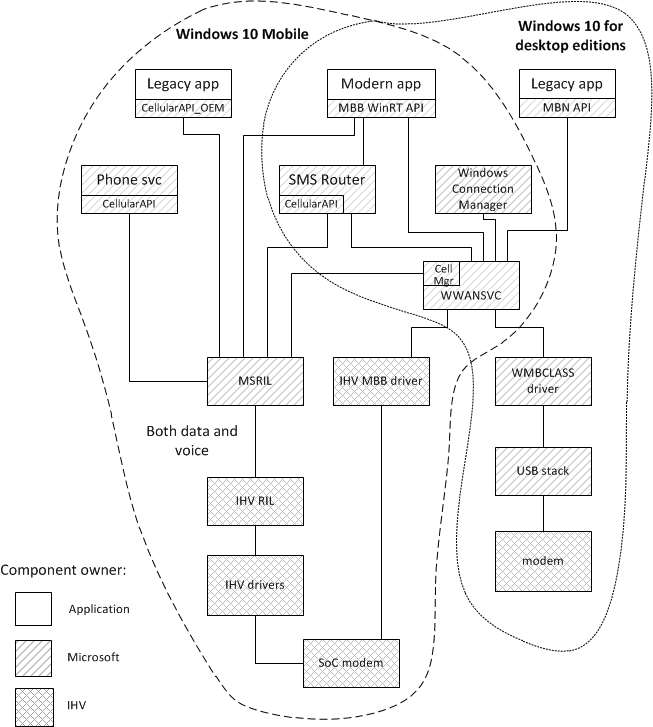


<br/>
<div align=right>以上内容由RTOAX翻译整理自网络。
	 
</div>


