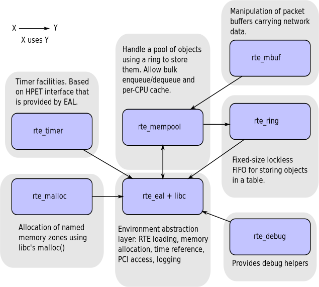

<div align=center>
	 
</div>
<br/>
<br/>

<center><font size='20'>DPDK笔记 DPDK 概述</font></center>
<br/>
<br/>
<center><font size='5'>RToax</font></center>
<center><font size='5'>2020年9月</font></center>
<br/>
<br/>
<br/>
<br/>

# 1. 概述

[概述](https://doc.dpdk.org/guides/prog_guide/overview.html)

本节概述了数据平面开发套件（DPDK）的体系结构。

DPDK的主要目标是为数据平面应用程序中的快速数据包处理提供一个简单，完整的框架。用户可以使用该代码来理解所采用的某些技术，在其基础上进行原型设计或添加他们自己的协议栈。提供了使用DPDK的替代生态系统选项。

该框架通过创建环境抽象层（EAL）为特定环境创建了一组库，该库可能特定于英特尔®体系结构（32位或64位），Linux *用户空间编译器或一个特定的平台。这些环境是通过使用make文件和配置文件创建的。创建EAL库后，用户可以与该库链接以创建自己的应用程序。还提供了EAL之外的其他库，包括哈希，最长前缀匹配（LPM）和ring库。提供了示例应用程序，以帮助向用户展示如何使用DPDK的各种功能。

DPDK实现了从头到尾的数据包处理模型，其中必须在调用Data Plane应用程序之前分配所有资源，这些应用程序在逻辑处理核心上作为执行单元运行。该模型不支持调度程序，并且所有设备都可以通过轮询访问。**不使用中断**的主要原因是中断处理带来的性能开销。

除了运行完成模型之外，还可以通过通过环在内核之间传递数据包或消息来使用流水线模型。这允许分阶段执行工作，并可以更有效地使用内核上的代码。

## 1.1. 开发环境

DPDK项目的安装需要Linux和相关的工具链，例如一个或多个编译器，汇编器，make实用程序，编辑器以及各种库，才能创建DPDK组件和库。

一旦为特定的环境和体系结构创建了这些库，便可以将它们用于创建用户的数据平面应用程序。

在为Linux用户空间创建应用程序时，将使用glibc库。对于DPDK应用程序，在编译应用程序之前必须配置两个环境变量（RTE_SDK和RTE_TARGET）。以下是如何设置变量的示例：

```bash
export RTE_SDK=/home/user/DPDK
export RTE_TARGET=x86_64-native-linux-gcc
```

## 1.2. 环境抽象层
环境抽象层（EAL）提供了一个通用接口，该接口对应用程序和库隐藏了特定于环境的信息。EAL提供的服务是：

* DPDK加载和启动
* 支持多进程和多线程执行类型
* 核心亲和力/分配程序
* 系统内存分配/取消分配
* 原子/锁定操作
* 时间参考
* PCI总线访问
* 跟踪和调试功能
* CPU功能识别
* 中断处理
* 报警操作
* 内存管理（malloc）

EAL在“ [环境抽象层](https://doc.dpdk.org/guides/prog_guide/env_abstraction_layer.html#environment-abstraction-layer)”中有完整描述。

## 1.3. 核心组件

核心组件是一组提供所有需要的用于高性能分组处理应用的元件库。



### 1.3.1. 环管理器（librte_ring）

环形结构在有限大小的表中提供了无锁的多生产者，多消费者的FIFO API。与无锁队列相比，它具有一些优势。易于实施，适应批量操作且速度更快。环由[内存池管理器（librte_mempool）](https://doc.dpdk.org/guides/prog_guide/mempool_lib.html#mempool-library) 使用，并且可以用作内核和/或在逻辑内核上连接在一起的执行块之间的常规通信机制。

[环形库](https://doc.dpdk.org/guides/prog_guide/ring_lib.html#ring-library)中对此环形缓冲区及其用法进行了详细说明。


### 1.3.2. 内存池管理器（librte_mempool）
内存池管理器负责在内存中分配对象池。池按名称标识，并使用环存储空闲对象。它提供了一些其他可选服务，例如每核对象缓存和对齐帮助器，以确保填充对象以将它们平均分配到所有RAM通道上。

此内存池分配器在[Mempool库](https://doc.dpdk.org/guides/prog_guide/mempool_lib.html#mempool-library)中进行了描述 。

### 1.3.3. 网络数据包缓冲区管理（librte_mbuf）
mbuf库提供了创建和销毁缓冲区的功能，DPDK应用程序可以使用该缓冲区来存储消息缓冲区。消息缓冲区是在启动时创建的，并使用DPDK内存池库存储在内存池中。

该库提供了一个API，用于分配/释放mbuf，操纵用于承载网络数据包的数据包缓冲区。

[Mbuf库](https://doc.dpdk.org/guides/prog_guide/mbuf_lib.html#mbuf-library)中描述了网络数据包缓冲区管理。

### 1.3.4. 计时器管理器（librte_timer）
该库为DPDK执行单元提供计时器服务，从而能够异步执行功能。它可以是定期函数调用，也可以是单次调用。它使用环境抽象层（EAL）提供的计时器接口来获取精确的时间参考，并且可以根据需要在每个内核上启动。

该库文档可在[Timer Library](https://doc.dpdk.org/guides/prog_guide/timer_lib.html#timer-library)中找到。

## 1.4. 以太网*轮询模式驱动程序体系结构
DPDK包括用于1 GbE，10 GbE和40GbE的轮询模式驱动程序（PMD），以及专用于虚拟化的虚拟virtio以太网控制器，这些控制器设计为无需异步的，基于中断的信令机制即可工作。

请参阅 [轮询模式驱动程序](https://doc.dpdk.org/guides/prog_guide/poll_mode_drv.html#poll-mode-driver)。

## 1.5. 数据包转发算法支持
DPDK包括哈希（librte_hash）和最长前缀匹配（LPM，librte_lpm）库，以支持相应的数据包转发算法。

有关更多信息，请参见[哈希库](https://doc.dpdk.org/guides/prog_guide/hash_lib.html#hash-library)和 [LPM库](https://doc.dpdk.org/guides/prog_guide/lpm_lib.html#lpm-library)。

## 1.6. librte_net
librte_net库是IP协议定义和便捷宏的集合。它基于FreeBSD * IP堆栈中的代码，并包含协议编号（用于IP标头），与IP相关的宏，IPv4 / IPv6标头结构以及TCP，UDP和SCTP标头结构。


<br/>
<div align=right>以上内容由RTOAX翻译整理。
	 
</div>