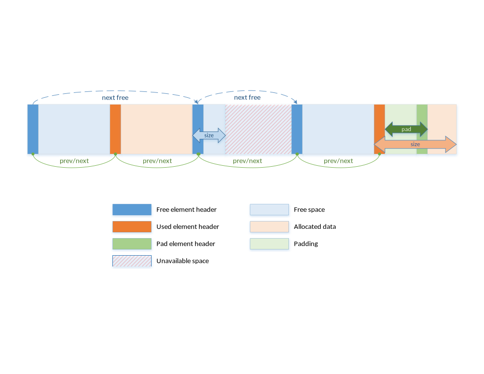

<div align=center>
	 
</div>
<br/>
<br/>

<center><font size='20'>DPDK笔记 DPDK 环境抽象层EAL</font></center>
<br/>
<br/>
<center><font size='5'>RToax</font></center>
<center><font size='5'>2020年9月</font></center>
<br/>
<br/>
<br/>
<br/>


[环境抽象层EAL](https://doc.dpdk.org/guides/prog_guide/env_abstraction_layer.html)

环境抽象层（EAL）负责访问低级资源，例如硬件和内存空间。它提供了一个通用接口，可从应用程序和库中隐藏环境细节。初始化例程负责确定如何分配这些资源（即，内存空间，设备，计时器，控制台等）。

EAL预期的典型服务是：

* **DPDK的加载和启动**：DPDK及其应用程序链接为单个应用程序，必须通过某种方式进行加载。
* **核心亲和力/分配过程**：EAL提供了用于将执行单元分配给特定核心以及创建执行实例的机制。
* **系统内存预留**​​：EAL有助于预留不同的内存区域，例如，用于设备交互的物理内存区域。
* **跟踪和调试功能**：日志，dump_stack，紧急情况等。
* **实用程序功能**：libc中未提供的自旋锁和原子计数器。
* **CPU功能标识**：在运行时确定是否支持特定功能，例如，英特尔®AVX。确定当前CPU是否支持编译二进制文件的功能集。
* **中断处理**：用于注册/注销特定中断源的回调的接口。
* **警报功能**：用于设置/删除在特定时间运行的回调的接口。

# 1. 在Linux用户级执行环境中进行EAL
在Linux用户空间环境中，DPDK应用程序使用pthread库作为用户空间应用程序运行。

EAL使用hugetlbfs中的mmap（）执行物理内存分配（使用巨大的页面大小来提高性能）。此内存公开给DPDK服务层，例如[Mempool库](https://doc.dpdk.org/guides/prog_guide/mempool_lib.html#mempool-library)。

此时，将初始化DPDK服务层，然后通过`pthread setaffinity`调用，将每个执行单元分配给特定的逻辑核心，以作为用户级线程运行。

时间参考由CPU时间戳计数器（TSC）或HPET内核API通过mmap（）调用提供。

## 1.1. 初始化和核心启动
初始化的一部分由glibc的start函数完成。在初始化时也会执行检查，以确保CPU支持在配置文件中选择的微体系结构类型。然后，调用main（）函数。核心初始化和启动在`rte_eal_init（）`中完成（请参阅API文档）。它包含对pthread库的调用（更具体地说，是`pthread_self（）`，`pthread_create（）`和`pthread_setaffinity_np（）`）。

Linux应用程序环境中的EAL初始化


> 注意:对象的初始化，例如内存区域，环，内存池，lpm表和哈希表，应作为主lcore上整个应用程序初始化的一部分进行。这些对象的创建和初始化函数不是多线程安全的。但是，一旦初始化，对象本身就可以安全地同时在多个线程中使用。

## 1.2. 关机和清理
在EAL初始化期间，核心组件可以分配诸如大页支持的内存之类的资源。`rte_eal_init() `通过调用该`rte_eal_cleanup()`函数可以释放在分配期间分配的内存。有关详细信息，请参阅API文档。

## 1.3. 多进程支持
Linux EAL允许多进程以及多线程（pthread）部署模型。有关更多详细信息，请参见“ [多进程支持](https://doc.dpdk.org/guides/prog_guide/multi_proc_support.html#multi-process-support)”一章 。

## 1.4. 内存映射发现和内存保留
大型连续物理内存的分配是使用`hugetlbfs`内核文件系统完成的。EAL提供了一个API，可以在此连续内存中保留命名的内存区域。该存储区的保留内存的物理地址也由存储区保留API返回给用户。

DPDK内存子系统可以在两种模式下运行：动态模式和旧模式。两种模式在下面说明。

> 注意:使用rte_malloc提供的API进行的内存保留也由hugetlbfs文件系统的页面支持。

## 1.5. 动态内存模式
当前，仅在Linux上支持此模式。

在这种模式下，DPDK应用程序对大页面的使用将根据应用程序的请求而增加和减少。任何内存分配通过`rte_malloc()`， `rte_memzone_reserve()`或其它方法，可能潜在地导致更大页面正在从系统预留。同样，任何内存重新分配都可能导致大页面被释放回系统。

不能保证在此模式下分配的内存是IOVA连续的。如果需要大块连续的IOVA（“大”定义为“多个页面”），建议对所有物理设备使用VFIO驱动程序（这样IOVA和VA地址可以相同，从而绕过）完整的物理地址），或使用旧版内存模式。

对于必须是IOVA连续的内存块，建议使用` rte_memzone_reserve()`带有`RTE_MEMZONE_IOVA_CONTIG`指定标志的函数。这样，内存分配器将确保无论使用哪种内存模式，保留的内存都将满足要求，否则分配将失败。

无需在启动时使用`-m`或 `--socket-mem`命令行参数预分配任何内存，但是仍然可以这样做，在这种情况下，预分配内存将被“固定”（即，**应用程序永远不会释放回系统**） 。可以分配更多的大页面，然后将其取消分配，但是任何预分配的页面都不会被释放。如果既未指定也`-m`未`--socket-mem`指定，则不会预先分配内存，并且将根据需要在运行时分配所有内存。

在动态内存模式下使用的另一个可用选项是 `--single-file-segments`命令行选项。此选项会将页面放在单个文件中（每个`memseg`列表），而不是每页创建一个文件。通常不需要这样做，但是对于诸如userspace vhost之类的用例很有用，在这些用例中，可以传递给VirtIO的页面文件描述符数量有限。

如果应用程序（或DPDK内部代码，例如设备驱动程序）希望接收有关新分配的内存的通知，则可以通过`rte_mem_event_callback_register()`函数注册内存事件回调。每当DPDK的内存映射已更改时，它将调用回调函数。

如果希望向应用程序（或DPDK内部代码，例如设备驱动程序）通知高于指定阈值的内存分配（并有机会拒绝它们），则也可以通过`rte_mem_alloc_validator_callback_register()`函数使用分配验证程序回调 。

EAL提供了一个默认的验证程序回调，可以通过`--socket-limit`命令行选项启用该回调 ，以一种简单的方式来限制DPDK应用程序可以使用的最大内存量。

> 警告:内存子系统内部使用DPDK IPC，因此不得将内存分配/回调和IPC混合使用：在与内存相关的或IPC回调中分配/释放内存是不安全的，并且在与内存相关的回调中使用IPC是不安全的。有关DPDK IPC的更多详细信息，请参见多进程支持一章 。

## 1.6. 旧版内存模式
通过将`--legacy-mem`命令行开关指定为EAL 启用此模式。此开关对FreeBSD无效，因为FreeBSD无论如何仅支持传统模式。

此模式模仿EAL的历史行为。也就是说，EAL将在启动时保留所有内存，将所有内存分类为大的IOVA连续块，并且不允许在运行时从系统获取或释放大页面。

如果既未指定也`-m`未`--socket-mem`指定，则整个可用的大页面内存将被预先分配。

## 1.7. 大页分配匹配
通过指定`--match-allocations`到EAL 的命令行开关来启用此行为。此开关仅适用于Linux，并且`--legacy-memnor` 不支持 `--no-huge`。

某些使用内存事件回调的应用程序可能要求完全按照分配的大小释放大页。这些应用程序可能还要求来自malloc堆的任何分配都不能跨越与两个不同的内存事件回调相关联的分配。这些类型的应用程序可以使用大页分配匹配来满足这两个要求。这可能会导致某些内存使用量增加，这在很大程度上取决于应用程序的内存分配模式。

## 1.8. 32位支持

在32位模式下运行时，存在其他限制。在动态内存模式下，默认情况下最多将预分配2 GB的VA空间，并且所有空间都将位于主lcore NUMA节点上，除非使用了`--socket-mem`标志。

在传统模式下，只会为请求的段预分配VA空间（加上填充以保持IOVA连续性）。

## 1.9. 最大内存量
在启动时会预先分配可用于DPDK进程中的大页映射的所有可能的虚拟内存空间，从而对DPDK应用程序可以拥有的内存量设置上限。DPDK内存存储在段列表中，每个段严格是一个物理页。通过编辑以下配置变量，可以更改启动时预分配的虚拟内存量：

* `CONFIG_RTE_MAX_MEMSEG_LISTS` 控制DPDK可以拥有多少段列表
* `CONFIG_RTE_MAX_MEM_MB_PER_LIST` 控制每个段列表可以处理多少兆字节的内存
* `CONFIG_RTE_MAX_MEMSEG_PER_LIST` 控制每个段可以有多少段
* `CONFIG_RTE_MAX_MEMSEG_PER_TYPE` 控制每种内存类型可以具有多少段（其中“类型”定义为“页面大小+ NUMA节点”组合）
* `CONFIG_RTE_MAX_MEM_MB_PER_TYPE` 控制每种内存类型可以寻址多少兆字节的内存
* `CONFIG_RTE_MAX_MEM_MB` 将全局最大值放在DPDK可以保留的内存量上

通常，这些选项不需要更改

>注意:不要将**预分配的虚拟内存**与**预分配的大页内存**混淆！所有DPDK进程在启动时都会预分配虚拟内存。以后可以将大页映射到该预分配的VA空间（如果启用了动态内存模式），并且可以选择在启动时映射到它。


## 1.10. 段文件描述符

在Linux上，大多数情况下，EAL会将段文件描述符存储在EAL中。当使用较小的页面大小时，由于`glibc`库的基本限制，这可能会成为问题。例如，诸如Linux之类的API调用`select()`可能无法正常工作，因为glibc它不支持超过一定数量的文件描述符。

有两种可能的解决方案。推荐的解决方案是使用`--single-file-segments`模式，因为该模式将不会在每个页面上使用文件描述符，并且它将通过vhost-user后端与Virtio保持兼容性。使用`--legacy-mem` 模式时此选项不可用。

另一种选择是使用更大的页面尺寸。由于需要较少的页面来覆盖相同的内存区域，因此EAL将在内部存储较少的文件描述符。


## 1.11. 支持外部分配的内存

可以在DPDK中使用外部分配的内存。使用外部分配的内存有两种工作方式：malloc堆API和手动内存管理。

* 使用堆API来为外部分配的内存
 
建议使用一组malloc堆API，以在DPDK中使用外部分配的内存。这样，通过重载套接字ID来实现对外部分配的内存的支持-外部分配的堆将具有套接字ID，在正常情况下，该套接字ID将被视为无效。请求从指定的外部分配内存中进行分配是将正确的套接字ID直接（例如，通过调用`rte_malloc`）或间接（通过特定于数据结构的分配API `rte_ring_create`）提供给DPDK分配器的问题。使用这些API还可以确保为添加到DPDK malloc堆的任何内存段也执行DMA的外部分配内存的映射。

由于DPDK无法验证内存是否可用或有效，因此该责任由用户承担。所有多进程同步也是用户的责任，并确保所有对**添加/附加/分离/删除**内存的调用均以正确的顺序进行。不需要在所有进程中都附加到存储区-仅在需要时附加到存储区。

预期的工作流程如下：

* 获取指向存储区的指针
* 创建一个命名堆
* 将内存区域添加到堆
    如果未指定IOVA表，则将假定IOVA地址不可用，并且将不执行DMA映射
    其他进程必须先附加到内存区域，然后才能使用它
    
* 获取用于堆的套接字ID

* 使用提供的套接字ID使用正常的DPDK分配过程

* 如果不再需要内存区域，则可以将其从堆中删除
    必须先从此内存区域分离其他进程，然后才能将其删除
* 如果不再需要堆，请将其删除
    套接字ID将变为无效，并且将不会重用
    
有关更多信息，请参阅`rte_malloc`API文档，特别`rte_malloc_heap_*`是函数调用系列。

* 使用没有DPDK API的外部分配的内存

**建议使用`堆`API**，在DPDK中使用外部分配的内存，但在某些用例中，DPDK堆API的开销是不希望的-例如，在外部分配的区域上执行手动内存管理时。为了支持在外部DPDK工作流中不使用外部分配的内存的用例，`rte_extmem_*`命名空间下还有另一组API 。

这些API（顾名思义）旨在允许向DPDK的`内部页表注册`或从DPDK的内部页表中`注销`外部分配的内存，以允许API `rte_mem_virt2memseg`等与外部分配的内存一起使用。以这种方式添加的内存将不适用于任何常规DPDK分配器；DPDK将保留此内存供用户应用程序管理。

预期的工作流程如下：

* 获取指向存储区的指针

* 在DPDK中注册内存
    如果未指定IOVA表，则将假定IOVA地址不可用
    其他进程必须先附加到内存区域，然后才能使用它
* `rte_dev_dma_map`根据需要执行DMA映射

* 在应用程序中使用存储区

* 如果不再需要存储区，则可以取消注册
    如果该区域是为DMA映射的，则必须在取消注册内存之前执行取消映射
    其他进程必须与存储区分离，然后才能取消注册

由于这些外部分配的存储区将不受DPDK的管理，因此，由用户应用程序决定如何注册它们以及如何使用它们。


## 1.12. 每个核心和共享变量

>注意:lcore指处理器的逻辑执行单元，有时也称为硬件线程。

共享变量是默认行为。使用线程本地存储（TLS）实现每个内核变量，以提供每个线程本地存储。

## 1.13. 日志
EAL提供了一个日志记录API。默认情况下，在Linux应用程序中，日志既发送到syslog，也发送到控制台。但是，用户可以覆盖日志功能以使用其他日志记录机制。

## 1.14. 跟踪和调试功能
有一些调试功能可以将堆栈转储到glibc中。`rte_panic（）`函数可以自动引发`SIG_ABORT`，这可以触发gdb可读的核心文件的生成。

## 1.15. CPU功能识别
EAL可以在运行时查询CPU（使用rte_cpu_get_features（）函数）以确定哪些CPU功能可用。

## 1.16. 用户空间中断事件

## 1.17. **主机线程中的用户空间中断和警报处理**

EAL创建一个主机线程以轮询UIO设备文件描述符以检测中断。回调可以通过EAL函数针对特定的中断事件进行注册或注销，并可以在主机线程中**异步调用**。EAL还允许以与NIC中断相同的方式使用定时回调。

> 注意:在DPDK PMD中，专用主机线程处理的唯一中断是那些用于链接状态更改（链接打开和链接关闭通知）和突然移除设备的中断。

## 1.18. RX中断事件

每个PMD提供的接收和发送例程不会限制自己以轮询线程模式执行。为了以极小的吞吐量缓解空闲轮询，暂停轮询并等待唤醒事件发生是很有用的。`RX中断`是发生此类唤醒事件的首选，但可能并非唯一。

EAL为此事件驱动的线程模式提供了事件API。以Linux为例，其实现依赖于`epoll`。每个线程可以监视一个epoll实例，在该实例中添加了所有唤醒事件的文件描述符。根据`UIO / VFIO`规范创建事件文件描述符并将其映射到中断向量。从FreeBSD的角度来看，kqueue是替代方法，但尚未实现。

EAL初始化事件文件描述符和中断向量之间的映射，而每个设备初始化中断向量和队列之间的映射。这样，EAL实际上不知道特定向量上的中断原因。`eth_dev`驱动程序负责编程后面的映射。

>注意:每个队列的RX中断事件仅在支持多个`MSI-X`向量的VFIO中允许。在UIO中，RX中断与其他中断原因共享相同的向量。在这种情况下，当同时启用RX中断和LSC（链接状态更改）中断时`（intr_conf.lsc == 1 && intr_conf.rxq == 1）`，仅前者才有能力。

RX中断由ethdev API-'`rte_eth_dev_rx_intr_ *`'控制/启用/禁用。如果PMD还不支持它们，它们将返回失败。`intr_conf.rxq`标志用于打开每个设备的RX中断功能。


## 1.19. 设备移除事件

该事件由在总线级别卸下设备触发。它的基础资源可能已变得不可用（即未映射PCI映射）。PMD必须确保在这种情况下，应用程序仍可以安全地使用其回调。

可以按照订阅链接状态更改事件的相同方式来订阅此事件。因此，执行上下文是相同的，即它是专用的中断主机线程。

考虑到这一点，应用程序很可能希望关闭已发出设备移除事件的设备。在这种情况下，调用 `rte_eth_dev_close()`可以触发它取消注册自己的设备删除事件回调。必须注意不要从中断处理程序上下文中关闭设备。必须重新计划这种关闭操作。


## 1.20. 列入黑名单
EAL PCI设备黑名单功能可用于将某些NIC端口标记为已列入黑名单，因此DPDK将忽略它们。使用PCIe *描述（Domain：Bus：Device.Function）标识要列入黑名单的端口。

## 1.21. 其他功能
锁和原子操作是基于体系结构的（i686和x86_64）。

## 1.22. IOVA模式检测

通过考虑系统上当前可用的设备需要和/或支持的内容来选择IOVA模式。

在FreeBSD上，RTE_IOVA_PA始终是默认值。在Linux上，基于下面详细介绍的两步启发式检测IOVA模式。

第一步，EAL向每条总线询问有关IOVA模式的要求，然后确定首选的IOVA模式。

* 如果所有总线都报告RTE_IOVA_PA，则首选的IOVA模式为RTE_IOVA_PA，
* 如果所有总线都报告RTE_IOVA_VA，则首选的IOVA模式为RTE_IOVA_VA，
* 如果所有总线都报告RTE_IOVA_DC，则没有总线表示优先，则首选模式为RTE_IOVA_DC，
* 如果总线不同意（至少一个总线需要RTE_IOVA_PA，至少一个总线需要RTE_IOVA_VA），则首选的IOVA模式为RTE_IOVA_DC（请参见下面的“物理地址可用性”检查），

如果总线未表示要选择哪种IOVA模式，则使用以下逻辑选择默认值：

* 如果物理地址不可用，则使用RTE_IOVA_VA模式
* 如果/ sys / kernel / iommu_groups不为空，则使用RTE_IOVA_VA模式
* 否则，使用RTE_IOVA_PA模式

如果总线在其首选的IOVA模式上存在分歧，则由于该决定，部分总线将无法工作。

第二步检查首选模式是否符合“物理地址”可用性，因为这些仅对最近内核中的root用户可用。即，如果首选模式是RTE_IOVA_PA，但是无法访问物理地址，则EAL初始化会尽早失败，因为以后对设备的探测仍然会失败。

在大多数情况下，由于以下原因，首选使用RTE_IOVA_VA模式作为默认模式：

* 无论物理地址是否可用，所有驱动程序均应在RTE_IOVA_VA模式下工作。
* 默认情况下，内存池首先使用来请求IOVA连续内存 RTE_MEMZONE_IOVA_CONTIG。在RTE_IOVA_PA模式下，此速度很慢，并且可能会影响应用程序的启动时间。
* 在VA模式下使用IOVA可以轻松实现大量IOVA连续内存用例。

预期所有PCI驱动程序都可以在RTE_IOVA_PA和RTE_IOVA_VA模式下工作。

如果PCI驱动程序不支持RTE_IOVA_PA模式，则该 RTE_PCI_DRV_NEED_IOVA_AS_VA标志用于指示该PCI驱动程序只能在RTE_IOVA_VA模式下工作。

当检测到KNI内核模块时，首选RTE_IOVA_PA模式，因为在RTE_IOVA_VA模式下预期会降低性能。

## 1.23. IOVA模式配置
当存在未直接连接到总线的虚拟设备时，基于探测总线和IOMMU配置的IOVA模式自动检测可能不会报告所需的寻址模式。为了便于将IOVA模式强制为特定值，--iova-mode可以使用EAL命令行选项来选择物理寻址（'pa'）或虚拟寻址（'va'）。


# 2. 内存段和内存区域（memzone）

EAL中的此功能提供了**物理内存的映射**。由于物理内存可能存在间隙，因此在描述符表中描述该内存，并且每个描述符（称为`rte_memseg`）都描述一个**物理页**。

最重要的是，memzone分配器的作用是保留物理内存的连续部分。保留内存时，这些区域由唯一名称标识。

rte_memzone描述符也位于配置结构中。使用`rte_eal_get_configuration（）`访​​问此结构。对存储区的查找（按名称）将返回一个描述符，其中包含该存储区的物理地址。

通过提供align参数，可以使用特定的起始地址对齐来保留存储区（默认情况下，它们会与缓存行大小对齐）。对齐值应为2的幂，且不得小于缓存行大小（64字节）。如果两个存储区都在系统上可用，也可以从2 MB或1 GB的大页中保留存储区。

memsegs和memzones都是使用`rte_fbarray`结构存储的。有关更多信息，请参考DPDK API参考。


# 3. 多线程

DPDK通常**每个内核固定一个pthread**，以避免任务切换的开销。这可以显着提高性能，但缺乏灵活性，而且并不总是有效的。

电源管理通过限制CPU运行时间来帮助提高CPU效率。但是，也可以利用可用的空闲周期来利用CPU的全部功能。

通过利用cgroup，可以简单地分配CPU利用率配额。这提供了另一种提高CPU效率的方法，但是有一个先决条件。DPDK必须处理每个内核在多个pthread之间的上下文切换。

为了获得更大的灵活性，不仅将pthread亲和性设置给CPU，而且还设置给CPU集是很有用的。


## 3.1. EAL pthread和lcore Affinity

术语“ lcore”是指EAL线程，它实际上是Linux / FreeBSD pthread。“ EAL pthreads”由EAL创建和管理，并执行remote_launch发出的任务。在每个EAL pthread中，都有一个称为_lcore_id的TLS（线程本地存储）用于唯一标识。由于EAL pthread通常将1：1绑定到物理CPU，因此_lcore_id通常等于CPU ID。

但是，当使用多个pthread时，在EAL pthread和指定的物理CPU之间的绑定不再总是1：1。EAL pthread可能与CPU集有关联，因此_lcore_id将与CPU ID不同。因此，定义了一个EAL长选项'-lcores'来分配lcores的CPU关联性。对于指定的lcore ID或ID组，该选项允许设置该EAL pthread的CPU集。

格式模式：
```
–lcores=’<lcore_set>[@cpu_set][,<lcore_set>[@cpu_set],...]’
```
“ lcore_set”和“ cpu_set”可以是单个数字，范围或组。

数字是`“digit([0-9]+)”; a range is “<number>-<number>”; a group is “(<number|range>[,<number|range>,...])”.`

如果未提供“ @cpu_set”值，则“ cpu_set”的值将默认为“ lcore_set”的值。

```
For example, "--lcores='1,2@(5-7),(3-5)@(0,2),(0,6),7-8'" which means start 9 EAL thread;
    lcore 0 runs on cpuset 0x41 (cpu 0,6);
    lcore 1 runs on cpuset 0x2 (cpu 1);
    lcore 2 runs on cpuset 0xe0 (cpu 5,6,7);
    lcore 3,4,5 runs on cpuset 0x5 (cpu 0,2);
    lcore 6 runs on cpuset 0x41 (cpu 0,6);
    lcore 7 runs on cpuset 0x80 (cpu 7);
    lcore 8 runs on cpuset 0x100 (cpu 8).
```

使用此选项，可以为每个给定的lcore ID分配关联的CPU。它也与corelist（'-l'）选项的模式兼容。

## 3.2. 非EAL pthread支持
可以将DPDK执行上下文与任何用户pthread（也称为非EAL pthread）一起使用。有两种非EAL pthread：

已通过调用成功分配了具有有效_lcore_id的已注册非EAL pthread `rte_thread_register()`，
具有LCORE_ID_ANY的未注册非EAL pthread，
对于未注册的非EAL pthread（具有LCORE_ID_ANY _lcore_id），某些库将使用替代的唯一ID（例如TID），一些库将完全不受影响，某些库将起作用，但有局限性（例如计时器和内存池）。

所有这些影响都在“ 已知问题”部分中提到。

## 3.3. 公共线程API

有两个公共API `rte_thread_set_affinity()`，它们`rte_thread_get_affinity()`是针对线程引入的。在任何pthread上下文中使用它们时，将设置/获取线程本地存储（TLS）。

这些TLS包括_cpuset和_socket_id：

* _cpuset存储与pthread相关的CPU位图。
* _socket_id存储CPU集的NUMA节点。如果CPU集中的CPU属于不同的NUMA节点，则_socket_id将设置为SOCKET_ID_ANY。

## 3.4. 控制线程API

可以使用公共API创建控制线程 rte_ctrl_thread_create()。这些线程可用于管理/基础架构任务，并且由DPDK在内部使用，以实现多进程支持和中断处理。

这些线程将在原始进程CPU亲缘关系的CPU上进行调度，而数据平面和服务核心不包括在其中。

例如，在8个CPU的系统上，使用-l 2,3（数据平面内核）启动dpdk应用程序，然后根据可通过任务集（Linux）或cpuset（FreeBSD）等工具控制的相似性配置，

* 没有亲和力配置，控制线程将最终出现在0-1,4-7个CPU上。
* 如果关联性限制为2-4，则控制线程最终将在CPU 4上运行。
* 如果将关联性限制为2-3，则控制线程将最终在CPU 2（主lcore，这是没有CPU的情况下的默认值）上。

## 3.5. 已知的问题

## 3.6. cgroup控件
以下是cgroup控件用法的简单示例，有两个pthreads（t0和t1）在同一个内核（$ CPU）上执行数据包I / O。我们预计只有50％的CPU花费在数据包IO上。
```bash
mkdir /sys/fs/cgroup/cpuset/pkt_io

echo $cpu > /sys/fs/cgroup/cpuset/cpuset.cpus

echo $t0 > /sys/fs/cgroup/cpu/pkt_io/tasks
echo $t0 > /sys/fs/cgroup/cpuset/pkt_io/tasks

echo $t1 > /sys/fs/cgroup/cpu/pkt_io/tasks
echo $t1 > /sys/fs/cgroup/cpuset/pkt_io/tasks

cd /sys/fs/cgroup/cpu/pkt_io
echo 100000 > pkt_io/cpu.cfs_period_us
echo  50000 > pkt_io/cpu.cfs_quota_us
```

# 4. Malloc

EAL提供了一个malloc API来分配任何大小的内存。

该API的目的是提供类似malloc的功能，以允许从大页内存中进行分配并促进应用程序的移植。《DPDK API参考手册》描述了可用的功能。

通常，这些种类的分配不应在数据平面处理中完成，因为它们比基于池的分配要慢，并且会利用分配和自由路径中的锁。但是，它们可以在配置代码中使用。

有关更多信息，请参考《DPDK API参考》手册中的rte_malloc（）函数描述。

## 4.1. Cookies

启用CONFIG_RTE_MALLOC_DEBUG时，分配的内存包含覆盖保护字段，以帮助识别缓冲区溢出。

## 4.2. 对齐和NUMA约束

rte_malloc（）采用align参数，该参数可用于请求以该值的倍数（必须为2的幂）对齐的内存区域。

在具有NUMA支持的系统上，对rte_malloc（）函数的调用将返回已在进行调用的内核的NUMA套接字上分配的内存。还提供了一组API，以允许在非逻辑逻辑内核使用内存的情况下，直接在NUMA套接字上显式分配内存，或在另一个内核所在的NUMA套接字上显式分配内存。在一个做内存分配。

## 4.3. 用例
该API供在初始化时需要类似malloc函数的应用程序使用。

为了在运行时分配/释放数据，应在应用程序的快速路径中使用内存池库。

## 4.4. 内部实施

## 4.5. 数据结构

malloc库内部使用两种数据结构类型：

* struct malloc_heap-用于跟踪每个套接字的可用空间
* struct malloc_elem-库内部分配和自由空间跟踪的基本元素。

### 4.5.1. 结构：malloc_heap

```c
/**
 * Structure to hold malloc heap
 */
struct malloc_heap {
	rte_spinlock_t lock;
	LIST_HEAD(, malloc_elem) free_head[RTE_HEAP_NUM_FREELISTS];
	struct malloc_elem *volatile first;
	struct malloc_elem *volatile last;

	unsigned int alloc_count;
	unsigned int socket_id;
	size_t total_size;
	char name[RTE_HEAP_NAME_MAX_LEN];
} __rte_cache_aligned;
```

malloc_heap结构用于按套接字管理可用空间。在内部，每个NUMA节点只有一个堆结构，这使我们可以根据运行该线程的NUMA节点为该线程分配内存。虽然这不能保证将在该NUMA节点上使用该内存，但它并不比总是在固定或随机节点上分配内存的方案更糟。

堆结构的关键字段及其功能如下所述（另请参见上图）：

* lock-锁定字段是同步对堆的访问所必需的。鉴于使用链接列表跟踪堆中的可用空间，我们需要一个锁来防止两个线程同时操纵该列表。
* free_head-指向此malloc堆的空闲节点列表中的第一个元素。
* first-这指向堆中的第一个元素。
* last-这指向堆中的最后一个元素。

malloc库中的malloc堆和malloc元素的示例


### 4.5.2. 结构：malloc_elem

malloc_elem结构用作各种内存块的通用头结构。它以两种不同的方式使用-均在上图中显示：

1. 作为空闲或已分配内存块上的标头-正常情况
2. 作为内存块中的填充头

```c
struct malloc_elem {
	struct malloc_heap *heap;
	struct malloc_elem *volatile prev;
	/**< points to prev elem in memseg */
	struct malloc_elem *volatile next;
	/**< points to next elem in memseg */
	LIST_ENTRY(malloc_elem) free_list;
	/**< list of free elements in heap */
	struct rte_memseg_list *msl;
	volatile enum elem_state state;
	uint32_t pad;
	size_t size;
	struct malloc_elem *orig_elem;
	size_t orig_size;
#ifdef RTE_MALLOC_DEBUG
	uint64_t header_cookie;         /* Cookie marking start of data */
	                                /* trailer cookie at start + size */
#endif
} __rte_cache_aligned;
```

下面介绍了结构中最重要的字段及其用法。

Malloc堆是一个双向链接的列表，其中每个元素都跟踪其上一个和下一个元素。由于存在大页内存的事实，相邻的malloc元素可能不一定在内存中相邻。而且，由于malloc元素可能跨越多个页面，因此其内容也不一定是IOVA连续的-每个malloc元素仅被保证实际上是连续的。

> 注意:如果未描述上述三种用法之一中特定字段的用法，则可以假定该字段在该情况下具有未定义的值，例如，对于填充标头，只有“ state”和“ pad”字段才有效价值观。

* 堆-该指针是对分配此块的堆结构的引用。它用于释放普通内存块时，将新释放的块添加到堆的空闲列表中。
* 上一页-此指针指向内存中的上一个标头元素/块。释放一个块时，该指针用于引用前一个块，以检查该块是否也是空闲的。如果是这样，并且两个块彼此紧邻，那么这两个空闲块将合并以形成一个较大的块。
* next-该指针指向内存中的下一个头元素/块。释放一个块时，该指针用于引用下一个块，以检查该块是否也空闲。如果是这样，并且两个块彼此紧邻，那么这两个空闲块将合并以形成一个较大的块。
* free_list-这是指向该堆的空闲列表中上一个和下一个元素的结构。它仅用于普通内存块中。在malloc()找到合适的空闲块分配以及free()对新释放的元素添加到空闲列表。
* 状态-此字段可以有三个值之一：FREE，BUSY或 PAD。前两个用于指示普通存储块的分配状态，而第二个用于指示元素结构在块开始填充的末尾（即块中数据的开始位置）是伪结构。由于对齐限制，它不在块本身的开头。在那种情况下，pad头用于定位该块的实际malloc元素头。
* pad-保留块开始时存在的填充长度。如果是普通块头，则将其添加到头末尾的地址，以提供数据区开始的地址，即，将值传递回malloc上的应用程序。在填充内部的虚拟头中，将存储此相同值，并从虚拟头的地址中减去该值，以得出实际块头的地址。
size-数据块的大小，包括标题本身。

## 4.6. 内存分配
在EAL初始化时，所有预分配的内存段都将设置为malloc堆的一部分。此设置包括将一个元件头 与FREE在存储器的每个虚拟连续段的开始。FREE然后将该元素添加到free_list用于malloc堆的。

每当在运行时分配内存时（如果支持），也会发生这种设置，在这种情况下，新分配的页面也会添加到堆中，并与任何相邻的空闲段（如果有的话）合并。

当应用程序调用类似malloc的函数时，malloc函数将首先lcore_config为调用线程的结构建立索引，并确定该线程的NUMA节点。NUMA节点用于索引malloc_heap作为参数传递给heap_alloc()函数的结构数组，以及所请求的大小，类型，对齐方式和边界参数。

该heap_alloc()函数将扫描堆的free_list，并尝试查找适合于存储具有请求的对齐和边界约束的请求大小的数据的空闲块。

当已经识别出合适的自由元素时，计算要返回给用户的指针。紧接此指针之前的内存的高速缓存行填充有struct malloc_elem标头。由于对齐和边界限制，元素的开头和/或结尾可能有自由空间，从而导致以下行为：

1. 检查尾随空间。如果尾随空间足够大，即> 128个字节，那么将拆分自由元素。如果不是，那么我们就忽略它（浪费的空间）。
2. 在元素的开头检查空间。如果开始时的空间很小，即<= 128字节，那么将使用填充头，而浪费剩余的空间。但是，如果剩余空间更大，则拆分自由元素。

从现有元素的末尾分配内存的好处是无需对空闲列表进行任何调整-空闲列表上的现有元素仅对其大小值进行了调整，而下一个/上一个元素具有其“上一个” “ /” next”指针重定向到新创建的元素。

如果堆中没有足够的内存来满足分配请求，则EAL将尝试从系统分配更多的内存（如果支持），并且在成功分配之后，将再次尝试再次保留该内存。在多处理方案中，所有主进程和辅助进程都将同步其内存映射，以确保指向DPDK内存的任何有效指针始终在所有当前运行的进程中始终有效。

即使其中一些进程可能已成功分配了内存，也无法在其中一个进程中同步内存映射，这将导致分配失败。除非主进程确保所有其他进程已成功映射此内存，否则不会将内存添加到malloc堆。

任何成功的分配事件都将触发回调，用户应用程序和其他DPDK子系统可以为其注册。此外，如果新分配的内存将超过用户设置的阈值，则会在分配之前触发验证回调，从而有机会允许或拒绝分配。

> 注意:新页面的任何分配都必须经过主要过程。如果主进程未处于活动状态，则即使理论上有可能也不会分配内存。这是因为主要的进程映射充当应该映射或不应该映射的权限，而每个辅助进程都有自己的本地内存映射。辅助进程不会更新共享内存映射，它们只会将其内容复制到本地内存映射。

## 4.7. 释放内存

为了释放内存区域，将指向数据区域开始的指针传递给free函数。malloc_elem从该指针减去结构的大小，以获取该块的元素标头。如果此标头是类型的，PAD则进一步从指针中减去填充长度，以获取整个块的正确元素标头。

从该元素头中，我们获得指向从其分配块的堆以及必须释放该块的指针，以及指向上一个和下一个元素的指针。然后检查这些下一个和上一个元素，以查看它们是否也FREE与当前元素相邻，如果相邻，则将它们与当前元素合并。这意味着我们永远不会有两个FREE相邻的存储块，因为它们总是合并为一个块。

如果支持在运行时取消分配页面，并且free元素包含一个或多个页面，则可以重新分配这些页面并将其从堆中删除。如果DPDK是使用命令行参数启动的，用于预分配内存（-m或--socket-mem），则在启动时分配的那些页面将不会被释放。

任何成功的释放事件都会触发回调，用户应用程序和其他DPDK子系统可以为其注册。


<br/>
<div align=right>以上内容由RTOAX翻译整理。
	 
</div>