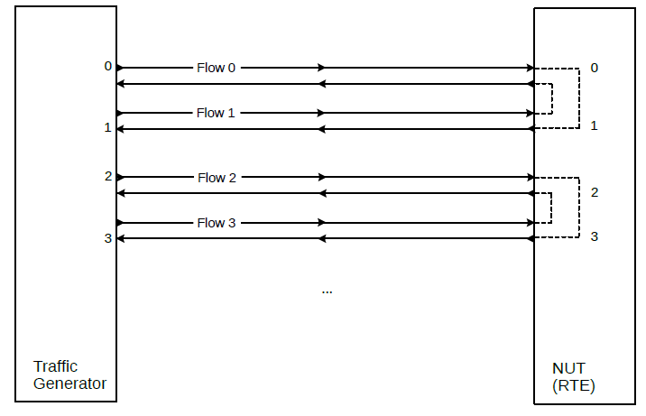
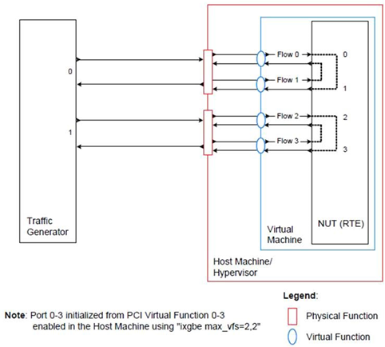
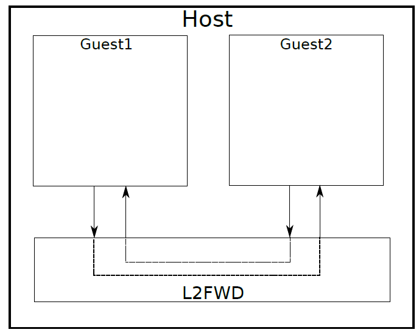

<div align=center>
	 
</div>
<br/>
<br/>

<center><font size='20'>DPDK笔记 Sample of L2FWD</font></center>
<br/>
<br/>
<center><font size='5'>RToax</font></center>
<center><font size='5'>2020年9月</font></center>
<br/>
<br/>
<br/>
<br/>


# L2转发样本应用程序（在真实和虚拟化的环境中）

L2层转发示例程序也是一个用DPDK处理包的示例程序，支持SR-IOV（单根I / O虚拟化）。

L2层转发示例程序，支持真实和虚拟环境，每个包从RX_PROT接收。目的端口是已启用的端口掩码中的相邻端口，也就是说，如果前面4个端口（0xf）可用，端口1,2向彼此转发，端口3,4向彼此转发。

性能基准设置（真实环境）


性能基准设置（虚拟环境）


虚拟机之间的交互



```
./build/l2fwd [EAL options] -- -p PORTMASK [-q NQ] --[no-]mac-updating
```


<br/>
<div align=right>以上内容由RTOAX翻译整理。
	 
</div>