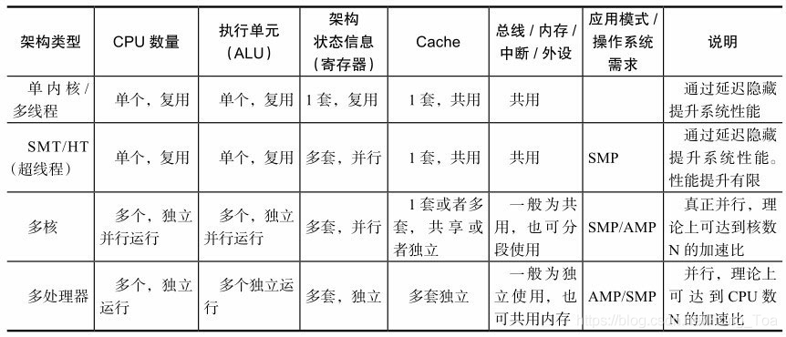
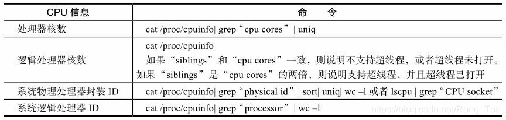
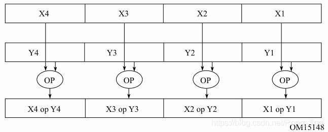

<div align=center>
	 
</div>
<br/>
<br/>

<center><font size='6'>DPDK 背景知识总结</font></center>
<br/>
<br/>
<center><font size='5'>荣涛</font></center>
<center><font size='5'>2021年4月2日</font></center>
<br/>
<br/>
<br/>
<br/>


# 1. DPDK为什么快？

* **轮询**，这一点很直接，可避免中断上下文切换的开销；
* ~~用户态驱动~~，在这种工作方式下，既规避了不必要的内存拷贝又避免了系统调用；
* **亲和性与独占**，DPDK工作在用户态，线程的调度仍然依赖内核，核间线程切换容易导致因cache miss和cache write back造成的大量性能损失，如果更进一步地限定某些核不参与Linux系统调度，就可能使线程独占该核；
* **降低访存开销（大页内存）**，网络数据包处理是一种典型的I/O密集型工作负载。无论是CPU指令还是DMA，对于内存子系统（Cache+DRAM）都会访问频繁。利用一些已知的高效方法来减少访存的开销能够有效地提升性能。比如利用内存大页能有效降低TLB miss；
* **软件调优**，比如结构的cache line对齐，比如数据在多核间访问避免跨cache line共享，比如适时地预取数据，再如多元数据批量操作；
* **单指令多数据SIMD**；
* **“无”锁化**；


# 2. 缓存Cache

> 一个简单的缓存行对齐对数据读写的影响示例代码，见代码列表。


## 2.1. 从内存IO角度看如何定义数据结构

看源码或者编码的时候可能会遇到这样的问题：

* 为什么C语言遍历要行优先；
* 为什么数据结构里有一个名为 `_pad` 的变量，源码中好像也没使用；
* 为什么数据结构要对齐；

先给出结论：

* 局部性原理（时间局部性和空间局部性）；

下面引出缓存行的概念：

* 处理器要从内存中直接读取数据都要花大概几百个时钟周期

```c
$ hwloc-info 
depth 0:	1 Machine (type #1)
 depth 1:	4 Package (type #3)
  depth 2:	4 L3Cache (type #4)
   depth 3:	4 L2Cache (type #4)
    depth 4:	4 L1dCache (type #4)
     depth 5:	4 L1iCache (type #4)
      depth 6:	4 Core (type #5)
       depth 7:	4 PU (type #6)
Special depth -3:	3 Bridge (type #9)
Special depth -4:	5 PCI Device (type #10)
Special depth -5:	3 OS Device (type #11)
```
图形化显示
```c
$ lstopo-no-graphics --no-io --no-legend --of txt
┌──────────────────────────────────────────┐
│ Machine (7783MB)                         │
│                                          │
│ ┌─────────────────┐  ┌─────────────────┐ │
│ │ Package P#0     │  │ Package P#1     │ │
│ │                 │  │                 │ │
│ │ ┌─────────────┐ │  │ ┌─────────────┐ │ │
│ │ │ L3 (16MB)   │ │  │ │ L3 (16MB)   │ │ │
│ │ └─────────────┘ │  │ └─────────────┘ │ │
│ │                 │  │                 │ │
│ │ ┌─────────────┐ │  │ ┌─────────────┐ │ │
│ │ │ L2 (4096KB) │ │  │ │ L2 (4096KB) │ │ │
│ │ └─────────────┘ │  │ └─────────────┘ │ │
│ │                 │  │                 │ │
│ │ ┌────────────┐  │  │ ┌────────────┐  │ │
│ │ │ L1d (32KB) │  │  │ │ L1d (32KB) │  │ │
│ │ └────────────┘  │  │ └────────────┘  │ │
│ │                 │  │                 │ │
│ │ ┌────────────┐  │  │ ┌────────────┐  │ │
│ │ │ L1i (32KB) │  │  │ │ L1i (32KB) │  │ │
│ │ └────────────┘  │  │ └────────────┘  │ │
│ │                 │  │                 │ │
│ │ ┌────────────┐  │  │ ┌────────────┐  │ │
│ │ │ Core P#0   │  │  │ │ Core P#0   │  │ │
│ │ │            │  │  │ │            │  │ │
│ │ │ ┌────────┐ │  │  │ │ ┌────────┐ │  │ │
│ │ │ │ PU P#0 │ │  │  │ │ │ PU P#1 │ │  │ │
│ │ │ └────────┘ │  │  │ │ └────────┘ │  │ │
│ │ └────────────┘  │  │ └────────────┘  │ │
│ └─────────────────┘  └─────────────────┘ │
│                                          │
│ ┌─────────────────┐  ┌─────────────────┐ │
│ │ Package P#2     │  │ Package P#3     │ │
│ │                 │  │                 │ │
│ │ ┌─────────────┐ │  │ ┌─────────────┐ │ │
│ │ │ L3 (16MB)   │ │  │ │ L3 (16MB)   │ │ │
│ │ └─────────────┘ │  │ └─────────────┘ │ │
│ │                 │  │                 │ │
│ │ ┌─────────────┐ │  │ ┌─────────────┐ │ │
│ │ │ L2 (4096KB) │ │  │ │ L2 (4096KB) │ │ │
│ │ └─────────────┘ │  │ └─────────────┘ │ │
│ │                 │  │                 │ │
│ │ ┌────────────┐  │  │ ┌────────────┐  │ │
│ │ │ L1d (32KB) │  │  │ │ L1d (32KB) │  │ │
│ │ └────────────┘  │  │ └────────────┘  │ │
│ │                 │  │                 │ │
│ │ ┌────────────┐  │  │ ┌────────────┐  │ │
│ │ │ L1i (32KB) │  │  │ │ L1i (32KB) │  │ │
│ │ └────────────┘  │  │ └────────────┘  │ │
│ │                 │  │                 │ │
│ │ ┌────────────┐  │  │ ┌────────────┐  │ │
│ │ │ Core P#0   │  │  │ │ Core P#0   │  │ │
│ │ │            │  │  │ │            │  │ │
│ │ │ ┌────────┐ │  │  │ │ ┌────────┐ │  │ │
│ │ │ │ PU P#2 │ │  │  │ │ │ PU P#3 │ │  │ │
│ │ │ └────────┘ │  │  │ │ └────────┘ │  │ │
│ │ └────────────┘  │  │ └────────────┘  │ │
│ └─────────────────┘  └─────────────────┘ │
└──────────────────────────────────────────┘
```


# 3. 并行计算

> Amdahl定律：假设一个任务的工作量不变，多核并行计算理论时延加速上限取决于那些不能并行处理部分的比例。

* 并行意味着代码可以并行的执行，并发则同一时刻只能有一段代码执行；
* 原生SIMD指令；
* 开源框架+硬件支持；
* OpenMP，MPICH，CUDA(GPU)；


## 3.1. 多核处理器





* **处理器核数**：processor cores，即俗称的“CPU核数”，也就是每个物理CPU中core的个数，例如“Intel（R）Xeon（R）CPU E5-2680v2@2.80GHz”是10核处理器，它在每个socket上有10个“处理器核”。具有相同core id的CPU是同一个core的超线程。
* **逻辑处理器核心数**：sibling是内核认为的单个物理处理器所有的超线程个数，也就是一个物理封装中的逻辑核的个数。如果sibling等于实际物理核数的话，就说明没有启动超线程；反之，则说明启用超线程。
* **系统物理处理器封装ID**：Socket中文翻译成“插槽”，也就是所谓的物理处理器封装个数，即俗称的“物理CPU数”，管理员可能会称之为“路”。例如一块“Intel（R）Xeon（R）CPU E5-2680v2@2.80GHz”有两个“物理处理器封装”。具有相同physical id的CPU是同一个CPU封装的线程或核心。
* **系统逻辑处理器ID**：逻辑处理器数的英文名是logical processor，即俗称的“逻辑CPU数”，逻辑核心处理器就是虚拟物理核心处理器的一个超线程技术，例如“Intel（R）Xeon（R）CPU E5-2680v2@2.80GHz”支持超线程，一个物理核心能模拟为两个逻辑处理器，即一块“Intel（R）Xeon（R）CPU E5-2680v2@2.80GHz”有20个“逻辑处理器”。

多核处理器需要注意的问题：

1. 设置亲和性（绑核）；
2. 负载均衡；
3. 线程独占（隔核）；

## 3.2. SIMD指令并发

现代多核处理器几乎都采用了**超标量**的体系结构来提高指令的并发度，并进一步地允许对无依赖关系的指令乱序执行。这种用空间换时间的方法，极大提高了IPC，使得一个时钟周期完成多条指令成为可能。


SIMD指令操作的寄存器相对于通用寄存器（general-purposeregister，RPRS）更宽，128bit的XMM寄存器或者256bit的YMM寄存器，有2倍甚至4倍于通用寄存器的宽度（在64bit架构上）。所以，用SIMD指令的一个直接好处是最大化地利用一级缓存访存的带宽，以表3-3所示Haswell微架构中第一级Cache参数为例，每时钟周期峰值带宽为64B（load）（注：每周期支持两个load微指令，每个微指令获取最多32B数据）+32B（store）。可见，该微架构单时钟周期可以访存的最大数据宽度为32B即256bit，只有YMM寄存器宽度的单指令load或者store，可以用尽最大带宽。

> 参考 `rte_memcpy()` 函数(见文末代码片段章节)；
> 值得注意的是，gcc原生支持sse/avx操作，需要添加编译选项；


# 4. 同步

## 4.1. 原子操作

## 4.2. 内存屏障

## 4.3. 读写锁

## 4.4. 自旋锁

## 4.5. “无锁”队列


# 5. 额外的建议

* 局部性作为高性能编码的基本需求，常被很多程序员忽略，其中包括空间局部性和时间局部性；
* 数据结构的选用；
* 用户缓存；


# 6. 参考文献

* 《深入浅出DPDK》朱河清 等；
* 


# 7. 代码列表

## 7.1. 缓存行对齐对内存IO读写的影响

```c
/**
 *  缓存 对 内存IO的影响
 *  作者：荣涛
 *  时间：2021年4月2日
 */
#define _GNU_SOURCE
#include <stdio.h>
#include <pthread.h>
#include <unistd.h>
#include <syscall.h>

enum op_type {
    TASK_RD,
    TASK_WR,
};

#ifndef __cacheline_size
#define __cacheline_size 64 //默认为 64 字节
#endif

struct test_cache_line {
    unsigned long val1;
    unsigned long __pad[7];
    unsigned long val2;
}__attribute__((aligned(__cacheline_size)));

struct task_arg{
    enum op_type peer_type;
    unsigned long *pdata;
};

#define RWDR_TIMES  100000000

static void read_test(unsigned long *pdata) {
    int i;
    unsigned long tmp = 0;
    for(i=0; i< RWDR_TIMES; i++)
        tmp = *pdata;
}
static void write_test(unsigned long *pdata) {
    int i;
    unsigned long tmp = 0;
    for(i=0; i< RWDR_TIMES; i++)
        *pdata = tmp++;
}

static void* task_routine(void* arg)
{
    static unsigned long time_usec[2] = {0};

    struct task_arg *Arg = (struct task_arg*)arg;

    struct timeval start, end;
	printf("start task tid %ld.\n", syscall(__NR_gettid));
    gettimeofday(&start, NULL);

    switch(Arg->peer_type) {
        case TASK_RD: 
            read_test(Arg->pdata);
            break;
        case TASK_WR: 
            write_test(Arg->pdata);
            break;
        default: 

            break;
    }

    gettimeofday(&end, NULL);

    time_usec[Arg->peer_type] = end.tv_sec*1000000 + end.tv_usec \
                             - (start.tv_sec*1000000 + start.tv_usec);

    pthread_exit(&time_usec[Arg->peer_type]);
	return NULL;
}

int main ()
{
    unsigned long *read_usec, *write_usec;

	pthread_t tasks[2];
    long cacheline_size = sysconf(_SC_LEVEL3_CACHE_LINESIZE);

    printf("cache L3 line size = %d\n", cacheline_size);

    if(__cacheline_size != cacheline_size) {
        printf("You should #define __cacheline_size %ld.\n", cacheline_size);
        return -1;
    }

    struct test_cache_line test_data = {1024UL, 2048UL};

    struct task_arg tastArg[2] = {
        {TASK_RD, &test_data.val1},
        {TASK_WR, &test_data.val2},
        };

	pthread_create(&tasks[TASK_RD], NULL, task_routine, &tastArg[0]);
	pthread_create(&tasks[TASK_WR], NULL, task_routine, &tastArg[1]);

	pthread_join(tasks[TASK_RD], (void**)&read_usec);
	pthread_join(tasks[TASK_WR], (void**)&write_usec);

    printf("Total read  = %ld MSec\n", *read_usec);
    printf("Total write = %ld MSec\n", *write_usec);

	return 0;
}
```

# 8. 单指令多数据

`rte_memcpy()`操作：
```c

```