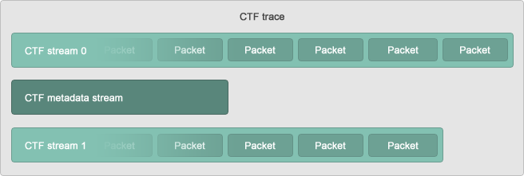
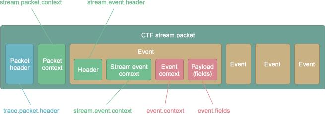

	 

 
 

DPDK笔记 DPDK 跟踪库CTF格式

 
 

RToax

2021年4月

 
 
 
 

> 注意：
> 1. [跟踪库](https://doc.dpdk.org/guides/prog_guide/trace_lib.html)
> 2. 基于DPDK 20.05
> 3. [DPDK跟踪库：trace library](https://rtoax.blog.csdn.net/article/details/108716237)
> 4. [DPDK 跟踪库tracepoint源码实例分析](https://rtoax.blog.csdn.net/article/details/115701903)
> 5. [CTF](https://diamon.org/ctf/)

该通用跟踪格式（CTF）是一个二进制 跟踪 设计是格式非常快写 不影响极大的灵活性。它允许任何C / C ++应用程序或系统以及裸机（硬件）组件本地生成跟踪。

使用CTF，使用称为跟踪流描述语言（TSDL）的类似于C的自定义声明性语言来描述二进制文件中写入的所有标头，上下文和事件字段。由于CTF的可用字段类型范围广泛，因此可以在TSDL中描述许多二进制跟踪流布局。

Babeltrace 是通用跟踪格式的参考实现。它是一个跟踪转换应用程序/ C库，能够读取和写入CTF，几乎支持其所有 指定功能。Babeltrace还附带了Python 3绑定，使打开CTF跟踪和在几秒钟内对其事件进行迭代变得更加容易。

这是CTF v1.8.3的官方文档 。使用右上角的菜单选择其他版本。

# 简而言之
CTF跟踪由二进制 事件的多个流组成。您可以自由地将跟踪器生成的事件划分为任意数量的不同流：由于需要按时间戳的升序对事件进行序列化，因此CTF阅读器可以轻松高效地将多个流的事件整理为有序列表。例如，LTTng是一个Linux内核和用户空间跟踪器，它本地输出CTF跟踪，将其事件划分为每个CPU一个流。

CTF不需要将其流作为实际文件。例如，CTF流也可以通过网络接收/发送，并在内存中进行解析，而无需将任何数据写入磁盘。

CTF跟踪的流之一是强制性的：元数据 流。它完全包含您所期望的：有关跟踪本身的数据。元数据流包含所有其他流的二进制布局的文本描述。该描述是使用 跟踪流描述语言（TSDL）编写的，该语言是仅在CTF领域中存在的一种声明性语言。元数据流的目的是使CTF读者知道如何在不指定任何固定布局的情况下CTF跟踪事件的二进制流。实际上，事先已知的唯一流布局是元数据流的布局。

CTF二进制流是多个数据包的串联。

流数据包按顺序包含：

1. 标头
2. 上下文（可选）
3. 零个或多个串联事件，每个事件包含：
    标头
    特定于流的上下文（可选）
    特定于事件的上下文（可选）
    有效载荷

哎呀！填充也可能存在于所有这些二进制块之间以及数据包本身之间。

TSDL中使用CTF类型描述了所有流头，上下文和有效负载，其中：

* 任何大小，任何对齐方式的 整数
* 任意指数和尾数大小的 浮点数
* 空终止的字节 字符串
* 整数范围映射到标签的 枚举
* 任何CTF类型的 静态和动态数组
* 将字段名称与任何CTF类型相关联的 结构
* 变体，即不同CTF类型之间的动态选择

这种丰富的可配置类型集使描述任何二进制结构成为可能，因此CTF具有极大的灵活性。另一方面，为应用程序编写此二进制数据非常快，因为通常只需将一些内存内容原样添加到CTF流中即可。

更多信息请参考：[CTF](https://diamon.org/ctf/)

 

作者 RTOAX
