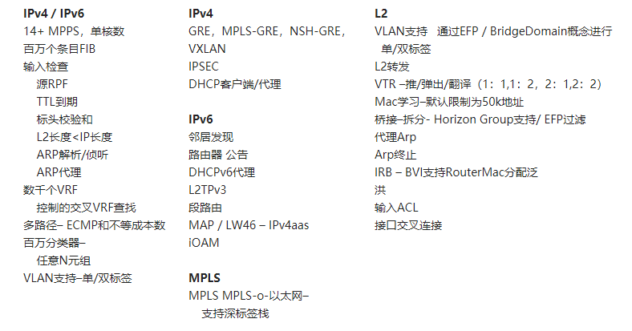

FD.io VPP Wiki

荣涛

中科晶上

[向量封包处理器](https://wiki.fd.io/view/VPP)

# 1. 什么是VPP

[VPP/What is VPP?](https://wiki.fd.io/view/VPP/What_is_VPP%3F)

## 1.1. 介绍

VPP平台是一个可扩展的框架，可提供开箱即用的生产质量交换机/路由器功能。它是思科矢量数据包处理（VPP）技术的开源版本：一种高性能的数据包处理堆栈，可以在商用CPU上运行。

实施VPP的好处在于其高性能，经过验证的技术，其模块化和灵活性以及丰富的功能集。

VPP技术基于成熟的技术，已帮助交付了超过10亿美元的思科产品。这是一个模块化设计。该框架允许任何人“插入”新的图形节点，而无需更改内核代码。

### 1.1.1. 模块化，灵活和可扩展

VPP平台建立在“数据包处理图”上。这种模块化方法意味着任何人都可以“插入”新的图节点。这使得扩展性相当简单，并且意味着可以针对特定目的自定义插件。

插件如何发挥作用？在运行时，VPP平台从RX环获取所有可用的数据包，以形成数据包向量。数据包处理图逐个节点（包括插件）应用于整个数据包向量。图节点较小且模块化。图节点是松散耦合的。这使得引入新图节点变得容易。这也使得重新连接现有图形节点相对容易。

插件可以引入新的图节点或重新排列数据包处理图。您还可以独立于VPP源代码树构建插件-这意味着您可以将其视为独立组件。可以通过将插件添加到插件目录来安装插件。

VPP平台可用于构建任何类型的数据包处理应用程序。它可用作负载均衡器，防火墙，IDS或主机堆栈的基础。您也可以创建应用程序的组合。例如，您可以向vSwitch添加负载平衡。

引擎在纯用户空间中运行。这意味着插件不需要更改核心代码-您可以扩展包处理引擎的功能，而无需更改在内核级别运行的代码。通过创建插件，任何人都可以使用以下功能扩展功能：

* 新的自定义图节点（node）
* 图节点的重排
* 新的低级API

### 1.1.2. 功能丰富

全套图形节点允许构建各种网络设备工作负载。从高层次上讲，该平台提供：

* 快速查找表的路由，网桥条目
* 任意n元组分类器
* 开箱即用的生产质量交换机/路由器功能

以下是VPP平台提供的功能的摘要：

## 1.2. 为什么称为向量处理？

顾名思义，VPP使用矢量处理而不是标量处理。标量数据包处理是指一次处理一个数据包。这种较旧的传统方法需要处理中断，并遍历调用堆栈（a调用b调用c ...从嵌套调用返回return ...然后从Interrupt返回）。然后，该过程将执行以下三项操作之一：平移，丢弃或重写/转发数据包。

传统的标量数据包处理的问题是：

* 在I缓存中发生抖动
* 每个数据包都会导致相同的I缓存未命中
* 除了提供更大的缓存，上述方法无其他解决方法

相比之下，向量处理一次处理一个以上的数据包。

向量方法的好处之一是它解决了`缓存抖动`问题。它还缓解了相关的`读取延迟`问题（`预取消除了延迟`）。

这种方法解决了与堆栈深度/ D-cache堆栈地址未命中有关的问题。它改善了“电路时间”。“电路”是以下周期：从设备RX环中获取所有可用数据包，形成一个`“帧”（向量）`，该帧由RX顺序的数据包索引组成，通过有向图的节点图运行数据包，然后返回到RX。环。随着数据包处理的继续，电路时间将根据提供的负载达到稳定的平衡。

随着向量大小的增加，每个数据包的处理成本降低，因为您要在较大的N上摊销I缓存未命中。

## 1.3. 用例示例：VPP作为vSwitch / vRouter

VPP平台的一种使用情况是将其实现为`虚拟交换机或路由器`。以下部分描述了可以使用VPP平台创建的可能实现的示例。有关其他可能用例的更多详细说明，请参见用例列表。

您可以使用VPP平台创建现成的虚拟交换机（vSwitch）和虚拟路由器（vRouter）。VPP平台使您可以通过命令行界面（CLI）管理这些应用程序的某些功能和配置。

交换应用程序可以创建的一些功能包括：

* 桥域
* 端口（包括隧道端口）
* 将端口连接到网桥域
* 程序ARP终止

路由应用程序可以创建的一些功能包括：

* 虚拟路由和转发（VRF）表（以千计）
* 路线（以百万计）

### 1.3.1. 本地可编程性

一种方法是实现VPP应用程序以与本地环境（Linux主机或容器）中的外部应用程序通信。通信将通过低级API进行。这种方法提供了一个完整的，功能丰富的解决方案，既简单又高性能。例如，可以合理地预期性能产出为每秒50万条路由。

这种方法利用了共享内存/消息队列的优势。该实现在本地的盒子或容器上。所有CLI任务都可以通过API调用完成。

VPP平台的当前实现为C客户端和Java客户端生成低级绑定。将来可能会为其他编程语言的绑定提供支持。

### 1.3.2. 远程可编程性

另一种方法是通过高级API使用数据平面管理代理。如图所示，数据平面管理代理可以通过低级API与VPP App（引擎）对话。它可以在一个盒子（或VM或容器）中本地运行。盒子（或容器）将通过某种形式的绑定公开更高级别的API。

这是一种特别灵活的方法，因为VPP平台不会强制使用特定的数据平面管理代理。此外，VPP平台不将通信限制为仅一个高级API。任何人都可以携带数据平面管理代理。这使您可以将高级API /数据平面管理代理和实施与VPP应用程序的特定需求进行匹配。

### 1.3.3. 样本数据平面管理代理

使用高水平API的一个示例是在运行本地ODL实例（Honeycomb）的盒子上将VPP平台实现为应用程序。您可以在生成的Java绑定上使用低级API来与VPP App对话，并通过netconf / restconf NB公开Yang模型。

这将是实现网桥域的一种方法。

## 1.4. VPP的主要特征

一些主要特征包括：

与在内核中运行类似的数据包处理相比，提高了容错能力和ISSU：

* 崩溃很少需要重启进程
* 软件更新不需要重新启动系统
* 开发环境比类似的内核代码更易于使用和执行调试
* 用户空间调试工具（gdb，valgrind，wireshark）
* 利用广泛可用的内核模块（uio，igb_uio）：DMA安全内存

作为Linux用户空间进程运行：

* 同一映像可在VM，Linux容器或主机内核中运行
* KVM和ESXi：通过PCI直接映射的NIC
* 虚拟主机用户，netmap，virtio半虚拟化NIC
* 调整/点击驱动程序
* DPDK轮询模式设备驱动程序

VDP与DPDK集成在一起，支持现有的NIC设备，包括：

* 英特尔i40e，英特尔ixgbe物理和虚拟功能，英特尔e1000，virtio，虚拟主机用户，Linux TAP
* 惠普更名为英特尔Niantic MAC / PHY
* 思科VIC

考虑的安全性问题：

* 思科安全团队的广泛白盒测试
* 图像段基地址随机化
* 共享内存段基地址随机化
* 堆栈边界检查
* 调试CLI“ chroot”

数据包处理的矢量方法已被证明是主要体系结构上的主要平移/注入路径。

### 1.4.1. 支持的架构

VPP平台支持：

* x86 / 64

### 1.4.2. 支持的系统

VPP平台支持在以下操作系统上安装软件包：

* Debian
* Ubuntu 16.04
* Centos的7.3

## 1.5. 效率期望

VPP实施的好处之一是它在相对低功耗的计算上具有高性能。如此高的性能基于以下亮点：

* 用于商用硬件的高性能用户空间网络堆栈
* 主机，VM，Linux容器的代码相同
* 集成的虚拟主机用户virtio后端，可实现虚拟机到虚拟机的高速连接
* L2和L3功能，多种封装
* 利用同类最佳的开源驱动程序技术：DPDK
* 通过使用插件可扩展
* 通过基于标准的API控制平面/业务流程平面

### 1.5.1. 性能指标

已显示VPP平台可提供以下近似性能指标：

* 来自单个x86_64内核的多个MPPS
* 单个物理主机上> 100Gbps全双工
* 多核扩展基准测试示例（在UCS-C240 M3上，3.5 gHz，转发了所有内存通道，简单的ipv4转发）：
    1核：9 MPPS进出
    2核：13.4 MPPS进出
    4核：20.0 MPPS进出

# 2. VPP工作环境

[VPP - Working Environments ](https://wiki.fd.io/view/VPP_-_Working_Environments)

**`TODO`**

# 3. VPP特性

[Feature Summary](https://wiki.fd.io/view/VPP/Features)

**`TODO`**

