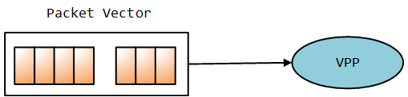

<div align=center>
	 
</div>

<br/>
<br/>
<br/>

<center><font size='20'>FD.io VPP：用户文档 向量包处理器</font></center>
<br/>
<br/>
<center><font size='5'>荣涛</font></center>
<center><font size='5'>2020年9月</font></center>
<br/>
<br/>
<br/>
<br/>


# 1. 什么是向量包处理器（VPP）

FD.io的矢量包处理器（VPP）是一个快速，可扩展的`2-4层`多平台网络协议栈。它在Linux用户空间中的多种体系结构上运行，包括`x86，ARM和Power`体系结构。

VPP的高性能网络协议栈正迅速成为全球应用程序选择的网络协议栈。

通过广泛使用`插件`，VPP不断得到增强。该 `数据平面开发套件（DPDK）` 就是一个很好的例子。它提供了VPP的一些重要功能和驱动程序。**（DPDK在VPP看来是一个插件）**

**VPP支持与OpenStack和Kubernetes集成**。网络管理功能包括配置，计数器，采样等。对于开发人员来说，VPP包括高性能的事件记录和多种数据包跟踪。开发调试映像包括完整的符号表和广泛的一致性检查。

一些VPP用例包括vSwitch，vRouter，网关，防火墙和负载均衡器，仅举几例。

**`Should be MORE`**

<br/>


# 2. 向量包处理器（VPP）

本节介绍了FD.io VPP的一些核心概念和功能。

从FD.io开始，VPP使用了一种称为`矢量包处理`的技术。与使用标量处理的数据包处理应用程序相比，这使FD.io VPP的性能有了显着提高。

同样，Fd.io VPP**模块化设计**的核心是“**`数据包处理图`**”。**这使FD.io VPP可扩展且易于扩展**。

FD.io软件还包括功能丰富的网络协议栈。这包括一个利用VPP基于图的转发模型和矢量化数据包处理的TCP主机协议栈。

FD.io VPP每晚都会通过CSIT项目进行功能和性能测试。

有关这些功能的更多信息，请单击下面的链接或按下一步。

* [标量与矢量数据包处理](https://fd.io/docs/vpp/master/whatisvpp/scalar-vs-vector-packet-processing.html)
* [包处理图](https://fd.io/docs/vpp/master/whatisvpp/extensible.html)
* [网络协议栈](https://fd.io/docs/vpp/master/whatisvpp/networkstack.html)
* [TCP主机栈](https://fd.io/docs/vpp/master/whatisvpp/hoststack.html)
* [开发人员功能](https://fd.io/docs/vpp/master/whatisvpp/developer.html)
* [架构和操作系统](https://fd.io/docs/vpp/master/whatisvpp/supported.html)
* [性能](https://fd.io/docs/vpp/master/whatisvpp/performance.html)

<br/>


## 2.1. 标量与矢量数据包处理

FD.io VPP是`使用矢量包处理而非标量包`处理开发的。

**向量数据包处理是FD.io VPP和DPDK等高性能数据包处理应用程序中的常用方法**。基于标量的方法往往受到不一定具有严格性能要求的网络堆栈的青睐。

<br/>

### 2.1.1. 标量分组处理

标量数据包处理网络堆栈通常一次处理一个数据包：`中断处理功能从网络接口获取单个数据包`，并通过一组功能对其进行处理：fooA调用fooB调用fooC等等。

```
+---> fooA(packet1) +---> fooB(packet1) +---> fooC(packet1)
+---> fooA(packet2) +---> fooB(packet2) +---> fooC(packet2)
...
+---> fooA(packet3) +---> fooB(packet3) +---> fooC(packet3)
```


标量数据包处理很简单，但是在以下方面效率低下：

当代码路径长度超过微处理器指令高速缓存（I-cache）的大小时，由于微处理器不断地加载新指令而发生了抖动。在此模型中，每个数据包都会产生相同的`I缓存未命中集`。

当协议栈局部内存脱离微处理器的第1层数据缓存（D-cache）时，关联的深度调用堆栈还将增加负载存储单元压力。

<br/>

### 2.1.2. 矢量包处理

相反，矢量数据包处理网络堆栈一次处理多个数据包，称为“数据包矢量”或简称为“矢量”。中断处理函数从网络接口获取数据包的向量，并通过一组函数处理该向量：fooA调用fooB调用fooC等等。

```
+---> fooA([packet1, +---> fooB([packet1, +---> fooC([packet1, +--->
            packet2,             packet2,             packet2,
            ...                  ...                  ...
            packet256])          packet256])          packet256])
```
<br/>



此方法可修复：

* 通过分摊跨多个数据包的I-cache负载的成本，上述I-cache抖动问题。
* 通过从网络接口**一次接收多达256个数据包**的向量，并使用节点的有向图对其进行处理，从而与深度调用协议栈相关联的效率低下。**`图调度程序一次调用一个节点调度功能`，将堆栈深度限制为几个堆栈帧。**

这种方法实现的进一步优化是**流水线处理和预取**，以最大程度地减少表数据的读取延迟并并行化处理数据包所需的数据包负载。


<br/>

## 2.2. 包处理图

[包处理图](https://fd.io/docs/vpp/master/whatisvpp/extensible.html)

FD.io VPP设计的核心是`数据包处理图`。

这使得软件：

* 可插拔，易于理解和扩展
* 成熟的**图节点**架构
* 全面控制以重组管道
* 快速，插件是平等的公民

FD.io VPP数据包处理管道被分解为“数据包处理图”。这种模块化方法意味着任何人都可以“插入”新的图节点。这使得VPP易于扩展，并且意味着可以针对特定目的自定义插件。VPP也可以通过其低级API进行配置。


在运行时，FD.io VPP平台会`组合来自RX环的数据包向量`，通常单个向量中`最多256个数据包`。然后，`将包处理图逐个节点（包括插件）应用于整个包向量`。当将每个图节点表示的网络处理依次应用于每个包时，接收到的包通常会遍历向量中的包处理图节点。图节点是小型且模块化的，并且松散耦合。这使引入新图节点和重新连接现有图节点变得容易。

**`插件`是共享库 ，并在运行时由VPP加载。**VPP通过在插件路径中搜索库来查找插件，然后在启动时依次动态地加载每个插件。插件可以引入新的图节点或重新排列数据包处理图。您可以完全独立于FD.io VPP源代码树来构建插件，这意味着您可以将其视为独立的组件。


<br/>

## 2.3. 网络协议栈

本节简要介绍了FD.io网络堆栈，并介绍了一些优点：

* `第2-4层网络堆栈`
    快速查找表的路由，网桥条目
    任意n元组分类器
    控制平面，交通管理和覆盖

* `Linux和FreeBSD支持`
    支持标准操作系统接口，例如**`AF_Packet`，Tun / Tap和Netmap**。

* `DPDK的网络和加密硬件支持。`
* `容器和虚拟化支持`

    半虚拟化接口；虚拟主机和Virtio
    通过PCI直通的网络适配器
    本机容器接口；记忆体

* `主机栈`

* `通用数据平面：一个代码库，适用于许多用例`
    离散电器；如路由器和交换机。
    **云基础架构和虚拟网络功能**
    **云原生基础架构**
    所有用例都使用相同的二进制包。

* `借助CSIT开箱即用的生产质量。`

<br/>

## 2.4. TCP主机栈

VPP的主机堆栈利用VPP的基于图的转发模型和矢量化的数据包处理来确保高吞吐量和大规模传输协议的终止。它公开了各种API，这些API除了**允许有效使用用户空间的应用程序和生成数据**外，**还可以实现高效的本地应用程序间通信**。

在较高级别，VPP的主机栈包含3个主要组件：

* 促进传输协议和应用程序之间交互的`会话层`
* `可插拔的传输协议`，包括**TCP**，QUIC，TLS，**`UDP`****（协议组需要的UDP功能）**
* `VCL`（VPPComs库）是一组库，旨在从应用程序角度简化堆栈的易用性

所有这些组件都是定制构建的，以适合VPP的体系结构并利用其速度。

**在以下方面投入了大量精力：**

* 构建一个可传输的**可插入会话层**，该层使用定制的**共享内存**基础结构抽象应用程序和传输之间的交互。值得注意的是，这还允许将通常在应用程序中实现的传输协议（例如`QUIC`和`TLS`）在VPP中实现。
* **干净的TCP实现**，支持向量化数据包处理，并遵循VPP的高度可扩展的线程模型。该实现符合RFC，支持大量的高速TCP协议功能，并且已通过Defensic的Codenomicon 1M +测试套件进行了验证。
* **VCL**，一个`在用户空间中模拟传统异步通信功能的库`，同时允许在需要时开发新的模式。
* 实施高性能的**“直通”通信模式**，该模式使连接到vpp的应用程序可以`在共享内存上透明地交换数据`，而不会产生传统传输协议的额外费用。测试表明，此方法比传统的容器间网络高效得多。


<br/>

## 2.5. 开发人员功能

[开发人员功能](https://fd.io/docs/vpp/master/whatisvpp/developer.html)

本节介绍有关VPP环境以及开发人员可以使用的一些功能的一些信息。

* 广泛的运行时计数器；吞吐量，[每个周期的指令](https://en.wikipedia.org/wiki/Instructions_per_cycle)，错误，事件等。
* 综合管道追踪设施
* 多语言API绑定
* 集成命令行用于调试
* 容错和可升级
    作为容错的标准用户空间进程运行，软件崩溃很少需要重启进程。
    与在内核中运行类似的数据包处理相比，提高了容错性和可升级性，软件更新从不要求系统重启。
    与类似的内核代码相比，开发经验更容易
    硬件隔离和保护（[iommu](https://en.wikipedia.org/wiki/Input%E2%80%93output_memory_management_unit)）

* **为安全而打造**
    广泛的白盒测试
    图像段基地址随机化
    共享内存段基地址随机化
    堆栈边界检查
    具有Coverity的静态分析

<br/>

## 2.6. 架构和操作系统

<br/>

### 2.6.1. 支持的架构

<br/>

### 2.6.2. 操作系统

<br/>

## 2.7. 性能

FD.io VPP的优点之一是在相对低功耗的计算上具有高性能。包括以下内容。

* **专为商用硬件设计的高性能用户空间网络栈**：
    L2，L3和L4功能和封装。

* 优化的数据包接口，支持多种用例：
    集成的虚拟主机用户后端，可实现虚拟机到虚拟机的高速连接
    集成的memif容器后端，可实现高速的容器到容器连接
    一个基于vhost的集成接口，可将数据包发送到Linux内核

* 相同的优化代码路径在主机以及VM和Linux**容器**内部运行
* 利用同类最佳的开源驱动程序技术：[DPDK](https://www.dpdk.org/)
* 经过大规模测试；线性核心扩展，经过数百万个流和mac地址测试

设计这些功能是为了充分利用常见的微处理器优化技术，例如：

* 通过处理向量中的数据包减少缓存和TLS丢失
* 通过矢量指令（例如SSE，AVX和NEON）实现[IPC](https://en.wikipedia.org/wiki/Instructions_per_cycle)增益
* `消除模式切换，上下文切换和阻塞`，从而始终做有用的工作
* 缓存行`对齐`的缓冲区，提高缓存和内存效率

<br/>

### 2.7.1. 持续系统集成和测试（CSIT）
连续系统集成和测试（CSIT）项目为FD.io VPP提供功能和性能测试。此测试集中于功能和性能回归。结果将发布到CSIT测试报告中。

有关CSIT的更多信息，请查看以下链接：

* CSIT代码文档
* [CSIT测试概述](https://docs.fd.io/csit/master/report/introduction/overview.html)
* [VPP性能仪表板](https://docs.fd.io/csit/master/trending/introduction/index.html)

<br/>

### 2.7.2. CSIT数据包吞吐量示例

以下是一些CSIT测试报告的指针。测试的标题如下所示：

```
<数据包大小>-<线程数> <核心数>-<测试>-<接口类型>
```

例如，标题为`64b-2t1c-l2switching-base-i40e`的测试是`使用i40e接口使用64个字节的数据包，2个线程和1个核心进行l2交换`的测试。

这里有一些例子：

* [L2以太网交换](https://docs.fd.io/csit/master/report/vpp_performance_tests/packet_throughput_graphs/l2.html)
* [IPv4路由](https://docs.fd.io/csit/master/report/vpp_performance_tests/packet_throughput_graphs/ip4.html)
* IPv6路由

<br/>

### 2.7.3. 趋势吞吐量图

这些是CSIT 趋势仪表板中的一些趋势数据包吞吐量图。请注意，趋势图中的性能将根据软件开发周期每晚更改一次：

* 二层以太网交换趋势
* [IPv4路由趋势](https://docs.fd.io/csit/master/trending/trending/ip4.html)
* IPv6路由趋势


<br/>
<div align=right>	以上内容由荣涛翻译整理自网络。</div>