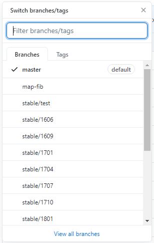

<div align=center>
	 
</div>

<br/>
<br/>
<br/>

<center><font size='20'>FD.io VPP：用户文档 构建VPP</font></center>
<br/>
<br/>
<center><font size='5'>荣涛</font></center>
<center><font size='5'>2020年9月</font></center>
<br/>
<br/>
<br/>
<br/>


要开始使用VPP进行开发，您需要获取所需的VPP源代码，然后构建软件包。

<br/>

# 1. 设置代理

如果你的服务器本地可以连接互联网，则跳过设置代理的步骤。

根据您所使用的环境，可能需要设置代理。运行以下代理命令以指定代理服务器名称和相应的端口号：

## 1.1. 设置HTTP代理

```bash
$ export http_proxy=http://<proxy-server-name>.com:<port-number>
$ export https_proxy=https://<proxy-server-name>.com:<port-number>
```
## 1.2. 设置YUM代理

编辑文件`/etc/yum.conf`，添加下面一行

```bash
proxy=http://10.175.0.13:808
```

## 1.3. 设置GIT代理

如果获取源代码采用git方式（github），在文件`~/.gitconfig`添加如下内容，该修改只对当前用户有效。

```
[http]
	proxy=http://10.175.0.13:808
[https]
	proxy=http://10.175.0.13:808
```


<br/>

# 2. 获取VPP
要获取用于创建内部版本的VPP源，请运行以下命令：

## 2.1. 从gerrit.fd.io

```
$ git clone https://gerrit.fd.io/r/vpp
$ cd vpp
```
## 2.2. 从GitHub

如果使用github

```
$ git clone https://github.com/FDio/vpp
```

选择分支，我安装的是`20.05`版本



<br/>

# 3. 安装VPP依赖
在构建VPP映像之前，通过输入以下命令，确保没有安装FD.io VPP或DPDK软件包：

```
$ dpkg -l | grep vpp
$ dpkg -l | grep DPDK
```
运行上述命令后，应该没有输出或没有显示任何程序包。


运行以下make命令以安装FD.io VPP的依赖项。

如果下载在任何时候都挂起，则可能需要 设置代理才能使下载正常工作。

```
$ make install-dep
Hit:1 http://us.archive.ubuntu.com/ubuntu xenial InRelease
Get:2 http://us.archive.ubuntu.com/ubuntu xenial-updates InRelease [109 kB]
Get:3 http://security.ubuntu.com/ubuntu xenial-security InRelease [107 kB]
Get:4 http://us.archive.ubuntu.com/ubuntu xenial-backports InRelease [107 kB]
Get:5 http://us.archive.ubuntu.com/ubuntu xenial-updates/main amd64 Packages [803 kB]
Get:6 http://us.archive.ubuntu.com/ubuntu xenial-updates/main i386 Packages [732 kB]
...
...
Update-alternatives: using /usr/lib/jvm/java-8-openjdk-amd64/bin/jmap to provide /usr/bin/jmap (jmap) in auto mode
Setting up default-jdk-headless (2:1.8-56ubuntu2) ...
Processing triggers for libc-bin (2.23-0ubuntu3) ...
Processing triggers for systemd (229-4ubuntu6) ...
Processing triggers for ureadahead (0.100.0-19) ...
Processing triggers for ca-certificates (20160104ubuntu1) ...
Updating certificates in /etc/ssl/certs...
0 added, 0 removed; done.
Running hooks in /etc/ca-certificates/update.d...

done.
done.
```

<br/>


# 4. 生成VPP（调试）
此构建版本包含调试符号，这些调试符号对于修改VPP非常有用。下面的 make命令可构建VPP的调试版本。生成调试映像时，二进制文件可以在/ build-root / vpp_debug-native中找到。

调试内部版本包含调试符号，这些符号对于故障排除或修改VPP非常有用。下面的make命令可生成VPP的调试版本。可以在/ build-root / vpp_debug-native中找到用于构建调试映像的二进制文件。

```
$ make build
make[1]: Entering directory '/home/vagrant/vpp-master/build-root'
@@@@ Arch for platform 'vpp' is native @@@@
@@@@ Finding source for dpdk @@@@
@@@@ Makefile fragment found in /home/vagrant/vpp-master/build-data/packages/dpdk.mk @@@@
@@@@ Source found in /home/vagrant/vpp-master/dpdk @@@@
@@@@ Arch for platform 'vpp' is native @@@@
@@@@ Finding source for vpp @@@@
@@@@ Makefile fragment found in /home/vagrant/vpp-master/build-data/packages/vpp.mk @@@@
@@@@ Source found in /home/vagrant/vpp-master/src @@@@
...
...
make[5]: Leaving directory '/home/vagrant/vpp-master/build-root/build-vpp_debug-native/vpp/vpp-api/java'
make[4]: Leaving directory '/home/vagrant/vpp-master/build-root/build-vpp_debug-native/vpp/vpp-api/java'
make[3]: Leaving directory '/home/vagrant/vpp-master/build-root/build-vpp_debug-native/vpp'
make[2]: Leaving directory '/home/vagrant/vpp-master/build-root/build-vpp_debug-native/vpp'
@@@@ Installing vpp: nothing to do @@@@
make[1]: Leaving directory '/home/vagrant/vpp-master/build-root'
```

我这里已经运行过这条命令，输出如下：

```# 5. make build
make[1]: 进入目录“/opt/vpp-stable-2005/build-root”
@@@@ Arch for platform 'vpp' is native @@@@
@@@@ Finding source for external @@@@
@@@@ Makefile fragment found in /opt/vpp-stable-2005/build-data/packages/external.mk @@@@
@@@@ Source found in /opt/vpp-stable-2005/build @@@@
@@@@ Arch for platform 'vpp' is native @@@@
@@@@ Finding source for vpp @@@@
@@@@ Makefile fragment found in /opt/vpp-stable-2005/build-data/packages/vpp.mk @@@@
@@@@ Source found in /opt/vpp-stable-2005/src @@@@
@@@@ Configuring external: nothing to do @@@@
@@@@ Building external: nothing to do @@@@
@@@@ Installing external: nothing to do @@@@
@@@@ Configuring vpp: nothing to do @@@@
@@@@ Building vpp in /opt/vpp-stable-2005/build-root/build-vpp_debug-native/vpp @@@@
[0/1] Re-running CMake...
-- Looking for ccache
-- Looking for ccache - found
-- Looking for libuuid
-- Found uuid in /usr/include
-- Intel IPSecMB found: /opt/vpp/external/x86_64/include
-- dpdk plugin needs libdpdk.a library - found at /opt/vpp/external/x86_64/lib/libdpdk.a
-- Found DPDK 20.2.0 in /opt/vpp/external/x86_64/include/dpdk
-- dpdk plugin needs numa library - found at /usr/lib64/libnuma.so
-- dpdk plugin needs libIPSec_MB.a library - found at /opt/vpp/external/x86_64/lib/libIPSec_MB.a
-- Found quicly 0.1.0-vpp in /opt/vpp/external/x86_64/include
-- rdma plugin needs libibverbs.a library - found at /opt/vpp/external/x86_64/lib/libibverbs.a
-- rdma plugin needs librdma_util.a library - found at /opt/vpp/external/x86_64/lib/librdma_util.a
-- rdma plugin needs libmlx5.a library - found at /opt/vpp/external/x86_64/lib/libmlx5.a
-- tlsmbedtls plugin needs mbedtls library - found at /usr/lib64/libmbedtls.so
-- tlsmbedtls plugin needs mbedx509 library - found at /usr/lib64/libmbedx509.so
-- tlsmbedtls plugin needs mbedcrypto library - found at /usr/lib64/libmbedcrypto.so
-- Looking for picotls
-- Found picotls in /opt/vpp/external/x86_64/include and /opt/vpp/external/x86_64/lib/libpicotls-core.a
-- Configuration:
VPP version         : 20.05.1-5~gc53cb5c
VPP library version : 20.05.1
GIT toplevel dir    : /opt/vpp-stable-2005
Build type          : debug
C flags             : -Wno-address-of-packed-member -g -fPIC -Werror -Wall -march=corei7 -mtune=corei7-avx -O0 -DCLIB_DEBUG -fst
ack-protector -DFORTIFY_SOURCE=2 -fno-common Linker flags (apps) : 
Linker flags (libs) : 
Host processor      : x86_64
Target processor    : x86_64
Prefix path         : /opt/vpp/external/x86_64;/opt/vpp-stable-2005/build-root/install-vpp_debug-native/external
Install prefix      : /opt/vpp-stable-2005/build-root/install-vpp_debug-native/vpp
-- Configuring done
-- Generating done
-- Build files have been written to: /opt/vpp-stable-2005/build-root/build-vpp_debug-native/vpp
[2/2] Linking C shared library lib/vpp_plugins/test1_plugin.so
@@@@ Installing vpp @@@@
[0/1] Install the project...
-- Install configuration: "debug"
make[1]: 离开目录“/opt/vpp-stable-2005/build-root”
```

<br/>

# 5. 生成VPP（发行版）
本节介绍如何构建FD.io VPP的常规发行版。该发行版本经过优化，不会创建任何调试符号。可在/ build-root / vpp-native中找到用于构建发行映像的二进制文件。

在下面使用以下make命令来构建FD.io VPP的发行版本。

```
$ make build-release
```

我已经执行过该指令，输出如下：

```
# 6. make build-release
make[1]: 进入目录“/opt/vpp-stable-2005/build-root”
@@@@ Arch for platform 'vpp' is native @@@@
@@@@ Finding source for external @@@@
@@@@ Makefile fragment found in /opt/vpp-stable-2005/build-data/packages/external.mk @@@@
@@@@ Source found in /opt/vpp-stable-2005/build @@@@
@@@@ Arch for platform 'vpp' is native @@@@
@@@@ Finding source for vpp @@@@
@@@@ Makefile fragment found in /opt/vpp-stable-2005/build-data/packages/vpp.mk @@@@
@@@@ Source found in /opt/vpp-stable-2005/src @@@@
@@@@ Configuring external: nothing to do @@@@
@@@@ Building external: nothing to do @@@@
@@@@ Installing external: nothing to do @@@@
@@@@ Configuring vpp: nothing to do @@@@
@@@@ Building vpp: nothing to do @@@@
@@@@ Installing vpp: nothing to do @@@@
make[1]: 离开目录“/opt/vpp-stable-2005/build-root”

```

<br/>

# 6. 构建必要的软件包
需要构建的软件包取决于VPP将在其上运行的系统类型：

* 在Debian软件包如果VPP是要在Ubuntu上运行是建立
* 该RPM软件包内置如果VPP是要在CentOS或红帽运行

<br/>

# 7. 构建Debian软件包

因为我们的系统为CentOS7，不使用deb包管理工具，此章节略过。

要构建debian软件包，请使用以下命令：

```
$ make pkg-deb
```

一旦构建了软件包，就可以在build-root目录中找到它们。

```
$ ls *.deb

If the packages are built correctly, then this should be the corresponding output:

vpp_18.07-rc0~456-gb361076_amd64.deb             vpp-dbg_18.07-rc0~456-gb361076_amd64.deb
vpp-dev_18.07-rc0~456-gb361076_amd64.deb         vpp-api-lua_18.07-rc0~456-gb361076_amd64.deb
vpp-lib_18.07-rc0~456-gb361076_amd64.deb         vpp-api-python_18.07-rc0~456-gb361076_amd64.deb
vpp-plugins_18.07-rc0~456-gb361076_amd64.deb
```

最后，可以使用以下命令安装创建的软件包。安装与VPP将在其上运行的操作系统相对应的软件包：

对于Ubuntu：

```
$ sudo bash
# dpkg -i *.deb
```


<br/>

# 8. 构建RPM软件包
为了生成自己的VPP安装rpm包，执行下面命令，可以生成一系列的软件包
要生成rpm软件包，请根据系统使用以下命令之一：

```
$ make pkg-rpm

----------此处省略一万行------
Requires(rpmlib): rpmlib(CompressedFileNames) <= 3.0.4-1 rpmlib(FileDigests) <= 4.6.0-1 rpmlib(PayloadFilesHavePrefix) <= 4.0-1
Requires(post): /bin/sh libselinux-utils policycoreutils policycoreutils-python selinux-policy-base >= 3.13.1-128.6.fc22 selinux
-policy-targeted >= 3.13.1-128.6.fc22Requires(postun): /bin/sh
处理文件：vpp-debuginfo-20.05.1-5~gc53cb5c.x86_64
Provides: vpp-debuginfo = 20.05.1-5~gc53cb5c vpp-debuginfo(x86-64) = 20.05.1-5~gc53cb5c
Requires(rpmlib): rpmlib(FileDigests) <= 4.6.0-1 rpmlib(PayloadFilesHavePrefix) <= 4.0-1 rpmlib(CompressedFileNames) <= 3.0.4-1
检查未打包文件：/usr/lib/rpm/check-files /opt/vpp-stable-2005/build-root/rpmbuild/BUILDROOT/vpp-20.05.1-5~gc53cb5c.x86_64
写道:/opt/vpp-stable-2005/build-root/rpmbuild/RPMS/x86_64/vpp-20.05.1-5~gc53cb5c.x86_64.rpm
写道:/opt/vpp-stable-2005/build-root/rpmbuild/RPMS/x86_64/vpp-lib-20.05.1-5~gc53cb5c.x86_64.rpm
写道:/opt/vpp-stable-2005/build-root/rpmbuild/RPMS/x86_64/vpp-devel-20.05.1-5~gc53cb5c.x86_64.rpm
写道:/opt/vpp-stable-2005/build-root/rpmbuild/RPMS/x86_64/vpp-plugins-20.05.1-5~gc53cb5c.x86_64.rpm
写道:/opt/vpp-stable-2005/build-root/rpmbuild/RPMS/x86_64/vpp-api-lua-20.05.1-5~gc53cb5c.x86_64.rpm
写道:/opt/vpp-stable-2005/build-root/rpmbuild/RPMS/x86_64/vpp-api-python-20.05.1-5~gc53cb5c.x86_64.rpm
写道:/opt/vpp-stable-2005/build-root/rpmbuild/RPMS/x86_64/vpp-api-python3-20.05.1-5~gc53cb5c.x86_64.rpm
写道:/opt/vpp-stable-2005/build-root/rpmbuild/RPMS/x86_64/vpp-selinux-policy-20.05.1-5~gc53cb5c.x86_64.rpm
写道:/opt/vpp-stable-2005/build-root/rpmbuild/RPMS/x86_64/vpp-debuginfo-20.05.1-5~gc53cb5c.x86_64.rpm
执行(%clean): /bin/sh -e /var/tmp/rpm-tmp.NyscIa
+ umask 022
+ cd /opt/vpp-stable-2005/build-root/rpmbuild
+ cd vpp-20.05.1
+ /usr/bin/rm -rf /opt/vpp-stable-2005/build-root/rpmbuild/BUILDROOT/vpp-20.05.1-5~gc53cb5c.x86_64
+ exit 0
mv $(find /opt/vpp-stable-2005/build-root/rpmbuild/RPMS -name \*.rpm -type f) /opt/vpp-stable-2005/build-root
make[1]: 离开目录“/opt/vpp-stable-2005/extras/rpm”

```

我构建RPM包后，就可以在build-root目录中找到它们：

```
# cd /opt/vpp-stable-2005/build-root
[root@localhost build-root]# ls
autowank                                 vpp-20.05.1-5~gc53cb5c.x86_64.rpm
build-config.mk                          vpp-api-lua-20.05.1-4~g202978f_dirty.x86_64.rpm
build-config.mk.README                   vpp-api-lua-20.05.1-5~gc53cb5c.x86_64.rpm
build-test                               vpp-api-python-20.05.1-4~g202978f_dirty.x86_64.rpm
build-vpp_debug-native                   vpp-api-python-20.05.1-5~gc53cb5c.x86_64.rpm
build-vpp-native                         vpp-api-python3-20.05.1-4~g202978f_dirty.x86_64.rpm
config.site                              vpp-api-python3-20.05.1-5~gc53cb5c.x86_64.rpm
copyimg                                  vpp-debuginfo-20.05.1-4~g202978f_dirty.x86_64.rpm
install-vpp_debug-native                 vpp-debuginfo-20.05.1-5~gc53cb5c.x86_64.rpm
install-vpp-native                       vpp-devel-20.05.1-4~g202978f_dirty.x86_64.rpm
Makefile                                 vpp-devel-20.05.1-5~gc53cb5c.x86_64.rpm
platforms.mk                             vpp-latest.tar.xz
rpmbuild                                 vpp-lib-20.05.1-4~g202978f_dirty.x86_64.rpm
scripts                                  vpp-lib-20.05.1-5~gc53cb5c.x86_64.rpm
vagrant                                  vpp-plugins-20.05.1-4~g202978f_dirty.x86_64.rpm
vpp-20.05.1-4~g202978f-dirty.tar.xz      vpp-plugins-20.05.1-5~gc53cb5c.x86_64.rpm
vpp-20.05.1-4~g202978f_dirty.x86_64.rpm  vpp-selinux-policy-20.05.1-4~g202978f_dirty.x86_64.rpm
vpp-20.05.1-5~gc53cb5c.tar.xz            vpp-selinux-policy-20.05.1-5~gc53cb5c.x86_64.rpm

```

对于`Centos或Redhat`，可以使用下面的命令安装我们构建的软件包：

```
$ sudo bash
# rpm -ivh *.rpm
```

<br/>
<div align=right>	以上内容由荣涛翻译整理自网络。</div>