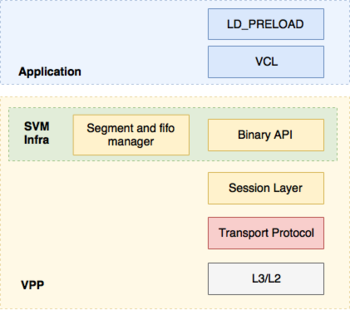
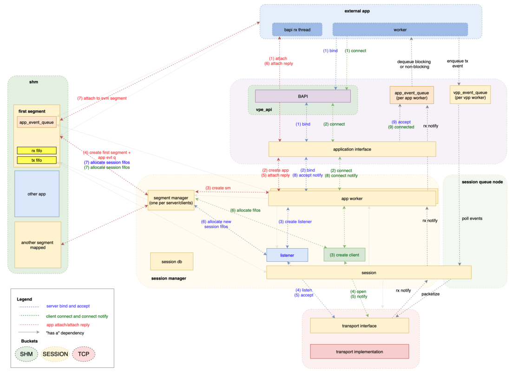
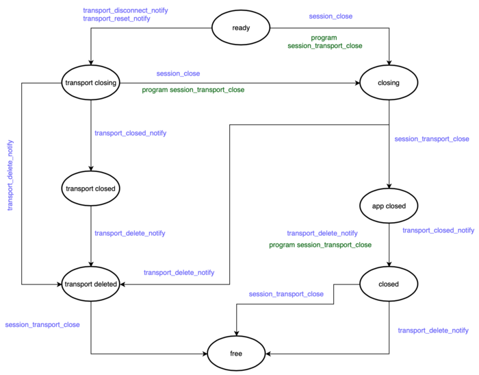
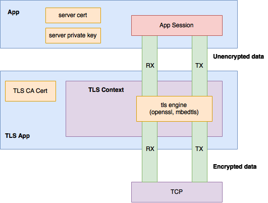

<div align=center>
	 
</div>

<br/>
<br/>
<br/>

<center><font size='20'>FD.io VPP：用户文档 HostStack</font></center>
<br/>
<br/>
<center><font size='5'>荣涛</font></center>
<center><font size='5'>2020年9月</font></center>
<br/>
<br/>
<br/>
<br/>

[HostStack](https://wiki.fd.io/view/VPP/HostStack)


# 1. 描述

VPP的主机协议栈是利用VPP传输，会话和应用程序层协议的用户空间实现。它大致包括四个主要部分：

* 接受可插拔传输协议的会话层
* 用于在VPP和应用程序之间推送数据的共享内存机制
* 传输协议实现（例如，TCP，QUIC，TLS，UDP）
* 通讯库（VCL）和LD_PRELOAD库




<br/>

# 2. 会话层架构

[会话层架构](https://wiki.fd.io/view/VPP/HostStack/SessionLayerArchitecture)



<br/>

## 2.1. 会话命名空间
为了限制通信范围，应用程序应在附加时提供它们所属的名称空间和一个秘密。命名空间是预先/独立配置的，并用作将应用程序与网络层资源（如接口和fib表）相关联的一种方式。因此，它们用作限制要使用的源ip并限制路由范围的方法。如果应用程序不请求名称空间，则会将其分配给默认名称空间，而默认名称空间又使用默认的fib，并且默认情况下未配置任何机密。

多个名称空间可以使用相同的fib表，在这种情况下，本地名称空间之间的通信使用共享内存fifos。但是，如果命名空间使用不同的fib表，则仅在ip路由之后才能建立通信，如果配置了任何fib表/ vrf泄漏，则不再支持共享内存通信。应该注意的是，当为名称空间提供sw_if_index时，零IP（inaddr_any）绑定将转换为绑定到所请求接口的绑定。

<br/>

## 2.2. 会话表
应用程序的另一种选择是在名称空间内提供其通信范围。也就是说，与可以从传输层和网络层获得帮助的全局范围相比，它们可以请求会话层的本地范围。在这种通信模式下，共享内存fifo（直通会话）被专门使用。尽管如此，由于现有的应用程序特性，仍必须在会话建立消息中提供in_addr_any（零个）本地主机ip地址。

这种分离允许我们定义一种会话层ACL，我们将其称为会话规则，从而允许/拒绝/重定向连接到应用程序。本地表是特定于名称空间的，可以用于出口会话/连接过滤：即，可以拒绝连接到给定的ip或ip前缀+端口。而全局表是特定于fib表的，可以用于入口过滤：即，可以允许或丢弃与ip / port的传入连接。

会话规则实现为match-mask-action数据结构，并支持最长的ip前缀匹配和端口通配符。

<br/>

## 2.3. 会话关闭状态机



<br/>

# 3. 文献资料

<br/>

## 3.1. TLS应用

[TLS应用](https://wiki.fd.io/view/VPP/HostStack/TLS)
堆栈通过自定义内置应用程序向其他客户端应用程序提供TLS服务。TLS应用程序实现了一种特殊的传输类型，从基础TCP传输的角度来看，它可以充当应用程序，而从客户端应用程序的角度来看，它也可以充当传输。我们将此垫片层称为TLS上下文。该应用程序不直接实现TLS协议，即记录层，握手协议以及密码计算和套件[1]，而是依赖于mbedtls [2]和openssl [3]之类的库。可以从较低角度看到该架构的高级视图：




因为加密和解密操作分别导致字节数的增加和减少，所以单个客户端会话需要四个FIFO。也就是说，在每个方向上，加密和未加密的数据都在不同的FIFO中进行缓冲。

为了建立客户端会话，通常采取以下步骤：

客户端应用程序请求到远程会话终结点的TLS连接。除了TLS传输，应用程序还必须指定对等方的：ip，端口和主机名，这是证书验证所必需的。如果未提供主机名，则接受所有服务器证书。
TLS应用程序（作为传输）会收到连接请求通知。分配TLS上下文，然后，TLS应用程序作为应用程序打开与远程传输终结点的TCP连接。
一旦建立了TCP连接并通知了TLS应用程序，mbedtls / openssl上下文将初始化为TLS客户端并启动握手协议。
握手完成后，TLS应用程序将使用配置的CA证书来验证服务器的证书并通知客户端应用程序。
此时，如果连接成功，则客户端应用程序可以开始与远程对等方交换数据。TLS应用程序读取推送到TX fifo中的数据，将其写入mbedtls / openssl，一旦加密，便推送到TCP连接的TX fifo中。相反，在接收时完成。

要初始化侦听会话，必须为应用程序配置服务器证书（将提供给客户端）和私钥。

<br/>

### 3.1.1. 组态
TLS应用程序在VPP启动时向会话层注册。当前可以通过启动配置文件配置以下内容：

ca-cert-path：CA证书的路径。默认情况下使用/etc/ssl/certs/ca-certificates.crt
use-test-cert-in-ca：用于指示是否应将嵌入式TLS服务器证书添加到CA链以进行测试的标志。
想要充当TLS服务器的应用程序必须配置TLS证书和私钥。这些可以在应用程序附件之后通过本机C API函数vnet_app_add_tls_cert / vnet_app_add_tls_key或通过APPLICATION_TLS_CERT_ADD / APPLICATION_TLS_KEY_ADD二进制API调用提供。

<br/>

### 3.1.2. 例子

<br/>

#### 3.1.2.1. HTTP服务器
要启动服务器，请执行以下操作：
```
# test http server uri tls://local-ip/port
```
在与服务器连接的浏览器中执行

```
https://vpp_ip/port/sh/run
```

如果一切顺利，则vpp应该已经返回了show run命令的结果。请注意，由于嵌入式服务器证书是自签名的，因此浏览器很可能会抱怨其有效性。

<br/>

#### 3.1.2.2. 回显客户端/服务器
在cli服务器上连接到的vpp实例上：

```
# test echo server uri tls://server_ip/port
```
在第二个vpp实例上，客户端连接到：
```
# test echo client uri tls://server_ip/port
```
这应该成功，因为如果未提供服务器主机名，则任何证书都被视为有效。要验证服务器的证书，请通过如下所示的主机名。嵌入式证书中的主机名是testtls.fd.io：
```
# test echo client uri tls://[testtls.fd.io]server_ip/port
```

<br/>

# 4. 主机协议栈入门

应用程序可以针对主机堆栈服务针对以下API进行链接：

* 内置C API。它只能由VPP中托管的应用程序使用
* “原始”会话层API。它不为异步通信提供任何支持
* 提供类似POSIX接口的VCL API。它带有自己的epoll实现。
* 通过LD_PRELOAD的POSIX API

可以使用许多测试应用程序来练习这些API。对于以下所有示例，假定已启动并正确配置了两个VPP实例以确保它们之间的网络连接。要测试网络连接是否可用，可以使用内置的ping工具。按照惯例，我们认为第一个vpp实例（vpp1）是服务器附加到的实例，第二个实例（vpp2）是客户端应用程序附加到的实例。为了说明的目的，所有示例都将TCP用作传输协议，但是可以使用其他可用协议。

<br/>

# 5. 内置Echo服务器/客户端
在vpp1上，从cli执行以下操作：

```
# test echo server uri tcp://vpp1_ip/port
```
在vpp2上：
```
# test echo client uri tcp://vpp1_ip/port
```

有关如何进一步配置客户端/服务器应用程序以进行吞吐量和CPS测试的更多详细信息，[请参见此处](https://wiki.fd.io/view/VPP/HostStack/EchoClientServer)

<br/>

# 6. 外部Echo服务器/客户端（vpp_echo）
VPP外部回显服务器/客户端测试应用程序（vpp_echo）是一个定制的性能测试应用程序，它支持所有VPP HostStack传输层协议：

* tcp
* udp
* quic

Vpp_echo利用“本地HostStack API”来验证性能，并使用单向和双向数据流正确处理连接/流事件。可以在构建树中找到

```
$ ./build-root/build-vpp[_debug]-native/vpp/bin/vpp_echo
```
从vpp 20.01开始，包含在主要的vpp debian软件包中（例如vpp_20.01-release-amd64.deb）

启动vpp1并附加服务器应用程序：
```
$ ./build-root/build-vpp_debug-native/vpp/bin/vpp_echo uri tcp://vpp1_ip/port
```
然后启动vpp2并附加客户端：
```
$ ./build-root/build-vpp_debug-native/vpp/bin/vpp_echo client uri tcp://vpp1_ip/port
```
vpp_echo的当前命令行选项是：

```
vpp_echo --help
Usage: vpp_echo [socket-name SOCKET] [client|server] [uri URI] [OPTIONS]
Generates traffic and assert correct teardown of the hoststack

  socket-name PATH    Specify the binary socket path to connect to VPP
  use-svm-api         Use SVM API to connect to VPP
  test-bytes[:assert] Check data correctness when receiving (assert fails on first error)
  fifo-size N[K|M|G]  Use N[K|M|G] fifos
  mq-size N           Use mq with N slots for [vpp_echo->vpp] communication
  max-sim-connects N  Do not allow more than N mq events inflight
  rx-buf N[K|M|G]     Use N[Kb|Mb|GB] RX buffer
  tx-buf N[K|M|G]     Use N[Kb|Mb|GB] TX test buffer
  appns NAMESPACE     Use the namespace NAMESPACE
  all-scope           all-scope option
  local-scope         local-scope option
  global-scope        global-scope option
  secret SECRET       set namespace secret
  chroot prefix PATH  Use PATH as memory root path
  sclose=[Y|N|W]      When stream is done, send[Y]|nop[N]|wait[W] for close
  nuris N             Cycle through N consecutive (src&dst) ips when creating connections
  lcl IP              Set the local ip to use as a client (use with nuris to set first src ip)

  time START:END      Time between evts START & END, events being :
                       start - Start of the app
                       qconnect    - first Connection connect sent
                       qconnected  - last Connection connected
                       sconnect    - first Stream connect sent
                       sconnected  - last Stream got connected
                       lastbyte    - Last expected byte received
                       exit        - Exiting of the app
  rx-results-diff     Rx results different to pass test
  tx-results-diff     Tx results different to pass test
  json                Output global stats in json
  stats N             Output stats evry N secs
  log=N               Set the log level to [0: no output, 1:errors, 2:log]
  crypto [engine]     Set the crypto engine [openssl, vpp, picotls, mbedtls]

  nclients N          Open N clients sending data
  nthreads N          Use N busy loop threads for data [in addition to main & msg queue]
  TX=1337[K|M|G]|RX   Send 1337 [K|M|G]bytes, use TX=RX to reflect the data
  RX=1337[K|M|G]      Expect 1337 [K|M|G]bytes

-- QUIC specific options -- 
  quic-setup OPT      OPT=serverstream : Client open N connections. 
                       On each one server opens M streams
                      OPT=default : Client open N connections.
                       On each one client opens M streams
  qclose=[Y|N|W]      When connection is done send[Y]|nop[N]|wait[W] for close
  uni                 Use unidirectional streams

  quic-streams N      Open N QUIC streams (defaults to 1)

Default configuration is :
 server nclients 1 [quic-streams 1] RX=64Kb TX=RX
 client nclients 1 [quic-streams 1] RX=64Kb TX=64Kb

```

<br/>

# 7. VCL套接字客户端/服务器
有关更多详细信息，请参见此处的教程
[VCL套接字客户端/服务端](https://wiki.fd.io/view/VPP/VPPCommunicationsLibrary)


<br/>


# 8. 教程/测试应用

* [测试HTTP Server应用](https://wiki.fd.io/view/VPP/HostStack/TestHttpServer)
* [测试Echo客户端/服务器应用程序](https://wiki.fd.io/view/VPP/HostStack/EchoClientServer)
* [测试代理应用](https://wiki.fd.io/view/VPP/HostStack/TestProxy)
* [sshd与LD_PRELOAD](https://wiki.fd.io/view/VPP/HostStack/LDP/sshd)
* [具有LD_PRELOAD的iperf3](https://wiki.fd.io/view/VPP/HostStack/LDP/iperf)
* [带有LD_PRELOAD的Nginx](https://wiki.fd.io/view/VPP/HostStack/LDP/nginx)

<br/>

# 9. 演示运行清单

* [2017年DPDK北美峰会](https://wiki.fd.io/images/f/f2/Vpp-hoststack.pdf)
* [FD.io Mini Summit KubeCon 2017](https://wiki.fd.io/images/b/b4/Vpp-hoststack-kc.pdf)
* [FD.io Mini Summit KubeCon欧洲2018](https://wiki.fd.io/images/1/15/Vpp-hoststack-kc-eu-18.pdf)
* FD.io Mini Summit KubeCon NA 2018 [幻灯片](https://wiki.fd.io/images/b/b6/Fcoras-vpp-hoststack-kc-na18.pdf)和[视频](https://www.youtube.com/watch?v=3Pp7ytZeaLk)
* FD.io Mini Summit KubeCon EU 2019 [幻灯片](https://wiki.fd.io/images/9/9c/Vpp-hoststack-kc-eu19.pdf)和[视频](https://youtu.be/5c5ymviBP7k)


<br/>
<div align=right>	以上内容由荣涛翻译整理自网络。</div>