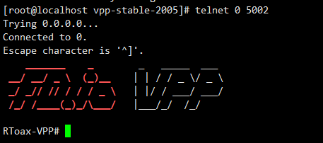

<center><font size='20'>FD.io VPP：用户文档</font></center>

<center><font size='5'>荣涛</font></center>
<center><font size='5'>中科晶上</font></center>


[What is the Vector Packet Processor](https://fd.io/docs/vpp/master/#)


# 1. 什么是向量封包处理器（VPP）

FD.io的矢量包处理器（VPP）是一个快速，可扩展的2-4层多平台网络堆栈。它在Linux用户空间 中的多种体系结构上运行，包括x86，ARM和Power体系结构。

VPP的高性能网络堆栈正迅速成为全球应用程序选择的网络堆栈。

通过广泛使用`插件`，VPP不断得到增强。该 `数据平面开发套件（DPDK）` 就是一个很好的例子。它提供了VPP的一些重要功能和驱动程序。**（DPDK在VPP看来是一个插件）**

**VPP支持与OpenStack和Kubernetes集成**。网络管理功能包括配置，计数器，采样等。对于开发人员来说，VPP包括高性能的事件记录和多种数据包跟踪。开发调试映像包括完整的符号表和广泛的一致性检查。

一些VPP用例包括vSwitch，vRouter，网关，防火墙和负载均衡器，仅举几例。

**`Should be MORE`**

# 2. 向量封包处理器（VPP）

本节介绍了FD.io VPP的一些核心概念和功能。

从FD.io开始，VPP使用了一种称为矢量包处理的技术。与使用标量处理的数据包处理应用程序相比，这使FD.io VPP的性能有了显着提高。

同样，Fd.io VPP**模块化设计**的核心是“`数据包处理图`”。**这使FD.io VPP可扩展且易于扩展**。

FD.io软件还包括功能丰富的网络堆栈。这包括一个利用VPP基于图的转发模型和矢量化数据包处理的TCP主机堆栈。

FD.io VPP每晚都会通过CSIT项目进行功能和性能测试。

有关这些功能的更多信息，请单击下面的链接或按下一步。

* [标量与矢量数据包处理](https://fd.io/docs/vpp/master/whatisvpp/scalar-vs-vector-packet-processing.html)
* [包处理图](https://fd.io/docs/vpp/master/whatisvpp/extensible.html)
* [网络协议栈](https://fd.io/docs/vpp/master/whatisvpp/networkstack.html)
* [TCP主机栈](https://fd.io/docs/vpp/master/whatisvpp/hoststack.html)
* [开发人员功能](https://fd.io/docs/vpp/master/whatisvpp/developer.html)
* [架构和操作系统](https://fd.io/docs/vpp/master/whatisvpp/supported.html)
* [性能](https://fd.io/docs/vpp/master/whatisvpp/performance.html)


## 2.1. 标量与矢量数据包处理

FD.io VPP是`使用矢量包处理而非标量包`处理开发的。

**向量数据包处理是FD.io VPP和DPDK等高性能数据包处理应用程序中的常用方法**。基于标量的方法往往受到不一定具有严格性能要求的网络堆栈的青睐。

### 2.1.1. 标量分组处理

标量数据包处理网络堆栈通常一次处理一个数据包：中断处理功能从网络接口获取单个数据包，并通过一组功能对其进行处理：fooA调用fooB调用fooC等等。

```
+---> fooA(packet1) +---> fooB(packet1) +---> fooC(packet1)
+---> fooA(packet2) +---> fooB(packet2) +---> fooC(packet2)
...
+---> fooA(packet3) +---> fooB(packet3) +---> fooC(packet3)
```

标量数据包处理很简单，但是在以下方面效率低下：

当代码路径长度超过微处理器指令高速缓存（I-cache）的大小时，由于微处理器不断地加载新指令而发生了抖动。在此模型中，每个数据包都会产生相同的I缓存未命中集。

当堆栈局部内存脱离微处理器的第1层数据缓存（D-cache）时，关联的深度调用堆栈还将增加负载存储单元压力。

### 2.1.2. 矢量包处理

相反，矢量数据包处理网络堆栈一次处理多个数据包，称为“数据包矢量”或简称为“矢量”。中断处理函数从网络接口获取数据包的向量，并通过一组函数处理该向量：fooA调用fooB调用fooC等等。

```
+---> fooA([packet1, +---> fooB([packet1, +---> fooC([packet1, +--->
            packet2,             packet2,             packet2,
            ...                  ...                  ...
            packet256])          packet256])          packet256])
```

此方法可修复：

* 通过分摊跨多个数据包的I-cache负载的成本，上述I-cache抖动问题。
* 通过从网络接口一次接收多达256个数据包的向量，并使用节点的有向图对其进行处理，从而与深度调用堆栈相关联的效率低下。图调度程序一次调用一个节点调度功能，将堆栈深度限制为几个堆栈帧。

这种方法实现的进一步优化是流水线处理和预取，以最大程度地减少表数据的读取延迟并并行化处理数据包所需的数据包负载。


## 2.2. 包处理图

[包处理图](https://fd.io/docs/vpp/master/whatisvpp/extensible.html)

FD.io VPP设计的核心是`数据包处理图`

这使得软件：

* 可插拔，易于理解和扩展
* 成熟的图节点架构
* 全面控制以重组管道
* 快速，插件是平等的公民

FD.io VPP数据包处理管道被分解为“数据包处理图”。这种模块化方法意味着任何人都可以“插入”新的图节点。这使得VPP易于扩展，并且意味着可以针对特定目的自定义插件。VPP也可以通过其低级API进行配置。


在运行时，FD.io VPP平台会`组合来自RX环的数据包向量`，通常单个向量中`最多256个数据包`。然后，`将包处理图逐个节点（包括插件）应用于整个包向量`。当将每个图节点表示的网络处理依次应用于每个包时，接收到的包通常会遍历向量中的包处理图节点。图节点是小型且模块化的，并且松散耦合。这使引入新图节点和重新连接现有图节点变得容易。

**`插件`是共享库 ，并在运行时由VPP加载。**VPP通过在插件路径中搜索库来查找插件，然后在启动时依次动态地加载每个插件。插件可以引入新的图节点或重新排列数据包处理图。您可以完全独立于FD.io VPP源代码树来构建插件，这意味着您可以将其视为独立的组件。


## 2.3. 网络协议栈

本节简要介绍了FD.io网络堆栈，并介绍了一些好处：

* `第2-4层网络堆栈`
    快速查找表的路由，网桥条目
    任意n元组分类器
    控制平面，交通管理和覆盖

* `Linux和FreeBSD支持`
    支持标准操作系统接口，例如**`AF_Packet`，Tun / Tap和Netmap**。

* `DPDK的网络和加密硬件支持。`
* `容器和虚拟化支持`

    半虚拟化接口；虚拟主机和Virtio
    通过PCI直通的网络适配器
    本机容器接口；记忆体

* `主机栈`

* `通用数据平面：一个代码库，适用于许多用例`
    离散电器；如路由器和交换机。
    **云基础架构和虚拟网络功能**
    **云原生基础架构**
    所有用例都使用相同的二进制包。

* `借助CSIT开箱即用的生产质量。`

## 2.4. TCP主机栈

VPP的主机堆栈利用VPP的基于图的转发模型和矢量化的数据包处理来确保高吞吐量和大规模传输协议的终止。它公开了各种API，这些API除了**允许有效使用用户空间的应用程序和生成数据**外，**还可以实现高效的本地应用程序间通信**。

在较高级别，VPP的主机栈包含3个主要组件：

* 促进传输协议和应用程序之间交互的`会话层`
* `可插拔的传输协议`，包括TCP，QUIC，TLS，UDP
* `VCL`（VPPComs库）是一组库，旨在从应用程序角度简化堆栈的易用性

所有这些组件都是定制构建的，以适合VPP的体系结构并利用其速度。结果，在以下方面投入了大量精力：

* 构建一个可传输的**可插入会话层**，该层使用定制的**共享内存**基础结构抽象应用程序和传输之间的交互。值得注意的是，这还允许将通常在应用程序中实现的传输协议（例如`QUIC`和`TLS`）在VPP中实现。
* **干净的TCP实现**，支持向量化数据包处理，并遵循VPP的高度可扩展的线程模型。该实现符合RFC，支持大量的高速TCP协议功能，并且已通过Defensic的Codenomicon 1M +测试套件进行了验证。
* **VCL**，一个`在用户空间中模拟传统异步通信功能的库`，同时允许在需要时开发新的模式。
* 实施高性能的**“直通”通信模式**，该模式使连接到vpp的应用程序可以`在共享内存上透明地交换数据`，而不会产生传统传输协议的额外费用。测试表明，此方法比传统的容器间网络高效得多。


## 2.5. 开发人员功能

[开发人员功能](https://fd.io/docs/vpp/master/whatisvpp/developer.html)

本节介绍有关VPP环境以及开发人员可以使用的一些功能的一些信息。

* 广泛的运行时计数器；吞吐量，[每个周期的指令](https://en.wikipedia.org/wiki/Instructions_per_cycle)，错误，事件等。
* 综合管道追踪设施
* 多语言API绑定
* 集成命令行用于调试
* 容错和可升级
    作为容错的标准用户空间进程运行，软件崩溃很少需要重启进程。
    与在内核中运行类似的数据包处理相比，提高了容错性和可升级性，软件更新从不要求系统重启。
    与类似的内核代码相比，开发经验更容易
    硬件隔离和保护（[iommu](https://en.wikipedia.org/wiki/Input%E2%80%93output_memory_management_unit)）

* **为安全而打造**
    广泛的白盒测试
    图像段基地址随机化
    共享内存段基地址随机化
    堆栈边界检查
    具有Coverity的静态分析

## 2.6. 架构和操作系统

[架构和操作系统](https://fd.io/docs/vpp/master/whatisvpp/supported.html)

VPP支持以下体系结构和操作系统：

### 2.6.1. 支持的架构

FD.io VPP平台支持：

* x86 / 64
* ARM-AArch64

### 2.6.2. 操作系统

FD.io VPP支持在以下最新LTS操作系统版本上安装软件包：

操作系统：

* Debian
* Ubuntu
* CentOS
* OpenSUSE


## 2.7. 性能

FD.io VPP的优点之一是在相对低功耗的计算上具有高性能。包括以下内容。

* **专为商用硬件设计的高性能用户空间网络栈**：
    L2，L3和L4功能和封装。

* 优化的数据包接口，支持多种用例：
    集成的虚拟主机用户后端，可实现虚拟机到虚拟机的高速连接
    集成的memif容器后端，可实现高速的容器到容器连接
    一个基于vhost的集成接口，可将数据包发送到Linux内核

* 相同的优化代码路径在主机以及VM和Linux**容器**内部运行
* 利用同类最佳的开源驱动程序技术：[DPDK](https://www.dpdk.org/)
* 经过大规模测试；线性核心扩展，经过数百万个流和mac地址测试

设计这些功能是为了充分利用常见的微处理器优化技术，例如：

* 通过处理向量中的数据包减少缓存和TLS丢失
* 通过矢量指令（例如SSE，AVX和NEON）实现[IPC](https://en.wikipedia.org/wiki/Instructions_per_cycle)增益
* `消除模式切换，上下文切换和阻塞`，从而始终做有用的工作
* 缓存行`对齐`的缓冲区，提高缓存和内存效率

### 2.7.1. 持续系统集成和测试（CSIT）
连续系统集成和测试（CSIT）项目为FD.io VPP提供功能和性能测试。此测试集中于功能和性能回归。结果将发布到CSIT测试报告中。

有关CSIT的更多信息，请查看以下链接：

* CSIT代码文档
* [CSIT测试概述](https://docs.fd.io/csit/master/report/introduction/overview.html)
* [VPP性能仪表板](https://docs.fd.io/csit/master/trending/introduction/index.html)

### 2.7.2. CSIT数据包吞吐量示例

以下是一些CSIT测试报告的指针。测试的标题如下所示：

```
<数据包大小>-<线程数> <核心数>-<测试>-<接口类型>
```

例如，标题为`64b-2t1c-l2switching-base-i40e`的测试是`使用i40e接口使用64个字节的数据包，2个线程和1个核心进行l2交换`的测试。

这里有一些例子：

* [L2以太网交换](https://docs.fd.io/csit/master/report/vpp_performance_tests/packet_throughput_graphs/l2.html)
* [IPv4路由](https://docs.fd.io/csit/master/report/vpp_performance_tests/packet_throughput_graphs/ip4.html)
* IPv6路由

### 2.7.3. 趋势吞吐量图

这些是CSIT 趋势仪表板中的一些趋势数据包吞吐量图。请注意，趋势图中的性能将根据软件开发周期每晚更改一次：

* 二层以太网交换趋势
* [IPv4路由趋势](https://docs.fd.io/csit/master/trending/trending/ip4.html)
* IPv6路由趋势


**`Should be MORE`**


# 3. VPP入门

* [下载并安装VPP](https://fd.io/docs/vpp/master/gettingstarted/installing/index.html)
* [渐进式VPP教程](https://fd.io/docs/vpp/master/gettingstarted/progressivevpp/index.html)
* [对于用户](https://fd.io/docs/vpp/master/gettingstarted/users/index.html)
* [对于开发人员](https://fd.io/docs/vpp/master/gettingstarted/developers/index.html)
* [撰写文件](https://fd.io/docs/vpp/master/gettingstarted/writingdocs/index.html)


## 3.1. 下载并安装VPP

如果要使用VPP，可以方便地从现有软件包中安装二进制文件。本指南介绍了如何提取，安装和运行VPP软件包。

本节提供有关如何在Ubuntu，Centos和openSUSE平台上安装VPP二进制文件的说明。

使用Package Cloud安装FD.io VPP。有关如何使用程序包云安装VPP的完整说明，请参阅程序包云。

### 3.1.1. 在Ubuntu上安装

**`略`**

### 3.1.2. 在Centos上安装

这部分会单独出一份文档，这里简单介绍官网的安装方法，这种方法没有配置DPDK插件。
[CentOS7安装VPP](https://fd.io/docs/vpp/master/gettingstarted/installing/centos.html)

#### 3.1.2.1. 更新操作系统

在开始安装存储库之前，最好先更新和升级操作系统。运行以下命令以更新操作系统并获取一些软件包。

```bash
$ sudo yum update
$ sudo yum install pygpgme yum-utils
```

#### 3.1.2.2. 软件包云存储库
构建工件也将发布到`packagecloud.io`存储库中。这包括官方的发行点。要使用这些构建工件中的任何一个，请创建一个文件 “ `/etc/yum.repos.d/fdio-release.repo`”，其内容指向所需的版本。以下是所需内容的一些常见示例：

#### 3.1.2.3. VPP最新版本
要允许“ yum”访问官方VPP版本，请创建包含以下内容的文件 “ /etc/yum.repos.d/fdio-release.repo”。

```bash
$ cat /etc/yum.repos.d/fdio-release.repo
[fdio_release]
name=fdio_release
baseurl=https://packagecloud.io/fdio/release/el/7/$basearch
repo_gpgcheck=1
gpgcheck=0
enabled=1
gpgkey=https://packagecloud.io/fdio/release/gpgkey
sslverify=1
sslcacert=/etc/pki/tls/certs/ca-bundle.crt
metadata_expire=300

[fdio_release-source]
name=fdio_release-source
baseurl=https://packagecloud.io/fdio/release/el/7/SRPMS
repo_gpgcheck=1
gpgcheck=0
enabled=1
gpgkey=https://packagecloud.io/fdio/release/gpgkey
sslverify=1
sslcacert=/etc/pki/tls/certs/ca-bundle.crt
metadata_expire=300
```

更新您的本地yum缓存。

```bash
$ sudo yum clean all
$ sudo yum -q makecache -y --disablerepo='*' --enablerepo='fdio_release'
```

在“安装VPP”命令将安装最新的版本。要安装较早的发行版，请运行以下命令以获取所提供的发行版列表。

```bash
$ sudo yum --showduplicates list vpp* | expand
```

#### 3.1.2.4. VPP Master分支
要允许yum从VPP master分支访问夜间版本，请创建具有以下内容的文件“ /etc/yum.repos.d/fdio-release.repo”。

```bash
$ cat /etc/yum.repos.d/fdio-release.repo
[fdio_master]
name=fdio_master
baseurl=https://packagecloud.io/fdio/master/el/7/$basearch
repo_gpgcheck=1
gpgcheck=0
enabled=1
gpgkey=https://packagecloud.io/fdio/master/gpgkey
sslverify=1
sslcacert=/etc/pki/tls/certs/ca-bundle.crt
metadata_expire=300

[fdio_master-source]
name=fdio_master-source
baseurl=https://packagecloud.io/fdio/master/el/7/SRPMS
repo_gpgcheck=1
gpgcheck=0
enabled=1
gpgkey=https://packagecloud.io/fdio/master/gpgkey
sslverify=1
sslcacert=/etc/pki/tls/certs/ca-bundle.crt
metadata_expire=300
```

更新您的本地yum缓存。

```bash
$ sudo yum clean all
$ sudo yum -q makecache -y --disablerepo='*' --enablerepo='fdio_master'
```


在“安装VPP”命令将在树枝上安装最新版本。运行以下命令以获取分支产生的图像列表。

```bash
$ sudo yum clean all
$ sudo yum --showduplicates list vpp* | expand
```

#### 3.1.2.5. 安装VPP RPM

要安装VPP数据包引擎，请运行以下命令：

```bash
$ sudo yum install vpp
```

该VPP RPM依赖于VPP-LIB和VPP SELinux的政策 RPM的，所以它们将被安装好了。

*注意：该VPP SELinux的政策不会在系统上启用SELinux的。它将安装自定义VPP SELinux策略，如果随时启用SELinux，将使用该策略。*


还有其他可选软件包。这些软件包可以与上面的命令结合使用，一次安装，也可以根据需要安装：

```bash
sudo yum install vpp-plugins vpp-devel vpp-api-python vpp-api-lua vpp-api-java vpp-debuginfo vpp-devel libvpp0
```
#### 3.1.2.6. 启动VPP

在系统上安装VPP后，要在CentOS上将VPP作为systemd服务运行，请运行以下命令：

```bash
$ sudo systemctl start vpp
```
然后，要使VPP在系统重新引导时启动，请运行以下命令：

```bash
$ sudo systemctl enable vpp
```
除了将VPP作为系统服务运行之外，还可以手动启动VPP或使其在GDB中运行以进行调试。有关更多详细信息和针对特定系统定制VPP的方法，请参阅运行VPP。

#### 3.1.2.7. 卸载VPP RPM
要卸载VPP RPM，请运行以下命令：

```bash
$ sudo yum autoremove vpp*
```

### 3.1.3. 在openSUSE上安装


**`略`**

### 3.1.4. 包说明

以下是与VPP一起安装的软件包的简要说明。

* [vpp](https://fd.io/docs/vpp/master/gettingstarted/installing/packages.html#vpp)
    矢量包处理可执行文件。这是使用VPP必须安装的主要软件包。该软件包包含：
    vpp-矢量数据包引擎
    vpp_api_test-矢量数据包引擎API测试工具
    vpp_json_test-矢量数据包引擎JSON测试工具

* [vpp-lib](https://fd.io/docs/vpp/master/gettingstarted/installing/packages.html#vpp-lib)
    矢量包处理运行时库。该“VPP”的软件包依赖于这个包，所以它总是会被安装。该软件包包含VPP共享库，其中包括：
    vppinfra-支持矢量，哈希，位图，池和字符串格式的基础库。
    svm-虚拟机库
    vlib-矢量处理库
    vlib-api-二进制API库
    vnet-网络堆栈库

* [vpp-plugins](https://fd.io/docs/vpp/master/gettingstarted/installing/packages.html#vpp-plugins)
    矢量数据包处理插件模块。
    acl
    dpdk
    flowprobe
    gtpu
    ixge
    kubeproxy
    l2e
    lb
    memif
    nat
    pppoe
    sixrd
    stn

* [vpp-dbg](https://fd.io/docs/vpp/master/gettingstarted/installing/packages.html#vpp-dbg)
    矢量包处理调试符号。

* [vpp-dev](https://fd.io/docs/vpp/master/gettingstarted/installing/packages.html#vpp-dev)
    矢量包处理开发支持。该软件包包含VPP库的开发支持文件。

* vpp-api-python
    VPP Binary API的Python绑定。

* vpp-api-lua
    Lua绑定VPP Binary API。

* [vpp-selinux-policy](https://fd.io/docs/vpp/master/gettingstarted/installing/packages.html#vpp-selinux-policy)
    该软件包包含VPP定制SELinux策略。它仅为Fedora和CentOS发行版生成。对于那些发行版，“ vpp”软件包取决于此软件包，因此它将始终被安装。它不会在系统上启用SELinux。它将安装自定义VPP SELinux策略，如果随时启用SELinux，将使用该策略。


## 3.2. 渐进式VPP教程

了解如何使用Vagrant在单个Ubuntu 16.04 VM上运行FD.io VPP，本演练涵盖了基本FD.io VPP方案。将使用有用的FD.io VPP命令，并将讨论基本操作以及系统上正在运行的FD.io VPP的状态。

*注意：这并非旨在作为“如何在生产环境中运行”的一组说明。*


### 3.2.1. 设置环境

***PS：Vagrant是一个基于Ruby的工具，用于创建和部署虚拟化开发环境.***

有关将`VPP与Virtual Box / Vagrant一​​起使用`的更多信息，请参阅[VM与Vagrant一​​起使用](https://fd.io/docs/vpp/master/reference/vppvagrant/index.html#vppvagrant)

#### 3.2.1.1. 安装Virtual Box和Vagrant

**`略`**

#### 3.2.1.2. 创建一个Vagrant目录

**`略`**

#### 3.2.1.3. 运行Vagrant

**`略`**

#### 3.2.1.4. 使用Vagrant设置VPP环境

**`略`**

#### 3.2.1.5. 安装VPP

这部分会单独出一份文档，这里简单介绍官网的安装方法，这种方法没有配置DPDK插件。
[CentOS7安装VPP](https://fd.io/docs/vpp/master/gettingstarted/installing/centos.html)
**`略`**

#### 3.2.1.6. 创建一些启动文件

我们将创建一些启动文件供本教程使用。通常，您将修改`/etc/vpp/startup.conf`中的startup.conf文件。有关此文件的更多信息，请参考`VPP配置-CLI`和`'startup.conf'`。

在运行多个VPP实例时，每个实例都需要指定一个“名称”或“前缀”。在下面的示例中，“名称”或“前缀”为“ vpp1”。请注意，只有一个实例可以使用dpdk插件，因为该插件正在尝试获取文件的锁。我们创建的这些启动文件将禁用dpdk插件。

还要在我们的启动文件中注意`api-segment`。`api-segment {prefix vpp1}` 告诉FD.io VPP如何用不同于默认名称的方式为您的VPP实例命名`/ dev / shm /`中的文件。`unix {cli-listen /run/vpp/cli-vpp1.sock}` 告诉vpp在被`vppctl`寻址时使用非默认套接字文件。这里我也会单独做出配置文件`/etc/vpp/startup.conf`的详细说明（荣涛 [rongtao@sylincom.com](rongtao@sylincom.com)）。

现在，使用以下内容创建2个名为**startup1.conf**和**startup2.conf**的文件。这些文件可以位于任何地方。启动VPP时，我们指定位置。

startup1.conf：
```
unix {cli-listen /run/vpp/cli-vpp1.sock}
api-segment { prefix vpp1 }
plugins { plugin dpdk_plugin.so { disable } }
```

startup2.conf：

```
unix {cli-listen /run/vpp/cli-vpp2.sock}
api-segment { prefix vpp2 }
plugins { plugin dpdk_plugin.so { disable } }
```

### 3.2.2. 运行VPP

使用我们在设置环境中创建的文件，我们现在将启动并运行VPP。

VPP在用户空间中运行。在生产环境中，通常会使用DPDK来运行它以连接到实际的NIC或使用vhost来连接到VM。在这种情况下，通常会运行一个VPP实例。

就本教程而言，运行多个VPP实例并将它们彼此连接以形成拓扑将非常有用。幸运的是，VPP支持这一点。

使用我们在安装程序中创建的文件，我们将启动VPP。

```
$ sudo /usr/bin/vpp -c startup1.conf
vlib_plugin_early_init:361: plugin path /usr/lib/vpp_plugins:/usr/lib/vpp_plugins
load_one_plugin:189: Loaded plugin: abf_plugin.so (ACL based Forwarding)
load_one_plugin:189: Loaded plugin: acl_plugin.so (Access Control Lists)
load_one_plugin:189: Loaded plugin: avf_plugin.so (Intel Adaptive Virtual Function (AVF) Device Plugin)
.........
$
```

如果VPP无法启动，则可以尝试将nodaemon添加到unix部分的startup.conf文件中 。这应该在输出中提供更多信息。

使用nodaemon的startup.conf示例：

```
unix {nodaemon cli-listen /run/vpp/cli-vpp1.sock}
api-segment { prefix vpp1 }
plugins { plugin dpdk_plugin.so { disable } }
```

命令vppctl将启动一个VPP Shell，您可以使用它以交互方式运行VPP命令。

现在，我们应该能够执行VPP Shell并显示版本了。

```
$ sudo vppctl -s /run/vpp/cli-vpp1.sock
    _______    _        _   _____  ___
 __/ __/ _ \  (_)__    | | / / _ \/ _ \
 _/ _// // / / / _ \   | |/ / ___/ ___/
 /_/ /____(_)_/\___/   |___/_/  /_/

vpp# show version
vpp v18.07-release built by root on c469eba2a593 at Mon Jul 30 23:27:03 UTC 2018
vpp#
```



*注意：使用ctrl-d或q退出VPP Shell。*

**如果要运行多个VPP实例，请确保在完成后将其杀死**。

您可以使用如下所示的内容：

```bash
$ ps -eaf | grep vpp
root      2067     1  2 05:12 ?        00:00:00 /usr/bin/vpp -c startup1.conf
vagrant   2070   903  0 05:12 pts/0    00:00:00 grep --color=auto vpp
$ kill -9 2067
$ ps -eaf | grep vpp
vagrant   2074   903  0 05:13 pts/0    00:00:00 grep --color=auto vpp
```

**`TODO`**
**`TODO`**
**`TODO`**
**`TODO`**


[创建一个界面](https://fd.io/docs/vpp/master/gettingstarted/progressivevpp/interface.html)


**`TODO`**


# 4. VPP Wiki，Doxygen和其他链接

* [FD.io主站点](https://fd.io/docs/vpp/master/links/index.html#fd-io-main-site)
* [VPP Wiki](https://fd.io/docs/vpp/master/links/index.html#vpp-wiki)
* [源代码文档（doxygen）](https://fd.io/docs/vpp/master/links/index.html#source-code-documents-doxygen)

**`TODO`**


# 5. 用例

* [带容器的VPP](https://fd.io/docs/vpp/master/usecases/containers.html)
* [具有Iperf3和TRex的VPP](https://fd.io/docs/vpp/master/usecases/simpleperf/index.html)
* [带有虚拟机的FD.io VPP](https://fd.io/docs/vpp/master/usecases/vhost/index.html)
* [带有VMware / Vmxnet3的VPP](https://fd.io/docs/vpp/master/usecases/vmxnet3.html)
* [带有FD.io VPP的访问控制列表（ACL）](https://fd.io/docs/vpp/master/usecases/acls.html)
* [云中的VPP](https://fd.io/docs/vpp/master/usecases/vppcloud.html)
* [使用VPP作为家庭网关](https://fd.io/docs/vpp/master/usecases/homegateway.html)
* [Contiv / VPP](https://fd.io/docs/vpp/master/usecases/contiv/index.html)
* [网络模拟器插件](https://fd.io/docs/vpp/master/usecases/networksim.html)
* [构建VPP Web应用程序](https://fd.io/docs/vpp/master/usecases/webapp.html)
* [基于容器的网络仿真](https://fd.io/docs/vpp/master/usecases/container_test.html)

**`TODO`**

# 6. 发行功能

网站发行版最高为`19.08.`，我在`10.170.7.166`上安装的是`20.05`.

* [VPP版本19.08的功能](https://fd.io/docs/vpp/master/featuresbyrelease/vpp1908.html)
* VPP版本19.04的功能
* VPP版本19.01的功能


**`TODO`**


# 7. 参考

* [有用的调试CLI](https://fd.io/docs/vpp/master/reference/cmdreference/index.html)
* [虚拟机与游民](https://fd.io/docs/vpp/master/reference/vppvagrant/index.html)
* [阅读文档](https://fd.io/docs/vpp/master/reference/readthedocs/index.html)
* [Github仓库](https://fd.io/docs/vpp/master/reference/github/index.html)


**`TODO`**


