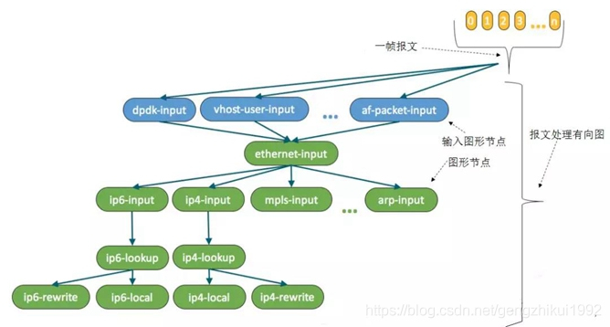
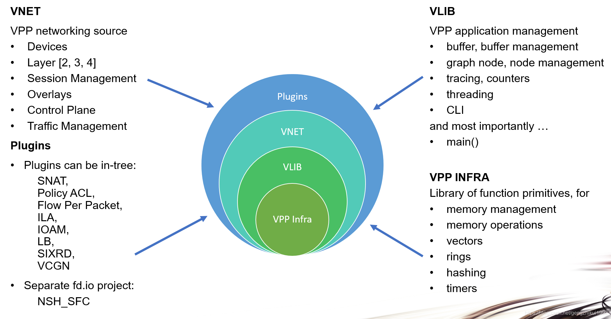
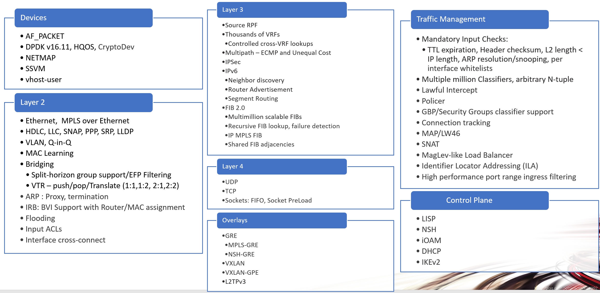
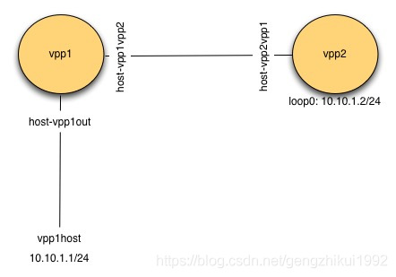
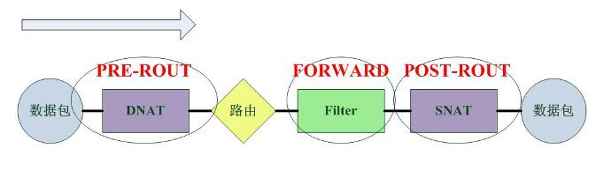
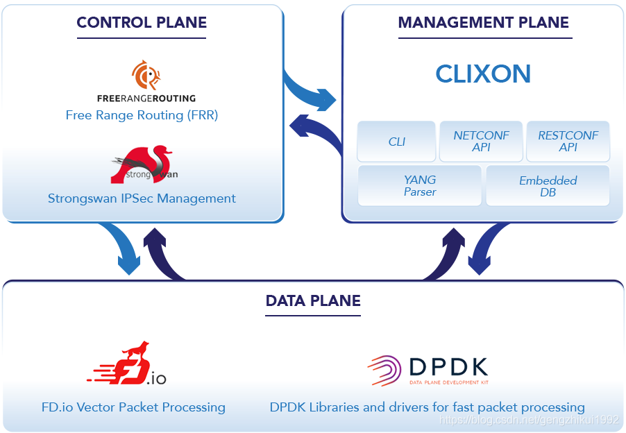
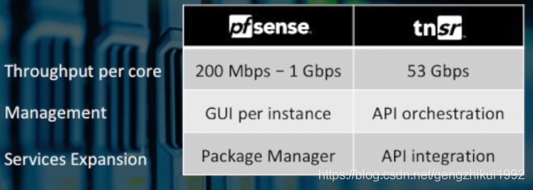

## 3.5. 基于DPDK+VPP实现高性能防火墙

[基于DPDK+VPP实现高性能防火墙](https://blog.csdn.net/gengzhikui1992/article/details/86712367)

这里给出一个DPDK+VPP实现高性能防火墙的CSDN文章，希望对理解官方文档有帮助。

### 3.5.1. 数据平面和用户态协议栈
传统基于linux netfilter实现防火墙，虽然方便，但是性能很差。于是pfring/netmap/dpdk/xdp等机制，都要bypass掉内核协议栈。

多年来，各大操作系统（Linux/Windows/Freebsd)的网络协议栈一直都在内核中实现。其实网络协议栈只是一个应用，而不是操作系统的范畴，没有人规定网络协议栈一定是要早内核实现的。这些操作系统的开发者们将一切和具体业务无关的东西都塞进了操作系统内核。

其实通信行业的，早就有了数据面，控制面，管理面分离的理念，只是这个理念没有在通用操作系统中推行起来。随着计算机网络技术的发展，通信技术和计算机网络技术逐渐融合。是时候把网络协议栈（数据平面）从操作系统剥离出来了，让操作系统去做控制的事情。

当网络协议栈，从内核态转移到用户态之后。很多之前利用内核协议栈做的功能：比如交换、路由、防火墙、NAT等功能，自然也能转到用户态去做。

DPDK框架本身提供的能力还是比较裸的，要使用DPDK实现防火墙功能，必须重新实现TCP/IP协议栈，这对于任何人来说都不是一件容易的事情。

### 3.5.2. FD.io
FD.io (Fast data – Input/Output) 是许多项目和库的一个集合，基于DPDK并逐渐演化，支持在通用硬件平台上部署灵活和可变的业务。FD.io支持多个平台上(x86、ARM和PowerPC)和部署在不同的环境中(裸机、虚拟机和容器)。


FD.io的一个关键项目是VPP(Vector Packet Processing：矢量报文处理)。VPP是高度模块化的项目，新开发的功能模块很容易被集成进VPP，而不影响VPP底层的代码框架。

### 3.5.3. VPP
VPP其实就是一个用户态协议栈，也就是一个通用的数据平面。


### 3.5.4. VPP架构
VPP平台可用于构建任何类型的数据包处理应用程序。它可以用作负载均衡器，防火墙，IDS或主机协议栈的基础架构。

VPP是一个有效且灵活的数据面，它包括一系列按有向图组织的转发图形节点(graph node)和一个软件框架。

VPP从网络IO层读取最大的可用数据包向量。数据包向量称为“矢量“。它利用了数据报文流时间局限性的特点，提升了报文处理性能。


然后，VPP通过“数据包处理”图处理数据包的向量。



1. 输入节点轮询(或中断驱动)接口的接收队列，获取批量报文。
2. 接着把这些报文按照下个节点功能组成一个矢量(vector)或者一帧(frame)。
	2.1 比如：输入节点收集所有IPv4的报文并把它们传递给ip4-input节点；
	2.2 输入节点收集所有IPv6的报文并把它们传递给ip6-input节点。
	2.3 当ip6-input节点处理完当前帧的所有报文后，把报文传递到后续不同的节点。
	2.4 比如：如果某报文校验失败，就被传送到error-drop节点；
	2.5 正常报文被传送到ip6-lookup节点。
3. 一帧报文依次通过不同的图形节点，直到它们被interface-output节点发送出去。

`VPP采用插件(plugin)架构`，插件与直接内嵌于VPP框架中的模块一样被同等对待。

有向图特性和插件架构使它成为一个松耦合、高度一致的软件架构。在有向图中的节点是可替代的。当这个特性和VPP支持动态加载插件节点相结合时，新功能能被快速开发，而不需要新建和编译一个定制的代码版本。

### 3.5.5. VPP软件框架
VPP软件框架包含基础设施层VPP INFRA、矢量处理库VLIB、网络层VNET、插件集Plugins。



[VPP源码地址](https://github.com/FDio/vpp)

### 3.5.6. VPPINFRA（基础设施）
VPPinfra是基本的c库服务的集合。提供了高性能的数据结构：vectors/Bitmaps/Pools/Hashes以及一些基本库函数。
源码位置： `./src/vppinfra`

### 3.5.7. VLIB（向量处理库）
VLIB提供了向量处理操作，包括：图结点调度、多线程支持、共享内存支持等。
源码位置：`./src/{vlib, vlibapi, vlibmemory}`

vlib数据包处理应用程序总是定义一组图节点来处理数据包，我们来看看图结点调度相关的代码：

#### 3.5.7.1. vlib_node_registration_t初始化图结点

vlib提供了几种类型的矢量处理图节点，主要用于控制框架的调度行为。
vlib_node_registration_t的类型成员的功能如下：

```
1. VLIB_NODE_TYPE_PRE_INPUT - run before all other node types
2. VLIB_NODE_TYPE_INPUT - run as often as possible, after pre_input nodes
3. VLIB_NODE_TYPE_INTERNAL - only when explicitly made runnable by adding pending frames for processing
4. VLIB_NODE_TYPE_PROCESS - only when explicitly made runnable. “Process” nodes are actually cooperative multi-tasking threads. They must explicitly suspend after a reasonably short period of time.

```

#### 3.5.7.2. Vlib_main_loop（）调度图节点
基本的矢量处理算法非常简单：

```c
/*
 * Input nodes may have added work to the pending vector.
 * Process pending vector until there is nothing left.
 * All pending vectors will be processed from input -> output.
 */
for (i = 0; i < _vec_len (nm->pending_frames); i++){
	cpu_time_now = dispatch_pending_node (vm, i, cpu_time_now);
	/* Reset pending vector for next iteration. */
}
```

### 3.5.8. VNET（VPP网络协议栈）

VNET提供矢量化的第2层和3个网络图节点，一个数据包生成器和一个数据包跟踪器。
代码路径： ./src/vnet

#### 3.5.8.1. 网络图结点：
比如ethernet-input->ipv4-input，ipv6-input，arp-input-> ipv4-input-no-checksum等。

#### 3.5.8.2. packet tracer
类似linux中的tcpdump

```
trace add input-node-name count  # start capturing packet traces
trace add dpdk-input 100 # trace 100 packets on a typical x86_64 system running the dpdk plugin
show trace  # display the packet trace

```

#### 3.5.8.3. VPP数据包生成器
packet-generator




### 3.5.9. 插件
在VPP中，新建一个VPP插件很简单：

#### 3.5.9.1. 运行make-plugin.sh自动生成插件

```
$ cd ./src/plugins
$ ../../extras/emacs/make-plugin.sh
<snip>
Loading /scratch/vpp-docs/extras/emacs/tunnel-c-skel.el (source)...
Loading /scratch/vpp-docs/extras/emacs/tunnel-decap-skel.el (source)...
Loading /scratch/vpp-docs/extras/emacs/tunnel-encap-skel.el (source)...
Loading /scratch/vpp-docs/extras/emacs/tunnel-h-skel.el (source)...
Loading /scratch/vpp-docs/extras/emacs/elog-4-int-skel.el (source)...
Loading /scratch/vpp-docs/extras/emacs/elog-4-int-track-skel.el (source)...
Loading /scratch/vpp-docs/extras/emacs/elog-enum-skel.el (source)...
Loading /scratch/vpp-docs/extras/emacs/elog-one-datum-skel.el (source)...
Plugin name: myplugin
Dispatch type [dual or qs]: dual
(Shell command succeeded with no output)

OK...
```

产生文件如下

```
$ cd ./myplugin
$ ls
CMakeLists.txt        myplugin.c           myplugin_periodic.c  setup.pg
myplugin_all_api_h.h  myplugin.h           myplugin_test.c
myplugin.api          myplugin_msg_enum.h  node.c
```

#### 3.5.9.2. 重新编译工程

```
$ cd <top-of-workspace>
$ make rebuild [or rebuild-release]
```

#### 3.5.9.3. 运行VPP，确保插件被加载

```
$ cd <top-of-workspace>
$ make run
<snip>
load_one_plugin:189: Loaded plugin: myplugin_plugin.so (myplugin description goes here)
<snip>
load_one_vat_plugin:67: Loaded plugin: myplugin_test_plugin.so
<snip>
DBGvpp#
```

### 3.5.10. vpp安装使用

#### 3.5.10.1. VPP安装运行

略
详情请见VPP安装教程。

#### 3.5.10.2. 网络接口环境搭建

略
详情请见VPP网络配置。

#### 3.5.10.3. VPP 路由


我们现在启动第二个VPP实例

```
$ sudo /usr/bin/vpp -c startup2.conf
....
$ sudo vppctl -s /run/vpp/cli-vpp2.sock
    _______    _        _   _____  ___
 __/ __/ _ \  (_)__    | | / / _ \/ _ \
 _/ _// // / / / _ \   | |/ / ___/ ___/
 /_/ /____(_)_/\___/   |___/_/  /_/

vpp# show version
vpp v18.07-release built by root on c469eba2a593 at Mon Jul 30 23:27:03 UTC 2018
vpp# quit

```
下面这部分内容在上文中有些提示。

在vpp1上创建一个memif

```
$ sudo vppctl -s /run/vpp/cli-vpp1.sock
vpp# create interface memif id 0 master

```

在vpp2上创建一个memif

```
vpp# create interface memif id 0 slave

```

让10.10.1.1和10.10.2.2之间通过路由连通

添加主机路由

```
$ sudo ip route add 10.10.2.0/24 via 10.10.1.2
$ ip route
default via 10.0.2.2 dev enp0s3
10.0.2.0/24 dev enp0s3  proto kernel  scope link  src 10.0.2.15
10.10.1.0/24 dev vpp1host  proto kernel  scope link  src 10.10.1.1
10.10.2.0/24 via 10.10.1.2 dev vpp1host

```

vpp2添加路由

```
$ sudo vppctl -s /run/vpp/cli-vpp2.sock
 vpp# ip route add 10.10.1.0/24  via 10.10.2.1

```

#### 3.5.10.4. 交换




清除之前的配置

```bash
$ ps -ef | grep vpp | awk '{print $2}'| xargs sudo kill
$ sudo ip link del dev vpp1host
$ # do the next command if you are cleaning up from this example
$ sudo ip link del dev vpp1vpp2

```

启动VPP1和VPP2
VPP1连host
```
Create a veth with one end named vpp1host and the other named vpp1out.
Connect vpp1out to vpp1
Add ip address 10.10.1.1/24 on vpp1host

```
VPP1连VPP2
```
Create a veth with one end named vpp1vpp2 and the other named vpp2vpp1.
Connect vpp1vpp2 to vpp1.
Connect vpp2vpp1 to vpp2.

```

在VPP1上配置桥

```
vpp# show bridge-domain
 ID   Index   Learning   U-Forwrd   UU-Flood   Flooding   ARP-Term     BVI-Intf
 0      0        off        off        off        off        off        local0
vpp# set int l2 bridge host-vpp1out 0
vpp# set int l2 bridge host-vpp1vpp2 0
vpp# show bridge-domain 0 detail
show bridge-domain: No operations on the default bridge domain are supported
vpp# set int l2 bridge host-vpp1out 1
vpp# set int l2 bridge host-vpp1vpp2  1
vpp# show bridge-domain 1 detail
BD-ID   Index   BSN  Age(min)  Learning  U-Forwrd  UU-Flood  Flooding  ARP-Term  BVI-Intf
1       1      0     off        on        on        on        on       off       N/A

        Interface           If-idx ISN  SHG  BVI  TxFlood        VLAN-Tag-Rewrite
    host-vpp1out            1     1    0    -      *                 none
    host-vpp1vpp2           2     1    0    -      *                 none


```
在VPP2上配置loopback和桥
```
vpp# create loopback interface
loop0
vpp# set int l2 bridge loop0 1 bvi
vpp# set int l2 bridge host-vpp2vpp1  1

```
检查交换表
```
10.10.1.1ping10.10.2.2

```
VPP1
```
vpp# show l2fib verbose
Mac Address     BD Idx           Interface           Index  static  filter  bvi   Mac Age (min)
de:ad:00:00:00:00    1            host-vpp1vpp2           2       0       0     0      disabled
c2:f6:88:31:7b:8e    1            host-vpp1out            1       0       0     0      disabled
2 l2fib entries
```
VPP2
```
vpp# show l2fib verbose
Mac Address     BD Idx           Interface           Index  static  filter  bvi   Mac Age (min)
de:ad:00:00:00:00    1                loop0               2       1       0     1      disabled
c2:f6:88:31:7b:8e    1            host-vpp2vpp1           1       0       0     0      disabled
2 l2fib entries

```

### 3.5.11. 基于DPDK+VPP开发高性能防火墙

#### 3.5.11.1. ACL vs Netfilter
我们知道VPP是思科开源的，思科一般通过ACL实现防火墙功能。

在思科ACL中，数据包的通过路径如下：


相比Linux的Netfilter，数据包的通过路径如下：



* Cisco的acl配置很灵活，甚至“配置到接口”，“指明方向”这一类信息都是外部的，十分符合UNIX哲学的KISS原则，但是在具体的配置上对工程师的要求更高一些，他们不仅仅要考虑匹配项等信息，而且还要考虑接口的规划。
* Netfilter的设计更加集成化，它将接口和方向都统一地集成在了“匹配项”中，工程师只需要知道ip信息或者传输层信息就可以配置了，如果他们不关心接口，甚至不需要指明接口信息，实际上在iptables中，不使用-i和-o选项的有很多。

#### 3.5.11.2. VPP ACL插件
[`Access Control Lists (ACLs) `with FD.io VPP](https://fd.io/docs/vpp/latest/usecases/acls.html)

基于VPP有很多方法实现ACL，其中 VPP ACL Plugin是其中一个。

* 支持针对MAC、IP、UDP PORT、TCP PORT/flag、ICMP Message的ACL
* 支持在IP flow classicaication之前做input ACL
* 支持在interface output之前做ACL
* 支持有状态的ACL：Permit+Reflelct动作、使用流机制（流匹配更快）、使用更多的内存
* 支持无状态的ACL: pERMIT+Drop动作、无流机制（每个报文都匹配ACL）、内存使用少

有状态配置：
```bash
$ sudo vppctl ip_add_del_route 20.20.20.0/24 via 1.1.1.2  sw_if_index 1 resolve-attempts 10 count 1
$ sudo vppctl acl_add_replace  ipv4 permit src 30.30.30.1/32 dst 40.40.40.1/32 sport 1000 dport 1000, ipv4 permit+reflect src 10.10.10.0/24, ipv4 permit+reflect src 20.20.20.0/24
$ sudo vppctl acl_interface_set_acl_list sw_if_index 2 input 0
$ sudo vppctl acl_interface_set_acl_list sw_if_index 1 input 0

```
无状态配置：
```
$ sudo vppctl ip_add_del_route 20.20.20.0/24 via 1.1.1.2  sw_if_index 1 resolve-attempts 10 count 1
$ sudo vppctl acl_add_replace  ipv4 permit src 30.30.30.1/32 dst 40.40.40.1/32 sport 1000 dport 1000, ipv4 permit src 10.10.10.0/24, ipv4 permit src 20.20.20.0/24
$ sudo vppctl acl_interface_set_acl_list sw_if_index 2 input 0
$ sudo vppctl acl_interface_set_acl_list sw_if_index 1 input 0

```

#### 3.5.11.3. VPP COP
COP 在FIB 2.0实现中重用了FD.io VPP。从本质上说，在FIB中成功查找表明该数据包已被列入白名单并可以转发。

* cop-input：确定帧是IPv4还是IPv6，并转发到ipN-copwhitelist图形节点。
* ipN-copwhitelist：使用ip4_fib_ [mtrie，lookup]函数来确认数据包的ip与白名单fib中的路由匹配。
* 匹配：如果匹配，则将其发送到下一个白名单或ip层。
* 不匹配：如果不匹配，则将其发送到错误丢弃。

```
$ sudo vppctl ip_add_del_route 10.10.10.0/24 via 1.1.1.1  sw_if_index 2 resolve-attempts 10 count 1
$ sudo vppctl ip_table_add_del table 1
$ sudo vppctl ip_add_del_route 20.20.20.0/24  vrf 1  resolve-attempts 10 count 1    local
$ sudo vppctl cop_whitelist_enable_disable sw_if_index 1 ip4 fib-id 1
$ sudo vppctl cop_interface_enable_disable sw_if_index 1

```

#### 3.5.11.4. tsnr一款基于vpp和dpdk的防火墙
`tsnr是netgate的一款高性能防火墙产品。`
是netgate对之前freebsd的pfsense防火墙的重构，[参考](https://www.netgate.com/blog/further-a-roadmap-for-pfsense.html).



数据平面采用dpdk+vpp，控制平面采用strongswan+FRR。



[本章节链接](https://blog.csdn.net/gengzhikui1992/article/details/86712367)。

