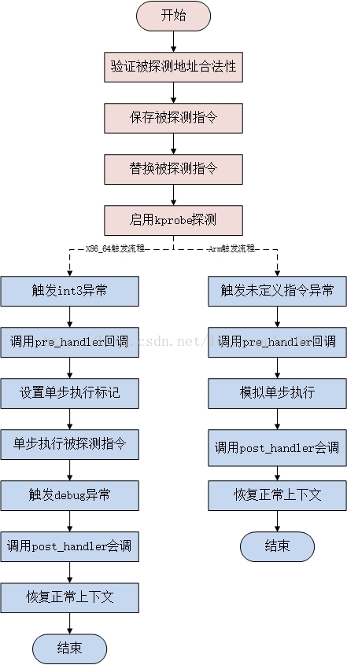

<center><font size='5'>Linux内核 eBPF基础</font></center>
<center><font size='6'>kprobe原理源码分析：基本介绍与使用</font></center>
<br/>
<br/>
<center><font size='3'>荣涛</font></center>
<center><font size='3'>2021年5月11日</font></center>
<br/>


kprobe调试技术是为了便于跟踪内核函数执行状态所设计的一种轻量级内核调试技术。

利用kprobe技术，可以在内核绝大多数函数中**动态插入探测点**，收集调试状态所需信息而基本不影响原有执行流程。

kprobe提供三种探测手段：`kprobe`、`jprobe`和`kretprobe`，其中jprobe和kretprobe基于kprobe实现，分别应用于不同探测场景中。

可以通过两种方式使用kprobe：

* 第一种是编写内核模块，向内核注册探测点，探测函数根据需要自行定制，但是使用不方便；
* 第二种是使用`kprobes in ftrace`，这种方式结合kprobe和ftrace，可以通过kprobe来优化ftrace跟踪函数。

# 1. kprobe技术背景

如果需要知道内核函数是否被调用、被调用上下文、入参以及返回值，比较简单的方法是加printk，但是效率低。

利用kprobe技术，用户可以自定义自己的回调函数，**可以在几乎所有的函数中动态插入探测点**。

当内核执行流程执行到指定的探测函数时，会调用该回调函数，用户即可收集所需的信息了，同时内核最后还会回到原本的正常执行流程。如果用户已经收集足够的信息，不再需要继续探测，则同样可以动态的移除探测点。

kprobes技术包括的3种探测手段分别时`kprobe`、`jprobe`和`kretprobe`。

* 首先kprobe是最基本的探测方式，是实现后两种的基础，它可以在任意的位置放置探测点（就连函数内部的某条指令处也可以），它提供了探测点的调用前、调用后和内存访问出错3种回调方式，分别是pre_handler、post_handler和fault_handler，
    * `pre_handler`函数将在被探测指令被执行前回调，
    * `post_handler`会在被探测指令执行完毕后回调（注意不是被探测函数），
    * `fault_handler`会在内存访问出错时被调用；
* jprobe基于kprobe实现，它用于**获取被探测函数的入参值**；
* kretprobe从名字种就可以看出其用途了，它同样基于kprobe实现，用于获取被探测函数的返回值。

## 1.1. kprobes的特点与使用限制

* kprobes允许在同一个被被探测位置注册多个kprobe，但是目前jprobe却不可以；同时也不允许以其他的jprobe回掉函数和kprobe的post_handler回调函数作为被探测点。

* 一般情况下，可以探测内核中的任何函数，包括中断处理函数。不过在`kernel/kprobes.c`和`arch/*/kernel/kprobes.c`程序中**用于实现kprobes自身的函数是不允许被探测的**，另外还有do_page_fault和notifier_call_chain；

* 如果以一个**内联函数**为探测点，则kprobes可能无法保证对该函数的所有实例都注册探测点。由于gcc可能会自动将某些函数优化为内联函数，因此可能无法达到用户预期的探测效果；

* 一个探测点的回调函数可能会修改被探测函数运行的上下文，例如通过修改内核的数据结构或者保存与`struct pt_regs`结构体中的触发探测之前寄存器信息。因此kprobes可以被用来安装bug修复代码或者注入故障测试代码；

* kprobes会避免在处理探测点函数时再次调用另一个探测点的回调函数，例如在printk()函数上注册了探测点，则在它的回调函数中可能再次调用printk函数，此时将不再触发printk探测点的回调，仅仅时增加了kprobe结构体中nmissed字段的数值；

* 在kprobes的注册和注销过程中不会使用mutex锁和动态的申请内存；

* kprobes回调函数的运行期间是**关闭内核抢占**的，同时也可能在**关闭中断**的情况下执行，具体要视CPU架构而定。因此不论在何种情况下，在回调函数中不要调用会放弃CPU的函数（如信号量、mutex锁等）；

* kretprobe通过替换返回地址为预定义的trampoline的地址来实现，因此**栈回溯**和gcc内嵌函数`__builtin_return_address()`调用将返回trampoline的地址而不是真正的被探测函数的返回地址；

* 如果一个函数的**调用次数和返回次数不相等**，则在类似这样的函数上注册kretprobe将可能不会达到预期的效果，例如do_exit()函数会存在问题，而do_execve()函数和do_fork()函数不会；

* 如果当在进入和退出一个函数时，CPU运行在非当前任务所有的栈上，那么往该函数上注册kretprobe可能会导致不可预料的后果，因此，**kprobes不支持在X86_64的结构下为__switch_to()函数注册kretprobe**，将直接返回-EINVAL。

# 2. kprobe原理




* 当用户注册一个探测点后，kprobe首先备份被探测点的对应指令，然后将原始指令的入口点替换为断点指令，该指令是CPU架构相关的，如i386和x86_64是`int3`，arm是设置一个未定义指令（目前的x86_64架构支持一种跳转优化方案`Jump Optimization`，内核需开启`CONFIG_OPTPROBES`选项，该种方案**使用跳转指令来代替断点指令**）；

```c
#define X86_TRAP_BP		 3	/*  3, 断点 *//* Breakpoint */    /* 断点 -> int3 */
                            /**
                             *  X86_TRAP_BP
                             *      do_int3() : arch\x86\kernel\traps.c
                             *      exc_int3  : arch\x86\kernel\traps.c
                             */
                            //#include <stdio.h>
                            //
                            //int main() {
                            //    int i;
                            //    while (i < 6){
                            //	    printf("i equal to: %d\n", i);
                            //	    __asm__("int3");
                            //		++i;
                            //    }
                            //}
```

* 当CPU流程执行到探测点的断点指令时，就触发了一个`trap`，在trap处理流程中会保存当前CPU的寄存器信息并调用对应的trap处理函数，该处理函数会设置kprobe的调用状态并调用用户注册的`pre_handler`回调函数，kprobe会向该函数传递注册的`struct kprobe`结构地址以及保存的CPU寄存器信息；
* 随后kprobe单步执行前面所拷贝的被探测指令，具体执行方式各个架构不尽相同，arm会在异常处理流程中使用模拟函数执行，而x86_64架构则会设置单步调试flag并回到异常触发前的流程中执行；
* 在单步执行完成后，kprobe执行用户注册的`post_handler`回调函数；
* 最后，执行流程回到被探测指令之后的正常流程继续执行。


# 3. kprobe使用实例
## 3.1. 编写kprobe探测模块
### 3.1.1. struct kprobe结构体
内核提供了struct kprobe表示一个探测点，以及一系列API接口，用户可以通过这些接口实现回调函数并实现struct kprobe结构，然后将它注册到内核的kprobe子系统中来达到探测的目的。
```c
struct kprobe {
    struct hlist_node hlist;//被用于kprobe全局hash，索引值为被探测点的地址。
    /* list of kprobes for multi-handler support */
    struct list_head list;//用于链接同一被探测点的不同探测kprobe。
    /*count the number of times this probe was temporarily disarmed */
    unsigned long nmissed;
    /* location of the probe point */
    kprobe_opcode_t *addr;//被探测点的地址。
    /* Allow user to indicate symbol name of the probe point */
    const char *symbol_name;//被探测函数的名称。
    /* Offset into the symbol */
    unsigned int offset;//被探测点在函数内部的偏移，用于探测函数内核的指令，如果该值为0表示函数的入口。
    /* Called before addr is executed. */
    kprobe_pre_handler_t pre_handler;//被探测点指令执行之前调用的回调函数。
    /* Called after addr is executed, unless... */
    kprobe_post_handler_t post_handler;//被探测点指令执行之后调用的回调函数。
    kprobe_fault_handler_t fault_handler;//在执行pre_handler、post_handler或单步执行被探测指令时出现内存异常则会调用该回调函数。
    kprobe_break_handler_t break_handler;//在执行某一kprobe过程中出发了断点指令后会调用该函数，用于实现jprobe。
    kprobe_opcode_t opcode;//保存的被探测点原始指令。
    struct arch_specific_insn ainsn;//被复制的被探测点的原始指令，用于单步执行，架构强相关。
    u32 flags;//状态标记。
};
```
在 5.10.13中是这样的，有些字段不一样

```c

struct kprobe { /*  */
	struct hlist_node hlist;    /* 被用于kprobe全局hash，索引值为被探测点的地址。 */

	/* list of kprobes for multi-handler support */
	struct list_head list;      /* 用于链接同一被探测点的不同探测kprobe。 */

	/*count the number of times this probe was temporarily disarmed 
     如果 kprobe 嵌套，增加nmissed字段的数值*/
	unsigned long nmissed;      /*  */

	/* location of the probe point */
	kprobe_opcode_t *addr;      /* 被探测点的地址。 */

	/* Allow user to indicate symbol name of the probe point */
	const char *symbol_name;    /* 被探测函数的名称。 */

	/* Offset into the symbol */
	unsigned int offset;        /* 被探测点在函数内部的偏移，用于探测函数内核的指令，如果该值为0表示函数的入口。 */

	/* Called before addr is executed. 在被探测指令被执行前回调*/
	kprobe_pre_handler_t pre_handler;   

	/* Called after addr is executed, unless... 在被探测指令执行完毕后回调（注意不是被探测函数）*/
	kprobe_post_handler_t post_handler;

	/*
	 * ... called if executing addr causes a fault (eg. page fault).
	 * Return 1 if it handled fault, otherwise kernel will see it.
	 */
	kprobe_fault_handler_t fault_handler;   /* 在内存访问出错时被调用 */

	/* Saved opcode (which has been replaced with breakpoint) */
	kprobe_opcode_t opcode; /* 保存的被探测点原始指令。 */

	/* copy of the original instruction */
	struct arch_specific_insn ainsn;    /* 被复制的被探测点的原始指令，用于单步执行，架构强相关。 */

	/*
	 * Indicates various status flags.
	 * Protected by kprobe_mutex after this kprobe is registered.
	 */
	u32 flags;  /* 状态标记。 */
};
```

### 3.1.2. kprobe API函数
 内核使用kprobe，可以使用register_kprobe()/unregister_kprobe()进行注册/卸载，还可以临时关闭/使能探测点。

```c
int register_kprobe(struct kprobe *p);//注册kprobe探测点
void unregister_kprobe(struct kprobe *p);//卸载kprobe探测点
int register_kprobes(struct kprobe **kps, int num);//注册多个kprobe探测点
void unregister_kprobes(struct kprobe **kps, int num);//卸载多个kprobe探测点
int disable_kprobe(struct kprobe *kp);//暂停指定定kprobe探测点
int enable_kprobe(struct kprobe *kp);//恢复指定kprobe探测点
void dump_kprobe(struct kprobe *kp);//打印指定kprobe探测点的名称、地址、偏移
```

### 3.1.3. kprobe_example.c解读
下面以内核中`samples/kprobes/kprobe_example.c`为例，介绍如何使用kprobe进行内核函数探测。

该kprobe实例实现了`do_fork`的探测，该函数会在fork系统调用或者kernel_kthread创建内核线程时被调用。

对原`%p`修改为`%pF`后，可读性更强。可以显示函数名称以及偏移量。

```c
#include <linux/kernel.h>
#include <linux/module.h>
#include <linux/kprobes.h>

#define MAX_SYMBOL_LEN    64
static char symbol[MAX_SYMBOL_LEN] = "do_fork";
module_param_string(symbol, symbol, sizeof(symbol), 0644);

/* For each probe you need to allocate a kprobe structure 
  定义一个实例kp并初始化symbol_name为"do_fork"，将探测do_fork函数。*/
static struct kprobe kp = {
    .symbol_name    = symbol,
};

/* kprobe pre_handler: called just before the probed instruction is executed */
static int handler_pre(struct kprobe *p, struct pt_regs *regs)
{
#ifdef CONFIG_X86
    pr_info("<%s> pre_handler: p->addr = %pF, ip = %lx, flags = 0x%lx\n",
        p->symbol_name, p->addr, regs->ip, regs->flags);
#endif
#ifdef CONFIG_ARM64
    pr_info("<%s> pre_handler: p->addr = %pF, pc = 0x%lx,"
            " pstate = 0x%lx\n",
        p->symbol_name, p->addr, (long)regs->pc, (long)regs->pstate);
#endif

    /* A dump_stack() here will give a stack backtrace */
    return 0;
}

/* kprobe post_handler: called after the probed instruction is executed */
static void handler_post(struct kprobe *p, struct pt_regs *regs,
                unsigned long flags)
{
#ifdef CONFIG_X86
    pr_info("<%s> post_handler: p->addr = %pF, flags = 0x%lx\n",
        p->symbol_name, p->addr, regs->flags);
#endif
#ifdef CONFIG_ARM64
    pr_info("<%s> post_handler: p->addr = %pF, pstate = 0x%lx\n",
        p->symbol_name, p->addr, (long)regs->pstate);
#endif
}

/*
 * fault_handler: this is called if an exception is generated for any
 * instruction within the pre- or post-handler, or when Kprobes
 * single-steps the probed instruction.
 */
static int handler_fault(struct kprobe *p, struct pt_regs *regs, int trapnr)
{
    pr_info("fault_handler: p->addr = %pF, trap #%dn", p->addr, trapnr);
    /* Return 0 because we don't handle the fault. */
    return 0;
}

static int __init kprobe_init(void)
{
    int ret;
    //初始化kp的三个回调函数。
    kp.pre_handler = handler_pre;
    kp.post_handler = handler_post;
    kp.fault_handler = handler_fault;

    //注册kp探测点到内核。
    ret = register_kprobe(&kp);
    if (ret < 0) {
        pr_err("register_kprobe failed, returned %d\n", ret);
        return ret;
    }
    pr_info("Planted kprobe at %pF\n", kp.addr);
    return 0;
}

static void __exit kprobe_exit(void)
{
    unregister_kprobe(&kp);
    pr_info("kprobe at %pF unregistered\n", kp.addr);
}

module_init(kprobe_init)
module_exit(kprobe_exit)
MODULE_LICENSE("GPL");
```
模块的编译Makefile如下：
```makefile
obj-m := kprobe_example.o

CROSS_COMPILE=''

KDIR := /lib/modules/$(shell uname -r)/build
all:
    make -C $(KDIR) M=$(PWD) modules 
clean:
    rm -f *.ko *.o *.mod.o *.mod.c .*.cmd *.symvers  modul*
```
执行结果如下（dmesg）：
```
[3026669.760365] Planted kprobe at do_fork+0x0/0x330
[3026670.316013] <do_fork> pre_handler: p->addr = do_fork+0x0/0x330, ip = ffffffff87099821, flags = 0x246
[3026670.316017] <do_fork> post_handler: p->addr = do_fork+0x0/0x330, flags = 0x246
[3026671.565990] <do_fork> pre_handler: p->addr = do_fork+0x0/0x330, ip = ffffffff87099821, flags = 0x246
[3026671.565994] <do_fork> post_handler: p->addr = do_fork+0x0/0x330, flags = 0x246
[3026672.816050] <do_fork> pre_handler: p->addr = do_fork+0x0/0x330, ip = ffffffff87099821, flags = 0x246
[3026672.816057] <do_fork> post_handler: p->addr = do_fork+0x0/0x330, flags = 0x246
[3026674.066017] <do_fork> pre_handler: p->addr = do_fork+0x0/0x330, ip = ffffffff87099821, flags = 0x246
[3026674.066022] <do_fork> post_handler: p->addr = do_fork+0x0/0x330, flags = 0x246
[3026674.863262] <do_fork> pre_handler: p->addr = do_fork+0x0/0x330, ip = ffffffff87099821, flags = 0x246
[3026674.863268] <do_fork> post_handler: p->addr = do_fork+0x0/0x330, flags = 0x246
[3026675.315982] <do_fork> pre_handler: p->addr = do_fork+0x0/0x330, ip = ffffffff87099821, flags = 0x246
[3026675.315986] <do_fork> post_handler: p->addr = do_fork+0x0/0x330, flags = 0x246
[3026676.566019] <do_fork> pre_handler: p->addr = do_fork+0x0/0x330, ip = ffffffff87099821, flags = 0x246
[3026676.566025] <do_fork> post_handler: p->addr = do_fork+0x0/0x330, flags = 0x246
[3026677.125849] <do_fork> pre_handler: p->addr = do_fork+0x0/0x330, ip = ffffffff87099821, flags = 0x246
[3026677.125855] <do_fork> post_handler: p->addr = do_fork+0x0/0x330, flags = 0x246
[3026677.816027] <do_fork> pre_handler: p->addr = do_fork+0x0/0x330, ip = ffffffff87099821, flags = 0x246
[3026677.816033] <do_fork> post_handler: p->addr = do_fork+0x0/0x330, flags = 0x246
[3026678.616467] <do_fork> pre_handler: p->addr = do_fork+0x0/0x330, ip = ffffffff87099821, flags = 0x246
[3026678.616471] <do_fork> post_handler: p->addr = do_fork+0x0/0x330, flags = 0x246
[3026679.066069] <do_fork> pre_handler: p->addr = do_fork+0x0/0x330, ip = ffffffff87099821, flags = 0x246
[3026679.066074] <do_fork> post_handler: p->addr = do_fork+0x0/0x330, flags = 0x246
[3026680.315962] <do_fork> pre_handler: p->addr = do_fork+0x0/0x330, ip = ffffffff87099821, flags = 0x246
[3026680.315966] <do_fork> post_handler: p->addr = do_fork+0x0/0x330, flags = 0x246
[3026680.349572] <do_fork> pre_handler: p->addr = do_fork+0x0/0x330, ip = ffffffff87099821, flags = 0x246
[3026680.349578] <do_fork> post_handler: p->addr = do_fork+0x0/0x330, flags = 0x246
```
可以通过sudo cat /proc/kallsyms | grep l_do_fork来验证地址和符号是否对应。

若没有sudo，看不到真实的地址。

## 3.2. 基于ftrace使用kprobe

kprobe和内核的`ftrace`结合使用，需要对内核进行配置，然后添加探测点、进行探测、查看结果。

### 3.2.1. kprobe配置
打开`"General setup"->"Kprobes"`，以及`"Kernel hacking"->"Tracers"->"Enable kprobes-based dynamic events"`。

```
CONFIG_KPROBES=y
CONFIG_OPTPROBES=y
CONFIG_KPROBES_ON_FTRACE=y
CONFIG_UPROBES=y
CONFIG_KRETPROBES=y
CONFIG_HAVE_KPROBES=y
CONFIG_HAVE_KRETPROBES=y
CONFIG_HAVE_OPTPROBES=y
CONFIG_HAVE_KPROBES_ON_FTRACE=y
CONFIG_KPROBE_EVENT=y
```

### 3.2.2. kprobe trace events使用
kprobe事件相关的节点有如下：

```c
/sys/kernel/debug/tracing/kprobe_events-----------------------配置kprobe事件属性，增加事件之后会在kprobes下面生成对应目录。
/sys/kernel/debug/tracing/kprobe_profile----------------------kprobe事件统计属性文件。
/sys/kernel/debug/tracing/kprobes/<GRP>/<EVENT>/enabled-------使能kprobe事件
/sys/kernel/debug/tracing/kprobes/<GRP>/<EVENT>/filter--------过滤kprobe事件
/sys/kernel/debug/tracing/kprobes/<GRP>/<EVENT>/format--------查询kprobe事件显示格式
```
下面就结合实例，看一下如何使用kprobe事件。

#### 3.2.2.1. kprobe事件配置
新增一个kprobe事件，通过写kprobe_events来设置。

```
p[:[GRP/]EVENT] [MOD:]SYM[+offs]|MEMADDR [FETCHARGS]-------------------设置一个probe探测点
r[:[GRP/]EVENT] [MOD:]SYM[+0] [FETCHARGS]------------------------------设置一个return probe探测点
-:[GRP/]EVENT----------------------------------------------------------删除一个探测点
```
细节解释如下：

```
GRP        : Group name. If omitted, use "kprobes" for it.------------设置后会在events/kprobes下创建<GRP>目录。
 EVENT        : Event name. If omitted, the event name is generated based on SYM+offs or MEMADDR.---指定后在events/kprobes/<GRP>生成<EVENT>目录。 MOD        : Module name which has given SYM.--------------------------模块名，一般不设
 SYM[+offs]    : Symbol+offset where the probe is inserted.-------------被探测函数名和偏移
 MEMADDR    : Address where the probe is inserted.----------------------指定被探测的内存绝对地址
 FETCHARGS    : Arguments. Each probe can have up to 128 args.----------指定要获取的参数信息。 %REG        : Fetch register REG---------------------------------------获取指定寄存器值
 @ADDR        : Fetch memory at ADDR (ADDR should be in kernel)--------获取指定内存地址的值
 @SYM[+|-offs]    : Fetch memory at SYM +|- offs (SYM should be a data symbol)---获取全局变量的值 $stackN    : Fetch Nth entry of stack (N >= 0)----------------------------------获取指定栈空间值，即sp寄存器+N后的位置值
 $stack    : Fetch stack address.-----------------------------------------------获取sp寄存器值
 $retval    : Fetch return value.(*)--------------------------------------------获取返回值，用户return kprobe
 $comm        : Fetch current task comm.----------------------------------------获取对应进程名称。
 +|-offs(FETCHARG) : Fetch memory at FETCHARG +|- offs address.(**)------------- NAME=FETCHARG : Set NAME as the argument name of FETCHARG.
 FETCHARG:TYPE : Set TYPE as the type of FETCHARG. Currently, basic types (u8/u16/u32/u64/s8/s16/s32/s64), hexadecimal types
          (x8/x16/x32/x64), "string" and bitfield are supported.----------------设置参数的类型，可以支持字符串和比特类型
  (*) only for return probe.
  (**) this is useful for fetching a field of data structures.
```
执行如下两条命令就会生成目录/sys/kernel/debug/tracing/events/kprobes/myprobe；第三条命令则可以删除指定kprobe事件，如果要全部删除则echo > /sys/kernel/debug/tracing/kprobe_events。
```
echo 'p:myprobe do_sys_open dfd=%ax filename=%dx flags=%cx mode=+4($stack)' > /sys/kernel/debug/tracing/kprobe_events
echo 'r:myretprobe do_sys_open ret=$retval' >> /sys/kernel/debug/tracing/kprobe_events-----------------------------------------------------这里面一定要用">>"，不然就会覆盖前面的设置。

echo '-:myprobe' >> /sys/kernel/debug/tracing/kprobe_events
echo '-:myretprobe' >> /sys/kernel/debug/tracing/kprobe_events
```
参数后面的寄存器是跟架构相关的，%ax、%dx、%cx表示第1/2/3个参数，超出部分使用$stack来存储参数。

函数返回值保存在$retval中。

#### 3.2.2.2. kprobe使能

对kprobe事件的是能通过往对应事件的enable写1开启探测；写0暂停探测。
```bash
echo > /sys/kernel/debug/tracing/trace
echo 'p:myprobe do_sys_open dfd=%ax filename=%dx flags=%cx mode=+4($stack)' > /sys/kernel/debug/tracing/kprobe_events
echo 'r:myretprobe do_sys_open ret=$retval' >> /sys/kernel/debug/tracing/kprobe_events

echo 1 > /sys/kernel/debug/tracing/events/kprobes/myprobe/enable
echo 1 > /sys/kernel/debug/tracing/events/kprobes/myretprobe/enable
ls
echo 0 > /sys/kernel/debug/tracing/events/kprobes/myprobe/enable
echo 0 > /sys/kernel/debug/tracing/events/kprobes/myretprobe/enable

cat /sys/kernel/debug/tracing/trace
```
然后在/sys/kernel/debug/tracing/trace中可以看到结果。
```c
sourceinsight4.-3356  [000] .... 3542865.754536: myprobe: (do_sys_open+0x0/0x290) dfd=0xffffffffbd6764a0 filename=0x8000 flags=0x1b6 mode=0xe3afff48ffffffff
            bash-26041 [001] .... 3542865.757014: myprobe: (do_sys_open+0x0/0x290) dfd=0xffffffffbd676460 filename=0x8241 flags=0x1b6 mode=0xe0c0ff48ffffffff
              ls-18078 [005] .... 3542865.757950: myprobe: (do_sys_open+0x0/0x290) dfd=0xffffffffbd676460 filename=0x88000 flags=0x1 mode=0xc1b7bf48ffffffff
              ls-18078 [005] d... 3542865.757953: myretprobe: (SyS_open+0x1e/0x20 <- do_sys_open) ret=0x3
              ls-18078 [005] .... 3542865.757966: myprobe: (do_sys_open+0x0/0x290) dfd=0xffffffffbd676460 filename=0x88000 flags=0x6168 mode=0xc1b7bf48ffffffff
              ls-18078 [005] d... 3542865.757969: myretprobe: (SyS_open+0x1e/0x20 <- do_sys_open) ret=0x3
              ls-18078 [005] .... 3542865.758001: myprobe: (do_sys_open+0x0/0x290) dfd=0xffffffffbd676460 filename=0x88000 flags=0x6168 mode=0xc1b7bf48ffffffff
              ls-18078 [005] d... 3542865.758004: myretprobe: (SyS_open+0x1e/0x20 <- do_sys_open) ret=0x3
              ls-18078 [005] .... 3542865.758030: myprobe: (do_sys_open+0x0/0x290) dfd=0xffffffffbd676460 filename=0x88000 flags=0x1000 mode=0xc1b7bf48ffffffff
              ls-18078 [005] d... 3542865.758033: myretprobe: (SyS_open+0x1e/0x20 <- do_sys_open) ret=0x3
              ls-18078 [005] .... 3542865.758055: myprobe: (do_sys_open+0x0/0x290) dfd=0xffffffffbd676460 filename=0x88000 flags=0x1000 mode=0xc1b7bf48ffffffff
              ls-18078 [005] d... 3542865.758057: myretprobe: (SyS_open+0x1e/0x20 <- do_sys_open) ret=0x3
              ls-18078 [005] .... 3542865.758080: myprobe: (do_sys_open+0x0/0x290) dfd=0xffffffffbd676460 filename=0x88000 flags=0x19d0 mode=0xc1b7bf48ffffffff
              ls-18078 [005] d... 3542865.758082: myretprobe: (SyS_open+0x1e/0x20 <- do_sys_open) ret=0x3
              ls-18078 [005] .... 3542865.758289: myprobe: (do_sys_open+0x0/0x290) dfd=0xffffffffbd676460 filename=0x8000 flags=0x1b6 mode=0xc1b7bf48ffffffff
              ls-18078 [005] d... 3542865.758297: myretprobe: (SyS_open+0x1e/0x20 <- do_sys_open) ret=0x3
              ls-18078 [005] .... 3542865.758339: myprobe: (do_sys_open+0x0/0x290) dfd=0xffffffffbd676460 filename=0x88000 flags=0x0 mode=0xc1b7bf48ffffffff
              ls-18078 [005] d... 3542865.758343: myretprobe: (SyS_open+0x1e/0x20 <- do_sys_open) ret=0x3
              ls-18078 [005] .... 3542865.758444: myprobe: (do_sys_open+0x0/0x290) dfd=0xffffffffbd676460 filename=0x98800 flags=0x2 mode=0xc1b7bf48ffffffff
              ls-18078 [005] d... 3542865.758446: myretprobe: (SyS_open+0x1e/0x20 <- do_sys_open) ret=0x3
            bash-26041 [001] .... 3542865.760416: myprobe: (do_sys_open+0x0/0x290) dfd=0xffffffffbd676460 filename=0x8241 flags=0x1b6 mode=0xe0c0ff48ffffffff
            bash-26041 [001] d... 3542865.760426: myretprobe: (SyS_open+0x1e/0x20 <- do_sys_open) ret=0x3
            bash-26041 [001] d... 3542865.793477: myretprobe: (SyS_open+0x1e/0x20 <- do_sys_open) ret=0x3
```

#### 3.2.2.3. kprobe事件过滤
跟踪函数需要通过filter进行过滤，可以有效过滤掉冗余信息。

filter文件用于设置过滤条件，可以减少trace中输出的信息，它支持的格式和c语言的表达式类似，支持 ==，!=，>，<，>=，<=判断，并且支持与&&，或||，还有()。

```bash
echo 'filename==0x8241' > /sys/kernel/debug/tracing/events/kprobes/myprobe/filter
```

#### 3.2.2.4. kprobe和栈配合使用
如果要在显示函数的同时显示其栈信息，可以通过配置trace_options来达到。

```bash
echo stacktrace > /sys/kernel/debug/tracing/trace_options
```

#### 3.2.2.5. kprobe_profile统计信息
获取一段kprobe时间之后，可以再kprobe_profile中查看统计信息。

后面两列分别表示命中和未命中的次数。

```bash
cat /sys/kernel/debug/tracing/kprobe_profile 
  myprobe                                                   11               0
  myretprobe                                                11               0
```

# 4. kprobe相关源码分析

见另一篇文章。

# 5. 参考和相关链接

* 内核注释版代码：[https://github.com/Rtoax/linux-5.10.13](https://github.com/Rtoax/linux-5.10.13)
* [《Linux内核 eBPF基础：kprobe原理源码分析：基本介绍与使用》](https://rtoax.blog.csdn.net/article/details/116643875)
* [Linux内核 eBPF基础：kprobe原理源码分析：源码分析](https://rtoax.blog.csdn.net/article/details/116643902)
* [《Linux内核：kprobe机制-探测点》](https://rtoax.blog.csdn.net/article/details/110835122)
* [《Linux eBPF：bcc 用法和原理初探之 kprobes 注入》](https://rtoax.blog.csdn.net/article/details/115603383)
* [《Linux内核调试技术——kprobe使用与实现》](https://blog.csdn.net/luckyapple1028/article/details/52972315)
* [《Linux kprobe调试技术使用》](https://www.cnblogs.com/arnoldlu/p/9752061.html)

