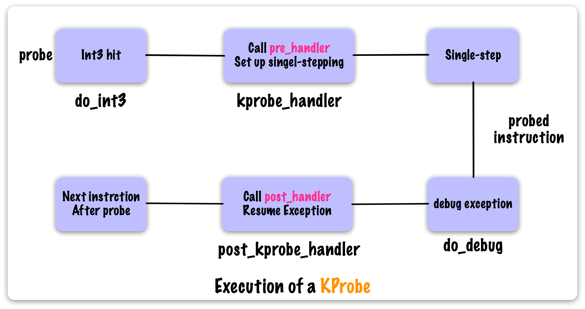
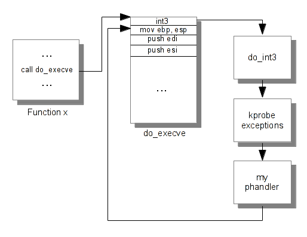

<center><font size='5'>Linux内核 eBPF基础</font></center>
<center><font size='6'>kprobe原理源码分析：源码分析</font></center>
<br/>
<br/>
<center><font size='3'>荣涛</font></center>
<center><font size='3'>2021年5月11日</font></center>
<br/>


在 [《Linux内核 eBPF基础：kprobe原理源码分析：基本介绍与使用》](https://rtoax.blog.csdn.net/article/details/116643875)中已经介绍了kprobe的基本原理，本文将基于linux5.10.13内核进行源码分析，相关注释代码在[https://github.com/Rtoax/linux-5.10.13](https://github.com/Rtoax/linux-5.10.13)查看。





# 1. 引言

## 1.1. kprobe API

内核使用kprobe，可以使用register_kprobe()/unregister_kprobe()进行注册/卸载，还可以临时关闭/使能探测点。

```c
int register_kprobe(struct kprobe *p);//注册kprobe探测点
void unregister_kprobe(struct kprobe *p);//卸载kprobe探测点
int register_kprobes(struct kprobe **kps, int num);//注册多个kprobe探测点
void unregister_kprobes(struct kprobe **kps, int num);//卸载多个kprobe探测点
int disable_kprobe(struct kprobe *kp);//暂停指定定kprobe探测点
int enable_kprobe(struct kprobe *kp);//恢复指定kprobe探测点
void dump_kprobe(struct kprobe *kp);//打印指定kprobe探测点的名称、地址、偏移
```

对于kretprobe同样有一套接口：

```c
int register_kretprobe(struct kretprobe *rp);
void unregister_kretprobe(struct kretprobe *rp);
int register_kretprobes(struct kretprobe **rps, int num);
void unregister_kretprobes(struct kretprobe **rps, int num);
int disable_kretprobe(struct kretprobe *kp);
int enable_kretprobe(struct kretprobe *kp);
```

> 在5.10.13代码`samples\kprobes\kprobe_example.c`中，probe的是`kernel_clone`函数，在我的环境中`3.10.0-1062.el7.x86_64`没有这个sym（可以使用`cat /proc/kallsyms`查看），我使用`do_fork`替换（do_fork不至于被调用太多，但又不会没有）。

## 1.2. `samples\kprobes\kprobe_example.c`

```c
#include <linux/kernel.h>
#include <linux/module.h>
#include <linux/kprobes.h>

#define MAX_SYMBOL_LEN    64
static char symbol[MAX_SYMBOL_LEN] = "do_fork";
module_param_string(symbol, symbol, sizeof(symbol), 0644);

/* For each probe you need to allocate a kprobe structure */
static struct kprobe kp = {
//定义实例kp并初始化symbol_name为"_do_fork"，将探测_do_fork函数。
    .symbol_name    = symbol,
};

/* kprobe pre_handler: called just before the probed instruction is executed */
static int handler_pre(struct kprobe *p, struct pt_regs *regs)
{
    pr_info("<%s> pre_handler: p->addr = %pF, ip = %lx, flags = 0x%lx\n",
        p->symbol_name, p->addr, regs->ip, regs->flags);

    /* A dump_stack() here will give a stack backtrace */
    return 0;
}

/* kprobe post_handler: called after the probed instruction is executed */
static void handler_post(struct kprobe *p, struct pt_regs *regs,
                unsigned long flags)
{
    pr_info("<%s> post_handler: p->addr = %pF, flags = 0x%lx\n",
        p->symbol_name, p->addr, regs->flags);
}

/*
 * fault_handler: this is called if an exception is generated for any
 * instruction within the pre- or post-handler, or when Kprobes
 * single-steps the probed instruction.
 */
static int handler_fault(struct kprobe *p, struct pt_regs *regs, int trapnr)
{
    pr_info("fault_handler: p->addr = %pF, trap #%dn", p->addr, trapnr);
    /* Return 0 because we don't handle the fault. */
    return 0;
}

static int __init kprobe_init(void)
{
    int ret;
    kp.pre_handler = handler_pre;//初始化kp的三个回调函数。
    kp.post_handler = handler_post;
    kp.fault_handler = handler_fault;

    ret = register_kprobe(&kp);//注册kp探测点到内核。
    if (ret < 0) {
        pr_err("register_kprobe failed, returned %d\n", ret);
        return ret;
    }
    pr_info("Planted kprobe at %pF\n", kp.addr);
    return 0;
}

static void __exit kprobe_exit(void)
{
    unregister_kprobe(&kp);
    pr_info("kprobe at %pF unregistered\n", kp.addr);
}

module_init(kprobe_init)
module_exit(kprobe_exit)
MODULE_LICENSE("GPL");
```

下面将结合`samples\kprobes\kprobe_example.c`实例代码，对kprobe源代码进行分析。


# 2. 数据结构

## 2.1. `struct kprobe`

```c
struct kprobe { /*  */
	struct hlist_node hlist;    /* 被用于kprobe全局hash，索引值为被探测点的地址。 */

	/* list of kprobes for multi-handler support */
	struct list_head list;      /* 用于链接同一被探测点的不同探测kprobe。 */

	/*count the number of times this probe was temporarily disarmed 
     如果 kprobe 嵌套，增加nmissed字段的数值*/
	unsigned long nmissed;      /*  */

	/* location of the probe point */
	kprobe_opcode_t *addr;      /* 被探测点的地址。 */

	/* Allow user to indicate symbol name of the probe point */
	const char *symbol_name;    /* 被探测函数的名称。 */

	/* Offset into the symbol */
	unsigned int offset;        /* 被探测点在函数内部的偏移，用于探测函数内核的指令，如果该值为0表示函数的入口。 */

	/* Called before addr is executed. 在被探测指令被执行前回调*/
	kprobe_pre_handler_t pre_handler;   

	/* Called after addr is executed, unless... 在被探测指令执行完毕后回调（注意不是被探测函数）*/
	kprobe_post_handler_t post_handler;

	/*
	 * ... called if executing addr causes a fault (eg. page fault).
	 * Return 1 if it handled fault, otherwise kernel will see it.
	 */
	kprobe_fault_handler_t fault_handler;   /* 在内存访问出错时被调用 */

	/* Saved opcode (which has been replaced with breakpoint) */
	kprobe_opcode_t opcode; /* 保存的被探测点原始指令。 */

	/* copy of the original instruction */
	struct arch_specific_insn ainsn;    /* 被复制的被探测点的原始指令，用于单步执行，架构强相关。 */

	/*
	 * Indicates various status flags.
	 * Protected by kprobe_mutex after this kprobe is registered.
	 */
	u32 flags;  /* 状态标记。 */
};
```

其中回调函数的执行流程为：


## 2.2. `struct kretprobe`

```c
struct kretprobe {
	struct kprobe kp;
	kretprobe_handler_t handler;
	kretprobe_handler_t entry_handler;
	int maxactive;
	int nmissed;
	size_t data_size;
	struct hlist_head free_instances;
	raw_spinlock_t lock;
};
```

# 3. API

## 3.1. `register_kprobe` - 注册kprobe

首先调用`kprobe_addr`查找函数名。

### 3.1.1. `kprobe_addr` - 获取内核符号地址

调用`_kprobe_addr`
```c
static kprobe_opcode_t *kprobe_addr(struct kprobe *p)
{
	return _kprobe_addr(p->addr, p->symbol_name, p->offset);
}
```
调用关系为：

```
register_kprobe
    kprobe_addr
        _kprobe_addr
            kprobe_lookup_name
                kallsyms_lookup_name
                    kallsyms_expand_symbol      1.首先从内核函数中查找
                    module_kallsyms_lookup_name 2.如果没找到再从模块中查找
```
函数`kallsyms_sym_address`如下，遍历内核符号：
```c
static unsigned long kallsyms_sym_address(int idx)
{
	if (!IS_ENABLED(CONFIG_KALLSYMS_BASE_RELATIVE))
		return kallsyms_addresses[idx];

	/* values are unsigned offsets if --absolute-percpu is not in effect */
	if (!IS_ENABLED(CONFIG_KALLSYMS_ABSOLUTE_PERCPU))
		return kallsyms_relative_base + (u32)kallsyms_offsets[idx];

	/* ...otherwise, positive offsets are absolute values */
	if (kallsyms_offsets[idx] >= 0)
		return kallsyms_offsets[idx];

	/* ...and negative offsets are relative to kallsyms_relative_base - 1 */
	return kallsyms_relative_base - 1 - kallsyms_offsets[idx];
}
```
函数`module_kallsyms_lookup_name`如下：
```c
/* Look for this name: can be of form module:name. */
unsigned long module_kallsyms_lookup_name(const char *name)
{
	struct module *mod;
	char *colon;
	unsigned long ret = 0;

	/* Don't lock: we're in enough trouble already. */
	preempt_disable();
	if ((colon = strnchr(name, MODULE_NAME_LEN, ':')) != NULL) {
		if ((mod = find_module_all(name, colon - name, false)) != NULL)
			ret = find_kallsyms_symbol_value(mod, colon+1);
	} else {
	    /* 遍历模块 */
		list_for_each_entry_rcu(mod, &modules, list) {
			if (mod->state == MODULE_STATE_UNFORMED)
				continue;
			if ((ret = find_kallsyms_symbol_value(mod, name)) != 0)
				break;
		}
	}
	preempt_enable();
	return ret;
}
```

以上步骤获取了指令地址`addr = kprobe_addr(p);`，如下图`instr2`


并将addr赋值给kprobe结构`p->addr = addr;`。

接着，检测kprobe是否可用，使用函数`check_kprobe_rereg`，该函数调用`__get_valid_kprobe`，该接口用于从同一被探测点的不同探测kprobe的链表中查找当前的kprobe是否存在，如果存在，返回kprobe地址，不存在则返回NULL。而在`check_kprobe_rereg`中，如果返回值为NULL，恰恰证明这个kprobe是一个新的kprobe（可用）。


接着，将初始化一些字段：

```c
	/* User can pass only KPROBE_FLAG_DISABLED to register_kprobe */
	p->flags &= KPROBE_FLAG_DISABLED;
	p->nmissed = 0;
	INIT_LIST_HEAD(&p->list);
```

### 3.1.2. `check_kprobe_address_safe` - 检测kprobe是否安全

因为kprobe常常结合ftrace使用，所以在内核编译过程中是默认开启`CONFIG_KPROBES_ON_FTRACE`的。

`check_kprobe_address_safe`流程：

* 首先从`ftrace_pages_start`中二分查找`struct dyn_ftrace`结构，如果找到，讲给kprobe标志flags置位`p->flags |= KPROBE_FLAG_FTRACE;`；
* 关闭抢占`preempt_disable();`
* 一些条件判断
    * kprobe的地址不可以不是内核代码段地址；
    * kprobe的地址不可以是kprobe黑名单中的地址；
    * kprobe的地址不可以是jump_label预留地址；
    * kprobe的地址不可一世static_call预留地址；
* 使用`__module_text_address`检测是否为模块中的地址，如果是，将赋值给`check_kprobe_address_safe`函数入参的`struct module`二级指针；
* 使能抢占`preempt_enable();`；

接下来的这段代码，是处理复杂情况的kprobe（本文不讨论）：

```c
	old_p = get_kprobe(p->addr);
	if (old_p) {
		/* Since this may unoptimize old_p, locking text_mutex. 
         这是该地址上的第二个或后续kprobe-处理复杂情况*/
		ret = register_aggr_kprobe(old_p, p);
		goto out;
	}
```


### 3.1.3. `prepare_kprobe`

```c
static int prepare_kprobe(struct kprobe *p)
{
	if (!kprobe_ftrace(p))
		return arch_prepare_kprobe(p);

	return arch_prepare_kprobe_ftrace(p);
}
```
在`kprobe_ftrace`判断了标志位`KPROBE_FLAG_FTRACE`，而该标志位在`check_kprobe_address_safe`被置位（可能）；

接着，将kprobe添加至哈希表`kprobe_table`中：

```c
	INIT_HLIST_NODE(&p->hlist);
	hlist_add_head_rcu(&p->hlist,
		       &kprobe_table[hash_ptr(p->addr, KPROBE_HASH_BITS)]);
```

### 3.1.4. `arm_kprobe` - 处理

接着就是将kprobe映射到内核代码段中的操作了。
```c
	if (!kprobes_all_disarmed && !kprobe_disabled(p)) {
		ret = arm_kprobe(p);
		if (ret) {
			hlist_del_rcu(&p->hlist);
			synchronize_rcu();
			goto out;
		}
	}
```
其中`kprobes_all_disarmed`默认处理，如下：
```c
static int __init init_kprobes(void)
{
    ...
	/* By default, kprobes are armed */
	kprobes_all_disarmed = false;
	...
}
early_initcall(init_kprobes);
```

接着执行`arm_kprobe`函数，内部其他步骤不多看，直接看调用的`__arm_kprobe`，在此函数中其余unlikely和optimize部分也不看了，直接看`arch_arm_kprobe`。

### 3.1.5. `arch_arm_kprobe` - 用int3替换代码段

```c
void arch_arm_kprobe(struct kprobe *p)
{
	u8 int3 = INT3_INSN_OPCODE;

	text_poke(p->addr, &int3, 1);
	text_poke_sync();
	perf_event_text_poke(p->addr, &p->opcode, 1, &int3, 1);
}
```
其中int3指令`INT3_INSN_OPCODE`等于`0xCC`，接着调用`text_poke`，这个函数值得仔细阅读下，其内部调用`__text_poke`。

### 3.1.6. `__text_poke` - 找到代码段页，用opcode替换

首先使用`core_kernel_text`判断是否为内核代码段，函数实现非常简单：

```c
int notrace core_kernel_text(unsigned long addr)
{
	if (addr >= (unsigned long)_stext &&
	    addr < (unsigned long)_etext)
		return 1;

	if (system_state < SYSTEM_RUNNING &&
	    init_kernel_text(addr))
		return 1;
	return 0;
}
```
如果不是core代码段，那么可能是模块内的地址，因为模块中使用vmalloc申请内存，所以这里使用`vmalloc_to_page`查找页（该函数的实现不在这里讲解）。

若是core代码段，则直接使用函数`virt_to_page`获取页帧。因为本文不涉及内存管理相关介绍，所以直接跳转到用int3替换原指令的代码处：

```c
	kasan_disable_current();
	memcpy((u8 *)poking_addr + offset_in_page(addr), opcode, len);
	kasan_enable_current();
```

如下图：


这个理给出一个实例：



## 3.2. `register_kprobes` - 略
```c
int register_kprobes(struct kprobe **kps, int num)  //注册多个kprobe探测点
{
	int i, ret = 0;

	if (num <= 0)
		return -EINVAL;
	for (i = 0; i < num; i++) {
		ret = register_kprobe(kps[i]);
		if (ret < 0) {
			if (i > 0)
				unregister_kprobes(kps, i);
			break;
		}
	}
	return ret;
}
EXPORT_SYMBOL_GPL(register_kprobes);
```

## 3.3. `unregister_kprobe` - 注销kprobe

注销函数本质上只有一个：

```c
void unregister_kprobe(struct kprobe *p)    //卸载kprobe探测点
{
	unregister_kprobes(&p, 1);
}
EXPORT_SYMBOL_GPL(unregister_kprobe);
```
移步`unregister_kprobes`。

## 3.4. `unregister_kprobes` - 注销kprobes

函数实现如下：

```c
void unregister_kprobes(struct kprobe **kps, int num)   //卸载多个kprobe探测点
{
	int i;

	if (num <= 0)
		return;
	mutex_lock(&kprobe_mutex);
	for (i = 0; i < num; i++)
		if (__unregister_kprobe_top(kps[i]) < 0)
			kps[i]->addr = NULL;
	mutex_unlock(&kprobe_mutex);

	synchronize_rcu();
	for (i = 0; i < num; i++)
		if (kps[i]->addr)
			__unregister_kprobe_bottom(kps[i]);
}
EXPORT_SYMBOL_GPL(unregister_kprobes);
```

整体操作和注册基本上是相反的，此处给出调用栈：

```
unregister_kprobes
    __unregister_kprobe_top
        __disable_kprobe
            disarm_kprobe
                __disarm_kprobe
                    arch_disarm_kprobe
                        text_poke    -> 将int3 替换为原来的指令
    __unregister_kprobe_bottom
        list_del
```


# 4. 参考和相关链接

* 内核注释版代码：[https://github.com/Rtoax/linux-5.10.13](https://github.com/Rtoax/linux-5.10.13)
* [《Linux内核 eBPF基础：kprobe原理源码分析：基本介绍与使用》](https://rtoax.blog.csdn.net/article/details/116643875)
* [Linux内核 eBPF基础：kprobe原理源码分析：源码分析](https://rtoax.blog.csdn.net/article/details/116643902)
* [《Linux内核：kprobe机制-探测点》](https://rtoax.blog.csdn.net/article/details/110835122)
* [《Linux eBPF：bcc 用法和原理初探之 kprobes 注入》](https://rtoax.blog.csdn.net/article/details/115603383)
* [《Linux内核调试技术——kprobe使用与实现》](https://blog.csdn.net/luckyapple1028/article/details/52972315)
* [《Linux kprobe调试技术使用》](https://www.cnblogs.com/arnoldlu/p/9752061.html)
* [linux-5.10.13/Documentation/trace/kprobes.rst](https://rtoax.blog.csdn.net/article/details/116664268)

