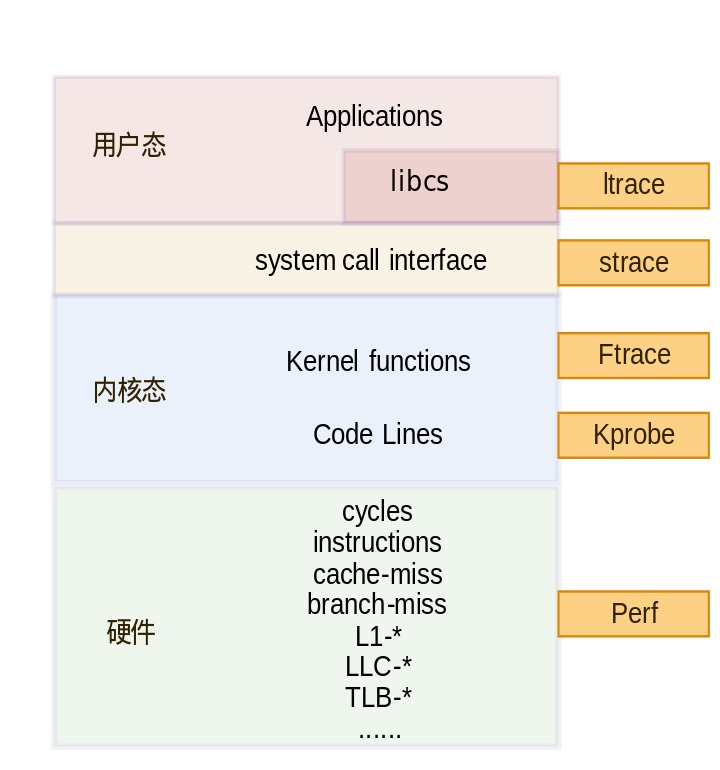
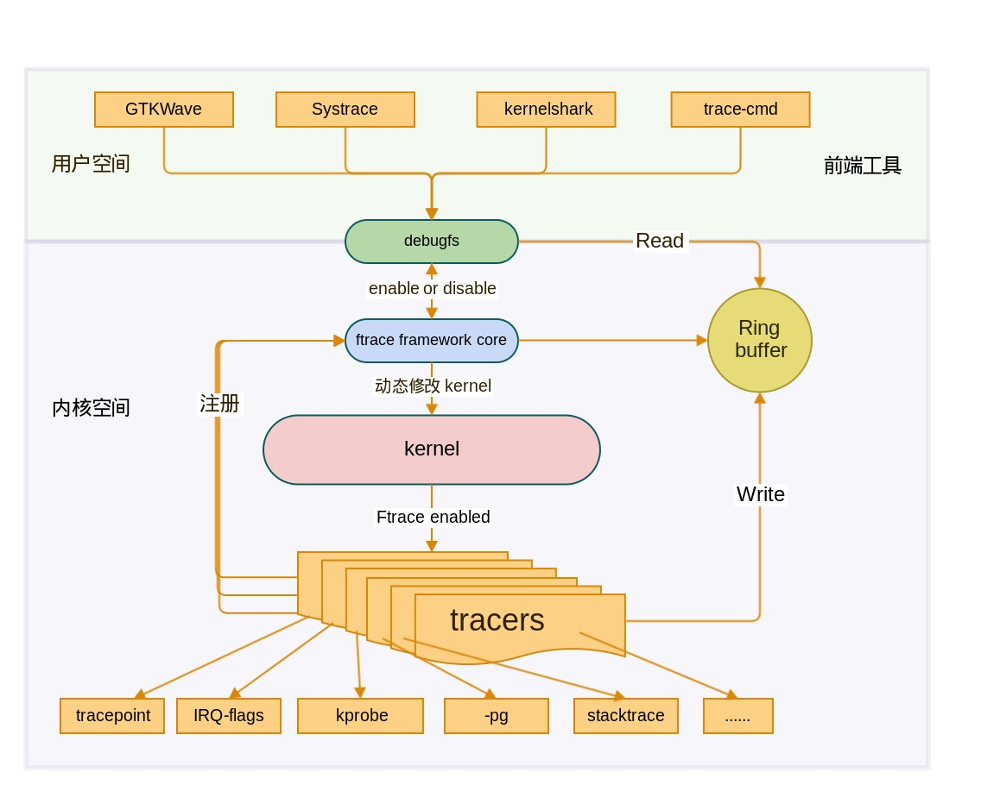

<center><font size='5'>Linux内核 eBPF基础</font></center>
<center><font size='6'>ftrace基础：ftrace_init初始化</font></center>
<br/>
<br/>
<center><font size='3'>荣涛</font></center>
<center><font size='3'>2021年5月12日</font></center>
<br/>

本文相关注释代码：[https://github.com/Rtoax/linux-5.10.13](https://github.com/Rtoax/linux-5.10.13)

从整体架构来看，ftrace位于内核态，提供对内核函数的trace功能。


图片链接：http://tinylab.org/ftrace-principle-and-practice/

* **静态探测点**，是在内核代码中调用ftrace提供的相应接口实现，称之为静态是因为，是在内核代码中写死的，静态编译到内核代码中的，在内核编译后，就不能再动态修改。在开启ftrace相关的内核配置选项后，内核中已经在一些关键的地方设置了静态探测点，需要使用时，即可查看到相应的信息。
* **动态探测点**，基本原理为：利用`mcount机制`，在内核编译时，在每个函数入口保留数个字节，然后在使用ftrace时，将保留的字节替换为需要的指令，比如跳转到需要的执行探测操作的代码。


内核中的trace架构如下：


图片链接：http://tinylab.org/ftrace-principle-and-practice/

# 1. ftrace_init

我们首先看下`start_kernel`关于trace的调用关系：

```c
start_kernel
    ftrace_init
        ftrace_dyn_arch_init
        ftrace_process_locs
            ftrace_allocate_pages
            ftrace_call_adjust    将ftrace地址添加至ftrace_page
        set_ftrace_early_filters
    trace_init
```

## 1.1. ftrace_process_locs

函数`ftrace_process_locs`的入参的后两项为`__start_mcount_loc`、`__stop_mcount_loc`，他们在我的编译环境下是这样的：
```c
$ grep -rn mcount_loc System.map 
108958:ffffffff83dfa990 T __start_mcount_loc
108959-ffffffff83e4a800 t __setup_str_set_debug_rodata
108960-ffffffff83e4a800 T __stop_mcount_loc
```
二者差值为`4FE70`，共计79页（4K），在他们两个之间装的什么东西呢？

在文件`include\asm-generic\vmlinux.lds.h`中有这样的定义：
```c
#define MCOUNT_REC()	. = ALIGN(8);	/*  */			\
			__start_mcount_loc = .;		/* ffffffff83dfa990 */	\
			KEEP(*(__mcount_loc))			\
			KEEP(*(__patchable_function_entries))	\
			__stop_mcount_loc = .;		/* ffffffff83e4a800 */	\
			ftrace_stub_graph = ftrace_stub;
```

## 1.2. FTRACE_CALLSITE_SECTION

关于`MCOUNT_REC`的注释：
```c
/*
 * The ftrace call sites are logged to a section whose name depends on the
 * compiler option used. A given kernel image will only use one, AKA
 * FTRACE_CALLSITE_SECTION. We capture all of them here to avoid header
 * dependencies for FTRACE_CALLSITE_SECTION's definition.
 *
 * Need to also make ftrace_stub_graph point to ftrace_stub
 * so that the same stub location may have different protocols
 * and not mess up with C verifiers.
 */
```
> ftrace调用站点记录到一个部分，该部分的名称取决于所使用的编译器选项。 给定的内核映像将仅使用一个映像，即FTRACE_CALLSITE_SECTION。 我们在这里捕获了所有它们，以避免FTRACE_CALLSITE_SECTION定义的头依赖。
> 还需要使ftrace_stub_graph指向ftrace_stub，以便同一存根位置可能具有不同的协议，并且不会与C验证程序混淆。

在文件`arch\x86\kernel\vmlinux.lds`文件中有如下内容：

```c
//arch\x86\kernel\vmlinux.lds
SECTIONS
{
    ...
    .init.data : AT(ADDR(.init.data) - 0xffffffff80000000) 
	{ 
		...
		. = ALIGN(8); 
		__start_mcount_loc = .; 
			KEEP(*(__mcount_loc)) 
			KEEP(*(__patchable_function_entries)) 
		__stop_mcount_loc = .; 
		...
		. = ALIGN(8); 
		__start_ftrace_events = .; 
		KEEP(*(_ftrace_events)) 
		__stop_ftrace_events = .; 
		
		__start_ftrace_eval_maps = .; 
		KEEP(*(_ftrace_eval_map)) 
		__stop_ftrace_eval_maps = .; 
		...
	}
	...
}
```
在文件中`include/linux/ftrace.h`有：

```c
#ifdef CC_USING_PATCHABLE_FUNCTION_ENTRY
#define FTRACE_CALLSITE_SECTION	"__patchable_function_entries"
#else
#define FTRACE_CALLSITE_SECTION	"__mcount_loc"
#endif
```

在文件`kernel/module.c`中有
```c
static int find_module_sections(struct module *mod, struct load_info *info) 
{
#ifdef CONFIG_FTRACE_MCOUNT_RECORD
	/* sechdrs[0].sh_size is always zero */
	mod->ftrace_callsites = section_objs(info, FTRACE_CALLSITE_SECTION,
					     sizeof(*mod->ftrace_callsites),
					     &mod->num_ftrace_callsites);
#endif
}
```


在文件`arch\x86\kernel\vmlinux.lds.S`中有：

```c
SECTIONS
{
	.data : AT(ADDR(.data) - LOAD_OFFSET) 
	{
		/* Start of data section */
		_sdata = .; /* ffffffff82c00000 */
		...
        _edata = .; /* ffffffff83675580 */
	} :data
    ...
    INIT_DATA_SECTION(16)
    ...
}
```
其中`INIT_DATA_SECTION`为：

```c
#define INIT_DATA_SECTION(initsetup_align)				\
	.init.data : AT(ADDR(.init.data) - LOAD_OFFSET) {	
		INIT_DATA			/* ffffffff83df6ae0 - ffffffff83e800f0 *//*  */			\
		INIT_SETUP(initsetup_align)	/* ffffffff83e800f0 - ffffffff83e82298 *//*  */			\
		INIT_CALLS			/*  */			\
		CON_INITCALL		/*  */				\
		INIT_RAM_FS			/*  */			\
	}
```
`INIT_DATA`为：
```c
#define INIT_DATA							\
	KEEP(*(SORT(___kentry+*)))					\
	*(.init.data init.data.*)					\
	MEM_DISCARD(init.data*)						\
	KERNEL_CTORS()		/* ffffffff83df6ae0 - ffffffff83dfa990 空 */		\
	MCOUNT_REC()		/* ffffffff83dfa990 - ffffffff83e4a800 */		\
	*(.init.rodata .init.rodata.*)					\
	FTRACE_EVENTS()		/* ffffffff83e778c0 - ffffffff83e7b020 */		\
	TRACE_SYSCALLS()	/* ffffffff83e7b020 - ffffffff83e7bd50 */		\
	...
```
这里的`MCOUNT_REC`即为上述定义的宏。


至此，我们就引出了`__mcount_loc`section。

## 1.3. __mcount_loc

> **ftrace利用了gcc的profile特性，`gcc` 的 `-pg` 选项将在每个函数的入口处加入对mcount的代码调用。**
> 如果ftrace编写了自己的mcount stub函数，则可借此实现trace功能。
> 但是，在每个内核函数入口加入trace代码，必然影响内核的性能，为了减小对内核性能的影响，ftrace支持动态trace功能。
> 当`COFNIG_DYNAMIC_FTRACE`被选中后，内核编译时会调用`recordmcount.pl`脚本，将每个函数的地址写入一个特殊的段：__mcount_loc，参见 [GCC(-pg) profile mcount | ftrace基础原理](https://rtoax.blog.csdn.net/article/details/116718210)

在makefile文件`linux-5.10.13/scripts/Makefile.build`中有：

```makefile
ifdef CONFIG_FTRACE_MCOUNT_RECORD
ifndef CC_USING_RECORD_MCOUNT
# compiler will not generate __mcount_loc use recordmcount or recordmcount.pl
ifdef BUILD_C_RECORDMCOUNT
ifeq ("$(origin RECORDMCOUNT_WARN)", "command line")
  RECORDMCOUNT_FLAGS = -w
endif
# Due to recursion, we must skip empty.o.
# The empty.o file is created in the make process in order to determine
# the target endianness and word size. It is made before all other C
# files, including recordmcount.
sub_cmd_record_mcount =					\
	if [ $(@) != "scripts/mod/empty.o" ]; then	\
		$(objtree)/scripts/recordmcount $(RECORDMCOUNT_FLAGS) "$(@)";	\
	fi;
recordmcount_source := $(srctree)/scripts/recordmcount.c \
		    $(srctree)/scripts/recordmcount.h
else
sub_cmd_record_mcount = perl $(srctree)/scripts/recordmcount.pl "$(ARCH)" \
	"$(if $(CONFIG_CPU_BIG_ENDIAN),big,little)" \
	"$(if $(CONFIG_64BIT),64,32)" \
	"$(OBJDUMP)" "$(OBJCOPY)" "$(CC) $(KBUILD_CPPFLAGS) $(KBUILD_CFLAGS)" \
	"$(LD) $(KBUILD_LDFLAGS)" "$(NM)" "$(RM)" "$(MV)" \
	"$(if $(part-of-module),1,0)" "$(@)";
recordmcount_source := $(srctree)/scripts/recordmcount.pl
endif # BUILD_C_RECORDMCOUNT
cmd_record_mcount = $(if $(findstring $(strip $(CC_FLAGS_FTRACE)),$(_c_flags)),	\
	$(sub_cmd_record_mcount))
endif # CC_USING_RECORD_MCOUNT
endif # CONFIG_FTRACE_MCOUNT_RECORD
```
上面record mcount有两种类型，一个是c语言类型，另一个是perl类型

```makefile
# Built-in and composite module parts
$(obj)/%.o: $(src)/%.c $(recordmcount_source) $(objtool_dep) FORCE
	$(call if_changed_rule,cc_o_c)
	$(call cmd,force_checksrc)
```
`$(call if_changed_rule,cc_o_c)`就会`call rule_cc_o_c`:

```makefile
define rule_cc_o_c
	$(call cmd_and_fixdep,cc_o_c)
	$(call cmd,gen_ksymdeps)
	$(call cmd,checksrc)
	$(call cmd,checkdoc)
	$(call cmd,objtool)
	$(call cmd,modversions_c)
	$(call cmd,record_mcount)
endef
```
会对kernel里的每一个c文件对应的.o文件进行处理，处理完后形成`__mcount_loc` section。


这里推荐阅读[《ftrace-kernel-hooks-2014-More than just tracing.pdf》](https://download.csdn.net/download/Rong_Toa/18627308)。


# 2. register_ftrace_function

见下篇。

# 3. 参考和相关链接

* 内核注释版代码：[https://github.com/Rtoax/linux-5.10.13](https://github.com/Rtoax/linux-5.10.13)
* [《Linux内核 eBPF基础：kprobe原理源码分析：基本介绍与使用》](https://rtoax.blog.csdn.net/article/details/116643875)
* [Linux内核 eBPF基础：kprobe原理源码分析：源码分析](https://rtoax.blog.csdn.net/article/details/116643902)
* [《Linux内核：kprobe机制-探测点》](https://rtoax.blog.csdn.net/article/details/110835122)
* [《Linux eBPF：bcc 用法和原理初探之 kprobes 注入》](https://rtoax.blog.csdn.net/article/details/115603383)
* [《Linux内核调试技术——kprobe使用与实现》](https://blog.csdn.net/luckyapple1028/article/details/52972315)
* [《Linux kprobe调试技术使用》](https://www.cnblogs.com/arnoldlu/p/9752061.html)
* [linux-5.10.13/Documentation/trace/kprobes.rst](https://rtoax.blog.csdn.net/article/details/116664268)
* [https://github.com/tinyclub/markdown-lab/tree/clk-2016-ftrace/slides](https://github.com/tinyclub/markdown-lab/tree/clk-2016-ftrace/slides)
* [FTRACE: vmlinux __mcount_loc section](https://www.cnblogs.com/aspirs/p/14696965.html)
* [ftrace(一)原理简介](https://www.cnblogs.com/openix/p/4163995.html)
* [Linux内核 eBPF基础：ftrace基础](https://rtoax.blog.csdn.net/article/details/116718182)
* [GCC(-pg) profile mcount | ftrace基础原理](https://rtoax.blog.csdn.net/article/details/116718210)
* [《ftrace-kernel-hooks-2014-More than just tracing.pdf》](https://download.csdn.net/download/Rong_Toa/18627308)


# 4. 参考路径
* `kernel/include/asm-generic/vmlinux.lds.h`
* `/sys/kernel/debug/tracing/`