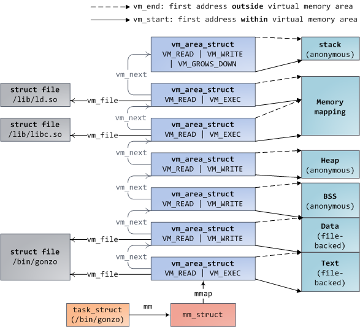
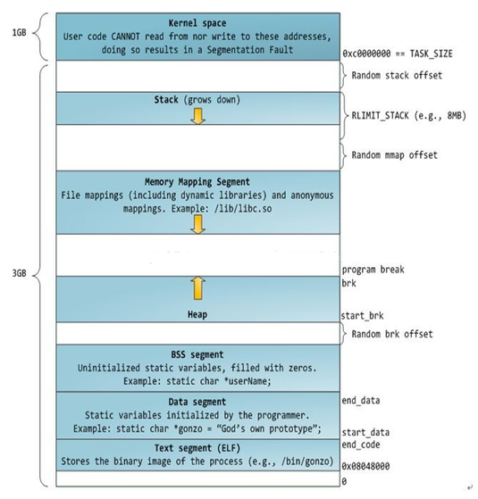

<center><font size='6'>Linux内存管理 brk(),mmap(),munmap()系统调用源码分析</font></center>
<center><font size='6'>基础部分</font></center>
<br/>
<br/>
<center><font size='5'>荣涛</font></center>
<center><font size='5'>2021年4月30日</font></center>
<br/>


* 内核版本：linux-5.10.13
* 注释版代码：[https://github.com/Rtoax/linux-5.10.13](https://github.com/Rtoax/linux-5.10.13)
* [https://rtoax.blog.csdn.net/article/details/116306341](https://rtoax.blog.csdn.net/article/details/116306341)


# 1. 用户态libc封装

## 1.1. brk
```c
#include <unistd.h>

int brk(void *addr);
void *sbrk(intptr_t increment);
```

## 1.2. mmap和munmap
```c
#include <sys/mman.h>

void *mmap(void *addr, size_t length, int prot, int flags,
          int fd, off_t offset);
int munmap(void *addr, size_t length);
```

### 1.2.1. prot取值

* PROT_EXEC  Pages may be executed.
* PROT_READ  Pages may be read.
* PROT_WRITE Pages may be written.
* PROT_NONE  Pages may not be accessed.


### 1.2.2. flags取值

* MAP_SHARED：进程间共享，共享内存的一种
* MAP_PRIVATE：进程私有，当malloc一大块内存时，即为该选项
* MAP_32BIT: 映射到用户地址空间的前2G中；
* MAP_ANON
* MAP_ANONYMOUS：初始化为0的匿名映射
* MAP_DENYWRITE：忽略
* MAP_EXECUTABLE：忽略
* MAP_FILE：忽略
* MAP_FIXED：准确解释地址，如果addr和len指定的内存区域与任何现有映射的页面重叠，则现有映射的重叠部分将被丢弃
* MAP_GROWSDOWN：用于栈
* MAP_HUGETLB：大页内存，闻名于DPDK
* MAP_LOCKED：不会被swap出去
* MAP_NONBLOCK：仅与MAP_POPULATE结合使用才有意义，不执行预读：仅为RAM中已经存在的页面创建页表条目。 从Linux 2.6.23开始，此标志使MAP_POPULATE不执行任何操作。
* MAP_NORESERVE：不要为此映射提供swap空间
* MAP_POPULATE：填充页表以进行映射。 对于文件映射，这将导致文件上的预读。 pagefault不会阻止以后对映射的访问。 仅从Linux 2.6.23开始，专用映射才支持MAP_POPULATE。
* MAP_STACK：用于栈
* MAP_UNINITIALIZED：用于提高嵌入式设备的性能

需要注意的是，以上的选项很多，不用每个选项都清楚其原理和使用，就我来说，目前我是用过的只有`MAP_SHARED`，`MAP_PRIVATE`，`MAP_HUGETLB`和`MAP_LOCKED`这些常用的，剩下的我也没做过研究。


# 2. 内核中的入口点

## 2.1. brk
```c
//mm\mmap.c
SYSCALL_DEFINE1(brk, unsigned long, brk);
```
## 2.2. mmap
```c
//mm\mmap.c
SYSCALL_DEFINE6(mmap_pgoff, unsigned long, addr, unsigned long, len,
		unsigned long, prot, unsigned long, flags,
		unsigned long, fd, unsigned long, pgoff);

//arch\x86\kernel\sys_x86_64.c
SYSCALL_DEFINE6(mmap, unsigned long, addr, unsigned long, len,
		unsigned long, prot, unsigned long, flags,
		unsigned long, fd, unsigned long, off);
```
## 2.3. munmap
```c
//mm\mmap.c
SYSCALL_DEFINE2(munmap, unsigned long, addr, size_t, len);
```

# 3. 内核调用栈

## 3.1. brk
```c
SYSCALL_DEFINE1(brk, unsigned long, brk)
    check_data_rlimit()
    if (brk <= mm->brk)
        __do_munmap(...) -> 见 munmap
    find_vma
    do_brk_flags
        get_unmapped_area
        munmap_vma_range
        may_expand_vm
        security_vm_enough_memory_mm
        vma_merge
        vm_area_alloc
        vma_set_anonymous
        vma_link
        perf_event_mmap
    userfaultfd_unmap_complete
    if (populate)
        mm_populate
            __mm_populate
```

## 3.2. mmap

```c
SYSCALL_DEFINE6(mmap_pgoff, ...)
SYSCALL_DEFINE6(mmap,...)
    ksys_mmap_pgoff
        if (!(flags & MAP_ANONYMOUS))
            audit_mmap_fd
            fget
            if (is_file_hugepages(file))
        else if (flags & MAP_HUGETLB)
            hstate_sizelog
            hugetlb_file_setup
        vm_mmap_pgoff
            security_mmap_file
            if (!ret)
                do_mmap
                userfaultfd_unmap_complete
                if (populate)
			        mm_populate -> 同 brk
```

## 3.3. munmap
```c
SYSCALL_DEFINE2(munmap, unsigned long, addr, size_t, len)
    untagged_addr
    profile_munmap
    __vm_munmap
        __do_munmap
            arch_unmap
            find_vma
            unmap_region
            remove_vma_list
        userfaultfd_unmap_complete
```


# 4. 相关内核数据结构

以下简化的三个数据结构承载了用户空间地址管理的任务，具体这三个数据结构的架构图



图片链接[http://static.duartes.org/img/blogPosts/memoryDescriptorAndMemoryAreas.png](http://static.duartes.org/img/blogPosts/memoryDescriptorAndMemoryAreas.png)

## 4.1. task_struct
```c
struct task_struct {
    ...
    struct mm_struct		*mm;
    struct mm_struct		*active_mm;
    ...
};
```
## 4.2. mm_struct
```c
struct mm_struct {
    ...
    struct vm_area_struct *mmap;
    struct rb_root mm_rb;
	unsigned long start_code, end_code, start_data, end_data;   /* brk() */
	unsigned long start_brk, brk, start_stack;
    ...
};
```
## 4.3. vm_area_struct
```c
struct vm_area_struct {
    ...
	unsigned long vm_start;
	unsigned long vm_end;
	struct vm_area_struct *vm_next, *vm_prev;
	struct rb_node vm_rb;
	struct file * vm_file;
	pgd_t * pgd; //全局页目录
    ...
};
```

在理解了VMA管理后，进行正式的源码分析，但是有必要先说一下进程地址空间的结构，这里我们就以32bit系统为例，64bit系统大同小异。



图片来源[https://imgs.developpaper.com/imgs/4192938510-82183e6d4e7dc101_articlex.png](https://imgs.developpaper.com/imgs/4192938510-82183e6d4e7dc101_articlex.png)


# 5. 相关链接

* [https://www.cs.unc.edu/~porter/courses/cse506/f12/slides/address-spaces.pdf](https://www.cs.unc.edu/~porter/courses/cse506/f12/slides/address-spaces.pdf)
* [https://stackoverflow.com/questions/14943990/overlapping-pages-with-mmap-map-fixed](https://stackoverflow.com/questions/14943990/overlapping-pages-with-mmap-map-fixed)
* [https://rtoax.blog.csdn.net/article/details/116306341](https://rtoax.blog.csdn.net/article/details/116306341)


