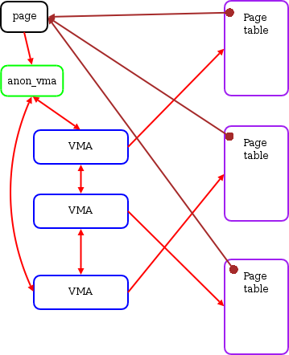

<center><font size='6'>Linux brk(),mmap()系统调用源码分析</font></center>
<center><font size='6'>brk()的内存释放流程</font></center>
<br/>
<br/>
<center><font size='5'>荣涛</font></center>
<center><font size='5'>2021年4月30日</font></center>
<br/>


* 内核版本：linux-5.10.13
* 注释版代码：[https://github.com/Rtoax/linux-5.10.13](https://github.com/Rtoax/linux-5.10.13)


# 1. 基础部分

在上篇文章中已经介绍了基础部分 [《Linux内存管理 brk(),mmap()系统调用源码分析1：基础部分》](https://rtoax.blog.csdn.net/article/details/116306341)，本文介绍brk的释放部分。

下面开始介绍brk释放流程。

brk会提高或者降低堆顶位置，从而达到分配和释放用户地址空间的效果。

首先获取brk开始的地方，如果新的brk小于最小的brk，直接退出：
```c
min_brk = mm->start_brk;
if (brk < min_brk)
		goto out;
```
接着，检测进程允许的数据大小，如果超限，直接退出：

```c
if (check_data_rlimit(rlimit(RLIMIT_DATA), brk, mm->start_brk,
		      mm->end_data, mm->start_data))
	goto out;
```
上面的结构就像上节提高过的地址空间，其中数据结构如下：
```
+-------+ brk
|       |
|       |   堆
|  heap |
+-------+ mm->start_brk
|       |
|  ...  |
|       |
+-------+ mm->end_data
|       |
|  data |   数据段
|       |
+-------+ mm->start_data
```
接着将brk页对齐`newbrk = PAGE_ALIGN(brk);`，这也是为什么申请几个字节的数据，越界使用也不会出错，但是超出页大小就会段错误的原因。然后获取上次brk的也对齐位置，当这两个数值对齐后相等，那么就可以直接推出了：

```c
	newbrk = PAGE_ALIGN(brk);       /* 新的 brk ：页对齐，申请大小对齐 page */
	oldbrk = PAGE_ALIGN(mm->brk);   /* 旧的 brk */
	if (oldbrk == newbrk) { /* brk 位置没有发生变化 */
		mm->brk = brk;
		goto success;
	}
```

如果新的brk小于上次的brk呢？很好理解，就是对应free/release操作呗，`brk <= mm->brk`。

# 2. 释放

如果`brk <= mm->brk`，首先更新brk位置`mm->brk = brk;`，然后调用`__do_munmap`函数，

```c
__do_munmap(mm, newbrk, oldbrk-newbrk, &uf, true)
```
参数列表为：

* mm：进程地址空间mm_struct结构；
* newbrk：新的页对齐的brk位置；
* oldbrk-newbrk：长度（也是页对齐的）；
* uf：链表头，在上面初始化`LIST_HEAD(uf);`；
* true：代表downgrade；

此时的关系为：
```
+-------+ oldbrk
|       |
|       |
|       | newbrk ~ mm->brk 约等于，页对齐
|       |
|       |
+-------+ mm->start_brk
```

下面详细看下`__do_munmap`函数实现。

# 3. __do_munmap

函数原型为：
```c
int __do_munmap(struct mm_struct *mm, unsigned long start, size_t len,
		struct list_head *uf, bool downgrade)
```
也就是说，他是这样的：

```c
+-------+--- 
|       |
|       | len
|       |--- start = newbrk(页对齐位置)
|       |
|       |
+-------+ mm->start_brk
```
接收，首先是否超出判断：

```c
	if ((offset_in_page(start)) || start > TASK_SIZE || len > TASK_SIZE-start)
		return -EINVAL;
```
因为已经进行了页对齐，start在页内偏移一定为0，所以`offset_in_page(start)`为真时，返回错误，另外两个判断是对大小的判断。

接着，获取有几个页的长度`len = PAGE_ALIGN(len);`，这里如果没问题的话，len应该等于0,4096,8192这些数值，然后计算结束点位置`end = start + len`，即：

```c
+-------+--- end
|       |
|       | len
|       |--- start
|       |
|       |
+-------+ mm->start_brk
```
接着就调用架构相关的unmap函数`arch_unmap`，在x86下这个函数为空：
```c
static inline void arch_unmap(struct mm_struct *mm, unsigned long start,
			      unsigned long end)/*  */
{
}
```

然后，将start转化为vma（搜索），使用`find_vma`，为了加速，里面会首先看cache中是不是有`vmacache_find`，为了加速查找，vma是保存在mm的红黑树中，可从数据结构中查阅。关于`find_vma`的详细介绍不在过多赘述。

至此，就获取到了start地址所属的VMA结构`vma`

```c
    +-------+--- end
    |       |                   +-------+
    |       | len               |  VMA  |
    |       |--- start -------->|       |
    |       |                   |       |
    |       |                   |       |
    +-------+ mm->start_brk     |       |
                                +-------+
```
下一步获取上一个vma结构（双向链表）`prev = vma->vm_prev`

```c
    +-------+--- end
    |       |                   +-------+ vma->vm_end
    |       | len               |  vma  |
    |       |--- start -------->|       |
    |       |                   |       |
    |       |                   |       |
    +-------+ mm->start_brk     |       |
                                |       |
                                +-------+ vma->vm_start

                                
                                +-------+ 
                                | prev  |
                                |       |
                                |       |
                                |       |
                                |       |
                                |       |
                                +-------+
```
接下来检测`vma->vm_start >= end`（内核真的是比较鲁棒，各种安全检测）。紧接着，又是检测`start > vma->vm_start`，这种情况是啥呢？

```
    +-------+--- end
    |       |                   +-------+ vma->vm_end
    |       | len               |  vma  |
    |       |--- start -------->|       | <-- end
    |       |                   |       |
    |       |                   |       | <-- start
    +-------+ mm->start_brk     |       |
                                |       |
                                +-------+ vma->vm_start
```

> 这里简单介绍一个变量`sysctl_max_map_count`，它是内核sysctl参数，默认值为`65530`。

如果是上图情况，将直接返回

```c
		if (end < vma->vm_end && mm->map_count >= sysctl_max_map_count) 
			return -ENOMEM;
```

否则如果是这种情况：

```
    +-------+--- end
    |       |                   +-------+ vma->vm_end 
    |       | len               |  vma  |
    |       |--- start -------->|       | <-- end
    |       |                   |       |
    |       |                   |       | <-- start
    +-------+ mm->start_brk     |       |
                                |       |
                                +-------+ vma->vm_start
```
进行vma的分割，使用`__split_vma`函数实现。下面详细介绍。

## 3.1. __split_vma

函数原型为：
```c
int __split_vma(struct mm_struct *mm, struct vm_area_struct *vma,
		unsigned long addr, int new_below)
```
在上面的情况中参数对应关系为：
```
    +-------+--- end
    |       |                   +-------+ vma->vm_end
    |       | len               |  vma  |
    |       |--- start -------->|       | <-- end
    |       |                   |       |
    |       |                   |       | <-- addr ****
    +-------+ mm->start_brk     |       |
                                |       |
                                +-------+ vma->vm_start
```

* new_below=0

首先使用`vm_area_dup`为新的vma分配内存（kmem_alloc），并且这个结构没有加入链表中`new->vm_next = new->vm_prev = NULL`。当`new_below=0`时，`new->vm_start = addr`，并计算其在页中的偏移`new->vm_pgoff += ((addr - vma->vm_start) >> PAGE_SHIFT)`。接着调用`vma_dup_policy`赋值内存策略，这是和NUMA相关的。然后进行匿名vma克隆`anon_vma_clone`，这和反向映射相关，本文不做过多解释。

紧接着，判断是否为文件映射，如果是，增加file结构的引用计数，如果vm_ops存在，调用open方法：
```c
	if (new->vm_file)
		get_file(new->vm_file);
	if (new->vm_ops && new->vm_ops->open)
		new->vm_ops->open(new);
```
上面的两步，不是本文的重点，下面调用`vma_adjust`函数。需要说明的是，在调用`vma_adjust`之前，new的结构是这样的：
```
                                          <-- end
    +-------+--- end
    |       |                   +-------+ vma->vm_end   +-------+
    |       | len               |  vma  |               |       |
    |       |--- start -------->|       |               |  new  |
    |       |                   |       |               |       |
    |       |                   |       | <-- addr **** +-------+ <-- new->vm_start
    +-------+ mm->start_brk     |       |
                                |       |
                                +-------+ vma->vm_start
```
`vma_adjust`会调用`__vma_adjust`

```c
static inline int vma_adjust(struct vm_area_struct *vma, unsigned long start,
	unsigned long end, pgoff_t pgoff, struct vm_area_struct *insert)
{
	return __vma_adjust(vma, start, end, pgoff, insert, NULL);
}
```
`__vma_adjust`函数的注释是：

> 如果不调整树，则无法调整i_mmap树中已经存在的vma的vm_start，vm_end，vm_pgoff字段。 当需要进行此类调整时，应使用以下帮助器功能。 在插入必要的锁之前，将插入“insert” vma（如果有）。


## 3.2. __vma_adjust

这个函数比较复杂。

函数原型为：

```c
int __vma_adjust(struct vm_area_struct *vma, unsigned long start,
	unsigned long end, pgoff_t pgoff, struct vm_area_struct *insert,
	struct vm_area_struct *expand)
```
对应参参数变量分别为：

* vma：当前操作传递vma结构；
* start：vma->vm_start；
* end：addr，也就是new的vm_start；
* pgoff：vma->vm_pgoff；
* insert：new；
* expand：NULL；

获取vma的next vma结构`next = vma->vm_next`，如下图：
```
                                +-------+
                                |       |
                                |       |
                                |       |
                                | next  |
                                |       |
                                |       |
                                +-------+
                                
    +-------+--- end            orig_vma
    |       |                   +-------+               +-------+
    |       | len               |  vma  |               |       |
    |       |--- start -------->|       |               | insert|
    |       |                   |       |               |       |
    |       |                   |       | <-- end ----> +-------+
    +-------+ mm->start_brk     |       |
                                |       |
                                +-------+ start
```

这个分支`if (next && !insert)`我们先不用看。来到`again:`标签处，`vma_adjust_trans_huge`函数被调用，入参分别为`vma_adjust_trans_huge(orig_vma, start, end, adjust_next=0);`，这是和大页内存相关的，本文先略过。紧接着是文件映射`if (file)`，在后面就是anon_vma，这里给出一个简图：



这是反向映射的基石，本文不讨论。接下来迎接来了代码：

```
	if (start != vma->vm_start) {
		vma->vm_start = start;
		start_changed = true;
	}
	if (end != vma->vm_end) {
		vma->vm_end = end;
		end_changed = true;
	}
	vma->vm_pgoff = pgoff;
```

这个操作很简单，直接看图就行了：
```
     +-------+
     |  vma  |
     |       | 
     |       |
     |       | <-- end
     |       |
     |       |
     +-------+ start
 
     >>>> 变为
                
     +-------+ <-- vma->vm_end
     |  vma  |
     |       |
     +-------+ <-- vma->vm_start
```

接下来的remove_next不执行。转而执行`else if (insert)`分支，这个分支很简单，执行`__insert_vm_struct`函数，该函数原型是：

```c
static void __insert_vm_struct(struct mm_struct *mm, struct vm_area_struct *vma)
{
	struct vm_area_struct *prev;
	struct rb_node **rb_link, *rb_parent;

	if (find_vma_links(mm, vma->vm_start, vma->vm_end,
			   &prev, &rb_link, &rb_parent))
		BUG();
	__vma_link(mm, vma, prev, rb_link, rb_parent);
	mm->map_count++;
}
```
将vma结构添加至mm结构的红黑树和双向链表。后面执行的`validate_mm`是打开`CONFIG_DEBUG_VM_RB`功能的操作，不做讨论。

至此，`vma_adjust`就返回了，接着`__split_vma`也返回了。
```c
		err = vma_adjust(vma, vma->vm_start, addr, vma->vm_pgoff, new);
	/* Success. */
	if (!err)
		return 0;
```

现在回到`__do_munmap`。在`__split_vma`成功放回后，执行`prev = vma;`操作。

```c
	error = __split_vma(mm, vma, start, 0); /* 分离一个 vma 结构 */
	if (error)
		return error;
	prev = vma;
```
要知道，此时的vma比原来要小了，并且它的下一个vma是自己被切出来的，查找下一个vma结构：

```c
last = find_vma(mm, end);
```
如果是下面这种情况，需要继续拆分vma结构：
```
                                +-------+
                                |       | 
                                |       | 
    +-------+--- end            |       | <-- end
    |       |                   | last  |
    |       | len               |       | 
    |       |                   +-------+ last->vm_start
    |       |                   
    |       |                   +-------+ vma->vm_end
    +-------+ mm->start_brk     | prev  |
                                |       |
                                +-------+ vma->vm_start
```
这与上面的情况正好相反，上面是需要拆分的部分在vma之上，现在是需要查分的部分在vma之下，所以在调用`__split_vma`时候的标志位`new_below`这次等于`1`。

接入函数后，还是申请vma新的结构，然后进行vm_end赋值，此时的结构为：

```c
    +-------+
    |       | 
    |       | 
    |       | <-- addr  +-------+ <-- new->vm_end
    |  vma  |           |       |
    |       |           |  new  |
    +-------+           +-------+
```
然后进行`vma_adjust`操作，可以不做过多解释了，直接给出一段我对他的代码注释吧。

```c
if (new_below)
    /* 
    +-------+
    |       | 
    |       | 
    |       | <-- addr      +-------+ <-- new->vm_end
    |  vma  |               |       |
    |       |               |  new  |
    +-------+               +-------+ <-- new->vm_start
    */
	err = vma_adjust(vma, addr, vma->vm_end, vma->vm_pgoff +
		((addr - new->vm_start) >> PAGE_SHIFT), new);
else
    /*
    +-------+ vma->vm_end   +-------+
    |       |               |       |
    |       |               |  new  |
    |  vma  |               |       |
    |       | <-- addr **** +-------+ <-- new->vm_start
    |       |
    |       |
    +-------+ vma->vm_start
    */
	err = vma_adjust(vma, vma->vm_start, addr, vma->vm_pgoff, new);
```

整体上面对vma的拆分工作可以认为是将用户地址空间需要释放的区域单独组建vma结构，从其他的vma中隔离出来。

## 3.3. detach_vmas_to_be_unmapped

上面拆分完vma后，需要将这些vma从红黑树中擦除，擦除的范围呢？从函数的调用中可以看：
```c
detach_vmas_to_be_unmapped(mm, vma, prev, end)
```
* mm：当前的进程地址空间；
* vma：是prev的下一个vma，`vma = vma_next(mm, prev);`；
* prev：不在free空间的最后一个vma；
* end：需要free的最大地址；

那就好理解了，从vma开始遍历红黑树，并对其进行重新连接，代码如下：
```c
	insertion_point = (prev ? &prev->vm_next : &mm->mmap);
	vma->vm_prev = NULL;
	do {
		vma_rb_erase(vma, &mm->mm_rb);
		mm->map_count--;
		tail_vma = vma;
		vma = vma->vm_next;
	} while (vma && vma->vm_start < end);
	*insertion_point = vma;
```
这段代码不用解释了吗，很简单。如果说需要释放的空间以上（next）还有有效的vma怎么办呢，更简单：

```c
if (vma) {
	vma->vm_prev = prev;
	vma_gap_update(vma);
}
```
然后将最后一个vma的next置空`tail_vma->vm_next = NULL;`。接下来的判断是：

```c
	/*
	 * Do not downgrade mmap_lock if we are next to VM_GROWSDOWN or
	 * VM_GROWSUP VMA. Such VMAs can change their size under
	 * down_read(mmap_lock) and collide with the VMA we are about to unmap.
	 */
	if (vma && (vma->vm_flags & VM_GROWSDOWN))
		return false;
	if (prev && (prev->vm_flags & VM_GROWSUP))
		return false;
```
上面这两个判断会在后续的文章中讲解，`detach_vmas_to_be_unmapped`到此结束。

如果`detach_vmas_to_be_unmapped`执行失败，将执行下面的代码，本文也不做讲解。

```c
	if (downgrade)
		mmap_write_downgrade(mm);
```

## 3.4. unmap_region

接下来迎接的就是`unmap_region`函数了，在该函数的定义如下：
```c
/*
 * Get rid of page table information in the indicated region.
 *
 * Called with the mm semaphore held.
 */ /*  */
static void unmap_region(struct mm_struct *mm,
		struct vm_area_struct *vma, struct vm_area_struct *prev,
		unsigned long start, unsigned long end)
{
	struct vm_area_struct *next = vma_next(mm, prev);
	struct mmu_gather tlb;

	lru_add_drain();
	tlb_gather_mmu(&tlb, mm, start, end);
	update_hiwater_rss(mm);
	unmap_vmas(&tlb, vma, start, end);
	free_pgtables(&tlb, vma, prev ? prev->vm_end : FIRST_USER_ADDRESS,
				 next ? next->vm_start : USER_PGTABLES_CEILING);
	tlb_finish_mmu(&tlb, start, end);
}
```
简言之，这是一些列的free和flush操作，同时也会更新水位，**将物理内存归还给操作系统**。由于篇幅限制，这些函数功能不一一讲解，可以单独作为一篇或者更多篇幅。

## 3.5. remove_vma_list

`__do_munmap`中的最后一个函数。在上面的操作中，已经将vma结构从红黑树中擦除了，下面将遍历vma链表，进行vma结构告诉缓存的释放，先看下函数定义：

```c
/*
 * Ok - we have the memory areas we should free on the vma list,
 * so release them, and do the vma updates.
 *
 * Called with the mm semaphore held.
 */
static void remove_vma_list(struct mm_struct *mm, struct vm_area_struct *vma)
{
	unsigned long nr_accounted = 0;

	/* Update high watermark before we lower total_vm */
	update_hiwater_vm(mm);
	do {
		long nrpages = vma_pages(vma);/*  */

		if (vma->vm_flags & VM_ACCOUNT)
			nr_accounted += nrpages;
		vm_stat_account(mm, vma->vm_flags, -nrpages);
		vma = remove_vma(vma);  /* 释放内存 */
	} while (vma);
	vm_unacct_memory(nr_accounted);
	validate_mm(mm);    /*  */
}
```

这将遍历整个需要free的vma链表，通过使用`remove_vma`对slab object进行释放，并返回下一个vma结构。

## 3.6. remove_vma

```c
/*
 * Close a vm structure and free it, returning the next.
 */
static struct vm_area_struct *remove_vma(struct vm_area_struct *vma)    /*  */
{
	struct vm_area_struct *next = vma->vm_next;

	might_sleep();
	if (vma->vm_ops && vma->vm_ops->close)
		vma->vm_ops->close(vma);
	if (vma->vm_file)
		fput(vma->vm_file);
	mpol_put(vma_policy(vma));
	vm_area_free(vma);
	return next;
}
```
其中的关键函数是`vm_area_free`，这个函数很简单，
```c
void vm_area_free(struct vm_area_struct *vma)
{
	kmem_cache_free(vm_area_cachep, vma);
}
```

至此，关于`__do_munmap`结束，他在brk系统调用中返回：

```c
	ret = __do_munmap(mm, newbrk, oldbrk-newbrk, &uf, true);    /* do munmap */
	if (ret < 0) {
		mm->brk = origbrk;  /* unmap 失败使用原来的brk 位置 */
		goto out;
	} else if (ret == 1) {
		downgraded = true;
	}
	goto success;
```

# 4. 申请

上面释放的篇幅过长,申请流程单独介绍。


# 5. 相关链接

* [https://www.cs.unc.edu/~porter/courses/cse506/f12/slides/address-spaces.pdf](https://www.cs.unc.edu/~porter/courses/cse506/f12/slides/address-spaces.pdf)
* [https://stackoverflow.com/questions/14943990/overlapping-pages-with-mmap-map-fixed](https://stackoverflow.com/questions/14943990/overlapping-pages-with-mmap-map-fixed)


