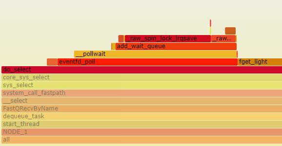

<center><font size='6'>Linux select()系统调用源码分析</font></center>
<br/>
<br/>
<center><font size='5'>rtoax</font></center>
<center><font size='5'>2021年4月26日</font></center>
<br/>


先给出几个用户态select系统调用的socket示例程序：[https://github.com/Rtoax/test/tree/master/ipc/socket/select](https://github.com/Rtoax/test/tree/master/ipc/socket/select)

* 内核版本：linux-5.10.13
* 代码示例：select+eventfd
* 注释版代码：[https://github.com/Rtoax/linux-5.10.13](https://github.com/Rtoax/linux-5.10.13)

# 1. select()系统调用

不做过多的解释，本文不对系统调用从用户态到内核态的流程，只关注select本身。

## 1.1. 用户态
```c
/* According to POSIX.1-2001 */
#include <sys/select.h>

/* According to earlier standards */
#include <sys/time.h>
#include <sys/types.h>
#include <unistd.h>

int select(int nfds, fd_set *readfds, fd_set *writefds,
            fd_set *exceptfds, struct timeval *timeout);

void FD_CLR(int fd, fd_set *set);
int  FD_ISSET(int fd, fd_set *set);
void FD_SET(int fd, fd_set *set);
void FD_ZERO(fd_set *set);
```

## 1.2. 内核态

```c
SYSCALL_DEFINE5(select, int, n, fd_set __user *, inp, fd_set __user *, outp,
		fd_set __user *, exp, struct __kernel_old_timeval __user *, tvp)
{
	return kern_select(n, inp, outp, exp, tvp);
}
```

`kern_select`为内核函数，参数列表与select一致。

# 2. kern_select

源码函数全文：
```c
static int kern_select(int n, fd_set __user *inp, fd_set __user *outp,
		       fd_set __user *exp, struct __kernel_old_timeval __user *tvp)
{
	struct timespec64 end_time, *to = NULL;
	struct __kernel_old_timeval tv;
	int ret;

	if (tvp) {
		if (copy_from_user(&tv, tvp, sizeof(tv)))
			return -EFAULT;

		to = &end_time;
		if (poll_select_set_timeout(to,
				tv.tv_sec + (tv.tv_usec / USEC_PER_SEC),
				(tv.tv_usec % USEC_PER_SEC) * NSEC_PER_USEC))
			return -EINVAL;
	}

	ret = core_sys_select(n, inp, outp, exp, to);
	return poll_select_finish(&end_time, tvp, PT_TIMEVAL, ret);
}
```

如果用户态设置了`tvp`，`kern_select`将设置`end_time`，函数`poll_select_set_timeout`是对`end_time`的计算，此处不赘述。接着进入函数`core_sys_select`，这个函数传入读写异常三个fd_set结构，最大fd，并且当用户态设置了timeout时，传入计算出的`end_time`。最终调用`poll_select_finish`将到期时间传递给用户态。

# 3. core_sys_select

首先在栈空间申请内存用于存放所有的fd bitmap：

```c
long stack_fds[SELECT_STACK_ALLOC/sizeof(long)];    /* 256 * 8 = 2048 个描述符 */
```
接着使用函数`files_fdtable`获取打开的文件列表，随后判断栈空间变量`stack_fds`能够装下传入的in，out，ex文件fd，如果不能，使用`kvmalloc`分配内存。然后，结构fd_set_bits派上了用场，结构定义如下：
```c
typedef struct {    /* bitmap */
	unsigned long *in, *out, *ex;
	unsigned long *res_in, *res_out, *res_ex;
} fd_set_bits;
```
很明显，这是和select系统调用的fd_set存在映射关系。现在就需要将分配的内存分配给这个数据结构，很简单：
```c
/* 均衡地分配 fd 入参和出参 */
fds.in      = bits;
fds.out     = bits +   size;
fds.ex      = bits + 2*size;
fds.res_in  = bits + 3*size;
fds.res_out = bits + 4*size;
fds.res_ex  = bits + 5*size;
```
然后将用户空间内容拷贝至上述结构，并将返回的读写异常清零：
```c
/* 将用户态的 fd_set 拷贝至内核态，这也是 select 的开销，fd很多的情况下，
    将严重影响select性能 */
if ((ret = get_fd_set(n, inp, fds.in)) ||
    (ret = get_fd_set(n, outp, fds.out)) ||
    (ret = get_fd_set(n, exp, fds.ex)))
	goto out;
zero_fd_set(n, fds.res_in); /* 清理输出的返回的 fd_set，返回时将返回给用户态 */
zero_fd_set(n, fds.res_out);
zero_fd_set(n, fds.res_ex);
```
紧接着，就进入了select的核心：`do_select`函数：
```c
ret = do_select(n, &fds, end_time); /* 正经八百的 内核态 select 开始 */
```
我先把`core_sys_select`一口气说完。当`do_select`返回后，检查执行结果，如果成功，检查是否有信号挂起，需要直接返回处理信号，如果一切正常，将结构`fd_set_bits`的返回项拷贝至用户态，并返回。

```c
/* 成功的话，将读写异常的 fd 拷贝至 用户态 */
if (set_fd_set(n, inp, fds.res_in) ||
    set_fd_set(n, outp, fds.res_out) ||
    set_fd_set(n, exp, fds.res_ex))
	ret = -EFAULT;
```
这就是`core_sys_select`函数的执行过程，下面我们再看核心函数`do_select`。


## 3.1. do_select

函数开头一个轮询等待队列结构`struct poll_wqueues table;`，先看一眼：
```c
/*
 * Structures and helpers for select/poll syscall
 */
struct poll_wqueues {   /* 轮询等待队列 */
	poll_table pt;      /* 回调+key */
	struct poll_table_page *table;      /*  */
	struct task_struct *polling_task;   /*  */
	int triggered;      /* 被触发 */
	int error;          /*  */
	int inline_index;   /*  */
	struct poll_table_entry inline_entries[N_INLINE_POLL_ENTRIES];
};
```
其中结构`poll_table`如下：
```c
/* 
 * structures and helpers for f_op->poll implementations
 */
typedef void (*poll_queue_proc)(struct file *, wait_queue_head_t *, struct poll_table_struct *);

/*
 * Do not touch the structure directly, use the access functions
 * poll_does_not_wait() and poll_requested_events() instead.
 */
typedef struct poll_table_struct {  /* 轮询表 */
	poll_queue_proc _qproc; /* 回调 */
	__poll_t _key;          /* key */
} poll_table;
```
结构`poll_table_page`如下：
```c
struct poll_table_page {    /* 轮询表 page */
	struct poll_table_page * next;      /* 单链表 */
	struct poll_table_entry * entry;    /* 轮询表 entry */
	struct poll_table_entry entries[];  /*  */
};
```
`poll_table_entry`结构如下：
```c
struct poll_table_entry {   /* 轮询表项 */
	struct file *filp;      /* 文件指针 */
	__poll_t key;           /* key */
	wait_queue_entry_t wait;/* 等待队列 entry */
	wait_queue_head_t *wait_address;    /* 等待队列 */
};
```
关于结构`poll_wqueues`先止于此。回到`do_select`函数。

使用`max_select_fd`获取最大的fd。`poll_initwait`初始化`poll_wqueues`结构，函数定义如下(做了简化)：

```c
void poll_initwait(struct poll_wqueues *pwq)
{
	pwq->pt->_qproc = __pollwait;
	pwq->pt->_key   = 0xffffffffff...; /* all events enabled - 0xffff... */
	pwq->polling_task = current;
	pwq->triggered = 0;
	pwq->error = 0;
	pwq->table = NULL;
	pwq->inline_index = 0;
}
EXPORT_SYMBOL(poll_initwait);
```
接着，就进入了主循环：

```c
retval = 0;
for (;;) {
    ...
```
主循环下的第一级遍历：
```c
    /* 遍历到最大 fd， select 的最大 fd */
	for (i = 0; i < n; ++rinp, ++routp, ++rexp) {
	    ...
```
在这个循环中，首先将所有fd放入all_bits变量：
```c
    	in = *inp++; out = *outp++; ex = *exp++;
    	all_bits = in | out | ex;   /* 读写异常 */
    	if (all_bits == 0) {    /* 为空，下一组 */
    		i += BITS_PER_LONG;
    		continue;
    	}
```
然后进入第二级遍历（遍历第一组fd，大小为8bits）：

```c
        /* 如果这一组 fd_set 不为空，进行遍历这个 8 位 fd */
		for (j = 0; j < BITS_PER_LONG; ++j, ++i, bit <<= 1) {
```
首先通过接口`fdget`将整形fd转化为结构体`struct file`并判断此文件是否存在，如果存在，执行如下步骤。

在函数`poll_initwait`中将`wait->_key`设置为全`0xffffffff...`，这里，它将被修改：
```c
    		wait_key_set(wait, in, out, bit,
    			     busy_flag);
```
函数定义为：
```c
static inline void wait_key_set(poll_table *wait, unsigned long in,
				unsigned long out, unsigned long bit,
				__poll_t ll_flag)
{
	wait->_key = POLLEX_SET | ll_flag;
	if (in & bit)
		wait->_key |= POLLIN_SET;   /* IN */
	if (out & bit)
		wait->_key |= POLLOUT_SET;  /* OUT */
}
```
这里主要这几道这几个标志位：
```c
/* Epoll event masks */
#define EPOLLIN		(__force __poll_t)0x00000001
#define EPOLLPRI	(__force __poll_t)0x00000002
#define EPOLLOUT	(__force __poll_t)0x00000004
#define EPOLLERR	(__force __poll_t)0x00000008
#define EPOLLHUP	(__force __poll_t)0x00000010
#define EPOLLNVAL	(__force __poll_t)0x00000020
#define EPOLLRDNORM	(__force __poll_t)0x00000040
#define EPOLLRDBAND	(__force __poll_t)0x00000080
#define EPOLLWRNORM	(__force __poll_t)0x00000100
#define EPOLLWRBAND	(__force __poll_t)0x00000200
#define EPOLLMSG	(__force __poll_t)0x00000400
#define EPOLLRDHUP	(__force __poll_t)0x00002000

#define POLLIN_SET (EPOLLRDNORM | EPOLLRDBAND | EPOLLIN | EPOLLHUP | EPOLLERR)  /*  */
#define POLLOUT_SET (EPOLLWRBAND | EPOLLWRNORM | EPOLLOUT | EPOLLERR)   /*  */
#define POLLEX_SET (EPOLLPRI)   /*  */
```
先简单认为做出一些标志位的设定。下面就执行虚拟文件系统的轮询函数，之类因为在文章开头说明了，我并没有测试网络套接字fd，而知使用eventfd，所以，这里的`vfs_poll`是`eventfd_fops`的`poll`函数，也就是`eventfd_poll`，这在火焰图中可以证明（perf record）：




`eventfd_poll`函数的核心函数为`poll_wait`，看下它的实现：

### 3.1.1. poll_wait

它的实现他别简单：
```c
static inline void poll_wait(struct file * filp, wait_queue_head_t * wait_address, poll_table *p)
{
	if (p && p->_qproc && wait_address)
		p->_qproc(filp, wait_address, p);
}
```
那`_qproc`又是谁呢，从火焰图中看出是`__pollwait`，在上节中的函数`poll_initwait`中也可以证明：

```c
	pwq->pt->_qproc = __pollwait;
```
现在核心就落在了`__pollwait`函数上，这个函数不长，直接给出全部：

```c
/* Add a new entry */
static void __pollwait(struct file *filp, wait_queue_head_t *wait_address,
				poll_table *p)
{
	struct poll_wqueues *pwq = container_of(p, struct poll_wqueues, pt);
	struct poll_table_entry *entry = poll_get_entry(pwq);
	if (!entry)
		return;
	entry->filp = get_file(filp);
	entry->wait_address = wait_address;
	entry->key = p->_key;
	init_waitqueue_func_entry(&entry->wait, pollwake);
	entry->wait.private = pwq;
	add_wait_queue(wait_address, &entry->wait);
}
```
简言之，就是将一系列的wakeup函数挂入等待队列，如果时间发生，将通过等待队列调用，那么这个wakeup函数是谁呢，这还用问？当然是`pollwake`了。

### 3.1.2. pollwake

这个函数也很短，直接给出定义：

```c
static int pollwake(wait_queue_entry_t *wait, unsigned mode, int sync, void *key)
{
	struct poll_table_entry *entry;

	entry = container_of(wait, struct poll_table_entry, wait);
	if (key && !(key_to_poll(key) & entry->key))
		return 0;
	return __pollwake(wait, mode, sync, key);
}
```
别的不多说，接着进入函数`__pollwake`，这个函数调用了`default_wake_function`函数，而这个函数继续调用了`try_to_wake_up`函数唤醒进程。对于函数`try_to_wake_up`，不在此处过多说明。现在，我们给出简单的函数调用关系：

```c
do_select
    vfs_poll => f_op->poll
        eventfd_poll
            poll_wait => _qproc = __pollwait
                __pollwait => 注册唤醒函数 <pollwake>
pollwake
    __pollwake
        default_wake_function
            try_to_wake_up
```

在`eventfd_poll`的注释非常清楚，poll在等待write，所以，实际上，select+eventfd的组合。`select`是阻塞在`eventfd_poll->poll_wait`。

```c
/*
 * All writes to ctx->count occur within ctx->wqh.lock.  This read
 * can be done outside ctx->wqh.lock because we know that poll_wait
 * takes that lock (through add_wait_queue) if our caller will sleep.
 *
 * The read _can_ therefore seep into add_wait_queue's critical
 * section, but cannot move above it!  add_wait_queue's spin_lock acts
 * as an acquire barrier and ensures that the read be ordered properly
 * against the writes.  The following CAN happen and is safe:
 *
 *     poll                               write
 *     -----------------                  ------------
 *     lock ctx->wqh.lock (in poll_wait)
 *     count = ctx->count
 *     __add_wait_queue
 *     unlock ctx->wqh.lock
 *                                        lock ctx->qwh.lock
 *                                        ctx->count += n
 *                                        if (waitqueue_active)
 *                                          wake_up_locked_poll
 *                                        unlock ctx->qwh.lock
 *     eventfd_poll returns 0
 *
 * but the following, which would miss a wakeup, cannot happen:
 *
 *     poll                               write
 *     -----------------                  ------------
 *     count = ctx->count (INVALID!)
 *                                        lock ctx->qwh.lock
 *                                        ctx->count += n
 *                                        **waitqueue_active is false**
 *                                        **no wake_up_locked_poll!**
 *                                        unlock ctx->qwh.lock
 *     lock ctx->wqh.lock (in poll_wait)
 *     __add_wait_queue
 *     unlock ctx->wqh.lock
 *     eventfd_poll returns 0
 */
```

当`poll_wait`函数返回后，

```c
	count = READ_ONCE(ctx->count);

	if (count > 0)
		events |= EPOLLIN;
	if (count == ULLONG_MAX)
		events |= EPOLLERR;
	if (ULLONG_MAX - 1 > count)
		events |= EPOLLOUT;

	return events;
```
`mask = vfs_poll(f.file, wait);`也将返回，这里的`mask`即为`events`，接下来的操作：

```c
		if ((mask & POLLIN_SET) && (in & bit)) {
			res_in |= bit;
			retval++;
			wait->_qproc = NULL;
		}
		if ((mask & POLLOUT_SET) && (out & bit)) {
			res_out |= bit;
			retval++;
			wait->_qproc = NULL;
		}
		if ((mask & POLLEX_SET) && (ex & bit)) {
			res_ex |= bit;
			retval++;
			wait->_qproc = NULL;
		}
```
可见，这里标记了读写异常这三种fd_set/bitmap值。本文不介绍`can_busy_loop`引发的操作，使用`poll_schedule_timeout`调度超时的流程也不做讨论，接着，使用`poll_freewait`释放资源，然后就可以返回到`core_sys_select`函数。后续操作在上面章节已经说明，就这样，系统调用select就结束了。


