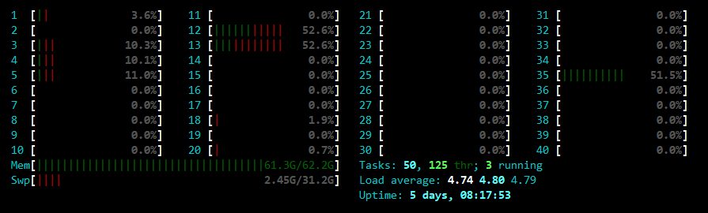

<div align=center>
	 
</div>
<br/>
<br/>

<center><font size='20'>Linux 笔记 Linux NUMA架构分析：CPU+内存</font></center>
<br/>
<br/>
<center><font size='5'>RToax</font></center>
<center><font size='5'>2020年10月</font></center>
<br/>
<br/>
<br/>
<br/>

# 1. 查看CPU处理器个数

```bash
cat /proc/cpuinfo | grep "processor" 
```
结果为
```
processor	: 0
processor	: 1
processor	: 2
...
processor	: 39
```
或者可以选择使用指令`cat /proc/cpuinfo | grep "processor" | wc -l`查看个数。

# 2. 查看CPU详细信息
```bash
cat /proc/cpuinfo | more
```
第0个处理器的信息如下：
```
processor	: 0
vendor_id	: GenuineIntel
cpu family	: 6
model		: 85
model name	: Intel(R) Xeon(R) Gold 6148 CPU @ 2.40GHz
stepping	: 4
microcode	: 0x2000060
cpu MHz		: 2400.000
cache size	: 28160 KB
physical id	: 0
siblings	: 20
core id		: 0
cpu cores	: 20
apicid		: 0
initial apicid	: 0
fpu		: yes
fpu_exception	: yes
cpuid level	: 22
wp		: yes
flags		: fpu vme de pse tsc msr pae mce cx8 apic sep mtrr pge mca cmov pat pse36 clflush dts acpi mmx fxsr
 sse sse2 ss ht tm pbe syscall nx pdpe1gb rdtscp lm constant_tsc art arch_perfmon pebs bts rep_good nopl xtopology 
nonstop_tsc aperfmperf eagerfpu pni pclmulqdq dtes64 monitor ds_cpl vmx smx est tm2 ssse3 fma cx16 xtpr pdcm pcid d
ca sse4_1 sse4_2 x2apic movbe popcnt tsc_deadline_timer aes xsave avx f16c rdrand lahf_lm abm 3dnowprefetch epb cat
_l3 cdp_l3 intel_pt tpr_shadow vnmi flexpriority ept vpid fsgsbase tsc_adjust bmi1 hle avx2 smep bmi2 erms invpcid 
rtm cqm mpx rdt_a avx512f avx512dq rdseed adx smap clflushopt clwb avx512cd avx512bw avx512vl xsaveopt xsavec xgetb
v1 cqm_llc cqm_occup_llc cqm_mbm_total cqm_mbm_local dtherm ida arat pln pts
bogomips	: 4800.00
clflush size	: 64
cache_alignment	: 64
address sizes	: 46 bits physical, 48 bits virtual
power management:
```


# 3. 查看NUMA节点及CPU在NUMA节点上的分布
```bash
numactl --hardware
```
结果为：
```
available: 2 nodes (0-1)
node 0 cpus: 0 2 4 6 8 10 12 14 16 18 20 22 24 26 28 30 32 34 36 38
node 0 size: 32221 MB
node 0 free: 110 MB
node 1 cpus: 1 3 5 7 9 11 13 15 17 19 21 23 25 27 29 31 33 35 37 39
node 1 size: 32768 MB
node 1 free: 47 MB
node distances:
node   0   1 
  0:  10  21 
  1:  21  10 
```


# 4. 查看内存信息
```bash
cat /proc/meminfo | grep Mem
```
结果为：
```
MemTotal:       65191252 kB    #约 64GB
MemFree:          168292 kB
MemAvailable:     523988 kB
```

htop工具


```bash
dmidecode -t memory | grep "Memory Device$" | wc -l
```
结果为：
```
24
```
## 4.1. 分析内存整体
```bash
dmidecode -t memory | more
```

```
Handle 0x1000, DMI type 16, 23 bytes
Physical Memory Array
	Location: System Board Or Motherboard    # 位置：系统板或主板
	Use: System Memory                        #用途：系统内存
	Error Correction Type: Multi-bit ECC    # 纠错类型：多位ECC
	Maximum Capacity: 7680 GB                # 最大可扩展：7680 GB
	Error Information Handle: Not Provided    # 错误信息句柄：未提供
	Number Of Devices: 24                    # 设备数量：24
```
## 4.2. 分析单个内存设备
```
Handle 0x1100, DMI type 17, 84 bytes
Memory Device
	Array Handle: 0x1000                        # Array句柄
	Error Information Handle: Not Provided    #错误信息句柄：未提供
	Total Width: 72 bits                    # 总宽72比特
	Data Width: 64 bits                    #数据宽度64比特
	Size: 16384 MB                            # 大小16GB
	Form Factor: DIMM # DIMM（Dual Inline Memory Module，双列直插内存模块）
	Set: 1
	Locator: A1
	Bank Locator: Not Specified
	Type: DDR4    #  DDR4内存是新一代的内存规格。
	Type Detail: Synchronous Registered (Buffered)  # 同步注册
	Speed: 2933 MHz    # 速率
	Manufacturer: 00AD00B300AD # 厂商
	Serial Number: 934400AE    #序列号
	Asset Tag: 01193161        #资产标签
	Part Number: HMA82GR7JJR8N-WM # 零件编号：HMA82GR7JJR8N-WM
	Rank: 2
	Configured Clock Speed: 2666 MHz # 配置的时钟速度
	Minimum Voltage: 1.2 V    # 最小电压 1.2V
	Maximum Voltage: 1.2 V    # 最大电压 1.2V
	Configured Voltage: 1.2 V    # 配置的电压 1.2V
```


<br/>
<div align=right>以上内容由RTOAX翻译整理自网络。
	 
</div>