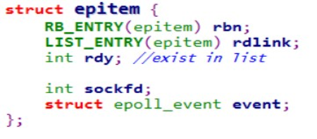
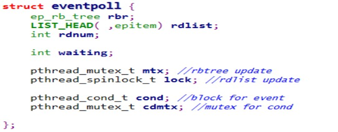
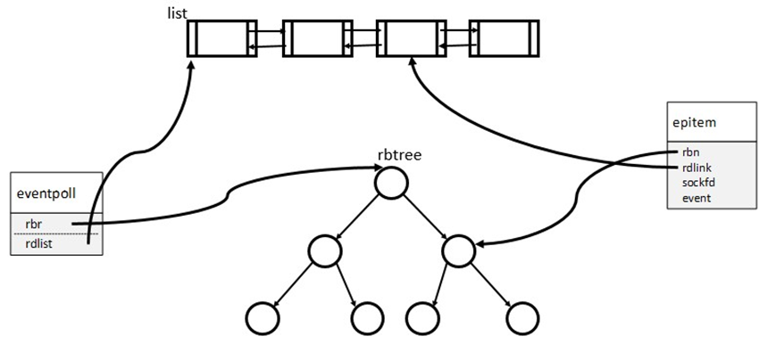
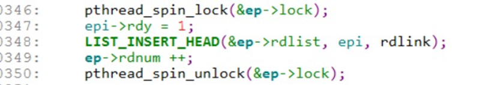
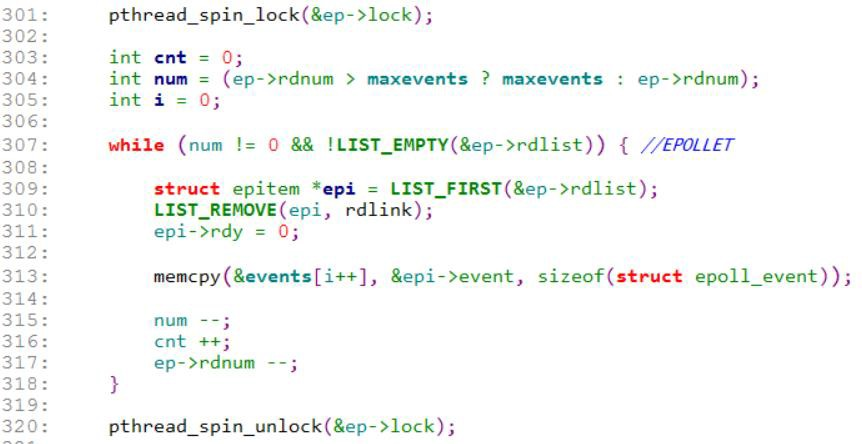
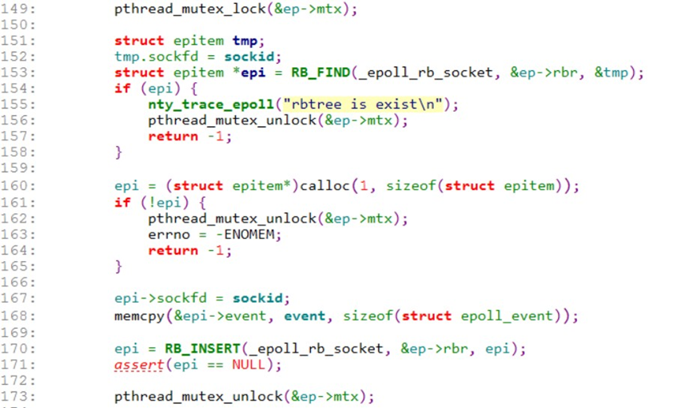
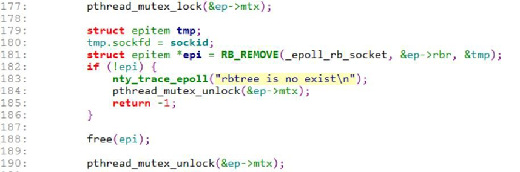

<div align=center>
	 
</div>

<center><font size='6'>Linux笔记 Epoll实现原理</font></center>
<br/>
<center><font size='5'>RToax</font></center>
<center><font size='5'>2020年10月</font></center>
<br/>

Epoll 是 Linux IO 多路复用的管理机制。作为现在 Linux 平台高性能网络 IO 必要的组件。内 核的实现可以参照：fs/eventpoll.c .
为什么需要自己实现 epoll 呢？现在自己打算做一个用户态的协议栈。采用单线程的模式。 https://github.com/wangbojing/NtyTcp，至于为什么要实现用户态协议栈？可以自行百度 C10M 的问题。
由于协议栈做到了用户态故需要自己实现高性能网络 IO 的管理。所以 epoll 就自己实现一 下。代码：https://github.com/wangbojing/NtyTcp/blob/master/src/nty_epoll_rb.c

在实现 epoll 之前，先得好好理解内核 epoll 的运行原理。内核的 epoll 可以从四方面来理解。
1.	Epoll 的数据结构，rbtree 对<fd, event>的存储，ready 队列存储就绪 io。 2.	Epoll 的线程安全，SMP 的运行，以及防止死锁。
3.    Epoll 内核回调。
4.	Epoll 的 LT（水平触发）与 ET（边沿触发） 下面从这四个方面来实现 epoll。

# 1. Epoll 数据结构

Epoll 主要由两个结构体：eventpoll 与 epitem。Epitem 是每一个 IO 所对应的的事件。比如 epoll_ctl EPOLL_CTL_ADD 操作的时候，就需要创建一个 epitem。Eventpoll 是每一个 epoll 所 对应的的。比如 epoll_create  就是创建一个 eventpoll。
Epitem 的定义

```c
/*
 * Each file descriptor added to the eventpoll interface will
 * have an entry of this type linked to the "rbr" RB tree.
 * Avoid increasing the size of this struct, there can be many thousands
 * of these on a server and we do not want this to take another cache line.
 */
struct epitem {
	union {
		/* RB tree node links this structure to the eventpoll RB tree */
		struct rb_node rbn;
		/* Used to free the struct epitem */
		struct rcu_head rcu;
	};

	/* List header used to link this structure to the eventpoll ready list */
	struct list_head rdllink;

	/*
	 * Works together "struct eventpoll"->ovflist in keeping the
	 * single linked chain of items.
	 */
	struct epitem *next;

	/* The file descriptor information this item refers to */
	struct epoll_filefd ffd;

	/* Number of active wait queue attached to poll operations */
	int nwait;

	/* List containing poll wait queues */
	struct list_head pwqlist;

	/* The "container" of this item */
	struct eventpoll *ep;

	/* List header used to link this item to the "struct file" items list */
	struct list_head fllink;

	/* wakeup_source used when EPOLLWAKEUP is set */
	struct wakeup_source __rcu *ws;

	/* The structure that describe the interested events and the source fd */
	struct epoll_event event;
};
```

Eventpoll 的定义

```c
/*
 * This structure is stored inside the "private_data" member of the file
 * structure and represents the main data structure for the eventpoll
 * interface.
 */
struct eventpoll {
	/*
	 * This mutex is used to ensure that files are not removed
	 * while epoll is using them. This is held during the event
	 * collection loop, the file cleanup path, the epoll file exit
	 * code and the ctl operations.
	 */
	struct mutex mtx;

	/* Wait queue used by sys_epoll_wait() */
	wait_queue_head_t wq;

	/* Wait queue used by file->poll() */
	wait_queue_head_t poll_wait;

	/* List of ready file descriptors */
	struct list_head rdllist;

	/* Lock which protects rdllist and ovflist */
	rwlock_t lock;

	/* RB tree root used to store monitored fd structs */
	struct rb_root_cached rbr;

	/*
	 * This is a single linked list that chains all the "struct epitem" that
	 * happened while transferring ready events to userspace w/out
	 * holding ->lock.
	 */
	struct epitem *ovflist;

	/* wakeup_source used when ep_scan_ready_list is running */
	struct wakeup_source *ws;

	/* The user that created the eventpoll descriptor */
	struct user_struct *user;

	struct file *file;

	/* used to optimize loop detection check */
	int visited;
	struct list_head visited_list_link;

#ifdef CONFIG_NET_RX_BUSY_POLL
	/* used to track busy poll napi_id */
	unsigned int napi_id;
#endif
};
```
数据结构如下图所示。


List  用来存储准备就绪的 IO。对于数据结构主要讨论两方面：insert 与 remove。同样如此， 对于 list 我们也讨论 insert 与 remove。何时将数据插入到 list 中呢？当内核 IO 准备就绪的时 候，则会执行 epoll_event_callback 的回调函数，将 epitem 添加到 list 中。
那何时删除 list 中的数据呢？当 epoll_wait 激活重新运行的时候，将 list 的 epitem 逐一 copy到 events 参数中。
Rbtree 用来存储所有 io 的数据，方便快速通 io_fd 查找。也从 insert 与 remove 来讨论。 对于 rbtree 何时添加：当 App 执行 epoll_ctl EPOLL_CTL_ADD 操作，将 epitem 添加到 rbtree 中。何时删除呢？当 App 执行 epoll_ctl EPOLL_CTL_DEL 操作，将 epitem 添加到 rbtree 中。 List 与 rbtree 的操作又如何做到线程安全，SMP，防止死锁呢？

# 2. Epoll 锁机制

Epoll  从以下几个方面是需要加锁保护的。List 的操作，rbtree 的操作，epoll_wait 的等待。
List 使用最小粒度的锁 spinlock，便于在 SMP 下添加操作的时候，能够快速操作 list。 List 添加

346 行：获取 spinlock。
347 行：epitem  的 rdy 置为 1，代表 epitem 已经在就绪队列中，后续再触发相同事件就只需 更改 event。
348 行：添加到 list 中。
349 行：将 eventpoll 的 rdnum 域 加 1。 350 行：释放 spinlock

## 2.1. List 删除


301 行：获取 spinlock
304 行：判读 rdnum 与 maxevents 的大小，避免 event 溢出。
307 行：循环遍历 list，判断添加 list 不能为空
309 行：获取 list 首个结点
310 行：移除 list 首个结点。
311 行：将 epitem 的 rdy 域置为 0，标识 epitem 不再就绪队列中。
313 行：copy epitem 的 event 到用户空间的 events。 316 行：copy 数量加 1
317 行：eventpoll 中 rdnum 减一。
避免 SMP 体系下，多核竞争。此处采用自旋锁，不适合采用睡眠锁。


## 2.2. Rbtree 的添加


149 行：获取互斥锁。
 
153 行：查找 sockid 的 epitem 是否存在。存在则不能添加，不存在则可以添加。
160 行：分配 epitem。
167	行：sockid 赋值
168	行：将设置的 event 添加到 epitem 的 event 域。
170 行：将 epitem 添加到 rbrtree 中。
173 行：释放互斥锁。

## 2.3. Rbtree 删除


177 行：获取互斥锁。
181 行：删除 sockid 的结点，如果不存在，则 rbtree 返回-1。
188 行：释放 epitem
190 行：释放互斥锁。

Epoll_wait 的挂起。
采用 pthread_cond_wait，具体实现可以[参照](https://github.com/wangbojing/NtyTcp/blob/master/src/nty_epoll_rb.c)。 

# 3. Epoll 回调

Epoll 的回调函数何时执行，此部分需要与 Tcp 的协议栈一起来阐述。Tcp 协议栈的时序图如 下图所示，epoll 从协议栈回调的部分从下图的编号 1,2,3,4。具体 Tcp 协议栈的实现，后续 从另外的文章中表述出来。下面分别对四个步骤详细描述
编号 1：是 tcp 三次握手，对端反馈 ack 后，socket 进入 rcvd 状态。需要将监听 socket 的
event 置为 EPOLLIN，此时标识可以进入到 accept 读取 socket 数据。
编号 2：在 established 状态，收到数据以后，需要将 socket 的 event 置为 EPOLLIN 状态。 编号 3：在 established 状态，收到 fin 时，此时 socket 进入到 close_wait。需要 socket 的 event 置为 EPOLLIN。读取断开信息。
编号 4：检测 socket 的 send 状态，如果对端 cwnd>0 是可以，发送的数据。故需要将 socket
置为 EPOLLOUT。
所以在此四处添加 EPOLL 的回调函数，即可使得 epoll 正常接收到 io 事件。
 
 


# 4. LT 与 ET

LT（水平触发）与 ET（边沿触发）是电子信号里面的概念。不清楚可以 man epoll 查看的。 如下图所示：


比如：event = EPOLLIN | EPOLLLT，将 event 设置为 EPOLLIN 与水平触发。只要 event 为 EPOLLIN
时就能不断调用 epoll 回调函数。
比如: event = EPOLLIN | EPOLLET，event 如果从 EPOLLOUT 变化为 EPOLLIN 的时候，就会触 发。在此情形下，变化只发生一次，故只调用一次 epoll 回调函数。关于水平触发与边沿触 发放在 epoll 回调函数执行的时候，如果为 EPOLLET（边沿触发），与之前的 event 对比，如
 
果发生改变则调用 epoll 回调函数，如果为 EPOLLL（T
即可调用 epoll 回调函数。


<br/>
<div align=right>以上内容由RTOAX翻译整理自网络。
</div>