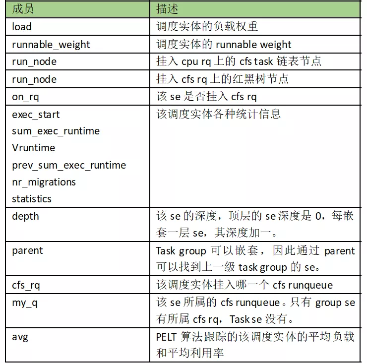
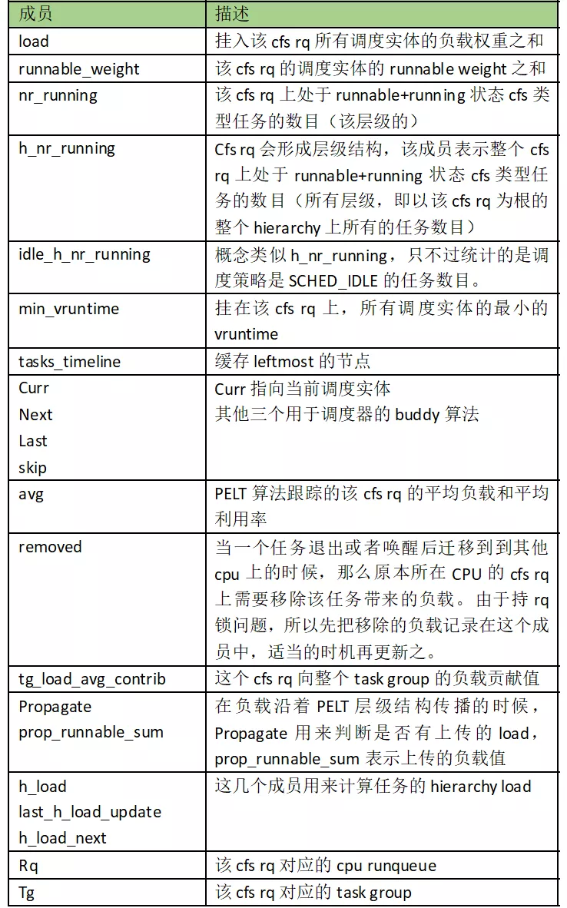
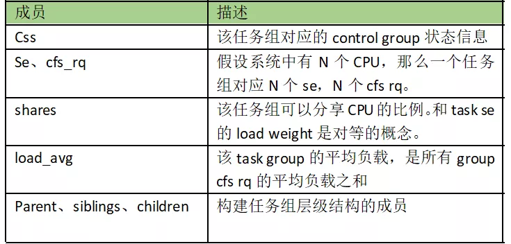
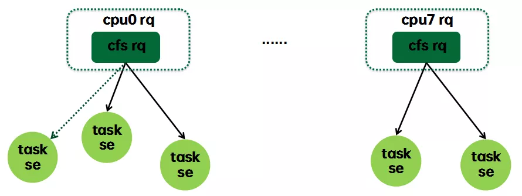
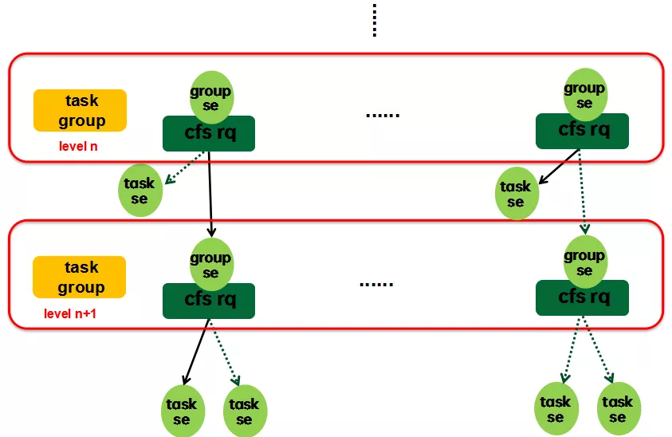
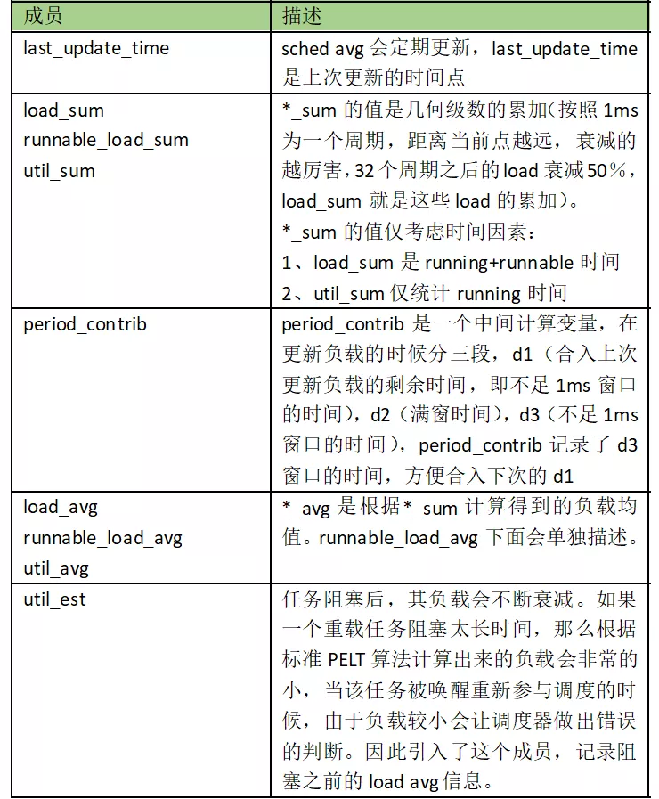
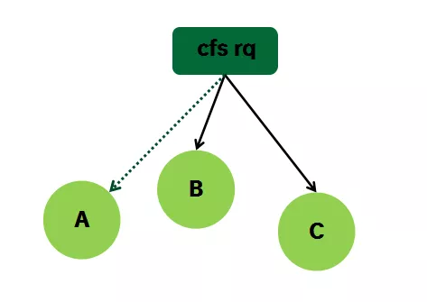
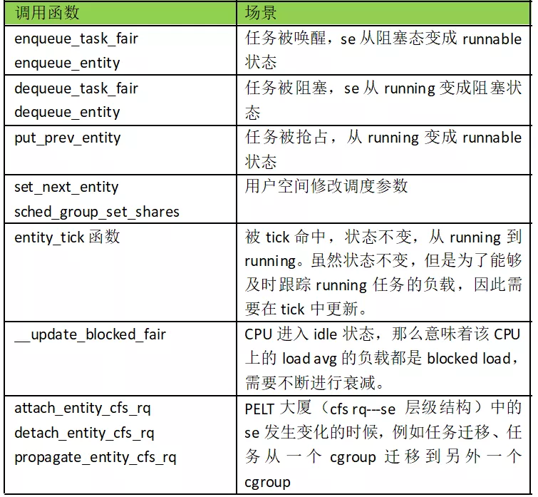
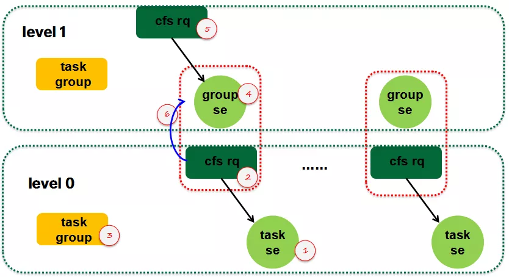

<div align=center>
	 
</div>
<br/>
<br/>

<center><font size='6'>Linux内核学习笔记 PELT（Per-entity load tracking）实体负载跟踪算法调度算法</font></center>
<br/>
<br/>
<center><font size='5'>RToax</font></center>
<center><font size='5'>2020年9月</font></center>
<br/>
<br/>
<br/>
<br/>

[Linux 调度器中的 PELT 算法浅析](https://mp.weixin.qq.com/s/pNZ9I88cjwIuErfP74RSHg)

Linux是一个通用操作系统的内核，上到网络服务器，下至嵌入式设备都能运行良好。做一款好的linux进程调度器是一项非常具有挑战性的任务，因为设计约束太多了：

* 必须是公平的
* 快速响应
* 系统的throughput要高
* 功耗要小

3.8版本之前的内核CFS调度器在计算CPU load的时候采用的是跟踪每个运行队列上的负载（per-rq load tracking）。这种粗略的负载跟踪算法显然无法为调度算法提供足够的支撑。为了完美的满足上面的所有需求，Linux调度器在3.8版中引入了`PELT（Per-entity load tracking）实体负载跟踪算法`。本文将为您分析PELT的设计概念和具体的实现。

本文出现的内核代码来自`Linux5.4.28`，如果有兴趣，读者可以配合代码阅读本文。


# 1. 为何需要per-entity load tracking？

完美的调度算法需要一个能够预知未来的水晶球：只有当内核准确地推测出每个进程对系统的需求，它才能最佳地完成调度任务。进程对CPU的需求包括两个方面：

* 任务的利用率（task utility）
* 任务的负载（task load）

跟踪任务的utility主要是为任务寻找合适算力的CPU。例如在手机平台上4个大核+4个小核的结构，一个任务本身逻辑复杂，需要有很长的执行时间，那么随着任务的运行，内核发现其utility越来越大，那么可以根据utility选择提升其所在CPU的频率，输出更大的算力，或者将其迁移到算力更强的大核CPU上执行。Task load主要用于负载均衡算法，即让系统中的每一个CPU承担和它的算力匹配的负载。

`3.8`版本之前的内核CFS调度器在负载跟踪算法上比较粗糙，采用的是**跟踪每个运行队列上的负载**（per-rq load tracking）。它并没有跟踪每一个任务的负载和利用率，只是关注整体CPU的负载。对于`per-rq`的负载跟踪方法，**调度器可以了解到每个运行队列对整个系统负载的贡献**。这样的统计信息可以帮助调度器平衡`runqueue`上的负载，但从整个系统的角度看，我们并不知道当前CPU上的负载来自哪些任务，每个任务施加多少负载，当前CPU的算力是否支撑`runqueue`上的所有任务，是否需要提频或者迁核来解决当前CPU上负载。因此，为了更好的进行负载均衡和CPU算力调整，调度器需要PELT算法来指引方向。


# 2. PELT算法的基本方法

通过上一章，我们了解到PELT算法把负载跟踪算法从`per rq`(runqueue)推进到`per-entity`的层次，从而让调度器有了做更精细控制的前提。`这里per-entity中的“entity”指的是调度实体（scheduling entity）`，其实就是一个进程或者control group中的一组进程。为了做到Per-entity的负载跟踪，时间被分成了`1024us`的序列，在每一个1024us的周期中，一个entity对系统负载的贡献可以根据该实体处于`runnable`状态（正在CPU上运行或者等待cpu调度运行）的时间进行计算。任务在1024us的周期窗口内的负载其实就是瞬时负载。如果在该周期内，runnable的时间是t，那么该任务的瞬时负载应该和（t/1024）有正比的关系。类似的概念，**任务的瞬时利用率应该通过1024us的周期窗口内的执行时间（不包括runqueue上的等待时间）比率来计算。**

当然，不同优先级的任务对系统施加的负载也不同（毕竟在**cfs调度算法**中，高优先级的任务在一个调度周期中会有更多的执行时间），因此计算任务负载也需要考虑任务优先级，这里引入一个**负载权重（load weight）**的概念。在PELT算法中，`瞬时负载Li`等于：

```
Li = load weight  x （t/1024）
```

利用率和负载不一样，它和任务优先级无关，不过为了能够和CPU算力进行运算，`任务的瞬时利用率Ui`使用下面的公式计算：

```
Ui = Max CPU capacity  x （t/1024）
```

在手机环境中，大核最高频上的算力定义为最高算力，即1024。

任务的瞬时负载和瞬时利用率都是一个快速变化的计算量，但是它们并不适合直接调整调度算法，因为调度器期望的是一段时间内保持平稳而不是疲于奔命。例如，在迁移算法中，在上一个1024us窗口中，是满窗运行，瞬时利用率是1024，立刻将任务迁移到大核，下一个窗口，任务有3/4时间在阻塞状态，利用率急速下降，调度器会将其迁移到小核上执行。从这个例子可以看出，用瞬时量来推动调度器的算法不适合，任务会不断在大核小核之间跳来跳去，迁移的开销会急剧加大。为此，我们`需要对瞬时负载进行滑动平均的计算`，得到**平均负载**。一个调度实体的平均负载可以表示为：

```
L = L0 + L1*y + L2*y2 + L3*y3 + ...
```

`Li`表示在周期pi中的瞬时负载，对于过去的负载我们在计算的时候需要乘一个衰减因子y。在目前的内核代码中，`y是确定值：y ^32等于0.5`。这样选定的y值，一个调度实体的负荷贡献经过32个窗口（1024us）后，对当前时间的的符合贡献值会衰减一半。

> 注意：这里可以理解为，瞬时量不适用于推动调度器的算法，会增大开销。应该采用平均负载。

通过上面的公式可以看出：

* （1）调度实体对系统负荷的贡献值是一个序列之和组成
* （2）最近的负荷值拥有最大的权重
* （3）过去的负荷也会被累计，但是是以递减的方式来影响负载计算。

使用这样序列的好处是计算简单，我们不需要使用数组来记录过去的负荷贡献，只要把上次的总负荷的贡献值乘以y再加上新的L0负荷值就OK了。利用率的计算也是类似的，不再赘述

# 3. 内核调度器基本知识

为了能够讲清楚PELT算法，我们本章需要科普一点基本的`CFS`的基础知识。

## 3.1. 调度实体

内核用`struct sched_entity`抽象一个调度实体结构：

```c
struct sched_entity {/* task_struct中 调度实体 */
	/* For load-balancing: */
	struct load_weight		load; /* 调度实体的负载权重 */
	unsigned long			runnable_weight;/* 调度实体的运行权重 */
	struct rb_node			run_node; //vruntime 是该红黑树节点的 key
	struct list_head		group_node; /* grp node */
	unsigned int			on_rq;

	u64				exec_start;
	u64				sum_exec_runtime;
	u64				vruntime; //对应红黑树 run_node
	u64				prev_sum_exec_runtime;

	u64				nr_migrations;

	struct sched_statistics		statistics; /* 调度统计 */

#ifdef CONFIG_FAIR_GROUP_SCHED
	int				depth;
	struct sched_entity		*parent;
	/* rq on which this entity is (to be) queued: */
	struct cfs_rq			*cfs_rq;
	/* rq "owned" by this entity/group: */
	struct cfs_rq			*my_q;
#endif

#ifdef CONFIG_SMP
	/*
	 * Per entity load average tracking.
	 *
	 * Put into separate cache line so it does not
	 * collide with read-mostly values above.
	 */
	struct sched_avg		avg;    /* 多处理器 */
#endif
};
```


所有的成员都很直观，除了runnable_weight。Task se的load weight和runnable weight是相等的，但是对于group se这两个值是不同的，具体有什么区别这个我们后文会详述。

## 3.2. Cfs任务的运行队列

内核用`struct cfs_rq`抽象一个管理调度实体的cfs任务运行队列：

```c
/* CFS-related fields in a runqueue */
struct cfs_rq {
	struct load_weight	load;
	unsigned long		runnable_weight;
	unsigned int		nr_running;
	unsigned int		h_nr_running;      /* SCHED_{NORMAL,BATCH,IDLE} */
	unsigned int		idle_h_nr_running; /* SCHED_IDLE */

	u64			exec_clock;
	u64			min_vruntime;
#ifndef CONFIG_64BIT
	u64			min_vruntime_copy;
#endif

	struct rb_root_cached	tasks_timeline;

	/*
	 * 'curr' points to currently running entity on this cfs_rq.
	 * It is set to NULL otherwise (i.e when none are currently running).
	 */
	struct sched_entity	*curr;
	struct sched_entity	*next;
	struct sched_entity	*last;
	struct sched_entity	*skip;

#ifdef	CONFIG_SCHED_DEBUG
	unsigned int		nr_spread_over;
#endif

#ifdef CONFIG_SMP
	/*
	 * CFS load tracking
	 */
	struct sched_avg	avg;
#ifndef CONFIG_64BIT
	u64			load_last_update_time_copy;
#endif
	struct {
		raw_spinlock_t	lock ____cacheline_aligned;
		int		nr;
		unsigned long	load_avg;
		unsigned long	util_avg;
		unsigned long	runnable_sum;
	} removed;

#ifdef CONFIG_FAIR_GROUP_SCHED
	unsigned long		tg_load_avg_contrib;
	long			propagate;
	long			prop_runnable_sum;

	/*
	 *   h_load = weight * f(tg)
	 *
	 * Where f(tg) is the recursive weight fraction assigned to
	 * this group.
	 */
	unsigned long		h_load;
	u64			last_h_load_update;
	struct sched_entity	*h_load_next;
#endif /* CONFIG_FAIR_GROUP_SCHED */
#endif /* CONFIG_SMP */

#ifdef CONFIG_FAIR_GROUP_SCHED
	struct rq		*rq;	/* CPU runqueue to which this cfs_rq is attached */

	/*
	 * leaf cfs_rqs are those that hold tasks (lowest schedulable entity in
	 * a hierarchy). Non-leaf lrqs hold other higher schedulable entities
	 * (like users, containers etc.)
	 *
	 * leaf_cfs_rq_list ties together list of leaf cfs_rq's in a CPU.
	 * This list is used during load balance.
	 */
	int			on_list;
	struct list_head	leaf_cfs_rq_list;
	struct task_group	*tg;	/* group that "owns" this runqueue */

#ifdef CONFIG_CFS_BANDWIDTH
	int			runtime_enabled;
	s64			runtime_remaining;

	u64			throttled_clock;
	u64			throttled_clock_task;
	u64			throttled_clock_task_time;
	int			throttled;
	int			throttle_count;
	struct list_head	throttled_list;
#endif /* CONFIG_CFS_BANDWIDTH */
#endif /* CONFIG_FAIR_GROUP_SCHED */
};
```



Cfs rq有一个成员load保存了挂入该runqueue的调度实体load weight之和。为何要汇总这个load weight值？主要有两个运算需要，一个是在计算具体调度实体需要分配的时间片的时候：

```
Se Time slice = sched period  x  se load weight / cfs rq load weight
```

此外，在计算`cfs rq`的负载的时候，我们也需要`load weight`之和，下面会详细描述。

在负载均衡的时候，我们需要根据各个`root cfs rq`上的负载进行均衡，然而各个`task se`的`load avg`并不能真实反映它对`root cfs rq`（即对该CPU）的负载贡献，因为`task se/cfs rq`总是在某个具体level上计算其`load avg`（因为task se的load weight是其level上的load weight，并不能体现到root cfs rq上）。所以，我们在各个cfs rq上引入了`hierarchy load`的概念，对于顶层cfs rq而言，其hierarchy load等于该cfs rq的load avg，随着层级的递进，cfs rq的hierarchy load定义如下：

`下一层的cfs rq的h_load = 上一层cfs rq的h_load  X  group se 在上一层cfs负载中的占比`

在计算task se的`h_load`的时候，我们就使用如下公式：

```
Task se的h_load = task se的load avg  x  cfs rq的h_load / cfs rq的load avg
```

## 3.3. 任务组（task group）

内核用`struct task_group`来抽象属于同一个control group的一组任务（需要内核支持组调度，具体细节可参考其他文章）：

```c
/* Task group related information */
struct task_group {
	struct cgroup_subsys_state css;

#ifdef CONFIG_FAIR_GROUP_SCHED
	/* schedulable entities of this group on each CPU */
	struct sched_entity	**se;
	/* runqueue "owned" by this group on each CPU */
	struct cfs_rq		**cfs_rq;
	unsigned long		shares;

#ifdef	CONFIG_SMP
	/*
	 * load_avg can be heavily contended at clock tick time, so put
	 * it in its own cacheline separated from the fields above which
	 * will also be accessed at each tick.
	 */
	atomic_long_t		load_avg ____cacheline_aligned;
#endif
#endif

#ifdef CONFIG_RT_GROUP_SCHED
	struct sched_rt_entity	**rt_se;
	struct rt_rq		**rt_rq;

	struct rt_bandwidth	rt_bandwidth;
#endif

	struct rcu_head		rcu;
	struct list_head	list;

	struct task_group	*parent;
	struct list_head	siblings;
	struct list_head	children;

#ifdef CONFIG_SCHED_AUTOGROUP
	struct autogroup	*autogroup;
#endif

	struct cfs_bandwidth	cfs_bandwidth;

#ifdef CONFIG_UCLAMP_TASK_GROUP
	/* The two decimal precision [%] value requested from user-space */
	unsigned int		uclamp_pct[UCLAMP_CNT];
	/* Clamp values requested for a task group */
	struct uclamp_se	uclamp_req[UCLAMP_CNT];
	/* Effective clamp values used for a task group */
	struct uclamp_se	uclamp[UCLAMP_CNT];
#endif

};
```



在上面的task group成员中，load_avg稍显突兀。虽然task group作为一个调度实体来竞争CPU资源，但是task group是一组task se或者group se（task group可以嵌套）的集合，不可能在一个CPU上进行调度，因此task group的调度实际上在各个CPU上都会发生，因此其load weight（即share成员）需要按照一定的算法分配给各个CPU上的group se，因此这里需要跟踪整个task group的load avg以及该task group在各个CPU上的load avg。

## 3.4. 基本组件

和调度器相关的基本组件如下：



这是当系统不支持组调度时候的形态，每个任务都内嵌一个`sched_entity`，我们称之task se，每个CPU runqueue上都内嵌调度类自己的runqueue，对于cfs调度类而言就是cfs rq。Cfs rq有一个红黑树，每个处于runnable状态的任务（se）都是按照vruntime的值挂入其所属的cfs rq。当进入阻塞状态的时候，任务会被挂入wait queue，但是从PELT的角度来看，该任务仍然挂在cfs rq上，该task se的负载（blocked load）仍然会累计到cfs rq的负载（如上图虚线所示），不过既然该task se进入阻塞状态，那么就会按照PELT算法的规则衰减，计入其上次挂入的cfs rq。

## 3.5. 构建大厦

当系统支持组调度的时候，cfs rq---se这个基本组件会形成层级结构，如下图所示：



`一组任务（task group）`作为一个整体进行调度的时候，那么它也就是一个sched entity了，也就是说task group对应一个se。这句话对UP是成立的，然而，在SMP的情况下，系统有多个CPU，任务组中的任务可能遍布到各个CPU上去，因此实际上，task group对应的是一组se，我们称之group se。由于task group中可能包含一个task group，因此task group也是形成层级关系，顶层是一个虚拟的root task group，该task group没有对应的group se（都顶层了，不需要挂入其他cfs rq），因而其对应的cfs rq内嵌在cpu runqueue中。

Group se需要管理若干个sched se（可能是task se，也可能是其下的group se），因此group se需要一个对应的cfs rq。对于一个group se，它有两个关联的cfs rq，一个是该group se所挂入的cfs rq：

```c
/**************************************************************
 * CFS operations on generic schedulable entities:
 */

#ifdef CONFIG_FAIR_GROUP_SCHED
/* runqueue on which this entity is (to be) queued */
static inline struct cfs_rq *cfs_rq_of(struct sched_entity *se)
{
	return se->cfs_rq;
}
...
#else	/* !CONFIG_FAIR_GROUP_SCHED */
...
static inline struct cfs_rq *cfs_rq_of(struct sched_entity *se)
{
	struct task_struct *p = task_of(se);
	struct rq *rq = task_rq(p);

	return &rq->cfs;
}
#endif
```

另外一个是该group se所属的cfs rq：

```c
/**************************************************************
 * CFS operations on generic schedulable entities:
 */

#ifdef CONFIG_FAIR_GROUP_SCHED
/* runqueue "owned" by this group */
static inline struct cfs_rq *group_cfs_rq(struct sched_entity *grp)
{
	return grp->my_q;
}
...
#else	/* !CONFIG_FAIR_GROUP_SCHED */
...
/* runqueue "owned" by this group */
static inline struct cfs_rq *group_cfs_rq(struct sched_entity *grp)
{
	return NULL;
}
#endif
```

# 4. 关于负载权重（load weight）和负载

## 4.1. load weight

PELT算法中定义了一个struct load_weight的数据结构来表示调度实体的负载权重：

```c
struct load_weight {
	unsigned long			weight;
	u32				inv_weight;
};
```
这个数据结构中的`weight`成员就是**负载权重值**。`inv_weight`没有实际的意义，主要是为了快速运算的。`struct load_weight`可以嵌入到se或者cfs rq中，分别表示se/cfs rq的权重负载。Cfs rq的load weight等于挂入队列所有se的load weight之和。有了这些信息，我们可以快速计算出一个se的时间片信息（这个公式非常重要，让我们再重复一次）：

```
Sched slice=sched period x se的权重/cfs rq的权重
```
> CFS调度算法的核心就是在target latency（sched period）时间内，保证CPU资源是按照se的权重来分配的。
> 映射到virtual runtime的世界中，cfs rq上的所有se是完全公平的。

## 4.2. 平均负载

内核用`struct sched_avg`来抽象一个se或者cfs rq的平均负载：
```c

/*
 * The load_avg/util_avg accumulates an infinite geometric series
 * (see __update_load_avg() in kernel/sched/fair.c).
 *
 * [load_avg definition]
 *
 *   load_avg = runnable% * scale_load_down(load)
 *
 * where runnable% is the time ratio that a sched_entity is runnable.
 * For cfs_rq, it is the aggregated load_avg of all runnable and
 * blocked sched_entities.
 *
 * [util_avg definition]
 *
 *   util_avg = running% * SCHED_CAPACITY_SCALE
 *
 * where running% is the time ratio that a sched_entity is running on
 * a CPU. For cfs_rq, it is the aggregated util_avg of all runnable
 * and blocked sched_entities.
 *
 * load_avg and util_avg don't direcly factor frequency scaling and CPU
 * capacity scaling. The scaling is done through the rq_clock_pelt that
 * is used for computing those signals (see update_rq_clock_pelt())
 *
 * N.B., the above ratios (runnable% and running%) themselves are in the
 * range of [0, 1]. To do fixed point arithmetics, we therefore scale them
 * to as large a range as necessary. This is for example reflected by
 * util_avg's SCHED_CAPACITY_SCALE.
 *
 * [Overflow issue]
 *
 * The 64-bit load_sum can have 4353082796 (=2^64/47742/88761) entities
 * with the highest load (=88761), always runnable on a single cfs_rq,
 * and should not overflow as the number already hits PID_MAX_LIMIT.
 *
 * For all other cases (including 32-bit kernels), struct load_weight's
 * weight will overflow first before we do, because:
 *
 *    Max(load_avg) <= Max(load.weight)
 *
 * Then it is the load_weight's responsibility to consider overflow
 * issues.
 */
struct sched_avg {
	u64				last_update_time;
	u64				load_sum;
	u64				runnable_load_sum;
	u32				util_sum;
	u32				period_contrib;
	unsigned long			load_avg;
	unsigned long			runnable_load_avg;
	unsigned long			util_avg;
	struct util_est			util_est;
} ____cacheline_aligned;

```



说是平均负载，但是实际上这个数据结构包括了负载和利用率信息，主要是`*_avg`成员，其他的成员是中间计算变量。

## 4.3. 如何确定se的load weight？

对于task se而言，load weight是明确的，该值是和se的nice value有对应关系，但是对于group se，load weight怎么设定？这是和task group相关的，当用户空间创建任务组的时候，在其目录下有一个share属性文件，用户空间通过该值可以配置该task group在分享CPU资源时候的权重值。根据上面的描述，我们知道一个task group对应的group se是若干个（CPU个数），那么这个share值应该是分配到各个group se中去，即task group se的load weight之和应该等于share值。平均分配肯定不合适，task group对应的各个cfs rq所挂入的具体任务情况各不相同，具体怎么分配？直觉上来说应该和其所属cfs rq挂入的调度实体权重相关，`calc_group_shares`给出了具体的计算方法，其基本的思想是：

```
 *                     tg->weight * grq->load.weight
 *   ge->load.weight = -----------------------------               (1)
 *			              \Sum grq->load.weight
```

这里的grq就是任务组的`group cfs rq`，通过求和运算可以得到该任务组所有cfs rq的权重之和。而一个group se的权重应该是按照其所属group cfs rq的权重在该任务组cfs rq权重和的占比有关。当然，由于运算量大，实际代码中做了一些变换，把load weight变成了load avg，具体就不描述了，大家可以自行阅读。

## 4.4. Se和cfs rq的平均负载

根据上文的计算公式，Task se的平均负载和利用率计算是非常直观的：有了load weight，有了明确的任务状态信息，计算几何级数即可。然而，对于group se而言，任务状态不是那么直观，它是这么定义的：只要其下层层级结构中有一个处于running状态，那么该group se就是running状态（cfs rq->curr == se）。只要其下层层级结构中有一个处于runnable状态，那么该group se就是runnable状态（se->on_rq表示该状态）。定义清楚group se状态之后，group se的load avg计算和task se是一毛一样的。

下面我们看看`cfs runqueue`的负载计算：



CFS runqueue也内嵌一个`load avg`数据结构，用来表示cfs rq的负载信息。CFS runqueue定义为其下sched entity的负载之和。这里的负载有两部分，一部分是**blocked load**，另外一部分是**runnable load**。我们用一个简单的例子来描述：Cfs rq上挂着B和C两个se，还有一个se A进入阻塞状态。当在se B的tick中更新cfs rq负载的时候，这时候需要重新计算A B C三个se的负载，然后求和就可以得到cfs rq的负载。当然，这样的算法很丑陋，当cfs rq下面有太多的sched se的时候，更新cfs rq的计算量将非常的大。内核采用的算法比较简单，首先衰减上一次cfs rq的load（A B C三个se的负载同时衰减），然后累加新的A和B的负载。因为cfs rq的load weight等于A的load weight加上B的load weight，所以cfs rq的load avg计算和sched entity的load avg计算的基本逻辑是一样的。具体可以参考`__update_load_avg_se`（更新se负载）和`__update_load_avg_cfs_rq`（更新cfs rq负载）的代码实现。

```c
int __update_load_avg_se(u64 now, struct cfs_rq *cfs_rq, struct sched_entity *se)
{
	if (___update_load_sum(now, &se->avg, !!se->on_rq, !!se->on_rq,
				cfs_rq->curr == se)) {

		___update_load_avg(&se->avg, se_weight(se), se_runnable(se));
		cfs_se_util_change(&se->avg);
		trace_pelt_se_tp(se);
		return 1;
	}

	return 0;
}

int __update_load_avg_cfs_rq(u64 now, struct cfs_rq *cfs_rq)
{
	if (___update_load_sum(now, &cfs_rq->avg,
				scale_load_down(cfs_rq->load.weight),
				scale_load_down(cfs_rq->runnable_weight),
				cfs_rq->curr != NULL)) {

		___update_load_avg(&cfs_rq->avg, 1, 1);
		trace_pelt_cfs_tp(cfs_rq);
		return 1;
	}

	return 0;
}
```

## 4.5. Runnable weight和Runnable load

`struct sched_avg`数据结构中有负载（load_sum/load_avg）和运行负载（runnable_load_sum/runnable_load_avg），这两个有什么不同呢？在回答这个问题之前，我们先思考这样的问题：一个任务进入阻塞态后，它是否还对CPU的负载施加影响？从前文的PELT算法来看，即便任务从cpu runqueue摘下，但是该任务的负载依然存在，还是按照PELT规则进行衰减，并计算入它阻塞前所在的CPU runqueue中（这种负载称为blocked load）。因此，load_sum/load_avg在计算的时候是包括了这些blocked load。负载均衡的时候，我们需要在各个CPU runqueue之间均衡负载（runnable load），如果不支持组调度，那么其实也OK，因为我们通过`se->on_rq`知道其状态，通过累计CPU上所有`se->on_rq==1`的se负载可以了解各个CPU上的runnable load并进行均衡。然而，当系统支持cgroup的时候，上述算法失效了，对于一个group se而言，只要其下有一个se是处于runnable，那么`group se->on_rq==1`。这样，在负载均衡的时候，cpu runqueue的负载重计入了太多的blocked load，从而无法有效的执行负载均衡。

为了解决这个问题，我们引入了runnable weight的概念，对于task se而言，runnable weight等于load weight，对于group se而言，runnable weight不等于load weight，而是通过下面的公式计算：

```
 *					                         grq->avg.runnable_load_avg
 *   ge->runnable_weight = ge->load.weight * --------------------------
 *						                         grq->avg.load_avg
```

通过这样的方法，在group se内嵌的load avg中，我们实际上可以得到两个负载，一个是全负载（包括blocked load），另外一个是runnable load。

```c
/*
 * This calculates the effective runnable weight for a group entity based on
 * the group entity weight calculated above.
 *
 * Because of the above approximation (2), our group entity weight is
 * an load_avg based ratio (3). This means that it includes blocked load and
 * does not represent the runnable weight.
 *
 * Approximate the group entity's runnable weight per ratio from the group
 * runqueue:
 *
 *					     grq->avg.runnable_load_avg
 *   ge->runnable_weight = ge->load.weight * -------------------------- (7)
 *						 grq->avg.load_avg
 *
 * However, analogous to above, since the avg numbers are slow, this leads to
 * transients in the from-idle case. Instead we use:
 *
 *   ge->runnable_weight = ge->load.weight *
 *
 *		max(grq->avg.runnable_load_avg, grq->runnable_weight)
 *		-----------------------------------------------------	(8)
 *		      max(grq->avg.load_avg, grq->load.weight)
 *
 * Where these max() serve both to use the 'instant' values to fix the slow
 * from-idle and avoid the /0 on to-idle, similar to (6).
 */
static long calc_group_runnable(struct cfs_rq *cfs_rq, long shares)
{
	long runnable, load_avg;

	load_avg = max(cfs_rq->avg.load_avg,
		       scale_load_down(cfs_rq->load.weight));

	runnable = max(cfs_rq->avg.runnable_load_avg,
		       scale_load_down(cfs_rq->runnable_weight));

	runnable *= shares;
	if (load_avg)
		runnable /= load_avg;

	return clamp_t(long, runnable, MIN_SHARES, shares);
}
```

# 5. 如何计算/更新load avg？

## 5.1. 概述

内核构建了负载的PELT层级结构之后，还需要日常性的维护这个PELT大厦上各个cfs rq和se节点上的load avg，以便让任务负载、CPU负载能够及时更新。`update_load_avg`函数用来更新CFS任务及其cfs rq的负载。具体的更新的时间点总是和调度事件相关，例如一个任务阻塞的时候，把之前处于running状态的时间增加的负载更新到系统中。而在任务被唤醒的时候，需要根据其睡眠时间，对其负载进行衰减。具体调用update_load_avg函数的时机包括：

```c
#ifdef CONFIG_SMP

/* Update task and its cfs_rq load average */
static inline void update_load_avg(struct cfs_rq *cfs_rq, struct sched_entity *se, int flags)
{
	u64 now = cfs_rq_clock_pelt(cfs_rq);
	int decayed;

	/*
	 * Track task load average for carrying it to new CPU after migrated, and
	 * track group sched_entity load average for task_h_load calc in migration
	 */
	if (se->avg.last_update_time && !(flags & SKIP_AGE_LOAD))
		__update_load_avg_se(now, cfs_rq, se);

	decayed  = update_cfs_rq_load_avg(now, cfs_rq);
	decayed |= propagate_entity_load_avg(se);

	if (!se->avg.last_update_time && (flags & DO_ATTACH)) {

		/*
		 * DO_ATTACH means we're here from enqueue_entity().
		 * !last_update_time means we've passed through
		 * migrate_task_rq_fair() indicating we migrated.
		 *
		 * IOW we're enqueueing a task on a new CPU.
		 */
		attach_entity_load_avg(cfs_rq, se);
		update_tg_load_avg(cfs_rq, 0);

	} else if (decayed) {
		cfs_rq_util_change(cfs_rq, 0);

		if (flags & UPDATE_TG)
			update_tg_load_avg(cfs_rq, 0);
	}
}
#else /* CONFIG_SMP */
...
static inline void update_load_avg(struct cfs_rq *cfs_rq, struct sched_entity *se, int not_used1)
{
	cfs_rq_util_change(cfs_rq, 0);
}
#endif
```



在本章的后续小节中，我们选取几个典型的场景具体分析负载更新的细节。

## 5.2. 一个新建sched entity如何初始化load avg？

Load avg的初始化分成两个阶段，第一个阶段在创建sched entity的时候（对于task se而言就是在fork的时候，对于group se而言，发生在创建cgroup的时候），调用init_entity_runnable_average函数完成初始化，第二个阶段在唤醒这个新创建se的时候，可以参考post_init_entity_util_avg函数的实现。Group se不可能被唤醒，因此第二阶段的se初始化仅仅适用于task se。

在第一阶段初始化的时候，sched_avg对象的各个成员初始化为0是常规操作，不过task se的load avg（以及runnable load avg）初始化为最大负载值，即初始化为se的load weight。随着任务的运行，其load avg会慢慢逼近其真实的负载情况。对于group se而言，其load avg等于0，表示没有任何se附着在该group se上。

一个新建任务的util avg设置为0是不合适的，其设定值应该和该task se挂入的cfs队列的负载状况以及CPU算力相关，但是在创建task se的时候，我们根本不知道它会挂入哪一个cfs rq，因此在唤醒一个新创建的任务的时候，我们会进行第二阶段的初始化。具体新建任务的util avg的初始化公式如下：

Load avg的初始化分成两个阶段，第一个阶段在创建sched entity的时候（对于task se而言就是在fork的时候，对于group se而言，发生在创建cgroup的时候），调用init_entity_runnable_average函数完成初始化，第二个阶段在唤醒这个新创建se的时候，可以参考`post_init_entity_util_avg`函数的实现。Group se不可能被唤醒，因此第二阶段的se初始化仅仅适用于task se。

```c

/*
 * With new tasks being created, their initial util_avgs are extrapolated
 * based on the cfs_rq's current util_avg:
 *
 *   util_avg = cfs_rq->util_avg / (cfs_rq->load_avg + 1) * se.load.weight
 *
 * However, in many cases, the above util_avg does not give a desired
 * value. Moreover, the sum of the util_avgs may be divergent, such
 * as when the series is a harmonic series.
 *
 * To solve this problem, we also cap the util_avg of successive tasks to
 * only 1/2 of the left utilization budget:
 *
 *   util_avg_cap = (cpu_scale - cfs_rq->avg.util_avg) / 2^n
 *
 * where n denotes the nth task and cpu_scale the CPU capacity.
 *
 * For example, for a CPU with 1024 of capacity, a simplest series from
 * the beginning would be like:
 *
 *  task  util_avg: 512, 256, 128,  64,  32,   16,    8, ...
 * cfs_rq util_avg: 512, 768, 896, 960, 992, 1008, 1016, ...
 *
 * Finally, that extrapolated util_avg is clamped to the cap (util_avg_cap)
 * if util_avg > util_avg_cap.
 */
void post_init_entity_util_avg(struct task_struct *p)
{
	struct sched_entity *se = &p->se;
	struct cfs_rq *cfs_rq = cfs_rq_of(se);
	struct sched_avg *sa = &se->avg;
	long cpu_scale = arch_scale_cpu_capacity(cpu_of(rq_of(cfs_rq)));
	long cap = (long)(cpu_scale - cfs_rq->avg.util_avg) / 2;

	if (cap > 0) {
		if (cfs_rq->avg.util_avg != 0) {
			sa->util_avg  = cfs_rq->avg.util_avg * se->load.weight;
			sa->util_avg /= (cfs_rq->avg.load_avg + 1);

			if (sa->util_avg > cap)
				sa->util_avg = cap;
		} else {
			sa->util_avg = cap;
		}
	}

	if (p->sched_class != &fair_sched_class) {
		/*
		 * For !fair tasks do:
		 *
		update_cfs_rq_load_avg(now, cfs_rq);
		attach_entity_load_avg(cfs_rq, se);
		switched_from_fair(rq, p);
		 *
		 * such that the next switched_to_fair() has the
		 * expected state.
		 */
		se->avg.last_update_time = cfs_rq_clock_pelt(cfs_rq);
		return;
	}

	attach_entity_cfs_rq(se);
}
```

在第一阶段初始化的时候，sched_avg对象的各个成员初始化为0是常规操作，不过task se的load avg（以及runnable load avg）初始化为最大负载值，即初始化为se的load weight。随着任务的运行，其load avg会慢慢逼近其真实的负载情况。对于group se而言，其load avg等于0，表示没有任何se附着在该group se上。


一个新建任务的util avg设置为0是不合适的，其设定值应该和该task se挂入的cfs队列的负载状况以及CPU算力相关，但是在创建task se的时候，我们根本不知道它会挂入哪一个cfs rq，因此在唤醒一个新创建的任务的时候，我们会进行第二阶段的初始化。具体新建任务的util avg的初始化公式如下：


```c
util_avg = cfs_rq->util_avg / (cfs_rq->load_avg + 1) * se.load.weight
util_avg_cap = (cpu_scale - cfs_rq->avg.util_avg) / 2^n
```

完成了新建task se的负载和利用率的初始化之后，我们还会调用attach_entity_cfs_rq函数把这个task se挂入cfs---se的层级结构。虽然这里仅仅是给PELT大厦增加一个task se节点，但是整个PELT hierarchy都需要感知到这个新增的se带来的负载和利用率的变化。因此，除了把该task se的load avg加到cfs的load avg中，还需要把这个新增的负载沿着cfs---se的层级结构向上传播。类似的，这个新增负载也需要加入到task group中。

## 5.3. 负载/利用率的传播

当一个新的task se加入cfs---se的层级结构（也称为PELT hierarchy）的时候，task se的负载（也包括util，后续用负载指代load和utility）会累计到各个level的group se，直到顶层的cfs rq。此外，当任务从一个CPU迁移到另外的CPU上或者任务从一个cgroup移动到另外的cgroup的时候，PELT hierarchy发生变化，都会引起负载的传播过程。我们下面用新建se加入PELT hierarchy来描述具体的负载传播细节：



```c
static void attach_entity_cfs_rq(struct sched_entity *se)
{
	struct cfs_rq *cfs_rq = cfs_rq_of(se);

#ifdef CONFIG_FAIR_GROUP_SCHED
	/*
	 * Since the real-depth could have been changed (only FAIR
	 * class maintain depth value), reset depth properly.
	 */
	se->depth = se->parent ? se->parent->depth + 1 : 0;
#endif

	/* Synchronize entity with its cfs_rq */
	update_load_avg(cfs_rq, se, sched_feat(ATTACH_AGE_LOAD) ? 0 : SKIP_AGE_LOAD);
	attach_entity_load_avg(cfs_rq, se);
	update_tg_load_avg(cfs_rq, false);
	propagate_entity_cfs_rq(se);
}
```

`attach_entity_cfs_rq`的执行过程如下：

* （1）确定task se的负载，如果需要的话可以执行更新动作。后续需要把这个新增se负载在整个PELT层级结构中向上传播。
* （2）找到该task se所挂入的cfs rq，把task se的负载更新到cfs rq。记录需要向上传播的负载（add_tg_cfs_propagate）
* （3）把task se的负载更新到其所属的task group（update_tg_load_avg）
* （4）至此底层level的负载更新完成，现在要进入上一层进行负载更新。首先要更新group se的负载
* （5）更新group se的负载，同时记录要向上传播的负载，即把level 0 cfs rq的prop_runnable_sum传递到level 1 cfs rq的prop_runnable_sum。
* （6）由于task se的加入，level 0的cfs rq的负载和level 1的group se的负载也已经有了偏差，这里需要更新。通过update_tg_cfs_util函数让group se的utility和其所属的group cfs rq保持同步。通过update_tg_cfs_runnable函数让group se的负载和其所属的group cfs rq保持同步。
* （7）更新level 1 task group的负载。然后不断重复上面的过程，直到顶层cfs rq。


## 5.4. 在tick中更新load avg

主要的代码路径在entity_tick函数中：
```c
static void
entity_tick(struct cfs_rq *cfs_rq, struct sched_entity *curr, int queued)
{
	/*
	 * Update run-time statistics of the 'current'.
	 */
	update_curr(cfs_rq);

	/*
	 * Ensure that runnable average is periodically updated.
	 */
	update_load_avg(cfs_rq, curr, UPDATE_TG);
	update_cfs_group(curr);

#ifdef CONFIG_SCHED_HRTICK
	/*
	 * queued ticks are scheduled to match the slice, so don't bother
	 * validating it and just reschedule.
	 */
	if (queued) {
		resched_curr(rq_of(cfs_rq));
		return;
	}
	/*
	 * don't let the period tick interfere with the hrtick preemption
	 */
	if (!sched_feat(DOUBLE_TICK) &&
			hrtimer_active(&rq_of(cfs_rq)->hrtick_timer))
		return;
#endif

	if (cfs_rq->nr_running > 1)
		check_preempt_tick(cfs_rq, curr);
}
```
其中的
```c
static void
entity_tick(struct cfs_rq *cfs_rq, struct sched_entity *curr, int queued)
{
	...
	/*
	 * Ensure that runnable average is periodically updated.
	 */
	update_load_avg(cfs_rq, curr, UPDATE_TG);
	update_cfs_group(curr);
    ...
}
```

在tick中更新loadavg是一个层次递进的过程，从页节点的task se开始向上，直到root cfs rq，每次都调用entity_tick来更新该层级的se以及cfs rq的load avg，这是通过函数update_load_avg完成的。更新完load avg之后，由于group cfs rq的状态发生变化，需要重新计算group se的load weight（以及runnable weight），这是通过update_cfs_group函数完成的。


`update_load_avg`的主要执行过程如下：

* （1）更新本层级sched entity的load avg（__update_load_avg_se）
* （2）更新该se挂入的cfs rq的load avg（update_cfs_rq_load_avg）
* （3）如果是group se，并且cfs---se层级结构有了调度实体的变化，那么需要处理向上传播的负载。在tick场景中，不需要这个传播过程。
* （4）更新该层级task group的负载（update_tg_load_avg）。之所以计算task group的load avg，这个值后续会参与计算group se的load weight。


update_cfs_group的主要执行过程如下：

* （1）找到该group se所属的cfs rq
* （2）调用calc_group_shares计算该group se的load weight
* （3）调用calc_group_runnable计算该group se的runnable weight
* （4）调用reweight_entity重新设定该group se的load weight和runnable weight，并根据这些新的weight值更新group se所挂入的cfs rq。

## 5.5. 在任务唤醒时更新load avg

和tick一样，任务唤醒过程中更新load avg也是一个层次递进的过程，从页节点的task se开始向上，直到root cfs rq。不过在遍历中间节点（group se）的时候要判断当前的group se是否在runqueue上，如果没有那么就调用enqueue_entity，否则不需要调用。具体代码在enqueue_task_fair函数中：

* （1）如果se->on_rq等于0，那么调用enqueue_entity进行负载更新
* （2）如果se->on_rq等于1，那么表示表示该group的子节点至少有一个runnable或者running状态的se，这时候不需要entity入队操作，直接调用update_load_avg和update_cfs_group完成负载更新（过程和tick中一致）

在enqueue_entity函数中，相关负载更新代码如下：

```c
static void
enqueue_entity(struct cfs_rq *cfs_rq, struct sched_entity *se, int flags)
{
	bool renorm = !(flags & ENQUEUE_WAKEUP) || (flags & ENQUEUE_MIGRATED);
	bool curr = cfs_rq->curr == se;

	/*
	 * If we're the current task, we must renormalise before calling
	 * update_curr().
	 */
	if (renorm && curr)
		se->vruntime += cfs_rq->min_vruntime;

	update_curr(cfs_rq);

	/*
	 * Otherwise, renormalise after, such that we're placed at the current
	 * moment in time, instead of some random moment in the past. Being
	 * placed in the past could significantly boost this task to the
	 * fairness detriment of existing tasks.
	 */
	if (renorm && !curr)
		se->vruntime += cfs_rq->min_vruntime;

	/*
	 * When enqueuing a sched_entity, we must:
	 *   - Update loads to have both entity and cfs_rq synced with now.
	 *   - Add its load to cfs_rq->runnable_avg
	 *   - For group_entity, update its weight to reflect the new share of
	 *     its group cfs_rq
	 *   - Add its new weight to cfs_rq->load.weight
	 */
	update_load_avg(cfs_rq, se, UPDATE_TG | DO_ATTACH);
	update_cfs_group(se);
	enqueue_runnable_load_avg(cfs_rq, se);
	account_entity_enqueue(cfs_rq, se);

	if (flags & ENQUEUE_WAKEUP)
		place_entity(cfs_rq, se, 0);

	check_schedstat_required();
	update_stats_enqueue(cfs_rq, se, flags);
	check_spread(cfs_rq, se);
	if (!curr)
		__enqueue_entity(cfs_rq, se);
	se->on_rq = 1;

	/*
	 * When bandwidth control is enabled, cfs might have been removed
	 * because of a parent been throttled but cfs->nr_running > 1. Try to
	 * add it unconditionnally.
	 */
	if (cfs_rq->nr_running == 1 || cfs_bandwidth_used())
		list_add_leaf_cfs_rq(cfs_rq);

	if (cfs_rq->nr_running == 1)
		check_enqueue_throttle(cfs_rq);
}

```
关注其中的：
```c
static void
enqueue_entity(struct cfs_rq *cfs_rq, struct sched_entity *se, int flags)
{
    ...
	/*
	 * When enqueuing a sched_entity, we must:
	 *   - Update loads to have both entity and cfs_rq synced with now.
	 *   - Add its load to cfs_rq->runnable_avg
	 *   - For group_entity, update its weight to reflect the new share of
	 *     its group cfs_rq
	 *   - Add its new weight to cfs_rq->load.weight
	 */
	update_load_avg(cfs_rq, se, UPDATE_TG | DO_ATTACH);
	update_cfs_group(se);
	enqueue_runnable_load_avg(cfs_rq, se);
	account_entity_enqueue(cfs_rq, se);
    ...
}

```

和tick对比，这个场景下的update_load_avg多传递了一个DO_ATTACH的flag，当一个任务被唤醒的时候发生了迁移，那么PELT层级结构发生了变化，这时候需要负载的传播过程。enqueue_runnable_load_avg函数用来更新cfs rq的runnable load weight和runnable load。account_entity_enqueue函数会更新cfs rq的load weight。

## 5.6. 任务睡眠时更新load avg

这个场景涉及的主要函数是dequeue_task_fair，是enqueue_task_fair的逆过程，这里我们主要看dequeue_entity函数中和负载相关的代码：
```c

static void
dequeue_entity(struct cfs_rq *cfs_rq, struct sched_entity *se, int flags)
{
	/*
	 * Update run-time statistics of the 'current'.
	 */
	update_curr(cfs_rq);

	/*
	 * When dequeuing a sched_entity, we must:
	 *   - Update loads to have both entity and cfs_rq synced with now.
	 *   - Subtract its load from the cfs_rq->runnable_avg.
	 *   - Subtract its previous weight from cfs_rq->load.weight.
	 *   - For group entity, update its weight to reflect the new share
	 *     of its group cfs_rq.
	 */
	update_load_avg(cfs_rq, se, UPDATE_TG);
	dequeue_runnable_load_avg(cfs_rq, se);

	update_stats_dequeue(cfs_rq, se, flags);

	clear_buddies(cfs_rq, se);

	if (se != cfs_rq->curr)
		__dequeue_entity(cfs_rq, se);
	se->on_rq = 0;
	account_entity_dequeue(cfs_rq, se);

	/*
	 * Normalize after update_curr(); which will also have moved
	 * min_vruntime if @se is the one holding it back. But before doing
	 * update_min_vruntime() again, which will discount @se's position and
	 * can move min_vruntime forward still more.
	 */
	if (!(flags & DEQUEUE_SLEEP))
		se->vruntime -= cfs_rq->min_vruntime;

	/* return excess runtime on last dequeue */
	return_cfs_rq_runtime(cfs_rq);

	update_cfs_group(se);

	/*
	 * Now advance min_vruntime if @se was the entity holding it back,
	 * except when: DEQUEUE_SAVE && !DEQUEUE_MOVE, in this case we'll be
	 * put back on, and if we advance min_vruntime, we'll be placed back
	 * further than we started -- ie. we'll be penalized.
	 */
	if ((flags & (DEQUEUE_SAVE | DEQUEUE_MOVE)) != DEQUEUE_SAVE)
		update_min_vruntime(cfs_rq);
}
```
关注其中的
```c
static void
dequeue_entity(struct cfs_rq *cfs_rq, struct sched_entity *se, int flags)
{
	/*
	 * When dequeuing a sched_entity, we must:
	 *   - Update loads to have both entity and cfs_rq synced with now.
	 *   - Subtract its load from the cfs_rq->runnable_avg.
	 *   - Subtract its previous weight from cfs_rq->load.weight.
	 *   - For group entity, update its weight to reflect the new share
	 *     of its group cfs_rq.
	 */
	update_load_avg(cfs_rq, se, UPDATE_TG);
	dequeue_runnable_load_avg(cfs_rq, se);
	account_entity_dequeue(cfs_rq, se);
	update_cfs_group(se);
}
```

* （1）更新本level的se及其挂入cfs rq的负载
* （2）将该se的runnable load weight以及runnable load avg从cfs rq中减去。这里仅仅是减去了runnable load avg，并没有把load avg从cfs rq中减去，这说明虽然任务阻塞了，但是仍然会对cfs rq的load avg有贡献，只是随着睡眠时间不断衰减。
* （3）将该se的load weight从cfs rq的load weight中减去
* （4）更新group se的load weight以及runnable weight


<br/>
<div align=right>以上内容由RTOAX翻译整理自网络。
	 
</div>