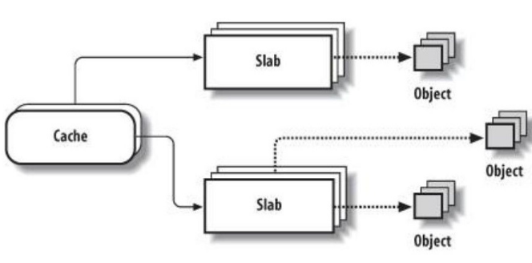

slab是一种针对小内存区的内存分配机制，是基于对象进行管理
[百度百科](https://baike.baidu.com/item/slab/5803993?fr=aladdin)

# 1. slab简介

slab是Linux操作系统的一种内存分配机制，slab分配算法采用cache 存储内核对象。slab 
缓存、从缓存中分配和释放对象然后销毁缓存的过程必须要定义一个 kmem_cache 
对象，然后对其进行初始化这个特定的缓存包含 32 字节的对象

# 2. 分配器

slab是Linux操作系统的一种内存分配机制。其工作是针对一些经常分配并释放的对象，如进程描述符等，这些对象的大小一般比较小，如果直接采用伙伴系统来进行分配和释放，不仅会造成大量的内存碎片，而且处理速度也太慢。而slab分配器是`基于对象进行管理的`，**相同类型的对象归为一类**(如进程描述符就是一类)，每当要申请这样一个对象，slab分配器就从一个slab列表中分配一个这样大小的单元出去，而当要释放时，将其重新保存在该列表中，而不是直接返回给伙伴系统，从而避免这些内碎片。**slab分配器并不丢弃已分配的对象，而是释放并把它们保存在内存中**。当以后又要请求新的对象时，就可以从内存直接获取而不用重复初始化。
对象高速缓存的组织如右下图所示，`高速缓存的内存区`**被划分为多个slab**，每个slab由一个或多个连续的页框组成，这些页框中既包含已分配的对象，也包含空闲的对象。
**`在cache和object中加入slab分配器，是在时间和空间上的折中方案。`**


# 3. 分配算法编辑
**slab分配算法采用cache 存储内核对象**。当创建cache 时，起初包括若干标记为空闲的对象。对象的数量与slab的大小有关。开始，所有对象都标记为空闲。当需要内核数据结构的对象时，可以直接从cache 上直接获取，并将对象初始化为使用。
下面考虑内核如何将slab分配给表示进程描述符的对象。在Linux系统中，进程描述符的类型是`struct task_struct `，其大小约为`1.7KB`。当Linux 内核创建新任务时，它会从cache 中获得`struct task_struct `对象所需要的内存。Cache 上会有已分配好的并标记为空闲的`struct task_struct` 对象来满足请求。

Linux 的slab 可有三种状态：

* 满的：slab 中的所有对象被标记为使用。
* 空的：slab 中的所有对象被标记为空闲。
* 部分：slab 中的对象有的被标记为使用，有的被标记为空闲。

slab 分配器首先从部分空闲的slab 进行分配。如有，则从空的slab 进行分配。如没有，则从物理连续页上分配新的slab，并把它赋给一个cache ，然后再从新slab 分配空间。

# 4. 示例用法编辑
下面的代码片断展示了**创建新 slab 缓存**、**从缓存中分配和释放对象**然后**销毁缓存**的过程。首先，必须要定义一个 kmem_cache 对象，然后对其进行初始化（请参看清单 1）。这个特定的缓存包含 32 字节的对象，并且是硬件缓存对齐的（由标志参数SLAB_HWCACHE_ALIGN 定义）。
清单 1. 创建新 slab 缓存

```c
/** avc.c	security\selinux	32960	2020/12/3	719
 * avc_init - Initialize the AVC.
 *
 * Initialize the access vector cache.
 */
void __init avc_init(void)
{
	avc_node_cachep = kmem_cache_create("avc_node", sizeof(struct avc_node),
					0, SLAB_PANIC, NULL);
	avc_xperms_cachep = kmem_cache_create("avc_xperms_node",
					sizeof(struct avc_xperms_node),
					0, SLAB_PANIC, NULL);
	avc_xperms_decision_cachep = kmem_cache_create(
					"avc_xperms_decision_node",
					sizeof(struct avc_xperms_decision_node),
					0, SLAB_PANIC, NULL);
	avc_xperms_data_cachep = kmem_cache_create("avc_xperms_data",
					sizeof(struct extended_perms_data),
					0, SLAB_PANIC, NULL);
}
```

使用所分配的 slab 缓存，您可以从中分配一个对象了。清单 2 给出了一个从缓存中分配和释放对象的例子。它还展示了两个其他函数的用法。
清单 2. `分配和释放对象`
```c
//ackvec.c	net\dccp	12650	2020/12/3	216
avr = kmem_cache_alloc(dccp_ackvec_record_slab, GFP_ATOMIC);
if (avr == NULL)
	return -ENOBUFS;
```

```c
//avc.c	security\selinux	32960	2020/12/3	719
static void avc_xperms_decision_free(struct avc_xperms_decision_node *xpd_node)
{
	struct extended_perms_decision *xpd;

	xpd = &xpd_node->xpd;
	if (xpd->allowed)
		kmem_cache_free(avc_xperms_data_cachep, xpd->allowed);
	if (xpd->auditallow)
		kmem_cache_free(avc_xperms_data_cachep, xpd->auditallow);
	if (xpd->dontaudit)
		kmem_cache_free(avc_xperms_data_cachep, xpd->dontaudit);
	kmem_cache_free(avc_xperms_decision_cachep, xpd_node);
}
```
最后，清单 3 演示了 slab 缓存的销毁。调用者必须确保在执行销毁操作过程中，不要从缓存中分配对象。
清单 3. 销毁 slab 缓存

```c
//ackvec.c	net\dccp	12650	2020/12/3	216
void dccp_ackvec_exit(void)
{
	kmem_cache_destroy(dccp_ackvec_slab);
	dccp_ackvec_slab = NULL;
	kmem_cache_destroy(dccp_ackvec_record_slab);
	dccp_ackvec_record_slab = NULL;
}
```

# 5. 优点
与传统的内存管理模式相比， slab 缓存分配器提供了很多优点。

* 1、内核通常依赖于对小对象的分配，它们会在系统生命周期内进行无数次分配。
* 2、slab 缓存分配器通过对类似大小的对象进行缓存而提供这种功能，从而避免了常见的碎片问题。
* 3、slab 分配器还支持`通用对象的初始化`，从而避免了为同一目的而对一个对象重复进行初始化。
* 4、slab 分配器还可以**`支持硬件缓存对齐和着色`**，这允许不同缓存中的对象占用相同的缓存行，从而提高缓存的利用率并获得更好的性能。

# 6. 优势
对于小型的嵌入式系统来说，存在一个 slab 模拟层，名为 **SLOB**。这个 slab 的替代品在小型嵌入式 Linux 系统中具有优势，但是即使它保存了 512KB 内存，依然存在碎片和难于扩展的问题。在禁用 CONFIG_SLAB 时，内核会回到这个 SLOB 分配器中。

