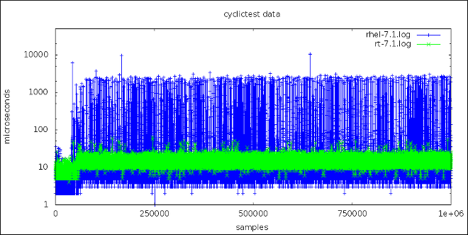
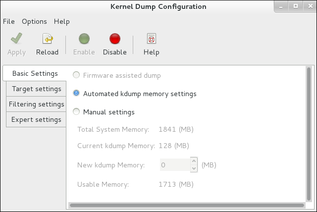
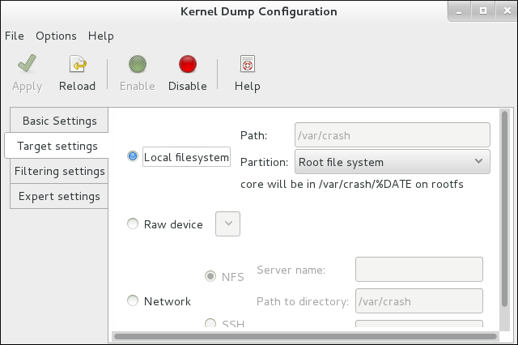
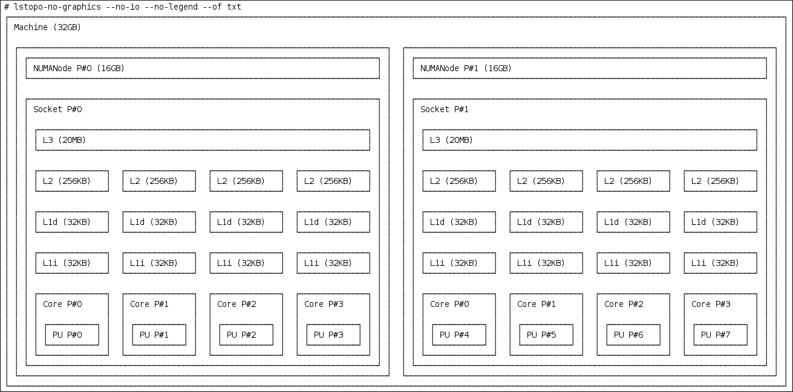

<center><font size='6'>CentOS Linux实时性配置要点</font></center>
<br/>
<br/>
<center><font size='5'>荣涛</font></center>
<center><font size='5'>2021年2月</font></center>
<br/>

# 1. 概要

## 1.1. 实时性补丁

* 补丁地址：[CentOS 7 - RealTime for x86_64: RealTime: kernel-rt-doc](https://linuxsoft.cern.ch/cern/centos/7/rt/x86_64/repoview/kernel-rt-doc.html)

* 3.10.0-693.2.2.rt56.623.el7.x86_64：[下载](https://linuxsoft.cern.ch/cern/centos/7/rt/x86_64/Packages/kernel-rt-doc-3.10.0-693.2.2.rt56.623.el7.noarch.rpm)
* 3.10.0-1127.rt56.1093.el7.x86_64：[下载](https://linuxsoft.cern.ch/cern/centos/7/rt/x86_64/Packages/kernel-rt-doc-3.10.0-1127.rt56.1093.el7.noarch.rpm)

## 1.2. 相关链接


* [Product Documentation for Red Hat Enterprise Linux for Real Time 7](https://access.redhat.com/documentation/en-us/red_hat_enterprise_linux_for_real_time/7/)


# 2. 安装指南[Installation Guide](https://access.redhat.com/documentation/en-us/red_hat_enterprise_linux_for_real_time/7/html/installation_guide/)

## 2.1. 前言

本书包含有关Red Hat Enterprise Linux for Real Time的基本安装和调整信息。
许多行业和组织需要极高性能的计算，并且可能需要低且可预测的延迟，尤其是在金融和电信行业中。延迟或响应时间定义为事件与系统响应之间的时间，通常以微秒（μs）为单位。

对于大多数在Linux环境下运行的应用程序，基本的性能调整可以充分改善延迟。对于那些不仅需要低延迟而且需要负责和可预测的行业，红帽现在已经开发了一种“嵌入式”内核替代产品来提供这种功能。红帽企业版实时Linux作为红帽企业版Linux 7的一部分分发，并提供与红帽企业Linux 7的无缝集成。红帽企业版实时Linux为客户提供了测量，配置和记录组织内延迟时间的机会。

## 2.2. 为什么使用Red Hat Enterprise LINUX实时优化延迟？?

对于任何考虑评估Red Hat Enterprise Linux for Real Time内核的性能优势的人，了解调优的重要性以及如何建立正确的性能期望至关重要。

红帽企业版实时Linux旨在用于对确定性要求极高的应用程序进行良好调整的系统上。内核系统调整提供了确定性方面的绝大部分改进。例如，在许多工作负载中，彻底的系统调整可将结果的一致性提高大约90％。这就是为什么我们通常建议客户在对Red Hat Enterprise Linux进行实时使用之前，首先对标准的Red Hat Enterprise Linux执行建议的系统调整，以查看其是否满足他们的目标。

使用实时内核时，系统调整与标准内核一样重要。 实际上，如果您只是简单地运行了一个运行标准内核的未调整系统，并用实时内核代替了Red Hat Enterprise Linux 7发行版中提供的普通内核，您就不会注意到任何好处。 标准调整将产生90％的延迟增加。 实时内核可提供最苛刻的工作负载所需的最后10％的延迟减少。

建立正确的性能期望是指实时内核不是灵丹妙药的事实。它的目标是提供可预测的响应时间的一致的低延迟确定性。实时内核还有一些其他的内核开销。这主要是由于在单独调度的线程中处理硬件中断。某些工作负载中增加的开销导致总体吞吐量有所下降。确切的数量取决于工作量，范围从0％到30％。但是，这是确定性的代价。

对于内核延迟要求在毫秒（ms）范围内的典型工作负载，标准的Red Hat Enterprise Linux 7内核就足够了。如果您的工作负载对核心内核功能（例如中断处理和微秒（μs）范围内的进程调度）具有严格的低延迟确定性要求，那么实时内核适合您。



该图比较了分别使用Red Hat Enterprise Linux 7和Red Hat Enterprise Linux for Real-Time内核的一百万台计算机的样本。此图中的蓝点表示运行经过调整的Red Hat Enterprise Linux 7内核的计算机的系统响应时间（以微秒为单位）。图中的绿色点表示运行实时内核的机器的系统响应时间。从该图中可以清楚地看出，与标准内核相比，实时内核的响应时间非常一致，而标准内核具有更大的可变性，其中点分散在整个图中。

## 2.3. 下载和安装

略。

[可用的RPM软件包](https://access.redhat.com/documentation/en-us/red_hat_enterprise_linux_for_real_time/7/html/installation_guide/available_rpm_packages)
[安装后说明](https://access.redhat.com/documentation/en-us/red_hat_enterprise_linux_for_real_time/7/html/installation_guide/post-installation_instructions)


# 3. 系统调整[Tuning Guide](https://access.redhat.com/documentation/en-us/red_hat_enterprise_linux_for_real_time/7/html/tuning_guide/)

## 3.1. 前言

本书详细介绍了有关Red Hat Enterprise Linux for Real Time的调优信息。
许多行业和组织需要极高性能的计算，并且可能需要低且可预测的延迟，尤其是在金融和电信行业中。延迟或响应时间定义为事件与系统响应之间的时间，通常以微秒（`μs`）为单位。

对于大多数在Linux环境下运行的应用程序，基本的性能调整可以充分改善延迟。对于那些不仅需要低延迟而且需要负责和可预测的行业，红帽现在已经开发了一种“嵌入式”内核替代产品来提供这种功能。红帽企业版实时Linux提供与红帽企业版Linux 7的无缝集成，并为客户提供了度量，配置和记录组织内延迟时间的机会。

在开始本书中的调优过程之前，您将需要安装Red Hat Enterprise Linux for Real Time内核。如果尚未安装Red Hat Enterprise Linux for Real Time内核，或者需要有关安装问题的帮助，请阅读[Red Hat Enterprise Linux for Real-Time安装指南](https://access.redhat.com/documentation/en-US/Red_Hat_Enterprise_Linux_for_Real_Time/7/html/Installation_Guide/index.html)。


## 3.2. 实时系统调整准备知识

Linux使用三种主要的调度策略：

### 3.2.1. SCHED_OTHER（有时称为SCHED_NORMAL）

这是默认的线程策略，具有由内核控制的动态优先级。根据线程活动更改优先级。具有此策略的线程被认为具有实时优先级0（零）。

### 3.2.2. SCHED_FIFO （先进先出）

优先级范围为1-99的实时策略，其中最低的是1，最高的是99。SCHED_FIFO线程始终具有比SCHED_OTHER线程更高的优先级（例如，SCHED_FIFO优先级为的线程1将比任何 SCHED_OTHER线程都具有更高的优先级）。创建为SCHED_FIFO线程的任何线程都具有固定的优先级，并且将一直运行，直到被更高优先级的线程阻止或抢占为止。

### 3.2.3. SCHED_RR (Round-Robin)

SCHED_RR是对的修改SCHED_FIFO。具有相同优先级的线程具有数量，并在所有相同优先级的SCHED_RR线程之间进行循环调度。很少使用此策略。

## 3.3. 运行延迟测试并解释其结果

为了验证潜在的硬件平台是否适合实时操作，您应该使用实时内核运行一些延迟和性能测试。这些测试可以突出显示在负载下可能会遇到的BIOS或系统优化（包括分区）问题。

### 3.3.1. 初步步骤
程序1.1 要成功测试系统并解释结果，请执行以下操作：

1. 查看供应商文档，了解低延迟操作所需的任何调整步骤。

此步骤旨在减少或消除将系统转换为**系统管理模式（SMM）**的任何**系统管理中断（SMI ）**。当系统处于SMM中时，它正在运行固件而不是操作系统代码，这意味着在SMM中终止的任何计时器都必须等待，直到系统转换回正常操作。这可能会导致无法解释的延迟，因为Linux无法阻止SMI，并且在供应商特定的性能计数器寄存器中可以找到我们实际采用SMI的唯一指示。

> 警告:红帽公司强烈建议您不要完全禁用SMI，因为它可能导致灾难性的硬件故障。

2. 确保rt-tests已安装RHEL-RT和软件包。
此步骤验证您是否已正确调整系统。

3. 运行hwlatdetect程序。
hwlatdetect 通过轮询时钟源并寻找无法解释的间隙来寻找硬件固件引起的延迟。
通常，hwlatdetect由于程序正在寻找由硬件体系结构或BIOS / EFI固件引入的延迟，因此您无需在运行时在系统上运行任何类型的负载。
的典型输出hwlatdetect如下所示：

```bash
$ hwlatdetect --duration=60s
hwlatdetect:  test duration 60 seconds
	detector: tracer
	parameters:
		Latency threshold: 10us
		Sample window:     1000000us
		Sample width:      500000us
		Non-sampling period:  500000us
		Output File:       None

Starting test
test finished
Max Latency: Below threshold
Samples recorded: 0
Samples exceeding threshold: 0
```

以上结果表示已对系统进行了调整，以最大程度地减少固件对系统的干扰。
但是，并非所有系统都可以调整以最大程度地减少系统中断，如下所示：
```bash
# hwlatdetect --duration=10s
hwlatdetect:  test duration 10 seconds
	detector: tracer
	parameters:
		Latency threshold: 10us
		Sample window:     1000000us
		Sample width:      500000us
		Non-sampling period:  500000us
		Output File:       None

Starting test
test finished
Max Latency: 18us
Samples recorded: 10
Samples exceeding threshold: 10
SMIs during run: 0
ts: 1519674281.220664736, inner:17, outer:15
ts: 1519674282.721666674, inner:18, outer:17
ts: 1519674283.722667966, inner:16, outer:17
ts: 1519674284.723669259, inner:17, outer:18
ts: 1519674285.724670551, inner:16, outer:17
ts: 1519674286.725671843, inner:17, outer:17
ts: 1519674287.726673136, inner:17, outer:16
ts: 1519674288.727674428, inner:16, outer:18
ts: 1519674289.728675721, inner:17, outer:17
ts: 1519674290.729677013, inner:18, outer:17
```
以上结果表明，在连续读取系统时clocksource，在15-18 us的范围内出现了10次延迟。
hwlatdetect正在使用该tracer机制作为detector无法解释的延迟。以前的版本使用内核模块而不是ftrace tracer。
parameters报告延迟以及如何运行检测。默认等待时间阈值为10微秒（10 us），采样窗口为1秒，采样窗口为0.5秒。
结果，tracer运行了一个detector线程，该线程运行了指定持续时间的每秒的一半。
该detector线程运行一个循环做以下伪代码：

```c
t1 = timestamp()
	loop:
		t0 = timestamp()
		if (t0 - t1) > threshold
		   outer = (t0 - t1)
		t1 = timestamp
		if (t1 - t0) > threshold
		   inner = (t1 - t0)
		if inner or outer:
		   print
		if t1 > duration:
		   goto out
		goto loop
	out:
```
内部循环比较检查t0 - t1不超过指定的阈值（默认值为10 us）。外循环比较检查循环的底部和顶部之间的时间t1 - t0。时间戳寄存器的连续读取之间的时间应为数十纳秒（本质上是寄存器读取，比较和条件跳转），因此连续读取之间的任何其他延迟都由固件或通过系统组件的连接方式引入。

> 注意:hwlatdetectorforinner和 输出的值outer是最佳情况下的最大延迟。延迟值是硬件系统固件组合在当前系统的连续读取clocksource（通常是Time Stamp CounterorTSC寄存器，但可能是the HPETorACPI电源管理时钟）与连续读取之间的任何延迟之间的增量。

找到合适的硬件-固件组合后，下一步是在负载下测试系统的实时性能。


### 3.3.2. 在负载下测试系统实时性能

RHEL-RT提供了rteval实用程序来测试负载下的系统实时性能。rteval启动繁重的系统SCHED_OTHER任务，然后在每个在线CPU上测量实时响应。负载是make循环中的Linux内核树和hackbench综合基准的并行。

目的是使系统进入一种状态，在这种状态下，每个核心始终都有一项工作要调度。作业执行各种任务，例如，内存分配/空闲，磁盘I / O，计算任务，内存副本等。

一旦负载启动，rteval就开始cyclictest测量程序。该程序SCHED_FIFO在每个在线内核上启动实时线程，然后测量实时调度响应时间。每个测量线程需要一个时间戳，休眠一段时间，然后在唤醒后再花费另一个时间戳。测得的等待时间是t1 - (t0 + i)实际唤醒时间t1与第一个时间戳的理论唤醒时间t0加睡眠间隔之间的差i。

rteval运行 的详细信息XML与系统的启动日志一起写入文件中。然后rteval-<date>-N.tar.bz2生成文件。N是第N个继续前进的计数器<date>。从XML文件生成的报告，类似于以下内容，将被打印到屏幕上：
```c
System:  
Statistics: 
	Samples:           1440463955
	Mean:              4.40624790712us
	Median:            0.0us
	Mode:              4us
	Range:             54us
	Min:               2us
	Max:               56us
	Mean Absolute Dev: 1.0776661507us
	Std.dev:           1.81821060672us

CPU core 0       Priority: 95
Statistics: 
	Samples:           36011847
	Mean:              5.46434910711us
	Median:            4us
	Mode:              4us
	Range:             38us
	Min:               2us
	Max:               40us
	Mean Absolute Dev: 2.13785341159us
	Std.dev:           3.50155558554us
```
上面的报告详细介绍了每个CPU和整个系统的硬件，运行时间，使用的选项以及计时结果。您可以通过运行# rteval --summarize rteval-<date>-n.tar.bz2命令来重新生成报告。


# 4. [常规系统调整](https://access.redhat.com/documentation/en-us/red_hat_enterprise_linux_for_real_time/7/html/tuning_guide/chap-general_system_tuning)

本章包含可以在标准Red Hat Enterprise Linux安装上执行的常规调整。必须首先执行这些操作，以更好地了解Red Hat Enterprise Linux for Real Time内核的好处，这一点很重要。


## 4.1. 使用Tuna 界面
在整本书中，给出了直接调整Red Hat Enterprise Linux for Real Time内核的说明。Tuna 界面是一个可以帮助您进行更改的工具。它具有图形界面，或者可以通过命令外壳运行。

Tuna 可用于更改线程（调度策略，调度程序优先级和处理器相似性）和中断（处理器相似性）的属性。该工具旨在在正在运行的系统上使用，并且更改会立即发生。这样，任何特定于应用程序的测量工具都可以在进行更改后立即查看和分析系统性能。

## 4.2. 设置永久调整参数

本书包含许多有关如何指定内核调整参数的示例。除非另有说明，否则这些说明将使参数保持有效，直到系统重新引导或显式更改它们为止。此方法对于建立初始调整配置有效。

一旦确定了适用于您系统的调优配置，就可以使它们在重新引导后保持不变。您选择的方法取决于您要设置的参数类型。

### 4.2.1. 编辑`/etc/sysctl.conf`文件

对于任何以开头的参数，将其/proc/sys/包含在/etc/sysctl.conf文件中将使该参数持久。

1. /etc/sysctl.conf在您选择的文本编辑器中 打开文件。
2. /proc/sys/从命令中 删除前缀，然后将中心/字符替换为.字符。
例如：命令echo 0 > /proc/sys/kernel/hung_task_panic将变为kernel.hung_task_panic。
3. /etc/sysctl.conf使用必需的参数 将新条目插入文件。

```c
# Enable gettimeofday(2)
kernel.hung_task_panic = 0
```
4. 运行# sysctl -p以使用新配置刷新。
```c
~]# sysctl -p
...[output truncated]...
kernel.hung_task_panic = 0
```

### 4.2.2. 编辑`/etc/rc.d/rc.local`文件

> 警告:该/etc/rc.d/rc.local机制不应用于生产启动代码。它是启动脚本的SysV Init天的保留，现在由systemd服务执行。由于无法控制顺序或依赖性，因此只能将其用于测试启动代码。

1. 编辑/etc/sysctl.conf文件”中的说明调整命令。
2. /etc/rc.d/rc.local使用必需的参数 将新条目插入文件。

## 4.3. 设置BIOS参数

因为每个系统和BIOS供应商都使用不同的术语和导航方法，所以本节仅包含有关BIOS设置的常规信息。如果找不到上述设置，请联系BIOS供应商。

### 4.3.1. 能源管理

任何试图通过更改系统时钟频率或将CPU置于各种睡眠状态以节省功率的措施，都会影响系统对外部事件的响应速度。
为了获得最佳响应时间，请在BIOS中禁用电源管理选项。

### 4.3.2. 错误检测和纠正（EDAC）单元

EDAC单元是用于检测和纠正从纠错码（ECC）存储器发出的错误的设备。通常，EDAC选项的范围从无ECC检查到定期扫描所有内存节点是否有错误。EDAC级别越高，BIOS花费的时间就越多，并且错过关键事件的截止日期的可能性也就越大。
如果可能，请关闭EDAC。否则，请切换到最低功能级别。

### 4.3.3. 系统管理中断（SMI）

SMI是硬件供应商使用的工具，可确保系统正常运行。SMI中断通常不由运行的操作系统服务，而是由BIOS中的代码服务。SMI通常用于热量管理，远程控制台管理（IPMI），EDAC检查以及其他各种内部管理任务。
如果BIOS包含SMI选项，请与供应商和任何相关文档联系以检查禁用它们的安全程度。

> 警告:尽管可以完全禁用SMI，但强烈建议您不要这样做。删除系统生成和服务SMI的功能可能会导致灾难性的硬件故障。


## 4.4. 中断与进程绑定

实时环境需要在响应各种事件时最小化或消除延迟。理想情况下，中断（IRQ）和用户进程可以在不同的专用CPU上彼此隔离。

中断通常在CPU之间平均分配。这可能会因必须写入新数据和指令高速缓存而延迟了中断处理，并且经常与CPU上发生的其他处理产生冲突。为了克服此问题，时间紧迫的中断和进程可以专用于一个CPU（或一系列CPU）。这样，处理此中断所需的代码和数据结构将有最大可能出现在处理器数据和指令高速缓存中。然后，专用进程可以尽快运行，而所有其他非时间紧迫的进程则在其余的CPU上运行。在涉及的速度在可用内存和外围总线带宽的限制范围内的情况下，这尤其重要。

实际上，最佳性能完全取决于应用程序。例如，在为执行类似功能的不同公司调整应用程序时，最佳性能调整完全不同。对于一家公司而言，将4个CPU中的2个用于操作系统功能和中断处理并仅将其余2个CPU专用于应用程序处理是最佳的。对于另一家公司而言，将与网络相关的应用程序进程绑定到正在处理网络设备驱动程序中断的CPU上可以产生最佳的确定性。最终，调整通常是通过尝试各种设置来发现最适合您组织的设置来完成的。

>重要
>
>对于此处描述的许多过程，您将需要了解给定CPU或CPU范围的CPU掩码。CPU掩码通常表示为32位位掩码。也可以将其表示为十进制或十六进制数字，具体取决于您使用的命令。例如：CPU 0的CPU掩码仅`00000000000000000000000000000001`作为位掩码，1十进制和 0x00000001十六进制。CPU 0和1的CPU掩码都`00000000000000000000000000000011`作为位掩码，3十进制和0x00000003十六进制。


### 4.4.1. 禁用irqbalance守护程序

默认情况下，此守护程序已启用，并定期强制中断以均匀，公平的方式由CPU处理。但是，在实时部署中，应用程序通常是专用的，并且绑定到特定的CPU，因此irqbalance不需要守护程序。

1. 检查irqbalance守护程序的状态。
```c
~]# systemctl status irqbalance
irqbalance.service - irqbalance daemon
   Loaded: loaded (/usr/lib/systemd/system/irqbalance.service; enabled)
   Active: active (running) …
```

2. 如果irqbalance守护程序正在运行，请停止它。
```bash
systemctl stop irqbalance
```
3. 确保irqbalance启动时不重新启动。
```bash
systemctl disable irqbalance
```

### 4.4.2. 从IRQ Balancing中排除CPU

所述`/etc/sysconfig/irqbalance`配置文件包含一个设置，允许CPU来考虑由IRQ balacing服务被排除。此参数的名称IRQBALANCE_BANNED_CPUS为64位十六进制位掩码，其中掩码的每个位代表一个CPU内核。

例如，如果您运行的是16核系统，并且要从IRQ平衡中删除CPU 8至15，请执行以下操作：

1. /etc/sysconfig/irqbalance在您喜欢的文本编辑器中 打开，然后找到标题为的文件部分IRQBALANCE_BANNED_CPUS。
```bash
# IRQBALANCE_BANNED_CPUS
# 64 bit bitmask which allows you to indicate which cpu's should
# be skipped when reblancing irqs. Cpu numbers which have their
# corresponding bits set to one in this mask will not have any
# irq's assigned to them on rebalance
#
#IRQBALANCE_BANNED_CPUS=
```

2. 通过取消注释该变量IRQBALANCE_BANNED_CPUS并以这种方式设置其值来排除CPU 8至15 ：
```bash
IRQBALANCE_BANNED_CPUS = 0000ff00
```
3. 这将导致irqbalance进程忽略在位掩码中设置了位的CPU。在这种情况下，位8到15。
4. 如果您正在运行的系统中最多包含64个CPU内核，请用逗号分隔每组八个十六进制数字：
```bash
IRQBALANCE_BANNED_CPUS = 00000001,0000ff00
```
上面的掩码从IRQ平衡中排除了CPU 8至15以及CPU 33。

> 注意
> 在Red Hat Enterprise Linux 7.2中，如果未在文件中设置，该irqbalance工具会自动避免通过`isolcpus=`内核参数隔离的CPU内核上的IRQ 。 IRQBALANCE_BANNED_CPUS/etc/sysconfig/irqbalance


### 4.4.3. 手动将CPU关联分配给各个IRQ

1. 通过查看/proc/interrupts文件，检查每个设备正在使用哪个IRQ ：

```bash
cat /proc/interrupts
```
此文件包含IRQ列表。每行显示IRQ编号，每个CPU中发生的中断数，然后是IRQ类型和说明：
```c
         CPU0       CPU1
0:   26575949         11         IO-APIC-edge  timer
1:         14          7         IO-APIC-edge  i8042
...[output truncated]...
```

2. 要指示IRQ仅在一个处理器上运行，请使用该echo命令将CPU掩码（十六进制数）写入smp_affinity特定IRQ的条目。在此示例中，我们指示IRQ号为142的中断仅在CPU 0上运行：

```c
~]# echo 1 > /proc/irq/142/smp_affinity
```
3. 仅当发生中断时，此更改才会生效。要测试设置，请生成一些磁盘活动，然后检查/proc/interrupts文件是否有更改。假定您造成了一个中断的发生，您将看到所选CPU上的中断数增加了，而其他CPU上的中断数却没有改变。

### 4.4.4. 使用taskset实用程序将进程绑定到CPU

该taskset实用程序使用任务的进程ID（PID）来查看或设置亲缘关系，或者可以用来启动具有选定CPU亲和力的命令。为了设置亲和力，taskset需要将CPU掩码表示为十进制或十六进制数字。mask参数是一个位掩码，它指定哪些CPU内核对于要修改的命令或PID合法。

1. 要设置当前未运行的进程的关联性，请使用taskset并指定CPU掩码和进程。在此示例中，my_embedded_process被指示仅使用CPU 3（使用CPU掩码的十进制版本）。

```c
~]# taskset 8 /usr/local/bin/my_embedded_process
```
2. 也可以在位掩码中指定多个CPU。在此示例中，my_embedded_process被指示在处理器4、5、6和7上执行（使用CPU掩码的十六进制版本）。
```c
~]# taskset 0xF0 /usr/local/bin/my_embedded_process
```
3. 此外，您可以通过将-p（--pid）选项与要更改的CPU掩码和PID一起使用，来设置已运行进程的CPU亲和力。在此示例中，指示PID为7013的进程仅在CPU 0上运行。
```c
~]# taskset -p 1 7013
```
4. 最后，使用-c参数，您可以指定CPU列表而不是CPU掩码。例如，为了使用CPU 0、4和CPU 7至11，命令行将包含-c 0,4,7-11。在大多数情况下，此调用更为方便。

>重要
>该taskset的实用工具适用于NUMA（非一致内存访问）系统，但它不允许用户绑定线程的CPU和最接近的NUMA内存节点。在这样的系统上，taskset不是首选工具，而应使用numactl实用程序来实现其高级功能。有关更多信息，请参见“非统一内存访问”。


### 4.4.5. 相关手册页

chrt(1)
taskset(1)
nice(1)
renice(1)
sched_setscheduler(2)


## 4.5. 文件系统确定性技巧

日记更改到达的顺序有时与实际写入磁盘的顺序不同。内核I / O系统可以选择对日志更改进行重新排序，通常是为了尝试并充分利用可用的存储空间。日记活动可以通过重新排序日记更改以及提交数据和元数据来引入延迟。通常，日记文件系统可以以降低系统速度的方式处理事情。

红帽企业版Linux 7使用的默认文件系统是称为的日志文件系统xfs。较早的称为的文件系统ext2不使用日记功能。除非您的组织特别需要日记，否则请考虑使用ext2。在许多最佳基准测试结果中，我们利用ext2文件系统并将其视为最重要的初始调整建议之一。

xfs记录 文件系统的日志，例如记录上次访问文件的时间（atime）。如果使用ext2不适合你的系统合适的解决方案，可以考虑禁用atime下xfs代替。禁用可限制atime文件系统日志的写入次数，从而提高性能并减少功耗。

### 4.5.1. 禁用atime

1. /etc/fstab使用您选择的文本编辑器 打开文件，然后找到根安装点的条目。

```bash
/dev/mapper/rhel-root       /       xfs    defaults…
```
2. 编辑选项部分以包含术语noatime和nodiratime。noatime防止在读取文件时更新访问时间戳，并nodiratime停止更新目录inode的访问时间。
```bash
/dev/mapper/rhel-root       /       xfs    noatime,nodiratime…
```

>重要
>一些应用程序依赖于atime更新。因此，此选项仅在不使用此类应用程序的系统上才是合理的。
或者，您可以使用relatime安装选项，该选项可确保仅当先前的访问时间早于当前修改时间时才更新访问时间。

### 4.5.2. 相关手册页

mkfs.ext2(8)
mkfs.xfs(8)
mount(8) - for information on atime, nodiratime and noatime


## 4.6. 使用硬件时钟进行系统时间戳

诸如NUMA或SMP之类的多处理器系统具有多个硬件时钟实例。在启动期间，内核会发现可用的时钟源并选择要使用的时钟源。有关系统中可用时钟源的列表，请查看/sys/devices/system/clocksource/clocksource0/available_clocksource文件：

```c
~]# cat /sys/devices/system/clocksource/clocksource0/available_clocksource
tsc hpet acpi_pm
```

在上面的示例中，TSC，HPET和ACPI_PM时钟源可用。
可以通过读取以下/sys/devices/system/clocksource/clocksource0/current_clocksource文件来检查当前正在使用的时钟源：

```c
~]# cat /sys/devices/system/clocksource/clocksource0/current_clocksource
tsc
```

### 4.6.1. 更改时钟源

有时由于时钟上的已知问题，未使用系统主应用程序中性能最佳的时钟。排除所有有问题的时钟后，系统将剩下无法满足实时系统最低要求的硬件时钟。

关键应用程序的要求在每个系统上都不同。因此，每种应用的最佳时钟，进而每个系统的最佳时钟也各不相同。某些应用程序取决于时钟分辨率，并且提供可靠的纳秒读数的时钟可能更合适。经常读取时钟的应用程序可以受益于时钟成本较低的时钟（读取请求和结果之间的时间）。

在所有这些情况下，都可以覆盖内核选择的时钟，前提是您了解此覆盖的副作用，并且可以创建不会触发给定硬件时钟的已知缺点的环境。为此，请从/sys/devices/system/clocksource/clocksource0/available_clocksource文件中显示的列表中选择一个时钟源，并将时钟名称写入/sys/devices/system/clocksource/clocksource0/current_clocksource文件中。例如，以下命令将HPET设置为使用中的时钟源：

```c
~]# echo hpet > /sys/devices/system/clocksource/clocksource0/current_clocksource
```

>注意
>有关广泛使用的硬件时钟的简要说明，并比较不同硬件时钟之间的性能，请参阅《[适用于Red Hat Enterprise Linux的实时Red Hat Enterprise Linux参考指南](https://access.redhat.com/documentation/en-US/Red_Hat_Enterprise_Linux_for_Real_Time/7/html/Reference_Guide/index.html)》。

### 4.6.2. 为TSC时钟配置其他启动参数

尽管没有单个时钟适合所有系统，但是TSC通常是首选的时钟源。为了优化TSC时钟的可靠性，可以在引导内核时配置其他参数，例如：

* idle=poll：强制时钟避免进入空闲状态。
* processor.max_cstate=1：防止时钟进入更深的C状态（节能模式），因此它不会变得不同步。

但是请注意，在这两种情况下，能耗都会增加，因为系统将始终以最高速度运行

### 4.6.3. 控制电源管理过渡

现代处理器积极地从较低的状态过渡到较高的省电状态（C状态）。不幸的是，从高省电状态过渡到运行状态可能会花费比实时应用最佳的时间。为了防止这些过渡，应用程序可以使用电源管理服务质量（PM QoS）接口。

使用PM QoS接口，系统可以模拟idle=poll和processor.max_cstate=1参数的行为（如“为TSC时钟配置其他启动参数”中所列），但可以更精细地控制省电状态。

当应用程序使/dev/cpu_dma_latency文件保持打开状态时，PM QoS接口可防止处理器进入深度睡眠状态，这将在退出深度睡眠状态时引起意外延迟。关闭文件后，系统将返回节能状态。

1. 打开/dev/cpu_dma_latency文件。在低延迟操作期间，请保持文件描述符处于打开状态。
2. 给它写一个32位数字。该数字表示最大响应时间（以微秒为单位）。要获得最快的响应时间，请使用0。

示例/dev/cpu_dma_latency文件如下：
```c
static int pm_qos_fd = -1;

void start_low_latency(void)
{
	s32_t target = 0;

	if (pm_qos_fd >= 0)
		return;
	pm_qos_fd = open("/dev/cpu_dma_latency", O_RDWR);
	if (pm_qos_fd < 0) {
	   fprintf(stderr, "Failed to open PM QOS file: %s",
	           strerror(errno));
	   exit(errno);
	}
	write(pm_qos_fd, &target, sizeof(target));
}

void stop_low_latency(void)
{
	if (pm_qos_fd >= 0)
	   close(pm_qos_fd);
}
```

该应用程序将首先调用start_low_latency()，执行所需的对延迟敏感的处理，然后调用stop_low_latency()。


## 4.7. 避免运行额外的应用程序

这些是提高性能的常见做法，但常常被忽略。以下是一些“额外的应用程序”：

### 4.7.1. 图形桌面
不要在并非绝对必要的地方运行图形，尤其是在服务器上。要检查系统是否默认配置为引导进入GUI，请运行以下命令：
```c
systemctl get-default
systemctl set-default multi-user.target
```

### 4.7.2. 邮件传输代理（MTA，例如Sendmail或Postfix）
除非您正在调整的系统上正在积极使用Sendmail，否则请禁用它。如果需要，请确保对其进行了很好的调整，或考虑将其移至专用计算机上。

> 重要
>Sendmail用于发送系统生成的消息，该消息由cron等程序执行。这包括由日志监视功能（如logwatch）生成的报告。如果sendmail被禁用，您将无法接收这些消息。

* 远程过程调用（RPC）
* 网络文件系统（NFS）
* 鼠标服务
如果您没有使用Gnome或KDE等图形界面，则可能也不需要鼠标。卸下硬件并卸载gpm。
* 自动化任务
检查自动化cron或at可能影响性能的工作。

切记还要检查您的第三方应用程序以及外部硬件供应商添加的所有组件。

### 4.7.3. 相关手册页
rpc(3)
nfs(5)
gpm(8)


## 4.8. 交换和内存不足提示


### 4.8.1. 内存交换
将页面交换到磁盘会在任何环境中引入延迟。为了确保低延迟，最好的策略是在系统中拥有足够的内存，因此不必进行交换。始终调整物理RAM的大小以适合您的应用程序和系统。使用vmstat监视内存的使用情况，并观看si（掉期）和so（换出）场。最好使它们尽可能保持零。

### 4.8.2. 内存不足（OOM）

内存不足（OOM）表示已分配所有可用内存（包括交换空间）的计算状态。通常，这将导致系统出现紧急情况并按预期停止运行。中有一个用于控制OOM行为的开关/proc/sys/vm/panic_on_oom。设置为1内核时，将对OOM感到恐慌。默认设置是0指示内核调用oom_killerOOM上命名的函数的默认设置。通常，它oom_killer可以杀死恶意进程，并且系统可以生存。

1. 更改此设置最简单的方法是echo将新值设置为/proc/sys/vm/panic_on_oom。

```c
~]# cat /proc/sys/vm/panic_on_oom
0

~]# echo 1 > /proc/sys/vm/panic_on_oom

~]# cat /proc/sys/vm/panic_on_oom
1
```

> 注意
>建议您进行$ RT；内核对OOM感到恐慌。当系统遇到OOM状态时，它将不再是确定性的。


2. 也可以通过调整oom_killer分数来优先确定哪些进程被杀死。在有命名的两个文件和。有效分数在-16至+15之间。该值用于使用算法来计算流程的“不良”程度，该算法还考虑了流程运行了多长时间以及其他因素。要查看当前得分，请查看该过程。将首先杀死得分最高的进程。 /proc/PID/oom_adjoom_scoreoom_adjoom_killeroom_scoreoom_killer

本示例调整oom_scorePID为12465的进程的，以使其更不可能被oom_killer杀死。

```c
~]# cat /proc/12465/oom_score
79872

~]# echo -5 > /proc/12465/oom_adj

~]# cat /proc/12465/oom_score
78
```

3. 还有一个特殊值-17，该值oom_killer对该进程禁用。在下面的示例中，oom_score返回的值O，指示该进程不会被终止。

```c
~]# cat /proc/12465/oom_score
78

~]# echo -17 > /proc/12465/oom_adj

~]# cat /proc/12465/oom_score
0
```

### 4.8.3. 相关手册页
swapon(2)
swapon(8)
vmstat(8)


## 4.9. 网络确定性技巧

### 4.9.1. 传输控制协议（TCP）

TCP可能会对延迟产生很大影响。TCP增加了延迟，以便获得效率，控制拥塞并确保可靠的传递。调整时，请考虑以下几点：

* Do you need ordered delivery?
* Do you need to guard against packet loss?
多次发送数据包可能会导致延迟。
* 如果必须使用TCP，请考虑通过TCP_NODELAY在套接字上使用来禁用Nagle缓冲算法。Nagle算法收集小的传出数据包以一次全部发送，并且可能对延迟产生不利影响。

#### 4.9.1.1. 网络调优

有许多用于调整网络的工具。以下是一些更有用的方法：

#### 4.9.1.2. 中断合并

为了减少中断数量，可以收集数据包，并为收集数据包生成单个中断。
在以吞吐量为优先事项的传输大量数据的系统中，使用默认值或增加合并可以增加吞吐量并减少命中CPU的中断数。对于需要快速网络响应的系统，建议减少或禁用合并。
在命令中 使用-C（--coalesce）选项ethtool启用。

#### 4.9.1.3. 拥塞
通常，I / O交换机可能会承受背压，这是由于缓冲区已满导致网络数据积累的结果。
在命令中 使用-A（--pause）选项ethtool可更改暂停参数并避免网络拥塞。

#### 4.9.1.4. Infiniband（IB）
Infiniband是一种通信体系结构，通常用于增加带宽并提供服务质量和故障转移。它还可以用于通过远程直接内存访问（RDMA）功能来改善延迟。

#### 4.9.1.5. 网络协议统计
在命令中 使用-s（--statistics）选项netstat以监视网络流量。
另请参见“[减少TCP性能峰值](https://access.redhat.com/documentation/en-us/red_hat_enterprise_linux_for_real_time/7/html/tuning_guide/Reduce_TCP_performance_spikes)”和“[减少TCP延迟的ACK超时](https://access.redhat.com/documentation/en-us/red_hat_enterprise_linux_for_real_time/7/html/tuning_guide/Reducing_the_TCP_delayed_ack_timeout)”。


### 4.9.2. 相关手册页
ethtool（8）
netstat（8）

## 4.10. SYSLOG调优技巧

syslog可以通过网络转发来自任意数量程序的日志消息。这种情况发生的次数越少，挂起的事务可能就越大。如果事务非常大，则会发生I / O尖峰。为避免这种情况，请保持合理的间隔。

### 4.10.1. 使用syslogd为系统日志记录

系统日志记录守护程序称为syslogd，用于从许多不同程序中收集消息。它还从内核日志记录守护程序收集内核报告的信息klogd。通常，syslogd它将登录到本地文件，但是也可以将其配置为通过网络登录到远程日志记录服务器。

1. 要启用远程日志记录，您首先需要配置将接收日志的计算机。有关详细信息，请参见https://access.redhat.com/solutions/54363。

2. 一旦在远程日志记录服务器上启用了远程日志记录支持，则必须将每个向其发送日志的系统配置为将其syslog输出发送到服务器，而不是将那些日志写入本地文件系统。为此，请/etc/rsyslog.conf在每个客户端系统上编辑文件。对于该文件中定义的各种日志记录规则，您都可以将本地日志文件替换为远程日志记录服务器的地址。
```c
# Log all kernel messages to remote logging host.
kern.*     @my.remote.logging.server
```

上面的示例将导致客户端系统将所有内核消息记录到位于的远程计算机上@my.remote.logging.server。

3. syslogd通过向/etc/rsyslog.conf文件添加通配符行， 还可以配置为记录所有本地生成的系统消息：

> 重要
> 请注意，syslogd它不包括对其生成的网络流量的内置速率限制。因此，我们建议将Red Hat Enterprise Linux for Real Time系统上的远程日志记录仅限于组织需要远程记录的那些消息。例如，内核警告，身份验证请求等。其他消息在本地记录。

### 4.10.2. 相关手册页
syslog（3）
rsyslog.conf（5）
rsyslogd（8）


## 4.11. PC卡守护程序

该pcscd守护程序用于管理与PC和SC智能卡读取器的连接。尽管pcscd通常是低优先级的任务，但它通常比其他守护程序使用更多的CPU。这种额外的背景噪声会导致实时任务的抢占成本增加，并给确定性带来其他不良影响。

### 4.11.1. 禁用pcscd守护程序

1. 检查pcscd守护程序的状态。
```c
~]# systemctl status pcscd
pcscd.service - PC/SC Smart Card Daemon
   Loaded: loaded (/usr/lib/systemd/system/pcscd.service; static)
   Active: active (running) …
```
2. 如果pcscd守护程序正在运行，请停止它。
```bash
systemctl stop pcscd
```
3. 确保pcscd启动时不重新启动。
```bash
systemctl disable pcscd
```

## 4.12. 减少TCP性能峰值


关闭时间戳，以减少与时间戳生成相关的性能峰值。该sysctl命令控制TCP相关条目的值，并设置位于的timestamps内核参数/proc/sys/net/ipv4/tcp_timestamps。

1. 使用以下命令关闭时间戳：
```c
~]# sysctl -w net.ipv4.tcp_timestamps=0
net.ipv4.tcp_timestamps = 0
```

2. 使用以下命令打开时间戳：
```c
~]# sysctl -w net.ipv4.tcp_timestamps=1
net.ipv4.tcp_timestamps = 1
```

3. 使用以下命令打印当前值：
```c
~]# sysctl net.ipv4.tcp_timestamps
net.ipv4.tcp_timestamps = 1
```
该值1指示时间戳记已打开，该值0指示时间戳记已关闭。


## 4.13. 系统分区

实时调整的关键技术之一是对系统进行分区。这意味着隔离一组CPU内核，以专用于系统上运行的一个或多个实时应用程序。为了获得最佳结果，分区应考虑CPU拓扑，以便将相关线程放置在同一非统一内存访问（NUMA）节点上包含的核心上，以最大程度地共享第二级和第三级缓存。的lscpu和tuna实用程序用于确定系统CPU拓扑。金枪鱼GUI允许您动态隔离CPU，并将线程和中断从一个CPU移到另一个，以便可以评估性能影响。

一旦根据系统布局和应用程序的结构确定了分区策略，下一步就是将系统设置为在启动时自动进行分区。为此，请使用tuned-profiles-realtime软件包提供的实用程序。当安装了Red Hat Enterprise Linux for Real Time软件包时，默认情况下会安装此软件包。要手动安装tuned-profiles-realtime，请以root用户身份运行以下命令：

```c
~]# yum install tuned-profiles-realtime
```

所述调谐的轮廓实时包提供tuned实时轮廓，允许分割和在启动时其它调音而无需额外的用户输入。两个配置文件控制配置文件的行为：

* /etc/tuned/realtime-variables.conf
* /usr/lib/tuned/realtime/tuned.conf

该realtime-variables.conf文件指定要隔离的CPU内核组。要将一组CPU核心与系统隔离，请使用isolated_cores以下示例中的选项：

```c
# Examples:
# isolated_cores=2,4-7
# isolated_cores=2-23
#
isolated_cores=1-3,5,9-14
```

在上面的示例中，该配置文件将CPU 1、2、3、5、9、10、11、12、13和14放置在隔离的CPU类别中。这些CPU上唯一的线程是专门绑定到内核的内核线程。这些内核线程仅在出现特定条件（例如迁移线程或看门狗线程）时运行。

一旦isolated_cores变量被设置，激活与所述简档tuned-adm的命令：
```c
~]# tuned-adm profile realtime
```
该配置文件使用bootloader插件。激活后，此插件将以下引导参数添加到Linux内核命令行：


* isolcpus: specifies CPUs listed in the realtime-variables.conf file，指定realtime-variables.conf文件中 列出的CPU
* nohz: turns off the timer tick on an idle CPU; set to off by default，关闭空闲CPU上的计时器计时；默认 设置为off
* nohz_full: turns off the timer tick on a CPU when there is only one runnable task on that CPU; needs nohz to be set to on，当CPU上只有一个可运行的任务时，关闭该计时器的计时；需要nohz设置为on
* intel_pstate=disable: prevents the Intel idle driver from managing power state and CPU frequency，防止Intel空闲驱动程序管理电源状态和CPU频率
* nosoftlockup: prevents the kernel from detecting soft lockups in user threads，防止内核检测用户线程中的软锁定

在上面的示例中，内核引导命令行参数如下所示：
```c
isolcpus=1-3,5,9-14 nohz=on nohz_full=1-3,5,9-14 intel_pstate=disable nosoftlockup
```

该配置文件运行script.sh在的[script]部分中指定的Shell脚本tuned.conf。该脚本调整sysfs虚拟文件系统的以下条目：

* /sys/bus/workqueue/devices/writeback/cpumask
* /sys/devices/system/machinecheck/machinecheck*/ignore_ce

workqueue上面 的条目设置为隔离CPU掩码的倒数，而第二个条目关闭计算机检查异常。
该脚本还在/etc/sysctl.conf文件中设置以下变量：

```c
kernel.hung_task_timeout_secs = 600
kernel.nmi_watchdog = 0
kernel.sched_rt_runtime_us = 1000000
vm.stat_interval = 10
```

该脚本使用该tuna接口将隔离CPU编号上的所有非绑定线程移出隔离CPU。
为了进一步调整，请复制默认值/usr/lib/tuned/realtime/script.sh并进行修改，然后更改`tuned.conf`JSON文件以指向修改后的脚本。

## 4.14. 减少CPU性能峰值

内核命令行参数skew_tick有助于在运行时延敏感应用程序的中型到大型系统上消除抖动。在实时Linux系统上，延迟尖峰的一个常见来源是当多个CPU在Linux内核计时器刻度处理程序中争用公共锁时。负责争用的常见锁xtime_lock是计时系统使用的，以及RCU（读-复制-更新）结构锁。

使用`skew_tick=1`boot参数可以减少对这些内核锁的争用。该参数通过使开始时间“偏斜”来确保每个CPU的滴答声不会同时发生。将每个CPU计时器滴答声的开始时间倾斜可以减少发生锁冲突的可能性，从而减少中断响应时间的系统抖动。


# 5. 实时特定的调整

>重要
> 在未完成**常规系统调整**之前，请勿尝试使用本节中的工具。您不会看到性能上的改进

## 5.1. 设置调度程序优先级
红帽企业版Linux实时内核允许对调度程序优先级进行细粒度控制。它还允许以比内核线程更高的优先级来调度应用程序级程序。

> 警告
> 设置调度程序优先级会带来后果。如果阻止关键的内核进程按需运行，则可能导致系统无响应和其他不可预测的行为。最终，正确的设置取决于工作量。

优先级是按组定义的，其中某些组专用于某些内核功能：

|  优先级  |     线程数      |                                           描述                                            |
| ------- | -------------- | ---------------------------------------------------------------------------------------- |
| 1       | 低优先级内核线程 | 优先级1通常保留给那些刚好在上面的任务SCHED_OTHER。                                            |
| 2 - 49  | 可使用          | 用于典型应用优先级的范围                                                                    |
| 50      | 默认硬IRQ值     |                                                                                          |
| 51 - 98 | 高优先级线程     | 将此范围用于定期执行且必须具有快速响应时间的线程。千万不能使用这个范围CPU绑定的主题，你会饿死中断。 |
| 99      | 看门狗和迁移    | 必须以最高优先级运行的系统线程                                                               |

### 5.1.1. 利用systemd设置优先级

优先级使用一系列级别设置，范围从0（最低优先级）到99（最高优先级）。在systemd服务管理器可用于更改线程的内核启动后的默认优先级。

要查看正在运行的线程的调度优先级，请使用tuna实用程序：

```c
~]# tuna --show_threads
                      thread       ctxt_switches
    pid SCHED_ rtpri affinity voluntary nonvoluntary             cmd
  2      OTHER     0    0xfff       451            3        kthreadd  
  3       FIFO     1        0     46395            2     ksoftirqd/0  
  5      OTHER     0        0        11            1    kworker/0:0H  
  7       FIFO    99        0         9            1   posixcputmr/0 
...[output truncated]...
```

### 5.1.2. 在引导过程中更改服务的优先级

systemd 可以为引导过程中启动的服务设置实时优先级。
该单元配置指令用于在引导过程中改变的服务的优先级。通过使用服务部分中的以下指令来完成引导过程优先级的更改：

1. CPUSchedulingPolicy=
为执行的进程设置CPU调度策略。采用Linux上可用的调度类之一：

* other 其他
* batch 批量
* idle 空闲
* fifo
* rr

2. CPUSchedulingPriority =
设置已执行进程的CPU调度优先级。可用优先级范围取决于所选的CPU调度策略。对于实时调度策略，可以使用1（最低优先级）和99（最高优先级）之间的整数。

### 5.1.3. 更改mcelog服务的优先级

> mcelog 是Linux 系统上用来检查硬件错误，特别是内存和CPU错误的工具。
> 比如服务器隔一段时间莫名的重启一次，而message和syslog又检测不到有价值的信息。
> 通常发生MCE报错的原因有如下：
> 1、内存报错或者ECC问题
> 2、处理器过热
> 3、系统总线错误
> 4、CPU或者硬件缓存错误

以下示例使用该mcelog服务。要更改mcelog服务的优先级：

1. 创建补充mcelog服务配置目录文件，/etc/systemd/system/mcelog.system.d/priority.conf如下所示：

```c
# cat <<-EOF > /etc/systemd/system/mcelog.system.d/priority.conf
```

2. 插入以下内容：
```c
[SERVICE]
CPUSchedulingPolicy=fifo
CPUSchedulingPriority=20
EOF
```

3. 重新加载systemd脚本配置：
```c
# systemctl daemon-reload
```

4. 重新启动mcelog服务：
```c
# systemctl restart mcelog
```

5. 显示mcelog通过systemd发出以下命令设置的优先级：
```c
$ tuna -t mcelog -P
```

现在，此命令的输出应类似于以下内容：
```c
                    thread       ctxt_switches
  pid SCHED_ rtpri affinity voluntary nonvoluntary             cmd
826     FIFO    20  0,1,2,3        13            0          mcelog
```
有关更改systemd 单元配置指令的更多信息，请参阅《系统管理员指南》中的“[修改现有单元文件](https://access.redhat.com/documentation/en-us/red_hat_enterprise_linux/7/html/system_administrators_guide/sect-Managing_Services_with_systemd-Unit_Files#sect-Managing_Services_with_systemd-Unit_File_Modify)”一章。


### 5.1.4. 配置服务的CPU使用率

systemd 使得可以指定允许运行哪些CPU服务。
为此，systemd使用CPUAffinity = unit配置指令。

#### 5.1.4.1. 配置mcelog服务的CPU使用率

以下示例将mcelog服务限制为在CPU 0和1上运行：

1. 创建补充mcelog服务配置目录文件，/etc/systemd/system/mcelog.system.d/affinity.conf如下所示：
```c
# cat <<-EOF > /etc/systemd/system/mcelog.system.d/affinity.conf
```

2. 插入以下内容：
```c
[SERVICE]
CPUAffinity=0,1
EOF
```

3. 重新加载systemd脚本配置：
```c
# systemctl daemon-reload
```
4. 重新启动mcelog服务：
```c
# systemctl restart mcelog
```
5. 显示mcelog服务限于哪些CPU ：
```c
$ tuna -t mcelog -P
```
现在，此命令的输出应类似于以下内容：
```c
                    thread       ctxt_switches
  pid SCHED_ rtpri affinity voluntary nonvoluntary             cmd
12954   FIFO    20      0,1         2            1          mcelog
```
有关更改systemd 单元配置指令的更多信息，请参阅《系统管理员指南》中的“[修改现有单元文件](https://access.redhat.com/documentation/en-us/red_hat_enterprise_linux/7/html/system_administrators_guide/sect-Managing_Services_with_systemd-Unit_Files#sect-Managing_Services_with_systemd-Unit_File_Modify)”一章。

## 5.2. 将KDUMP和KEXEC与RED HAT ENTERPRISE LINUX一起用于实时内核

kdump是一种可靠的内核崩溃转储机制，因为崩溃转储是从新引导的内核的上下文而不是崩溃的内核的上下文中捕获的。每当系统崩溃时， kdump使用一种称为kexec启动到第二个内核的机制。第二个内核（通常称为崩溃内核）以很少的内存启动并捕获转储映像。

如果在系统上启用了kdump，则标准引导内核将保留一小部分系统RAM，并将kdump内核加载到保留的空间中。当发生内核紧急错误或其他致命错误时，kexec可用于引导到kdump内核，而无需通过BIOS。系统重新引导到kdump内核，该内核限于标准引导内核保留的内存空间，并且该内核将系统内存的副本或映像写入配置文件中定义的存储机制。因为kexec不通过BIOS，保留了原始引导的内存，并且故障转储更加详细。完成此操作后，内核将重新启动，这将重置计算机并恢复启动内核。

在Red Hat Enterprise Linux 7下 启用kdump需要执行三个步骤。首先，确保在系统上安装了必需的RPM软件包。其次，创建最小配置并使用该工具修改GRUB命令行rt-setup-kdump。第三，使用称为的图形系统配置工具system-config-kdump来创建并启用详细的kdump配置。

1. 安装必需的kdump软件包

该rt-setup-kdump工具是rt-setup软件包的一部分。您还需要kexec-tools和system-config-kdump：
```c
~]# yum install rt-setup kexec-tools system-config-kdump
```

2. 使用创建基本的kdump内核 rt-setup-kdump

* 以以下方式运行该rt-setup-kdump工具root：
```c
~]# rt-setup-kdump --grub
```
该--grub参数将必要的更改添加到GRUB配置中列出的所有实时内核条目中。

* 重新启动系统以设置保留的内存空间。然后，您可以打开kdump初始化脚本并启动kdump服务：
```c
~]# systemctl enable kdump
~]# systemctl start kdump
```

3. 启用内核转储与system-config-kdump

* 从“应用程序” →“系统工具”菜单中 选择“内核崩溃转储”系统工具，或在shell提示符下使用以下命令：
```c
~]# system-config-kdump
```

* 显示 “内核转储配置”窗口。在工具栏上，单击标记为启用。红帽企业版Linux实时内核支持该crashkernel=auto参数，该参数自动计算容纳kdump内核所需的内存量。

根据设计，在内存少于4GB的Red Hat Enterprise Linux 7系统上，crashkernel=auto不会为kdump内核保留任何内存。在这种情况下，必须手动设置所需的内存量。您可以通过在“基本设置”选项卡上的“新建kdump内存”字段中输入所需的值来实现：



> 注意
为kdump内核分配内存的另一种方法是通过在GRUB配置中手动设置参数。 crashkernel=<value>

* 单击“目标设置”选项卡，然后指定转储文件的目标位置。它既可以作为文件存储在本地文件系统中，也可以直接写入设备，也可以使用NFS（网络文件系统）或SSH（安全外壳）协议通过网络发送。


要保存设置，请点击 应用 工具栏上的按钮。

* 重新引导系统，以确保正确启动了kdump。如果要检查kdump是否正常运行，可以使用sysrq以下命令模拟恐慌：

```c
~]# echo c > /proc/sysrq-trigger
```
这将导致内核崩溃，系统将启动到kdump内核。备份系统后，可以在指定位置检查日志文件。

>注意
在配置kdump内核期间，需要重置某些硬件。如果您在使kdump内核正常工作时遇到任何问题，请编辑/etc/sysconfig/kdump文件并将其添加reset_devices=1到KDUMP_COMMANDLINE_APPEND变量中。

> 重要
在IBM LS21计算机上，尝试引导kdump内核时可能会出现以下警告消息：
```c
irq 9: nobody cared (try booting with the "irqpoll" option) handlers:
[<ffffffff811660a0>] (acpi_irq+0x0/0x1b)
turning off IO-APIC fast mode.
```
>某些系统将从此错误中恢复并继续引导，而某些系统在显示该消息后将冻结。这是一个已知的问题。如果看到此错误，请将该行acpi=noirq作为启动参数添加到kdump内核。仅在发生此错误时添加此行，因为它可能会在不受此问题影响的计算机上导致启动问题。

### 5.2.1. 相关手册页
kexec（8）
/etc/kdump.conf

## 5.3. CPU上的TSC计时器同步

当前一代的AMD64 Opteron处理器可能会出现较大的gettimeofday偏差。当同时cpufreq使用时间戳计数器（TSC）时，会发生这种偏斜。红帽企业版实时Linux提供了一种通过强制所有处理器同时更改为相同频率来防止这种偏差的方法。结果，单个处理器上的TSC永远不会以与另一个处理器上的TSC不同的速率递增。

### 5.3.1. 启用TSC计时器同步

1. /etc/default/grub在首选的文本编辑器中 打开文件，然后将参数附加clocksource=tsc powernow-k8.tscsync=1到GRUB_CMDLINE_LINUX变量中。这迫使使用TSC，并允许同时进行核心处理器频率转换。
```c
GRUB_CMDLINE_LINUX="rd.md=0 rd.lvm=0 rd.dm=0 $([ -x /usr/sbin/rhcrashkernel-param ] && /usr/sbin/rhcrashkernel-param || :) rd.luks=0 vconsole.keymap=us rhgb quiet clocksource=tsc powernow-k8.tscsync=1"
```

2. 您将需要重新启动系统以使更改生效。

### 5.3.2. 相关手册页
gettimeofday（2）

## 5.4. 无限带宽

Infiniband是一种通信体系结构，通常用于增加带宽并提供服务质量和故障转移。它还可以用于通过远程直接内存访问（RDMA）功能来改善延迟。

在Red Hat Enterprise Linux for Real Time下对Infiniband的支持与在Red Hat Enterprise Linux 7下提供的支持没有区别。

> 注意
有关更多信息，请参阅Douglas Ledford在[Infiniband入门](http://people.redhat.com/dledford/infiniband_get_started.html)上的文章。

## 5.5. ROCEE和高性能网络

RoCEE（基于聚合增强型以太网的RDMA）是一种协议，可在10千兆位以太网上实现远程直接内存访问（RDMA）。它使您可以在数据中心中维护一致的高速环境，同时为关键事务提供确定的，低延迟的数据传输。

高性能网络（HPN）是一组共享库，它们向内核提供RoCEE接口。HPN无需通过独立的网络基础架构，而是使用标准的10 Gb以太网基础架构将数据直接放入远程系统内存中，从而减少了CPU开销并降低了基础架构成本。

在Red Hat Enterprise Linux for Real Time下对RoCEE和HPN的支持与在Red Hat Enterprise Linux 7下提供的支持没有区别。

>注意
有关如何设置以太网的更多信息，请参见《[网络指南](https://access.redhat.com/documentation/en-US/Red_Hat_Enterprise_Linux/7/html/Networking_Guide/)》。

## 5.6. 非统一内存访问

非统一内存访问（NUMA）是一种用于将内存资源分配给特定CPU的设计。这样可以缩短访问时间，并减少内存锁定。尽管这似乎对减少延迟很有用，但众所周知NUMA系统与实时应用程序的交互很差，因为它们会导致意外的事件延迟。

如“[使用该taskset实用程序将进程绑定到CPU](https://access.redhat.com/documentation/en-us/red_hat_enterprise_linux_for_real_time/7/html/tuning_guide/Interrupt_and_process_binding#orde-Tuning_Guide-Interrupt_and_Process_Binding-Binding_Processes_to_CPUs_using_the_taskset_utility) ”中所述，该taskset实用程序仅在CPU亲和性上起作用，并且不了解其他NUMA资源，例如内存节点。如果要与NUMA一起执行进程绑定，请使用numactl命令而不是tasket。

有关NUMA API的更多信息，请参见Andi Kleen的白皮书《[用于Linux的NUMA API](http://www.halobates.de/numaapi3.pdf)》。


## 5.7. 减少TCP延迟的ACK超时

在Red Hat Enterprise Linux上，TCP使用两种模式来确认数据接收：

### 5.7.1. 快速确认

* 在TCP连接开始时使用此模式，以便拥塞窗口可以快速增长。
* 确认（ACK）超时间隔（ATO）设置为tcp_ato_min最小超时值。
* 要更改默认的TCP ACK超时值，请将所需的值（以毫秒为单位）写入/proc/sys/net/ipv4/tcp_ato_min文件：

```c
~]# echo 4 > /proc/sys/net/ipv4/tcp_ato_min
```

### 5.7.2. 延迟确认

* 建立连接后，TCP将采用此模式，其中可以在单个数据包中发送多个接收到的数据包的ACK。
* ATO设置为tcp_delack_min重新启动或重置计时器。
* 要更改默认的“ TCP延迟的ACK”值，请将所需的值（以毫秒为单位）写入/proc/sys/net/ipv4/tcp_delack_min文件：

```c
~]# echo 4 > /proc/sys/net/ipv4/tcp_delack_min
```

TCP根据当前拥塞在两种模式之间切换。
由于TCP快速和延迟的确认超时（默认情况下以前为40毫秒），某些发送小型网络数据包的应用程序可能会遇到延迟。这意味着来自很少通过网络发送信息的应用程序的小数据包可能会经历长达40毫秒的延迟，才能接收到另一端已收到数据包的确认。为了最小化此问题，默认情况下，tcp_ato_min和tcp_delack_min超时现在均为4毫秒。
这些默认值是可调的，可以根据用户环境的需要进行调整，如上所述。

>注意
使用太低或太高的超时值可能会对网络吞吐量和应用程序经历的延迟产生负面影响。不同的环境可能需要这些超时的不同设置。

## 5.8. 使用DEBUGFS

该debugfs文件系统是专门用于调试和提供给用户的信息而设计的。它必须被挂载以与ftrace和一起使用trace-cmd，并且被自动挂载在Red Hat Enterprise Linux 7/sys/kernel/debug/目录下。
您可以debugfs通过运行以下命令来验证已安装：

```c
~]# mount | grep ^debugfs
```

## 5.9. 使用FTRACE实用程序跟踪延迟

红帽企业版Linux实时内核提供的诊断工具之一是ftrace，开发人员可以使用它来分析和调试在用户空间之外发生的延迟和性能问题。该ftrace实用程序具有多种选项，可让您以多种不同方式使用该实用程序。它可用于跟踪上下文切换，测量高优先级任务唤醒所花费的时间，禁用中断的时间长度或列出在给定时间段内执行的所有内核功能。
某些跟踪程序（例如功能跟踪程序）将产生大量数据，这可能会将跟踪日志分析变成一项耗时的任务。但是，仅当应用程序到达关键代码路径时，才可能指示跟踪程序开始和结束。
ftrace一旦trace安装并使用了Red Hat Enterprise Linux实时内核的变体，就可以设置 该实用程序。

### 5.9.1. 使用ftrace实用程序

1. 在/sys/kernel/debug/tracing/目录中，有一个名为的文件available_tracers。此文件包含的所有可用跟踪器ftrace。要查看可用跟踪器的列表，请使用以下cat命令来查看文件的内容：
```c
~]# cat /sys/kernel/debug/tracing/available_tracers
function_graph wakeup_rt wakeup preemptirqsoff preemptoff irqsoff function nop
```
的用户界面ftrace是中的一系列文件debugfs。这些ftrace文件也位于/sys/kernel/debug/tracing/目录中。输入：
```c
~]# cd /sys/kernel/debug/tracing
```
该目录中的文件只能由root用户修改，因为启用跟踪可能会影响系统性能。


### 5.9.2. Ftrace文件
该目录中的主要文件是：

* trace
显示ftrace跟踪输出的文件。这实际上是时间跟踪的快照，因为它在读取此文件时停止跟踪，并且不消耗读取的事件。也就是说，如果用户禁用了跟踪并读取了此文件，则每次读取文件时，它将始终报告相同的内容。

* trace_pipe
类似于“跟踪”，但用于实时读取跟踪。它是生产者/使用者跟踪，其中每次读取都会消耗所读取的事件。但这可用于查看活动跟踪，而无需在读取时停止跟踪。

* available_tracers
已编译到内核中的ftrace跟踪器列表。

* current_tracer
启用或禁用ftrace跟踪器。

* events
一个目录，其中包含要跟踪的事件，可用于启用或禁用事件以及为事件设置过滤器。

* tracing_on

禁用并启用向ftrace缓冲区的记录。通过tracing_on文件禁用跟踪不会禁用内核内部发生的实际跟踪。它仅禁用写入缓冲区。进行跟踪的工作仍在进行，但数据不会随处可见。

### 5.9.3. Tracers

取决于内核的配置方式，并非所有跟踪程序都可用于给定内核。对于用于实时操作系统的Red Hat Enterprise Linux内核，跟踪和调试内核具有与生产内核不同的跟踪器。这是因为将跟踪器配置到内核中但未激活时，某些跟踪器会有明显的开销。这些跟踪器仅针对跟踪和调试内核启用。

* function
最广泛应用的追踪器之一。跟踪内核中的函数调用。根据所跟踪功能的数量，可能会导致明显的开销。不活动时几乎不会产生任何开销。

* function_graph
所述function_graph示踪剂被设计为存在导致更视觉吸引力的格式。该跟踪器还跟踪函数的退出，在内核中显示函数调用的流程。
请注意，function启用时，此跟踪器的开销比跟踪器大，但是禁用时，跟踪器的开销低。

* wakeup
完整的CPU跟踪器，报告所有CPU上发生的活动。记录唤醒系统中最高优先级任务所需的时间，无论该任务是否是实时任务。记录唤醒非实时任务所需的最长时间，将隐藏唤醒实时任务所需的时间。

* wakeup_rt
完整的CPU跟踪器，报告所有CPU上发生的活动。记录从当前优先级最高的任务唤醒到计划的时间所花费的时间。仅记录实时任务的时间。

* preemptirqsoff
跟踪禁用抢占或中断的区域，并记录禁用抢占或中断的最长时间。

* preemptoff
与preemptirqsoff跟踪器类似，但仅跟踪禁用了抢占的最大间隔。

* irqsoff
与preemptirqsoff跟踪器类似，但仅跟踪禁用中断的最大间隔。

* nop
默认跟踪器。它本身不提供任何跟踪工具，但是由于事件可能会交织到任何跟踪器中，因此nop跟踪器用于跟踪事件的特定兴趣。

2. 要手动启动跟踪会话，请首先从列表中选择要使用的跟踪器available_tracers，然后使用echo命令将跟踪器的名称插入/sys/kernel/debug/tracing/current_tracer：
```c
~]# echo preemptoff > /sys/kernel/debug/tracing/current_tracer
```

3. 要检查function并function_graph启用跟踪，可使用cat命令来查看/sys/kernel/debug/tracing/options/function-trace文件。值1表示已启用，并0已被禁用。

```c
~]# cat /sys/kernel/debug/tracing/options/function-trace
1
```
默认情况下，function并且function_graph启用跟踪。要打开或关闭此功能，请echo为/sys/kernel/debug/tracing/options/function-trace文件提供适当的值。

```c
~]# echo 0 > /sys/kernel/debug/tracing/options/function-trace
~]# echo 1 > /sys/kernel/debug/tracing/options/function-trace
```

> 重要
使用该echo命令时，请确保在值和>字符之间放置一个空格字符。在shell提示符下，使用0>, 1>, and 2>（不带空格）表示标准输入，标准输出和标准错误。错误地使用它们可能会导致意外的跟踪输出。

该function-trace选项是有用的，因为与追踪的延迟wakeup_rt，preemptirqsoff等等自动启用功能跟踪，其可夸大的开销。

4. 通过更改/debugfs/tracing/目录中各种文件的值来调整跟踪器的详细信息和参数。一些例子是：
irqsoff，preemptoff，preempirqsoff和唤醒跟踪程序连续监视延迟。当他们记录的延迟大于在tracing_max_latency该延迟的跟踪记录中记录的延迟时，并将tracing_max_latency其更新为新的最大时间。这样，tracing_max_latency将始终显示自上次重置以来记录的最高延迟。
要重置最大延迟，请echo 0进入tracing_max_latency文件。要仅查看大于设置量的延迟，echo该延迟以微秒为单位：
```c
~]# echo 0 > /sys/kernel/debug/tracing/tracing_max_latency
```
设置跟踪阈值时，它将覆盖最大延迟设置。当记录的等待时间大于阈值时，无论最大等待时间如何，都会记录下来。查看跟踪文件时，仅显示最后记录的延迟。
要设置阈值，echo必须记录微秒数，在该微秒数以上，延迟必须记录：
```c
~]# echo 200 > /sys/kernel/debug/tracing/tracing_thresh
```

5. 查看跟踪日志：
```c
~]# cat /sys/kernel/debug/tracing/trace
```

6. 要存储跟踪日志，请将其复制到另一个文件：
```c
~]# cat /sys/kernel/debug/tracing/trace > /tmp/lat_trace_log
```
7. 可以通过更改/sys/kernel/debug/tracing/set_ftrace_filter文件中的设置来过滤功能跟踪。如果在文件中未指定过滤器，则将跟踪所有功能。使用cat查看当前过滤器：
```c
~]# cat /sys/kernel/debug/tracing/set_ftrace_filter
```
8. 要更改过滤器，请echo跟踪功能的名称。该过滤器允许在*搜索词的开头或结尾使用通配符。
该*通配符也可以在开始时都使用和单词的结尾。例如：*irq*将选择irq名称中包含的所有功能。但是，不能在单词中使用通配符。
将搜索词和通配符括在双引号中可确保外壳程序不会尝试将搜索范围扩展到当前工作目录。
过滤器的一些示例是：

* 仅跟踪schedule功能：
```c
~]# echo schedule > /sys/kernel/debug/tracing/set_ftrace_filter
```
* 跟踪以结尾的所有功能lock：
```c
~]# echo "*lock" > /sys/kernel/debug/tracing/set_ftrace_filter
```
* 跟踪所有以开头的函数spin_：
```c
~]# echo "spin_*" > /sys/kernel/debug/tracing/set_ftrace_filter
```
* 使用cpu名称跟踪所有功能：
```c
~]# echo "*cpu*" > /sys/kernel/debug/tracing/set_ftrace_filter
```

> 注意
如果>在echo命令中使用单个，它将覆盖文件中的所有现有值。如果希望将值附加到文件，请>>改用。

## 5.10. 使用TRACE-CMD进行延迟跟踪

trace-cmd是ftrace的前端工具。它可以启用前面所述的ftrace交互，而无需写入/sys/kernel/debug/tracing/目录。可以安装它而无需使用特殊的跟踪内核变体，并且在安装时不会增加任何开销。

1. 要安装该trace-cmd工具，请输入以下命令root：
```c
~]# yum install trace-cmd
```
2. 要启动该实用程序，trace-cmd请使用以下语法在shell提示符下键入所需的选项：
```c
~]# trace-cmd command
```
命令的一些示例是：
```c
~]# trace-cmd record -p function myapp
```

在myapp运行时启用并开始记录在内核中执行的功能。它记录所有CPUS和所有任务的功能，甚至与myapp不相关的功能。
```c
~]# trace-cmd report
```

显示结果。
```c
~]# trace-cmd record -p function -l 'sched*' myapp
```

只记录开始的函数sched，而MYAPP运行。
```c
~]# trace-cmd start -e irq
```

启用所有IRQ事件。
```c
~]# trace-cmd start -p wakeup_rt
```

启动wakeup_rt跟踪器。
```c
~]# trace-cmd start -p preemptirqsoff -d
```


启动preemptirqsoff 跟踪程序，但在此过程中禁用功能跟踪。注意：Red Hat Enterprise Linux 7中的trace-cmd版本会关闭，ftrace_enabled而不是使用该function-trace选项。您可以使用再次启用它trace-cmd start -p function。
```c
~]# trace-cmd start -p nop
```


恢复trace-cmd开始修改系统之前的状态。如果要在使用trace-cmd之后使用debugfs文件系统，无论是否在此期间重新启动系统，这一点都非常重要。


>注意
有关命令和选项的完整列表，请参见trace-cmd（1）手册页。所有单独的命令也都有自己的手册页trace-cmd- command。有关事件跟踪和函数跟踪器的更多信息，请参见附录A，事件跟踪和附录B，Ftrace的详细说明。

3. 在此示例中，该trace-cmd实用程序将跟踪单个跟踪点：
```c
~]# trace-cmd record -e sched_wakeup ls /bin
```

## 5.11. 使用SCHED_NR_MIGRATE限制SCHED_OTHER任务迁移

如果一个SCHED_OTHER任务产生大量其他任务，则它们都将在同一CPU上运行。迁移任务或softirq将尝试平衡这些任务，以便它们可以在空闲CPU上运行。sched_nr_migrate可以设置该选项以指定一次将要移动的任务数。由于实时任务具有不同的迁移方式，因此它们不受此直接影响，但是，在softirq移动任务时，它将锁定禁用中断所需的运行队列自旋锁。如果需要移动大量任务，则将在禁用中断时发生，因此不会同时发生定时器事件或唤醒。将sched_nr_migrate设置为较大的值时，这可能会导致实时任务的严重延迟。

### 5.11.1. 调整sched_nr_migrate变量的值

1. 增加sched_nr_migrate变量可以使SCHED_OTHER产生大量任务的线程获得高性能，但要牺牲实时延迟。为了以牺牲SCHED_OTHER任务性能为代价降低实时任务延迟，必须降低该值。预设值为8。
2. 要调整sched_nr_migrate变量的值，您可以echo将值直接更改为/proc/sys/kernel/sched_nr_migrate：
```c
~]# echo 2 > /proc/sys/kernel/sched_nr_migrate
```

## 5.12. 实时节流

### 5.12.1. 实时调度问题

红帽企业版Linux实时版中的两种实时调度策略具有一个主要特征：它们一直运行到被更高优先级的线程抢占或直到它们“等待”（通过睡眠或执行I / O）为止。在的情况下SCHED_RR，操作系统可能会抢占一个线程，以便另一个SCHED_RR优先级相同的线程可以运行。在上述任何一种情况下，POSIX规范都没有提供任何规定来定义允许低优先级线程获得任何CPU时间的策略。

实时线程的这一特性意味着编写一个垄断100％给定CPU的应用程序非常容易。乍一看，这听起来似乎是个好主意，但实际上，它引起了操作系统的许多麻烦。操作系统负责管理系统范围的资源和按CPU的资源，并且必须定期检查描述这些资源的数据结构，并与它们一起执行内部管理活动。如果内核被SCHED_FIFO线程垄断，则它无法执行内务处理任务，最终整个系统将变得不稳定，从而可能导致崩溃。

在Red Hat Enterprise Linux for Real Time内核上，中断处理程序以具有SCHED_FIFO优先级的线程（默认值：50）运行。具有或策略高于中断处理程序线程的cpu-hog线程可能会阻止中断处理程序运行，并使等待这些中断信号通知的数据的程序饿死并失败。 SCHED_FIFOSCHED_RR


### 5.12.2. 实时调度节流

红帽企业版实时Linux带有一种保护机制，该机制使系统管理员可以分配带宽以供实时任务使用。此保护机制被称为real-time scheduler throttling并由/proc文件系统中的两个参数控制：

```c
/proc/sys/kernel/sched_rt_period_us
```
定义以微秒（微秒）为单位的周期，将其视为CPU带宽的100％。默认值为1,000,000μs（1秒）。必须非常仔细地考虑更改时间段的值，因为时间段过长或太小同样危险。
```c
/proc/sys/kernel/sched_rt_runtime_us
```
所有实时任务可用的总带宽。默认值为950,000μs（0.95 s），即CPU带宽的95％。将该值设置为-1意味着实时任务最多可能占用100％的CPU时间。仅当实时任务经过精心设计并且没有明显的警告（如无限制的轮询循环）时，这才足够。
对于实时调节机制的默认值定义的CPU时间的95％可以通过实时任务中使用。剩余的5％将用于非实时任务（在SCHED_OTHER类似调度策略下运行的任务）。重要的是要注意，如果单个实时任务占用了95％的CPU时隙，则该CPU上剩余的实时任务将不会运行。其余5％的CPU时间仅由非实时任务使用。
默认值的影响有两方面：流氓实时任务不会通过不允许非实时任务运行来锁定系统，另一方面，实时任务最多具有95％的CPU他们的可用时间，可能会影响他们的表现。
该RT_RUNTIME_GREED功能
尽管实时节流机制的工作原理是避免可能导致系统挂起的实时任务，但高级用户可能希望在没有非实时任务匮乏的情况下允许实时任务继续运行，即，避免系统闲置。
启用后，此功能会在限制实时任务之前检查非实时任务是否饿死。如果实时任务受到限制，则在系统闲置时或下一个周期开始时（以先到者为准），它将立即取消限制。
RT_RUNTIME_GREED使用以下命令 启用：
```c
# echo RT_RUNTIME_GREED > /sys/kernel/debug/sched_features
```
要使所有CPU都具有相同的rt_runtime，请禁用NO_RT_RUNTIME_SHARE逻辑：
```c
# echo NO_RT_RUNTIME_SHARE > /sys/kernel/debug/sched_features
```
设置了这两个选项后，用户将保证所有CPU上的非RT任务都有一定的运行时间，同时使实时任务尽可能多地运行。

### 5.12.3. 参考文献
从内核文档（可在kernel-rt-doc软件包中找到）：`/usr/share/doc/kernel-rt-doc-3.10.0/Documentation/scheduler/sched-rt-group.txt`


## 5.13. 使用调整后的配置文件实时隔离CPU

为了给应用程序线程尽可能多的执行时间，您可以隔离CPU，这意味着要从CPU中删除尽可能多的无关任务。隔离CPU通常涉及：

* 删除所有用户空间线程；
* 删除所有未绑定的内核线程（绑定的内核线程绑定到特定的CPU，并且可能无法移动）；
* 通过修改系统中每个中断请求（IRQ）编号N的属性来删除中断。 /proc/irq/N/smp_affinity

本节说明如何使用tuned-profiles-realtime软件包的配置选项自动执行这些操作。 `isolated_cores=cpulist`

### 5.13.1. 选择要隔离的CPU

选择要隔离的CPU需要仔细考虑系统的CPU拓扑。不同的用例可能需要不同的配置：

* 如果您有一个多线程应用程序，其中线程需要通过共享缓存相互通信，那么可能需要将它们保留在同一NUMA节点或物理套接字上。
* 如果您运行多个不相关的实时应用程序，则可以通过NUMA节点或套接字来分隔CPU。

所述hwloc包提供用于获取有关的CPU信息，包括有用的命令lstopo-no-graphics和numactl：

* 要显示物理程序包中可用CPU的布局，请使用以下`lstopo-no-graphics --no-io --no-legend --of txt`命令：

我的虚拟机下的结果为：

```c
[rongtao@localhost mcelog]$ lstopo-no-graphics --no-io --no-legend --of txt
┌──────────────────────────────────────────┐
│ Machine (7902MB)                         │
│                                          │
│ ┌─────────────────┐  ┌─────────────────┐ │
│ │ Package P#0     │  │ Package P#1     │ │
│ │                 │  │                 │ │
│ │ ┌─────────────┐ │  │ ┌─────────────┐ │ │
│ │ │ L3 (16MB)   │ │  │ │ L3 (16MB)   │ │ │
│ │ └─────────────┘ │  │ └─────────────┘ │ │
│ │                 │  │                 │ │
│ │ ┌─────────────┐ │  │ ┌─────────────┐ │ │
│ │ │ L2 (4096KB) │ │  │ │ L2 (4096KB) │ │ │
│ │ └─────────────┘ │  │ └─────────────┘ │ │
│ │                 │  │                 │ │
│ │ ┌────────────┐  │  │ ┌────────────┐  │ │
│ │ │ L1d (32KB) │  │  │ │ L1d (32KB) │  │ │
│ │ └────────────┘  │  │ └────────────┘  │ │
│ │                 │  │                 │ │
│ │ ┌────────────┐  │  │ ┌────────────┐  │ │
│ │ │ L1i (32KB) │  │  │ │ L1i (32KB) │  │ │
│ │ └────────────┘  │  │ └────────────┘  │ │
│ │                 │  │                 │ │
│ │ ┌────────────┐  │  │ ┌────────────┐  │ │
│ │ │ Core P#0   │  │  │ │ Core P#0   │  │ │
│ │ │            │  │  │ │            │  │ │
│ │ │ ┌────────┐ │  │  │ │ ┌────────┐ │  │ │
│ │ │ │ PU P#0 │ │  │  │ │ │ PU P#1 │ │  │ │
│ │ │ └────────┘ │  │  │ │ └────────┘ │  │ │
│ │ └────────────┘  │  │ └────────────┘  │ │
│ └─────────────────┘  └─────────────────┘ │
│                                          │
│ ┌─────────────────┐  ┌─────────────────┐ │
│ │ Package P#2     │  │ Package P#3     │ │
│ │                 │  │                 │ │
│ │ ┌─────────────┐ │  │ ┌─────────────┐ │ │
│ │ │ L3 (16MB)   │ │  │ │ L3 (16MB)   │ │ │
│ │ └─────────────┘ │  │ └─────────────┘ │ │
│ │                 │  │                 │ │
│ │ ┌─────────────┐ │  │ ┌─────────────┐ │ │
│ │ │ L2 (4096KB) │ │  │ │ L2 (4096KB) │ │ │
│ │ └─────────────┘ │  │ └─────────────┘ │ │
│ │                 │  │                 │ │
│ │ ┌────────────┐  │  │ ┌────────────┐  │ │
│ │ │ L1d (32KB) │  │  │ │ L1d (32KB) │  │ │
│ │ └────────────┘  │  │ └────────────┘  │ │
│ │                 │  │                 │ │
│ │ ┌────────────┐  │  │ ┌────────────┐  │ │
│ │ │ L1i (32KB) │  │  │ │ L1i (32KB) │  │ │
│ │ └────────────┘  │  │ └────────────┘  │ │
│ │                 │  │                 │ │
│ │ ┌────────────┐  │  │ ┌────────────┐  │ │
│ │ │ Core P#0   │  │  │ │ Core P#0   │  │ │
│ │ │            │  │  │ │            │  │ │
│ │ │ ┌────────┐ │  │  │ │ ┌────────┐ │  │ │
│ │ │ │ PU P#2 │ │  │  │ │ │ PU P#3 │ │  │ │
│ │ │ └────────┘ │  │  │ │ └────────┘ │  │ │
│ │ └────────────┘  │  │ └────────────┘  │ │
│ └─────────────────┘  └─────────────────┘ │
└──────────────────────────────────────────┘
```

上面的命令对于多线程应用程序很有用，因为它显示了多少个内核和套接字可用以及NUMA节点的逻辑距离。
另外，hwloc-gui软件包提供了lstopo命令，该命令产生图形输出。

* 有关CPU的更多信息，例如节点之间的距离，请使用以下numactl --hardware命令：

```c
~]# numactl --hardware
available: 2 nodes (0-1)
node 0 cpus: 0 1 2 3
node 0 size: 16159 MB
node 0 free: 6323 MB
node 1 cpus: 4 5 6 7
node 1 size: 16384 MB
node 1 free: 10289 MB
node distances:
node   0   1
  0:  10  21
  1:  21  10
```
有关hwloc软件包提供的实用程序的更多信息，请参见手册hwloc(7)页。

### 5.13.2. 使用tuned的isolated_coresOption隔离CPU

隔离CPU的初始机制是在内核引导命令行上指定引导参数。对于Red Hat Enterprise Linux for Real Time，建议这样做的方法是使用守护程序及其tuned-profiles-realtime软件包。 
```c
isolcpus=cpulist tuned
```

要指定isolcpus启动参数，请按照下列步骤操作：

1. 安装调整后的软件包和调整后的配置文件实时软件包：
```c
~]# yum install tuned tuned-profiles-realtime
```
2. 在file中/etc/tuned/realtime-variables.conf，设置配置选项，其中cpulist是要隔离的CPU的列表。该列表用逗号分隔，并且可以包含单个CPU号或范围，例如： isolated_cores=cpulist
```c
isolated_cores=0-3,5,7
```
上一行将隔离CPU 0、1、2、3、5和7。

### 5.13.3. 使用通讯线程隔离CPU

在具有8个核心的两个套接字系统中，其中NUMA节点零具有核心0-3，而NUMA节点一具有核心4-8，要为多线程应用程序分配两个核心，请添加以下行： 在具有8个核心的两个套接字系统中，其中NUMA节点零具有核心0-3，而NUMA节点一具有核心4-8，要为多线程应用程序分配两个核心，请添加以下行：

```c
isolated_cores=4,5
```
一旦tuned-profiles-realtime简档被激活时，所述isolcpus=4,5参数将被添加到在引导命令行。这将防止将任何用户空间线程分配给CPU 4和5。

### 5.13.4. 使用非通信线程隔离CPU

如果要为不相关的应用程序从不同的NUMA节点中选择CPU，则可以指定：
```c
isolated_cores = 0,4
```
这样可以防止将任何用户空间线程分配给CPU 0和4。

3. tuned使用该tuned-adm实用程序 激活配置文件，然后重新启动：

```c
~]# tuned-adm profile realtime
~]# reboot
```

4. 重新引导后，通过在isolcpus引导命令行中搜索参数来验证所选CPU是否已隔离：
```c
~]$ cat /proc/cmdline | grep isolcpus
BOOT_IMAGE=/vmlinuz-3.10.0-394.rt56.276.el7.x86_64 root=/dev/mapper/rhel_foo-root ro crashkernel=auto rd.lvm.lv=rhel_foo/root rd.lvm.lv=rhel_foo/swap console=ttyS0,115200n81 isolcpus=0,4
```

### 5.13.5. 使用nohz和nohz_full参数隔离CPU

为了能够nohz和nohz_full内核的启动参数，你需要使用以下配置文件之一：realtime-virtual-host，realtime-virtual-guest或cpu-partitioning。

* nohz = on
可用于减少特定CPU组上的计时器活动。该nohz参数主要用于减少空闲CPU上发生的计时器中断。通过允许空闲的CPU在低功耗模式下运行，可以延长电池寿命。尽管该nohz参数对实时响应时间没有直接用处，但它并不会直接损害实时响应时间，因此需要该参数来激活下一个对实时性能有积极影响的参数。

* nohz_full = cpulist
该nohz_full参数用于相对于计时器滴答来不同地对待CPU列表。如果将一个CPU列为nohz_full CPU，并且该CPU上只有一个可运行的任务，则内核将停止向该CPU发送计时器滴答声，因此可能会花费更多的时间来运行应用程序，而将更少的时间用于处理中断和上下文切换。
有关这些参数的更多信息，请参见[配置内核滴答时间](https://access.redhat.com/documentation/en-US/Red_Hat_Enterprise_Linux/7/html/Performance_Tuning_Guide/sect-Red_Hat_Enterprise_Linux-Performance_Tuning_Guide-CPU-Configuration_suggestions.html#sect-Red_Hat_Enterprise_Linux-Performance_Tuning_Guide-Configuration_suggestions-Configuring_kernel_tick_time)。


## 5.14. 卸载RCU回调


读-复制-更新（RCU）系统是一种用于内核内部互斥的无锁机制。作为执行RCU操作的结果，回调有时会在CPU上排队，以便将来在安全删除内存时执行。
可以使用rcu_nocbs和rcu_nocb_poll内核参数卸载RCU回调。

* 要从运行RCU回调的候选项中删除一个或多个CPU，请在rcu_nocbskernel参数中指定CPU列表，例如：
```c
rcu_nocbs=1,4-6
```
要么
```c
rcu_nocbs=3
```
第二个示例指示内核CPU 3为无回调CPU。这意味着不会在rcuc/$CPU固定到CPU 3的rcuo/$CPU线程中执行RCU回调，而是在可以移至内部管理CPU的线程中执行RCU回调，从而使CPU 3不必执行RCU回调工作。
要将RCU回调线程移至整理CPU，请使用命令，其中X表示整理CPU。例如，在CPU 0是客房管理CPU的系统中，可以使用以下命令将所有RCU回调线程移至CPU 0： tuna -t rcu* -c X -m
```c
~]# tuna -t rcu* -c 0 -m
```
这样可以减轻除CPU 0以外的所有CPU的RCU工作。

* 尽管RCU卸载线程可以在另一个CPU上执行RCU回调，但是每个CPU负责唤醒相应的RCU卸载线程。为了使每个CPU免于唤醒其RCU卸载线程的责任，请设置rcu_nocb_poll内核参数：
```c
rcu_nocb_poll
```
随着rcu_nocb_poll集，RCU卸载线程将定期通过定时器调至检查是否有回调运行。

这两个选项的常见用例是：

* 使用rcu_nocbs=cpulist允许用户将所有RCU卸载线程的内务CPU;
* 设置rcu_nocb_poll为减轻每个CPU的唤醒RCU卸载线程的责任。

这种组合减少了对专门用于用户工作负载的CPU的干扰。
有关实时调整RCU的更多信息，请参阅《[避免实时内核中的RCU停顿](https://access.redhat.com/node/2260151/)》。

# 6. 应用程序调整和部署

本章包含与增强和开发用于实时应用程序的Red Hat Enterprise Linux有关的技巧。

> 注意
通常，请尝试使用POSIX（便携式操作系统接口）定义的API。红帽企业版实时Linux符合POSIX标准，红帽企业版实时Linux内核中的延迟减少也基于POSIX。

>进一步阅读
要进一步阅读有关为实时应用程序开发自己的Red Hat Enterprise Linux的信息，请先阅读[RTWiki](http://rt.wiki.kernel.org/index.php/HOWTO:_Build_an_RT-application)文章。

## 6.1. 实时应用中的信号处理

传统的UNIX和POSIX信号有其用途，特别是用于错误处理，但是它们不适合在实时应用程序中用作事件传递机制。原因是当前的Linux内核信号处理代码非常复杂，这主要是由于传统行为和需要支持的众多API所致。这种复杂性意味着在传递信号时采用的代码路径并非总是最优的，应用程序可能会经历相当长的等待时间。

UNIX ™信号 背后的原始动机是在执行的不同“线程”之间复用一个控制线程（过程）。信号的行为有点像操作系统中断-当信号传递给应用程序时，将保存应用程序的上下文并开始执行先前注册的信号处理程序。信号处理程序完成后，应用程序将返回到传递信号时的执行位置。在实践中这可能变得复杂。

信号过于不确定，无法在实时应用程序中信任它们。更好的选择是使用POSIX线程（pthread）来分配工作负载并在各个组件之间进行通信。您可以使用互斥量，条件变量和屏障的pthreads机制来协调线程组，并相信通过这些相对较新的结构的代码路径比对信号的传统处理代码更清洁。

进一步阅读
有关更多信息或进一步阅读，以下链接与本节中提供的信息相关。

RTWiki的[构建RT应用程序](http://rt.wiki.kernel.org/index.php/HOWTO:_Build_an_RT-application)
Ulrich Drepper对[POSIX信号模型](http://www.akkadia.org/drepper/posix-signal-model.xml)的[要求](http://www.akkadia.org/drepper/posix-signal-model.xml)


## 6.2. 使用SCHED_YIELD和其他同步机制

该sched_yield系统调用是由一个线程允许其他线程运行的机会使用。通常，在sched_yield使用线程时，线程可能会转到运行队列的末尾，需要很长时间才能再次进行调度，或者可以立即对其进行重新调度，从而在CPU上造成繁忙的循环。调度程序能够更好地确定何时以及是否确实有其他线程要运行。避免sched_yield在任何RT任务上使用。

有关更多信息，请参阅Arnaldo Carvalho de Melo关于[ Earthquaky kernel interfaces](http://vger.kernel.org/~acme/unbehaved.txt)的论文。

相关手册页
有关更多信息或进一步阅读，以下手册页与本节中提供的信息有关。

pthread.h(P)
sched_yield(2)
sched_yield(3p)

## 6.3. 互斥选项

互斥（mutex）算法用于防止使用公共资源同时进行进程。快速用户空间互斥量（futex）是一种工具，它允许用户空间线程声明互斥量而无需上下文切换到内核空间，前提是该互斥量尚未被另一个线程持有。

### 6.3.1. 标准互斥创建

1. 当pthread_mutex_t使用标准属性初始化对象时，它将创建一个私有的，非递归的，非健壮的和非优先级继承的互斥量。
2. 在pthreads下，可以使用以下字符串初始化互斥锁：

```c
pthread_mutex_t my_mutex;

pthread_mutex_init(&my_mutex, NULL);
```
3. 在这种情况下，您的应用程序将无法从pthreads API和Red Hat Enterprise Linux for Real Time内核提供的优势中受益。在编写或移植应用程序时，必须考虑许多互斥锁选项。

### 6.3.2. 高级互斥选项

为了定义互斥锁的任何其他功能，您将需要创建一个pthread_mutexattr_t对象。该对象将存储定义的futex属性。

> 重要
为了简洁起见，这些示例不包括对函数返回值的检查。这是一项基本的安全程序，必须始终执行。

1. 创建互斥对象：

```c
pthread_mutex_t my_mutex;

pthread_mutexattr_t my_mutex_attr;

pthread_mutexattr_init(&my_mutex_attr);
```

2. 共享和专用互斥锁：
共享互斥锁可以在进程之间使用，但是它们会产生更多的开销。
```c
pthread_mutexattr_setpshared(&my_mutex_attr, PTHREAD_PROCESS_SHARED);
```
3. 实时优先级继承：
通过使用优先级继承可以避免优先级反转问题。
```c
pthread_mutexattr_setprotocol(&my_mutex_attr, PTHREAD_PRIO_INHERIT);
```
4. 健壮的互斥锁：
所有者死亡时会释放健壮的互斥锁，但是这也会带来高昂的间接费用。_NP此字符串中的表示此选项是非POSIX或不可移植的。
```c
pthread_mutexattr_setrobust_np(&my_mutex_attr, PTHREAD_MUTEX_ROBUST_NP);
```

5. 互斥量初始化：
设置属性后，使用这些属性初始化互斥量。
```c
pthread_mutex_init(&my_mutex, &my_mutex_attr);
```

6. 清理属性对象：
创建互斥锁之后，可以保留属性对象以初始化更多相同类型的互斥锁，也可以清理它。互斥量在任何情况下均不受影响。要清除属性对象，请使用_destroy命令。
```c
pthread_mutexattr_destroy(&my_mutex_attr);
```

互斥锁现在可以正常运行pthread_mutex，并且可以照常进行锁定，解锁和销毁。


相关手册页
有关更多信息或进一步阅读，以下手册页与本节中提供的信息有关。

* futex(7)
* pthread_mutex_destroy(P)
For information on pthread_mutex_t and pthread_mutex_init
* pthread_mutexattr_setprotocol(3p)
For information on pthread_mutexattr_setprotocol and pthread_mutexattr_getprotocol
* pthread_mutexattr_setprioceiling(3p)
For information on `pthread_mutexattr_setprioceiling` and `pthread_mutexattr_getprioceiling`

## 6.4. TCP_NODELAY和小缓冲区写入

如[传输控制协议（TCP）](https://access.redhat.com/documentation/en-us/red_hat_enterprise_linux_for_real_time/7/html/tuning_guide/Network_determinism_tips#form-Tuning_Guide-Network_determinism_tips-Transmission_Control_Protocol_TCP)中简要讨论的那样，默认情况下，TCP使用Nagle的算法来收集小的传出数据包，以一次全部发送出去。这可能会对延迟产生不利影响。

## 6.5. 使用TCP_NODELAY和TCP_CORK改善网络延迟

1. 需要在每个发送的数据包上降低等待时间的应用程序必须在TCP_NODELAY启用的套接字上运行。可以通过setsockopt套接字API通过以下命令启用它：

```c
int one = 1;
setsockopt(descriptor, SOL_TCP, TCP_NODELAY, &one, sizeof(one));
```

2. 为了有效地使用它，应用程序必须避免进行小的，与逻辑相关的缓冲区写操作。因为TCP_NODELAY启用了这些写操作，所以这些TCP将使这些多个缓冲区作为单独的数据包发送，这可能会导致整体性能下降。
如果应用程序具有逻辑上相关的多个缓冲区，并作为一个数据包发送，则可以在内存中构建一个连续的数据包，然后在配置了的套接字上将该逻辑数据包发送到TCP TCP_NODELAY。
或者，创建一个I / O向量，并writev在配置了的套接字上使用，将其传递给内核TCP_NODELAY。

3. 另一种选择是使用TCP_CORK，它告诉TCP在发送任何数据包之前等待应用程序删除软木塞。此命令将导致接收到的缓冲区被追加到现有缓冲区中。这允许应用程序在内核空间中构建一个数据包，当使用不同的为层提供抽象的库时，可能需要这样做。要启用TCP_CORK，请将其设置为1使用setsockopt套接字API的值（这称为“连接套接字”）：

```c
int one = 1;
setsockopt(descriptor, SOL_TCP, TCP_CORK, &one, sizeof(one));
```

4. 当应用程序中的各个组件已在内核中构建逻辑包时，请告诉TCP删除软木塞。TCP将立即发送累积的逻辑数据包，而无需等待应用程序发出任何其他数据包。

```c
int zero = 0;
setsockopt(descriptor, SOL_TCP, TCP_CORK, &zero, sizeof(zero));
```
相关手册页
有关更多信息或进一步阅读，以下手册页与本节中提供的信息有关。

tcp（7）
setsockopt（3p）
setsockopt（2）

## 6.6. 设置实时调度程序优先级

使用systemd到集调度优先级中描述“[使用systemd设置优先级](https://access.redhat.com/documentation/en-us/red_hat_enterprise_linux_for_real_time/7/html/tuning_guide/chap-Realtime-Specific_Tuning#orde-Tuning_Guide-Setting_Scheduler_Priorities-Using_systemd_to_Set_Priorities)”。在该过程给出的示例中，某些内核线程可以被赋予很高的优先级。这是为了使默认优先级与Java实时规范（RTSJ）的要求很好地集成在一起。RTSJ要求优先级范围从10到89。

对于不使用RTSJ的部署，有90种以下的调度优先级可供应用程序使用。尽管存在该功能，但用户级应用程序优先运行在优先级50或更高级别通常很危险。阻止基本系统服务运行可能导致不可预测的行为，包括网络流量阻塞，虚拟内存页面调度阻塞以及文件系统日志记录阻塞导致数据损坏。

调度优先级高于49的任何应用程序线程时，请格外谨慎。如果调度任何优先级高于89的应用程序线程，请确保线程仅运行非常短的代码路径。否则，将破坏Red Hat Enterprise Linux for Real Time内核的低延迟功能。

### 6.6.1. 为非特权用户设置实时优先级
通常，只有root用户才能更改优先级和调度信息。如果您要求非特权用户能够调整这些设置，则最好的方法是将用户添加到realtime组中。

> 重要
您还可以通过编辑`/etc/security/limits.conf`文件来更改用户权限。这可能会造成重复，并可能使系统无法供常规用户使用。如果你做决定编辑这个文件，谨慎操作和改变以前总是创建副本。

## 6.7. 加载动态库

在开发实时应用程序时，请考虑在启动时解析符号。尽管它可以减慢程序初始化的速度，但这是避免程序执行过程中不确定时间的一种方法。

通过`LD_BIND_NOW`使用ld.so动态链接器/加载器设置变量，可以指示动态库在应用程序启动时加载。

以下是示例Shell脚本。该脚本导出LD_BIND_NOW变量值为1，然后运行具有FIFO调度程序策略和优先级为的程序1。

```bash
#!/bin/sh
	
LD_BIND_NOW=1
export LD_BIND_NOW
	
chrt --fifo 1 /opt/myapp/myapp-server &
```

相关手册页
有关更多信息或进一步阅读，以下手册页与本节中提供的信息有关。

ld.so（8）

## 6.8. 使用_COARSE POSIX时钟进行应用程序时间戳

经常执行时间戳记的应用程序会受到读取时钟的成本的影响。用于读取时钟的高成本和时间量可能会对应用程序的性能产生负面影响。
为了说明这一概念，请想象一下在抽屉内使用时钟来观察事件发生的时间。如果每次必须打开抽屉，获取时钟，然后才读取时间，则读取时钟的成本过高，可能会导致丢失事件或为事件加盖错误的时间戳。
相反，墙上的时钟将更快地读取，并且加盖时间戳将对观察到的事件产生较少的干扰。站在该挂钟的正前方可以更快地获取时间读数。
同样，可以通过选择具有更快读取机制的硬件时钟来获得这种性能增益（降低读取时钟的成本）。在Red Hat Enterprise Linux for Real Time中，通过使用具有clock_gettime()以尽可能低的成本产生时钟读数的功能的POSIX时钟，可以进一步提高性能。

### 6.8.1. POSIX时钟
POSIX时钟是用于实现和表示时间源的标准。POSIX时钟可由每个应用程序选择，而不会影响系统中的其他应用程序。这与“[使用硬件时钟进行系统时间戳记](https://access.redhat.com/documentation/en-us/red_hat_enterprise_linux_for_real_time/7/html/tuning_guide/Using_hardware_clocks_for_system_timestamping)”中所述的硬件时钟相反，后者由内核选择并在整个系统中实现。

用于读取给定POSIX时钟的函数为clock_gettime()，该函数在中定义<time.h>。clock_gettime()在内核中具有系统调用形式的副本。当用户进程调用时clock_gettime()，相应的C库（glibc）调用sys_clock_gettime()执行所请求的操作的系统调用，然后将结果返回给用户程序。

但是，从用户应用程序到内核的上下文切换需要一定的成本。即使此成本非常低，但如果将操作重复数千次，则累积的成本可能会影响应用程序的整体性能。为了避免将该上下文切换到内核，从而使其更快地读取时钟，以`VDSO`库函数的形式创建了对`CLOCK_MONOTONIC_COARSE`和`CLOCK_REALTIME_COARSEPOSIX`时钟的支持。

`clock_gettime()`使用`_COARSE`时钟变体之一 通过进行的时间读取不需要内核干预，并且完全在用户空间中执行，从而显着提高了性能。`_COARSE`时钟的时间读数具有毫秒（ms）的分辨率，这意味着将不会记录小于1ms的时间间隔。`_COARSEPOSIX`时钟的变体适用于任何可以适应毫秒级时钟分辨率的应用，并且在使用硬件时钟且读取成本较高的系统上，其优势更为明显。

>注意
要比较带和不带_COARSE前缀的POSIX时钟读取的成本和分辨率，请参阅《[Red Hat Enterprise Linux for Real Time参考指南](https://access.redhat.com/documentation/en-us/red_hat_enterprise_linux_for_real_time/7/html-single/reference_guide/)》。

### 6.8.2. 在clock_gettime中使用`_COARSE` Clock Variant
```c
#include <time.h>

main()
{
	int rc;
	long i;
	struct timespec ts;

	for(i=0; i<10000000; i++) {
		rc = clock_gettime(CLOCK_MONOTONIC_COARSE, &ts);
	}
}
```
您可以改进上面的示例，例如通过使用更多字符串来验证的返回码clock_gettime()，验证rc变量的值或确保ts结构的内容受信任。该手册clock_gettime()页提供了更多信息，可帮助您编写更可靠的应用程序。

>重要
使用该clock_gettime()函数的程序必须rt通过添加'-lrt'到gcc命令行与库链接。
```c
~]$ gcc clock_timing.c -o clock_timing -lrt
```

相关手册页
有关更多信息或进一步阅读，以下手册页和书籍与本节中提供的信息有关。

clock_gettime()
Linux System Programming by Robert Love
Understanding The Linux Kernel by Daniel P. Bovet and Marco Cesati

## 6.9. 关于性能

Perf是一种性能分析工具。它提供了一个简单的命令行界面，并在Linux性能测量中分离了CPU硬件差异。Perf基于perf_events内核导出的接口。
perf的优点之一是它与内核和体系结构无关。无需特定的系统配置即可查看分析数据。
为了能够使用perf，请通过运行以下命令来安装perf软件包root：
```c
~]# yum install perf
```
Perf具有以下选项。以下是一些最常见的选项和功能的示例，但是有关所有选项的更多信息，请参见perf help COMMAND。

### 6.9.1. 性能选项示例
```c
]# perf

 usage: perf [--version] [--help] COMMAND [ARGS]

 The most commonly used perf commands are:
   annotate        Read perf.data (created by perf record) and display annotated code
   archive         Create archive with object files with build-ids found in perf.data file
   bench           General framework for benchmark suites
   buildid-cache   Manage build-id cache.
   buildid-list    List the buildids in a perf.data file
   diff            Read two perf.data files and display the differential profile
   evlist          List the event names in a perf.data file
   inject          Filter to augment the events stream with additional information
   kmem            Tool to trace/measure kernel memory(slab) properties
   kvm             Tool to trace/measure kvm guest os
   list            List all symbolic event types
   lock            Analyze lock events
   record          Run a command and record its profile into perf.data
   report          Read perf.data (created by perf record) and display the profile
   sched           Tool to trace/measure scheduler properties (latencies)
   script          Read perf.data (created by perf record) and display trace output
   stat            Run a command and gather performance counter statistics
   test            Runs sanity tests.
   timechart       Tool to visualize total system behavior during a workload
   top             System profiling tool.
   trace           strace inspired tool
   probe           Define new dynamic tracepoints

See 'pert help COMMAND' for more information on a specific command.
```

以下这些示例显示了一些最常用的功能，包括记录，存档，报告，统计信息和列表。

### 6.9.2. 性能记录

性能记录功能用于收集系统范围的统计信息。它可以在所有处理器中使用。
```c
~]# perf record -a
^C[ perf record: Woken up 1 times to write data ]
[ perf record: Captured and wrote 0.725 MB perf.data (~31655 samples) ]
```
在此示例中，所有CPU都用option表示-a，并且该过程在几秒钟后终止。结果表明，它收集了0.725 MB的数据，并创建了以下结果文件。
```c
~]# ls
perf.data
```

### 6.9.3. 性能报告和存档功能示例

record现在可以使用perfreport命令直接研究 来自perf功能的数据。如果要在其他系统上分析样品，请使用perfarchive命令。由于DSO（例如二进制文件和库）可能已经存在于分析系统（例如~/.debug/缓存）中，或者两个系统都具有相同的二进制文件集，因此这并非总是必要的。
运行archive命令创建结果归档。
```c
~]# perf archive
```

收集结果作为tar存档以准备数据report。
```c
~]# tar xvf perf.data.tar.bz2 -C ~/.debug
```
运行性能report分析压缩包。
```c
~]# perf report
```
该报告的输出将根据应用程序的最大CPU使用率（按百分比）进行排序。它显示样本是否在进程的内核或用户空间中发生。
内核样本（如果未在内核模块中发生）将用标记[kernel.kallsyms]。如果一个内核样品正在发生的内核模块中，它将被标记为[module]，[ext4]。对于用户空间中的流程，结果可能显示与该流程链接的共享库。
该报告指示该过程是否还发生在内核空间或用户空间中。结果[.]指示用户空间并[k]指示内核空间。可以查看更细粒度的详细信息，包括适合经验丰富的Perf开发人员的数据。

### 6.9.4. 性能列表和统计功能示例

性能列表和统计功能显示可以探测的所有硬件或软件跟踪点。
下面的示例演示如何使用perfstat功能查看上下文切换的数量。
```c
~]# perf stat -e context-switches -a sleep 5
Performance counter stats for 'sleep 5':

            15,619 context-switches

       5.002060064 seconds time elapsed
```
结果表明，在5秒钟内，发生了15619次上下文切换。文件系统活动也是可见的，如以下示例脚本所示。
```c
~]# for i in {1..100}; do touch /tmp/$i; sleep 1; done
```
在另一个终端中，运行以下性能stat功能。
```c
~]# perf stat -e ext4:ext4_request_inode -a sleep 5
 Performance counter stats for 'sleep 5':

                 5 ext4:ext4_request_inode

       5.002253620 seconds time elapsed
```
结果显示，该脚本在5秒内要求创建5个文件，表明有5个inode请求。
有多种可用选项可用于获取硬件跟踪点活动。以下示例显示了perflist功能中的选项选择。
```c
List of pre-defined events (to be used in -e):
  cpu-cycles OR cycles                               [Hardware event]
  stalled-cycles-frontend OR idle-cycles-frontend    [Hardware event]
  stalled-cycles-backend OR idle-cycles-backend      [Hardware event]
  instructions                                       [Hardware event]
  cache-references                                   [Hardware event]
  cache-misses                                       [Hardware event]
  branch-instructions OR branches                    [Hardware event]
  branch-misses                                      [Hardware event]
  bus-cycles                                         [Hardware event]

  cpu-clock                                          [Software event]
  task-clock                                         [Software event]
  page-faults OR faults                              [Software event]
  minor-faults                                       [Software event]
  major-faults                                       [Software event]
  context-switches OR cs                             [Software event]
  cpu-migrations OR migrations                       [Software event]
  alignment-faults                                   [Software event]
  emulation-faults                                   [Software event]
  ...[output truncated]...
```

>重要
太高的频率采样可能会对实时系统的性能产生负面影响。


# 7. 更多信息

略。

# 8. 附录A. 事件跟踪

请参阅[Theodore Ts'o的事件跟踪](https://www.kernel.org/doc/Documentation/trace/events.txt)。

# 9. 附录B. [FTRACE的详细说明](https://access.redhat.com/documentation/en-us/red_hat_enterprise_linux_for_real_time/7/html/tuning_guide/appe-detailed_description_of_ftrace)


# 10. 参考指南[Reference Guide](https://access.redhat.com/documentation/en-us/red_hat_enterprise_linux_for_real_time/7/html/reference_guide/)

本书可帮助用户和管理员学习各种术语和概念，这对于正确使用Red Hat Enterprise Linux for Real Time是必不可少的。有关安装说明，请参见《[红帽企业版Linux实时安装指南](https://access.redhat.com/documentation/en-US/Red_Hat_Enterprise_Linux_for_Real_Time/7/html/Installation_Guide/index.html)》。有关调优的信息，请参见《[红帽企业版Linux实时调优指南](https://access.redhat.com/documentation/en-US/Red_Hat_Enterprise_Linux_for_Real_Time/7/html/Tuning_Guide/index.html)》。


