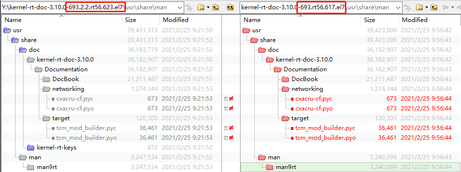
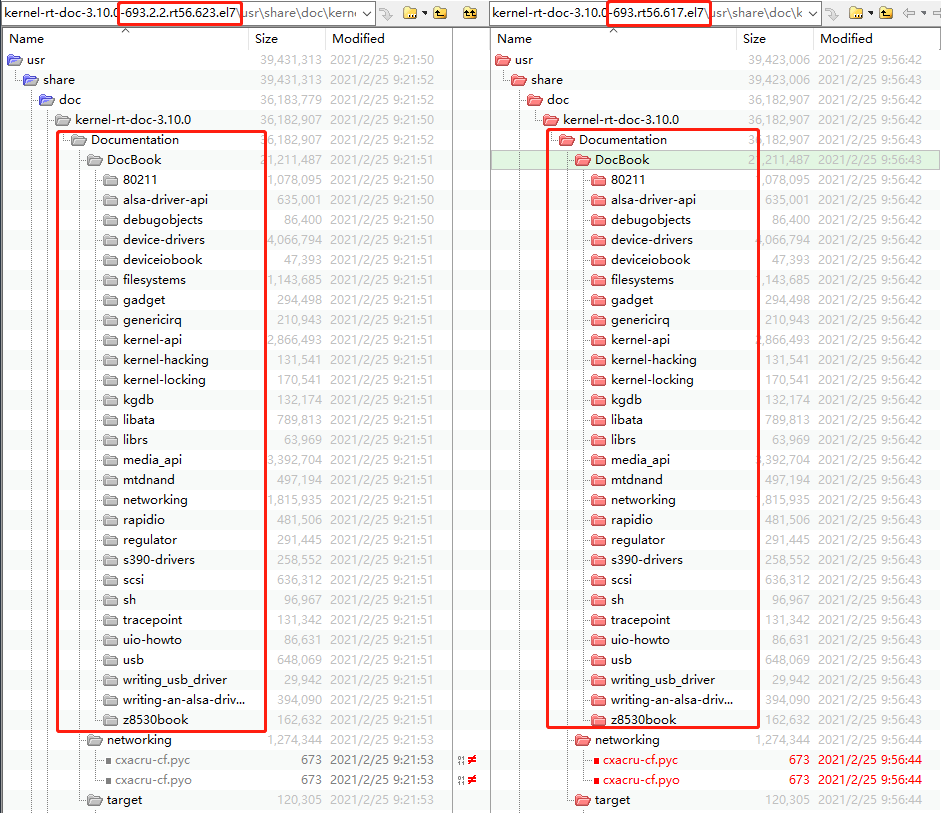
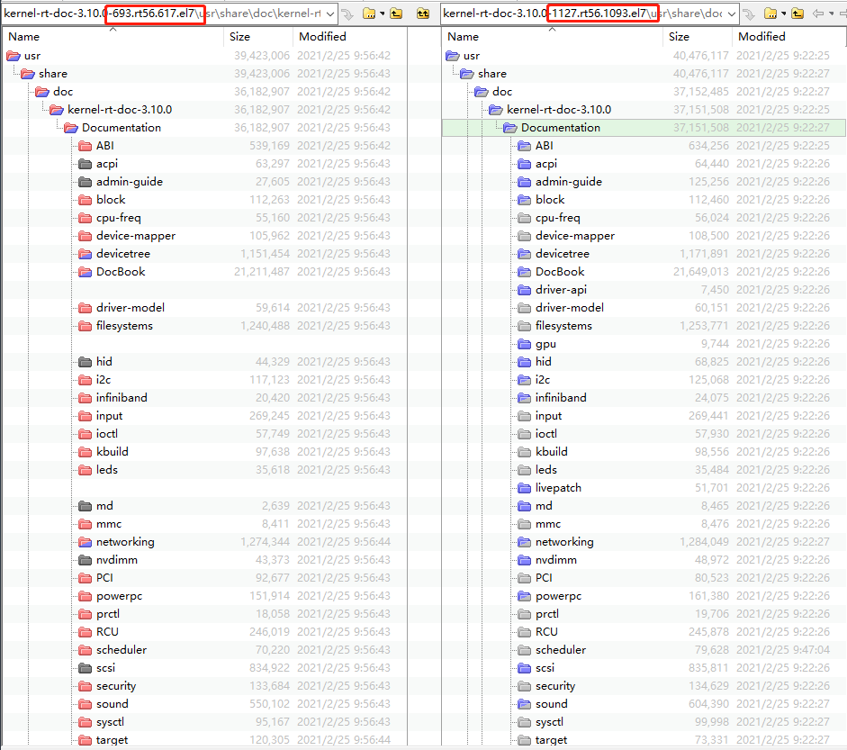
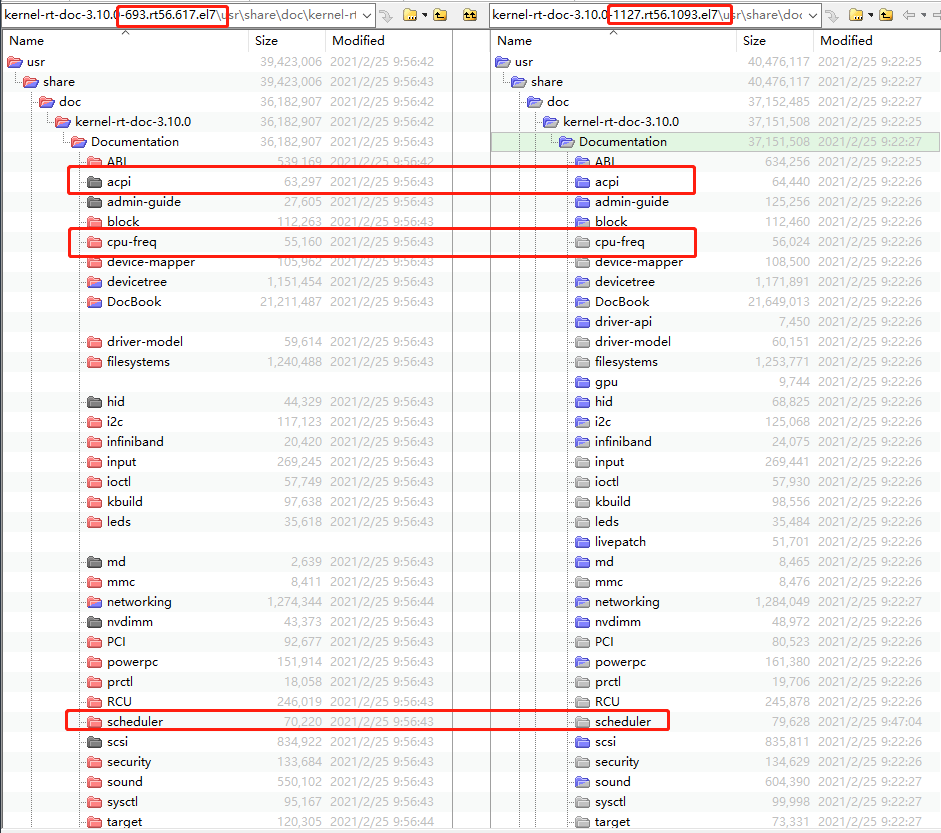
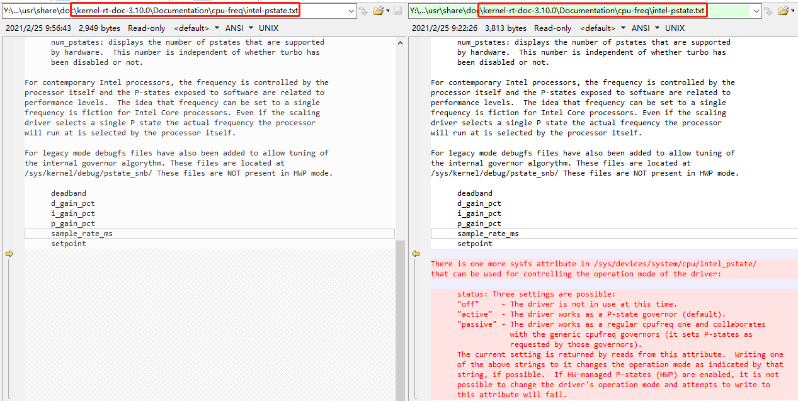
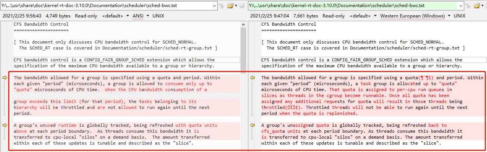

<center><font size='6'>CentOS Linux实时补丁对比报告</font></center>
<br/>
<br/>
<center><font size='5'>荣涛</font></center>
<center><font size='5'>2021年2月</font></center>
<br/>

# 1. 概要

## 1.1. 实时性补丁


* 3.10.0-693.2.2.rt56.623.el7.x86_64：[下载](https://linuxsoft.cern.ch/cern/centos/7/rt/x86_64/Packages/kernel-rt-doc-3.10.0-693.2.2.rt56.623.el7.noarch.rpm)
* 3.10.0-1127.rt56.1093.el7.x86_64：[下载](https://linuxsoft.cern.ch/cern/centos/7/rt/x86_64/Packages/kernel-rt-doc-3.10.0-1127.rt56.1093.el7.noarch.rpm)

## 1.2. 实时性补丁文档


* [kernel-rt-doc-3.10.0-1127.rt56.1093.el7.noarch](https://linuxsoft.cern.ch/cern/centos/7/rt/x86_64/Packages/kernel-rt-doc-3.10.0-1127.rt56.1093.el7.noarch.rpm)
* [kernel-rt-doc-3.10.0-693.2.2.rt56.623.el7.noarch](https://linuxsoft.cern.ch/cern/centos/7/rt/x86_64/Packages/kernel-rt-doc-3.10.0-693.2.2.rt56.623.el7.noarch.rpm)
* [kernel-rt-doc-3.10.0-693.rt56.617.el7.noarch](https://linuxsoft.cern.ch/cern/centos/7/rt/x86_64/Packages/kernel-rt-doc-3.10.0-693.rt56.617.el7.noarch.rpm)

>后面全部简称`693.rt56`、`693.2.2.rt56`和`1127.rt56`
>下面进行详细的比较。

## 1.3. 相关链接


* [Product Documentation for Red Hat Enterprise Linux for Real Time 7](https://access.redhat.com/documentation/en-us/red_hat_enterprise_linux_for_real_time/7/)

* 补丁地址：[CentOS 7 - RealTime for x86_64: RealTime: kernel-rt-doc](https://linuxsoft.cern.ch/cern/centos/7/rt/x86_64/repoview/kernel-rt-doc.html)

[参考指南Reference Guide](https://access.redhat.com/documentation/en-us/red_hat_enterprise_linux_for_real_time/7/html/reference_guide/)

本书可帮助用户和管理员学习各种术语和概念，这对于正确使用Red Hat Enterprise Linux for Real Time是必不可少的。有关安装说明，请参见《[红帽企业版Linux实时安装指南](https://access.redhat.com/documentation/en-US/Red_Hat_Enterprise_Linux_for_Real_Time/7/html/Installation_Guide/index.html)》。有关调优的信息，请参见《[红帽企业版Linux实时调优指南](https://access.redhat.com/documentation/en-US/Red_Hat_Enterprise_Linux_for_Real_Time/7/html/Tuning_Guide/index.html)》。


# 2. 比较
## 2.1. `693.rt56`和`693.2.2.rt56`对比


其中的DocBook里面差异较多


基本没有和调度和中断相关内容，关于`693`子版本的对比仅限于此。


## 2.2. `693.rt56`和`1127.rt56`对比



其中对比内容可以为：`acpi`、`cpu_freq`和`scheduler`：


## 2.3. acpi
`1127.rt56`较 `693.rt56`缺少了下面文件：


## 2.4. cpu_freq


文件差异为：


```
There is one more sysfs attribute in /sys/devices/system/cpu/intel_pstate/ that can be used for controlling the operation mode of the driver:

      status: Three settings are possible:
      "off"     - The driver is not in use at this time.
      "active"  - The driver works as a P-state governor (default).
      "passive" - The driver works as a regular cpufreq one and collaborates with the generic cpufreq governors (it sets P-states as requested by those governors).
      The current setting is returned by reads from this attribute.  Writing one of the above strings to it changes the operation mode as indicated by that string, if possible.  If HW-managed P-states (HWP) are enabled, it is not possible to change the driver's operation mode and attempts to write to this attribute will fail.
```
翻译
```
在/sys/devices/system/cpu/intel_pstate/中还有一个sysfs属性可以用来控制驱动程序的运行模式:

状态:三种设置是可能的:
“关闭”-驱动程序目前没有使用。
“激活”——驱动程序作为P-state调控器(默认)工作。
“被动”——驱动程序作为普通cpufreq工作，并与通用cpufreq调控器协作(它根据这些调控器的要求设置P-state)。
通过读取该属性返回当前设置。如果可能的话，将上述字符串之一写入它将改变该字符串所指示的操作模式。如果hw管理的P-states (HWP)是启用的，就不能改变驱动程序的操作模式，并且尝试写这个属性将会失败。
```
不存在文件`/sys/devices/system/cpu/intel_pstate/`，但是好像也没有关系。

## 2.5. scheduler
`\usr\share\doc\kernel-rt-doc-3.10.0\Documentation\scheduler\sched-bwc.txt`


其中`sched-deadline.txt`为内核最高优先级调度，用户态不用考虑，下面看`sched-bwc.txt`完全公平调度。

`693.rt56`和`1127.rt56`二者的差异主要存在两个位置：


下面提到的配额和周期如下所示：
`/sys/fs/cgroup/cpu/`
```
The default values are:
	cpu.cfs_period_us=100ms
	cpu.cfs_quota=-1
```

* `693.rt56`的`sched-bwc.txt`

```
The bandwidth allowed for a group is specified using a quota and period. Within
each given "period" (microseconds), a group is allowed to consume only up to
"quota" microseconds of CPU time.  When the CPU bandwidth consumption of a
group exceeds this limit (for that period), the tasks belonging to its
hierarchy will be throttled and are not allowed to run again until the next
period.

A group's unused runtime is globally tracked, being refreshed with quota units
above at each period boundary.  As threads consume this bandwidth it is
transferred to cpu-local "silos" on a demand basis.  The amount transferred
within each of these updates is tunable and described as the "slice".
```
组允许的带宽是通过配额和时间段来指定的。在每个给定的“时间段”(微秒)内，一个组只允许使用最多“配额”微秒的CPU时间。当一个组的CPU带宽消耗超过这个限制时(在那个时间段内)，属于它的层次结构的任务将被限制，并且在下一个时间段之前不允许再次运行。

全局跟踪组未使用的运行时，并在每个周期边界使用以上的配额单位刷新。当线程消耗这个带宽时，它会根据需要转移到cpu本地“silos”。在每个更新中传输的数量是可调的，并被描述为“slice”。

* `1127.rt56`的`sched-bwc.txt`

```
The bandwidth allowed for a group is specified using a quota and period. Within
each given "period" (microseconds), a task group is allocated up to "quota"
microseconds of CPU time. That quota is assigned to per-cpu run queues in
slices as threads in the cgroup become runnable. Once all quota has been
assigned any additional requests for quota will result in those threads being
throttled. Throttled threads will not be able to run again until the next
period when the quota is replenished.

A group's unassigned quota is globally tracked, being refreshed back to
cfs_quota units at each period boundary. As threads consume this bandwidth it
is transferred to cpu-local "silos" on a demand basis. The amount transferred
within each of these updates is tunable and described as the "slice".
```

组允许的带宽是通过配额和时间段来指定的。在每个给定的“周期”(微秒)内，一个任务组被分配最多"quota"微秒的CPU时间。当cgroup中的线程变为可运行时，这个配额将分配给片中的每cpu运行队列。一旦分配了所有的配额，对配额的任何额外请求都将导致这些线程受到限制。经过限制的线程将不能再次运行，直到配额被补充的下一个时间段。

一个组的未分配配额被全局跟踪，在每个周期边界被刷新回cfs_quota单元。当线程消耗这个带宽时，它会根据需要转移到cpu本地“silos”。在每个更新中传输的数量是可调的，并被描述为“slice”。


