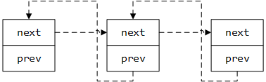
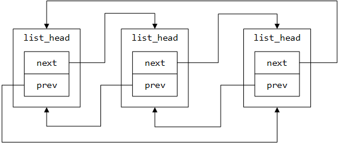

<center><font size='6'>Linux 内核中的数据结构</font></center>
<br/>
<br/>
<center><font size='5'>rtoax</font></center>
<center><font size='5'>2021年3月</font></center>
<br/>

# 1. 双向链表


Linux 内核自己实现了双向链表，可以在 [include/linux/list.h](https://github.com/torvalds/linux/blob/master/include/linux/list.h) 找到定义。我们将会从双向链表数据结构开始`内核的数据结构`。为什么？因为它在内核里使用的很广泛，你只需要在 [free-electrons.com](http://lxr.free-electrons.com/ident?i=list_head) 检索一下就知道了。

首先让我们看一下在 [include/linux/types.h](https://github.com/torvalds/linux/blob/master/include/linux/types.h) 里的主结构体：

```C
struct list_head {
	struct list_head *next, *prev;
};
```
其组成的链表格式为：


详细点标识为：


初始化：
```c
#define LIST_HEAD_INIT(name) { &(name), &(name) }

#define LIST_HEAD(name) \
	struct list_head name = LIST_HEAD_INIT(name)
```

这里需要注意个非常厉害的操作offsetof和container_of：
```c
#undef offsetof
#ifdef __compiler_offsetof
#define offsetof(TYPE, MEMBER)	__compiler_offsetof(TYPE, MEMBER)
#else
#define offsetof(TYPE, MEMBER)	((size_t)&((TYPE *)0)->MEMBER)
#endif

#define container_of(ptr, type, member) ({			\
	const typeof( ((type *)0)->member ) *__mptr = (ptr);	\
	(type *)( (char *)__mptr - offsetof(type,member) );})
```

其中offset在编译器的内建函数中有定义，其可以用`((size_t)&((TYPE *)0)->MEMBER)`进行表述，而`container_of`则表明，一个结构体所在结构体的首地址。

你可能注意到这和你以前见过的双向链表的实现方法是不同的。举个例子来说，在 [glib](http://www.gnu.org/software/libc/)  库里是这样实现的：

```C
struct GList {
  gpointer data;
  GList *next;
  GList *prev;
};
```

通常来说一个链表会包含一个指向某个项目的指针。但是内核的实现并没有这样做。所以问题来了：`链表在哪里保存数据呢？`。实际上内核里实现的链表实际上是`侵入式链表`。侵入式链表并不在节点内保存数据-节点仅仅包含指向前后节点的指针，然后把数据是附加到链表的。这就使得这个数据结构是通用的，使用起来就不需要考虑节点数据的类型了。

比如：

```C
struct nmi_desc {
    spinlock_t lock;
    struct list_head head;
};
```

让我们看几个例子来理解一下在内核里是如何使用 `list_head` 的。如上所述，在内核里有实在很多不同的地方用到了链表。我们以杂项字符驱动为例来说明双向链表的使用。在 [drivers/char/misc.c](https://github.com/torvalds/linux/blob/master/drivers/char/misc.c) 的杂项字符驱动API 被用来编写处理小型硬件和虚拟设备的小驱动。这些驱动共享相同的主设备号：

```C
#define MISC_MAJOR              10
```

但是都有各自不同的次设备号。比如：

```
ls -l /dev |  grep 10
crw-------   1 root root     10, 235 Mar 21 12:01 autofs
drwxr-xr-x  10 root root         200 Mar 21 12:01 cpu
crw-------   1 root root     10,  62 Mar 21 12:01 cpu_dma_latency
crw-------   1 root root     10, 203 Mar 21 12:01 cuse
drwxr-xr-x   2 root root         100 Mar 21 12:01 dri
crw-rw-rw-   1 root root     10, 229 Mar 21 12:01 fuse
crw-------   1 root root     10, 228 Mar 21 12:01 hpet
crw-------   1 root root     10, 183 Mar 21 12:01 hwrng
crw-rw----+  1 root kvm      10, 232 Mar 21 12:01 kvm
crw-rw----   1 root disk     10, 237 Mar 21 12:01 loop-control
crw-------   1 root root     10, 227 Mar 21 12:01 mcelog
crw-------   1 root root     10,  59 Mar 21 12:01 memory_bandwidth
crw-------   1 root root     10,  61 Mar 21 12:01 network_latency
crw-------   1 root root     10,  60 Mar 21 12:01 network_throughput
crw-r-----   1 root kmem     10, 144 Mar 21 12:01 nvram
brw-rw----   1 root disk      1,  10 Mar 21 12:01 ram10
crw--w----   1 root tty       4,  10 Mar 21 12:01 tty10
crw-rw----   1 root dialout   4,  74 Mar 21 12:01 ttyS10
crw-------   1 root root     10,  63 Mar 21 12:01 vga_arbiter
crw-------   1 root root     10, 137 Mar 21 12:01 vhci
```

现在让我们看看它是如何使用链表的。首先看一下结构体 `miscdevice` ：

```C
struct miscdevice
{
      int minor;
      const char *name;
      const struct file_operations *fops;
      struct list_head list;
      struct device *parent;
      struct device *this_device;
      const char *nodename;
      mode_t mode;
};
```

我们可以看到结构体的第四个变量 `list` 是所有注册过的设备的链表。在源代码文件的开始可以看到这个链表的定义：

```C
static LIST_HEAD(misc_list);
```

它扩展开来实际上就是定义了一个 `list_head` 类型的变量：

```C
#define LIST_HEAD(name) \
	struct list_head name = LIST_HEAD_INIT(name)
```

然后使用宏 `LIST_HEAD_INIT` 进行初始化，这会使用变量 `name` 的地址来填充 `prev` 和 `next` 结构体的两个变量。

```C
#define LIST_HEAD_INIT(name) { &(name), &(name) }
```

现在来看看注册杂项设备的函数 `misc_register` 。它在开始就用 `INIT_LIST_HEAD` 初始化了`miscdevice->list`。

```C
INIT_LIST_HEAD(&misc->list);
```

作用和宏 `LIST_HEAD_INIT`一样。

```C
static inline void INIT_LIST_HEAD(struct list_head *list)
{
	list->next = list;
	list->prev = list;
}
```

下一步在函数 `device_create` 创建了设备后我们就用下面的语句将设备添加到设备链表：

```
list_add(&misc->list, &misc_list);
```

内核文件 `list.h` 提供了向链表添加新项的接口函数。我们来看看它的实现：


```C
static inline void list_add(struct list_head *new, struct list_head *head)
{
	__list_add(new, head, head->next);
}
```

实际上就是使用3个指定的参数来调用了内部函数 `__list_add`：

* new  - 新项。
* head - 新项将会被添加到`head` 之后.
* head->next - `head` 之后的项。

`__list_add`的实现非常简单：

```C
static inline void __list_add(struct list_head *new,
			      struct list_head *prev,
			      struct list_head *next)
{
	next->prev = new;
	new->next = next;
	new->prev = prev;
	prev->next = new;
}
```

我们会在 `prev` 和 `next` 之间添加一个新项。所以我们用宏 `LIST_HEAD_INIT` 定义的 `misc` 链表会包含指向 `miscdevice->list` 的向前指针和向后指针。

这里仍有一个问题：如何得到列表的内容呢？这里有一个特殊的宏：

```C
#define list_entry(ptr, type, member) \
	container_of(ptr, type, member)
```

使用了三个参数：

* ptr - 指向链表头的指针；
* type - 结构体类型;
* member - 在结构体内类型为 `list_head` 的变量的名字；

比如说：

```C
const struct miscdevice *p = list_entry(v, struct miscdevice, list)
```

然后我们就可以使用 `p->minor` 或者 `p->name`来访问 `miscdevice`。让我们来看看 `list_entry` 的实现：
 
```C
#define list_entry(ptr, type, member) \
	container_of(ptr, type, member)
```

如我们所见，它仅仅使用相同的参数调用了宏 `container_of`。初看这个宏挺奇怪的：

```C
#define container_of(ptr, type, member) ({                      \
    const typeof( ((type *)0)->member ) *__mptr = (ptr);    \
    (type *)( (char *)__mptr - offsetof(type,member) );})
```

首先你可以注意到花括号内包含两个表达式。编译器会执行花括号内的全部语句，然后返回最后的表达式的值。

举个例子来说：

```
#include <stdio.h>

int main() {
	int i = 0;
	printf("i = %d\n", ({++i; ++i;}));
	return 0;
}
```

最终会打印 `2`

下一点就是 `typeof`,它也很简单。就如你从名字所理解的，它仅仅返回了给定变量的类型。当我第一次看到宏 `container_of` 的实现时，让我觉得最奇怪的就是 `container_of` 中的 0 。实际上这个指针巧妙的计算了从结构体特定变量的偏移，这里的 `0` 刚好就是位宽里的零偏移。让我们看一个简单的例子：

```C
#include <stdio.h>

struct s {
        int field1;
        char field2;
	char field3;
};

int main() {
	printf("%p\n", &((struct s*)0)->field3);
	return 0;
}
```

结果显示 `0x5`。

下一个宏 `offsetof` 会计算从结构体的某个变量的相对于结构体起始地址的偏移。它的实现和上面类似：

```C
#define offsetof(TYPE, MEMBER) ((size_t) &((TYPE *)0)->MEMBER)
```

现在我们来总结一下宏 `container_of`。只需要知道结构体里面类型为 `list_head` 的变量的名字和结构体容器的类型，它可以通过结构体的变量 `list_head` 获得结构体的起始地址。在宏定义的第一行，声明了一个指向结构体成员变量 `ptr` 的指针 `__mptr` ，并且把 `ptr` 的地址赋给它。现在 `ptr` 和 `__mptr` 指向了同一个地址。从技术上讲我们并不需要这一行，但是它可以方便的进行类型检查。第一行保证了特定的结构体（参数 `type`）包含成员变量 `member`。第二行代码会用宏 `offsetof` 计算成员变量相对于结构体起始地址的偏移，然后从结构体的地址减去这个偏移，最后就得到了结构体的起始地址。

当然了 `list_add` 和 `list_entry` 不是 `<linux/list.h>` 提供的唯一函数。双向链表的实现还提供了如下API：

* list_add
* list_add_tail
* list_del
* list_replace
* list_move
* list_is_last
* list_empty
* list_cut_position
* list_splice
* list_for_each
* list_for_each_entry

等等很多其它 API。


# 2. 基数树
--------------------------------------------------------------------------------
正如你所知道的 Linux 内核通过许多不同库以及函数提供各种数据结构以及算法实现。
这个部分我们将介绍其中一个数据结构 [Radix tree](http://en.wikipedia.org/wiki/Radix_tree)。Linux 内核中有两个文件与 `radix tree` 的实现和API相关：

* [include/linux/radix-tree.h](https://github.com/torvalds/linux/blob/master/include/linux/radix-tree.h)
* [lib/radix-tree.c](https://github.com/torvalds/linux/blob/master/lib/radix-tree.c)

首先说明一下什么是 `radix tree` 。Radix tree 是一种 `压缩 trie`，其中 [trie](http://en.wikipedia.org/wiki/Trie) 是一种通过保存关联数组（associative array）来提供 `关键字-值（key-value）` 存储与查找的数据结构。通常关键字是字符串，不过也可以是其他数据类型。 

trie 结构的节点与 `n-tree` 不同，其节点中并不存储关键字，取而代之的是存储单个字符标签。关键字查找时，通过从树的根开始遍历关键字相关的所有字符标签节点，直至到达最终的叶子节点。下面是个例子：


```
               +-----------+
               |           |
               |    " "    |
               |           |
        +------+-----------+------+
        |                         |
        |                         |
   +----v------+            +-----v-----+
   |           |            |           |
   |    g      |            |     c     |
   |           |            |           |
   +-----------+            +-----------+
        |                         |
        |                         |
   +----v------+            +-----v-----+
   |           |            |           |
   |    o      |            |     a     |
   |           |            |           |
   +-----------+            +-----------+
                                  |
                                  |
                            +-----v-----+
                            |           |
                            |     t     |
                            |           |
                            +-----------+
```

这个例子中，我们可以看到 `trie` 所存储的关键字信息 `go` 与 `cat`，压缩 trie 或 `radix tree` 与 `trie` 所不同的是，所有只存在单个孩子的中间节点将被压缩。

Linux 内核中的 Radix 树将值映射为整型关键字，Radix 的数据结构定义在 [include/linux/radix-tree.h](https://github.com/torvalds/linux/blob/master/include/linux/radix-tree.h) 文件中 :

```C
struct radix_tree_root {
         unsigned int            height;
         gfp_t                   gfp_mask;
         struct radix_tree_node  __rcu *rnode;
};
```

上面这个是 radix 树的 root 节点的结构体，它包括三个成员：

* `height`   - 从叶节点向上计算出的树高度。
* `gfp_mask` - 内存分配标识。
* `rnode`    - 子节点指针。

这里我们先讨论的结构体成员是 `gfp_mask` : 

Linux 底层的内存申请接口需要提供一类标识（flag） - `gfp_mask` ，用于描述内存申请的行为。这个以 `GFP_` 前缀开头的内存申请控制标识主要包括，`GFP_NOIO` 禁止所有IO操作但允许睡眠等待内存，`__GFP_HIGHMEM` 允许申请内核的高端内存，`GFP_ATOMIC` 高优先级申请内存且操作不允许被睡眠。


接下来说的结构体成员是`rnode`：

```C
struct radix_tree_node {
        unsigned int    path;
        unsigned int    count;
        union {
                struct {
                        struct radix_tree_node *parent;
                        void *private_data;
                };
                struct rcu_head rcu_head;
        };
        /* For tree user */
        struct list_head private_list;
        void __rcu      *slots[RADIX_TREE_MAP_SIZE];
        unsigned long   tags[RADIX_TREE_MAX_TAGS][RADIX_TREE_TAG_LONGS];
};
```

这个结构体中包括这几个内容，节点与父节点的偏移以及到树底端的高度，子节点的个数，节点的存储数据域，具体描述如下：

* `path` - 从叶节点
* `count` - 子节点的个数。
* `parent` - 父节点的指针。
* `private_data` - 存储数据内容缓冲区。
* `rcu_head` - 用于节点释放的RCU链表。
* `private_list` - 存储数据。

结构体 `radix_tree_node` 的最后两个成员 `tags` 与 `slots` 是非常重要且需要特别注意的。每个 Radix 树节点都可以包括一个指向存储数据指针的 slots 集合，空闲 slots 的指针指向 NULL。 Linux 内核的 Radix 树结构体中还包含用于记录节点存储状态的标签 `tags` 成员，标签通过位设置指示 Radix 树的数据存储状态。

至此，我们了解到 radix 树的结构，接下来看一下 radix 树所提供的 API。


## 2.1. 基数树 API


我们从数据结构的初始化开始看，radix 树支持两种方式初始化。

第一个是使用宏 `RADIX_TREE` ：

```C
RADIX_TREE(name, gfp_mask);
````

正如你看到，只需要提供 `name` 参数，就能够使用 `RADIX_TREE` 宏完成 radix 的定义以及初始化，`RADIX_TREE` 宏的实现非常简单：

```C
#define RADIX_TREE(name, mask) \
         struct radix_tree_root name = RADIX_TREE_INIT(mask)

#define RADIX_TREE_INIT(mask)   { \
        .height = 0,              \
        .gfp_mask = (mask),       \
        .rnode = NULL,            \
}
```

`RADIX_TREE` 宏首先使用 `name` 定义了一个 `radix_tree_root` 实例并用 `RADIX_TREE_INIT` 宏带参数 `mask` 进行初始化。宏 `RADIX_TREE_INIT` 将 `radix_tree_root` 初始化为默认属性并将 gfp_mask 初始化为入参 `mask` 。
第二种方式是手工定义 `radix_tree_root` 变量，之后再使用 `mask` 调用 `INIT_RADIX_TREE` 宏对变量进行初始化。
```C
struct radix_tree_root my_radix_tree;
INIT_RADIX_TREE(my_tree, gfp_mask_for_my_radix_tree);
```

`INIT_RADIX_TREE` 宏定义：

```C
#define INIT_RADIX_TREE(root, mask)  \
do {                                 \
        (root)->height = 0;          \
        (root)->gfp_mask = (mask);   \
        (root)->rnode = NULL;        \
} while (0)
```
宏 `INIT_RADIX_TREE` 所初始化的属性与 `RADIX_TREE_INIT` 一致


接下来是 radix 树的节点插入以及删除，这两个函数：

* `radix_tree_insert`;
* `radix_tree_delete`.

第一个函数 `radix_tree_insert` 需要三个入参：

* radix 树 root 节点结构
* 索引关键字
* 需要插入存储的数据

第二个函数 `radix_tree_delete` 除了不需要存储数据参数外，其他与 `radix_tree_insert` 一致。

radix 树的查找实现有以下几个函数：The search in a radix tree implemented in two ways:

* `radix_tree_lookup`;
* `radix_tree_gang_lookup`;
* `radix_tree_lookup_slot`.

第一个函数 `radix_tree_lookup` 需要两个参数：

* radix  树 root 节点结构
* 索引关键字

这个函数通过给定的关键字查找 radix 树，并返关键字所对应的结点。

第二个函数 `radix_tree_gang_lookup` 具有以下特征：

```C
unsigned int radix_tree_gang_lookup(struct radix_tree_root *root,
                                    void **results,
                                    unsigned long first_index,
                                    unsigned int max_items);
```

函数返回查找到记录的条目数，并根据关键字进行排序，返回的总结点数不超过入参 `max_items` 的大小。

最后一个函数 `radix_tree_lookup_slot` 返回结点 slot 中所存储的数据。


## 2.2. 链接


* [Radix tree](http://en.wikipedia.org/wiki/Radix_tree)
* [Trie](http://en.wikipedia.org/wiki/Trie)


# 3. 位数组

除了不同的基于[链式](https://en.wikipedia.org/wiki/Linked_data_structure)和[树](https://en.wikipedia.org/wiki/Tree_%28data_structure%29)的数据结构以外，Linux 内核也为[位数组](https://en.wikipedia.org/wiki/Bit_array)（或称为位图（bitmap））提供了 [API](https://en.wikipedia.org/wiki/Application_programming_interface)。位数组在 Linux 内核里被广泛使用，并且在以下的源代码文件中包含了与这样的结构搭配使用的通用 `API`：

* [lib/bitmap.c](https://github.com/torvalds/linux/blob/master/lib/bitmap.c)
* [include/linux/bitmap.h](https://github.com/torvalds/linux/blob/master/include/linux/bitmap.h)

除了这两个文件之外，还有体系结构特定的头文件，它们为特定的体系结构提供优化的位操作。我们将探讨 [x86_64](https://en.wikipedia.org/wiki/X86-64) 体系结构，因此在我们的例子里，它会是

* [arch/x86/include/asm/bitops.h](https://github.com/torvalds/linux/blob/master/arch/x86/include/asm/bitops.h)

头文件。正如我上面所写的，`位图`在 Linux 内核中被广泛地使用。例如，`位数组`常常用于保存一组在线/离线处理器，以便系统支持[热插拔](https://www.kernel.org/doc/Documentation/cpu-hotplug.txt)的 CPU（你可以在 [cpumasks](https://0xax.gitbooks.io/linux-insides/content/Concepts/cpumask.html) 部分阅读更多相关知识 ），一个位数组（bit array）可以在 Linux 内核初始化等期间保存一组已分配的[中断处理](https://en.wikipedia.org/wiki/Interrupt_request_%28PC_architecture%29)。

因此，本部分的主要目的是了解位数组（bit array）是如何在 Linux 内核中实现的。让我们现在开始吧。

## 3.1. 位数组声明


在我们开始查看`位图`操作的 `API` 之前，我们必须知道如何在 Linux 内核中声明它。有两种声明位数组的通用方法。第一种简单的声明一个位数组的方法是，定义一个 `unsigned long` 的数组，例如：

```C
unsigned long my_bitmap[8]
```

第二种方法，是使用 `DECLARE_BITMAP` 宏，它定义于 [include/linux/types.h](https://github.com/torvalds/linux/blob/master/include/linux/types.h) 头文件：

```C
#define DECLARE_BITMAP(name,bits) \
    unsigned long name[BITS_TO_LONGS(bits)]
```

我们可以看到 `DECLARE_BITMAP` 宏使用两个参数：

* `name` - 位图名称;
* `bits` - 位图中位数;

并且只是使用 `BITS_TO_LONGS(bits)` 元素展开 `unsigned long` 数组的定义。 `BITS_TO_LONGS` 宏将一个给定的位数转换为 `long` 的个数，换言之，就是计算 `bits` 中有多少个 `8` 字节元素：

```C
#define BITS_PER_BYTE           8
#define DIV_ROUND_UP(n,d) (((n) + (d) - 1) / (d))
#define BITS_TO_LONGS(nr)       DIV_ROUND_UP(nr, BITS_PER_BYTE * sizeof(long))
```

因此，例如 `DECLARE_BITMAP(my_bitmap, 64)` 将产生：

```python
>>> (((64) + (64) - 1) / (64))
1
```

与：

```C
unsigned long my_bitmap[1];
```

在能够声明一个位数组之后，我们便可以使用它了。

## 3.2. 体系结构特定的位操作


我们已经看了上面提及的一对源文件和头文件，它们提供了位数组操作的 [API](https://en.wikipedia.org/wiki/Application_programming_interface)。其中重要且广泛使用的位数组 API 是体系结构特定的且位于已提及的头文件中 [arch/x86/include/asm/bitops.h](https://github.com/torvalds/linux/blob/master/arch/x86/include/asm/bitops.h)。

首先让我们查看两个最重要的函数：

* `set_bit`;
* `clear_bit`.

我认为没有必要解释这些函数的作用。从它们的名字来看，这已经很清楚了。让我们直接查看它们的实现。如果你浏览 [arch/x86/include/asm/bitops.h](https://github.com/torvalds/linux/blob/master/arch/x86/include/asm/bitops.h) 头文件，你将会注意到这些函数中的每一个都有[原子性](https://en.wikipedia.org/wiki/Linearizability)和非原子性两种变体。在我们开始深入这些函数的实现之前，首先，我们必须了解一些有关原子（atomic）操作的知识。

简而言之，原子操作保证两个或以上的操作不会并发地执行同一数据。`x86` 体系结构提供了一系列原子指令，例如， [xchg](http://x86.renejeschke.de/html/file_module_x86_id_328.html)、[cmpxchg](http://x86.renejeschke.de/html/file_module_x86_id_41.html) 等指令。除了原子指令，一些非原子指令可以在 [lock](http://x86.renejeschke.de/html/file_module_x86_id_159.html) 指令的帮助下具有原子性。现在你已经对原子操作有了足够的了解，我们可以接着探讨 `set_bit` 和 `clear_bit` 函数的实现。

我们先考虑函数的非原子性（non-atomic）变体。非原子性的 `set_bit` 和 `clear_bit` 的名字以双下划线开始。正如我们所知道的，所有这些函数都定义于 [arch/x86/include/asm/bitops.h](https://github.com/torvalds/linux/blob/master/arch/x86/include/asm/bitops.h) 头文件，并且第一个函数就是 `__set_bit`:

```C
static inline void __set_bit(long nr, volatile unsigned long *addr)
{
	asm volatile("bts %1,%0" : ADDR : "Ir" (nr) : "memory");
}
```

正如我们所看到的，它使用了两个参数：

* `nr` - 位数组中的位号（LCTT 译注：从 0开始）
* `addr` - 我们需要置位的位数组地址

注意，`addr` 参数使用 `volatile` 关键字定义，以告诉编译器给定地址指向的变量可能会被修改。 `__set_bit` 的实现相当简单。正如我们所看到的，它仅包含一行[内联汇编代码](https://en.wikipedia.org/wiki/Inline_assembler)。在我们的例子中，我们使用 [bts](http://x86.renejeschke.de/html/file_module_x86_id_25.html) 指令，从位数组中选出一个第一操作数（我们的例子中的 `nr`）所指定的位，存储选出的位的值到 [CF](https://en.wikipedia.org/wiki/FLAGS_register) 标志寄存器并设置该位（LCTT 译注：即 `nr` 指定的位置为 1）。

注意，我们了解了 `nr` 的用法，但这里还有一个参数 `addr` 呢！你或许已经猜到秘密就在 `ADDR`。 `ADDR` 是一个定义在同一个头文件中的宏，它展开为一个包含给定地址和 `+m` 约束的字符串：

```C
#define ADDR				BITOP_ADDR(addr)
#define BITOP_ADDR(x) "+m" (*(volatile long *) (x))
```

除了 `+m` 之外，在 `__set_bit` 函数中我们可以看到其他约束。让我们查看并试着理解它们所表示的意义：

* `+m` - 表示内存操作数，这里的 `+` 表明给定的操作数为输入输出操作数；
* `I` - 表示整型常量；
* `r` - 表示寄存器操作数

除了这些约束之外，我们也能看到 `memory` 关键字，其告诉编译器这段代码会修改内存中的变量。到此为止，现在我们看看相同的原子性（atomic）变体函数。它看起来比非原子性（non-atomic）变体更加复杂：

```C
static __always_inline void
set_bit(long nr, volatile unsigned long *addr)
{
	if (IS_IMMEDIATE(nr)) {
		asm volatile(LOCK_PREFIX "orb %1,%0"
			: CONST_MASK_ADDR(nr, addr)
			: "iq" ((u8)CONST_MASK(nr))
			: "memory");
	} else {
		asm volatile(LOCK_PREFIX "bts %1,%0"
			: BITOP_ADDR(addr) : "Ir" (nr) : "memory");
	}
}
```

（LCTT 译注：BITOP_ADDR 的定义为：`#define BITOP_ADDR(x) "=m" (*(volatile long *) (x))`，ORB 为字节按位或。）

首先注意，这个函数使用了与 `__set_bit` 相同的参数集合，但额外地使用了 `__always_inline` 属性标记。 `__always_inline` 是一个定义于 [include/linux/compiler-gcc.h](https://github.com/torvalds/linux/blob/master/include/linux/compiler-gcc.h) 的宏，并且只是展开为 `always_inline` 属性：

```C
#define __always_inline inline __attribute__((always_inline))
```

其意味着这个函数总是内联的，以减少 Linux 内核映像的大小。现在让我们试着了解下 `set_bit` 函数的实现。首先我们在 `set_bit` 函数的开头检查给定的位的数量。`IS_IMMEDIATE` 宏定义于相同的[头文件](https://github.com/torvalds/linux/blob/master/arch/x86/include/asm/bitops.h)，并展开为 [gcc](https://en.wikipedia.org/wiki/GNU_Compiler_Collection) 内置函数的调用：

```C
#define IS_IMMEDIATE(nr)		(__builtin_constant_p(nr))
```

如果给定的参数是编译期已知的常量，`__builtin_constant_p` 内置函数则返回 `1`，其他情况返回 `0`。假若给定的位数是编译期已知的常量，我们便无须使用效率低下的 `bts` 指令去设置位。我们可以只需在给定地址指向的字节上执行 [按位或](https://en.wikipedia.org/wiki/Bitwise_operation#OR) 操作，其字节包含给定的位，掩码位数表示高位为 `1`，其他位为 0 的掩码。在其他情况下，如果给定的位号不是编译期已知常量，我们便做和 `__set_bit` 函数一样的事。`CONST_MASK_ADDR` 宏：

```C
#define CONST_MASK_ADDR(nr, addr)	BITOP_ADDR((void *)(addr) + ((nr)>>3))
```

展开为带有到包含给定位的字节偏移的给定地址，例如，我们拥有地址 `0x1000` 和位号 `0x9`。因为 `0x9` 代表 `一个字节 + 一位`，所以我们的地址是 `addr + 1`:

```python
>>> hex(0x1000 + (0x9 >> 3))
'0x1001'
```

`CONST_MASK` 宏将我们给定的位号表示为字节，位号对应位为高位 `1`，其他位为 `0`：

```C
#define CONST_MASK(nr)			(1 << ((nr) & 7))
```

```python
>>> bin(1 << (0x9 & 7))
'0b10'
```

最后，我们应用 `按位或` 运算到这些变量上面，因此，假如我们的地址是 `0x4097` ，并且我们需要置位号为 `9` 的位为 1：

```python
>>> bin(0x4097)
'0b100000010010111'
>>> bin((0x4097 >> 0x9) | (1 << (0x9 & 7)))
'0b100010'
```

`第 9 位` 将会被置位。（LCTT 译注：这里的 9 是从 0 开始计数的，比如0010，按照作者的意思，其中的 1 是第 1 位）

注意，所有这些操作使用 `LOCK_PREFIX` 标记，其展开为 [lock](http://x86.renejeschke.de/html/file_module_x86_id_159.html) 指令，保证该操作的原子性。

正如我们所知，除了 `set_bit` 和 `__set_bit` 操作之外，Linux 内核还提供了两个功能相反的函数，在原子性和非原子性的上下文中清位。它们是 `clear_bit` 和 `__clear_bit`。这两个函数都定义于同一个[头文件](https://github.com/torvalds/linux/blob/master/arch/x86/include/asm/bitops.h) 并且使用相同的参数集合。不仅参数相似，一般而言，这些函数与  `set_bit` 和 `__set_bit` 也非常相似。让我们查看非原子性 `__clear_bit` 的实现吧： 

```C
static inline void __clear_bit(long nr, volatile unsigned long *addr)
{
	asm volatile("btr %1,%0" : ADDR : "Ir" (nr));
}
```

没错，正如我们所见，`__clear_bit` 使用相同的参数集合，并包含极其相似的内联汇编代码块。它只是使用 [btr](http://x86.renejeschke.de/html/file_module_x86_id_24.html) 指令替换了 `bts`。正如我们从函数名所理解的一样，通过给定地址，它清除了给定的位。`btr` 指令表现得像 `bts`（LCTT 译注：原文这里为 btr，可能为笔误，修正为 bts）。该指令选出第一操作数所指定的位，存储它的值到 `CF` 标志寄存器，并且清除第二操作数指定的位数组中的对应位。

`__clear_bit` 的原子性变体为 `clear_bit`：

```C
static __always_inline void
clear_bit(long nr, volatile unsigned long *addr)
{
	if (IS_IMMEDIATE(nr)) {
		asm volatile(LOCK_PREFIX "andb %1,%0"
			: CONST_MASK_ADDR(nr, addr)
			: "iq" ((u8)~CONST_MASK(nr)));
	} else {
		asm volatile(LOCK_PREFIX "btr %1,%0"
			: BITOP_ADDR(addr)
			: "Ir" (nr));
	}
}
```

并且正如我们所看到的，它与 `set_bit` 非常相似，只有两处不同。第一处差异为 `clear_bit` 使用 `btr` 指令来清位，而 `set_bit` 使用 `bts` 指令来置位。第二处差异为 `clear_bit` 使用否定的位掩码和 `按位与` 在给定的字节上置位，而 `set_bit` 使用 `按位或` 指令。

到此为止，我们可以在任意位数组置位和清位了，我们将看看位掩码上的其他操作。

在 Linux 内核中对位数组最广泛使用的操作是设置和清除位，但是除了这两个操作外，位数组上其他操作也是非常有用的。Linux 内核里另一种广泛使用的操作是知晓位数组中一个给定的位是否被置位。我们能够通过 `test_bit` 宏的帮助实现这一功能。这个宏定义于 [arch/x86/include/asm/bitops.h](https://github.com/torvalds/linux/blob/master/arch/x86/include/asm/bitops.h) 头文件，并根据位号分别展开为 `constant_test_bit` 或 `variable_test_bit` 调用。

```C
#define test_bit(nr, addr)			\
	(__builtin_constant_p((nr))                 \
	 ? constant_test_bit((nr), (addr))	        \
	 : variable_test_bit((nr), (addr)))
```

因此，如果 `nr` 是编译期已知常量，`test_bit` 将展开为 `constant_test_bit` 函数的调用，而其他情况则为 `variable_test_bit`。现在让我们看看这些函数的实现，让我们从 `variable_test_bit` 开始看起：  

```C
static inline int variable_test_bit(long nr, volatile const unsigned long *addr)
{
	int oldbit;

	asm volatile("bt %2,%1\n\t"
		     "sbb %0,%0"
		     : "=r" (oldbit)
		     : "m" (*(unsigned long *)addr), "Ir" (nr));

	return oldbit;
}
```

`variable_test_bit` 函数使用了与 `set_bit` 及其他函数使用的相似的参数集合。我们也可以看到执行 [bt](http://x86.renejeschke.de/html/file_module_x86_id_22.html) 和 [sbb](http://x86.renejeschke.de/html/file_module_x86_id_286.html) 指令的内联汇编代码。`bt` （或称 `bit test`）指令从第二操作数指定的位数组选出第一操作数指定的一个指定位，并且将该位的值存进标志寄存器的 [CF](https://en.wikipedia.org/wiki/FLAGS_register) 位。第二个指令 `sbb` 从第二操作数中减去第一操作数，再减去 `CF` 的值。因此，这里将一个从给定位数组中的给定位号的值写进标志寄存器的 `CF` 位，并且执行 `sbb` 指令计算： `00000000 - CF`，并将结果写进 `oldbit` 变量。

`constant_test_bit` 函数做了和我们在 `set_bit` 所看到的一样的事：

```C
static __always_inline int constant_test_bit(long nr, const volatile unsigned long *addr)
{
	return ((1UL << (nr & (BITS_PER_LONG-1))) &
		(addr[nr >> _BITOPS_LONG_SHIFT])) != 0;
}
```

它生成了一个位号对应位为高位 `1`，而其他位为 `0` 的字节（正如我们在 `CONST_MASK` 所看到的），并将 [按位与](https://en.wikipedia.org/wiki/Bitwise_operation#AND) 应用于包含给定位号的字节。

下一个被广泛使用的位数组相关操作是改变一个位数组中的位。为此，Linux 内核提供了两个辅助函数：

* `__change_bit`;
* `change_bit`.

你可能已经猜测到，就拿 `set_bit` 和 `__set_bit` 例子说，这两个变体分别是原子和非原子版本。首先，让我们看看 `__change_bit` 函数的实现：

```C
static inline void __change_bit(long nr, volatile unsigned long *addr)
{
    asm volatile("btc %1,%0" : ADDR : "Ir" (nr));
}
```

相当简单，不是吗？ `__change_bit` 的实现和 `__set_bit` 一样，只是我们使用 [btc](http://x86.renejeschke.de/html/file_module_x86_id_23.html) 替换 `bts` 指令而已。 该指令从一个给定位数组中选出一个给定位，将该为位的值存进 `CF` 并使用求反操作改变它的值，因此值为 `1` 的位将变为 `0`，反之亦然：

```python
>>> int(not 1)
0
>>> int(not 0)
1
```

`__change_bit` 的原子版本为 `change_bit` 函数：

```C
static inline void change_bit(long nr, volatile unsigned long *addr)
{
	if (IS_IMMEDIATE(nr)) {
		asm volatile(LOCK_PREFIX "xorb %1,%0"
			: CONST_MASK_ADDR(nr, addr)
			: "iq" ((u8)CONST_MASK(nr)));
	} else {
		asm volatile(LOCK_PREFIX "btc %1,%0"
			: BITOP_ADDR(addr)
			: "Ir" (nr));
	}
}
```

它和 `set_bit` 函数很相似，但也存在两点不同。第一处差异为 `xor` 操作而不是 `or`。第二处差异为 `btc`（ LCTT 译注：原文为 `bts`，为作者笔误） 而不是 `bts`。

目前，我们了解了最重要的体系特定的位数组操作，是时候看看一般的位图 API 了。

## 3.3. 通用位操作


除了 [arch/x86/include/asm/bitops.h](https://github.com/torvalds/linux/blob/master/arch/x86/include/asm/bitops.h) 中体系特定的 API 外，Linux 内核提供了操作位数组的通用 API。正如我们本部分开头所了解的一样，我们可以在 [include/linux/bitmap.h](https://github.com/torvalds/linux/blob/master/include/linux/bitmap.h) 头文件和 [lib/bitmap.c](https://github.com/torvalds/linux/blob/master/lib/bitmap.c)  源文件中找到它。但在查看这些源文件之前，我们先看看 [include/linux/bitops.h](https://github.com/torvalds/linux/blob/master/include/linux/bitops.h) 头文件，其提供了一系列有用的宏，让我们看看它们当中一部分。

首先我们看看以下 4 个 宏：

* `for_each_set_bit`
* `for_each_set_bit_from`
* `for_each_clear_bit`
* `for_each_clear_bit_from`

所有这些宏都提供了遍历位数组中某些位集合的迭代器。第一个宏迭代那些被置位的位。第二个宏也是一样，但它是从某一个确定的位开始。最后两个宏做的一样，但是迭代那些被清位的位。让我们看看 `for_each_set_bit` 宏：

```C
#define for_each_set_bit(bit, addr, size) \
	for ((bit) = find_first_bit((addr), (size));		\
	     (bit) < (size);					\
	     (bit) = find_next_bit((addr), (size), (bit) + 1))
```

正如我们所看到的，它使用了三个参数，并展开为一个循环，该循环从作为 `find_first_bit` 函数返回结果的第一个置位开始，到小于给定大小的最后一个置位为止。

除了这四个宏， [arch/x86/include/asm/bitops.h](https://github.com/torvalds/linux/blob/master/arch/x86/include/asm/bitops.h) 也提供了 `64-bit` 或 `32-bit` 变量循环的 API 等等。

下一个 [头文件](https://github.com/torvalds/linux/blob/master/include/linux/bitmap.h) 提供了操作位数组的 API。例如，它提供了以下两个函数： 

* `bitmap_zero`;
* `bitmap_fill`.

它们分别可以清除一个位数组和用 `1` 填充位数组。让我们看看 `bitmap_zero` 函数的实现：

```C
static inline void bitmap_zero(unsigned long *dst, unsigned int nbits)
{
	if (small_const_nbits(nbits))
		*dst = 0UL;
	else {
		unsigned int len = BITS_TO_LONGS(nbits) * sizeof(unsigned long);
		memset(dst, 0, len);
	}
}
```

首先我们可以看到对 `nbits` 的检查。 `small_const_nbits` 是一个定义在同一个[头文件](https://github.com/torvalds/linux/blob/master/include/linux/bitmap.h) 的宏：

```C
#define small_const_nbits(nbits) \
	(__builtin_constant_p(nbits) && (nbits) <= BITS_PER_LONG)
```

正如我们可以看到的，它检查 `nbits` 是否为编译期已知常量，并且其值不超过 `BITS_PER_LONG` 或 `64`。如果位数目没有超过一个 `long` 变量的位数，我们可以仅仅设置为 0。在其他情况，我们需要计算有多少个需要填充位数组的 `long` 变量并且使用 [memset](http://man7.org/linux/man-pages/man3/memset.3.html) 进行填充。

`bitmap_fill` 函数的实现和 `biramp_zero` 函数很相似，除了我们需要在给定的位数组中填写 `0xff` 或 `0b11111111`：

```C
static inline void bitmap_fill(unsigned long *dst, unsigned int nbits)
{
	unsigned int nlongs = BITS_TO_LONGS(nbits);
	if (!small_const_nbits(nbits)) {
		unsigned int len = (nlongs - 1) * sizeof(unsigned long);
		memset(dst, 0xff,  len);
	}
	dst[nlongs - 1] = BITMAP_LAST_WORD_MASK(nbits);
}
```

除了 `bitmap_fill` 和 `bitmap_zero`，[include/linux/bitmap.h](https://github.com/torvalds/linux/blob/master/include/linux/bitmap.h) 头文件也提供了和 `bitmap_zero` 很相似的 `bitmap_copy`，只是仅仅使用 [memcpy](http://man7.org/linux/man-pages/man3/memcpy.3.html) 而不是  [memset](http://man7.org/linux/man-pages/man3/memset.3.html) 这点差异而已。它也提供了位数组的按位操作，像 `bitmap_and`, `bitmap_or`, `bitamp_xor`等等。我们不会探讨这些函数的实现了，因为如果你理解了本部分的所有内容，这些函数的实现是很容易理解的。无论如何，如果你对这些函数是如何实现的感兴趣，你可以打开并研究 [include/linux/bitmap.h](https://github.com/torvalds/linux/blob/master/include/linux/bitmap.h) 头文件。

本部分到此为止。

注： 本文由 [LCTT](https://github.com/LCTT/TranslateProject) 原创翻译，[Linux中国](https://linux.cn/) 荣誉推出

## 3.4. 链接


* [bitmap](https://en.wikipedia.org/wiki/Bit_array)
* [linked data structures](https://en.wikipedia.org/wiki/Linked_data_structure)
* [tree data structures](https://en.wikipedia.org/wiki/Tree_%28data_structure%29) 
* [hot-plug](https://www.kernel.org/doc/Documentation/cpu-hotplug.txt)
* [cpumasks](https://0xax.gitbooks.io/linux-insides/content/Concepts/cpumask.html)
* [IRQs](https://en.wikipedia.org/wiki/Interrupt_request_%28PC_architecture%29)
* [API](https://en.wikipedia.org/wiki/Application_programming_interface)
* [atomic operations](https://en.wikipedia.org/wiki/Linearizability)
* [xchg instruction](http://x86.renejeschke.de/html/file_module_x86_id_328.html)
* [cmpxchg instruction](http://x86.renejeschke.de/html/file_module_x86_id_41.html)
* [lock instruction](http://x86.renejeschke.de/html/file_module_x86_id_159.html)
* [bts instruction](http://x86.renejeschke.de/html/file_module_x86_id_25.html)
* [btr instruction](http://x86.renejeschke.de/html/file_module_x86_id_24.html)
* [bt instruction](http://x86.renejeschke.de/html/file_module_x86_id_22.html)
* [sbb instruction](http://x86.renejeschke.de/html/file_module_x86_id_286.html)
* [btc instruction](http://x86.renejeschke.de/html/file_module_x86_id_23.html)
* [man memcpy](http://man7.org/linux/man-pages/man3/memcpy.3.html) 
* [man memset](http://man7.org/linux/man-pages/man3/memset.3.html)
* [CF](https://en.wikipedia.org/wiki/FLAGS_register)
* [inline assembler](https://en.wikipedia.org/wiki/Inline_assembler)
* [gcc](https://en.wikipedia.org/wiki/GNU_Compiler_Collection)

<br/>
<center><font size='6'>>>>以下为英文原文<<<</font></center>
<br/>


# 4. Doubly linked list
--------------------------------------------------------------------------------

Linux kernel provides its own implementation of doubly linked list, which you can find in the [include/linux/list.h](https://github.com/torvalds/linux/blob/16f73eb02d7e1765ccab3d2018e0bd98eb93d973/include/linux/list.h). We will start `Data Structures in the Linux kernel` from the doubly linked list data structure. Why? Because it is very popular in the kernel, just try to [search](http://lxr.free-electrons.com/ident?i=list_head)

First of all, let's look on the main structure in the [include/linux/types.h](https://github.com/torvalds/linux/blob/16f73eb02d7e1765ccab3d2018e0bd98eb93d973/include/linux/types.h):

```C
struct list_head {
	struct list_head *next, *prev;
};
```

You can note that it is different from many implementations of doubly linked list which you have seen. For example, this doubly linked list structure from the [glib](http://www.gnu.org/software/libc/) library looks like :

```C
struct GList {
  gpointer data;
  GList *next;
  GList *prev;
};
```

Usually a linked list structure contains a pointer to the item. The implementation of linked list in Linux kernel does not. So the main question is - `where does the list store the data?`. The actual implementation of linked list in the kernel is - `Intrusive list`. An intrusive linked list does not contain data in its nodes - A node just contains pointers to the next and previous node and list nodes part of the data that are added to the list. This makes the data structure generic, so it does not care about entry data type anymore.

For example:

```C
struct nmi_desc {
    spinlock_t lock;
    struct list_head head;
};
```

Let's look at some examples to understand how `list_head` is used in the kernel. As I already wrote about, there are many, really many different places where lists are used in the kernel. Let's look for an example in miscellaneous character drivers. Misc character drivers API from the [drivers/char/misc.c](https://github.com/torvalds/linux/blob/16f73eb02d7e1765ccab3d2018e0bd98eb93d973/drivers/char/misc.c) is used for writing small drivers for handling simple hardware or virtual devices. Those drivers share same major number:

```C
#define MISC_MAJOR              10
```

but have their own minor number. For example you can see it with:

```
ls -l /dev |  grep 10
crw-------   1 root root     10, 235 Mar 21 12:01 autofs
drwxr-xr-x  10 root root         200 Mar 21 12:01 cpu
crw-------   1 root root     10,  62 Mar 21 12:01 cpu_dma_latency
crw-------   1 root root     10, 203 Mar 21 12:01 cuse
drwxr-xr-x   2 root root         100 Mar 21 12:01 dri
crw-rw-rw-   1 root root     10, 229 Mar 21 12:01 fuse
crw-------   1 root root     10, 228 Mar 21 12:01 hpet
crw-------   1 root root     10, 183 Mar 21 12:01 hwrng
crw-rw----+  1 root kvm      10, 232 Mar 21 12:01 kvm
crw-rw----   1 root disk     10, 237 Mar 21 12:01 loop-control
crw-------   1 root root     10, 227 Mar 21 12:01 mcelog
crw-------   1 root root     10,  59 Mar 21 12:01 memory_bandwidth
crw-------   1 root root     10,  61 Mar 21 12:01 network_latency
crw-------   1 root root     10,  60 Mar 21 12:01 network_throughput
crw-r-----   1 root kmem     10, 144 Mar 21 12:01 nvram
brw-rw----   1 root disk      1,  10 Mar 21 12:01 ram10
crw--w----   1 root tty       4,  10 Mar 21 12:01 tty10
crw-rw----   1 root dialout   4,  74 Mar 21 12:01 ttyS10
crw-------   1 root root     10,  63 Mar 21 12:01 vga_arbiter
crw-------   1 root root     10, 137 Mar 21 12:01 vhci
```

Now let's have a close look at how lists are used in the misc device drivers. First of all, let's look on `miscdevice` structure:

```C
struct miscdevice
{
      int minor;
      const char *name;
      const struct file_operations *fops;
      struct list_head list;
      struct device *parent;
      struct device *this_device;
      const char *nodename;
      mode_t mode;
};
```

We can see the fourth field in the `miscdevice` structure - `list` which is a list of registered devices. In the beginning of the source code file we can see the definition of misc_list:

```C
static LIST_HEAD(misc_list);
```

which expands to the definition of variables with `list_head` type:

```C
#define LIST_HEAD(name) \
	struct list_head name = LIST_HEAD_INIT(name)
```

and initializes it with the `LIST_HEAD_INIT` macro, which sets previous and next entries with the address of variable - name:

```C
#define LIST_HEAD_INIT(name) { &(name), &(name) }
```

Now let's look on the `misc_register` function which registers a miscellaneous device. At the start it initializes `miscdevice->list` with the `INIT_LIST_HEAD` function:

```C
INIT_LIST_HEAD(&misc->list);
```

which does the same as the `LIST_HEAD_INIT` macro:

```C
static inline void INIT_LIST_HEAD(struct list_head *list)
{
	list->next = list;
	list->prev = list;
}
```

In the next step after a device is created by the `device_create` function, we add it to the miscellaneous devices list with:

```
list_add(&misc->list, &misc_list);
```

Kernel `list.h` provides this API for the addition of a new entry to the list. Let's look at its implementation:

```C
static inline void list_add(struct list_head *new, struct list_head *head)
{
	__list_add(new, head, head->next);
}
```

It just calls internal function `__list_add` with the 3 given parameters:

* new  - new entry.
* head - list head after which the new item will be inserted.
* head->next - next item after list head.

Implementation of the `__list_add` is pretty simple:

```C
static inline void __list_add(struct list_head *new,
			      struct list_head *prev,
			      struct list_head *next)
{
	next->prev = new;
	new->next = next;
	new->prev = prev;
	prev->next = new;
}
```

Here we add a new item between `prev` and `next`. So `misc` list which we defined at the start with the `LIST_HEAD_INIT` macro will contain previous and next pointers to the `miscdevice->list`.

There is still one question: how to get list's entry. There is a special macro:

```C
#define list_entry(ptr, type, member) \
	container_of(ptr, type, member)
```

which gets three parameters:

* ptr - the structure list_head pointer;
* type - structure type;
* member - the name of the list_head within the structure;

For example:

```C
const struct miscdevice *p = list_entry(v, struct miscdevice, list)
```

After this we can access to any `miscdevice` field with `p->minor` or `p->name` and etc... Let's look on the `list_entry` implementation:

```C
#define list_entry(ptr, type, member) \
	container_of(ptr, type, member)
```

As we can see it just calls `container_of` macro with the same arguments. At first sight, the `container_of` looks strange:

```C
#define container_of(ptr, type, member) ({                      \
    const typeof( ((type *)0)->member ) *__mptr = (ptr);    \
    (type *)( (char *)__mptr - offsetof(type,member) );})
```

First of all you can note that it consists of two expressions in curly brackets. The compiler will evaluate the whole block in the curly braces and use the value of the last expression.

For example:

```
#include <stdio.h>

int main() {
	int i = 0;
	printf("i = %d\n", ({++i; ++i;}));
	return 0;
}
```

will print `2`.

The next point is `typeof`, it's simple. As you can understand from its name, it just returns the type of the given variable. When I first saw the implementation of the `container_of` macro, the strangest thing I found was the zero in the `((type *)0)` expression. Actually this pointer magic calculates the offset of the given field from the address of the structure, but as we have `0` here, it will be just a zero offset along with the field width. Let's look at a simple example:

```C
#include <stdio.h>

struct s {
        int field1;
        char field2;
		char field3;
};

int main() {
	printf("%p\n", &((struct s*)0)->field3);
	return 0;
}
```

will print `0x5`.

The next `offsetof` macro calculates offset from the beginning of the structure to the given structure's field. Its implementation is very similar to the previous code:

```C
#define offsetof(TYPE, MEMBER) ((size_t) &((TYPE *)0)->MEMBER)
```

Let's summarize all about `container_of` macro. The `container_of` macro returns the address of the structure by the given address of the structure's field with `list_head` type, the name of the structure field with `list_head` type and type of the container structure. At the first line this macro declares the `__mptr` pointer which points to the field of the structure that `ptr` points to and assigns `ptr` to it. Now `ptr` and `__mptr` point to the same address. Technically we don't need this line but it's useful for type checking. The first line ensures that the given structure (`type` parameter) has a member called `member`. In the second line it calculates offset of the field from the structure with the `offsetof` macro and subtracts it from the structure address. That's all.

Of course `list_add` and `list_entry` is not the only functions which `<linux/list.h>` provides. Implementation of the doubly linked list provides the following API:

* list_add
* list_add_tail
* list_del
* list_replace
* list_move
* list_is_last
* list_empty
* list_cut_position
* list_splice
* list_for_each
* list_for_each_entry

and many more.


# 5. Radix tree

As you already know linux kernel provides many different libraries and functions which implement different data structures and algorithms. In this part we will consider one of these data structures - [Radix tree](http://en.wikipedia.org/wiki/Radix_tree). There are two files which are related to `radix tree` implementation and API in the linux kernel:

* [include/linux/radix-tree.h](https://github.com/torvalds/linux/blob/16f73eb02d7e1765ccab3d2018e0bd98eb93d973/include/linux/radix-tree.h)
* [lib/radix-tree.c](https://github.com/torvalds/linux/blob/16f73eb02d7e1765ccab3d2018e0bd98eb93d973/lib/radix-tree.c)

Lets talk about what a `radix tree` is. Radix tree is a `compressed trie` where a [trie](http://en.wikipedia.org/wiki/Trie) is a data structure which implements an interface of an associative array and allows to store values as `key-value`. The keys are usually strings, but any data type can be used. A trie is different from an `n-tree` because of its nodes. Nodes of a trie do not store keys; instead, a node of a trie stores single character labels. The key which is related to a given node is derived by traversing from the root of the tree to this node. For example:


```
               +-----------+
               |           |
               |    " "    |
               |           |
        +------+-----------+------+
        |                         |
        |                         |
   +----v------+            +-----v-----+
   |           |            |           |
   |    g      |            |     c     |
   |           |            |           |
   +-----------+            +-----------+
        |                         |
        |                         |
   +----v------+            +-----v-----+
   |           |            |           |
   |    o      |            |     a     |
   |           |            |           |
   +-----------+            +-----------+
                                  |
                                  |
                            +-----v-----+
                            |           |
                            |     t     |
                            |           |
                            +-----------+
```

So in this example, we can see the `trie` with keys, `go` and `cat`. The compressed trie or `radix tree` differs from `trie` in that all intermediates nodes which have only one child are removed.

Radix tree in linux kernel is the data structure which maps values to integer keys. It is represented by the following structures from the file [include/linux/radix-tree.h](https://github.com/torvalds/linux/blob/16f73eb02d7e1765ccab3d2018e0bd98eb93d973/include/linux/radix-tree.h):

```C
struct radix_tree_root {
         unsigned int            height;
         gfp_t                   gfp_mask;
         struct radix_tree_node  __rcu *rnode;
};
```

This structure presents the root of a radix tree and contains three fields:

* `height`   - height of the tree;
* `gfp_mask` - tells how memory allocations will be performed;
* `rnode`    - pointer to the child node.

The first field we will discuss is `gfp_mask`:

Low-level kernel memory allocation functions take a set of flags as - `gfp_mask`, which describes how that allocation is to be performed. These `GFP_` flags which control the allocation process can have following values: (`GFP_NOIO` flag) means allocation can block but must not initiate disk I/O; (`__GFP_HIGHMEM` flag) means either ZONE_HIGHMEM or ZONE_NORMAL memory can be used; (`GFP_ATOMIC` flag) means the allocation is high-priority and must not sleep, etc.

* `GFP_NOIO` - allcation can block but must not initiate disk I/O;
* `__GFP_HIGHMEM` - either ZONE_HIGHMEM or ZONE_NORMAL can be used;
* `GFP_ATOMIC` - allocation process is high-priority and must not sleep;

etc.

The next field is `rnode`:

```C
struct radix_tree_node {
        unsigned int    path;
        unsigned int    count;
        union {
                struct {
                        struct radix_tree_node *parent;
                        void *private_data;
                };
                struct rcu_head rcu_head;
        };
        /* For tree user */
        struct list_head private_list;
        void __rcu      *slots[RADIX_TREE_MAP_SIZE];
        unsigned long   tags[RADIX_TREE_MAX_TAGS][RADIX_TREE_TAG_LONGS];
};
```

This structure contains information about the offset in a parent and height from the bottom, count of the child nodes and fields for accessing and freeing a node. This fields are described below:

* `path` - offset in parent & height from the bottom;
* `count` - count of the child nodes;
* `parent` - pointer to the parent node;
* `private_data` - used by the user of a tree;
* `rcu_head` - used for freeing a node;
* `private_list` - used by the user of a tree;

The two last fields of the `radix_tree_node` - `tags` and `slots` are important and interesting. Every node can contains a set of slots which are store pointers to the data. Empty slots in the linux kernel radix tree implementation store `NULL`. Radix trees in the linux kernel also supports tags which are associated with the `tags` fields in the `radix_tree_node` structure. Tags allow individual bits to be set on records which are stored in the radix tree.

Now that we know about radix tree structure, it is time to look on its API.

## 5.1. Linux kernel radix tree API

We start from the data structure initialization. There are two ways to initialize a new radix tree. The first is to use `RADIX_TREE` macro:

```C
RADIX_TREE(name, gfp_mask);
````

As you can see we pass the `name` parameter, so with the `RADIX_TREE` macro we can define and initialize radix tree with the given name. Implementation of the `RADIX_TREE` is easy:

```C
#define RADIX_TREE(name, mask) \
         struct radix_tree_root name = RADIX_TREE_INIT(mask)

#define RADIX_TREE_INIT(mask)   { \
        .height = 0,              \
        .gfp_mask = (mask),       \
        .rnode = NULL,            \
}
```

At the beginning of the `RADIX_TREE` macro we define instance of the `radix_tree_root` structure with the given name and call `RADIX_TREE_INIT` macro with the given mask. The `RADIX_TREE_INIT` macro just initializes `radix_tree_root` structure with the default values and the given mask.

The second way is to define `radix_tree_root` structure by hand and pass it with mask to the `INIT_RADIX_TREE` macro:

```C
struct radix_tree_root my_radix_tree;
INIT_RADIX_TREE(my_tree, gfp_mask_for_my_radix_tree);
```

where:

```C
#define INIT_RADIX_TREE(root, mask)  \
do {                                 \
        (root)->height = 0;          \
        (root)->gfp_mask = (mask);   \
        (root)->rnode = NULL;        \
} while (0)
```

makes the same initialization with default values as it does `RADIX_TREE_INIT` macro.

The next are two functions for inserting and deleting records to/from a radix tree:

* `radix_tree_insert`;
* `radix_tree_delete`;

The first `radix_tree_insert` function takes three parameters:

* root of a radix tree;
* index key;
* data to insert;

The `radix_tree_delete` function takes the same set of parameters as the `radix_tree_insert`, but without data.

The search in a radix tree implemented in two ways:

* `radix_tree_lookup`;
* `radix_tree_gang_lookup`;
* `radix_tree_lookup_slot`.

The first `radix_tree_lookup` function takes two parameters:

* root of a radix tree;
* index key;

This function tries to find the given key in the tree and return the record associated with this key. The second `radix_tree_gang_lookup` function have the following signature

```C
unsigned int radix_tree_gang_lookup(struct radix_tree_root *root,
                                    void **results,
                                    unsigned long first_index,
                                    unsigned int max_items);
```

and returns number of records, sorted by the keys, starting from the first index. Number of the returned records will not be greater than `max_items` value.

And the last `radix_tree_lookup_slot` function will return the slot which will contain the data.

## 5.2. Links

* [Radix tree](http://en.wikipedia.org/wiki/Radix_tree)
* [Trie](http://en.wikipedia.org/wiki/Trie)


# 6. Bit arrays and bit operations


Besides different [linked](https://en.wikipedia.org/wiki/Linked_data_structure) and [tree](https://en.wikipedia.org/wiki/Tree_%28data_structure%29) based data structures, the Linux kernel provides [API](https://en.wikipedia.org/wiki/Application_programming_interface) for [bit arrays](https://en.wikipedia.org/wiki/Bit_array) or `bitmap`. Bit arrays are heavily used in the Linux kernel and following source code files contain common `API` for work with such structures:

* [lib/bitmap.c](https://github.com/torvalds/linux/blob/16f73eb02d7e1765ccab3d2018e0bd98eb93d973/lib/bitmap.c)
* [include/linux/bitmap.h](https://github.com/torvalds/linux/blob/16f73eb02d7e1765ccab3d2018e0bd98eb93d973/include/linux/bitmap.h)

Besides these two files, there is also architecture-specific header file which provides optimized bit operations for certain architecture. We consider [x86_64](https://en.wikipedia.org/wiki/X86-64) architecture, so in our case it will be: 

* [arch/x86/include/asm/bitops.h](https://github.com/torvalds/linux/blob/16f73eb02d7e1765ccab3d2018e0bd98eb93d973/arch/x86/include/asm/bitops.h)

header file. As I just wrote above, the `bitmap` is heavily used in the Linux kernel. For example a `bit array` is used to store set of online/offline processors for systems which support [hot-plug](https://www.kernel.org/doc/Documentation/cpu-hotplug.txt) cpu (more about this you can read in the [cpumasks](https://0xax.gitbook.io/linux-insides/summary/concepts/linux-cpu-2) part), a `bit array` stores set of allocated [irqs](https://en.wikipedia.org/wiki/Interrupt_request_%28PC_architecture%29) during initialization of the Linux kernel and etc.

So, the main goal of this part is to see how `bit arrays` are implemented in the Linux kernel. Let's start.

## 6.1. Declaration of bit array


Before we will look on `API` for bitmaps manipulation, we must know how to declare it in the Linux kernel. There are two common method to declare own bit array. The first simple way to declare a bit array is to array of `unsigned long`. For example:

```C
unsigned long my_bitmap[8]
```

The second way is to use the `DECLARE_BITMAP` macro which is defined in the [include/linux/types.h](https://github.com/torvalds/linux/blob/16f73eb02d7e1765ccab3d2018e0bd98eb93d973/include/linux/types.h) header file:

```C
#define DECLARE_BITMAP(name,bits) \
    unsigned long name[BITS_TO_LONGS(bits)]
```

We can see that `DECLARE_BITMAP` macro takes two parameters:

* `name` - name of bitmap;
* `bits` - amount of bits in bitmap;

and just expands to the definition of `unsigned long` array with `BITS_TO_LONGS(bits)` elements, where the `BITS_TO_LONGS` macro converts a given number of bits to number of `longs` or in other words it calculates how many `8` byte elements in `bits`:

```C
#define BITS_PER_BYTE           8
#define DIV_ROUND_UP(n,d) (((n) + (d) - 1) / (d))
#define BITS_TO_LONGS(nr)       DIV_ROUND_UP(nr, BITS_PER_BYTE * sizeof(long))
```

So, for example `DECLARE_BITMAP(my_bitmap, 64)` will produce:

```python
>>> (((64) + (64) - 1) / (64))
1
```

and:

```C
unsigned long my_bitmap[1];
```

After we are able to declare a bit array, we can start to use it.

## 6.2. Architecture-specific bit operations


We already saw above a couple of source code and header files which provide [API](https://en.wikipedia.org/wiki/Application_programming_interface) for manipulation of bit arrays. The most important and widely used API of bit arrays is architecture-specific and located as we already know in the [arch/x86/include/asm/bitops.h](https://github.com/torvalds/linux/blob/16f73eb02d7e1765ccab3d2018e0bd98eb93d973/arch/x86/include/asm/bitops.h) header file.

First of all let's look at the two most important functions:

* `set_bit`;
* `clear_bit`.

I think that there is no need to explain what these function do. This is already must be clear from their name. Let's look on their implementation. If you will look into the [arch/x86/include/asm/bitops.h](https://github.com/torvalds/linux/blob/16f73eb02d7e1765ccab3d2018e0bd98eb93d973/arch/x86/include/asm/bitops.h) header file, you will note that each of these functions represented by two variants: [atomic](https://en.wikipedia.org/wiki/Linearizability) and not. Before we will start to dive into implementations of these functions, first of all we must to know a little about `atomic` operations.

In simple words atomic operations guarantees that two or more operations will not be performed on the same data concurrently. The `x86` architecture provides a set of atomic instructions, for example [xchg](http://x86.renejeschke.de/html/file_module_x86_id_328.html) instruction, [cmpxchg](http://x86.renejeschke.de/html/file_module_x86_id_41.html) instruction and etc. Besides atomic instructions, some of non-atomic instructions can be made atomic with the help of the [lock](http://x86.renejeschke.de/html/file_module_x86_id_159.html) instruction. It is enough to know about atomic operations for now, so we can begin to consider implementation of `set_bit` and `clear_bit` functions.

First of all, let's start to consider `non-atomic` variants of this function. Names of non-atomic `set_bit` and `clear_bit` starts from double underscore. As we already know, all of these functions are defined in the [arch/x86/include/asm/bitops.h](https://github.com/torvalds/linux/blob/16f73eb02d7e1765ccab3d2018e0bd98eb93d973/arch/x86/include/asm/bitops.h) header file and the first function is `__set_bit`:

```C
static inline void __set_bit(long nr, volatile unsigned long *addr)
{
	asm volatile("bts %1,%0" : ADDR : "Ir" (nr) : "memory");
}
```

As we can see it takes two arguments:

* `nr` - number of bit in a bit array.
* `addr` - address of a bit array where we need to set bit.

Note that the `addr` parameter is defined with `volatile` keyword which tells to compiler that value maybe changed by the given address. The implementation of the `__set_bit` is pretty easy. As we can see, it just contains one line of [inline assembler](https://en.wikipedia.org/wiki/Inline_assembler) code. In our case we are using the [bts](http://x86.renejeschke.de/html/file_module_x86_id_25.html) instruction which selects a bit which is specified with the first operand (`nr` in our case) from the bit array, stores the value of the selected bit in the [CF](https://en.wikipedia.org/wiki/FLAGS_register) flags register and set this bit.

Note that we can see usage of the `nr`, but there is `addr` here. You already might guess that the secret is in `ADDR`. The `ADDR` is the macro which is defined in the same header code file and expands to the string which contains value of the given address and `+m` constraint:

```C
#define ADDR				BITOP_ADDR(addr)
#define BITOP_ADDR(x) "+m" (*(volatile long *) (x))
```

Besides the `+m`, we can see other constraints in the `__set_bit` function. Let's look on they and try to understand what do they mean:

* `+m` - represents memory operand where `+` tells that the given operand will be input and output operand;
* `I` - represents integer constant;
* `r` - represents register operand

Besides these constraint, we also can see - the `memory` keyword which tells compiler that this code will change value in memory. That's all. Now let's look at the same function but at `atomic` variant. It looks more complex that its `non-atomic` variant:

```C
static __always_inline void
set_bit(long nr, volatile unsigned long *addr)
{
	if (IS_IMMEDIATE(nr)) {
		asm volatile(LOCK_PREFIX "orb %1,%0"
			: CONST_MASK_ADDR(nr, addr)
			: "iq" ((u8)CONST_MASK(nr))
			: "memory");
	} else {
		asm volatile(LOCK_PREFIX "bts %1,%0"
			: BITOP_ADDR(addr) : "Ir" (nr) : "memory");
	}
}
```

First of all note that this function takes the same set of parameters that `__set_bit`, but additionally marked with the `__always_inline` attribute. The `__always_inline` is macro which defined in the [include/linux/compiler-gcc.h](https://github.com/torvalds/linux/blob/16f73eb02d7e1765ccab3d2018e0bd98eb93d973/include/linux/compiler-gcc.h) and just expands to the `always_inline` attribute:

```C
#define __always_inline inline __attribute__((always_inline))
```

which means that this function will be always inlined to reduce size of the Linux kernel image. Now let's try to understand implementation of the `set_bit` function. First of all we check a given number of bit at the beginning of the `set_bit` function. The `IS_IMMEDIATE` macro defined in the same [header](https://github.com/torvalds/linux/blob/16f73eb02d7e1765ccab3d2018e0bd98eb93d973/arch/x86/include/asm/bitops.h) file and expands to the call of the builtin [gcc](https://en.wikipedia.org/wiki/GNU_Compiler_Collection) function:

```C
#define IS_IMMEDIATE(nr)		(__builtin_constant_p(nr))
```

The `__builtin_constant_p` builtin function returns `1` if the given parameter is known to be constant at compile-time and returns `0` in other case. We no need to use slow `bts` instruction to set bit if the given number of bit is known in compile time constant. We can just apply [bitwise or](https://en.wikipedia.org/wiki/Bitwise_operation#OR) for byte from the give address which contains given bit and masked number of bits where high bit is `1` and other is zero. In other case if the given number of bit is not known constant at compile-time, we do the same as we did in the `__set_bit` function. The `CONST_MASK_ADDR` macro:

```C
#define CONST_MASK_ADDR(nr, addr)	BITOP_ADDR((void *)(addr) + ((nr)>>3))
```

expands to the give address with offset to the byte which contains a given bit. For example we have address `0x1000` and the number of bit is `0x9`. So, as `0x9` is `one byte + one bit` our address with be `addr + 1`:

```python
>>> hex(0x1000 + (0x9 >> 3))
'0x1001'
```

The `CONST_MASK` macro represents our given number of bit as byte where high bit is `1` and other bits are `0`:

```C
#define CONST_MASK(nr)			(1 << ((nr) & 7))
```

```python
>>> bin(1 << (0x9 & 7))
'0b10'
```

In the end we just apply bitwise `or` for these values. So, for example if our address will be `0x4097` and we need to set `0x9` bit:

```python
>>> bin(0x4097)
'0b100000010010111'
>>> bin((0x4097 >> 0x9) | (1 << (0x9 & 7)))
'0b100010'
```

the `ninth` bit will be set.

Note that all of these operations are marked with `LOCK_PREFIX` which is expands to the [lock](http://x86.renejeschke.de/html/file_module_x86_id_159.html) instruction which guarantees atomicity of this operation.

As we already know, besides the `set_bit` and `__set_bit` operations, the Linux kernel provides two inverse functions to clear bit in atomic and non-atomic context. They are `clear_bit` and `__clear_bit`. Both of these functions are defined in the same [header file](https://github.com/torvalds/linux/blob/16f73eb02d7e1765ccab3d2018e0bd98eb93d973/arch/x86/include/asm/bitops.h) and takes the same set of arguments. But not only arguments are similar. Generally these functions are very similar on the `set_bit` and `__set_bit`. Let's look on the implementation of the non-atomic `__clear_bit` function:

```C
static inline void __clear_bit(long nr, volatile unsigned long *addr)
{
	asm volatile("btr %1,%0" : ADDR : "Ir" (nr));
}
```

Yes. As we see, it takes the same set of arguments and contains very similar block of inline assembler. It just uses the [btr](http://x86.renejeschke.de/html/file_module_x86_id_24.html) instruction instead of `bts`. As we can understand form the function's name, it clears a given bit by the given address. The `btr` instruction acts like `bts`. This instruction also selects a given bit which is specified in the first operand, stores its value in the `CF` flag register and clears this bit in the given bit array which is specified with second operand.

The atomic variant of the `__clear_bit` is `clear_bit`:

```C
static __always_inline void
clear_bit(long nr, volatile unsigned long *addr)
{
	if (IS_IMMEDIATE(nr)) {
		asm volatile(LOCK_PREFIX "andb %1,%0"
			: CONST_MASK_ADDR(nr, addr)
			: "iq" ((u8)~CONST_MASK(nr)));
	} else {
		asm volatile(LOCK_PREFIX "btr %1,%0"
			: BITOP_ADDR(addr)
			: "Ir" (nr));
	}
}
```

and as we can see it is very similar on `set_bit` and just contains two differences. The first difference it uses `btr` instruction to clear bit when the `set_bit` uses `bts` instruction to set bit. The second difference it uses negated mask and `and` instruction to clear bit in the given byte when the `set_bit` uses `or` instruction.

That's all. Now we can set and clear bit in any bit array and and we can go to other operations on bitmasks.

Most widely used operations on a bit arrays are set and clear bit in a bit array in the Linux kernel. But besides this operations it is useful to do additional operations on a bit array. Yet another widely used operation in the Linux kernel - is to know is a given bit set or not in a bit array. We can achieve this with the help of the `test_bit` macro. This macro is defined in the [arch/x86/include/asm/bitops.h](https://github.com/torvalds/linux/blob/16f73eb02d7e1765ccab3d2018e0bd98eb93d973/arch/x86/include/asm/bitops.h) header file and expands to the call of the `constant_test_bit` or `variable_test_bit` depends on bit number:

```C
#define test_bit(nr, addr)			\
	(__builtin_constant_p((nr))                 \
	 ? constant_test_bit((nr), (addr))	        \
	 : variable_test_bit((nr), (addr)))
```

So, if the `nr` is known in compile time constant, the `test_bit` will be expanded to the call of the `constant_test_bit` function or `variable_test_bit` in other case. Now let's look at implementations of these functions. Let's start from the `variable_test_bit`:

```C
static inline int variable_test_bit(long nr, volatile const unsigned long *addr)
{
	int oldbit;

	asm volatile("bt %2,%1\n\t"
		     "sbb %0,%0"
		     : "=r" (oldbit)
		     : "m" (*(unsigned long *)addr), "Ir" (nr));

	return oldbit;
}
```

The `variable_test_bit` function takes similar set of arguments as `set_bit` and other function take. We also may see inline assembly code here which executes [bt](http://x86.renejeschke.de/html/file_module_x86_id_22.html) and [sbb](http://x86.renejeschke.de/html/file_module_x86_id_286.html) instruction. The `bt` or `bit test` instruction selects a given bit which is specified with first operand from the bit array which is specified with the second operand and stores its value in the [CF](https://en.wikipedia.org/wiki/FLAGS_register) bit of flags register. The second `sbb` instruction subtracts first operand from second and subtracts value of the `CF`. So, here write a value of a given bit number from a given bit array to the `CF` bit of flags register and execute `sbb` instruction which calculates: `00000000 - CF` and writes the result to the `oldbit`.

The `constant_test_bit` function does the same as we saw in the `set_bit`:

```C
static __always_inline int constant_test_bit(long nr, const volatile unsigned long *addr)
{
	return ((1UL << (nr & (BITS_PER_LONG-1))) &
		(addr[nr >> _BITOPS_LONG_SHIFT])) != 0;
}
```

It generates a byte where high bit is `1` and other bits are `0` (as we saw in `CONST_MASK`) and applies bitwise [and](https://en.wikipedia.org/wiki/Bitwise_operation#AND) to the byte which contains a given bit number.

The next widely used bit array related operation is to change bit in a bit array. The Linux kernel provides two helper for this:

* `__change_bit`;
* `change_bit`.

As you already can guess, these two variants are atomic and non-atomic as for example `set_bit` and `__set_bit`. For the start, let's look at the implementation of the `__change_bit` function:

```C
static inline void __change_bit(long nr, volatile unsigned long *addr)
{
    asm volatile("btc %1,%0" : ADDR : "Ir" (nr));
}
```

Pretty easy, is not it? The implementation of the `__change_bit` is the same as `__set_bit`, but instead of `bts` instruction, we are using [btc](http://x86.renejeschke.de/html/file_module_x86_id_23.html). This instruction selects a given bit from a given bit array, stores its value in the `CF` and changes its value by the applying of complement operation. So, a bit with value `1` will be `0` and vice versa:

```python
>>> int(not 1)
0
>>> int(not 0)
1
```

The atomic version of the `__change_bit` is the `change_bit` function:

```C
static inline void change_bit(long nr, volatile unsigned long *addr)
{
	if (IS_IMMEDIATE(nr)) {
		asm volatile(LOCK_PREFIX "xorb %1,%0"
			: CONST_MASK_ADDR(nr, addr)
			: "iq" ((u8)CONST_MASK(nr)));
	} else {
		asm volatile(LOCK_PREFIX "btc %1,%0"
			: BITOP_ADDR(addr)
			: "Ir" (nr));
	}
}
```

It is similar on `set_bit` function, but also has two differences. The first difference is `xor` operation instead of `or` and the second is `btc` instead of `bts`.

For this moment we know the most important architecture-specific operations with bit arrays. Time to look at generic bitmap API.

## 6.3. Common bit operations


Besides the architecture-specific API from the [arch/x86/include/asm/bitops.h](https://github.com/torvalds/linux/blob/16f73eb02d7e1765ccab3d2018e0bd98eb93d973/arch/x86/include/asm/bitops.h) header file, the Linux kernel provides common API for manipulation of bit arrays. As we know from the beginning of this part, we can find it in the  [include/linux/bitmap.h](https://github.com/torvalds/linux/blob/16f73eb02d7e1765ccab3d2018e0bd98eb93d973/include/linux/bitmap.h) header file and additionally in the * [lib/bitmap.c](https://github.com/torvalds/linux/blob/16f73eb02d7e1765ccab3d2018e0bd98eb93d973/lib/bitmap.c)  source code file. But before these source code files let's look into the [include/linux/bitops.h](https://github.com/torvalds/linux/blob/16f73eb02d7e1765ccab3d2018e0bd98eb93d973/include/linux/bitops.h) header file which provides a set of useful macro. Let's look on some of they.

First of all let's look at following four macros:

* `for_each_set_bit`
* `for_each_set_bit_from`
* `for_each_clear_bit`
* `for_each_clear_bit_from`

All of these macros provide iterator over certain set of bits in a bit array. The first macro iterates over bits which are set, the second does the same, but starts from a certain bits. The last two macros do the same, but iterates over clear bits. Let's look on implementation of the `for_each_set_bit` macro:

```C
#define for_each_set_bit(bit, addr, size) \
	for ((bit) = find_first_bit((addr), (size));		\
	     (bit) < (size);					\
	     (bit) = find_next_bit((addr), (size), (bit) + 1))
```

As we may see it takes three arguments and expands to the loop from first set bit which is returned as result of the `find_first_bit` function and to the last bit number while it is less than given size.

Besides these four macros, the [arch/x86/include/asm/bitops.h](https://github.com/torvalds/linux/blob/16f73eb02d7e1765ccab3d2018e0bd98eb93d973/arch/x86/include/asm/bitops.h) provides API for rotation of `64-bit` or `32-bit` values and etc.

The next [header](https://github.com/torvalds/linux/blob/16f73eb02d7e1765ccab3d2018e0bd98eb93d973/include/linux/bitmap.h) file which provides API for manipulation with a bit arrays. For example it provides two functions:

* `bitmap_zero`;
* `bitmap_fill`.

To clear a bit array and fill it with `1`. Let's look on the implementation of the `bitmap_zero` function:

```C
static inline void bitmap_zero(unsigned long *dst, unsigned int nbits)
{
	if (small_const_nbits(nbits))
		*dst = 0UL;
	else {
		unsigned int len = BITS_TO_LONGS(nbits) * sizeof(unsigned long);
		memset(dst, 0, len);
	}
}
```

First of all we can see the check for `nbits`. The `small_const_nbits` is macro which defined in the same header [file](https://github.com/torvalds/linux/blob/16f73eb02d7e1765ccab3d2018e0bd98eb93d973/include/linux/bitmap.h) and looks:

```C
#define small_const_nbits(nbits) \
	(__builtin_constant_p(nbits) && (nbits) <= BITS_PER_LONG)
```

As we may see it checks that `nbits` is known constant in compile time and `nbits` value does not overflow `BITS_PER_LONG` or `64`. If bits number does not overflow amount of bits in a `long` value we can just set to zero. In other case we need to calculate how many `long` values do we need to fill our bit array and fill it with [memset](http://man7.org/linux/man-pages/man3/memset.3.html).

The implementation of the `bitmap_fill` function is similar on implementation of the `biramp_zero` function, except we fill a given bit array with `0xff` values or `0b11111111`:

```C
static inline void bitmap_fill(unsigned long *dst, unsigned int nbits)
{
	unsigned int nlongs = BITS_TO_LONGS(nbits);
	if (!small_const_nbits(nbits)) {
		unsigned int len = (nlongs - 1) * sizeof(unsigned long);
		memset(dst, 0xff,  len);
	}
	dst[nlongs - 1] = BITMAP_LAST_WORD_MASK(nbits);
}
```

Besides the `bitmap_fill` and `bitmap_zero` functions, the [include/linux/bitmap.h](https://github.com/torvalds/linux/blob/16f73eb02d7e1765ccab3d2018e0bd98eb93d973/include/linux/bitmap.h) header file provides `bitmap_copy` which is similar on the `bitmap_zero`, but just uses [memcpy](http://man7.org/linux/man-pages/man3/memcpy.3.html) instead of [memset](http://man7.org/linux/man-pages/man3/memset.3.html). Also it provides bitwise operations for bit array like `bitmap_and`, `bitmap_or`, `bitamp_xor` and etc. We will not consider implementation of these functions because it is easy to understand implementations of these functions if you understood all from this part. Anyway if you are interested how did these function implemented, you may open [include/linux/bitmap.h](https://github.com/torvalds/linux/blob/16f73eb02d7e1765ccab3d2018e0bd98eb93d973/include/linux/bitmap.h) header file and start to research.

That's all.

## 6.4. Links


* [bitmap](https://en.wikipedia.org/wiki/Bit_array)
* [linked data structures](https://en.wikipedia.org/wiki/Linked_data_structure)
* [tree data structures](https://en.wikipedia.org/wiki/Tree_%28data_structure%29) 
* [hot-plug](https://www.kernel.org/doc/Documentation/cpu-hotplug.txt)
* [cpumasks](https://0xax.gitbook.io/linux-insides/summary/concepts/linux-cpu-2)
* [IRQs](https://en.wikipedia.org/wiki/Interrupt_request_%28PC_architecture%29)
* [API](https://en.wikipedia.org/wiki/Application_programming_interface)
* [atomic operations](https://en.wikipedia.org/wiki/Linearizability)
* [xchg instruction](http://x86.renejeschke.de/html/file_module_x86_id_328.html)
* [cmpxchg instruction](http://x86.renejeschke.de/html/file_module_x86_id_41.html)
* [lock instruction](http://x86.renejeschke.de/html/file_module_x86_id_159.html)
* [bts instruction](http://x86.renejeschke.de/html/file_module_x86_id_25.html)
* [btr instruction](http://x86.renejeschke.de/html/file_module_x86_id_24.html)
* [bt instruction](http://x86.renejeschke.de/html/file_module_x86_id_22.html)
* [sbb instruction](http://x86.renejeschke.de/html/file_module_x86_id_286.html)
* [btc instruction](http://x86.renejeschke.de/html/file_module_x86_id_23.html)
* [man memcpy](http://man7.org/linux/man-pages/man3/memcpy.3.html) 
* [man memset](http://man7.org/linux/man-pages/man3/memset.3.html)
* [CF](https://en.wikipedia.org/wiki/FLAGS_register)
* [inline assembler](https://en.wikipedia.org/wiki/Inline_assembler)
* [gcc](https://en.wikipedia.org/wiki/GNU_Compiler_Collection)
