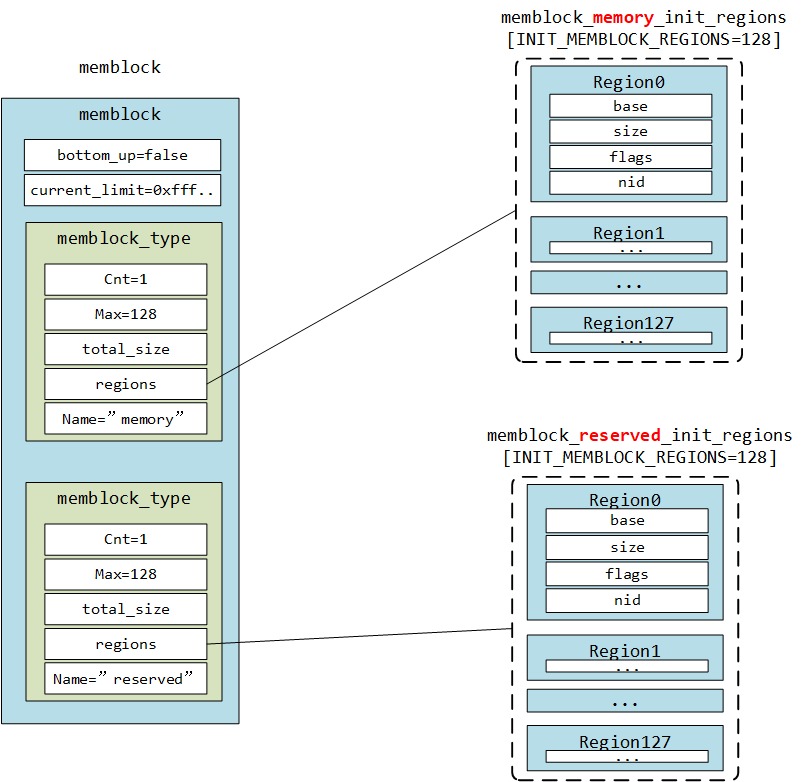
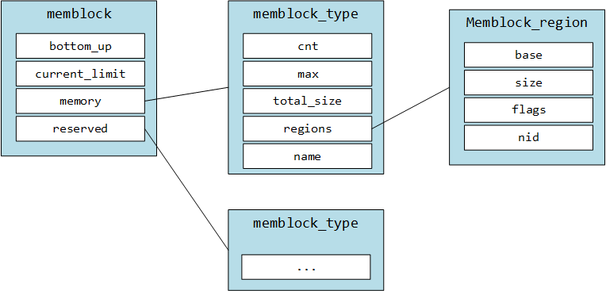
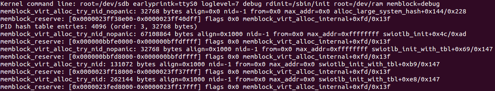

<center><font size='5'>Linux内核内存管理</font></center>
<center><font size='6'>内存块 - memblock</font></center>
<br/>
<br/>
<center><font size='5'>rtoax</font></center>
<center><font size='5'>2021年3月</font></center>
<br/>

* 在[英文原文](https://0xax.gitbook.io/linux-insides)基础上，针对[中文译文](https://xinqiu.gitbooks.io/linux-insides-cn)增加5.10.13内核源码相关内容。



# 1. 简介

内存管理是操作系统内核中最复杂的部分之一(我认为没有之一)。在[讲解内核进入点之前的准备工作](http://xinqiu.gitbooks.io/linux-insides-cn/content/Initialization/linux-initialization-3.html)时，我们在调用 `start_kernel` 函数前停止了讲解。`start_kernel` 函数在内核启动第一个 `init` 进程前初始化了所有的内核特性(包括那些依赖于架构的特性)。你也许还记得在引导时建立了**初期页表**、**识别页表**和**固定映射页表**，但是复杂的内存管理部分还没有开始工作。当 `start_kernel` 函数被调用时，我们会看到从初期内存管理到更复杂的内存管理数据结构和技术的转变。为了更好地理解内核的初始化过程，我们需要对这些技术有更清晰的理解。本章节是内存管理框架和 API 的不同部分的概述，从 `memblock` 开始。

# 2. 内存块

**内存块是在引导初期，泛用内核内存分配器还没有开始工作时对内存区域进行管理的方法之一。**以前它被称为 `逻辑内存块`，但是内核接纳了 [Yinghai Lu 提供的补丁](https://lkml.org/lkml/2010/7/13/68)后改名为 `memblock` 。`x86_64` 架构上的内核会使用这个方法。我们已经在[讲解内核进入点之前的准备工作](http://xinqiu.gitbooks.io/linux-insides-cn/content/Initialization/linux-initialization-3.html)时遇到过了它。现在是时候对它更加熟悉了。我们会看到它是被怎样实现的。

我们首先会学习 `memblock` 的数据结构。以下所有的数据结构都在 [include/linux/memblock.h](https://github.com/torvalds/linux/blob/master/include/linux/memblock.h) 头文件中定义。

第一个结构体的名字就叫做 `memblock`。它的定义如下：

```C
struct memblock {
     bool bottom_up;
     phys_addr_t current_limit;
     struct memblock_type memory;   //--> array of memblock_region
     struct memblock_type reserved; //--> array of memblock_region
#ifdef CONFIG_HAVE_MEMBLOCK_PHYS_MAP
     struct memblock_type physmem;
#endif
};
```

这个结构体包含五个域。第一个 `bottom_up` 域置为 `true` 时允许内存以自底向上模式进行分配。下一个域是 `current_limit` 这个域描述了内存块的尺寸限制。接下来的三个域描述了内存块的类型。内存块的类型可以是：被保留，内存和物理内存(如果 `CONFIG_HAVE_MEMBLOCK_PHYS_MAP` 编译配置选项被开启)。接下来我们来看看下一个数据结构- `memblock_type` 。让我们来看看它的定义：

```C
struct memblock_type {
	unsigned long cnt;
	unsigned long max;
	phys_addr_t total_size;
	struct memblock_region *regions;
};
```

这个结构体提供了关于内存类型的信息。它包含了描述当前内存块中内存区域的数量、所有内存区域的大小、内存区域的已分配数组的尺寸和指向 `memblock_region` 结构体数据的指针的域。`memblock_region` 结构体描述了一个内存区域，定义如下：

```C
struct memblock_region {
    phys_addr_t base;
    phys_addr_t size;
    unsigned long flags;
#ifdef CONFIG_HAVE_MEMBLOCK_NODE_MAP
    int nid;
#endif
};
```

`memblock_region` 提供了内存区域的基址和大小，`flags` 域可以是：

```C
#define MEMBLOCK_ALLOC_ANYWHERE	(~(phys_addr_t)0)
#define MEMBLOCK_ALLOC_ACCESSIBLE	0
#define MEMBLOCK_HOTPLUG	0x1
```

同时，如果 `CONFIG_HAVE_MEMBLOCK_NODE_MAP` 编译配置选项被开启， `memblock_region` 结构体也提供了整数域 - [numa](http://en.wikipedia.org/wiki/Non-uniform_memory_access) 节点选择器。

我们将以上部分想象为如下示意图：



```
+---------------------------+   +---------------------------+
|         memblock          |   |                           |
|  _______________________  |   |                           |
| |        memory         | |   |       Array of the        |
| |      memblock_type    |-|-->|      membock_region       |
| |_______________________| |   |                           |
|                           |   +---------------------------+
|  _______________________  |   +---------------------------+
| |       reserved        | |   |                           |
| |      memblock_type    |-|-->|       Array of the        |
| |_______________________| |   |      memblock_region      |
|                           |   |                           |
+---------------------------+   +---------------------------+
```

这三个结构体： `memblock`， `memblock_type` 和 `memblock_region` 是 `Memblock` 的主要组成部分。现在我们可以进一步了解 `Memblock` 和 它的初始化过程了。

# 3. 内存块初始化

所有 `memblock` 的 API 都在 [include/linux/memblock.h](https://github.com/torvalds/linux/blob/master/include/linux/memblock.h) 头文件中描述, 所有函数的实现都在 [mm/memblock.c](https://github.com/torvalds/linux/blob/master/mm/memblock.c) 源码中。首先我们来看一下源码的开头部分和 `memblock` 结构体的初始化吧。

```C
struct memblock memblock __initdata_memblock = {
	.memory.regions		= memblock_memory_init_regions,
	.memory.cnt		    = 1,
	.memory.max		    = INIT_MEMBLOCK_REGIONS,

	.reserved.regions	= memblock_reserved_init_regions,
	.reserved.cnt		= 1,
	.reserved.max		= INIT_MEMBLOCK_REGIONS,

#ifdef CONFIG_HAVE_MEMBLOCK_PHYS_MAP
	.physmem.regions	= memblock_physmem_init_regions,
	.physmem.cnt		= 1,
	.physmem.max		= INIT_PHYSMEM_REGIONS,
#endif
	.bottom_up		    = false,
	.current_limit		= MEMBLOCK_ALLOC_ANYWHERE,
};
```

在这里我们可以看到 `memblock` 结构体的同名变量的初始化。首先请注意 `__initdata_memblock` 。这个宏的定义就像这样：

```C
#ifdef CONFIG_ARCH_DISCARD_MEMBLOCK
    #define __init_memblock __meminit
    #define __initdata_memblock __meminitdata
#else
    #define __init_memblock
    #define __initdata_memblock
#endif
```

你会发现这个宏依赖于 `CONFIG_ARCH_DISCARD_MEMBLOCK` 。如果这个编译配置选项开启，内存块的代码会被放置在 `.init` 段，这样它就会在内核引导完毕后被释放掉。

接下来我们可以看看 `memblock_type memory` ， `memblock_type reserved` 和 `memblock_type physmem` 域的初始化。在这里我们只对 `memblock_type.regions` 的初始化过程感兴趣，请注意每一个 `memblock_type` 域都是 `memblock_region` 的数组初始化的：

```C
static struct memblock_region memblock_memory_init_regions[INIT_MEMBLOCK_REGIONS] __initdata_memblock;
static struct memblock_region memblock_reserved_init_regions[INIT_MEMBLOCK_REGIONS] __initdata_memblock;
#ifdef CONFIG_HAVE_MEMBLOCK_PHYS_MAP
static struct memblock_region memblock_physmem_init_regions[INIT_PHYSMEM_REGIONS] __initdata_memblock;
#endif
```

每个数组包含了 128 个内存区域。我们可以在 `INIT_MEMBLOCK_REGIONS` 宏定义中看到它：

```C
#define INIT_MEMBLOCK_REGIONS   128
```

请注意所有的数组定义中也用到了在 `memblock` 中使用过的 `__initdata_memblock` 宏(如果忘掉了就翻到上面重温一下)。

最后两个域描述了 `bottom_up` 分配是否被开启以及当前内存块的限制：

```C
#define MEMBLOCK_ALLOC_ANYWHERE (~(phys_addr_t)0)
```

这个限制是 `0xffffffffffffffff`.

On this step the initialization of the `memblock` structure has been finished and we can look on the Memblock API.
到此为止 `memblock` 结构体的初始化就结束了，我们可以开始看内存块相关 API 了。


# 4. 内存块应用程序接口

我们已经结束了 `memblock` 结构体的初始化讲解，现在我们要开始看内存块 API 和它的实现了。就像我上面说过的，所有 `memblock` 的实现都在 [mm/memblock.c](https://github.com/torvalds/linux/blob/master/mm/memblock.c) 中。为了理解 `memblock` 是怎样被实现和工作的，让我们先看看它的用法。内核中有[很多地方](http://lxr.free-electrons.com/ident?i=memblock)用到了内存块。举个例子，我们来看看 [arch/x86/kernel/e820.c](https://github.com/torvalds/linux/blob/master/arch/x86/kernel/e820.c#L1061) 中的 `memblock_x86_fill` 函数。这个函数使用了 [e820](http://en.wikipedia.org/wiki/E820) 提供的内存映射并使用 `memblock_add` 函数在 `memblock` 中添加了内核保留的内存区域。既然我们首先遇到了 `memblock_add` 函数，让我们从它开始讲解吧。

这个函数获取了**物理基址**和**内存区域的大小**并把它们加到了 `memblock` 中。`memblock_add` 函数本身没有做任何特殊的事情，它只是调用了

```C
memblock_add_range(&memblock.memory, base, size, MAX_NUMNODES, 0);
```

函数。我们将内存块类型 - `memory`，内存基址和内存区域大小，节点的最大数目和标志传进去。如果 `CONFIG_NODES_SHIFT` 没有被设置，最大节点数目就是 1，否则是 `1 << CONFIG_NODES_SHIFT`。`memblock_add_range` 函数将新的内存区域加到了内存块中，它首先检查传入内存区域的大小，如果是 0 就直接返回。然后，这个函数会用 `memblock_type` 来检查 `memblock` 中的内存区域是否存在。如果不存在，我们就简单地用给定的值填充一个新的 `memory_region` 然后返回(我们已经在[对内核内存管理框架的初览](http://xinqiu.gitbooks.io/linux-insides-cn/content/Initialization/linux-initialization-3.html)中看到了它的实现)。如果 `memblock_type` 不为空，我们就会使用提供的 `memblock_type` 将新的内存区域加到 `memblock` 中。

首先，我们获取了内存区域的结束点：

```C
phys_addr_t end = base + memblock_cap_size(base, &size);
```

`memblock_cap_size` 调整了 `size` 使 `base + size` 不会溢出。它的实现非常简单：

```C
static inline phys_addr_t memblock_cap_size(phys_addr_t base, phys_addr_t *size)
{
	return *size = min(*size, (phys_addr_t)ULLONG_MAX - base);
}
```

`memblock_cap_size` 返回了提供的值与 `ULLONG_MAX - base` 中的较小值作为新的尺寸。

之后，我们获得了新的内存区域的结束地址，`memblock_add_range` 会检查与已加入内存区域是否重叠以及能否合并。将新的内存区域插入 `memblock` 包含两步：

* 将新内存区域的不重叠部分作为单独的区域加入；
* 合并所有相接的区域。

我们会迭代所有的已存储内存区域来检查是否与新区域重叠：

```C
	for (i = 0; i < type->cnt; i++) {
		struct memblock_region *rgn = &type->regions[i];
		phys_addr_t rbase = rgn->base;
		phys_addr_t rend = rbase + rgn->size;

		if (rbase >= end)
			break;
		if (rend <= base)
			continue;
        ...
		...
		...
	}
```

如果新的内存区域不与已有区域重叠，直接插入。否则我们会检查这个新内存区域是否合适并调用 `memblock_double_array` 函数：

```C
while (type->cnt + nr_new > type->max)
	if (memblock_double_array(type, obase, size) < 0)
		return -ENOMEM;
	insert = true;
	goto repeat;
```

`memblock_double_array` 会将提供的区域数组长度加倍。然后我们会将 `insert` 置为 `true`，接着跳转到 `repeat` 标签。第二步，我们会从 `repeat` 标签开始，迭代同样的循环然后使用 `memblock_insert_region` 函数将当前内存区域插入内存块：

```C
	if (base < end) {
		nr_new++;
		if (insert)
			memblock_insert_region(type, i, base, end - base,
					       nid, flags);
	}
```

我们在第一步将 `insert` 置为 `true`，现在 `memblock_insert_region` 会检查这个标志。`memblock_insert_region` 的实现与我们将新区域插入空 `memblock_type` 的实现(看上面)几乎相同。这个函数会获取最后一个内存区域：

```C
struct memblock_region *rgn = &type->regions[idx];
```

然后用 `memmove` 拷贝这部分内存：

```C
memmove(rgn + 1, rgn, (type->cnt - idx) * sizeof(*rgn));
```

之后我们会填充 `memblock_region` 域，然后增长 `memblock_type` 的尺寸。在函数执行的结束，`memblock_add_range` 会调用 `memblock_merge_regions` 来在第二步合并相邻可合并的内存区域。

还有第二种情况，新的内存区域与已储存区域完全重叠。比如 `memblock` 中已经有了 `region1` :

```
0                    0x1000
+-----------------------+
|        region1        |
+-----------------------+
```

现在我们想在 `memblock` 中添加 `region2` ，它的基址和尺寸如下：

```
0x100                 0x2000
+-----------------------+
|        region2        |
+-----------------------+
```

在这种情况下，新内存区域的基址会被像下面这样设置：

```C
base = min(rend, end);
```

所以在我们设置的这种场景中，它会被设置为 `0x1000` 。然后我们会在第二步中将这个区域插入：

```
if (base < end) {
	nr_new++;
	if (insert)
		memblock_insert_region(type, i, base, end - base, nid, flags);
}
```

在这种情况下我们会插入 `overlapping portion` (我们之插入地址高的部分，因为低地址部分已经被包含在重叠区域里了)，然后会使用 `memblock_merge_regions` 合并剩余部分区域。就像我上文中所说的那样，这个函数会合并相邻的可合并区域。它会从给定的 `memblock_type` 遍历所有的内存区域，取出两个相邻区域 - `type->regions[i]` 和 `type->regions[i + 1]`，并检查他们是否拥有同样的标志，是否属于同一个节点，第一个区域的末尾地址是否与第二个区域的基地址相同。

```C
while (i < type->cnt - 1) {
	struct memblock_region *this = &type->regions[i];
	struct memblock_region *next = &type->regions[i + 1];
	if (this->base + this->size != next->base ||
	    memblock_get_region_node(this) !=
	    memblock_get_region_node(next) ||
	    this->flags != next->flags) {
		BUG_ON(this->base + this->size > next->base);
		i++;
		continue;
	}
```

如果上面所说的这些条件全部符合，我们就会更新第一个区域的长度，将第二个区域的长度加上去。

```C
this->size += next->size;
```

我们在更新第一个区域的长度同时，会使用 `memmove` 将后面的所有区域向前移动一个下标。

```C
memmove(next, next + 1, (type->cnt - (i + 2)) * sizeof(*next));
```

然后将 `memblock_type` 中内存区域的数量减一：

```C
type->cnt--;
```

经过这些操作后我们就成功地将两个内存区域合并了：

```
0                                             0x2000
+------------------------------------------------+
|                   region1                      |
+------------------------------------------------+
```

这就是 `memblock_add_range` 函数的工作原理和执行过程。

同样还有一个 `memblock_reserve` 函数与 `memblock_add` 几乎完成同样的工作，只有一点不同： `memblock_reserve` 将 `memblock_type.reserved` 而不是 `memblock_type.memory` 储存到内存块中。

当然这不是全部的 API。内存块不仅提供了添加 `memory` 和 `reserved` 内存区域，还提供了：

* memblock_remove - 从内存块中移除内存区域；
* memblock_find_in_range - 寻找给定范围内的未使用区域；
* memblock_free - 释放内存块中的内存区域；
* for_each_mem_range - 迭代遍历内存块区域。

等等......

# 5. 获取内存区域的相关信息

内存块还提供了获取 `memblock` 中已分配内存区域信息的 API。包括两部分：

* get_allocated_memblock_memory_regions_info - 获取有关内存区域的信息；
* get_allocated_memblock_reserved_regions_info - 获取有关保留区域的信息。

这些函数的实现都很简单。以 `get_allocated_memblock_reserved_regions_info` 为例：

```C
phys_addr_t __init_memblock get_allocated_memblock_reserved_regions_info(
					phys_addr_t *addr)
{
	if (memblock.reserved.regions == memblock_reserved_init_regions)
		return 0;

	*addr = __pa(memblock.reserved.regions);

	return PAGE_ALIGN(sizeof(struct memblock_region) *
			  memblock.reserved.max);
}
```

这个函数首先会检查 `memblock` 是否包含保留内存区域。如果否，就直接返回 0 。否则函数将保留内存区域的物理地址写到传入的数组中，然后返回已分配数组的对齐后尺寸。注意函数使用 `PAGE_ALIGN` 这个宏实现对齐。实际上这个宏依赖于页的尺寸：

```C
#define PAGE_ALIGN(addr) ALIGN(addr, PAGE_SIZE)
```

`get_allocated_memblock_memory_regions_info` 函数的实现是基本一样的。只有一处不同，`get_allocated_memblock_memory_regions_info` 使用  `memblock_type.memory` 而不是 `memblock_type.reserved` 。

# 6. 内存块的相关除错技术

在内存块的实现中有许多对 `memblock_dbg` 的调用。如果在内核命令行中传入 `memblock=debug` 选项，这个函数就会被调用。实际上 `memblock_dbg` 是 `printk` 的一个拓展宏：

```C
#define memblock_dbg(fmt, ...) \
         if (memblock_debug) printk(KERN_INFO pr_fmt(fmt), ##__VA_ARGS__)
```

比如你可以在 `memblock_reserve` 函数中看到对这个宏的调用：

```C
memblock_dbg("memblock_reserve: [%#016llx-%#016llx] flags %#02lx %pF\n",
		     (unsigned long long)base,
		     (unsigned long long)base + size - 1,
		     flags, (void *)_RET_IP_);
```

然后你将看到类似下图的画面：



内存块技术也支持 [debugfs](http://en.wikipedia.org/wiki/Debugfs) 。如果你不是在 `X86` 架构下运行内核，你可以访问：

* /sys/kernel/debug/memblock/memory
* /sys/kernel/debug/memblock/reserved
* /sys/kernel/debug/memblock/physmem

来获取 `memblock` 内容的核心转储信息。

# 7. 结束语

讲解内核内存管理的第一部分到此结束，如果你有任何的问题或者建议，你可以直接发消息给我[twitter](https://twitter.com/0xAX)，也可以给我发[邮件](anotherworldofworld@gmail.com)或是直接创建一个 [issue](https://github.com/MintCN/linux-insides-zh/issues/new)。

**英文不是我的母语。如果你发现我的英文描述有任何问题，请提交一个PR到[linux-insides](https://github.com/MintCN/linux-insides-zh).**

# 8. 相关连接

* [e820](http://en.wikipedia.org/wiki/E820)
* [numa](http://en.wikipedia.org/wiki/Non-uniform_memory_access)
* [debugfs](http://en.wikipedia.org/wiki/Debugfs)
* [对内核内存管理框架的初览](http://xinqiu.gitbooks.io/linux-insides-cn/content/Initialization/linux-initialization-3.html)


<center><font size='6'>英文原文</font></center>

Linux kernel memory management Part 1.
================================================================================

Introduction
--------------------------------------------------------------------------------

Memory management is one of the most complex (and I think that it is the most complex) part of the operating system kernel. In the [last preparations before the kernel entry point](https://0xax.gitbook.io/linux-insides/summary/initialization/linux-initialization-3) part we stopped right before call of the `start_kernel` function. This function initializes all the kernel features (including architecture-dependent features) before the kernel runs the first `init` process. You may remember as we built early page tables, identity page tables and fixmap page tables in the boot time. No complicated memory management is working yet. When the `start_kernel` function is called we will see the transition to more complex data structures and techniques for memory management. For a good understanding of the initialization process in the linux kernel we need to have a clear understanding of these techniques. This chapter will provide an overview of the different parts of the linux kernel memory management framework and its API, starting from the `memblock`.

Memblock
--------------------------------------------------------------------------------

Memblock is one of the methods of managing memory regions during the early bootstrap period while the usual kernel memory allocators are not up and
running yet. Previously it was called `Logical Memory Block`, but with the [patch](https://lkml.org/lkml/2010/7/13/68) by Yinghai Lu, it was renamed to the `memblock`. As Linux kernel for `x86_64` architecture uses this method. We already met `memblock` in the [Last preparations before the kernel entry point](https://0xax.gitbook.io/linux-insides/summary/initialization/linux-initialization-3) part. And now it's time to get acquainted with it closer. We will see how it is implemented.

We will start to learn `memblock` from the data structures. Definitions of all logical-memory-block-related data structures can be found in the [include/linux/memblock.h](https://github.com/torvalds/linux/blob/16f73eb02d7e1765ccab3d2018e0bd98eb93d973/include/linux/memblock.h) header file.

The first structure has the same name as this part and it is:

```C
struct memblock {
         bool bottom_up;
         phys_addr_t current_limit;
         struct memblock_type memory;   --> array of memblock_region
         struct memblock_type reserved; --> array of memblock_region
#ifdef CONFIG_HAVE_MEMBLOCK_PHYS_MAP
         struct memblock_type physmem;
#endif
};
```

This structure contains five fields. First is `bottom_up` which allows allocating memory in bottom-up mode when it is `true`. Next field is `current_limit`. This field describes the limit size of the memory block. The next three fields describe the type of the memory block. It can be: reserved, memory and physical memory (physical memory is available if the `CONFIG_HAVE_MEMBLOCK_PHYS_MAP` configuration option is enabled). Now we see yet another data structure - `memblock_type`. Let's look at its definition:

```C
struct memblock_type {
	unsigned long cnt;
	unsigned long max;
	phys_addr_t total_size;
	struct memblock_region *regions;
};
```

This structure provides information about the memory type. It contains fields which describe the number of memory regions inside the current memory block, the size of all memory regions, the size of the allocated array of the memory regions, and a pointer to the array of the `memblock_region` structures. `memblock_region` is a structure which describes a memory region. Its definition is:

```C
struct memblock_region {
        phys_addr_t base;
        phys_addr_t size;
        unsigned long flags;
#ifdef CONFIG_HAVE_MEMBLOCK_NODE_MAP
        int nid;
#endif
};
```

`memblock_region` provides the base address and size of the memory region as well as a flags field which can have the following values:

```C
enum {
    MEMBLOCK_NONE	= 0x0,	/* No special request */
    MEMBLOCK_HOTPLUG	= 0x1,	/* hotpluggable region */
    MEMBLOCK_MIRROR	= 0x2,	/* mirrored region */
    MEMBLOCK_NOMAP	= 0x4,	/* don't add to kernel direct mapping */
};
```

Also `memblock_region` provides an integer field - [numa](http://en.wikipedia.org/wiki/Non-uniform_memory_access) node selector, if the `CONFIG_HAVE_MEMBLOCK_NODE_MAP` configuration option is enabled.

Schematically we can imagine it as:

```
+---------------------------+   +---------------------------+
|         memblock          |   |                           |
|  _______________________  |   |                           |
| |        memory         | |   |       Array of the        |
| |      memblock_type    |-|-->|      memblock_region      |
| |_______________________| |   |                           |
|                           |   +---------------------------+
|  _______________________  |   +---------------------------+
| |       reserved        | |   |                           |
| |      memblock_type    |-|-->|       Array of the        |
| |_______________________| |   |      memblock_region      |
|                           |   |                           |
+---------------------------+   +---------------------------+
```

These three structures: `memblock`, `memblock_type` and `memblock_region` are main in the `Memblock`. Now we know about it and can look at Memblock initialization process.

Memblock initialization
--------------------------------------------------------------------------------

As all API of the `memblock` are described in the [include/linux/memblock.h](https://github.com/torvalds/linux/blob/16f73eb02d7e1765ccab3d2018e0bd98eb93d973/include/linux/memblock.h) header file, all implementations of these functions are in the [mm/memblock.c](https://github.com/torvalds/linux/blob/16f73eb02d7e1765ccab3d2018e0bd98eb93d973/mm/memblock.c) source code file. Let's look at the top of the source code file and we will see the initialization of the `memblock` structure:

```C
struct memblock memblock __initdata_memblock = {
	.memory.regions		= memblock_memory_init_regions,
	.memory.cnt		    = 1,
	.memory.max		    = INIT_MEMBLOCK_REGIONS,

	.reserved.regions	= memblock_reserved_init_regions,
	.reserved.cnt		= 1,
	.reserved.max		= INIT_MEMBLOCK_REGIONS,

#ifdef CONFIG_HAVE_MEMBLOCK_PHYS_MAP
	.physmem.regions	= memblock_physmem_init_regions,
	.physmem.cnt		= 1,
	.physmem.max		= INIT_PHYSMEM_REGIONS,
#endif
	.bottom_up		    = false,
	.current_limit		= MEMBLOCK_ALLOC_ANYWHERE,
};
```

Here we can see initialization of the `memblock` structure which has the same name as structure - `memblock`. First of all note the `__initdata_memblock`. Definition of this macro looks like:

```C
#ifdef CONFIG_ARCH_DISCARD_MEMBLOCK
    #define __init_memblock __meminit
    #define __initdata_memblock __meminitdata
#else
    #define __init_memblock
    #define __initdata_memblock
#endif
```

You can see that it depends on `CONFIG_ARCH_DISCARD_MEMBLOCK`. If this configuration option is enabled, memblock code will be put into the `.init` section and will be released after the kernel is booted up.

Next we can see the initialization of the `memblock_type memory`, `memblock_type reserved` and `memblock_type physmem` fields of the `memblock` structure. Here we are interested only in the `memblock_type.regions` initialization process. Note that every `memblock_type` field is initialized by and array of `memblock_region`s:

```C
static struct memblock_region memblock_memory_init_regions[INIT_MEMBLOCK_REGIONS] __initdata_memblock;
static struct memblock_region memblock_reserved_init_regions[INIT_MEMBLOCK_REGIONS] __initdata_memblock;
#ifdef CONFIG_HAVE_MEMBLOCK_PHYS_MAP
static struct memblock_region memblock_physmem_init_regions[INIT_PHYSMEM_REGIONS] __initdata_memblock;
#endif
```

Every array contains 128 memory regions. We can see it in the `INIT_MEMBLOCK_REGIONS` macro definition:

```C
#define INIT_MEMBLOCK_REGIONS   128
```

Note that all arrays are also defined with the `__initdata_memblock` macro which we already saw in the `memblock` structure initialization (read above if you've forgotten).

The last two fields describe that `bottom_up` allocation is disabled and the limit of the current Memblock is:

```C
#define MEMBLOCK_ALLOC_ANYWHERE (~(phys_addr_t)0)
```

which is `0xffffffffffffffff`.

On this step the initialization of the `memblock` structure has been finished and we can have a look at the Memblock API.

Memblock API
--------------------------------------------------------------------------------

Ok we have finished with the initialization of the `memblock` structure and now we can look at the Memblock API and its implementation. As I said above, the implementation of `memblock` is taking place fully in [mm/memblock.c](https://github.com/torvalds/linux/blob/16f73eb02d7e1765ccab3d2018e0bd98eb93d973/mm/memblock.c). To understand how `memblock` works and how it is implemented, let's look at its usage first. There are a couple of [places](http://lxr.free-electrons.com/ident?i=memblock) in the linux kernel where memblock is used. For example let's take `memblock_x86_fill` function from the [arch/x86/kernel/e820.c](https://github.com/torvalds/linux/blob/16f73eb02d7e1765ccab3d2018e0bd98eb93d973/arch/x86/kernel/e820.c#L1061). This function goes through the memory map provided by the [e820](http://en.wikipedia.org/wiki/E820) and adds memory regions reserved by the kernel to the `memblock` with the `memblock_add` function. Since we have met the `memblock_add` function first, let's start from it.

This function takes a physical base address and the size of the memory region as arguments and add them to the `memblock`. The `memblock_add` function does not do anything special in its body, but just calls the:

```C
memblock_add_range(&memblock.memory, base, size, MAX_NUMNODES, 0);
```

function. We pass the memory block type - `memory`, the physical base address and the size of the memory region, the maximum number of nodes which is 1 if `CONFIG_NODES_SHIFT` is not set in the configuration file or `1 << CONFIG_NODES_SHIFT` if it is set, and the flags. The `memblock_add_range` function adds a new memory region to the memory block. It starts by checking the size of the given region and if it is zero it just returns. After this, `memblock_add_range` checks the existence of the memory regions in the `memblock` structure with the given `memblock_type`. If there are no memory regions, we just fill a new `memory_region` with the given values and return (we already saw the implementation of this in the [First touch of the linux kernel memory manager framework](https://0xax.gitbook.io/linux-insides/summary/initialization/linux-initialization-3)). If `memblock_type` is not empty, we start to add a new memory region to the `memblock` with the given `memblock_type`.

First of all we get the end of the memory region with the:

```C
phys_addr_t end = base + memblock_cap_size(base, &size);
```

`memblock_cap_size` adjusts `size` that `base + size` will not overflow. Its implementation is pretty easy:

```C
static inline phys_addr_t memblock_cap_size(phys_addr_t base, phys_addr_t *size)
{
	return *size = min(*size, (phys_addr_t)ULLONG_MAX - base);
}
```

`memblock_cap_size` returns the new size which is the smallest value between the given size and `ULLONG_MAX - base`.

After that we have the end address of the new memory region, `memblock_add_range` checks for overlap and merge conditions with memory regions that have been added before. Insertion of the new memory region to the `memblock` consists of two steps:

* Adding of non-overlapping parts of the new memory area as separate regions;
* Merging of all neighboring regions.

We are going through all the already stored memory regions and checking for overlap with the new region:

```C
	for (i = 0; i < type->cnt; i++) {
		struct memblock_region *rgn = &type->regions[i];
		phys_addr_t rbase = rgn->base;
		phys_addr_t rend = rbase + rgn->size;

		if (rbase >= end)
			break;
		if (rend <= base)
			continue;
        ...
		...
		...
	}
```

If the new memory region does not overlap with regions which are already stored in the `memblock`, insert this region into the memblock with and this is first step, we check if the new region can fit into the memory block and call `memblock_double_array` in another way:

```C
while (type->cnt + nr_new > type->max)
	if (memblock_double_array(type, obase, size) < 0)
		return -ENOMEM;
	insert = true;
	goto repeat;
```

`memblock_double_array` doubles the size of the given regions array. Then we set `insert` to `true` and go to the `repeat` label. In the second step, starting from the `repeat` label we go through the same loop and insert the current memory region into the memory block with the `memblock_insert_region` function:

```C
	if (base < end) {
		nr_new++;
		if (insert)
			memblock_insert_region(type, i, base, end - base,
					       nid, flags);
	}
```

Since we set `insert` to `true` in the first step, now `memblock_insert_region` will be called. `memblock_insert_region` has almost the same implementation that we saw when we inserted a new region to the empty `memblock_type` (see above). This function gets the last memory region:

```C
struct memblock_region *rgn = &type->regions[idx];
```

and copies the memory area with `memmove`:

```C
memmove(rgn + 1, rgn, (type->cnt - idx) * sizeof(*rgn));
```

After this fills `memblock_region` fields of the new memory region base, size, etc. and increases size of the `memblock_type`. In the end of the execution, `memblock_add_range` calls `memblock_merge_regions` which merges neighboring compatible regions in the second step.

In the second case the new memory region can overlap already stored regions. For example we already have `region1` in the `memblock`:

```
0                    0x1000
+-----------------------+
|                       |
|                       |
|        region1        |
|                       |
|                       |
+-----------------------+
```

And now we want to add `region2` to the `memblock` with the following base address and size:

```
0x100                 0x2000
+-----------------------+
|                       |
|                       |
|        region2        |
|                       |
|                       |
+-----------------------+
```

In this case set the base address of the new memory region as the end address of the overlapped region with:

```C
base = min(rend, end);
```

So it will be `0x1000` in our case. And insert it as we did it already in the second step with:

```
if (base < end) {
	nr_new++;
	if (insert)
		memblock_insert_region(type, i, base, end - base, nid, flags);
}
```

In this case we insert `overlapping portion` (we insert only the higher portion, because the lower portion is already in the overlapped memory region), then the remaining portion and merge these portions with `memblock_merge_regions`. As I said above `memblock_merge_regions` function merges neighboring compatible regions. It goes through all memory regions from the given `memblock_type`, takes two neighboring memory regions - `type->regions[i]` and `type->regions[i + 1]` and checks that these regions have the same flags, belong to the same node and that the end address of the first regions is not equal to the base address of the second region:

```C
while (i < type->cnt - 1) {
	struct memblock_region *this = &type->regions[i];
	struct memblock_region *next = &type->regions[i + 1];
	if (this->base + this->size != next->base ||
	    memblock_get_region_node(this) !=
	    memblock_get_region_node(next) ||
	    this->flags != next->flags) {
		BUG_ON(this->base + this->size > next->base);
		i++;
		continue;
	}
```

If none of these conditions are true, we update the size of the first region with the size of the next region:

```C
this->size += next->size;
```

As we update the size of the first memory region with the size of the next memory region, we move all memory regions which are after the (`next`) memory region one index backwards with the `memmove` function:

```C
memmove(next, next + 1, (type->cnt - (i + 2)) * sizeof(*next));
```

The `memmove` here moves all regions which are located after the `next` region to the base address of the `next` region. In the end we just decrease the count of the memory regions which belong to the `memblock_type`:

```C
type->cnt--;
```

After this we will get two memory regions merged into one:

```
0                                             0x2000
+------------------------------------------------+
|                                                |
|                                                |
|                   region1                      |
|                                                |
|                                                |
+------------------------------------------------+
```

As we decreased counts of regions in a memblock with certain type, increased size of the `this` region and shifted all regions which are located after `next` region to its place.

That's all. This is the whole principle of the work of the `memblock_add_range` function.

There is also `memblock_reserve` function which does the same as `memblock_add`, but with one difference. It stores `memblock_type.reserved` in the memblock instead of `memblock_type.memory`.

Of course this is not the full API. Memblock provides APIs not only for adding `memory` and `reserved` memory regions, but also:

* memblock_remove - removes memory region from memblock;
* memblock_find_in_range - finds free area in given range;
* memblock_free - releases memory region in memblock;
* for_each_mem_range - iterates through memblock areas.

and many more....

Getting info about memory regions
--------------------------------------------------------------------------------

Memblock also provides an API for getting information about allocated memory regions in the `memblock`. It is split in two parts:

* get_allocated_memblock_memory_regions_info - getting info about memory regions;
* get_allocated_memblock_reserved_regions_info - getting info about reserved regions.

Implementation of these functions is easy. Let's look at `get_allocated_memblock_reserved_regions_info` for example:

```C
phys_addr_t __init_memblock get_allocated_memblock_reserved_regions_info(
					phys_addr_t *addr)
{
	if (memblock.reserved.regions == memblock_reserved_init_regions)
		return 0;

	*addr = __pa(memblock.reserved.regions);

	return PAGE_ALIGN(sizeof(struct memblock_region) *
			  memblock.reserved.max);
}
```

First of all this function checks that `memblock` contains reserved memory regions. If `memblock` does not contain reserved memory regions we just return zero. Otherwise we write the physical address of the reserved memory regions array to the given address and return aligned size of the allocated array. Note that there is `PAGE_ALIGN` macro used for align. Actually it depends on size of page:

```C
#define PAGE_ALIGN(addr) ALIGN(addr, PAGE_SIZE)
```

Implementation of the `get_allocated_memblock_memory_regions_info` function is the same. It has only one difference, `memblock_type.memory` used instead of `memblock_type.reserved`.

Memblock debugging
--------------------------------------------------------------------------------

There are many calls to `memblock_dbg` in the memblock implementation. If you pass the `memblock=debug` option to the kernel command line, this function will be called. Actually `memblock_dbg` is just a macro which expands to `printk`:

```C
#define memblock_dbg(fmt, ...) \
         if (memblock_debug) printk(KERN_INFO pr_fmt(fmt), ##__VA_ARGS__)
```

For example you can see a call of this macro in the `memblock_reserve` function:

```C
memblock_dbg("memblock_reserve: [%#016llx-%#016llx] flags %#02lx %pF\n",
		     (unsigned long long)base,
		     (unsigned long long)base + size - 1,
		     flags, (void *)_RET_IP_);
```

And you will see something like this:


Memblock also has support in [debugfs](http://en.wikipedia.org/wiki/Debugfs). If you run the kernel on another architecture than `X86` you can access:

* /sys/kernel/debug/memblock/memory
* /sys/kernel/debug/memblock/reserved
* /sys/kernel/debug/memblock/physmem

to get a dump of the `memblock` contents.

Conclusion
--------------------------------------------------------------------------------

This is the end of the first part about linux kernel memory management. If you have questions or suggestions, ping me on twitter [0xAX](https://twitter.com/0xAX), drop me an [email](mailto:anotherworldofworld@gmail.com) or just create an [issue](https://github.com/0xAX/linux-insides/issues/new).

**Please note that English is not my first language and I am really sorry for any inconvenience. If you found any mistakes please send me a PR to [linux-insides](https://github.com/0xAX/linux-insides).**

Links
--------------------------------------------------------------------------------

* [e820](http://en.wikipedia.org/wiki/E820)
* [numa](http://en.wikipedia.org/wiki/Non-uniform_memory_access)
* [debugfs](http://en.wikipedia.org/wiki/Debugfs)
* [First touch of the linux kernel memory manager framework](https://0xax.gitbook.io/linux-insides/summary/initialization/linux-initialization-3)


