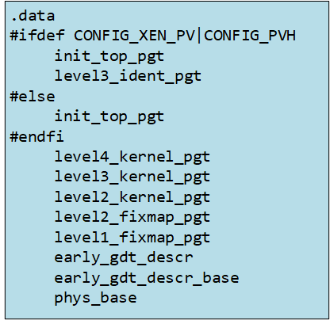

<center><font size='5'>Linux内核内存管理</font></center>
<center><font size='6'>固定映射地址(fixmap)和输入输出重映射(ioremap)</font></center>
<br/>
<br/>
<center><font size='5'>rtoax</font></center>
<center><font size='5'>2021年3月</font></center>
<br/>

* 在[英文原文](https://0xax.gitbook.io/linux-insides)基础上，针对[中文译文](https://xinqiu.gitbooks.io/linux-insides-cn)增加5.10.13内核源码相关内容。

[Print kernel's page table entries](https://stackoverflow.com/questions/20069620/print-kernels-page-table-entries)

四级页表的虚拟内存映射：
```c
Virtual memory map with 4 level page tables:
0000000000000000 - 00007fffffffffff (=47 bits) user space, different per mm
ffff800000000000 - ffff80ffffffffff (=40 bits) guard hole
ffff880000000000 - ffffc7ffffffffff (=64 TB) direct mapping of all phys. memory
ffffc80000000000 - ffffc8ffffffffff (=40 bits) hole
ffffc90000000000 - ffffe8ffffffffff (=45 bits) vmalloc/ioremap space
ffffe90000000000 - ffffe9ffffffffff (=40 bits) hole
ffffea0000000000 - ffffeaffffffffff (=40 bits) virtual memory map (1TB)
ffffffff80000000 - ffffffffa0000000 (=512 MB)  kernel text mapping, from phys 0
ffffffffa0000000 - fffffffffff00000 (=1536 MB) module mapping space
```

arch/x86/mm/dump_pagetables.c

# 1. 固定映射地址和输入输出重映射

**固定映射地址是一组特殊的编译时确定的地址**，它们与物理地址不一定具有减 `__START_KERNEL_map` 的线性映射关系。每一个固定映射的地址都会映射到一个内存页，内核会像指针一样使用它们，但是绝不会修改它们的地址。这是这种地址的主要特点。就像注释所说的那样，“在编译期就获得一个常量地址，只有在引导阶段才会被设定上物理地址。”你在本书的[前面部分](http://xinqiu.gitbooks.io/linux-insides-cn/content/Initialization/linux-initialization-1.html)可以看到，我们已经设定了 `level2_fixmap_pgt` ：

```assembly
NEXT_PAGE(level2_fixmap_pgt)
	.fill	506,8,0
	.quad	level1_fixmap_pgt - __START_KERNEL_map + _PAGE_TABLE
	.fill	5,8,0

NEXT_PAGE(level1_fixmap_pgt)
	.fill	512,8,0
```

就像我们看到的， `level2_fixmap_pgt` 紧挨着 `level2_kernel_pgt` 保存了内核的 code+data+bss 段。每一个固定映射的地址都由一个整数下标表示，这些整数下标在 [arch/x86/include/asm/fixmap.h](https://github.com/torvalds/linux/blob/master/arch/x86/include/asm/fixmap.h) 的 `fixed_addresses` 枚举类型中定义。比如，它包含了`VSYSCALL_PAGE` 的入口 - 如果合法的 vsyscall 页模拟机制被开启，或是启用了本地 [apic](http://en.wikipedia.org/wiki/Advanced_Programmable_Interrupt_Controller) 的 `FIX_APIC_BASE` 选项等等。在虚拟内存中，固定映射区域被放置在模块区域中：

```
       +-----------+-----------------+---------------+------------------+
	   |kernel text|      kernel     |               |    vsyscalls     |
	   | mapping   |       text      |    Modules    |    fix-mapped    |
       |from phys 0|       data      |               |    addresses     |
       +-----------+-----------------+---------------+------------------+
__START_KERNEL_map   __START_KERNEL    MODULES_VADDR            0xffffffffffffffff
```

这点在5.10.13中并不一致，比如说我的结果为：
```c
ffffffffffffffff : 0xffffffffffffffff
ffffffffff7ff000 : FIXADDR_TOP
ffffffffff600000 : fix_to_virt(VSYSCALL_PAGE)
ffffffffff5ff000 : fix_to_virt(FIX_DBGP_BASE)
ffffffffff5fc000 : fix_to_virt(FIX_APIC_BASE)
ffffffffff5fb000 : fix_to_virt(FIX_IO_APIC_BASE_0)
ffffffffff57b000 : fix_to_virt(FIX_PARAVIRT_BOOTMAP)
ffffffffff57a000 : fix_to_virt(FIX_APEI_GHES_IRQ)
ffffffffff579000 : fix_to_virt(FIX_APEI_GHES_NMI)
ffffffffff578000 : FIXADDR_START
ffffffffff578000 : fix_to_virt(__end_of_permanent_fixed_addresses)
ffffffffff3ff000 : fix_to_virt(FIX_BTMAP_END)
ffffffffff200000 : fix_to_virt(FIX_BTMAP_BEGIN)
ffffffffff1ff000 : fix_to_virt(FIX_TBOOT_BASE)
ffffffffff1fe000 : fix_to_virt(__end_of_fixed_addresses)
ffffffffc0000000 : MODULES_VADDR
ffffffff81000000 : __START_KERNEL
ffffffff80000000 : __START_KERNEL_map
```

基虚拟地址和固定映射区域的尺寸使用以下两个宏表示：

```C
#define FIXADDR_SIZE	(__end_of_permanent_fixed_addresses << PAGE_SHIFT)
#define FIXADDR_START		(FIXADDR_TOP - FIXADDR_SIZE)
```

在这里 `__end_of_permanent_fixed_addresses` 是 `fixed_addresses` 枚举中的一个元素，如我上文所说：每一个固定映射地址都由一个定义在 `fixed_addresses` 中的整数下标表示。`PAGE_SHIFT` 决定了页的大小。比如，我们可以使用 `1 << PAGE_SHIFT` 来获取一页的大小。在我们的场景下需要获取固定映射区域的尺寸，而不仅仅是一页的大小，这就是我们使用 `__end_of_permanent_fixed_addresses` 来获取固定映射区域尺寸的原因。在我的系统中这个值可能略大于 `536` KB。在你的系统上这个值可能会不同，因为这个值取决于固定映射地址的数目，而这个数目又取决于内核的配置。

The second `FIXADDR_START` macro just substracts fix-mapped area size from the last address of the fix-mapped area to get its base virtual address. `FIXADDR_TOP` is a rounded up address from the base address of the [vsyscall](https://lwn.net/Articles/446528/) space:
第二个 `FIXADDR_START` 宏只是从固定映射区域的末地址减去了固定映射区域的尺寸，这样就可以获得它的基虚拟地址。 `FIXADDR_TOP` 是一个从 [vsyscall](https://lwn.net/Articles/446528/) 空间的基址取整产生的地址：

```C
#define FIXADDR_TOP     (round_up(VSYSCALL_ADDR + PAGE_SIZE, 1<<PMD_SHIFT) - PAGE_SIZE)
```

`fixed_addresses` 枚举量被 `fix_to_virt` 函数用做下标用于获取虚拟地址。这个函数的实现很简单：

```C
static __always_inline unsigned long fix_to_virt(const unsigned int idx)
{
    BUILD_BUG_ON(idx >= __end_of_fixed_addresses);
    return __fix_to_virt(idx);
}
```

首先它调用 `BUILD_BUG_ON` 宏检查了给定的 `fixed_addresses` 枚举量不大于等于 `__end_of_fixed_addresses`，然后返回了 `__fix_to_virt` 宏的运算结果：

```C
#define __fix_to_virt(x)        (FIXADDR_TOP - ((x) << PAGE_SHIFT))
```

在这里我们用 `PAGE_SHIFT` 左移了给定的固定映射地址下标，就像我上文所述它决定了页的地址，然后将 `FIXADDR_TOP` 减去这个值，`FIXADDR_TOP` 是固定映射区域的最高地址。以下是从虚拟地址获取对应固定映射地址的转换函数：

```C
static inline unsigned long virt_to_fix(const unsigned long vaddr)
{
    BUG_ON(vaddr >= FIXADDR_TOP || vaddr < FIXADDR_START);
    return __virt_to_fix(vaddr);
}
```

`virt_to_fix` 以虚拟地址为参数，检查了这个地址是否位于 `FIXADDR_START` 和 `FIXADDR_TOP` 之间，然后调用 `__virt_to_fix` ，这个宏实现如下：

```C
#define __virt_to_fix(x)        ((FIXADDR_TOP - ((x)&PAGE_MASK)) >> PAGE_SHIFT)
```

一个 PFN 是一块页大小物理内存的下标。一个物理地址的 PFN 可以简单地定义为 `(page_phys_addr >> PAGE_SHIFT)`；

`__virt_to_fix` 会清空给定地址的前 12 位，然后用固定映射区域的末地址(`FIXADDR_TOP`)减去它并右移 `PAGE_SHIFT` 即 12 位。让我们来解释它的工作原理。就像我已经写的那样，这个宏会使用 `x & PAGE_MASK` 来清空前 12 位。然后我们用 `FIXADDR_TOP` 减去它，就会得到 `FIXADDR_TOP` 的后 12 位。我们知道虚拟地址的前 12 位代表这个页的偏移量，当我们右移 `PAGE_SHIFT` 后就会得到 `Page frame number` ，即虚拟地址的所有位，包括最开始的 12 个偏移位。固定映射地址在[内核中多处使用](http://lxr.free-electrons.com/ident?i=fix_to_virt)。 `IDT` 描述符保存在这里，[英特尔可信赖执行技术](http://en.wikipedia.org/wiki/Trusted_Execution_Technology) UUID 储存在固定映射区域，以 `FIX_TBOOT_BASE` 下标开始。另外， [Xen](http://en.wikipedia.org/wiki/Xen) 引导映射等也储存在这个区域。我们已经在[内核初始化的第五部分](http://xinqiu.gitbooks.io/linux-insides-cn/content/Initialization/linux-initialization-5.html)看到了一部分关于固定映射地址的知识。接下来让我们看看什么是 `ioremap`，看看它是怎样实现的，与固定映射地址又有什么关系呢？

这里给个小程序：
```c
#include <stdio.h>

#define CONFIG_PHYSICAL_ALIGN 0x200000
#define CONFIG_PHYSICAL_START 0x1000000 /* (16 MB) */

#define __round_mask(x, y) ((__typeof__(x))((y)-1))
#define round_up(x, y) ((((x)-1) | __round_mask(x, y))+1)
#define round_down(x, y) ((x) & ~ __round_mask(x, y))

#define __ALIGN_KERNEL(x, a)		__ALIGN_KERNEL_MASK(x, (typeof(x))(a) - 1)
#define __ALIGN_KERNEL_MASK(x, mask)	(((x) + (mask)) & ~(mask))
#define ALIGN(x, a)		__ALIGN_KERNEL((x), (a))

#define PAGE_SHIFT		12
#define PAGE_SIZE		(1UL << PAGE_SHIFT)
#define PAGE_MASK		(~(PAGE_SIZE-1))


#define PGDIR_SHIFT		39
#define PUD_SHIFT	30
#define PMD_SHIFT	21

#define PMD_SIZE	(1UL << PMD_SHIFT)
#define PMD_MASK	(~(PMD_SIZE - 1))
#define PUD_SIZE	(1UL << PUD_SHIFT)
#define PUD_MASK	(~(PUD_SIZE - 1))

#define PTRS_PER_PGD		512
#define PTRS_PER_PUD	512
#define PTRS_PER_PMD	512
#define PTRS_PER_PTE	512

#define VSYSCALL_ADDR (-10UL << 20)

#define FIXADDR_TOP	(round_up(VSYSCALL_ADDR + PAGE_SIZE, 1<<PMD_SHIFT) - \
					 PAGE_SIZE)

#define FIXADDR_SIZE	(__end_of_permanent_fixed_addresses << PAGE_SHIFT)
#define FIXADDR_START		(FIXADDR_TOP - FIXADDR_SIZE)

#define __START_KERNEL_map	0xffffffff80000000UL/* kernel 起始地址 */
#define __START_KERNEL		(__START_KERNEL_map + __PHYSICAL_START) /*  */

#define __PHYSICAL_START /*  */	ALIGN(CONFIG_PHYSICAL_START, \
						      CONFIG_PHYSICAL_ALIGN)

#define KERNEL_IMAGE_SIZE	(1024 * 1024 * 1024)

#define MODULES_VADDR		(__START_KERNEL_map + KERNEL_IMAGE_SIZE)


#define NR_FIX_BTMAPS		64
#define FIX_BTMAPS_SLOTS	8
#define TOTAL_FIX_BTMAPS	(NR_FIX_BTMAPS * FIX_BTMAPS_SLOTS)


#define MAX_IO_APICS 128
#define MAX_LOCAL_APIC 32768

#define __fix_to_virt(x)	(FIXADDR_TOP - ((x) << PAGE_SHIFT))
#define __virt_to_fix(x)	((FIXADDR_TOP - ((x)&PAGE_MASK)) >> PAGE_SHIFT)

enum fixed_addresses {  /* 每个固定映射的地址都由一个整数索引表示 */
	VSYSCALL_PAGE = (FIXADDR_TOP - VSYSCALL_ADDR) >> PAGE_SHIFT,    /* =  `511`*/
	FIX_DBGP_BASE,
	FIX_EARLYCON_MEM_BASE,
	FIX_OHCI1394_BASE,
	FIX_APIC_BASE,	/* local (CPU) APIC) -- required for SMP or not */
	FIX_IO_APIC_BASE_0,
	FIX_IO_APIC_BASE_END = FIX_IO_APIC_BASE_0 + MAX_IO_APICS - 1,
	FIX_PARAVIRT_BOOTMAP,
	FIX_APEI_GHES_IRQ,
	FIX_APEI_GHES_NMI,

	__end_of_permanent_fixed_addresses,/*  */

	FIX_BTMAP_END =
	 (__end_of_permanent_fixed_addresses ^
	  (__end_of_permanent_fixed_addresses + TOTAL_FIX_BTMAPS - 1)) &
	 -PTRS_PER_PTE
	 ? __end_of_permanent_fixed_addresses + TOTAL_FIX_BTMAPS -
	   (__end_of_permanent_fixed_addresses & (TOTAL_FIX_BTMAPS - 1))
	 : __end_of_permanent_fixed_addresses,
	FIX_BTMAP_BEGIN = FIX_BTMAP_END + TOTAL_FIX_BTMAPS - 1,
	FIX_TBOOT_BASE,
	__end_of_fixed_addresses
};

static __always_inline unsigned long fix_to_virt(const unsigned int idx)
{
	//BUILD_BUG_ON(idx >= __end_of_fixed_addresses);
	return __fix_to_virt(idx);
}

static inline unsigned long virt_to_fix(const unsigned long vaddr)
{
	//BUG_ON(vaddr >= FIXADDR_TOP || vaddr < FIXADDR_START);
	return __virt_to_fix(vaddr);
}

#define print_mm(v) printf("%016lx : %s\n", v, #v);

static void print_fixmap() {
	print_mm(__PHYSICAL_START);
	print_mm(PAGE_MASK);
    print_mm(FIXADDR_SIZE);
    
	print_mm(0xffffffffffffffff);
	print_mm(FIXADDR_TOP);
    print_mm(fix_to_virt(VSYSCALL_PAGE));
    print_mm(fix_to_virt(FIX_DBGP_BASE));
    print_mm(fix_to_virt(FIX_APIC_BASE));
    print_mm(fix_to_virt(FIX_IO_APIC_BASE_0));
    print_mm(fix_to_virt(FIX_PARAVIRT_BOOTMAP));
    print_mm(fix_to_virt(FIX_APEI_GHES_IRQ));
    print_mm(fix_to_virt(FIX_APEI_GHES_NMI));
	print_mm(FIXADDR_START);
    
    print_mm(fix_to_virt(__end_of_permanent_fixed_addresses));
    print_mm(fix_to_virt(FIX_BTMAP_END));
    print_mm(fix_to_virt(FIX_BTMAP_BEGIN));
    print_mm(fix_to_virt(FIX_TBOOT_BASE));
    print_mm(fix_to_virt(__end_of_fixed_addresses));
	print_mm(MODULES_VADDR);
	print_mm(__START_KERNEL);
	print_mm(__START_KERNEL_map);

}

int main() {
    print_fixmap();
}
```

# 2. 输入输出重映射

内核提供了许多不同的**内存管理原语**。现在我们将要接触 `I/O 内存`。每一个设备都通过读写它的寄存器来控制。比如，驱动可以通过向它的寄存器中写来打开或关闭设备，也可以通过读它的寄存器来获取设备状态。除了寄存器之外，许多设备都拥有一块可供驱动读写的缓冲区。如我们所知，现在有两种方法来访问设备的寄存器和数据缓冲区：

* 通过 I/O 端口；
* 将所有寄存器映射到内存地址空间；

第一种情况，设备的所有控制寄存器都具有一个输入输出端口号。该设备的驱动可以用 `in` 和 `out` 指令来从端口中读写。你可以通过访问 `/proc/ioports` 来获取设备当前的 I/O 端口号。

```
$ cat /proc/ioports
0000-0cf7 : PCI Bus 0000:00
  0000-001f : dma1
  0020-0021 : pic1
  0040-0043 : timer0
  0050-0053 : timer1
  0060-0060 : keyboard
  0064-0064 : keyboard
  0070-0077 : rtc0
  0080-008f : dma page reg
  00a0-00a1 : pic2
  00c0-00df : dma2
  00f0-00ff : fpu
    00f0-00f0 : PNP0C04:00
  03c0-03df : vesafb
  03f8-03ff : serial
  04d0-04d1 : pnp 00:06
  0800-087f : pnp 00:01
  0a00-0a0f : pnp 00:04
  0a20-0a2f : pnp 00:04
  0a30-0a3f : pnp 00:04
0cf8-0cff : PCI conf1
0d00-ffff : PCI Bus 0000:00
...
...
...
```


`/proc/ioports` 提供了驱动使用 I/O 端口的内存区域地址。所有的这些内存区域，比如 `0000-0cf7` ，都是使用 [include/linux/ioport.h](https://github.com/torvalds/linux/blob/master/include/linux/ioport.h) 头文件中的 `request_region` 来声明的。实际上 `request_region` 是一个宏，它的定义如下：

```C
#define request_region(start,n,name)   __request_region(&ioport_resource, (start), (n), (name), 0)
```

正如我们所看见的，它有三个参数：

* `start` - 区域的起点;
* `n`     - 区域的长度;
* `name`  - 区域需求者的名字。

`request_region` 分配 I/O 端口区域。通常在 `request_region` 之前会调用 `check_region` 来检查传入的地址区间是否可用，然后 `release_region` 会释放这个内存区域。`request_region` 返回指向 `resource` 结构体的指针。 `resource` 结构体是对系统资源的树状子集的抽象。我们已经在[内核初始化的第五部分](http://xinqiu.gitbooks.io/linux-insides-cn/content/Initialization/linux-initialization-5.html)见到过它了，它的定义是这样的：

```C
struct resource {
    resource_size_t start;
    resource_size_t end;
    const char *name;
    unsigned long flags;
	unsigned long desc; //5.10.13+++++++++++++
    struct resource *parent, *sibling, *child;
    //+-------------+      +-------------+
    //|    parent   |------|    sibling  |
    //+-------------+      +-------------+
    //       |
    //+-------------+
    //|    child    | 
    //+-------------+
};
```

它包含起止地址、名字等等。每一个 `resource` 结构体包含一个指向 `parent`、`slibling` 和 `child` 资源的指针。它有父节点和子节点，这就意味着每一个资源的子集都有一个根节点。比如，对 I/O 端口来说有一个 `ioport_resource` 结构体：

```C
struct resource ioport_resource = {
    .name   = "PCI IO",
    .start  = 0,
    .end    = IO_SPACE_LIMIT,
    .flags  = IORESOURCE_IO,
};
EXPORT_SYMBOL(ioport_resource);
```

或者对 `iomem` 来说，有一个 `iomem_resource` 结构体：

```C
struct resource iomem_resource = {
    .name   = "PCI mem",
    .start  = 0,
    .end    = -1,
    .flags  = IORESOURCE_MEM,
};
```

就像我所写的，`request_region` 用于注册 I/O 端口区域，这个宏用于[内核中的许多地方](http://lxr.free-electrons.com/ident?i=request_region)。比如让我们来看看 [drivers/char/rtc.c](https://github.com/torvalds/linux/blob/master/char/rtc.c)。这个源文件提供了内核中的[实时时钟](http://en.wikipedia.org/wiki/Real-time_clock)接口。与其他内核模块一样， `rtc` 模块包含一个 `module_init` 定义：

```C
module_init(rtc_init);
```

在这里 `rtc_init` 是 `rtc` 模块的初始化函数。这个函数也定义在 `rtc.c` 文件中。在 `rtc_init` 函数中我们可以看到许多对 `rtc_request_region` 函数的调用，实际上这是 `request_region` 的包装：

```C
r = rtc_request_region(RTC_IO_EXTENT);
```

`rtc_request_region` 中调用了:

```C
r = request_region(RTC_PORT(0), size, "rtc");
```

在这里 `RTC_TO_EXTENT` 是一个内存区域的尺寸，在这里是 `0x8`， `"rtc"` 是区域的名字，`RTC_PORT` 是：

```C
#define RTC_PORT(x)     (0x70 + (x))
```

所以使用 `request_region(RTC_PORT(0), size, "rtc")` 我们注册了一个内存区域， 以 `0x70` 开始，大小为 `0x8`。 让我们看看 `/proc/ioports`:

```
~$ sudo cat /proc/ioports | grep rtc
0070-0077 : rtc0
```

看，我们可以获取了它的信息。这就是**端口**。第二种途径是使用 I/O 内存。就像我上面写的，这是将设备的控制寄存器和内存映射到内存地址空间中。I/O 内存是一组由设备通过总线提供给 CPU 的相邻的地址。所有的 I/O 映射地址都不能由内核直接访问。有一个 `ioremap` 函数用来将总线上的物理地址转化为内核的虚拟地址，或者说，`ioremap` 映射了 I/O 物理地址来让他们能够在内核中使用。这个函数有两个参数：

* 内存区域的开始；
* 内存区域的结束；

I/O 内存映射 API 提供了用来检查、请求与释放内存区域的函数，就像 I/O 端口 API 一样。这里有三个函数：

* `request_mem_region`
* `release_mem_region`
* `check_mem_region`

```
~$ sudo cat /proc/iomem
...
...
...
be826000-be82cfff : ACPI Non-volatile Storage
be82d000-bf744fff : System RAM
bf745000-bfff4fff : reserved
bfff5000-dc041fff : System RAM
dc042000-dc0d2fff : reserved
dc0d3000-dc138fff : System RAM
dc139000-dc27dfff : ACPI Non-volatile Storage
dc27e000-deffefff : reserved
defff000-deffffff : System RAM
df000000-dfffffff : RAM buffer
e0000000-feafffff : PCI Bus 0000:00
  e0000000-efffffff : PCI Bus 0000:01
    e0000000-efffffff : 0000:01:00.0
  f7c00000-f7cfffff : PCI Bus 0000:06
    f7c00000-f7c0ffff : 0000:06:00.0
    f7c10000-f7c101ff : 0000:06:00.0
      f7c10000-f7c101ff : ahci
  f7d00000-f7dfffff : PCI Bus 0000:03
    f7d00000-f7d3ffff : 0000:03:00.0
      f7d00000-f7d3ffff : alx
...
...
...
```

这些地址中的一部分源于对 `e820_reserve_resources` 函数的调用。我们可以在 [arch/x86/kernel/setup.c](https://github.com/torvalds/linux/blob/master/arch/x86/kernel/setup.c) 中找到对这个函数的调用，这个函数本身定义在 [arch/x86/kernel/e820.c](https://github.com/torvalds/linux/blob/master/arch/x86/kernel/e820.c) 中。这个函数遍历了 [e820](http://en.wikipedia.org/wiki/E820) 的**映射**然后将内存区域插入了根 `iomen` 结构体中。所有具有以下类型的 `e820` 内存区域都会被插入到 `iomem` 结构体中：

```C
static inline const char *e820_type_to_string(int e820_type)
{
	switch (e820_type) {
	case E820_RESERVED_KERN:
	case E820_RAM:	return "System RAM";
	case E820_ACPI:	return "ACPI Tables";
	case E820_NVS:	return "ACPI Non-volatile Storage";
	case E820_UNUSABLE:	return "Unusable memory";
	default:	return "reserved";
	}
}
```

我们可以在 `/proc/iomem` 中看到它们。

现在让我们尝试着理解 `ioremap` 是如何工作的。我们已经了解了一部分 `ioremap` 的知识，我们在[内核初始化的第五部分](http://xinqiu.gitbooks.io/linux-insides-cn/content/Initialization/linux-initialization-5.html)见过它。如果你读了那个章节，你就会记得 [arch/x86/mm/ioremap.c](https://github.com/torvalds/linux/blob/master/arch/x86/mm/ioremap.c) 文件中对 `early_ioremap_init` 函数的调用。对 `ioremap` 的初始化分为两个部分：有一部分在我们正常使用 `ioremap` 之前，但是要首先进行 `vmalloc` 的初始化并调用 `paging_init` 才能进行正常的 `ioremap` 调用。我们现在还不了解 `vmalloc` 的知识，先看看第一部分的初始化。首先 `early_ioremap_init` 会检查固定映射是否与页中部目录对齐：

```C
BUILD_BUG_ON((fix_to_virt(0) + PAGE_SIZE) & ((1 << PMD_SHIFT) - 1));
```

更多关于 `BUILD_BUG_ON` 的内容你可以在[内核初始化的第一部分](http://xinqiu.gitbooks.io/linux-insides-cn/content/Initialization/linux-initialization-1.html)看到。如果给定的表达式为真，`BUILD_BUG_ON` 宏就会抛出一个编译时错误。在检查后的下一步，我们可以看到对 `early_ioremap_setup` 函数的调用，这个函数定义在 [mm/early_ioremap.c](https://github.com/torvalds/linux/blob/master/mm/early_ioremap.c) 文件中。这个函数代表了对 `ioremap` 的大体初始化。`early_ioremap_setup` 函数用初期固定映射的地址填充了 `slot_virt` 数组。所有初期固定映射地址在内存中都在 `__end_of_permanent_fixed_addresses` 后面，它们从 `FIX_BITMAP_BEGIN` 开始，到 `FIX_BITMAP_END` 结束。实际上初期 `ioremap` 会使用 `512` 个临时引导时映射：

```
#define NR_FIX_BTMAPS		64
#define FIX_BTMAPS_SLOTS	8
#define TOTAL_FIX_BTMAPS	(NR_FIX_BTMAPS * FIX_BTMAPS_SLOTS)
```

`early_ioremap_setup` 如下：

```C
void __init early_ioremap_setup(void)
{
    int i;

    for (i = 0; i < FIX_BTMAPS_SLOTS; i++)
            if (WARN_ON(prev_map[i]))
                    break;

    for (i = 0; i < FIX_BTMAPS_SLOTS; i++)
            slot_virt[i] = __fix_to_virt(FIX_BTMAP_BEGIN - NR_FIX_BTMAPS*i);
}
```

`slot_virt` 和其他数组定义在同一个源文件中：

```C
static void __iomem *prev_map[FIX_BTMAPS_SLOTS] __initdata;
static unsigned long prev_size[FIX_BTMAPS_SLOTS] __initdata;
static unsigned long slot_virt[FIX_BTMAPS_SLOTS] __initdata;
```

`slot_virt` 包含了固定映射区域的虚拟地址，`prev_map` 数组包含了初期 `ioremap` 区域的地址。注意我在上文中提到的：`实际上初期 ioremap 会使用 512 个临时引导时映射`，同时你可以看到所有的数组都使用 `__initdata` 定义，这意味着这些内存都会在内核初始化结束后释放掉。在 `early_ioremap_setup` 结束后，我们获得了页中部目录，以 `early_ioremap_pmd` 函数开始的早期 `ioremap`，`early_ioremap_pmd` 函数只能获得内存全局目录以及为给定地址计算页中部目录：

```C
static inline pmd_t * __init early_ioremap_pmd(unsigned long addr)
{
	pgd_t *base = __va(read_cr3());
	pgd_t *pgd = &base[pgd_index(addr)];
	pud_t *pud = pud_offset(pgd, addr);
	pmd_t *pmd = pmd_offset(pud, addr);
	return pmd;
}
```

之后我们用 0 填充 `bm_pte` (早期 `ioremap` 页表入口)，然后调用 `pmd_populate_kernel` 函数：

```C
pmd = early_ioremap_pmd(fix_to_virt(FIX_BTMAP_BEGIN));
memset(bm_pte, 0, sizeof(bm_pte));
pmd_populate_kernel(&init_mm, pmd, bm_pte);
```

`pmd_populate_kernel` 函数有三个参数:

* `init_mm` - `init` 进程的内存描述符 (你可以在[前文](http://xinqiu.gitbooks.io/linux-insides-cn/content/Initialization/linux-initialization-5.html)中看到)；
* `pmd`     - `ioremap` 固定映射开始处的页中部目录；
* `bm_pte`  - 初期 `ioremap` 页表入口数组定义为：

```C
static pte_t bm_pte[PAGE_SIZE/sizeof(pte_t)] __page_aligned_bss;
```

 `pmd_popularte_kernel` 函数定义在 [arch/x86/include/asm/pgalloc.h](https://github.com/torvalds/linux/blob/master/arch/x86/include/asm/pgalloc.h) 中。它会用给定的页表入口(`bm_pte`)生成给定页中部目录(`pmd`):

```C
static inline void pmd_populate_kernel(struct mm_struct *mm,
                                       pmd_t *pmd, pte_t *pte)
{
        paravirt_alloc_pte(mm, __pa(pte) >> PAGE_SHIFT);
        set_pmd(pmd, __pmd(__pa(pte) | _PAGE_TABLE));
}
```

`set_pmd` 声明如下：

```C
#define set_pmd(pmdp, pmd)              native_set_pmd(pmdp, pmd)
```

`native_set_pmd` 声明如下：

```C
static inline void native_set_pmd(pmd_t *pmdp, pmd_t pmd)
{
        *pmdp = pmd;
}
```

到这里 初期 `ioremap` 就可以使用了。在 `early_ioremap_init` 函数中有许多检查，但是都不重要，总之 `ioremap` 的初始化结束了。

# 3. 初期输入输出重映射的使用

初期 `ioremap` 初始化完成后，我们就能使用它了。它提供了两个函数：

* early_ioremap
* early_iounmap

用于从 IO 物理地址 映射/解除映射 到虚拟地址。这俩函数都依赖于 `CONFIG_MMU` 编译配置选项。[内存管理单元](http://en.wikipedia.org/wiki/Memory_management_unit)是内存管理的一种特殊块。这种块的主要用途是将物理地址转换为虚拟地址。技术上看内存管理单元可以从 `cr3` 控制寄存器中获取高等级页表地址(`pgd`)。如果 `CONFIG_MMU` 选项被设为 `n`，`early_ioremap` 就会直接返回物理地址，而 `early_iounmap` 就会什么都不做。另一方面，如果设为 `y` ，`early_ioremap` 就会调用 `__early_ioremap`，它有三个参数：

* `phys_addr` - 要映射到虚拟地址上的 I/O 内存区域的基物理地址；
* `size` - I/O 内存区域的尺寸；
* `prot` - 页表入口位。

在 `__early_ioremap` 中我们首先遍历了所有初期 `ioremap` 固定映射槽并检查 `prev_map` 数组中第一个空闲元素，然后将这个值存在了 `slot` 变量中，另外设置了尺寸：

```C
slot = -1;
for (i = 0; i < FIX_BTMAPS_SLOTS; i++) {
	if (!prev_map[i]) {
		slot = i;
		break;
	}
}
...
...
...
prev_size[slot] = size;
last_addr = phys_addr + size - 1;
```

在下一步中我们会看到以下代码：

```C
offset = phys_addr & ~PAGE_MASK;
phys_addr &= PAGE_MASK;
size = PAGE_ALIGN(last_addr + 1) - phys_addr;
```

在这里我们使用了 `PAGE_MASK` 用于清空除前 12 位之外的整个 `phys_addr`。`PAGE_MASK` 宏定义如下：

```C
#define PAGE_MASK       (~(PAGE_SIZE-1))
```

我们知道页的尺寸是 4096 个字节或用二进制表示为 `1000000000000` 。`PAGE_SIZE - 1` 就会是 `111111111111` ，但是使用 `~` 运算后我们就会得到 `000000000000` ，然后使用 `~PAGE_MASK` 又会返回 `111111111111` 。在第二行我们做了同样的事情但是只是清空了前 12 个位，然后在第三行获取了这个区域的页对齐尺寸。我们获得了对齐区域，接下来就需要获取新的 `ioremap` 区域所占用的页的数量然后计算固定映射下标：

```C
nrpages = size >> PAGE_SHIFT;
idx = FIX_BTMAP_BEGIN - NR_FIX_BTMAPS*slot;
```

现在我们用给定的物理地址填充了固定映射区域。循环中的每一次迭代，我们都调用一次 [arch/x86/mm/ioremap.c](https://github.com/torvalds/linux/blob/master/arch/x86/mm/ioremap.c) 中的 `__early_set_fixmap` 函数，为给定的物理地址加上页的大小 `4096`，然后更新下标和页的数量：

```C
while (nrpages > 0) {
	__early_set_fixmap(idx, phys_addr, prot);
	phys_addr += PAGE_SIZE;
	--idx;
    --nrpages;
}
```

 `__early_set_fixmap` 函数为给定的物理地址获取了页表入口(保存在 `bm_pte` 中，见上文)：

```C
pte = early_ioremap_pte(addr);
```

在 `early_ioremap_pte` 的下一步中我们用 `pgprot_val` 宏检查了给定的页标志，依赖这个标志选择调用 `set_pte` 还是 `pte_clear` ：

```C
if (pgprot_val(flags))
		set_pte(pte, pfn_pte(phys >> PAGE_SHIFT, flags));
	else
		pte_clear(&init_mm, addr, pte);
```

就像你看到的，我们将 `FIXMAP_PAGE_IO` 作为标志传入了 `__early_ioremap`。`FIXMPA_PAGE_IO` 从以下

```C
(__PAGE_KERNEL_EXEC | _PAGE_NX)
```

标志拓展而来， 所以我们调用 `set_pte` 来设置页表入口，就像 `set_pmd` 一样，只不过用于 `PTE`(见上文)。我们在循环中设定了所有 `PTE`，我们可以看到 `__flush_tlb_one` 的函数调用：

```C
__flush_tlb_one(addr);
```

这个函数定义在 [arch/x86/include/asm/tlbflush.h](https://github.com/torvalds/linux/blob/master/arch/x86/include/asm/tlbflush.h)中，并通过判断 `cpu_has_invlpg` 的值来决定调用 `__flush_tlb_single` 还是 `__flush_tlb` ：

```C
static inline void __flush_tlb_one(unsigned long addr)
{
    if (cpu_has_invlpg)
            __flush_tlb_single(addr);
    else
            __flush_tlb();
}
```

`__flush_tlb_one` 函数使 [TLB](http://en.wikipedia.org/wiki/Translation_lookaside_buffer) 中的给定地址失效。就像你看到的我们更新了页结构，但是 `TLB` 还没有改变，这就是我们需要手动做这件事情的原因。有两种方法做这件事。第一种是更新 `cr3` 寄存器， `__flush_tlb` 函数就是这么做的：

```C
native_write_cr3(native_read_cr3());
```

第二种方法是使用 `invlpg` 命令来使 `TLB` 入口失效。让我们看看  `__flush_tlb_one` 的实现。就像我们所看到的，它首先检查了 `cpu_has_invlpg` ，定义如下：

```C
#if defined(CONFIG_X86_INVLPG) || defined(CONFIG_X86_64)
# define cpu_has_invlpg         1
#else
# define cpu_has_invlpg         (boot_cpu_data.x86 > 3)
#endif
```

如果 CPU 支持 `invlpg` 指令，我们就调用 `__flush_tlb_single` 宏，它拓展自 `__native_flush_tlb_single`：

```C
static inline void __native_flush_tlb_single(unsigned long addr)
{
        asm volatile("invlpg (%0)" ::"r" (addr) : "memory");
}
```

`__flush_tlb` 的调用只是更新了 `cr3` 寄存器。在这步结束之后 `__early_set_fixmap` 函数就执行完了，我们又可以回到 `__early_ioremap` 的实现了。因为我们为给定的地址设定了固定映射区域，我们需要将 I/O 重映射的区域的基虚拟地址用 `slot` 下标保存在 `prev_map` 数组中。

```C
prev_map[slot] = (void __iomem *)(offset + slot_virt[slot]);
```

然后返回它。

第二个函数是 `early_iounmap` ，它会解除对一个 I/O 内存区域的映射。这个函数有两个参数：基地址和 I/O 区域的大小，这看起来与 `early_ioremap` 很像。它同样遍历了固定映射槽并寻找给定地址的槽。这样它就获得了这个固定映射槽的下标，然后通过判断 `after_paging_init` 的值决定是调用 `__late_clear_fixmap` 还是 `__early_set_fixmap` 。当这个值是 0 时会调用 `__early_set_fixmap`。最终它会将 I/O 内存区域设为 `NULL`：

```C
prev_map[slot] = NULL;
```

这就是关于 `fixmap` 和 `ioremap` 的全部内容。当然这部分不可能包含所有 `ioremap` 的特性，仅仅是讲解了初期 `ioremap`，常规的 `ioremap` 没有讲。这主要是因为在讲解它之前需要了解更多内容才行。

就是这样！

# 4. 结束语

讲解内核内存管理的第一部分到此结束，如果你有任何的问题或者建议，你可以直接发消息给我[twitter](https://twitter.com/0xAX)，也可以给我发[邮件](anotherworldofworld@gmail.com)或是直接创建一个 [issue](https://github.com/MintCN/linux-insides-zh/issues/new)。

**英文不是我的母语。如果你发现我的英文描述有任何问题，请提交一个PR到[linux-insides](https://github.com/MintCN/linux-insides-zh).**

# 5. 相关连接

* [apic](http://en.wikipedia.org/wiki/Advanced_Programmable_Interrupt_Controller)
* [vsyscall](https://lwn.net/Articles/446528/)
* [Intel Trusted Execution Technology](http://en.wikipedia.org/wiki/Trusted_Execution_Technology)
* [Xen](http://en.wikipedia.org/wiki/Xen)
* [Real Time Clock](http://en.wikipedia.org/wiki/Real-time_clock)
* [e820](http://en.wikipedia.org/wiki/E820)
* [Memory management unit](http://en.wikipedia.org/wiki/Memory_management_unit)
* [TLB](http://en.wikipedia.org/wiki/Translation_lookaside_buffer)
* [Paging](http://xinqiu.gitbooks.io/linux-insides-cn/content/Theory/linux-theory-1.html)
* [内核内存管理第一部分](http://xinqiu.gitbooks.io/linux-insides-cn/content/MM/linux-mm-1.html)

<center><font size='6'>英文原文</font></center>


Linux kernel memory management Part 2.
================================================================================

Fix-Mapped Addresses and ioremap
--------------------------------------------------------------------------------

`Fix-Mapped` addresses are a set of special compile-time addresses whose corresponding physical addresses do not have to be a linear address minus `__START_KERNEL_map`. Each fix-mapped address maps one page frame and the kernel uses them as pointers that never change their address. That is the main point of these addresses. As the comment says: `to have a constant address at compile time, but to set the physical address only in the boot process`. You can remember that in the earliest [part](https://0xax.gitbook.io/linux-insides/summary/initialization/linux-initialization-1), we already set the `level2_fixmap_pgt`:

```assembly
NEXT_PAGE(level2_fixmap_pgt)
	.fill	506,8,0
	.quad	level1_fixmap_pgt - __START_KERNEL_map + _PAGE_TABLE
	.fill	5,8,0

NEXT_PAGE(level1_fixmap_pgt)
	.fill	512,8,0
```

As you can see `level2_fixmap_pgt` is right after the `level2_kernel_pgt` which is kernel code+data+bss. Every fix-mapped address is represented by an integer index which is defined in the `fixed_addresses` enum from the [arch/x86/include/asm/fixmap.h](https://github.com/torvalds/linux/blob/16f73eb02d7e1765ccab3d2018e0bd98eb93d973/arch/x86/include/asm/fixmap.h). For example it contains entries for `VSYSCALL_PAGE` - if emulation of legacy vsyscall page is enabled, `FIX_APIC_BASE` for local [apic](http://en.wikipedia.org/wiki/Advanced_Programmable_Interrupt_Controller), etc. In virtual memory fix-mapped area is placed in the modules area:

```
       +-----------+-----------------+---------------+------------------+
       |           |                 |               |                  |
       |kernel text|      kernel     |               |    vsyscalls     |
       | mapping   |       text      |    Modules    |    fix-mapped    |
       |from phys 0|       data      |               |    addresses     |
       |           |                 |               |                  |
       +-----------+-----------------+---------------+------------------+
__START_KERNEL_map   __START_KERNEL    MODULES_VADDR            0xffffffffffffffff
```

Base virtual address and size of the `fix-mapped` area are presented by the two following macro:

```C
#define FIXADDR_SIZE	(__end_of_permanent_fixed_addresses << PAGE_SHIFT)
#define FIXADDR_START	(FIXADDR_TOP - FIXADDR_SIZE)
```

Here `__end_of_permanent_fixed_addresses` is an element of the `fixed_addresses` enum and as I wrote above: Every fix-mapped address is represented by an integer index which is defined in the `fixed_addresses`. `PAGE_SHIFT` determines the size of a page. For example size of the one page we can get with the `1 << PAGE_SHIFT` expression.

In our case we need to get the size of the fix-mapped area, but not only of one page, that's why we are using `__end_of_permanent_fixed_addresses` for getting the size of the fix-mapped area. The `__end_of_permanent_fixed_addresses` is the last index of the `fixed_addresses` enum or in other words the `__end_of_permanent_fixed_addresses` contains amount of pages in a fixed-mapped area. So if multiply value of the `__end_of_permanent_fixed_addresses` on a page size value we will get size of fix-mapped area. In my case it's a little more than `536` kilobytes. In your case it might be a different number, because the size depends on amount of the fix-mapped addresses which are depends on your kernel's configuration.

The second `FIXADDR_START` macro just subtracts the fix-mapped area size from the last address of the fix-mapped area to get its base virtual address. `FIXADDR_TOP` is a rounded up address from the base address of the [vsyscall](https://lwn.net/Articles/446528/) space:

```C
#define FIXADDR_TOP     (round_up(VSYSCALL_ADDR + PAGE_SIZE, 1<<PMD_SHIFT) - PAGE_SIZE)
```

The `fixed_addresses` enums are used as an index to get the virtual address by the `fix_to_virt` function. Implementation of this function is easy:
 
```C
static __always_inline unsigned long fix_to_virt(const unsigned int idx)
{
        BUILD_BUG_ON(idx >= __end_of_fixed_addresses);
        return __fix_to_virt(idx);
}
```

first of all it checks that the index given for the `fixed_addresses` enum is not greater or equal than `__end_of_fixed_addresses` with the `BUILD_BUG_ON` macro and then returns the result of the `__fix_to_virt` macro:

```C
#define __fix_to_virt(x)        (FIXADDR_TOP - ((x) << PAGE_SHIFT))
```

Here we shift left the given index of a `fix-mapped` area on the `PAGE_SHIFT` which determines size of a page as I wrote above and subtract it from the `FIXADDR_TOP` which is the highest address of the `fix-mapped` area:

```
+-----------------+ 
|    PAGE 1       | FIXADDR_TOP (virt address)
|    PAGE 2       |
|    PAGE 3       |
|    PAGE 4 (idx) | x - 4
|    PAGE 5       |
+-----------------+
```

There is an inverse function for getting an index of a fix-mapped area corresponding to the given virtual address:

```C
static inline unsigned long virt_to_fix(const unsigned long vaddr)
{
        BUG_ON(vaddr >= FIXADDR_TOP || vaddr < FIXADDR_START);
        return __virt_to_fix(vaddr);
}
```

The `virt_to_fix` takes a virtual address, checks that this address is between `FIXADDR_START` and `FIXADDR_TOP` and calls the `__virt_to_fix` macro which implemented as:

```C
#define __virt_to_fix(x)        ((FIXADDR_TOP - ((x)&PAGE_MASK)) >> PAGE_SHIFT)
```

As we may see, the `__virt_to_fix` macro clears the first `12` bits in the given virtual address, subtracts it from the last address the of `fix-mapped` area (`FIXADDR_TOP`) and shifts the result right on `PAGE_SHIFT` which is `12`. Let me explain how it works.

As in previous example (in `__fix_to_virt` macro), we start from the top of the fix-mapped area. We also go back to bottom from the top to search an index of a fix-mapped area corresponding to the given virtual address. As you may see, first of all we will clear the first `12` bits in the given virtual address with `x & PAGE_MASK` expression. This allows us to get base address of page. We need to do this for case when the given virtual address points somewhere in a beginning/middle or end of a page, but not to the base address of it. At the next step subtract this from the `FIXADDR_TOP` and this gives us virtual address of a corresponding page in a fix-mapped area. In the end we just divide value of this address on `PAGE_SHIFT`. This gives us index of a fix-mapped area corresponding to the given virtual address. It may looks hard, but if you will go through this step by step, you will be sure that the `__virt_to_fix` macro is pretty easy.

That's all. For this moment we know a little about `fix-mapped` addresses, but this is enough to go next.

`Fix-mapped` addresses are used in different [places](http://lxr.free-electrons.com/ident?i=fix_to_virt) in the linux kernel. `IDT` descriptor stored there, [Intel Trusted Execution Technology](http://en.wikipedia.org/wiki/Trusted_Execution_Technology) UUID stored in the `fix-mapped` area started from `FIX_TBOOT_BASE` index, [Xen](http://en.wikipedia.org/wiki/Xen) bootmap and many more... We already saw a little about `fix-mapped` addresses in the fifth [part](https://0xax.gitbook.io/linux-insides/summary/initialization/linux-initialization-5) about of the linux kernel initialization. We use `fix-mapped` area in the early `ioremap` initialization. Let's look at it more closely and try to understand what `ioremap` is, how it is implemented in the kernel and how it is related to the `fix-mapped` addresses.

ioremap
--------------------------------------------------------------------------------

The Linux kernel provides many different primitives to manage memory. For this moment we will touch `I/O memory`. Every device is controlled by reading/writing from/to its registers. For example a driver can turn off/on a device by writing to its registers or get the state of a device by reading from its registers. Besides registers, many devices have buffers where a driver can write something or read from there. As we know for this moment there are two ways to access device's registers and data buffers:

* through the I/O ports;
* mapping of the all registers to the memory address space;

In the first case every control register of a device has a number of input and output port. A device driver can read from a port and write to it with two `in` and `out` instructions which we already saw. If you want to know about currently registered port regions, you can learn about them by accessing `/proc/ioports`:

```
$ cat /proc/ioports
0000-0cf7 : PCI Bus 0000:00
  0000-001f : dma1
  0020-0021 : pic1
  0040-0043 : timer0
  0050-0053 : timer1
  0060-0060 : keyboard
  0064-0064 : keyboard
  0070-0077 : rtc0
  0080-008f : dma page reg
  00a0-00a1 : pic2
  00c0-00df : dma2
  00f0-00ff : fpu
    00f0-00f0 : PNP0C04:00
  03c0-03df : vesafb
  03f8-03ff : serial
  04d0-04d1 : pnp 00:06
  0800-087f : pnp 00:01
  0a00-0a0f : pnp 00:04
  0a20-0a2f : pnp 00:04
  0a30-0a3f : pnp 00:04
0cf8-0cff : PCI conf1
0d00-ffff : PCI Bus 0000:00
...
...
...
```

`/proc/ioports` provides information about which driver uses which address of a `I/O` port region. All of these memory regions, for example `0000-0cf7`, were claimed with the `request_region` function from the [include/linux/ioport.h](https://github.com/torvalds/linux/blob/16f73eb02d7e1765ccab3d2018e0bd98eb93d973/include/linux/ioport.h). Actually `request_region` is a macro which is defined as:

```C
#define request_region(start,n,name)   __request_region(&ioport_resource, (start), (n), (name), 0)
```

As we can see it takes three parameters:

* `start` -  begin of region;
* `n`     -  length of region;
* `name`  -  name of requester.

`request_region` allocates an `I/O` port region. Very often the `check_region` function is called before the `request_region` to check that the given address range is available and the `release_region` function to release the memory region. `request_region` returns a pointer to the `resource` structure. The `resource` structure represents an abstraction for a tree-like subset of system resources. We already saw the `resource` structure in the fifth part of the kernel [initialization](https://0xax.gitbook.io/linux-insides/summary/initialization/linux-initialization-5) process and it looks as follows:

```C
struct resource {
        resource_size_t start;
        resource_size_t end;
        const char *name;
        unsigned long flags;
        struct resource *parent, *sibling, *child;
};
```

and contains start and end addresses of the resource, the name, etc. Every `resource` structure contains pointers to the `parent`, `sibling` and `child` resources. As it has a parent and a child, it means that every subset of resources has root `resource` structure. For example, for `I/O` ports it is the `ioport_resource` structure:

```C
struct resource ioport_resource = {
         .name   = "PCI IO",
         .start  = 0,
         .end    = IO_SPACE_LIMIT,
        .flags  = IORESOURCE_IO,
};
EXPORT_SYMBOL(ioport_resource);
```

Or for `iomem`, it is the `iomem_resource` structure:

```C
struct resource iomem_resource = {
        .name   = "PCI mem",
        .start  = 0,
        .end    = -1,
        .flags  = IORESOURCE_MEM,
};
```

As I have mentioned before, `request_regions` is used to register I/O port regions and this macro is used in many [places](http://lxr.free-electrons.com/ident?i=request_region) in the kernel. For example let's look at [drivers/char/rtc.c](https://github.com/torvalds/linux/blob/16f73eb02d7e1765ccab3d2018e0bd98eb93d973/drivers/char/rtc.c). This source code file provides the [Real Time Clock](http://en.wikipedia.org/wiki/Real-time_clock) interface in the linux kernel. As every kernel module, `rtc` module contains `module_init` definition:

```C
module_init(rtc_init);
```

where `rtc_init` is the `rtc` initialization function. This function is defined in the same `rtc.c` source code file. In the `rtc_init` function we can see a couple of calls to the `rtc_request_region` functions, which wrap `request_region` for example:

```C
r = rtc_request_region(RTC_IO_EXTENT);
```

where `rtc_request_region` calls:

```C
r = request_region(RTC_PORT(0), size, "rtc");
```

Here `RTC_IO_EXTENT` is the size of the memory region and it is `0x8`, `"rtc"` is the name of the region and `RTC_PORT` is:

```C
#define RTC_PORT(x)     (0x70 + (x))
```

So with the `request_region(RTC_PORT(0), size, "rtc")` we register a memory region that starts at `0x70` and and has a size of `0x8`. Let's look at `/proc/ioports`:

```
~$ sudo cat /proc/ioports | grep rtc
0070-0077 : rtc0
```

So, we got it! Ok, that was it for the I/O ports. The second way to communicate with drivers is through the use of `I/O` memory. As I have mentioned above this works by mapping the control registers and the memory of a device to the memory address space. `I/O` memory is a set of contiguous addresses which are provided by a device to the CPU through a bus. None of the memory-mapped I/O addresses are used by the kernel directly. There is a special `ioremap` function which allows us to convert the physical address on a bus to a kernel virtual address. In other words, `ioremap` maps I/O physical memory regions to make them accessible from the kernel. The `ioremap` function takes two parameters:

* start of the memory region;
* size of the memory region;

The I/O memory mapping API provides functions to check, request and release memory regions as I/O memory. There are three functions for that:

* `request_mem_region`
* `release_mem_region`
* `check_mem_region`

```
~$ sudo cat /proc/iomem
...
...
...
be826000-be82cfff : ACPI Non-volatile Storage
be82d000-bf744fff : System RAM
bf745000-bfff4fff : reserved
bfff5000-dc041fff : System RAM
dc042000-dc0d2fff : reserved
dc0d3000-dc138fff : System RAM
dc139000-dc27dfff : ACPI Non-volatile Storage
dc27e000-deffefff : reserved
defff000-deffffff : System RAM
df000000-dfffffff : RAM buffer
e0000000-feafffff : PCI Bus 0000:00
  e0000000-efffffff : PCI Bus 0000:01
    e0000000-efffffff : 0000:01:00.0
  f7c00000-f7cfffff : PCI Bus 0000:06
    f7c00000-f7c0ffff : 0000:06:00.0
    f7c10000-f7c101ff : 0000:06:00.0
      f7c10000-f7c101ff : ahci
  f7d00000-f7dfffff : PCI Bus 0000:03
    f7d00000-f7d3ffff : 0000:03:00.0
      f7d00000-f7d3ffff : alx
...
...
...
```

Part of these addresses are from the call of the `e820_reserve_resources` function. We can find a call to this function in the [arch/x86/kernel/setup.c](https://github.com/torvalds/linux/blob/master/arch/x86/kernel/setup.c) and the function itself is defined in [arch/x86/kernel/e820.c](https://github.com/torvalds/linux/blob/16f73eb02d7e1765ccab3d2018e0bd98eb93d973/arch/x86/kernel/e820.c). `e820_reserve_resources` goes through the [e820](http://en.wikipedia.org/wiki/E820) map and inserts memory regions into the root `iomem` resource structure. All `e820` memory regions which are inserted into the `iomem` resource have the following types:

```C
static inline const char *e820_type_to_string(int e820_type)
{
	switch (e820_type) {
	case E820_RESERVED_KERN:
	case E820_RAM:	return "System RAM";
	case E820_ACPI:	return "ACPI Tables";
	case E820_NVS:	return "ACPI Non-volatile Storage";
	case E820_UNUSABLE:	return "Unusable memory";
	default:	return "reserved";
	}
}
```

and we can see them in the `/proc/iomem` (read above).

Now let's try to understand how `ioremap` works. We already know a little about `ioremap`, we saw it in the fifth [part](https://0xax.gitbook.io/linux-insides/summary/initialization/linux-initialization-5) about linux kernel initialization. If you have read this part, you can remember the call of the `early_ioremap_init` function from the [arch/x86/mm/ioremap.c](https://github.com/torvalds/linux/blob/16f73eb02d7e1765ccab3d2018e0bd98eb93d973/arch/x86/mm/ioremap.c). Initialization of the `ioremap` is split into two parts: there is the early part which we can use before the normal `ioremap` is available and the normal `ioremap` which is available after `vmalloc` initialization and the call of `paging_init`. We do not know anything about `vmalloc` for now, so let's consider early initialization of the `ioremap`. First of all `early_ioremap_init` checks that `fixmap` is aligned on page middle directory boundary:

```C
BUILD_BUG_ON((fix_to_virt(0) + PAGE_SIZE) & ((1 << PMD_SHIFT) - 1));
```

more about `BUILD_BUG_ON` you can read in the first part about [Linux Kernel initialization](https://0xax.gitbook.io/linux-insides/summary/initialization/linux-initialization-1). So `BUILD_BUG_ON` macro raises a compilation error if the given expression is true. In the next step after this check, we can see call of the `early_ioremap_setup` function from the [mm/early_ioremap.c](https://github.com/torvalds/linux/blob/16f73eb02d7e1765ccab3d2018e0bd98eb93d973/mm/early_ioremap.c). This function presents generic initialization of the `ioremap`. `early_ioremap_setup` function fills the `slot_virt` array with the virtual addresses of the early fixmaps. All early fixmaps are after `__end_of_permanent_fixed_addresses` in memory. They start at `FIX_BITMAP_BEGIN` (top) and end with `FIX_BITMAP_END` (down). Actually there are `512` temporary boot-time mappings, used by early `ioremap`:

```
#define NR_FIX_BTMAPS		64
#define FIX_BTMAPS_SLOTS	8
#define TOTAL_FIX_BTMAPS	(NR_FIX_BTMAPS * FIX_BTMAPS_SLOTS)
```

and `early_ioremap_setup`:

```C
void __init early_ioremap_setup(void)
{
        int i;

        for (i = 0; i < FIX_BTMAPS_SLOTS; i++)
                if (WARN_ON(prev_map[i]))
                        break;

        for (i = 0; i < FIX_BTMAPS_SLOTS; i++)
                slot_virt[i] = __fix_to_virt(FIX_BTMAP_BEGIN - NR_FIX_BTMAPS*i);
}
```

the `slot_virt` and other arrays are defined in the same source code file:

```C
static void __iomem *prev_map[FIX_BTMAPS_SLOTS] __initdata;
static unsigned long prev_size[FIX_BTMAPS_SLOTS] __initdata;
static unsigned long slot_virt[FIX_BTMAPS_SLOTS] __initdata;
```

`slot_virt` contains the virtual addresses of the `fix-mapped` areas, `prev_map` array contains addresses of the early ioremap areas. Note that I wrote above: `Actually there are 512 temporary boot-time mappings, used by early ioremap` and you can see that all arrays are defined with the `__initdata` attribute which means that this memory will be released after the kernel initialization process. After `early_ioremap_setup` has finished its work, we're getting page middle directory where early ioremap begins with the `early_ioremap_pmd` function which just gets the base address of the page global directory and calculates the page middle directory for the given address:

```C
static inline pmd_t * __init early_ioremap_pmd(unsigned long addr)
{
	pgd_t *base = __va(read_cr3_pa());
	pgd_t *pgd = &base[pgd_index(addr)];
	pud_t *pud = pud_offset(pgd, addr);
	pmd_t *pmd = pmd_offset(pud, addr);
	return pmd;
}
```

After this we fill `bm_pte` (early ioremap page table entries) with zeros and call the `pmd_populate_kernel` function:

```C
pmd = early_ioremap_pmd(fix_to_virt(FIX_BTMAP_BEGIN));
memset(bm_pte, 0, sizeof(bm_pte));
pmd_populate_kernel(&init_mm, pmd, bm_pte);
```

`pmd_populate_kernel` takes three parameters:

* `init_mm` - memory descriptor of the `init` process (you can read about it in the previous [part](https://0xax.gitbook.io/linux-insides/summary/initialization/linux-initialization-5));
* `pmd`     - page middle directory of the beginning of the `ioremap` fixmaps;
* `bm_pte`  - early `ioremap` page table entries array which defined as:

```C
static pte_t bm_pte[PAGE_SIZE/sizeof(pte_t)] __page_aligned_bss;
```

The `pmd_populate_kernel` function is defined in the [arch/x86/include/asm/pgalloc.h](https://github.com/torvalds/linux/blob/master/arch/x86/include/asm/pgalloc.h) and populates the page middle directory (`pmd`) provided as an argument with the given page table entries (`bm_pte`):

```C
static inline void pmd_populate_kernel(struct mm_struct *mm,
                                       pmd_t *pmd, pte_t *pte)
{
        paravirt_alloc_pte(mm, __pa(pte) >> PAGE_SHIFT);
        set_pmd(pmd, __pmd(__pa(pte) | _PAGE_TABLE));
}
```

where `set_pmd` is:

```C
#define set_pmd(pmdp, pmd)              native_set_pmd(pmdp, pmd)
```

and `native_set_pmd` is:

```C
static inline void native_set_pmd(pmd_t *pmdp, pmd_t pmd)
{
        *pmdp = pmd;
}
```

That's all. Early `ioremap` is ready to use. There are a couple of checks in the `early_ioremap_init` function, but they are not so important, anyway initialization of the `ioremap` is finished.

Use of early ioremap
--------------------------------------------------------------------------------

As soon as early `ioremap` has been setup successfully, we can use it. It provides two functions:

* early_ioremap
* early_iounmap

for mapping/unmapping of I/O physical address to virtual address. Both functions depend on the `CONFIG_MMU` configuration option. [Memory management unit](http://en.wikipedia.org/wiki/Memory_management_unit) is a special block of memory management. The main purpose of this block is the translation of physical addresses to virtual addresses. The memory management unit knows about the high-level page table addresses (`pgd`) from the `cr3` control register. If `CONFIG_MMU` options is set to `n`, `early_ioremap` just returns the given physical address and `early_iounmap` does nothing. If `CONFIG_MMU` option is set to `y`, `early_ioremap` calls `__early_ioremap` which takes three parameters:

* `phys_addr` - base physical address of the `I/O` memory region to map on virtual addresses;
* `size`      - size of the `I/O` memory region;
* `prot`      - page table entry bits.

First of all in the `__early_ioremap`, we go through all early ioremap fixmap slots and search for the first free one in the `prev_map` array. When we found it we remember its number in the `slot` variable and set up size:

```C
slot = -1;
for (i = 0; i < FIX_BTMAPS_SLOTS; i++) {
	if (!prev_map[i]) {
		slot = i;
		break;
	}
}
...
...
...
prev_size[slot] = size;
last_addr = phys_addr + size - 1;
```


In the next spte we can see the following code:

```C
offset = phys_addr & ~PAGE_MASK;
phys_addr &= PAGE_MASK;
size = PAGE_ALIGN(last_addr + 1) - phys_addr;
```

Here we are using `PAGE_MASK` for clearing all bits in the `phys_addr` except the first 12 bits. `PAGE_MASK` macro is defined as:

```C
#define PAGE_MASK       (~(PAGE_SIZE-1))
```

We know that size of a page is 4096 bytes or `1000000000000` in binary. `PAGE_SIZE - 1` will be `111111111111`, but with `~`, we will get `000000000000`, but as we use `~PAGE_MASK` we will get `111111111111` again. On the second line we do the same but clear the first 12 bits and getting page-aligned size of the area on the third line. We getting aligned area and now we need to get the number of pages which are occupied by the new `ioremap` area and calculate the fix-mapped index from `fixed_addresses` in the next steps:

```C
nrpages = size >> PAGE_SHIFT;
idx = FIX_BTMAP_BEGIN - NR_FIX_BTMAPS*slot;
```

Now we can fill `fix-mapped` area with the given physical addresses. On every iteration in the loop, we call the `__early_set_fixmap` function from the [arch/x86/mm/ioremap.c](https://github.com/torvalds/linux/blob/16f73eb02d7e1765ccab3d2018e0bd98eb93d973/arch/x86/mm/ioremap.c), increase the given physical address by the page size which is `4096` bytes and update the `addresses` index and the number of pages:

```C
while (nrpages > 0) {
	__early_set_fixmap(idx, phys_addr, prot);
	phys_addr += PAGE_SIZE;
	--idx;
    --nrpages;
}
```

The `__early_set_fixmap` function gets the page table entry (stored in the `bm_pte`, see above) for the given physical address with:

```C
pte = early_ioremap_pte(addr);
```

In the next step of `early_ioremap_pte` we check the given page flags with the `pgprot_val` macro and call `set_pte` or `pte_clear` depending on the flags given:

```C
if (pgprot_val(flags))
		set_pte(pte, pfn_pte(phys >> PAGE_SHIFT, flags));
	else
		pte_clear(&init_mm, addr, pte);
```

As you can see above, we passed `FIXMAP_PAGE_IO` as flags to the `__early_ioremap`. `FIXMPA_PAGE_IO` expands to the:

```C
(__PAGE_KERNEL_EXEC | _PAGE_NX)
```

flags, so we call `set_pte` function to set the page table entry which works in the same manner as `set_pmd` but for PTEs (read above about it). As we have set all `PTEs` in the loop, we can now take a look at the call of the `__flush_tlb_one` function:

```C
__flush_tlb_one(addr);
```

This function is defined in [arch/x86/include/asm/tlbflush.h](https://github.com/torvalds/linux) and calls `__flush_tlb_single` or `__flush_tlb` depending on the value of `cpu_has_invlpg`:

```C
static inline void __flush_tlb_one(unsigned long addr)
{
        if (cpu_has_invlpg)
                __flush_tlb_single(addr);
        else
                __flush_tlb();
}
```

The `__flush_tlb_one` function invalidates the given address in the [TLB](http://en.wikipedia.org/wiki/Translation_lookaside_buffer). As you just saw we updated the paging structure, but `TLB` is not informed of the changes, that's why we need to do it manually. There are two ways to do it. The first is to update the `cr3` control register and the `__flush_tlb` function does this:

```C
native_write_cr3(__native_read_cr3());
```

The second method is to use the `invlpg` instruction to invalidate the `TLB` entry. Let's look at the `__flush_tlb_one` implementation. As you can see, first of all the function checks `cpu_has_invlpg` which is defined as:

```C
#if defined(CONFIG_X86_INVLPG) || defined(CONFIG_X86_64)
# define cpu_has_invlpg         1
#else
# define cpu_has_invlpg         (boot_cpu_data.x86 > 3)
#endif
```

If a CPU supports the `invlpg` instruction, we call the `__flush_tlb_single` macro which expands to the call of `__native_flush_tlb_single`:

```C
static inline void __native_flush_tlb_single(unsigned long addr)
{
        asm volatile("invlpg (%0)" ::"r" (addr) : "memory");
}
```

or call `__flush_tlb` which just updates the `cr3` register as we have seen. After this step execution of the `__early_set_fixmap` function is finished and we can go back to the `__early_ioremap` implementation. When we have set up the fixmap area for the given address, we need to save the base virtual address of the I/O Re-mapped area in the `prev_map` using the `slot` index:

```C
prev_map[slot] = (void __iomem *)(offset + slot_virt[slot]);
```

and return it.

The second function, `early_iounmap`, unmaps an `I/O` memory region. This function takes two parameters: base address and size of a `I/O` region and generally looks very similar to `early_ioremap`. It also goes through fixmap slots and looks for a slot with the given address. After that, it gets the index of the fixmap slot and calls `__late_clear_fixmap` or `__early_set_fixmap` depending on the `after_paging_init` value. It calls `__early_set_fixmap` with one difference to how `early_ioremap` does it: `early_iounmap` passes `zero` as physical address. And in the end it sets the address of the I/O memory region to `NULL`:

```C
prev_map[slot] = NULL;
```

That's all about `fixmaps` and `ioremap`. Of course this part does not cover all features of `ioremap`, only early ioremap but there is also normal ioremap. But we need to know more things before we study that in more detail.

So, this is the end!

Conclusion
--------------------------------------------------------------------------------

This is the end of the second part about linux kernel memory management. If you have questions or suggestions, ping me on twitter [0xAX](https://twitter.com/0xAX), drop me an [email](mailto:anotherworldofworld@gmail.com) or just create an [issue](https://github.com/0xAX/linux-insides/issues/new).

**Please note that English is not my first language and I am really sorry for any inconvenience. If you found any mistakes please send me a PR to [linux-insides](https://github.com/0xAX/linux-insides).**

Links
--------------------------------------------------------------------------------

* [apic](http://en.wikipedia.org/wiki/Advanced_Programmable_Interrupt_Controller)
* [vsyscall](https://lwn.net/Articles/446528/)
* [Intel Trusted Execution Technology](http://en.wikipedia.org/wiki/Trusted_Execution_Technology)
* [Xen](http://en.wikipedia.org/wiki/Xen)
* [Real Time Clock](http://en.wikipedia.org/wiki/Real-time_clock)
* [e820](http://en.wikipedia.org/wiki/E820)
* [Memory management unit](http://en.wikipedia.org/wiki/Memory_management_unit)
* [TLB](http://en.wikipedia.org/wiki/Translation_lookaside_buffer)
* [Paging](https://0xax.gitbook.io/linux-insides/summary/theory/linux-theory-1)
* [Linux kernel memory management Part 1.](https://0xax.gitbook.io/linux-insides/summary/mm/linux-mm-1)
