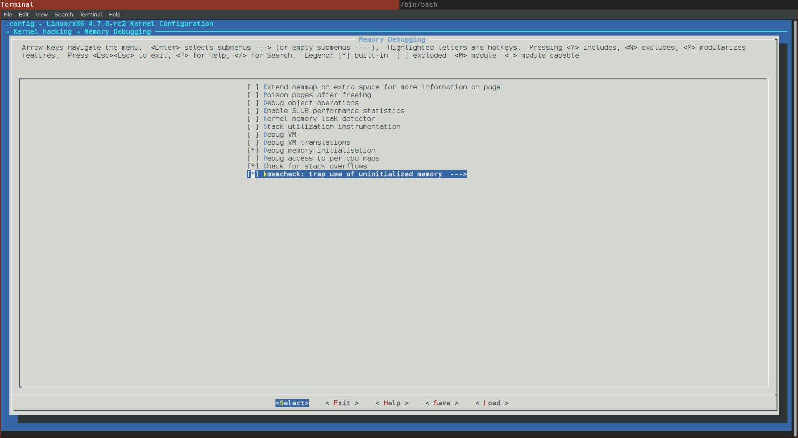
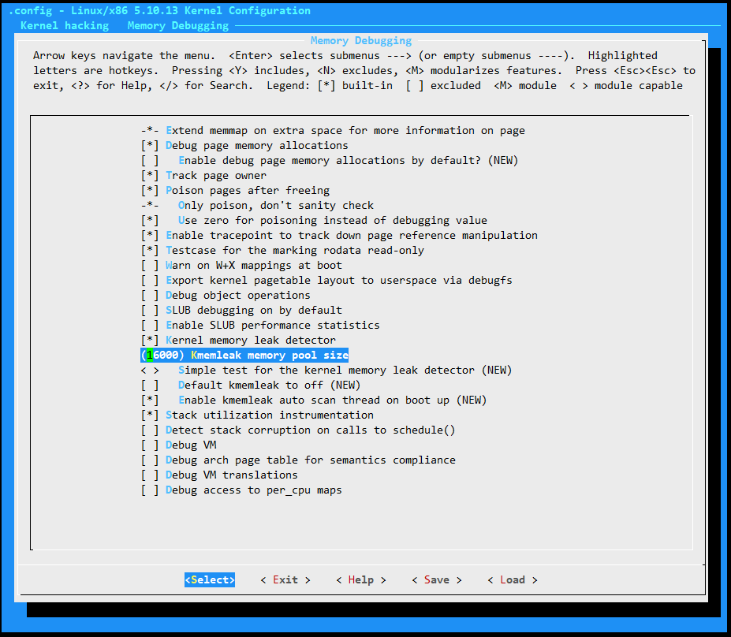
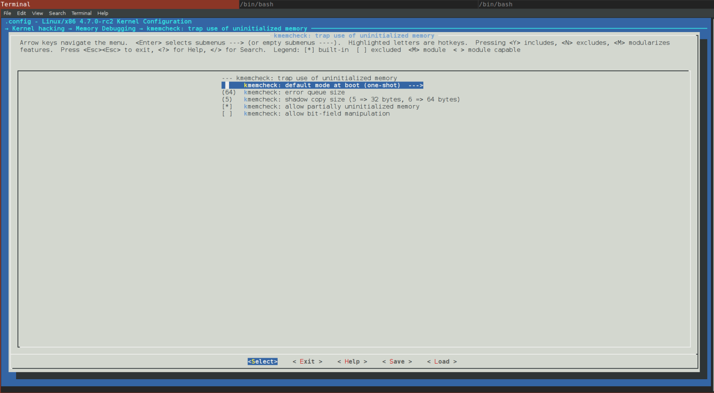

<center><font size='5'>Linux内核内存管理</font></center>
<center><font size='6'>kmemcheck介绍</font></center>
<br/>
<br/>
<center><font size='5'>rtoax</font></center>
<center><font size='5'>2021年3月</font></center>
<br/>

* 在[英文原文](https://0xax.gitbook.io/linux-insides)基础上，针对[中文译文](https://xinqiu.gitbooks.io/linux-insides-cn)增加5.10.13内核源码相关内容。

> 5.10.13不存在kmemcheck的概念，取代的是kmemleak；
> `kmemcheck` 的主要目的就是用来检查是否有内核代码访问 `未初始化的内存` .

# 1. 内核中 kmemcheck 介绍

Linux内存管理[章节](https://xinqiu.gitbooks.io/linux-insides-cn/content/MM/)描述了Linux内核中[内存管理](https://en.wikipedia.org/wiki/Memory_management)；本小节是第三部分。 在本章[第二节](https://xinqiu.gitbooks.io/linux-insides-cn/content/MM/linux-mm-2.html)中我们遇到了两个与内存管理相关的概念：

* `固定映射地址`;
* `输入输出重映射`.

固定映射地址代表[虚拟内存](https://en.wikipedia.org/wiki/Virtual_memory)中的一类特殊区域， 这类地址的物理映射地址是在[编译](https://en.wikipedia.org/wiki/Compile_time)期间计算出来的。**输入输出重映射表示把输入/输出相关的内存映射到虚拟内存**。

例如，查看`/proc/iomem`命令：

```
$ sudo cat /proc/iomem

00000000-00000fff : reserved
00001000-0009d7ff : System RAM
0009d800-0009ffff : reserved
000a0000-000bffff : PCI Bus 0000:00
000c0000-000cffff : Video ROM
000d0000-000d3fff : PCI Bus 0000:00
000d4000-000d7fff : PCI Bus 0000:00
000d8000-000dbfff : PCI Bus 0000:00
000dc000-000dffff : PCI Bus 0000:00
000e0000-000fffff : reserved
...
...
...
```

`iomem` 命令的输出显示了系统中**每个物理设备所映射的内存区域**。第一列为物理设备分配的内存区域，第二列为对应的各种不同类型的物理设备。

再例如：


```
$ sudo cat /proc/ioports

0000-0cf7 : PCI Bus 0000:00
  0000-001f : dma1
  0020-0021 : pic1
  0040-0043 : timer0
  0050-0053 : timer1
  0060-0060 : keyboard
  0064-0064 : keyboard
  0070-0077 : rtc0
  0080-008f : dma page reg
  00a0-00a1 : pic2
  00c0-00df : dma2
  00f0-00ff : fpu
    00f0-00f0 : PNP0C04:00
  03c0-03df : vga+
  03f8-03ff : serial
  04d0-04d1 : pnp 00:06
  0800-087f : pnp 00:01
  0a00-0a0f : pnp 00:04
  0a20-0a2f : pnp 00:04
  0a30-0a3f : pnp 00:04
...
...
...
```

`ioports` 的输出列出了系统中物理设备所注册的各种类型的I/O端口。**内核不能直接访问设备的输入/输出地址。在内核能够使用这些内存之前，必须将这些地址映射到虚拟地址空间，这就是`io remap`机制的主要目的**。在前面[第二节](https://xinqiu.gitbooks.io/linux-insides-cn/content/MM/linux-mm-2.html)中只介绍了早期的 `io remap` 。很快我们就要来看一看常规的 `io remap` 实现机制。但在此之前，我们需要学习一些其他的知识，例如不同类型的内存分配器等，不然的话我们很难理解该机制。

在进入Linux内核常规期的[内存管理](https://en.wikipedia.org/wiki/Memory_management)之前，我们要看一些特殊的内存机制，例如[调试](https://en.wikipedia.org/wiki/Debugging)，检查[内存泄漏](https://en.wikipedia.org/wiki/Memory_leak)，内存控制等等。学习这些内容有助于我们理解Linux内核的内存管理。

从本节的标题中，你可能已经看出来，我们会从[kmemcheck](https://www.kernel.org/doc/Documentation/kmemcheck.txt)开始了解内存机制。和前面的[章节](https://xinqiu.gitbooks.io/linux-insides-cn/content/)一样，我们首先从理论上学习什么是 `kmemcheck` ，然后再来看Linux内核中是怎么实现这一机制的。

让我们开始吧。Linux内核中的 `kmemcheck` 到底是什么呢？从该机制的名称上你可能已经猜到， `kmemcheck` 是检查内存的。你猜的很对。**`kmemcheck` 的主要目的就是用来检查是否有内核代码访问 `未初始化的内存` **。让我们看一个简单的 [C](https://en.wikipedia.org/wiki/C_%28programming_language%29) 程序：

```C
#include <stdlib.h>
#include <stdio.h>

struct A {
    int a;
};

int main(int argc, char **argv) {
    struct A *a = malloc(sizeof(struct A));
    printf("a->a = %d\n", a->a);
    return 0;
}
```


在上面的程序中我们给结构体`A`分配了内存，然后我们尝试打印它的成员`a`。如果我们不使用其他选项来编译该程序： 

```
gcc test.c -o test
```

[编译器](https://en.wikipedia.org/wiki/GNU_Compiler_Collection)不会显示成员 `a` 未初始化的提示信息。但是如果使用工具[valgrind](https://en.wikipedia.org/wiki/Valgrind)来运行该程序，我们会看到如下输出：

```
~$   valgrind --leak-check=yes ./test
==28469== Memcheck, a memory error detector
==28469== Copyright (C) 2002-2015, and GNU GPL'd, by Julian Seward et al.
==28469== Using Valgrind-3.11.0 and LibVEX; rerun with -h for copyright info
==28469== Command: ./test
==28469== 
==28469== Conditional jump or move depends on uninitialised value(s)
==28469==    at 0x4E820EA: vfprintf (in /usr/lib64/libc-2.22.so)
==28469==    by 0x4E88D48: printf (in /usr/lib64/libc-2.22.so)
==28469==    by 0x4005B9: main (in /home/alex/test)
==28469== 
==28469== Use of uninitialised value of size 8
==28469==    at 0x4E7E0BB: _itoa_word (in /usr/lib64/libc-2.22.so)
==28469==    by 0x4E8262F: vfprintf (in /usr/lib64/libc-2.22.so)
==28469==    by 0x4E88D48: printf (in /usr/lib64/libc-2.22.so)
==28469==    by 0x4005B9: main (in /home/alex/test)
...
...
...
```

实际上**`kmemcheck` 在内核空间做的事情，和 `valgrind` 在用户空间做的事情是一样的，都是用来检测未初始化的内存**.

要想在内核中启用该机制，需要在配置内核时开启 `CONFIG_KMEMCHECK` 选项：

```
Kernel hacking
  -> Memory Debugging
```





`kmemcheck` 机制还提供了一些内核配置参数，我们可以在下一个段落中看到所有的可选参数。最后一个需要注意的是，`kmemcheck` 仅在 [x86_64](https://en.wikipedia.org/wiki/X86-64) 体系中实现了。为了确信这一点，我们可以查看 `x86` 的内核配置文件 [arch/x86/Kconfig](https://github.com/torvalds/linux/blob/master/arch/x86/Kconfig)：

```
config X86
  ...
  ...
  ...
  select HAVE_ARCH_KMEMCHECK
  ...
  ...
  ...
```

因此，对于其他的体系结构来说是没有 `kmemcheck` 功能的。

现在我们知道了 `kmemcheck` 可以检测内核中`未初始化内存`的使用情况，也知道了如何开启这个功能。那么 `kmemcheck` 是怎么做检测的呢？当内核尝试分配内存时，例如如下一段代码：

```
struct my_struct *my_struct = kmalloc(sizeof(struct my_struct), GFP_KERNEL);
```

或者换句话说，在内核访问 [page](https://en.wikipedia.org/wiki/Page_%28computer_memory%29) 时会发生[缺页中断](https://en.wikipedia.org/wiki/Page_fault)。这是由于 `kmemcheck` 将内存页标记为`不存在`（关于Linux内存分页的相关信息，你可以参考[分页](https://0xax.gitbooks.io/linux-insides/content/Theory/linux-theory-1.html)）。如果一个`缺页中断`异常发生了，异常处理程序会来处理这个异常，如果异常处理程序检测到内核使能了 `kmemcheck`，那么就会将控制权提交给 `kmemcheck` 来处理；`kmemcheck` 检查完之后，该内存页会被标记为 `present`，然后被中断的程序得以继续执行下去。 这里的处理方式比较巧妙，被中断程序的第一条指令执行时，`kmemcheck` 又会标记内存页为 `not present`，按照这种方式，下一个对内存页的访问也会被捕获。 

目前我们只是从理论层面考察了 `kmemcheck`，接下来我们看一下Linux内核是怎么来实现该机制的。

# 2. `kmemcheck` 机制在Linux内核中的实现

我们应该已经了解 `kmemcheck` 是做什么的以及它在Linux内核中的功能，现在是时候看一下它在Linux内核中的实现。 `kmemcheck` 在内核的实现分为两部分。第一部分是架构无关的部分，位于源码 [mm/kmemcheck.c](https://github.com/torvalds/linux/blob/master/mm/kmemcheck.c)；第二部分 [x86_64](https://en.wikipedia.org/wiki/X86-64)架构相关的部分位于目录[arch/x86/mm/kmemcheck](https://github.com/torvalds/linux/tree/master/arch/x86/mm/kmemcheck)中。

我们先分析该机制的初始化过程。我们已经知道要在内核中使能 `kmemcheck` 机制，需要开启内核的`CONFIG_KMEMCHECK` 配置项。除了这个选项，我们还需要给内核command line传递一个 `kmemcheck` 参数：

 * kmemcheck=0 (disabled)
 * kmemcheck=1 (enabled)
 * kmemcheck=2 (one-shot mode)

前面两个值得含义很明确，但是最后一个需要解释。这个选项会使 `kmemcheck` 进入一种特殊的模式：在第一次检测到未初始化内存的使用之后，就会关闭 `kmemcheck` 。实际上该模式是内核的默认选项：



从Linux初始化过程章节的第七节 [part](https://xinqiu.gitbooks.io/linux-insides-cn/content/Initialization/linux-initialization-7.html) 中，我们知道在内核初始化过程中，会在  `do_initcall_level` ,  `do_early_param` 等函数中解析内核 command line。前面也提到过  `kmemcheck` 子系统由两部分组成，第一部分启动比较早。在源码  [mm/kmemcheck.c](https://github.com/torvalds/linux/blob/master/mm/kmemcheck.c) 中有一个函数 `param_kmemcheck` ，该函数在command line解析时就会用到: 

```C
static int __init param_kmemcheck(char *str)
{
	int val;
	int ret;

	if (!str)
		return -EINVAL;

	ret = kstrtoint(str, 0, &val);
	if (ret)
		return ret;
	kmemcheck_enabled = val;
	return 0;
}

early_param("kmemcheck", param_kmemcheck);
```

从前面的介绍我们知道 `param_kmemcheck` 可能存在三种情况：`0` (使能), `1` (禁止) or `2` (一次性)。 `param_kmemcheck` 的实现很简单：将command line传递的 `kmemcheck` 参数的值由字符串转换为整数，然后赋值给变量 `kmemcheck_enabled` 。

第二阶段在内核初始化阶段执行，而不是在早期初始化过程 [initcalls](https://xinqiu.gitbooks.io/linux-insides-cn/content/Concepts/linux-cpu-3.html) 。第二阶断的过程体现在 `kmemcheck_init` : 

```C
int __init kmemcheck_init(void)
{
    ...
    ...
    ...
}
early_initcall(kmemcheck_init);
```

`kmemcheck_init` 的主要目的就是调用 `kmemcheck_selftest` 函数，并检查它的返回值：

```C
if (!kmemcheck_selftest()) {
	printk(KERN_INFO "kmemcheck: self-tests failed; disabling\n");
	kmemcheck_enabled = 0;
	return -EINVAL;
}

printk(KERN_INFO "kmemcheck: Initialized\n");
```

如果 `kmemcheck_init` 检测失败，就返回 `EINVAL` 。 `kmemcheck_selftest` 函数会检测内存访问相关的[操作码](https://en.wikipedia.org/wiki/Opcode)（例如 `rep movsb`, `movzwq`)的大小。如果检测到的大小的实际大小是一致的，`kmemcheck_selftest` 返回 `true`，否则返回 `false`。

如果如下代码被调用:

```C
struct my_struct *my_struct = kmalloc(sizeof(struct my_struct), GFP_KERNEL);
```

经过一系列的函数调用，`kmem_getpages` 函数会被调用到，该函数的定义在源码 [mm/slab.c](https://github.com/torvalds/linux/blob/master/mm/slab.c) 中，该函数的主要功能就是尝试按照指定的参数需求分配[内存页](https://en.wikipedia.org/wiki/Paging)。在该函数的结尾处有如下代码：

```C
if (kmemcheck_enabled && !(cachep->flags & SLAB_NOTRACK)) {
	kmemcheck_alloc_shadow(page, cachep->gfporder, flags, nodeid);

    if (cachep->ctor)
		kmemcheck_mark_uninitialized_pages(page, nr_pages);
	else
		kmemcheck_mark_unallocated_pages(page, nr_pages);
}
```

这段代码判断如果 `kmemcheck` 使能，并且参数中未设置 `SLAB_NOTRACK` ，那么就给分配的内存页设置 `non-present` 标记。`SLAB_NOTRACK` 标记的含义是不跟踪未初始化的内存。另外，如果缓存对象有构造函数（细节在下面描述），所分配的内存页标记为未初始化，否则标记为未分配。`kmemcheck_alloc_shadow` 函数在源码 [mm/kmemcheck.c](https://github.com/torvalds/linux/blob/master/mm/kmemcheck.c) 中，其基本内容如下：

```C
void kmemcheck_alloc_shadow(struct page *page, int order, gfp_t flags, int node)
{
    struct page *shadow;

   	shadow = alloc_pages_node(node, flags | __GFP_NOTRACK, order);

   	for(i = 0; i < pages; ++i)
		page[i].shadow = page_address(&shadow[i]);

   	kmemcheck_hide_pages(page, pages);
}
```

首先为 shadow bits 分配内存，并为内存页设置 shadow 位。如果内存页设置了该标记，就意味着  `kmemcheck` 会跟踪这个内存页。最后调用 `kmemcheck_hide_pages` 函数。 `kmemcheck_hide_pages` 是体系结构相关的函数，其代码在 [arch/x86/mm/kmemcheck/kmemcheck.c](https://github.com/torvalds/linux/tree/master/arch/x86/mm/kmemcheck/kmemcheck.c) 源码中。该函数的功能是为指定的内存页设置 `non-present` 标记。该函数实现如下：

```C
void kmemcheck_hide_pages(struct page *p, unsigned int n)
{
	unsigned int i;

	for (i = 0; i < n; ++i) {
		unsigned long address;
		pte_t *pte;
		unsigned int level;

		address = (unsigned long) page_address(&p[i]);
		pte = lookup_address(address, &level);
		BUG_ON(!pte);
		BUG_ON(level != PG_LEVEL_4K);

		set_pte(pte, __pte(pte_val(*pte) & ~_PAGE_PRESENT));
		set_pte(pte, __pte(pte_val(*pte) | _PAGE_HIDDEN));
		__flush_tlb_one(address);
	}
}
```

该函数遍历参数代表的所有内存页，并尝试获取每个内存页的 `页表项` 。如果获取成功，清理页表项的present 标记，设置页表项的 hidden 标记。在最后还需要刷新 [TLB](https://en.wikipedia.org/wiki/Translation_lookaside_buffer) ,因为有一些内存页已经发生了改变。从这个地方开始，内存页就进入 `kmemcheck` 的跟踪系统。由于内存页的 `present` 标记被清除了，一旦 `kmalloc` 返回了内存地址，并且有代码访问这个地址，就会触发[缺页中断](https://en.wikipedia.org/wiki/Page_fault)。

在Linux内核初始化的[第二节](https://xinqiu.gitbooks.io/linux-insides-cn/content/Initialization/linux-initialization-2.html)介绍过，`缺页中断`处理程序是 [arch/x86/mm/fault.c](https://github.com/torvalds/linux/blob/master/arch/x86/mm/fault.c) 的  `do_page_fault` 函数。该函数开始部分如下：

```C
static noinline void
__do_page_fault(struct pt_regs *regs, unsigned long error_code,
		unsigned long address)
{
    ...
    ...
    ...
	if (kmemcheck_active(regs))
		kmemcheck_hide(regs);
    ...
    ...
    ...
}
```

`kmemcheck_active` 函数获取 `kmemcheck_context` [per-cpu](https://xinqiu.gitbooks.io/linux-insides-cn/content/Concepts/linux-cpu-1.html) 结构体，并返回该结构体成员 `balance` 和0的比较结果：

```
bool kmemcheck_active(struct pt_regs *regs)
{
	struct kmemcheck_context *data = this_cpu_ptr(&kmemcheck_context);

	return data->balance > 0;
}
```

`kmemcheck_context` 结构体代表 `kmemcheck` 机制的当前状态。其内部保存了未初始化的地址，地址的数量等信息。其成员 `balance` 代表了 `kmemcheck` 的当前状态，换句话说，`balance` 表示 `kmemcheck` 是否已经隐藏了内存页。如果 `data->balance` 大于0， `kmemcheck_hide` 函数会被调用。这意味着 `kmemecheck` 已经设置了内存页的 `present` 标记，但是我们需要再次隐藏内存页以便触发下一次的缺页中断。 `kmemcheck_hide` 函数会清理内存页的 `present` 标记，这表示一次 `kmemcheck` 会话已经完成，新的缺页中断会再次被触发。在第一步，由于 `data->balance` 值为0，所以 `kmemcheck_active` 会返回false，所以 `kmemcheck_hide` 也不会被调用。接下来，我们看 `do_page_fault` 的下一行代码：

```C
if (kmemcheck_fault(regs, address, error_code))
		return;
```

首先 `kmemcheck_fault` 函数检查引起错误的真实原因。第一步先检查[标记寄存器](https://en.wikipedia.org/wiki/FLAGS_register)以确认进程是否处于正常的内核态：

```C
if (regs->flags & X86_VM_MASK)
		return false;
if (regs->cs != __KERNEL_CS)
		return false;
```

如果检测失败，表明这不是 `kmemcheck` 相关的缺页中断，`kmemcheck_fault` 会返回false。如果检测成功，接下来查找发生异常的地址的`页表项`，如果找不到页表项，函数返回false:

```C
pte = kmemcheck_pte_lookup(address);
if (!pte)
	return false;
```

`kmemcheck_fault` 最后一步是调用 `kmemcheck_access` 函数，该函数检查对指定内存页的访问，并设置该内存页的present标记。 `kmemcheck_access` 函数做了大部分工作，它检查引起缺页异常的当前指令，如果检查到了错误，那么会把该错误的上下文保存到环形队列中：

```C
static struct kmemcheck_error error_fifo[CONFIG_KMEMCHECK_QUEUE_SIZE];
```

`kmemcheck` 声明了一个特殊的 [tasklet](https://xinqiu.gitbooks.io/linux-insides-cn/content/Interrupts/linux-interrupts-9.html) :

```C
static DECLARE_TASKLET(kmemcheck_tasklet, &do_wakeup, 0);
```

该tasklet被调度执行时，会调用 `do_wakeup` 函数，该函数位于 [arch/x86/mm/kmemcheck/error.c](https://github.com/torvalds/linux/blob/master/arch/x86/mm/kmemcheck/error.c) 文件中。 

`do_wakeup` 函数调用 `kmemcheck_error_recall` 函数以便将 `kmemcheck` 检测到的错误信息输出。

```C
kmemcheck_show(regs);
```

`kmemcheck_fault` 函数结束时会调用 `kmemcheck_show` 函数，该函数会再次设置内存页的present标记。

```C
if (unlikely(data->balance != 0)) {
	kmemcheck_show_all();
	kmemcheck_error_save_bug(regs);
	data->balance = 0;
	return;
}
```

`kmemcheck_show_all` 函数会针对每个地址调用 `kmemcheck_show_addr` ：

```C
static unsigned int kmemcheck_show_all(void)
{
	struct kmemcheck_context *data = this_cpu_ptr(&kmemcheck_context);
	unsigned int i;
	unsigned int n;

	n = 0;
	for (i = 0; i < data->n_addrs; ++i)
		n += kmemcheck_show_addr(data->addr[i]);

	return n;
}
```

`kmemcheck_show_addr` 函数内容如下:

```C
int kmemcheck_show_addr(unsigned long address)
{
	pte_t *pte;

	pte = kmemcheck_pte_lookup(address);
	if (!pte)
		return 0;

	set_pte(pte, __pte(pte_val(*pte) | _PAGE_PRESENT));
	__flush_tlb_one(address);
	return 1;
}
```

在函数 `kmemcheck_show` 的结尾处会设置 [TF](https://en.wikipedia.org/wiki/Trap_flag) 标记：

```C
if (!(regs->flags & X86_EFLAGS_TF))
	data->flags = regs->flags;
```

我们之所以这么处理，是因为我们在内存页的缺页中断处理完后需要再次隐藏内存页。当 `TF` 标记被设置后，处理器在执行被中断程序的第一条指令时会进入单步模式，这会触发 `debug` 异常。从这个地方开始，内存页会被隐藏起来，执行流程继续。由于内存页不可见，那么访问内存页的时候又会触发缺页中断，然后`kmemcheck` 就有机会继续检测/收集并显示内存错误信息。

到这里 `kmemcheck` 的工作机制就介绍完毕了。

# 3. 结束语

Linux内核[内存管理](https://en.wikipedia.org/wiki/Memory_management)第三节介绍到此为止。如果你有任何疑问或者建议，你可以直接给我[0xAX](https://twitter.com/0xAX)发消息， 发[邮件](anotherworldofworld@gmail.com)，或者创建一个 [issue](https://github.com/0xAX/linux-insides/issues/new) 。 在接下来的小节中，我们来看一下另一个内存调试工具 - `kmemleak` 。

**英文不是我的母语。如果你发现我的英文描述有任何问题，请提交一个PR到 [linux-insides](https://github.com/0xAX/linux-insides).**

# 4. 链接

* [memory management](https://en.wikipedia.org/wiki/Memory_management)
* [debugging](https://en.wikipedia.org/wiki/Debugging)
* [memory leaks](https://en.wikipedia.org/wiki/Memory_leak)
* [kmemcheck documentation](https://www.kernel.org/doc/Documentation/kmemcheck.txt)
* [valgrind](https://en.wikipedia.org/wiki/Valgrind)
* [page fault](https://en.wikipedia.org/wiki/Page_fault)
* [initcalls](https://xinqiu.gitbooks.io/linux-insides-cn/content/Concepts/linux-cpu-3.html)
* [opcode](https://en.wikipedia.org/wiki/Opcode)
* [translation lookaside buffer](https://en.wikipedia.org/wiki/Translation_lookaside_buffer)
* [per-cpu variables](https://xinqiu.gitbooks.io/linux-insides-cn/content/Concepts/linux-cpu-1.html)
* [flags register](https://en.wikipedia.org/wiki/FLAGS_register)
* [tasklet](https://xinqiu.gitbooks.io/linux-insides-cn/content/Interrupts/linux-interrupts-9.html)
* [Paging](https://xinqiu.gitbooks.io/linux-insides-cn/content/Theory/linux-theory-1.html)
* [Previous part](https://xinqiu.gitbooks.io/linux-insides-cn/content/MM/linux-mm-2.html)


<center><font size='6'>英文原文</font></center>

Linux kernel memory management Part 3.
================================================================================

Introduction to the kmemcheck in the Linux kernel
--------------------------------------------------------------------------------

This is the third part of the [chapter](https://0xax.gitbook.io/linux-insides/summary/mm) which describes [memory management](https://en.wikipedia.org/wiki/Memory_management) in the Linux kernel and in the previous [part](https://0xax.gitbook.io/linux-insides/summary/mm/linux-mm-2) of this chapter we met two memory management related concepts:

* `Fix-Mapped Addresses`;
* `ioremap`.

The first concept represents special area in [virtual memory](https://en.wikipedia.org/wiki/Virtual_memory), whose corresponding physical mapping is calculated in [compile-time](https://en.wikipedia.org/wiki/Compile_time). The second concept provides ability to map input/output related memory to virtual memory.

For example if you will look at the output of the `/proc/iomem`:

```
$ sudo cat /proc/iomem

00000000-00000fff : reserved
00001000-0009d7ff : System RAM
0009d800-0009ffff : reserved
000a0000-000bffff : PCI Bus 0000:00
000c0000-000cffff : Video ROM
000d0000-000d3fff : PCI Bus 0000:00
000d4000-000d7fff : PCI Bus 0000:00
000d8000-000dbfff : PCI Bus 0000:00
000dc000-000dffff : PCI Bus 0000:00
000e0000-000fffff : reserved
...
...
...
```

you will see map of the system's memory for each physical device. Here the first column displays the memory registers used by each of the different types of memory. The second column lists the kind of memory located within those registers. Or for example:

```
$ sudo cat /proc/ioports

0000-0cf7 : PCI Bus 0000:00
  0000-001f : dma1
  0020-0021 : pic1
  0040-0043 : timer0
  0050-0053 : timer1
  0060-0060 : keyboard
  0064-0064 : keyboard
  0070-0077 : rtc0
  0080-008f : dma page reg
  00a0-00a1 : pic2
  00c0-00df : dma2
  00f0-00ff : fpu
    00f0-00f0 : PNP0C04:00
  03c0-03df : vga+
  03f8-03ff : serial
  04d0-04d1 : pnp 00:06
  0800-087f : pnp 00:01
  0a00-0a0f : pnp 00:04
  0a20-0a2f : pnp 00:04
  0a30-0a3f : pnp 00:04
...
...
...
```

can show us lists of currently registered port regions used for input or output communication with a device. All memory-mapped I/O addresses are not used by the kernel directly. So, before the Linux kernel can use such memory, it must map it to the virtual memory space which is the main purpose of the `ioremap` mechanism. Note that we saw only early `ioremap` in the previous [part](https://0xax.gitbook.io/linux-insides/summary/mm/linux-mm-2). Soon we will look at the implementation of the non-early `ioremap` function. But before this we must learn other things, like a different types of memory allocators and etc., because in other way it will be very difficult to understand it.

So, before we will move on to the non-early [memory management](https://en.wikipedia.org/wiki/Memory_management) of the Linux kernel, we will see some mechanisms which provide special abilities for [debugging](https://en.wikipedia.org/wiki/Debugging), check of [memory leaks](https://en.wikipedia.org/wiki/Memory_leak), memory control and etc. It will be easier to understand how memory management arranged in the Linux kernel after learning of all of these things.

As you already may guess from the title of this part, we will start to consider memory mechanisms from the [kmemcheck](https://www.kernel.org/doc/Documentation/kmemcheck.txt). As we always did in other [chapters](https://github.com/0xAX/linux-insides/blob/master/SUMMARY.md), we will start to consider from theoretical side and will learn what is `kmemcheck` mechanism in general and only after this, we will see how it is implemented in the Linux kernel.

So let's start. What is it `kmemcheck` in the Linux kernel? As you may guess from the name of this mechanism, the `kmemcheck` checks memory. That's true. Main point of the `kmemcheck` mechanism is to check that some kernel code accesses `uninitialized memory`. Let's take following simple [C](https://en.wikipedia.org/wiki/C_%28programming_language%29) program:

```C
#include <stdlib.h>
#include <stdio.h>

struct A {
        int a;
};

int main(int argc, char **argv) {
        struct A *a = malloc(sizeof(struct A));
        printf("a->a = %d\n", a->a);
        return 0;
}
```

Here we allocate memory for the `A` structure and tries to print value of the `a` field. If we will compile this program without additional options:

```
gcc test.c -o test
```

The [compiler](https://en.wikipedia.org/wiki/GNU_Compiler_Collection) will not show us warning that `a` filed is not unitialized. But if we will run this program with [valgrind](https://en.wikipedia.org/wiki/Valgrind) tool, we will see the following output:

```
~$   valgrind --leak-check=yes ./test
==28469== Memcheck, a memory error detector
==28469== Copyright (C) 2002-2015, and GNU GPL'd, by Julian Seward et al.
==28469== Using Valgrind-3.11.0 and LibVEX; rerun with -h for copyright info
==28469== Command: ./test
==28469== 
==28469== Conditional jump or move depends on uninitialised value(s)
==28469==    at 0x4E820EA: vfprintf (in /usr/lib64/libc-2.22.so)
==28469==    by 0x4E88D48: printf (in /usr/lib64/libc-2.22.so)
==28469==    by 0x4005B9: main (in /home/alex/test)
==28469== 
==28469== Use of uninitialised value of size 8
==28469==    at 0x4E7E0BB: _itoa_word (in /usr/lib64/libc-2.22.so)
==28469==    by 0x4E8262F: vfprintf (in /usr/lib64/libc-2.22.so)
==28469==    by 0x4E88D48: printf (in /usr/lib64/libc-2.22.so)
==28469==    by 0x4005B9: main (in /home/alex/test)
...
...
...
```

Actually the `kmemcheck` mechanism does the same for the kernel, what the `valgrind` does for userspace programs. It check uninitialized memory.

To enable this mechanism in the Linux kernel, you need to enable the `CONFIG_KMEMCHECK` kernel configuration option in the:

```
Kernel hacking
  -> Memory Debugging
```
  
menu of the Linux kernel configuration:


We may not only enable support of the `kmemcheck` mechanism in the Linux kernel, but it also provides some configuration options for us. We will see all of these options in the next paragraph of this part. Last note before we will consider how does the `kmemcheck` check memory. Now this mechanism is implemented only for the [x86_64](https://en.wikipedia.org/wiki/X86-64) architecture. You can be sure if you will look in the [arch/x86/Kconfig](https://github.com/torvalds/linux/blob/16f73eb02d7e1765ccab3d2018e0bd98eb93d973/arch/x86/Kconfig) `x86` related kernel configuration file, you will see following lines:

```
config X86
  ...
  ...
  ...
  select HAVE_ARCH_KMEMCHECK
  ...
  ...
  ...
```

So, there is no anything which is specific for other architectures.

Ok, so we know that `kmemcheck` provides mechanism to check usage of `uninitialized memory` in the Linux kernel and how to enable it. How it does these checks? When the Linux kernel tries to allocate some memory i.e. something is called like this:

```C
struct my_struct *my_struct = kmalloc(sizeof(struct my_struct), GFP_KERNEL);
```

or in other words somebody wants to access a [page](https://en.wikipedia.org/wiki/Page_%28computer_memory%29), a [page fault](https://en.wikipedia.org/wiki/Page_fault) exception is generated. This is achieved by the fact that the `kmemcheck` marks memory pages as `non-present` (more about this you can read in the special part which is devoted to [Paging](https://0xax.gitbook.io/linux-insides/summary/theory/linux-theory-1)). If a `page fault` exception is occurred, the exception handler knows about it and in a case when the `kmemcheck` is enabled it transfers control to it. After the `kmemcheck` will finish its checks, the page will be marked as `present` and the interrupted code will be able to continue execution. There is little subtlety in this chain. When the first instruction of interrupted code will be executed, the `kmemcheck` will mark the page as `non-present` again. In this way next access to memory will be caught again.

We just considered the `kmemcheck` mechanism from theoretical side. Now let's consider how it is implemented in the Linux kernel.

Implementation of the `kmemcheck` mechanism in the Linux kernel
--------------------------------------------------------------------------------

So, now we know what is it `kmemcheck` and what it does in the Linux kernel. Time to see at its implementation in the Linux kernel. Implementation of the `kmemcheck` is split in two parts. The first is generic part is located in the [mm/kmemcheck.c](https://github.com/torvalds/linux/blob/16f73eb02d7e1765ccab3d2018e0bd98eb93d973/mm/kmemcheck.c) source code file and the second [x86_64](https://en.wikipedia.org/wiki/X86-64) architecture-specific part is located in the [arch/x86/mm/kmemcheck](https://github.com/torvalds/linux/tree/master/arch/x86/mm/kmemcheck) directory.

Let's start from the initialization of this mechanism. We already know that to enable the `kmemcheck` mechanism in the Linux kernel, we must enable the `CONFIG_KMEMCHECK` kernel configuration option. But besides this, we need to pass one of following parameters:

 * kmemcheck=0 (disabled)
 * kmemcheck=1 (enabled)
 * kmemcheck=2 (one-shot mode)

to the Linux kernel command line. The first two are clear, but the last needs a little explanation. This option switches the `kmemcheck` in a special mode when it will be turned off after detecting the first use of uninitialized memory. Actually this mode is enabled by default in the Linux kernel:


We know from the seventh [part](https://0xax.gitbook.io/linux-insides/summary/initialization/linux-initialization-7) of the chapter which describes initialization of the Linux kernel that the kernel command line is parsed during initialization of the Linux kernel in `do_initcall_level`, `do_early_param` functions. Actually the `kmemcheck` subsystem consists from two stages. The first stage is early. If we will look at the [mm/kmemcheck.c](https://github.com/torvalds/linux/blob/16f73eb02d7e1765ccab3d2018e0bd98eb93d973/mm/kmemcheck.c) source code file, we will see the `param_kmemcheck` function which is will be called during early command line parsing:

```C
static int __init param_kmemcheck(char *str)
{
	int val;
	int ret;

	if (!str)
		return -EINVAL;

	ret = kstrtoint(str, 0, &val);
	if (ret)
		return ret;
	kmemcheck_enabled = val;
	return 0;
}

early_param("kmemcheck", param_kmemcheck);
```

As we already saw, the `param_kmemcheck` may have one of the following values: `0` (enabled), `1` (disabled) or `2` (one-shot). The implementation of the `param_kmemcheck` is pretty simple. We just convert string value of the `kmemcheck` command line option to integer representation and set it to the `kmemcheck_enabled` variable.

The second stage will be executed during initialization of the Linux kernel, rather during initialization of early [initcalls](https://0xax.gitbook.io/linux-insides/summary/concepts/linux-cpu-3). The second stage is represented by the `kmemcheck_init`:

```C
int __init kmemcheck_init(void)
{
    ...
    ...
    ...
}

early_initcall(kmemcheck_init);
```

Main goal of the `kmemcheck_init` function is to call the `kmemcheck_selftest` function and check its result:

```C
if (!kmemcheck_selftest()) {
	printk(KERN_INFO "kmemcheck: self-tests failed; disabling\n");
	kmemcheck_enabled = 0;
	return -EINVAL;
}

printk(KERN_INFO "kmemcheck: Initialized\n");
```

and return with the `EINVAL` if this check is failed. The `kmemcheck_selftest` function checks sizes of different memory access related [opcodes](https://en.wikipedia.org/wiki/Opcode) like `rep movsb`, `movzwq` and etc. If sizes of opcodes are equal to expected sizes, the `kmemcheck_selftest` will return `true` and `false` in other way.

So when the somebody will call:

```C
struct my_struct *my_struct = kmalloc(sizeof(struct my_struct), GFP_KERNEL);
```

through a series of different function calls the `kmem_getpages` function will be called. This function is defined in the [mm/slab.c](https://github.com/torvalds/linux/blob/16f73eb02d7e1765ccab3d2018e0bd98eb93d973/mm/slab.c) source code file and main goal of this function tries to allocate [pages](https://en.wikipedia.org/wiki/Paging) with the given flags. In the end of this function we can see following code:

```C
if (kmemcheck_enabled && !(cachep->flags & SLAB_NOTRACK)) {
	kmemcheck_alloc_shadow(page, cachep->gfporder, flags, nodeid);

    if (cachep->ctor)
		kmemcheck_mark_uninitialized_pages(page, nr_pages);
	else
		kmemcheck_mark_unallocated_pages(page, nr_pages);
}
```

So, here we check that the if `kmemcheck` is enabled and the `SLAB_NOTRACK` bit is not set in flags we set `non-present` bit for the just allocated page. The `SLAB_NOTRACK` bit tell us to not track uninitialized memory. Additionally we check if a cache object has constructor (details will be considered in next parts) we mark allocated page as uninitialized or unallocated in other way. The `kmemcheck_alloc_shadow` function is defined in the [mm/kmemcheck.c](https://github.com/torvalds/linux/blob/16f73eb02d7e1765ccab3d2018e0bd98eb93d973/mm/kmemcheck.c) source code file and does following things:

```C
void kmemcheck_alloc_shadow(struct page *page, int order, gfp_t flags, int node)
{
    struct page *shadow;

   	shadow = alloc_pages_node(node, flags | __GFP_NOTRACK, order);

   	for(i = 0; i < pages; ++i)
		page[i].shadow = page_address(&shadow[i]);

   	kmemcheck_hide_pages(page, pages);
}
```

First of all it allocates memory space for the shadow bits. If this bit is set in a page, this means that this page is tracked by the `kmemcheck`. After we allocated space for the shadow bit, we fill all allocated pages with this bit. In the end we just call the `kmemcheck_hide_pages` function with the pointer to the allocated page and number of these pages. The `kmemcheck_hide_pages` is architecture-specific function, so its implementation is located in the [arch/x86/mm/kmemcheck/kmemcheck.c](https://github.com/torvalds/linux/tree/master/arch/x86/mm/kmemcheck/kmemcheck.c) source code file. The main goal of this function is to set `non-present` bit in given pages. Let's look at the implementation of this function:

```C
void kmemcheck_hide_pages(struct page *p, unsigned int n)
{
	unsigned int i;

	for (i = 0; i < n; ++i) {
		unsigned long address;
		pte_t *pte;
		unsigned int level;

		address = (unsigned long) page_address(&p[i]);
		pte = lookup_address(address, &level);
		BUG_ON(!pte);
		BUG_ON(level != PG_LEVEL_4K);

		set_pte(pte, __pte(pte_val(*pte) & ~_PAGE_PRESENT));
		set_pte(pte, __pte(pte_val(*pte) | _PAGE_HIDDEN));
		__flush_tlb_one(address);
	}
}
```

Here we go through all pages and and tries to get `page table entry` for each page. If this operation was successful, we unset present bit and set hidden bit in each page. In the end we flush [translation lookaside buffer](https://en.wikipedia.org/wiki/Translation_lookaside_buffer), because some pages was changed. From this point allocated pages are tracked by the `kmemcheck`. Now, as `present` bit is unset, the [page fault](https://en.wikipedia.org/wiki/Page_fault) execution will be occurred right after the `kmalloc` will return pointer to allocated space and a code will try to access this memory.

As you may remember from the [second part](https://0xax.gitbook.io/linux-insides/summary/initialization/linux-initialization-2) of the Linux kernel initialization chapter, the `page fault` handler is located in the [arch/x86/mm/fault.c](https://github.com/torvalds/linux/blob/16f73eb02d7e1765ccab3d2018e0bd98eb93d973/arch/x86/mm/fault.c) source code file and represented by the `do_page_fault` function. We can see following check from the beginning of the `do_page_fault` function:

```C
static noinline void
__do_page_fault(struct pt_regs *regs, unsigned long error_code,
		unsigned long address)
{
    ...
    ...
    ...
	if (kmemcheck_active(regs))
		kmemcheck_hide(regs);
    ...
    ...
    ...
}
```

The `kmemcheck_active` gets `kmemcheck_context` [per-cpu](https://0xax.gitbook.io/linux-insides/summary/concepts/linux-cpu-1) structure and return the result of comparison of the `balance` field of this structure with zero:

```
bool kmemcheck_active(struct pt_regs *regs)
{
	struct kmemcheck_context *data = this_cpu_ptr(&kmemcheck_context);

	return data->balance > 0;
}
```

The `kmemcheck_context` is structure which describes current state of the `kmemcheck` mechanism. It stored uninitialized addresses, number of such addresses and etc. The `balance` field of this structure represents current state of the `kmemcheck` or in other words it can tell us did `kmemcheck` already hid pages or not yet. If the `data->balance` is greater than zero, the `kmemcheck_hide` function will be called. This means than `kmemecheck` already set `present` bit for given pages and now we need to hide pages again to cause next step to page fault. This function will hide addresses of pages again by unsetting of `present` bit. This means that one session of `kmemcheck` already finished and new page fault occurred. At the first step the `kmemcheck_active` will return false as the `data->balance` is zero for the start and the `kmemcheck_hide` will not be called. Next, we may see following line of code in the `do_page_fault`:

```C
if (kmemcheck_fault(regs, address, error_code))
		return;
```

First of all the `kmemcheck_fault` function checks that the fault was occured by the correct reason. At first we check the [flags register](https://en.wikipedia.org/wiki/FLAGS_register) and check that we are in normal kernel mode:

```C
if (regs->flags & X86_VM_MASK)
		return false;
if (regs->cs != __KERNEL_CS)
		return false;
```

If these checks wasn't successful we return from the `kmemcheck_fault` function as it was not `kmemcheck` related page fault. After this we try to lookup a `page table entry` related to the faulted address and if we can't find it we return:

```C
pte = kmemcheck_pte_lookup(address);
if (!pte)
	return false;
```

Last two steps of the `kmemcheck_fault` function is to call the `kmemcheck_access` function which check access to the given page and show addresses again by setting present bit in the given page. The `kmemcheck_access` function does all main job. It check current instruction which caused a page fault. If it will find an error, the context of this error will be saved by `kmemcheck` to the ring queue:

```C
static struct kmemcheck_error error_fifo[CONFIG_KMEMCHECK_QUEUE_SIZE];
```

The `kmemcheck` mechanism declares special [tasklet](https://0xax.gitbook.io/linux-insides/summary/interrupts/linux-interrupts-9):

```C
static DECLARE_TASKLET(kmemcheck_tasklet, &do_wakeup, 0);
```

which runs the `do_wakeup` function from the [arch/x86/mm/kmemcheck/error.c](https://github.com/torvalds/linux/blob/16f73eb02d7e1765ccab3d2018e0bd98eb93d973/arch/x86/mm/kmemcheck/error.c) source code file when it will be scheduled to run.

The `do_wakeup` function will call the `kmemcheck_error_recall` function which will print errors collected by `kmemcheck`. As we already saw the:

```C
kmemcheck_show(regs);
```

function will be called in the end of the `kmemcheck_fault` function. This function will set present bit for the given pages again:

```C
if (unlikely(data->balance != 0)) {
	kmemcheck_show_all();
	kmemcheck_error_save_bug(regs);
	data->balance = 0;
	return;
}
```

Where the `kmemcheck_show_all` function calls the `kmemcheck_show_addr` for each address:

```C
static unsigned int kmemcheck_show_all(void)
{
	struct kmemcheck_context *data = this_cpu_ptr(&kmemcheck_context);
	unsigned int i;
	unsigned int n;

	n = 0;
	for (i = 0; i < data->n_addrs; ++i)
		n += kmemcheck_show_addr(data->addr[i]);

	return n;
}
```

by the call of the `kmemcheck_show_addr`:

```C
int kmemcheck_show_addr(unsigned long address)
{
	pte_t *pte;

	pte = kmemcheck_pte_lookup(address);
	if (!pte)
		return 0;

	set_pte(pte, __pte(pte_val(*pte) | _PAGE_PRESENT));
	__flush_tlb_one(address);
	return 1;
}
```

In the end of the `kmemcheck_show` function we set the [TF](https://en.wikipedia.org/wiki/Trap_flag) flag if it wasn't set:

```C
if (!(regs->flags & X86_EFLAGS_TF))
	data->flags = regs->flags;
```

We need to do it because we need to hide pages again after first executed instruction after a page fault will be handled. In a case when the `TF` flag, so the processor will switch into single-step mode after the first instruction will be executed. In this case `debug` exception will occurred. From this moment pages will be hidden again and execution will be continued. As pages hidden from this moment, page fault exception will occur again and `kmemcheck` continue to check/collect errors again and print them from time to time.

That's all.

Conclusion
--------------------------------------------------------------------------------

This is the end of the third part about linux kernel [memory management](https://en.wikipedia.org/wiki/Memory_management). If you have questions or suggestions, ping me on twitter [0xAX](https://twitter.com/0xAX), drop me an [email](mailto:anotherworldofworld@gmail.com) or just create an [issue](https://github.com/0xAX/linux-insides/issues/new). In the next part we will see yet another memory debugging related tool - `kmemleak`.

**Please note that English is not my first language and I am really sorry for any inconvenience. If you found any mistakes please send me a PR to [linux-insides](https://github.com/0xAX/linux-insides).**

Links
--------------------------------------------------------------------------------

* [memory management](https://en.wikipedia.org/wiki/Memory_management)
* [debugging](https://en.wikipedia.org/wiki/Debugging)
* [memory leaks](https://en.wikipedia.org/wiki/Memory_leak)
* [kmemcheck documentation](https://www.kernel.org/doc/Documentation/kmemcheck.txt)
* [valgrind](https://en.wikipedia.org/wiki/Valgrind)
* [Paging](https://0xax.gitbook.io/linux-insides/summary/theory/linux-theory-1)
* [page fault](https://en.wikipedia.org/wiki/Page_fault)
* [initcalls](https://0xax.gitbook.io/linux-insides/summary/concepts/linux-cpu-3)
* [opcode](https://en.wikipedia.org/wiki/Opcode)
* [translation lookaside buffer](https://en.wikipedia.org/wiki/Translation_lookaside_buffer)
* [per-cpu variables](https://0xax.gitbook.io/linux-insides/summary/concepts/linux-cpu-1)
* [flags register](https://en.wikipedia.org/wiki/FLAGS_register)
* [tasklet](https://0xax.gitbook.io/linux-insides/summary/interrupts/linux-interrupts-9)
* [Previous part](https://0xax.gitbook.io/linux-insides/summary/mm/linux-mm-2)
