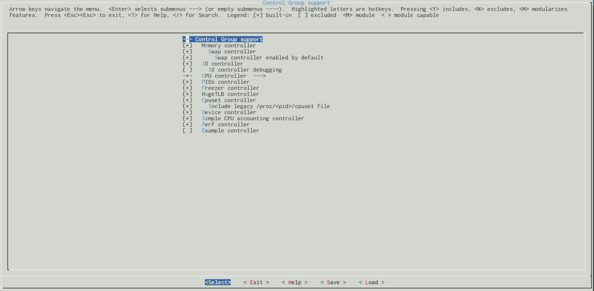

<center><font size='5'>Linux内核控制组</font></center>
<center><font size='6'>初识cgroup</font></center>
<br/>
<br/>
<center><font size='5'>rtoax</font></center>
<center><font size='5'>2021年3月</font></center>
<br/>

* 在[英文原文](https://0xax.gitbook.io/linux-insides)基础上，针对[中文译文](https://xinqiu.gitbooks.io/linux-insides-cn)增加5.10.13内核源码相关内容。

# 1. 控制组简介


这是 [linux 内核揭秘](http://0xax.gitbooks.io/linux-insides/content/) 的新一章的第一部分。你可以根据这部分的标题猜测 - 这一部分将涉及 Linux 内核中的 [`控制组`](https://en.wikipedia.org/wiki/Cgroups) 或 `cgroups` 机制。

`Cgroups` 是由 Linux 内核提供的一种机制，它允许我们分配诸如处理器时间、每组进程的数量、每个 `cgroup` 的内存大小，或者针对一个或一组进程的上述资源的组合。`Cgroups` 是按照层级结构组织的，这种机制类似于通常的进程，他们也是层级结构，并且子 `cgroups` 会继承其上级的一些属性。但实际上他们还是有区别的。`cgroups` 和进程之间的主要区别在于，多个不同层级的 `cgroup` 可以同时存在，而进程树则是单一的。同时存在的多个不同层级的 `cgroup` 并不是任意的，因为每个 `cgroup` 层级都要附加到一组 `cgroup` "子系统"中。

每个 `cgroup` 子系统代表一种资源，如针对某个 `cgroup` 的处理器时间或者 [pid](https://en.wikipedia.org/wiki/Process_identifier)  的数量，也叫进程数。Linux 内核提供对以下 12 种 `cgroup` 子系统的支持：

* `cpuset` - 为 `cgroup` 内的任务分配独立的处理器和内存节点；
* `cpu` - 使用调度程序对 `cgroup` 内的任务提供 CPU 资源的访问；
* `cpuacct` - 生成 `cgroup` 中所有任务的处理器使用情况报告；
* `io` - 限制对[块设备](https://en.wikipedia.org/wiki/Device_file)的读写操作;
* `memory` - 限制 `cgroup` 中的一组任务的内存使用;
* `devices` - 限制 `cgroup` 中的一组任务访问设备；
* `freezer` - 允许 `cgroup` 中的一组任务挂起/恢复；
* `net_cls` - 允许对 `cgroup` 中的任务产生的网络数据包进行标记；
* `net_prio` - 针对 `cgroup` 中的每个网络接口提供一种动态修改网络流量优先级的方法；
* `perf_event` - 支持访问 `cgroup` 中的[性能事件](https://en.wikipedia.org/wiki/Perf_\(Linux\));
* `hugetlb` - 为 `cgroup` 开启对[大页内存](https://www.kernel.org/doc/Documentation/vm/hugetlbpage.txt)的支持;
* `pid` - 限制 `cgroup` 中的进程数量。

每个 `cgroup` 子系统是否被支持均与相关配置选项有关。例如，`cpuset` 子系统应该通过 `CONFIG_CPUSETS` 内核配置选项启用，`io` 子系统通过 `CONFIG_BLK_CGROUP` 内核配置选项等。所有这些内核配置选项都可以在 `General setup → Control Group support` 菜单里找到：


你可以通过 [proc](https://en.wikipedia.org/wiki/Procfs) 虚拟文件系统在计算机上查看已经启用的 `cgroup`：

```
$ cat /proc/cgroups 
# cat /proc/cgroups 
#subsys_name	hierarchy	num_cgroups	enabled
cpuset	7	1	1
cpu	9	1	1
cpuacct	9	1	1
blkio	8	1	1
memory	10	1	1
devices	11	47	1
freezer	6	1	1
net_cls	2	1	1
perf_event	5	1	1
hugetlb	4	1	1
pids	3	1	1
```

或者通过 [sysfs](https://en.wikipedia.org/wiki/Sysfs) 虚拟文件系统查看:

```
$ ls -l /sys/fs/cgroup/
总用量 0
dr-xr-xr-x 2 root root  0 4月   1 14:55 blkio
lrwxrwxrwx 1 root root 11 4月   1 14:55 cpu -> cpu,cpuacct
lrwxrwxrwx 1 root root 11 4月   1 14:55 cpuacct -> cpu,cpuacct
dr-xr-xr-x 2 root root  0 4月   1 14:55 cpu,cpuacct
dr-xr-xr-x 2 root root  0 4月   1 14:55 cpuset
dr-xr-xr-x 4 root root  0 4月   1 14:55 devices
dr-xr-xr-x 2 root root  0 4月   1 14:55 freezer
dr-xr-xr-x 2 root root  0 4月   1 14:55 hugetlb
dr-xr-xr-x 2 root root  0 4月   1 14:55 memory
dr-xr-xr-x 2 root root  0 4月   1 14:55 net_cls
dr-xr-xr-x 2 root root  0 4月   1 14:55 perf_event
dr-xr-xr-x 2 root root  0 4月   1 14:55 pids
dr-xr-xr-x 4 root root  0 4月   1 14:55 systemd
```

正如你所猜测的那样，`cgroup` 机制不只是针对 Linux 内核的需求而创建的，更多的是用户空间层面的需求。要使用 `cgroup` ，需要先创建它。我们可以通过两种方式来创建。

第一种方法是在 `/sys/fs/cgroup` 目录下的任意子系统中创建子目录，并将任务的 pid 添加到 `tasks` 文件中，这个文件在我们创建子目录后会自动创建。

第二种方法是使用 `libcgroup` 库提供的工具集来创建/销毁/管理 `cgroups`(在 Fedora 中是 `libcgroup-tools`)。

我们来看一个简单的例子。下面的 [bash](https://www.gnu.org/software/bash/) 脚本会持续把一行信息输出到代表当前进程的控制终端的设备：

```shell
#!/bin/bash

while :
do
    echo "print line" > /dev/tty
    sleep 5
done
```

因此，如果我们运行这个脚本，将看到下面的结果：

```
$ sudo chmod +x cgroup_test_script.sh
~$ ./cgroup_test_script.sh 
print line
print line
print line
...
...
...
```

现在让我们进入系统中 `cgroupfs` 的挂载点。前面说到，它位于 `/sys/fs/cgroup` 目录，但你可以将它挂载到任何你希望的地方。

```
$ cd /sys/fs/cgroup
```

接着我们进入 `devices` 子目录，这个子目录表示允许或拒绝 `cgroup` 中的任务访问的设备：

```
# cd devices
```

然后在这里创建 `cgroup_test_group` 目录：

```
# mkdir cgroup_test_group
```

创建 `cgroup_test_group` 目录之后，会在目录下生成以下文件：

```
[rongtao@localhost cgroup_test_group]$ ls -l
总用量 0
-rw-r--r-- 1 root root 0 4月   2 15:44 cgroup.clone_children
--w--w--w- 1 root root 0 4月   2 15:44 cgroup.event_control
-rw-r--r-- 1 root root 0 4月   2 15:44 cgroup.procs
--w------- 1 root root 0 4月   2 15:44 devices.allow
--w------- 1 root root 0 4月   2 15:44 devices.deny
-r--r--r-- 1 root root 0 4月   2 15:44 devices.list
-rw-r--r-- 1 root root 0 4月   2 15:44 notify_on_release
-rw-r--r-- 1 root root 0 4月   2 15:44 tasks
[rongtao@localhost cgroup_test_group]$ pwd
/sys/fs/cgroup/devices/cgroup_test_group
```

现在我们重点关注 `tasks` 和 `devices.deny` 这两个文件。第一个文件 `tasks` 包含的是要附加到 `cgroup_test_group` `cgroup` 的 pid，第二个文件 `devices.deny` 包含的是拒绝访问的设备列表。新创建的 `cgroup` 默认对设备没有任何访问限制。为了禁止访问某个设备(在我们的示例中是 `/dev/tty`)，我们应该向 `devices.deny` 写入下面这行：

```
# echo "c 5:0 w" > devices.deny
```

我们来对这行进行详细解读。第一个字符 `c` 表示一种设备类型，我们示例中的 `/dev/tty` 是“字符设备”，我们可以通过 `ls` 命令的输出对此进行验证：

```
~$ ls -l /dev/tty
crw-rw-rw- 1 root tty 5, 0 Dec  3 22:48 /dev/tty
```

可以看到权限列表中的第一个字符是 `c`。第二部分的 `5:0` 是设备的主次设备号，你也可以在 `ls` 命令的输出中看到。最后的字符 `w` 表示禁止 `cgroups` 中的任务对指定的设备执行写入操作。现在让我们再次运行 `cgroup_test_script.sh` 脚本：

```
~$ ./cgroup_test_script.sh 
print line
print line
print line
...
...
```

没有任何效果。再把这个进程的 pid 加到我们 `cgroup` 的 `devices/tasks` 文件：

```
# echo $(pidof -x cgroup_test_script.sh) > /sys/fs/cgroup/devices/cgroup_test_group/tasks
```

现在，脚本的运行结果和预期的一样：

```
~$ ./cgroup_test_script.sh 
print line
print line
print line
print line
print line
print line
./cgroup_test_script.sh: line 5: /dev/tty: Operation not permitted
```

在你运行 [docker](https://en.wikipedia.org/wiki/Docker_\(software\)) 容器的时候也会出现类似的情况：

```
~$ docker ps
CONTAINER ID        IMAGE               COMMAND                  CREATED             STATUS              PORTS                    NAMES
fa2d2085cd1c        mariadb:10          "docker-entrypoint..."   12 days ago         Up 4 minutes        0.0.0.0:3306->3306/tcp   mysql-work

~$ cat /sys/fs/cgroup/devices/docker/fa2d2085cd1c8d797002c77387d2061f56fefb470892f140d0dc511bd4d9bb61/tasks | head -3
5501
5584
5585
...
...
...
```

因此，在 `docker` 容器的启动过程中，`docker` 会为这个容器中的进程创建一个 `cgroup`：

```
$ docker exec -it mysql-work /bin/bash
$ top
 PID USER      PR  NI    VIRT    RES    SHR S  %CPU %MEM     TIME+ COMMAND                                                                                   1 mysql     20   0  963996 101268  15744 S   0.0  0.6   0:00.46 mysqld                                                                                  71 root      20   0   20248   3028   2732 S   0.0  0.0   0:00.01 bash                                                                                    77 root      20   0   21948   2424   2056 R   0.0  0.0   0:00.00 top                                                                                  
```

我们可以在宿主机上看到这个 `cgroup`：

```C
$ systemd-cgls

Control group /:
-.slice
├─docker
│ └─fa2d2085cd1c8d797002c77387d2061f56fefb470892f140d0dc511bd4d9bb61
│   ├─5501 mysqld
│   └─6404 /bin/bash
```

现在我们了解了一些关于 `cgroup` 的机制，如何手动使用它，以及这个机制的用途。是时候深入 Linux 内核源码来了解这个机制的实现了。


# 2. `cgroup` 的早期初始化


现在，在我们刚刚看到关于 Linux 内核的 `cgroup` 机制的一些理论之后，我们可以开始深入到 Linux 的内核源码，以便更深入的了解这种机制。

与往常一样，我们将从 `cgroup` 的初始化开始。在 Linux 内核中，`cgroups` 的初始化分为两个部分：早期和晚期。在这部分我们只考虑“早期”的部分，“晚期”的部分会在下一部分考虑。

`Cgroups` 的早期初始化是在 Linux 内核的早期初始化期间从 [init/main.c](https://github.com/torvalds/linux/blob/16f73eb02d7e1765ccab3d2018e0bd98eb93d973/init/main.c) 中调用：

```C
cgroup_init_early();
```
函数开始的。这个函数定义在源文件 [kernel/cgroup.c](https://github.com/torvalds/linux/blob/16f73eb02d7e1765ccab3d2018e0bd98eb93d973/kernel/cgroup.c) 中，从下面两个局部变量的定义开始：

```C
int __init cgroup_init_early(void)
{
	static struct cgroup_sb_opts __initdata opts;/* 5.10.13没有了这个 */
	struct cgroup_subsys *ss;
    ...
    ...
    ...
}
```
5.10.13是：

```c
int __init cgroup_init_early(void)/* cgroup 初始化 提前批 */
{
	static struct cgroup_fs_context __initdata ctx;/*  */
	struct cgroup_subsys *ss;   /*  */
	...
```
`cgroup_sb_opts` 结构体的定义也可以在这个源文件中找到：

```C
struct cgroup_sb_opts {
	u16 subsys_mask;
	unsigned int flags;
	char *release_agent;
	bool cpuset_clone_children;
	char *name;
	bool none;
};
```

用来表示 `cgroupfs` 的挂载选项。例如，我们可以使用 `name=` 选项创建指定名称的 cgroup 层级(本示例中以 `my_cgrp` 命名)，不附加到任何子系统：

```
$ mount -t cgroup -oname=my_cgrp,none /mnt/cgroups
```

第二个变量 - `ss` 是 `cgroup_subsys` 结构体，这个结构体定义在 [include/linux/cgroup-defs.h](https://github.com/torvalds/linux/blob/16f73eb02d7e1765ccab3d2018e0bd98eb93d973/include/linux/cgroup-defs.h) 头文件中。你可以从这个结构体的名称中猜到，这个变量表示一个 `cgroup` 子系统。这个结构体包含多个字段和回调函数，如：

```C
struct cgroup_subsys {
    int (*css_online)(struct cgroup_subsys_state *css);
    void (*css_offline)(struct cgroup_subsys_state *css);
    ...
    ...
    ...
    bool early_init:1;
    int id;
    const char *name;
    struct cgroup_root *root;
    ...
    ...
    ...
}
```

例如，`css_online` 和 `css_offline` 回调分别在 cgroup 成功完成所有分配之后和 cgroup 释放之前调用，`early_init` 标志位用来标记子系统是否要提前初始化，`id` 和 `name` 字段分别表示在 cgroup 中已注册的子系统的唯一标识和子系统的”名称“。最后的 `root` 字段指向 cgroup 层级结构的根。

当然，`cgroup_subsys` 结构体还有一些其他字段，比上面展示的要多，不过目前了解这么多已经够了。现在我们了解了与 `cgroups` 机制有关的重要结构体，让我们再回到 `cgroup_init_early` 函数。这个函数的主要目的是对一些子系统进行早期初始化。你可能已经猜到了，这些需要”早期“初始化的子系统的 `cgroup_subsys->early_init` 字段应该为 `1`。来看看哪些子系统可以提前初始化吧。

在两个局部变量定义之后，我们可以看到下面几行代码：

```C
init_cgroup_root(&cgrp_dfl_root, &opts);
cgrp_dfl_root.cgrp.self.flags |= CSS_NO_REF;
```

这里我们可以看到 `init_cgroup_root` 函数的调用，它会使用缺省的层级结构进行初始化。接着我们在缺省的 `cgroup` 中设置 `CSS_NO_REF` 标志来禁止这个 css 的引用计数。`cgrp_dfl_root` 的定义也在这个文件中：

```C
struct cgroup_root cgrp_dfl_root;
```

这里的 `cgrp` 字段是 `cgroup` 结构体，你也许已经猜到了，它表示一个 `cgroup`，`cgroup` 定义在 [include/linux/cgroup-defs.h](https://github.com/torvalds/linux/blob/16f73eb02d7e1765ccab3d2018e0bd98eb93d973/include/linux/cgroup-defs.h) 头文件中。我们知道一个进程在 Linux 内核中是用 `task_struct` 结构体表示的， `task_struct` 并不包含直接访问这个任务所属的 `cgroup` 的链接，但是可以通过 `task_struct` 的 `css_set` 字段访问。这个 `css_set` 结构体拥有指向子系统状态数组的指针：

```C
struct css_set {
    ...
    ...
    ....
    struct cgroup_subsys_state *subsys[CGROUP_SUBSYS_COUNT];
    ...
    ...
    ...
}
```

通过 `cgroup_subsys_state` 结构体，一个进程可以找到其所属的 `cgroup`：
```C
struct cgroup_subsys_state {
    ...
    ...
    ...
    struct cgroup *cgroup;
    ...
    ...
    ...
}
```

所以，`cgroups` 相关数据结构的整体情况如下：

```                                                 
+-------------+         +---------------------+    +------------->+---------------------+          +----------------+
| task_struct |         |       css_set       |    |              | cgroup_subsys_state |          |     cgroup     |
+-------------+         |                     |    |              +---------------------+          +----------------+
|             |         |                     |    |              |                     |          |     flags      |
|             |         |                     |    |              +---------------------+          |  cgroup.procs  |
|             |         |                     |    |              |        cgroup       |--------->|       id       |
|             |         |                     |    |              +---------------------+          |      ....      | 
|-------------+         |---------------------+----+                                               +----------------+
|   cgroups   | ------> | cgroup_subsys_state | array of cgroup_subsys_state
|-------------+         +---------------------+------------------>+---------------------+          +----------------+
|             |         |                     |                   | cgroup_subsys_state |          |      cgroup    |
+-------------+         +---------------------+                   +---------------------+          +----------------+
                                                                  |                     |          |      flags     |
                                                                  +---------------------+          |   cgroup.procs |
                                                                  |        cgroup       |--------->|        id      |
                                                                  +---------------------+          |       ....     |
                                                                  |    cgroup_subsys    |          +----------------+
                                                                  +---------------------+
                                                                             |
                                                                             |
                                                                             ↓
                                                                  +---------------------+
                                                                  |    cgroup_subsys    |
                                                                  +---------------------+
                                                                  |         id          |
                                                                  |        name         |
                                                                  |      css_online     |
                                                                  |      css_ofline     |
                                                                  |        attach       |
                                                                  |         ....        |
                                                                  +---------------------+
```


因此，`init_cgroup_root` 函数使用默认值设置 `cgrp_dfl_root`。接下来的工作是把初始化的 `css_set` 分配给 `init_task`，它表示系统中的第一个进程：

```C
RCU_INIT_POINTER(init_task.cgroups, &init_css_set);
```

`cgroup_init_early` 函数里最后一件重要的任务是 `early cgroups` 的初始化。在这里，我们遍历所有已注册的子系统，给子系统分配一个唯一的标识号和名称，并且对标记为早期的子系统调用 `cgroup_init_subsys` 函数：

```C
for_each_subsys(ss, i) {
	ss->id = i;
	ss->name = cgroup_subsys_name[i];

    if (ss->early_init)
		cgroup_init_subsys(ss, true);
}
```

这里的 `for_each_subsys` 是 [kernel/cgroup.c](https://github.com/torvalds/linux/blob/16f73eb02d7e1765ccab3d2018e0bd98eb93d973/kernel/cgroup.c) 源文件中的一个宏定义，正好扩展成基于 `cgroup_subsys` 数组的 for 循环。这个数组的定义可以在该源文件中找到，它看起来有点不寻常：

```C
#define SUBSYS(_x) [_x ## _cgrp_id] = &_x ## _cgrp_subsys,
    static struct cgroup_subsys *cgroup_subsys[] = {
        #include <linux/cgroup_subsys.h>
};
#undef SUBSYS
```

它被定义为 `SUBSYS` 宏，它接受一个参数(子系统名称)，并定义了 cgroup 子系统的 `cgroup_subsys`数组。另外，我们可以看到这个数组是使用 [linux/cgroup_subsys.h](https://github.com/torvalds/linux/blob/16f73eb02d7e1765ccab3d2018e0bd98eb93d973/include/linux/cgroup_subsys.h) 头文件的内容进行初始化。如果我们看一下这个头文件，就会发现一组具有给定子系统名称的 `SUBSYS` 宏：

```C
#if IS_ENABLED(CONFIG_CPUSETS)
SUBSYS(cpuset)
#endif

#if IS_ENABLED(CONFIG_CGROUP_SCHED)
SUBSYS(cpu)
#endif
...
...
...
```

可以这样定义是因为第一个 `SUBSYS` 的宏定义后面的 `#undef` 语句。来看看 `&_x ## _cgrp_subsys` 表达式，在 `C` 语言的宏定义中，`##` 操作符连接左右两边的表达式，所以当我们把 `cpuset`、`cpu` 等参数传给 `SUBSYS` 宏时，其实是在定义 `cpuset_cgrp_subsys`、`cp_cgrp_subsys`。确实如此，在 [kernel/cpuset.c](https://github.com/torvalds/linux/blob/16f73eb02d7e1765ccab3d2018e0bd98eb93d973/kernel/cpuset.c) 源文件中你可以看到这些结构体的定义：

```C
struct cgroup_subsys cpuset_cgrp_subsys = {
    ...
    ...
    ...
	.early_init	= true,
};
```

总共如下：
```c
[rongtao@localhost src]$ grep -rn "struct cgroup_subsys [a-z]" | awk '{print $3}'
hugetlb_cgrp_subsys
memory_cgrp_subsys
rdma_cgrp_subsys
pids_cgrp_subsys
freezer_cgrp_subsys
debug_cgrp_subsys
cpuset_cgrp_subsys
perf_event_cgrp_subsys
cpu_cgrp_subsys
cpuacct_cgrp_subsys
net_cls_cgrp_subsys
net_prio_cgrp_subsys
io_cgrp_subsys
devices_cgrp_subsys
```


因此，`cgroup_init_early` 函数中的最后一步是调用 `cgroup_init_subsys` 函数完成早期子系统的初始化，下面的早期子系统将被初始化：

* `cpuset`;
* `cpu`;
* `cpuacct`.

`cgroup_init_subsys` 函数使用缺省值对指定的子系统进行初始化。比如，设置层级结构的根，使用 `css_alloc` 回调函数为指定的子系统分配空间，将一个子系统链接到一个已经存在的子系统，为初始进程分配子系统等。

至此，早期子系统就初始化结束了。

# 3. 结束语


这是第一部分的结尾，它描述了 Linux 内核中 `cgroup` 机制的引入，我们讨论了与 `cgroup` 机制相关的一些理论和初始化步骤，在接下来的部分中，我们将继续深入讨论 `cgroup` 更实用的方面。

如果你有任何问题或建议，可以写评论给我，也可以在 [twitter](https://twitter.com/0xAX) 上联系我。

**请注意，英语不是我的第一语言，对于任何不便，我深表歉意。如果你发现任何错误，请给我发送一个 PR 到 [linux-insides](https://github.com/0xAX/linux-insides).**

# 4. 链接


* [control groups](https://en.wikipedia.org/wiki/Cgroups)
* [PID](https://en.wikipedia.org/wiki/Process_identifier)
* [cpuset](http://man7.org/linux/man-pages/man7/cpuset.7.html)
* [block devices](https://en.wikipedia.org/wiki/Device_file)
* [huge pages](https://www.kernel.org/doc/Documentation/vm/hugetlbpage.txt)
* [sysfs](https://en.wikipedia.org/wiki/Sysfs)
* [proc](https://en.wikipedia.org/wiki/Procfs)
* [cgroups kernel documentation](https://www.kernel.org/doc/Documentation/cgroup-v1/cgroups.txt)
* [cgroups v2](https://www.kernel.org/doc/Documentation/cgroup-v2.txt)
* [bash](https://www.gnu.org/software/bash/)
* [docker](https://en.wikipedia.org/wiki/Docker_\(software\))
* [perf events](https://en.wikipedia.org/wiki/Perf_\(Linux\))
* [Previous chapter](https://0xax.gitbooks.io/linux-insides/content/MM/linux-mm-1.html)


<center><font size='6'>英文原文</font></center>


Control Groups
================================================================================

Introduction
--------------------------------------------------------------------------------

This is the first part of the new chapter of the [linux insides](https://github.com/0xAX/linux-insides/blob/master/SUMMARY.md) book and as you may guess by part's name - this part will cover [control groups](https://en.wikipedia.org/wiki/Cgroups) or `cgroups` mechanism in the Linux kernel.

`Cgroups` are special mechanism provided by the Linux kernel which allows us to allocate kind of `resources` like processor time, number of processes per group, amount of memory per control group or combination of such resources for a process or set of processes. `Cgroups` are organized hierarchically and here this mechanism is similar to usual processes as they are hierarchical too and child `cgroups` inherit set of certain parameters from their parents. But actually they are not the same. The main differences between `cgroups` and normal processes that many different hierarchies of control groups may exist simultaneously in one time while normal process tree is always single. This was not a casual step because each control group hierarchy is attached to set of control group `subsystems`.

One `control group subsystem` represents one kind of resources like a processor time or number of [pids](https://en.wikipedia.org/wiki/Process_identifier) or in other words number of processes for a `control group`. Linux kernel provides support for following twelve `control group subsystems`:

* `cpuset` - assigns individual processor(s) and memory nodes to task(s) in a group;
* `cpu` - uses the scheduler to provide cgroup tasks access to the processor resources;
* `cpuacct` - generates reports about processor usage by a group;
* `io` - sets limit to read/write from/to [block devices](https://en.wikipedia.org/wiki/Device_file);
* `memory` - sets limit on memory usage by a task(s) from a group;
* `devices` - allows access to devices by a task(s) from a group;
* `freezer` - allows to suspend/resume for a task(s) from a group;
* `net_cls` - allows to mark network packets from task(s) from a group;
* `net_prio` - provides a way to dynamically set the priority of network traffic per network interface for a group;
* `perf_event` - provides access to [perf events](https://en.wikipedia.org/wiki/Perf_\(Linux\)) to a group;
* `hugetlb` - activates support for [huge pages](https://www.kernel.org/doc/Documentation/vm/hugetlbpage.txt) for a group;
* `pid` - sets limit to number of processes in a group.

Each of these control group subsystems depends on related configuration option. For example the `cpuset` subsystem should be enabled via `CONFIG_CPUSETS` kernel configuration option, the `io` subsystem via `CONFIG_BLK_CGROUP` kernel configuration option and etc. All of these kernel configuration options may be found in the `General setup → Control Group support` menu:



You may see enabled control groups on your computer via [proc](https://en.wikipedia.org/wiki/Procfs) filesystem:

```
$ cat /proc/cgroups 
#subsys_name	hierarchy	num_cgroups	enabled
cpuset	8	1	1
cpu	7	66	1
cpuacct	7	66	1
blkio	11	66	1
memory	9	94	1
devices	6	66	1
freezer	2	1	1
net_cls	4	1	1
perf_event	3	1	1
net_prio	4	1	1
hugetlb	10	1	1
pids	5	69	1
```

or via [sysfs](https://en.wikipedia.org/wiki/Sysfs):

```
$ ls -l /sys/fs/cgroup/
total 0
dr-xr-xr-x 5 root root  0 Dec  2 22:37 blkio
lrwxrwxrwx 1 root root 11 Dec  2 22:37 cpu -> cpu,cpuacct
lrwxrwxrwx 1 root root 11 Dec  2 22:37 cpuacct -> cpu,cpuacct
dr-xr-xr-x 5 root root  0 Dec  2 22:37 cpu,cpuacct
dr-xr-xr-x 2 root root  0 Dec  2 22:37 cpuset
dr-xr-xr-x 5 root root  0 Dec  2 22:37 devices
dr-xr-xr-x 2 root root  0 Dec  2 22:37 freezer
dr-xr-xr-x 2 root root  0 Dec  2 22:37 hugetlb
dr-xr-xr-x 5 root root  0 Dec  2 22:37 memory
lrwxrwxrwx 1 root root 16 Dec  2 22:37 net_cls -> net_cls,net_prio
dr-xr-xr-x 2 root root  0 Dec  2 22:37 net_cls,net_prio
lrwxrwxrwx 1 root root 16 Dec  2 22:37 net_prio -> net_cls,net_prio
dr-xr-xr-x 2 root root  0 Dec  2 22:37 perf_event
dr-xr-xr-x 5 root root  0 Dec  2 22:37 pids
dr-xr-xr-x 5 root root  0 Dec  2 22:37 systemd
```

As you already may guess that `control groups` mechanism is not such mechanism which was invented only directly to the needs of the Linux kernel, but mostly for userspace needs. To use a `control group`, we should create it at first. We may create a `cgroup` via two ways.

The first way is to create subdirectory in any subsystem from `/sys/fs/cgroup` and add a pid of a task to a `tasks` file which will be created automatically right after we will create the subdirectory.

The second way is to create/destroy/manage `cgroups` with utils from `libcgroup` library (`libcgroup-tools` in Fedora).

Let's consider simple example. Following [bash](https://www.gnu.org/software/bash/) script will print a line to `/dev/tty` device which represents control terminal for the current process:

```shell
#!/bin/bash

while :
do
    echo "print line" > /dev/tty
    sleep 5
done
```

So, if we will run this script we will see following result:

```
$ sudo chmod +x cgroup_test_script.sh
~$ ./cgroup_test_script.sh 
print line
print line
print line
...
...
...
```

Now let's go to the place where `cgroupfs` is mounted on our computer. As we just saw, this is `/sys/fs/cgroup` directory, but you may mount it everywhere you want.

```
$ cd /sys/fs/cgroup
```

And now let's go to the `devices` subdirectory which represents kind of resources that allows or denies access to devices by tasks in a `cgroup`:

```
# cd devices
```

and create `cgroup_test_group` directory there:

```
# mkdir cgroup_test_group
```

After creation of the `cgroup_test_group` directory, following files will be generated there:

```
/sys/fs/cgroup/devices/cgroup_test_group$ ls -l
total 0
-rw-r--r-- 1 root root 0 Dec  3 22:55 cgroup.clone_children
-rw-r--r-- 1 root root 0 Dec  3 22:55 cgroup.procs
--w------- 1 root root 0 Dec  3 22:55 devices.allow
--w------- 1 root root 0 Dec  3 22:55 devices.deny
-r--r--r-- 1 root root 0 Dec  3 22:55 devices.list
-rw-r--r-- 1 root root 0 Dec  3 22:55 notify_on_release
-rw-r--r-- 1 root root 0 Dec  3 22:55 tasks
```

For this moment we are interested in `tasks` and `devices.deny` files. The first `tasks` files should contain pid(s) of processes which will be attached to the `cgroup_test_group`. The second `devices.deny` file contain list of denied devices. By default a newly created group has no any limits for devices access. To forbid a device (in our case it is `/dev/tty`) we should write to the `devices.deny` following line:

```
# echo "c 5:0 w" > devices.deny
```

Let's go step by step through this line. The first `c` letter represents type of a device. In our case the `/dev/tty` is `char device`. We can verify this from output of `ls` command:

```
~$ ls -l /dev/tty
crw-rw-rw- 1 root tty 5, 0 Dec  3 22:48 /dev/tty
```

see the first `c` letter in a permissions list. The second part is `5:0` is major and minor numbers of the device. You can see these numbers in the output of `ls` too. And the last `w` letter forbids tasks to write to the specified device. So let's start the `cgroup_test_script.sh` script:

```
~$ ./cgroup_test_script.sh 
print line
print line
print line
...
...
```

and add pid of this process to the `devices/tasks` file of our group:

```
# echo $(pidof -x cgroup_test_script.sh) > /sys/fs/cgroup/devices/cgroup_test_group/tasks
```

The result of this action will be as expected:

```
~$ ./cgroup_test_script.sh 
print line
print line
print line
print line
print line
print line
./cgroup_test_script.sh: line 5: /dev/tty: Operation not permitted
```

Similar situation will be when you will run you [docker](https://en.wikipedia.org/wiki/Docker_\(software\)) containers for example:

```
~$ docker ps
CONTAINER ID        IMAGE               COMMAND                  CREATED             STATUS              PORTS                    NAMES
fa2d2085cd1c        mariadb:10          "docker-entrypoint..."   12 days ago         Up 4 minutes        0.0.0.0:3306->3306/tcp   mysql-work

~$ cat /sys/fs/cgroup/devices/docker/fa2d2085cd1c8d797002c77387d2061f56fefb470892f140d0dc511bd4d9bb61/tasks | head -3
5501
5584
5585
...
...
...
```

So, during startup of a `docker` container, `docker` will create a `cgroup` for processes in this container:

```
$ docker exec -it mysql-work /bin/bash
$ top
  PID USER      PR  NI    VIRT    RES    SHR S  %CPU %MEM     TIME+ COMMAND                                                                                   1 mysql     20   0  963996 101268  15744 S   0.0  0.6   0:00.46 mysqld
   71 root      20   0   20248   3028   2732 S   0.0  0.0   0:00.01 bash
   77 root      20   0   21948   2424   2056 R   0.0  0.0   0:00.00 top
```

And we may see this `cgroup` on host machine:

```C
$ systemd-cgls

Control group /:
-.slice
├─docker
│ └─fa2d2085cd1c8d797002c77387d2061f56fefb470892f140d0dc511bd4d9bb61
│   ├─5501 mysqld
│   └─6404 /bin/bash
```

Now we know a little about `control groups` mechanism, how to use it manually and what's purpose of this mechanism. It's time to look inside of the Linux kernel source code and start to dive into implementation of this mechanism.

Early initialization of control groups
--------------------------------------------------------------------------------

Now after we just saw little theory about `control groups` Linux kernel mechanism, we may start to dive into the source code of Linux kernel to acquainted with this mechanism closer. As always we will start from the initialization of `control groups`. Initialization of `cgroups` divided into two parts in the Linux kernel: early and late. In this part we will consider only `early` part and `late` part will be considered in next parts.

Early initialization of `cgroups` starts from the call of the:

```C
cgroup_init_early();
```

function in the [init/main.c](https://github.com/torvalds/linux/blob/16f73eb02d7e1765ccab3d2018e0bd98eb93d973/init/main.c) during early initialization of the Linux kernel. This function is defined in the [kernel/cgroup/cgroup.c](https://github.com/torvalds/linux/blob/master/kernel/cgroup/cgroup.c) source code file and starts from the definition of two following local variables:

```C
int __init cgroup_init_early(void)
{
	static struct cgroup_sb_opts __initdata opts;
	struct cgroup_subsys *ss;
    ...
    ...
    ...
}
```

The `cgroup_sb_opts` structure defined in the same source code file and looks:

```C
struct cgroup_sb_opts {
	u16 subsys_mask;
	unsigned int flags;
	char *release_agent;
	bool cpuset_clone_children;
	char *name;
	bool none;
};
```

which represents mount options of `cgroupfs`. For example we may create named cgroup hierarchy (with name `my_cgrp`) with the `name=` option and without any subsystems:

```
$ mount -t cgroup -oname=my_cgrp,none /mnt/cgroups
```

The second variable - `ss` has type - `cgroup_subsys` structure which is defined in the [include/linux/cgroup-defs.h](https://github.com/torvalds/linux/blob/16f73eb02d7e1765ccab3d2018e0bd98eb93d973/include/linux/cgroup-defs.h) header file and as you may guess from the name of the type, it represents a `cgroup` subsystem. This structure contains various fields and callback functions like:

```C
struct cgroup_subsys {
    int (*css_online)(struct cgroup_subsys_state *css);
    void (*css_offline)(struct cgroup_subsys_state *css);
    ...
    ...
    ...
    bool early_init:1;
    int id;
    const char *name;
    struct cgroup_root *root;
    ...
    ...
    ...
}
```

Where for example `css_online` and `css_offline` callbacks are called after a cgroup successfully will complete all allocations and a cgroup will be before releasing respectively. The `early_init` flags marks subsystems which may/should be initialized early. The `id` and `name` fields represents unique identifier in the array of registered subsystems for a cgroup and `name` of a subsystem respectively. The last - `root` fields represents pointer to the root of of a cgroup hierarchy.

Of course the `cgroup_subsys` structure is bigger and has other fields, but it is enough for now. Now as we got to know important structures related to `cgroups` mechanism, let's return to the `cgroup_init_early` function. Main purpose of this function is to do early initialization of some subsystems. As you already may guess, these `early` subsystems should have `cgroup_subsys->early_init = 1`. Let's look what subsystems may be initialized early.

After the definition of the two local variables we may see following lines of code:

```C
init_cgroup_root(&cgrp_dfl_root, &opts);
cgrp_dfl_root.cgrp.self.flags |= CSS_NO_REF;
```

Here we may see call of the `init_cgroup_root` function which will execute initialization of the default unified hierarchy and after this we set `CSS_NO_REF` flag in state of this default `cgroup` to disable reference counting for this css. The `cgrp_dfl_root` is defined in the same source code file:

```C
struct cgroup_root cgrp_dfl_root;
```

Its `cgrp` field represented by the `cgroup` structure which represents a `cgroup` as you already may guess and defined in the [include/linux/cgroup-defs.h](https://github.com/torvalds/linux/blob/16f73eb02d7e1765ccab3d2018e0bd98eb93d973/include/linux/cgroup-defs.h) header file. We already know that a process which is represented by the `task_struct` in the Linux kernel. The `task_struct` does not contain direct link to a `cgroup` where this task is attached. But it may be reached via `css_set` field of the `task_struct`. This `css_set` structure holds pointer to the array of subsystem states:

```C
struct css_set {
    ...
    ...
    ....
    struct cgroup_subsys_state *subsys[CGROUP_SUBSYS_COUNT];
    ...
    ...
    ...
}
```

And via the `cgroup_subsys_state`, a process may get a `cgroup` that this process is attached to:

```C
struct cgroup_subsys_state {
    ...
    ...
    ...
    struct cgroup *cgroup;
    ...
    ...
    ...
}
```

So, the overall picture of `cgroups` related data structure is following:

```                                                 
+-------------+         +---------------------+    +------------->+---------------------+          +----------------+
| task_struct |         |       css_set       |    |              | cgroup_subsys_state |          |     cgroup     |
+-------------+         |                     |    |              +---------------------+          +----------------+
|             |         |                     |    |              |                     |          |     flags      |
|             |         |                     |    |              +---------------------+          |  cgroup.procs  |
|             |         |                     |    |              |        cgroup       |--------->|       id       |
|             |         |                     |    |              +---------------------+          |      ....      | 
|-------------+         |---------------------+----+                                               +----------------+
|   cgroups   | ------> | cgroup_subsys_state | array of cgroup_subsys_state
|-------------+         +---------------------+------------------>+---------------------+          +----------------+
|             |         |                     |                   | cgroup_subsys_state |          |      cgroup    |
+-------------+         +---------------------+                   +---------------------+          +----------------+
                                                                  |                     |          |      flags     |
                                                                  +---------------------+          |   cgroup.procs |
                                                                  |        cgroup       |--------->|        id      |
                                                                  +---------------------+          |       ....     |
                                                                  |    cgroup_subsys    |          +----------------+
                                                                  +---------------------+
                                                                             |
                                                                             |
                                                                             ↓
                                                                  +---------------------+
                                                                  |    cgroup_subsys    |
                                                                  +---------------------+
                                                                  |         id          |
                                                                  |        name         |
                                                                  |      css_online     |
                                                                  |      css_ofline     |
                                                                  |        attach       |
                                                                  |         ....        |
                                                                  +---------------------+
```


So, the `init_cgroup_root` fills the `cgrp_dfl_root` with the default values. The next thing is assigning initial `css_set` to the `init_task` which represents first process in the system:

```C
RCU_INIT_POINTER(init_task.cgroups, &init_css_set);
```

And the last big thing in the `cgroup_init_early` function is initialization of `early cgroups`. Here we go over all registered subsystems and assign unique identity number, name of a subsystem and call the `cgroup_init_subsys` function for subsystems which are marked as early:

```C
for_each_subsys(ss, i) {
		ss->id = i;
		ss->name = cgroup_subsys_name[i];

        if (ss->early_init)
			cgroup_init_subsys(ss, true);
}
```

The `for_each_subsys` here is a macro which is defined in the [kernel/cgroup/cgroup.c](https://github.com/torvalds/linux/blob/master/kernel/cgroup/cgroup.c) source code file and just expands to the `for` loop over `cgroup_subsys` array. Definition of this array may be found in the same source code file and it looks in a little unusual way:

```C
#define SUBSYS(_x) [_x ## _cgrp_id] = &_x ## _cgrp_subsys,
    static struct cgroup_subsys *cgroup_subsys[] = {
        #include <linux/cgroup_subsys.h>
};
#undef SUBSYS
```

It is defined as `SUBSYS` macro which takes one argument (name of a subsystem) and defines `cgroup_subsys` array of cgroup subsystems. Additionally we may see that the array is initialized with content of the [linux/cgroup_subsys.h](https://github.com/torvalds/linux/blob/16f73eb02d7e1765ccab3d2018e0bd98eb93d973/include/linux/cgroup_subsys.h) header file. If we will look inside of this header file we will see again set of the `SUBSYS` macros with the given subsystems names:

```C
#if IS_ENABLED(CONFIG_CPUSETS)
SUBSYS(cpuset)
#endif

#if IS_ENABLED(CONFIG_CGROUP_SCHED)
SUBSYS(cpu)
#endif
...
...
...
```

This works because of `#undef` statement after first definition of the `SUBSYS` macro. Look at the `&_x ## _cgrp_subsys` expression. The `##` operator concatenates right and left expression in a `C` macro. So as we passed `cpuset`, `cpu` and etc., to the `SUBSYS` macro, somewhere `cpuset_cgrp_subsys`, `cpu_cgrp_subsys` should be defined. And that's true. If you will look in the [kernel/cgroup/cpuset.c](https://github.com/torvalds/linux/blob/master/kernel/cgroup/cpuset.c) source code file, you will see this definition:

```C
struct cgroup_subsys cpuset_cgrp_subsys = {
    ...
    ...
    ...
	.early_init	= true,
};
```

So the last step in the `cgroup_init_early` function is initialization of early subsystems with the call of the `cgroup_init_subsys` function. Following early subsystems will be initialized:

* `cpuset`;
* `cpu`;
* `cpuacct`.

The `cgroup_init_subsys` function does initialization of the given subsystem with the default values. For example sets root of hierarchy, allocates space for the given subsystem with the call of the `css_alloc` callback function, link a subsystem with a parent if it exists, add allocated subsystem to the initial process and etc.

That's all. From this moment early subsystems are initialized.

Conclusion
--------------------------------------------------------------------------------

It is the end of the first part which describes introduction into `Control groups` mechanism in the Linux kernel. We covered some theory and the first steps of initialization of stuffs related to `control groups` mechanism. In the next part we will continue to dive into the more practical aspects of `control groups`.

If you have any questions or suggestions write me a comment or ping me at [twitter](https://twitter.com/0xAX).

**Please note that English is not my first language, And I am really sorry for any inconvenience. If you find any mistakes please send me a PR to [linux-insides](https://github.com/0xAX/linux-insides).**

Links
--------------------------------------------------------------------------------

* [control groups](https://en.wikipedia.org/wiki/Cgroups)
* [PID](https://en.wikipedia.org/wiki/Process_identifier)
* [cpuset](http://man7.org/linux/man-pages/man7/cpuset.7.html)
* [block devices](https://en.wikipedia.org/wiki/Device_file)
* [huge pages](https://www.kernel.org/doc/Documentation/vm/hugetlbpage.txt)
* [sysfs](https://en.wikipedia.org/wiki/Sysfs)
* [proc](https://en.wikipedia.org/wiki/Procfs)
* [cgroups kernel documentation](https://www.kernel.org/doc/Documentation/cgroup-v1/cgroups.txt)
* [cgroups v2](https://www.kernel.org/doc/Documentation/cgroup-v2.txt)
* [bash](https://www.gnu.org/software/bash/)
* [docker](https://en.wikipedia.org/wiki/Docker_\(software\))
* [perf events](https://en.wikipedia.org/wiki/Perf_\(Linux\))
* [Previous chapter](https://0xax.gitbook.io/linux-insides/summary/mm/linux-mm-1)
