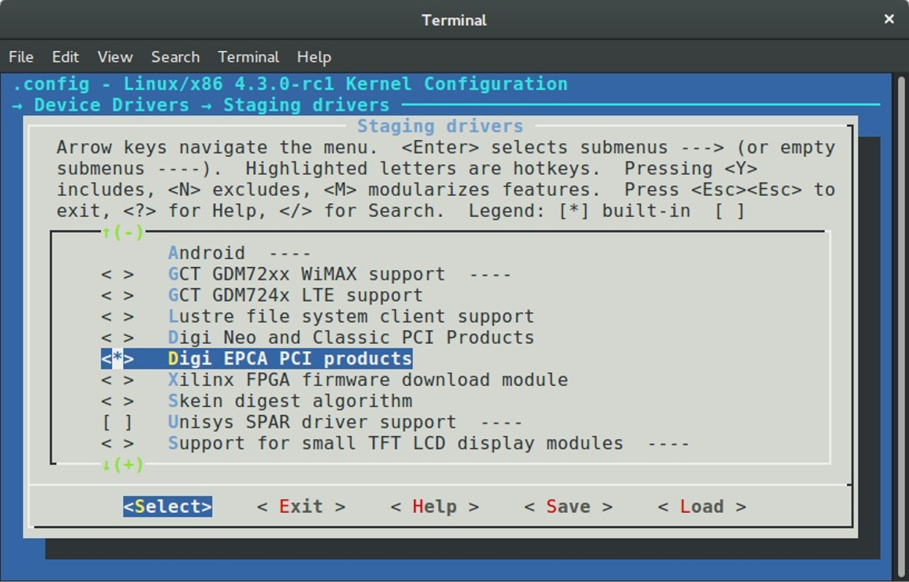
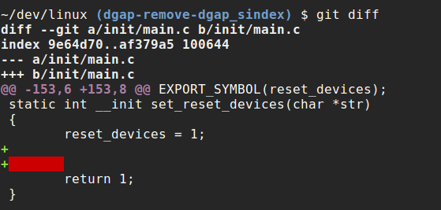

<center><font size='6'>Linux内核构建与开发</font></center>
<br/>
<br/>
<center><font size='5'>rtoax</font></center>
<center><font size='5'>2021年3月</font></center>
<br/>


# 1. Linux 内核的构建

## 1.1. 介绍

我不会告诉你怎么在自己的电脑上去构建、安装一个定制化的 Linux 内核，这样的[资料](https://encrypted.google.com/search?q=building+linux+kernel#q=building+linux+kernel+from+source+code)太多了，它们会对你有帮助。本文会告诉你当你在内核源码路径里敲下 `make` 时会发生什么。

当我刚刚开始学习内核代码时，[Makefile](https://github.com/torvalds/linux/blob/master/Makefile) 是我打开的第一个文件，这个文件看起来真令人害怕 :)。那时候这个 [Makefile](https://en.wikipedia.org/wiki/Make_%28software%29) 还只包含了 `1591` 行代码，当我开始写本文时，内核已经是 [4.2.0 的第三个候选版本](https://github.com/torvalds/linux/commit/52721d9d3334c1cb1f76219a161084094ec634dc) 了。

这个 Makefile 是 Linux 内核代码的根 Makefile ，内核构建就始于此处。是的，它的内容很多，但是如果你已经读过内核源代码，你就会发现每个包含代码的目录都有一个自己的 Makefile 。当然了，我们不会去描述每个代码文件是怎么编译链接的，所以我们将只会挑选一些通用的例子来说明问题。而你不会在这里找到构建内核的文档、如何整洁内核代码、 [tags](https://en.wikipedia.org/wiki/Ctags) 的生成和[交叉编译](https://en.wikipedia.org/wiki/Cross_compiler) 相关的说明，等等。我们将从 `make` 开始，使用标准的内核配置文件，到生成了内核镜像 [bzImage](https://en.wikipedia.org/wiki/Vmlinux#bzImage) 结束。

如果你已经很了解 [make](https://en.wikipedia.org/wiki/Make_%28software%29) 工具，那是最好，但是我也会描述本文出现的相关代码。

让我们开始吧！


## 1.2. 编译内核前的准备

在开始编译前要进行很多准备工作。最主要的就是找到并配置好配置文件，`make` 命令要使用到的参数都需要从这些配置文件获取。现在就让我们深入内核的根 `Makefile` 吧。

内核的根 `Makefile` 负责构建两个主要的文件： [vmlinux](https://en.wikipedia.org/wiki/Vmlinux) （**内核镜像可执行文件**）和**模块文件**。内核的 [Makefile](https://github.com/torvalds/linux/blob/master/Makefile) 从定义如下变量开始：

```Makefile
VERSION = 4
PATCHLEVEL = 2
SUBLEVEL = 0
EXTRAVERSION = -rc3
NAME = Hurr durr I'ma sheep
```

这些变量决定了当前内核的版本，并且被使用在很多不同的地方，比如同一个 `Makefile` 中的 `KERNELVERSION` ：

```Makefile
KERNELVERSION = $(VERSION)$(if $(PATCHLEVEL),.$(PATCHLEVEL)$(if $(SUBLEVEL),.$(SUBLEVEL)))$(EXTRAVERSION)
```

接下来我们会看到很多 `ifeq` 条件判断语句，它们负责检查传递给 `make` 的参数。内核的 `Makefile` 提供了一个特殊的编译选项 `make help` ，这个选项可以生成所有的可用目标和一些能传给 `make` 的有效的命令行参数。举个例子，`make V=1` 会在构建过程中输出详细的编译信息，第一个 `ifeq` 就是检查传递给 `make` 的 `V=n` 选项。

```Makefile
ifeq ("$(origin V)", "command line")
  KBUILD_VERBOSE = $(V)
endif
ifndef KBUILD_VERBOSE
  KBUILD_VERBOSE = 0
endif

ifeq ($(KBUILD_VERBOSE),1)
  quiet =
  Q =
else
  quiet=quiet_
  Q = @
endif

export quiet Q KBUILD_VERBOSE
```

如果 `V=n` 这个选项传给了 `make` ，系统就会给变量 `KBUILD_VERBOSE` 选项附上 `V` 的值，否则的话， `KBUILD_VERBOSE` 就会为 `0` 。然后系统会检查 `KBUILD_VERBOSE` 的值，以此来决定 `quiet` 和 `Q` 的值。符号 `@` 控制命令的输出，如果它被放在一个命令之前，这条命令的输出将会是 `CC scripts/mod/empty.o` ，而不是 `Compiling .... scripts/mod/empty.o`（LCTT 译注：CC 在 Makefile 中一般都是编译命令）。在这段最后，系统导出了所有的变量。

下一个 `ifeq` 语句检查的是传递给 `make` 的选项 `O=/dir`，这个选项允许在指定的目录 `dir` 输出所有的结果文件：

```Makefile
ifeq ($(KBUILD_SRC),)

ifeq ("$(origin O)", "command line")
  KBUILD_OUTPUT := $(O)
endif

ifneq ($(KBUILD_OUTPUT),)
saved-output := $(KBUILD_OUTPUT)
KBUILD_OUTPUT := $(shell mkdir -p $(KBUILD_OUTPUT) && cd $(KBUILD_OUTPUT) \
								&& /bin/pwd)
$(if $(KBUILD_OUTPUT),, \
     $(error failed to create output directory "$(saved-output)"))

sub-make: FORCE
	$(Q)$(MAKE) -C $(KBUILD_OUTPUT) KBUILD_SRC=$(CURDIR) \
	-f $(CURDIR)/Makefile $(filter-out _all sub-make,$(MAKECMDGOALS))

skip-makefile := 1
endif # ifneq ($(KBUILD_OUTPUT),)
endif # ifeq ($(KBUILD_SRC),)
```

系统会检查变量 `KBUILD_SRC` ，它代表内核代码的顶层目录，如果它是空的（第一次执行 makefile 时总是空的），我们会设置变量 `KBUILD_OUTPUT` 为传递给选项 `O` 的值（如果这个选项被传进来了）。下一步会检查变量 `KBUILD_OUTPUT` ，如果已经设置好，那么接下来会做以下几件事：

* 将变量 `KBUILD_OUTPUT` 的值保存到临时变量 `saved-output`；
* 尝试创建给定的输出目录；
* 检查创建的输出目录，如果失败了就打印错误；
* 如果成功创建了输出目录，那么就在新目录重新执行 `make` 命令（参见选项`-C`）。

下一个 `ifeq` 语句会检查传递给 make 的选项 `C` 和 `M`：

```Makefile
ifeq ("$(origin C)", "command line")
  KBUILD_CHECKSRC = $(C)
endif
ifndef KBUILD_CHECKSRC
  KBUILD_CHECKSRC = 0
endif

ifeq ("$(origin M)", "command line")
  KBUILD_EXTMOD := $(M)
endif
```

第一个选项 `C` 会告诉 `Makefile` 需要使用环境变量 `$CHECK` 提供的工具来检查全部 `c` 代码，默认情况下会使用 [sparse](https://en.wikipedia.org/wiki/Sparse) 。第二个选项 `M` 会用来编译外部模块（本文不做讨论）。

系统还会检查变量 `KBUILD_SRC`，如果 `KBUILD_SRC` 没有被设置，系统会设置变量 `srctree` 为 `.`：

```Makefile
ifeq ($(KBUILD_SRC),)
        srctree := .
endif
		
objtree	:= .
src		:= $(srctree)
obj		:= $(objtree)

export srctree objtree VPATH
```

这将会告诉 `Makefile` 内核的源码树就在执行 `make` 命令的目录，然后要设置 `objtree` 和其他变量为这个目录，并且将这些变量导出。接着就是要获取 `SUBARCH` 的值，这个变量代表了当前的系统架构（LCTT 译注：一般都指CPU 架构）：

```Makefile
SUBARCH := $(shell uname -m | sed -e s/i.86/x86/ -e s/x86_64/x86/ \
				  -e s/sun4u/sparc64/ \
				  -e s/arm.*/arm/ -e s/sa110/arm/ \
				  -e s/s390x/s390/ -e s/parisc64/parisc/ \
				  -e s/ppc.*/powerpc/ -e s/mips.*/mips/ \
				  -e s/sh[234].*/sh/ -e s/aarch64.*/arm64/ )
```

如你所见，系统执行 [uname](https://en.wikipedia.org/wiki/Uname) 得到机器、操作系统和架构的信息。因为我们得到的是 `uname` 的输出，所以我们需要做一些处理再赋给变量 `SUBARCH` 。获得 `SUBARCH` 之后就要设置`SRCARCH` 和 `hfr-arch`，`SRCARCH` 提供了硬件架构相关代码的目录，`hfr-arch` 提供了相关头文件的目录：

```Makefile
ifeq ($(ARCH),i386)
        SRCARCH := x86
endif
ifeq ($(ARCH),x86_64)
        SRCARCH := x86
endif

hdr-arch  := $(SRCARCH)
```

注意： `ARCH` 是 `SUBARCH` 的别名。如果没有设置过代表内核配置文件路径的变量 `KCONFIG_CONFIG` ，下一步系统会设置它，默认情况下就是 `.config` ：

```Makefile
KCONFIG_CONFIG	?= .config
export KCONFIG_CONFIG
```

以及编译内核过程中要用到的 [shell](https://en.wikipedia.org/wiki/Shell_%28computing%29)

```Makefile
CONFIG_SHELL := $(shell if [ -x "$$BASH" ]; then echo $$BASH; \
	  else if [ -x /bin/bash ]; then echo /bin/bash; \
	  else echo sh; fi ; fi)
```

接下来就要设置一组和编译内核的编译器相关的变量。我们会设置主机的 `C` 和 `C++` 的编译器及相关配置项：

```Makefile
HOSTCC       = gcc
HOSTCXX      = g++
HOSTCFLAGS   = -Wall -Wmissing-prototypes -Wstrict-prototypes -O2 -fomit-frame-pointer -std=gnu89
HOSTCXXFLAGS = -O2
```

接下来会去适配代表编译器的变量 `CC`，那为什么还要 `HOST*` 这些变量呢？这是因为 `CC` 是编译内核过程中要使用的目标架构的编译器，但是 `HOSTCC` 是要被用来编译一组 `host` 程序的（下面我们就会看到）。

然后我们就看到变量 `KBUILD_MODULES` 和 `KBUILD_BUILTIN` 的定义，这两个变量决定了我们要编译什么东西（内核、模块或者两者）：

```Makefile
KBUILD_MODULES :=
KBUILD_BUILTIN := 1

ifeq ($(MAKECMDGOALS),modules)
  KBUILD_BUILTIN := $(if $(CONFIG_MODVERSIONS),1)
endif
```

在这我们可以看到这些变量的定义，并且，如果们仅仅传递了 `modules` 给 `make`，变量 `KBUILD_BUILTIN` 会依赖于内核配置选项 `CONFIG_MODVERSIONS` 。

下一步操作是引入下面的文件：

```Makefile
include scripts/Kbuild.include
```

文件 [Kbuild](https://github.com/torvalds/linux/blob/master/Documentation/kbuild/kbuild.txt) 或者又叫做 `Kernel Build System` 是一个用来管理构建内核及其模块的特殊框架。`Kbuild` 文件的语法与 Makefile 一样。文件 [scripts/Kbuild.include](https://github.com/torvalds/linux/blob/master/scripts/Kbuild.include) 为 `Kbuild` 系统提供了一些常规的定义。因为我们包含了这个 `Kbuild` 文件，我们可以看到和不同工具关联的这些变量的定义，这些工具会在内核和模块编译过程中被使用（比如链接器、编译器、来自 [binutils](http://www.gnu.org/software/binutils/) 的二进制工具包）：

```Makefile
AS		= $(CROSS_COMPILE)as
LD		= $(CROSS_COMPILE)ld
CC		= $(CROSS_COMPILE)gcc
CPP		= $(CC) -E
AR		= $(CROSS_COMPILE)ar
NM		= $(CROSS_COMPILE)nm
STRIP		= $(CROSS_COMPILE)strip
OBJCOPY		= $(CROSS_COMPILE)objcopy
OBJDUMP		= $(CROSS_COMPILE)objdump
AWK		= awk
...
...
...
```

在这些定义好的变量后面，我们又定义了两个变量： `USERINCLUDE` 和 `LINUXINCLUDE` 。他们包含了头文件的路径（第一个是给用户用的，第二个是给内核用的）：

```Makefile
USERINCLUDE    := \
		-I$(srctree)/arch/$(hdr-arch)/include/uapi \
		-Iarch/$(hdr-arch)/include/generated/uapi \
		-I$(srctree)/include/uapi \
		-Iinclude/generated/uapi \
        -include $(srctree)/include/linux/kconfig.h

LINUXINCLUDE    := \
		-I$(srctree)/arch/$(hdr-arch)/include \
		...
```

以及给 C 编译器的标准标志：

```Makefile
KBUILD_CFLAGS   := -Wall -Wundef -Wstrict-prototypes -Wno-trigraphs \
		   -fno-strict-aliasing -fno-common \
		   -Werror-implicit-function-declaration \
		   -Wno-format-security \
		   -std=gnu89
```

这并不是最终确定的编译器标志，它们还可以在其他 Makefile 里面更新（比如 `arch/` 里面的 `Kbuild` ）。变量定义完之后，全部会被导出供其他 `Makefile` 使用。

下面的两个变量 `RCS_FIND_IGNORE` 和 `RCS_TAR_IGNORE` 包含了被版本控制系统忽略的文件：

```Makefile
export RCS_FIND_IGNORE := \( -name SCCS -o -name BitKeeper -o -name .svn -o    \
			  -name CVS -o -name .pc -o -name .hg -o -name .git \) \
			  -prune -o
export RCS_TAR_IGNORE := --exclude SCCS --exclude BitKeeper --exclude .svn \
			 --exclude CVS --exclude .pc --exclude .hg --exclude .git
```

这就是全部了，我们已经完成了所有的准备工作，下一个点就是如何构建 `vmlinux` 。

## 1.3. 直面内核构建

现在我们已经完成了所有的准备工作，根 Makefile（注：内核根目录下的 Makefile ）的下一步工作就是和编译内核相关的了。在这之前，我们不会在终端看到 `make` 命令输出的任何东西。但是现在编译的第一步开始了，这里我们需要从内核根 Makefile 的 [598](https://github.com/torvalds/linux/blob/master/Makefile#L598) 行开始，这里可以看到目标 `vmlinux` ：

```Makefile
all: vmlinux
	include arch/$(SRCARCH)/Makefile
```

不要操心我们略过的从 `export RCS_FIND_IGNORE.....` 到 `all: vmlinux.....` 这一部分 Makefile 代码，他们只是负责根据各种配置文件（`make *.config`）生成不同目标内核的，因为之前我就说了这一部分我们只讨论构建内核的通用途径。

目标 `all:` 是在命令行如果不指定具体目标时默认使用的目标。你可以看到这里包含了架构相关的 Makefile（在这里就指的是 [arch/x86/Makefile](https://github.com/torvalds/linux/blob/master/arch/x86/Makefile) ）。从这一时刻起，我们会从这个 Makefile 继续进行下去。如我们所见，目标 `all` 依赖于根 Makefile 后面声明的 `vmlinux` ： 

```Makefile
vmlinux: scripts/link-vmlinux.sh $(vmlinux-deps) FORCE
```

`vmlinux` 是 linux 内核的静态链接可执行文件格式。脚本 [scripts/link-vmlinux.sh](https://github.com/torvalds/linux/blob/master/scripts/link-vmlinux.sh) 把不同的编译好的子模块链接到一起形成了 vmlinux 。

第二个目标是 `vmlinux-deps` ，它的定义如下：

```Makefile
vmlinux-deps := $(KBUILD_LDS) $(KBUILD_VMLINUX_INIT) $(KBUILD_VMLINUX_MAIN)
```

它是由内核代码下的每个顶级目录的 `built-in.o` 组成的。之后我们还会检查内核所有的目录，`Kbuild` 会编译各个目录下所有的对应 `$(obj-y)` 的源文件。接着调用 `$(LD) -r` 把这些文件合并到一个 `build-in.o` 文件里。此时我们还没有 `vmlinux-deps`，所以目标 `vmlinux` 现在还不会被构建。对我而言 `vmlinux-deps` 包含下面的文件：

```
arch/x86/kernel/vmlinux.lds arch/x86/kernel/head_64.o
arch/x86/kernel/head64.o    arch/x86/kernel/head.o
init/built-in.o             usr/built-in.o
arch/x86/built-in.o         kernel/built-in.o
mm/built-in.o               fs/built-in.o
ipc/built-in.o              security/built-in.o
crypto/built-in.o           block/built-in.o
lib/lib.a                   arch/x86/lib/lib.a
lib/built-in.o              arch/x86/lib/built-in.o
drivers/built-in.o          sound/built-in.o
firmware/built-in.o         arch/x86/pci/built-in.o
arch/x86/power/built-in.o   arch/x86/video/built-in.o
net/built-in.o
```

下一个可以被执行的目标如下：

```Makefile
$(sort $(vmlinux-deps)): $(vmlinux-dirs) ;
$(vmlinux-dirs): prepare scripts
	$(Q)$(MAKE) $(build)=$@
```

就像我们看到的，`vmlinux-dir` 依赖于两部分： `prepare` 和 `scripts` 。第一个 `prepare` 定义在内核的根 `Makefile` 中，准备工作分成三个阶段：

```Makefile
prepare: prepare0
prepare0: archprepare FORCE
	$(Q)$(MAKE) $(build)=.
archprepare: archheaders archscripts prepare1 scripts_basic

prepare1: prepare2 $(version_h) include/generated/utsrelease.h \
                   include/config/auto.conf
	$(cmd_crmodverdir)
prepare2: prepare3 outputmakefile asm-generic
```

第一个 `prepare0` 展开到 `archprepare` ，后者又展开到 `archheader` 和 `archscripts` ，这两个变量定义在 `x86_64` 相关的 [Makefile](https://github.com/torvalds/linux/blob/master/arch/x86/Makefile) 。让我们看看这个文件。`x86_64` 特定的 Makefile 从变量定义开始，这些变量都是和特定架构的配置文件 ([defconfig](https://github.com/torvalds/linux/tree/master/arch/x86/configs)，等等)有关联。在定义了编译 [16-bit](https://en.wikipedia.org/wiki/Real_mode) 代码的编译选项之后，根据变量 `BITS` 的值，如果是 `32` ，汇编代码、链接器、以及其它很多东西（全部的定义都可以在[arch/x86/Makefile](https://github.com/torvalds/linux/blob/master/arch/x86/Makefile)找到）对应的参数就是 `i386`，而 `64` 就对应的是 `x86_84` 。

第一个目标是 Makefile 生成的系统调用列表(syscall table)中的 `archheaders` ：

```Makefile
archheaders:
	$(Q)$(MAKE) $(build)=arch/x86/entry/syscalls all
```

第二个目标是 Makefile 里的 `archscripts` ：

```Makefile
archscripts: scripts_basic
	$(Q)$(MAKE) $(build)=arch/x86/tools relocs
```

我们可以看到 `archscripts` 是依赖于根 [Makefile](https://github.com/torvalds/linux/blob/master/Makefile) 里的 `scripts_basic` 。首先我们可以看出 `scripts_basic` 是按照 [scripts/basic](https://github.com/torvalds/linux/blob/master/scripts/basic/Makefile) 的 Makefile 执行 make 的：
 
```Maklefile
scripts_basic:
	$(Q)$(MAKE) $(build)=scripts/basic
```

`scripts/basic/Makefile` 包含了编译两个主机程序 `fixdep` 和 `bin2` 的目标：

```Makefile
hostprogs-y	:= fixdep
hostprogs-$(CONFIG_BUILD_BIN2C)     += bin2c
always		:= $(hostprogs-y)

$(addprefix $(obj)/,$(filter-out fixdep,$(always))): $(obj)/fixdep
```

第一个工具是 `fixdep` ：用来优化 [gcc](https://gcc.gnu.org/) 生成的依赖列表，然后在重新编译源文件的时候告诉 `make` 。第二个工具是 `bin2c` ，它依赖于内核配置选项 `CONFIG_BUILD_BIN2C` ，并且它是一个用来将标准输入接口（LCTT 译注：即 stdin）收到的二进制流通过标准输出接口（即：stdout）转换成 C 头文件的非常小的 C 程序。你可能注意到这里有些奇怪的标志，如 `hostprogs-y` 等。这个标志用于所有的 `Kbuild` 文件，更多的信息你可以从 [documentation](https://github.com/torvalds/linux/blob/master/Documentation/kbuild/makefiles.txt) 获得。在我们这里， `hostprogs-y` 告诉 `Kbuild` 这里有个名为 `fixed` 的程序，这个程序会通过和 `Makefile` 相同目录的 `fixdep.c` 编译而来。

执行 `make` 之后，终端的第一个输出就是 `Kbuild` 的结果：

```
$ make
  HOSTCC  scripts/basic/fixdep
```

当目标 `script_basic` 被执行，目标 `archscripts` 就会 `make` [arch/x86/tools](https://github.com/torvalds/linux/blob/master/arch/x86/tools/Makefile) 下的 Makefile 和目标 `relocs` :

```Makefile
$(Q)$(MAKE) $(build)=arch/x86/tools relocs
```

包含了[重定位](https://en.wikipedia.org/wiki/Relocation_%28computing%29)的信息的代码 `relocs_32.c` 和 `relocs_64.c` 将会被编译，这可以在 `make` 的输出中看到：

```Makefile
  HOSTCC  arch/x86/tools/relocs_32.o
  HOSTCC  arch/x86/tools/relocs_64.o
  HOSTCC  arch/x86/tools/relocs_common.o
  HOSTLD  arch/x86/tools/relocs
```

在编译完 `relocs.c` 之后会检查 `version.h` ：

```Makefile
$(version_h): $(srctree)/Makefile FORCE
	$(call filechk,version.h)
	$(Q)rm -f $(old_version_h)
```

我们可以在输出看到它：

```
CHK     include/config/kernel.release
```

以及在内核的根 Makefile 使用 `arch/x86/include/generated/asm` 的目标 `asm-generic` 来构建 `generic` 汇编头文件。在目标 `asm-generic` 之后，`archprepare` 就完成了，所以目标 `prepare0` 会接着被执行，如我上面所写：

```Makefile
prepare0: archprepare FORCE
	$(Q)$(MAKE) $(build)=.
```

注意 `build` ，它是定义在文件 [scripts/Kbuild.include](https://github.com/torvalds/linux/blob/master/scripts/Kbuild.include) ，内容是这样的：

```Makefile
build := -f $(srctree)/scripts/Makefile.build obj
```

或者在我们的例子中，它就是当前源码目录路径- `.` ：

```Makefile
$(Q)$(MAKE) -f $(srctree)/scripts/Makefile.build obj=.
```

脚本 [scripts/Makefile.build](https://github.com/torvalds/linux/blob/master/scripts/Makefile.build) 通过参数 `obj` 给定的目录找到 `Kbuild` 文件，然后引入 `Kbuild` 文件：

```Makefile
include $(kbuild-file)
```

并根据这个构建目标。我们这里 `.` 包含了生成 `kernel/bounds.s` 和 `arch/x86/kernel/asm-offsets.s` 的 [Kbuild](https://github.com/torvalds/linux/blob/master/Kbuild) 文件。在此之后，目标 `prepare` 就完成了它的工作。 `vmlinux-dirs` 也依赖于第二个目标 `scripts` ，它会编译接下来的几个程序： `filealias` ， `mk_elfconfig` ， `modpost` 等等。之后， `scripts/host-programs` 就可以开始编译我们的目标 `vmlinux-dirs` 了。

首先，我们先来理解一下 `vmlinux-dirs` 都包含了那些东西。在我们的例子中它包含了下列内核目录的路径：

```
init usr arch/x86 kernel mm fs ipc security crypto block
drivers sound firmware arch/x86/pci arch/x86/power
arch/x86/video net lib arch/x86/lib
```

我们可以在内核的根 [Makefile](https://github.com/torvalds/linux/blob/master/Makefile) 里找到 `vmlinux-dirs` 的定义：

```Makefile
vmlinux-dirs	:= $(patsubst %/,%,$(filter %/, $(init-y) $(init-m) \
		     $(core-y) $(core-m) $(drivers-y) $(drivers-m) \
		     $(net-y) $(net-m) $(libs-y) $(libs-m)))

init-y		:= init/
drivers-y	:= drivers/ sound/ firmware/
net-y		:= net/
libs-y		:= lib/
...
...
...
```

这里我们借助函数 `patsubst` 和 `filter` 去掉了每个目录路径里的符号 `/` ，并且把结果放到 `vmlinux-dirs` 里。所以我们就有了 `vmlinux-dirs` 里的目录列表，以及下面的代码：

```Makefile
$(vmlinux-dirs): prepare scripts
	$(Q)$(MAKE) $(build)=$@
```

符号 `$@` 在这里代表了 `vmlinux-dirs` ，这就表明程序会递归遍历从 `vmlinux-dirs` 以及它内部的全部目录（依赖于配置），并且在对应的目录下执行 `make` 命令。我们可以在输出看到结果：

```
  CC      init/main.o
  CHK     include/generated/compile.h
  CC      init/version.o
  CC      init/do_mounts.o
  ...
  CC      arch/x86/crypto/glue_helper.o
  AS      arch/x86/crypto/aes-x86_64-asm_64.o
  CC      arch/x86/crypto/aes_glue.o
  ...
  AS      arch/x86/entry/entry_64.o
  AS      arch/x86/entry/thunk_64.o
  CC      arch/x86/entry/syscall_64.o
```

每个目录下的源代码将会被编译并且链接到 `built-io.o` 里：

```
$ find . -name built-in.o
./arch/x86/crypto/built-in.o
./arch/x86/crypto/sha-mb/built-in.o
./arch/x86/net/built-in.o
./init/built-in.o
./usr/built-in.o
...
...
```

好了，所有的 `built-in.o` 都构建完了，现在我们回到目标 `vmlinux` 上。你应该还记得，目标 `vmlinux` 是在内核的根 Makefile 里。在链接 `vmlinux` 之前，系统会构建 [samples](https://github.com/torvalds/linux/tree/master/samples) , [Documentation](https://github.com/torvalds/linux/tree/master/Documentation) 等等，但是如上文所述，我不会在本文描述这些。

```Makefile
vmlinux: scripts/link-vmlinux.sh $(vmlinux-deps) FORCE
    ...
    ...
    +$(call if_changed,link-vmlinux)
```

你可以看到，调用脚本 [scripts/link-vmlinux.sh](https://github.com/torvalds/linux/blob/master/scripts/link-vmlinux.sh) 的主要目的是把所有的 `built-in.o` 链接成一个静态可执行文件，和生成 [System.map](https://en.wikipedia.org/wiki/System.map) 。最后我们来看看下面的输出：

```
  LINK    vmlinux
  LD      vmlinux.o
  MODPOST vmlinux.o
  GEN     .version
  CHK     include/generated/compile.h
  UPD     include/generated/compile.h
  CC      init/version.o
  LD      init/built-in.o
  KSYM    .tmp_kallsyms1.o
  KSYM    .tmp_kallsyms2.o
  LD      vmlinux
  SORTEX  vmlinux
  SYSMAP  System.map
```

`vmlinux` 和 `System.map` 生成在内核源码树根目录下。

```
$ ls vmlinux System.map 
System.map  vmlinux
```

这就是全部了，`vmlinux` 构建好了，下一步就是创建 [bzImage](https://en.wikipedia.org/wiki/Vmlinux#bzImage).

## 1.4. 制作bzImage

`bzImage` 就是压缩了的 linux 内核镜像。我们可以在构建了 `vmlinux` 之后通过执行 `make bzImage` 获得 `bzImage`。

期间会选择几个选项：
```c
[rongtao@localhost linux-5.10.13]$ make bzImage
  SYNC    include/config/auto.conf.cmd
*
* Restart config...
*
*
* Compile-time checks and compiler options
*
Compile the kernel with debug info (DEBUG_INFO) [Y/n/?] y
  Reduce debugging information (DEBUG_INFO_REDUCED) [N/y/?] n
  Compressed debugging information (DEBUG_INFO_COMPRESSED) [N/y/?] (NEW) y
  Produce split debuginfo in .dwo files (DEBUG_INFO_SPLIT) [N/y/?] n
  Generate dwarf4 debuginfo (DEBUG_INFO_DWARF4) [N/y/?] n
  Generate BTF typeinfo (DEBUG_INFO_BTF) [N/y/?] n
  Provide GDB scripts for kernel debugging (GDB_SCRIPTS) [N/y/?] n
Enable __must_check logic (ENABLE_MUST_CHECK) [Y/n/?] y
Warn for stack frames larger than (FRAME_WARN) [2048] 2048
Strip assembler-generated symbols during link (STRIP_ASM_SYMS) [Y/n/?] y
Generate readable assembler code (READABLE_ASM) [N/y/?] n
Install uapi headers to usr/include (HEADERS_INSTALL) [N/y/?] n
Enable full Section mismatch analysis (DEBUG_SECTION_MISMATCH) [Y/n/?] y
Make section mismatch errors non-fatal (SECTION_MISMATCH_WARN_ONLY) [Y/n/?] y
Compile-time stack metadata validation (STACK_VALIDATION) [Y/?] y
Force weak per-cpu definitions (DEBUG_FORCE_WEAK_PER_CPU) [N/y/?] n
*
* KASAN: runtime memory debugger
*
KASAN: runtime memory debugger (KASAN) [N/y/?] (NEW) y
  KASAN mode
  > 1. Generic mode (KASAN_GENERIC) (NEW)
  choice[1]: 1
  Instrumentation type
  > 1. Outline instrumentation (KASAN_OUTLINE) (NEW)
    2. Inline instrumentation (KASAN_INLINE) (NEW)
  choice[1-2?]: 1
  Back mappings in vmalloc space with real shadow memory (KASAN_VMALLOC) [N/y/?] (NEW) y
  KUnit-incompatible tests of KASAN bug detection capabilities (TEST_KASAN_MODULE) [N/m/?] (NEW) y

CONFIG_TEST_KASAN_MODULE:

This is a part of the KASAN test suite that is incompatible with
KUnit. Currently includes tests that do bad copy_from/to_user
accesses.

Symbol: TEST_KASAN_MODULE [=n]
Type  : tristate
Defined at lib/Kconfig.kasan:181
  Prompt: KUnit-incompatible tests of KASAN bug detection capabilities
  Depends on: m && MODULES [=y] && KASAN [=y]
  Location:
    -> Kernel hacking
      -> Memory Debugging
        -> KASAN: runtime memory debugger (KASAN [=y])

  KUnit-incompatible tests of KASAN bug detection capabilities (TEST_KASAN_MODULE) [N/m/?] (NEW) 
  HOSTCC  scripts/selinux/genheaders/genheaders
  HOSTCC  scripts/selinux/mdp/mdp
  CC      scripts/mod/empty.o
  MKELF   scripts/mod/elfconfig.h
  HOSTCC  scripts/mod/modpost.o
  CC      scripts/mod/devicetable-offsets.s
  HOSTCC  scripts/mod/file2alias.o
  HOSTCC  scripts/mod/sumversion.o
  HOSTLD  scripts/mod/modpost
  CC      kernel/bounds.s
  CC      arch/x86/kernel/asm-offsets.s
  CALL    scripts/checksyscalls.sh
  CALL    scripts/atomic/check-atomics.sh
  DESCEND  objtool
  CC      init/main.o
  CHK     include/generated/compile.h
  CC      init/version.o
  CC      init/do_mounts.o
  CC      init/do_mounts_initrd.o
  CC      init/initramfs.o
  CC      init/calibrate.o
  CC      init/init_task.o
  AR      init/built-in.a
  AS      usr/initramfs_data.o
  AR      usr/built-in.a
  AS      arch/x86/entry/entry_64.o
  AS      arch/x86/entry/thunk_64.o
  CC      arch/x86/entry/syscall_64.o
  CC      arch/x86/entry/common.o
  CC      arch/x86/entry/vdso/vma.o
  CC      arch/x86/entry/vdso/vdso32-setup.o
  LDS     arch/x86/entry/vdso/vdso.lds
  AS      arch/x86/entry/vdso/vdso-note.o
  CC      arch/x86/entry/vdso/vclock_gettime.o
  CC      arch/x86/entry/vdso/vgetcpu.o
    ...
```

同时我们可以仅仅执行 `make` 而不带任何参数也可以生成 `bzImage` ，因为它是在 [arch/x86/kernel/Makefile](https://github.com/torvalds/linux/blob/master/arch/x86/Makefile) 里预定义的、默认生成的镜像： 

```Makefile
all: bzImage
```

让我们看看这个目标，它能帮助我们理解这个镜像是怎么构建的。我已经说过了 `bzImage` 是被定义在 [arch/x86/kernel/Makefile](https://github.com/torvalds/linux/blob/master/arch/x86/Makefile) ，定义如下：

```Makefile
bzImage: vmlinux
	$(Q)$(MAKE) $(build)=$(boot) $(KBUILD_IMAGE)
	$(Q)mkdir -p $(objtree)/arch/$(UTS_MACHINE)/boot
	$(Q)ln -fsn ../../x86/boot/bzImage $(objtree)/arch/$(UTS_MACHINE)/boot/$@
```

在这里我们可以看到第一次为 boot 目录执行 `make` ，在我们的例子里是这样的：

```Makefile
boot := arch/x86/boot
```

现在的主要目标是编译目录 `arch/x86/boot` 和 `arch/x86/boot/compressed` 的代码，构建 `setup.bin` 和 `vmlinux.bin` ，最后用这两个文件生成 `bzImage`。第一个目标是定义在 [arch/x86/boot/Makefile](https://github.com/torvalds/linux/blob/master/arch/x86/boot/Makefile) 的 `$(obj)/setup.elf` ：

```Makefile
$(obj)/setup.elf: $(src)/setup.ld $(SETUP_OBJS) FORCE
	$(call if_changed,ld)
```

我们已经在目录 `arch/x86/boot` 有了链接脚本 `setup.ld` ，和扩展到 `boot` 目录下全部源代码的变量 `SETUP_OBJS` 。我们可以看看第一个输出：

```Makefile
  AS      arch/x86/boot/bioscall.o
  CC      arch/x86/boot/cmdline.o
  AS      arch/x86/boot/copy.o
  HOSTCC  arch/x86/boot/mkcpustr
  CPUSTR  arch/x86/boot/cpustr.h
  CC      arch/x86/boot/cpu.o
  CC      arch/x86/boot/cpuflags.o
  CC      arch/x86/boot/cpucheck.o
  CC      arch/x86/boot/early_serial_console.o
  CC      arch/x86/boot/edd.o
```

下一个源码文件是 [arch/x86/boot/header.S](https://github.com/torvalds/linux/blob/master/arch/x86/boot/header.S) ，但是我们不能现在就编译它，因为这个目标依赖于下面两个头文件：

```Makefile
$(obj)/header.o: $(obj)/voffset.h $(obj)/zoffset.h
```

第一个头文件 `voffset.h` 是使用 `sed` 脚本生成的，包含用 `nm` 工具从 `vmlinux` 获取的两个地址：

```C
#define VO__end 0xffffffff82ab0000
#define VO__text 0xffffffff81000000
```

这两个地址是内核的起始和结束地址。第二个头文件 `zoffset.h` 在 [arch/x86/boot/compressed/Makefile](https://github.com/torvalds/linux/blob/master/arch/x86/boot/compressed/Makefile) 可以看出是依赖于目标 `vmlinux` 的：

```Makefile
$(obj)/zoffset.h: $(obj)/compressed/vmlinux FORCE
	$(call if_changed,zoffset)
```

> 内核支持多种压缩格式，其中默认为bzip2.

目标 `$(obj)/compressed/vmlinux` 依赖于 `vmlinux-objs-y` —— 说明需要编译目录 [arch/x86/boot/compressed](https://github.com/torvalds/linux/tree/master/arch/x86/boot/compressed) 下的源代码，然后生成 `vmlinux.bin` 、`vmlinux.bin.bz2` ，和编译工具 `mkpiggy` 。我们可以在下面的输出看出来：

```Makefile
  LDS     arch/x86/boot/compressed/vmlinux.lds
  AS      arch/x86/boot/compressed/head_64.o
  CC      arch/x86/boot/compressed/misc.o
  CC      arch/x86/boot/compressed/string.o
  CC      arch/x86/boot/compressed/cmdline.o
  OBJCOPY arch/x86/boot/compressed/vmlinux.bin
  BZIP2   arch/x86/boot/compressed/vmlinux.bin.bz2
  HOSTCC  arch/x86/boot/compressed/mkpiggy
```

`vmlinux.bin` 是去掉了调试信息和注释的 `vmlinux` 二进制文件，加上了占用了 `u32` （LCTT 译注：即4-Byte）的长度信息的 `vmlinux.bin.all` 压缩后就是 `vmlinux.bin.bz2` 。其中 `vmlinux.bin.all` 包含了 `vmlinux.bin` 和 `vmlinux.relocs`（LCTT 译注：vmlinux 的重定位信息），其中 `vmlinux.relocs` 是 `vmlinux` 经过程序 `relocs` 处理之后的 `vmlinux` 镜像（见上文所述）。我们现在已经获取到了这些文件，汇编文件 `piggy.S` 将会被 `mkpiggy` 生成、然后编译：

```Makefile
  MKPIGGY arch/x86/boot/compressed/piggy.S
  AS      arch/x86/boot/compressed/piggy.o
```

这个汇编文件会包含经过计算得来的、压缩内核的偏移信息。处理完这个汇编文件，我们就可以看到 `zoffset` 生成了：

```Makefile
  ZOFFSET arch/x86/boot/zoffset.h
```

现在 `zoffset.h` 和 `voffset.h` 已经生成了， [arch/x86/boot](https://github.com/torvalds/linux/tree/master/arch/x86/boot/) 里的源文件可以继续编译：

```Makefile
  AS      arch/x86/boot/header.o
  CC      arch/x86/boot/main.o
  CC      arch/x86/boot/mca.o
  CC      arch/x86/boot/memory.o
  CC      arch/x86/boot/pm.o
  AS      arch/x86/boot/pmjump.o
  CC      arch/x86/boot/printf.o
  CC      arch/x86/boot/regs.o
  CC      arch/x86/boot/string.o
  CC      arch/x86/boot/tty.o
  CC      arch/x86/boot/video.o
  CC      arch/x86/boot/video-mode.o
  CC      arch/x86/boot/video-vga.o
  CC      arch/x86/boot/video-vesa.o
  CC      arch/x86/boot/video-bios.o
```

所有的源代码会被编译，他们最终会被链接到 `setup.elf` ：

```Makefile
  LD      arch/x86/boot/setup.elf
```

或者：

```
ld -m elf_x86_64   -T arch/x86/boot/setup.ld arch/x86/boot/a20.o arch/x86/boot/bioscall.o arch/x86/boot/cmdline.o arch/x86/boot/copy.o arch/x86/boot/cpu.o arch/x86/boot/cpuflags.o arch/x86/boot/cpucheck.o arch/x86/boot/early_serial_console.o arch/x86/boot/edd.o arch/x86/boot/header.o arch/x86/boot/main.o arch/x86/boot/mca.o arch/x86/boot/memory.o arch/x86/boot/pm.o arch/x86/boot/pmjump.o arch/x86/boot/printf.o arch/x86/boot/regs.o arch/x86/boot/string.o arch/x86/boot/tty.o arch/x86/boot/video.o arch/x86/boot/video-mode.o arch/x86/boot/version.o arch/x86/boot/video-vga.o arch/x86/boot/video-vesa.o arch/x86/boot/video-bios.o -o arch/x86/boot/setup.elf
```

最后的两件事是创建包含目录 `arch/x86/boot/*` 下的编译过的代码的 `setup.bin` ：

```
objcopy  -O binary arch/x86/boot/setup.elf arch/x86/boot/setup.bin
```

以及从 `vmlinux` 生成 `vmlinux.bin` ：

```
objcopy  -O binary -R .note -R .comment -S arch/x86/boot/compressed/vmlinux arch/x86/boot/vmlinux.bin
```

最最后，我们编译主机程序 [arch/x86/boot/tools/build.c](https://github.com/torvalds/linux/blob/master/arch/x86/boot/tools/build.c) ，它将会用来把 `setup.bin` 和 `vmlinux.bin` 打包成 `bzImage` ：

```
arch/x86/boot/tools/build arch/x86/boot/setup.bin arch/x86/boot/vmlinux.bin arch/x86/boot/zoffset.h arch/x86/boot/bzImage
```

实际上 `bzImage` 就是把 `setup.bin` 和 `vmlinux.bin` 连接到一起。最终我们会看到输出结果，就和那些用源码编译过内核的同行的结果一样：

```
Setup is 16268 bytes (padded to 16384 bytes).
System is 4704 kB
CRC 94a88f9a
Kernel: arch/x86/boot/bzImage is ready  (#5)
```

全部结束。

## 1.5. 结论

这就是本文的结尾部分。本文我们了解了编译内核的全部步骤：从执行 `make` 命令开始，到最后生成 `bzImage` 。我知道，linux 内核的 Makefile 和构建 linux 的过程第一眼看起来可能比较迷惑，但是这并不是很难。希望本文可以帮助你理解构建 linux 内核的整个流程。


注： 本文由 [LCTT](https://github.com/LCTT/TranslateProject) 原创翻译，[Linux中国](https://linux.cn/) 荣誉推出

## 1.6. 链接

* [GNU make util](https://en.wikipedia.org/wiki/Make_%28software%29)
* [Linux kernel top Makefile](https://github.com/torvalds/linux/blob/master/Makefile)
* [cross-compilation](https://en.wikipedia.org/wiki/Cross_compiler)
* [Ctags](https://en.wikipedia.org/wiki/Ctags)
* [sparse](https://en.wikipedia.org/wiki/Sparse)
* [bzImage](https://en.wikipedia.org/wiki/Vmlinux#bzImage)
* [uname](https://en.wikipedia.org/wiki/Uname)
* [shell](https://en.wikipedia.org/wiki/Shell_%28computing%29)
* [Kbuild](https://github.com/torvalds/linux/blob/master/Documentation/kbuild/kbuild.txt)
* [binutils](http://www.gnu.org/software/binutils/)
* [gcc](https://gcc.gnu.org/)
* [Documentation](https://github.com/torvalds/linux/blob/master/Documentation/kbuild/makefiles.txt)
* [System.map](https://en.wikipedia.org/wiki/System.map)
* [Relocation](https://en.wikipedia.org/wiki/Relocation_%28computing%29)


# 2. Linux 内核开发


## 2.1. 简介

如你所知，我从去年开始写了一系列关于 `x86_64` 架构汇编语言程序设计的[博文](http://xinqiu.gitbooks.io/categories/assembly/)。除了大学期间写过一些 `Hello World` 这样无实用价值的程序之外，我从来没写过哪怕一行的底层代码。那些程序也是很久以前的事情了，就像我刚才说的，我几乎完全没有写过底层代码。直到不久前，我才开始对这些事情感兴趣，因为我意识到我虽然可以写出程序，但是我却不知道我的程序是怎样被组织运行的。

在写了一些汇编代码之后，我开始**大致**了解了程序在编译之后会变成什么样子。尽管如此，还是有很多其他的东西我不能够理解。例如：当 `syscall` 指令在我的汇编程序内执行时究竟发生了什么，当 `printf` 函数开始工作时又发生了什么，还有，我的程序是如何通过网络与其他计算机进行通信的。[汇编](https://en.wikipedia.org/wiki/Assembly_language#Assembler)语言并没有为这些问题带来答案，于是我决定做一番深入研究。我开始学习 Linux 内核的源代码，并且尝试着理解那些让我感兴趣的东西。然而 Linux 内核源代码也没有解答我**所有的**问题，不过我自身关于 Linux 内核及其外围流程的知识确实掌握的更好了。

在我开始学习 Linux 内核的九个半月之后，我写了这部分内容，并且发布了本书的[第一部分](https://0xax.gitbooks.io/linux-insides/content/Booting/linux-bootstrap-1.html)。到现在为止，本书共包括了四个部分，而这并不是终点。我之所以写这一系列关于 Linux 内核的文章其实更多的是为了我自己。你也知道，Linux 内核的代码量极其巨大，另外还非常容易忘记这一块或那一块内核代码做了什么，或者忘记某些东西是怎么实现的。出乎意料的是 [linux-insides](https://github.com/0xAX/linux-insides) 很快就火了，并且在九个月后积攒了 `9096` 个star。

看起来人们对 Linux 内核的内在机制非常的感兴趣。除此之外，在我写 `linux-insides` 的这段时间里，我收到了很多人发来的问题，这些问题大都是关于如何开始向 Linux 内核贡献代码。通常来说，人们是很有兴趣为开源项目做贡献的，Linux 内核也不例外。

这么看起来大家对 Linux 内核的开发流程非常感兴趣。我认为如果这么一本关于 Linux 内核的书却不包括一部分来讲讲如何参与 Linux 内核开发的话，那就非常奇怪了。这就是我决定写这篇文章的原因。在本文中，你不会看到为什么你应该对贡献 Linux 内核感兴趣，但是如果你想参与 Linux 内核开发的话，那这部分就是为你而作。

让我们开始吧。

## 2.2. 如何入门 Linux 内核


首先，让我们看看如何获取、构建并运行 Linux 内核。你可以通过两种方式来运行你自己定制的内核：

* 在虚拟机里运行 Linux 内核；
* 在真实的硬件上运行 Linux 内核。

我会对这两种方式都展开描述。在我们开始对 Linux 内核做些什么之前，我们首先需要先获取它。根据你目的的不同，有两种方式可以做到这一点。如果你只是想更新一下你电脑上的 Linux 内核版本，那么你可以使用特定于你 [Linux 发行版](https://en.wikipedia.org/wiki/Linux_distribution)的命令。

在这种情况下，你只需要使用[软件包管理器](https://en.wikipedia.org/wiki/Package_manager)下载新版本的 Linux 内核。例如，为了将 [Ubuntu (Vivid Vervet)](http://releases.ubuntu.com/15.04/) 系统的 Linux 内核更新至 `4.1` 版本，你只需要执行以下命令：

```
$ sudo add-apt-repository ppa:kernel-ppa/ppa
$ sudo apt-get update
```

在这之后，再执行下面的命令：

```
$ apt-cache showpkg linux-headers
```

然后选择你感兴趣的 Linux 内核的版本。最后，执行下面的命令并且将 `${version}` 替换为你从上一条命令的输出中选择的版本号。

```
$ sudo apt-get install linux-headers-${version} linux-headers-${version}-generic linux-image-${version}-generic --fix-missing
```

最后重启你的系统。重启完成后，你将在 [grub](https://en.wikipedia.org/wiki/GNU_GRUB) 菜单中看到新的内核。

另一方面，如果你对 Linux 内核开发感兴趣，那么你就需要获得 Linux 内核的源代码。你可以在 [kernel.org](https://kernel.org/) 网站上找到它并且下载一个包含了 Linux 内核源代码的归档文件。实际上，Linux 内核的开发流程完全建立在 `git` [版本控制系统](https://en.wikipedia.org/wiki/Version_control)之上，所以你需要通过 `git` 来从 `kernel.org` 上获取内核源代码：

```
$ git clone git://git.kernel.org/pub/scm/linux/kernel/git/torvalds/linux.git
```

我不知道你怎么看，但是我本身是非常喜欢 `github` 的。它上面有一个 Linux 内核主线仓库的[镜像](https://github.com/torvalds/linux)，你可以通过以下命令克隆它：

```
$ git clone git@github.com:torvalds/linux.git
```

我是用我自己 [fork](https://github.com/0xAX/linux) 的仓库来进行开发的，等到我想从主线仓库拉取更新的时候，我只需要执行下方的命令即可：

```
$ git checkout master
$ git pull upstream master
```

注意这个主线仓库的远程主机名叫做 `upstream`。为了将主线 Linux 仓库添加为一个新的远程主机，你可以执行：

```
git remote add upstream git@github.com:torvalds/linux.git
```

在此之后，你将有两个远程主机：

```
~/dev/linux (master) $ git remote -v
origin	git@github.com:0xAX/linux.git (fetch)
origin	git@github.com:0xAX/linux.git (push)
upstream	https://github.com/torvalds/linux.git (fetch)
upstream	https://github.com/torvalds/linux.git (push)
```

其中一个远程主机是你的 fork 仓库 (`origin`)，另一个是主线仓库 (`upstream`)。

现在，我们已经有了一份 Linux 内核源代码的本地副本，我们需要配置并编译内核。Linux 内核的配置有很多不同的方式，最简单的方式就是直接拷贝 `/boot` 目录下已安装内核的配置文件：

```
$ sudo cp /boot/config-$(uname -r) ~/dev/linux/.config
```

如果你当前的内核被编译为支持访问 `/proc/config.gz` 文件，你也可以使用以下命令复制当前内核的配置文件：

```
$ cat /proc/config.gz | gunzip > ~/dev/linux/.config
```

如果你对发行版维护者提供的标准内核配置文件并不满意，你也可以手动配置 Linux 内核，有两种方式可以做到这一点。Linux 内核的根 [Makefile](https://github.com/torvalds/linux/blob/master/Makefile) 文件提供了一系列可配置的目标选项。例如 `menuconfig` 为内核配置提供了一个菜单界面：


 `defconfig` 参数会为当前的架构生成默认的内核配置文件，例如 [x86_64 defconfig](https://github.com/torvalds/linux/blob/master/arch/x86/configs/x86_64_defconfig)。你可以将 `ARCH` 命令行参数传递给 `make`，以此来为给定架构创建 `defconfig` 配置文件：

```
$ make ARCH=arm64 defconfig
```

`allnoconfig`、 `allyesconfig` 以及 `allmodconfig` 参数也允许你生成新的配置文件，其效果分别为尽可能多的选项都关闭、尽可能多的选项都启用或尽可能多的选项都作为模块启用。`nconfig` 命令行参数提供了基于 `ncurses` 的菜单程序来配置 Linux 内核：


`randconfig` 参数甚至可以随机地生成 Linux 内核配置文件。我不会讨论如何去配置 Linux 内核或启用哪个选项，因为没有必要这么做：首先，我不知道你的硬件配置；其次，如果我知道了你的硬件配置，那么剩下的问题就是搞清楚如何使用程序生成内核配置，而这些程序的使用都是非常容易的。

好了，我们现在有了 Linux 内核的源代码并且完成了配置。下一步就是编译 Linux 内核了。最简单的编译 Linux 内核的方式就是执行以下命令：

```
$ make
scripts/kconfig/conf  --silentoldconfig Kconfig
#
# configuration written to .config
#
  CHK     include/config/kernel.release
  UPD     include/config/kernel.release
  CHK     include/generated/uapi/linux/version.h
  CHK     include/generated/utsrelease.h
  ...
  ...
  ...
  OBJCOPY arch/x86/boot/vmlinux.bin
  AS      arch/x86/boot/header.o
  LD      arch/x86/boot/setup.elf
  OBJCOPY arch/x86/boot/setup.bin
  BUILD   arch/x86/boot/bzImage
  Setup is 15740 bytes (padded to 15872 bytes).
System is 4342 kB
CRC 82703414
Kernel: arch/x86/boot/bzImage is ready  (#73)
```

为了增加内核的编译速度，你可以给 `make` 传递命令行参数 `-jN`，这里的 `N` 指定了并发执行的命令数目：

```
$ make -j8
```

如果你想为一个架构构建一个与当前内核不同的内核，那么最简单的方式就是传递下面两个参数：

* `ARCH` 命令行参数是目标架构名；
* `CROSS_COMPILER` 命令行参数是交叉编译工具的前缀；

例如，如果我们想使用默认内核配置文件为 [arm64 架构](https://en.wikipedia.org/wiki/ARM_architecture#AArch64_features)编译 Linux 内核，我们需要执行以下命令：

```
$ make -j4 ARCH=arm64 CROSS_COMPILER=aarch64-linux-gnu- defconfig
$ make -j4 ARCH=arm64 CROSS_COMPILER=aarch64-linux-gnu-
```

编译的结果就是你会看到压缩后的内核文件 - `arch/x86/boot/bzImage`。既然我们已经编译好了内核，那么就可以把它安装到我们的电脑上或者只是将它运行在模拟器里。

## 2.3. 安装 Linux 内核

就像我之前写的，我们将考察两种运行新内核的方法：第一种情况，我们可以在真实的硬件上安装并运行新版本的 Linux 内核，第二种情况就是在虚拟机上运行 Linux 内核。在前面的段落中我们看到了如何从源代码来构建 Linux 内核，并且我们现在已经得到了内核的压缩镜像：

```
...
...
...
Kernel: arch/x86/boot/bzImage is ready  (#73)
```

在我们获得了 [bzImage](https://en.wikipedia.org/wiki/Vmlinux#bzImage) 之后，我们需要使用以下命令来为新的 Linux 内核安装 `headers` 和 `modules`：

```
$ sudo make headers_install
$ sudo make modules_install
```

以及内核自身：

```
$ sudo make install
```

从这时起，我们已经安装好了新版本的 Linux 内核，现在我们需要通知 `bootloader` 新内核已经安装完成。我们当然可以手动编辑 `/boot/grub2/grub.cfg` 配置文件并将新内核添加进去，但是我更推荐使用脚本来完成这件事。我现在在使用两种不同的 Linux 发行版：Fedora 和 Ubuntu，有两种方式可以用来更新 [grub](https://en.wikipedia.org/wiki/GNU_GRUB) 配置文件，我目前正在使用下面的脚本来达到这一目的：

```shell
#!/bin/bash

source "term-colors"

DISTRIBUTIVE=$(cat /etc/*-release | grep NAME | head -1 | sed -n -e 's/NAME\=//p')
echo -e "Distributive: ${Green}${DISTRIBUTIVE}${Color_Off}"

if [[ "$DISTRIBUTIVE" == "Fedora" ]] ;
then
    su -c 'grub2-mkconfig -o /boot/grub2/grub.cfg'
else
    sudo update-grub
fi

echo "${Green}Done.${Color_Off}"
```
我为CentOS7写了一个grub2配置脚本：
```bash
#!/bin/bash
# 修改 启动的内核
# 荣涛 2021年2月22日

function __rt_centos7_grub_kernel_select {

# root
	if [ $UID != 0 ]; then
		echo "must be root."
		exit
	fi

	cat /etc/redhat-release | grep "CentOS Linux" | grep "7" 2>&1 > /dev/null
	if [ $? -ne 0 ]; then
		echo "\"该配置脚本只支持 CentOS Linux 7\""
		exit 1
	fi

# 当前内核
	echo "[grub]"
	curr_kernel=`grub2-editenv list`
	curr_kernel=${curr_kernel#*=}

# 查看操作系统与可用的内核
	echo "[grub]"
	cat /etc/redhat-release | sed 's/^/[grub]当前系统版本: &/g' 
	echo $curr_kernel		| sed 's/^/[grub]当前内核版本: &/g'

# 获取内核列表
	echo "[grub]"
	kernel_list=$(sudo cat /boot/grub2/grub.cfg |grep menuentry | grep Core | awk '{print $4}' | sed 's/[(|)]//
g')	nkernel=$(echo $kernel_list | wc -w)

# 打印内核列表
	i=1
	echo "[grub]可用的内核(当前内核 \"`uname -r`\" ，共 $nkernel 个)："
	for ikernel in $kernel_list
	do
		echo "[grub]	第 $i 个: \"CentOS Linux ($ikernel) 7 (Core)\""
		i=$(expr $i + 1 )
	done

# 配置内核
	echo "[grub]"
	while read -r -p "[grub] 输入需要使用配置的内核[例: \"3.10.0-1062.el7.x86_64\"]: " selected_kernel
	do
		case $selected_kernel in
			*)
			if [ ! -z $selected_kernel ]; then

				# 如果当前内核即为 选择的内核
				echo $kernel_list | grep $selected_kernel 2>&1 > /dev/null
				if [ $? == 0 ]; then
				
					# 如果当前内核即为 选择的内核
					if [ "$curr_kernel" == "CentOS Linux ($selected_kernel) 7 (Core)" ]; then
						echo "[grub] 当前内核即为 \"CentOS Linux ($selected_kernel) 7 (Core
)\""
					# 如果当前内核 不是 选择的内核，进行配置
					else
						grub2-set-default "CentOS Linux ($selected_kernel) 7 (Core)"
						echo "[grub] 配置内核为 \"CentOS Linux ($selected_kernel) 7 (Core)\
""					fi
					break
				fi
			fi
			echo "[grub] 错误的输入！"
			;;
		esac
	done

# 查询系统安装了那些内核包
	echo "[grub] 系统安装的内核包："
	rpm -qa | grep kernel | sed 's/^/[grub]   >>&/g' 
	echo "[grub] 使用yum remove 或rpm -e 删除无用内核"
	echo "[grub] 	例如：yum remove kernel-3.10.0-327.el7.x86_64"
}
```


这是新 Linux 内核安装过程中的最后一步，在这之后你可以重启你的电脑，然后在启动过程中选择新版本的内核。

第二种情况就是在虚拟机内运行新的 Linux 内核，我更倾向于使用 [qemu](https://en.wikipedia.org/wiki/QEMU)。首先我们需要为此构建初始的虚拟内存盘 - [initrd](https://en.wikipedia.org/wiki/Initrd)。`initrd` 是一个临时的根文件系统，它在初始化期间被 Linux 内核使用，而那时其他的文件系统尚未被挂载。我们可以使用以下命令构建 `initrd`：

首先我们需要下载 [busybox](https://en.wikipedia.org/wiki/BusyBox)，然后运行 `menuconfig` 命令配置它：

```shell
$ mkdir initrd
$ cd initrd
$ curl http://busybox.net/downloads/busybox-1.23.2.tar.bz2 | tar xjf -
$ cd busybox-1.23.2/
$ make menuconfig
$ make -j4
```

`busybox` 是一个可执行文件 - `/bin/busybox`，它包括了一系列类似于 [coreutils](https://en.wikipedia.org/wiki/GNU_Core_Utilities) 的标准工具。在 `busysbox` 菜单界面上我们需要启用 `Build BusyBox as a static binary (no shared libs)` 选项：


我们可以按照下方的路径找到这个菜单项：

```
Busybox Settings
--> Build Options
```

之后，我们从 `busysbox` 的配置菜单退出去，然后执行下面的命令来构建并安装它：

```
$ make -j4
$ sudo make install
```

既然 `busybox` 已经安装完了，那么我们就可以开始构建 `initrd` 了。为了完成构建过程，我们需要返回到之前的 `initrd` 目录并且运行命令：

```
$ cd ..
$ mkdir -p initramfs
$ cd initramfs
$ mkdir -pv {bin,sbin,etc,proc,sys,usr/{bin,sbin}}
$ cp -av ../busybox-1.23.2/_install/* .
```

这会把 `busybox` 复制到 `bin` 目录、`sbin` 目录以及其他相关目录内。现在我们需要创建可执行的 `init` 文件，该文件将会在系统内作为第一个进程执行。我的 `init` 文件仅仅挂载了 [procfs](https://en.wikipedia.org/wiki/Procfs) 和 [sysfs](https://en.wikipedia.org/wiki/Sysfs) 文件系统并且执行了 shell 程序：

```shell
#!/bin/sh

mount -t proc none /proc
mount -t sysfs none /sys

exec /bin/sh
```

最后，我们创建一个归档文件，这就是我们的 `initrd` 了：

```
$ find . -print0 | cpio --null -ov --format=newc | gzip -9 > ~/dev/initrd_x86_64.gz
```

我们现在可以在虚拟机里运行内核了。就像我之前写过的，我偏向于使用 [qemu](https://en.wikipedia.org/wiki/QEMU) 来完成这些工作，下面的命令可以用来运行我们的 Linux 内核：

```
$ qemu-system-x86_64 -snapshot -m 8GB -serial stdio -kernel ~/dev/linux/arch/x86_64/boot/bzImage -initrd ~/dev/initrd_x86_64.gz -append "root=/dev/sda1 ignore_loglevel"
```


从现在起，我们就可以在虚拟机内运行 Linux 内核了，这意味着我们可以开始对内核进行修改和测试了。

除了上面的手动过程之外，还可以考虑使用 [ivandaviov/minimal](https://github.com/ivandavidov/minimal) 来自动生成 `initrd`。

# 3. Linux 内核开发入门

这部分的核心内容主要回答了两个问题：在你**发送第一个 Linux 内核补丁**之前你应该做什么 (`to do`) 和不能做什么 (`not to do`)。请千万不要把应该做的事 (`to do`) 和待办事项 (`todo`) 搞混了。我无法回答你能为 Linux 内核修复什么问题，我只是想告诉你我拿 Linux 内核源代码做实验的过程。

首先，我需要使用以下命令从 Linus 的仓库中拉取最新的更新：

```
$ git checkout master
$ git pull upstream master
```

在这之后，我的本地 Linux 内核源代码仓库已经和[主线](https://github.com/torvalds/linux)仓库同步了。现在我们可以在源代码上做些修改了。就像我之前写的，关于从哪开始修改或者可以做些什么，我并不能给你太多建议。

不过，对于**新手来说最好的地方就是 `staging` 源码树**，也就是 [drivers/staging](https://github.com/torvalds/linux/tree/master/drivers/staging) 上的驱动集合。`staging` 源码树的主要维护者是 [Greg Kroah-Hartman](https://en.wikipedia.org/wiki/Greg_Kroah-Hartman)，**该源码树正是你的琐碎补丁可以被接受的地方**。

让我们看一个简单的例子，该例子描述了如何生成补丁、检查补丁以及如何将补丁发送到 [Linux 内核邮件列表](https://lkml.org/)。

如果我们查看一下为 [Digi International EPCA PCI](https://github.com/torvalds/linux/tree/master/drivers/staging/dgap) 基础设备所写的驱动程序，在 295 行我们将会看到 `dgap_sindex` 函数：

```C
static char *dgap_sindex(char *string, char *group)
{
	char *ptr;

	if (!string || !group)
		return NULL;

	for (; *string; string++) {
		for (ptr = group; *ptr; ptr++) {
			if (*ptr == *string)
				return string;
		}
	}

	return NULL;
}
```

这个函数查找 `group` 和 `string` 共有的字符并返回其位置。在研究 Linux 内核源代码期间，我注意到 [lib/string.c](https://github.com/torvalds/linux/blob/master/lib/string.c#L473) 文件里实现了一个 `strpbrk` 函数，该函数和 `dgap_sinidex` 函数做了同样的事。使用现存函数的另一种自定义实现并不是一个好主意，所以我们可以从 [drivers/staging/dgap/dgap.c](https://github.com/torvalds/linux/blob/master/drivers/staging/dgap/dgap.c) 源码文件中移除 `dgap_sindex` 函数并使用 `strpbrk` 替换它。

首先，让我们基于当前主分支创建一个新的 `git` 分支，该分支与 Linux 内核主仓库同步：

```
$ git checkout -b "dgap-remove-dgap_sindex"
```

然后，我们可以将 `dgap_sindex` 函数替换为 `strpbrk`。做完这些修改之后，我们需要重新编译 Linux 内核或者只重编译 [dgap](https://github.com/torvalds/linux/tree/master/drivers/staging/dgap) 目录。不要忘了在内核配置文件中启用这个驱动，你可以在如下位置找到该驱动：

```
Device Drivers
--> Staging drivers
----> Digi EPCA PCI products
```



现在是时候提交修改了，我使用下面的命令组合来完成这件事：

```
$ git add .
$ git commit -s -v
```

最后一条命令运行后将会打开一个编辑器，该编辑器会从 `$GIT_EDITOR` 或 `$EDITOR` 环境变量中进行选择。 `-s` 命令行参数会在提交信息的末尾按照提交者名字加上一行 `Signed-off-by`。你在每一条提交信息的最后都能看到这一行，例如 - [00cc1633](https://github.com/torvalds/linux/commit/00cc1633816de8c95f337608a1ea64e228faf771)。这一行的主要目的是追踪谁做的修改。`-v` 选项按照合并格式显示 `HEAD` 提交和即将进行的最新提交之间的差异。这样做不是必须的，但有时候却很有用。再来说下提交信息，实际上，一条提交信息由两部分组成：

第一部分放在第一行，它包括了一句对所做修改的简短描述。这一行以 `[PATCH]` 做前缀，后面跟上子系统、驱动或架构的名字，以及在 `:` 之后的简述信息。在我们这个例子中，这一行信息如下所示：

```
[PATCH] staging/dgap: Use strpbrk() instead of dgap_sindex()
```

在简述信息之后，我们通常空一行再加上对本次提交的详尽描述。在我们的这个例子中，这些信息如下所示：

```
The <linux/string.h> provides strpbrk() function that does the same that the
dgap_sindex(). Let's use already defined function instead of writing custom.
```

在提交信息的最后是 `Sign-off-by` 这一行。注意，提交信息的每一行不能超过 `80` 个字符并且提交信息必须详细地描述你所做的修改。千万不要只写一条类似于 `Custom function removed` 这样的信息，你需要描述你做了什么以及为什么这样做。补丁的审核者必须据此知道他们正在审核什么内容，除此之外，这里的提交信息本身也非常有用。每当你不能理解一些东西的时候，我们都可以使用 [git blame](http://git-scm.com/docs/git-blame) 命令来阅读关于修改的描述。

提交修改之后，是时候生成补丁文件了。我们可以使用 `format-patch` 命令来完成：

```
$ git format-patch master
0001-staging-dgap-Use-strpbrk-instead-of-dgap_sindex.patch
```

我们把分支名字 (这里是`master`) 传递给 `format-patch` 命令，该命令会根据那些包括在 `dgap-remove-dgap_sindex` 分支但不在  `master` 分支的最新改动来生成补丁。你会发现， `format-patch` 命令生成的文件包含了最新所做的修改，该文件的名字是基于提交信息的简述来生成的。如果你想按照自定义的文件名来生成补丁，你可以使用 `--stdout` 选项：

```
$ git format-patch master --stdout > dgap-patch-1.patch
```

最后一步就是在我们生成补丁之后将之发送到 Linux 内核邮件列表。当然，你可以使用任意的邮件客户端，不过 `git` 为此提供了一个专门的命令：`git send-email`。在发送补丁之前，你需要知道发到哪里。虽然你可以直接把它发送到 `linux-kernel@vger.kernel.org` 这个邮件列表，但这很可能让你的补丁因为巨大的消息流而被忽略掉。最好的选择是将补丁发送到你的修改所属子系统的维护者那里。你可以使用 `get_maintainer.pl` 这个脚本来找到这些维护者的名字。你所需要做的就是将你代码所在的文件或目录作为参数传递给脚本。

```
$ ./scripts/get_maintainer.pl -f drivers/staging/dgap/dgap.c
Lidza Louina <lidza.louina@gmail.com> (maintainer:DIGI EPCA PCI PRODUCTS)
Mark Hounschell <markh@compro.net> (maintainer:DIGI EPCA PCI PRODUCTS)
Daeseok Youn <daeseok.youn@gmail.com> (maintainer:DIGI EPCA PCI PRODUCTS)
Greg Kroah-Hartman <gregkh@linuxfoundation.org> (supporter:STAGING SUBSYSTEM)
driverdev-devel@linuxdriverproject.org (open list:DIGI EPCA PCI PRODUCTS)
devel@driverdev.osuosl.org (open list:STAGING SUBSYSTEM)
linux-kernel@vger.kernel.org (open list)
```

你将会看到一组姓名和与之相关的邮件地址。现在你可以通过下面的命令发送补丁了：

```
$ git send-email --to "Lidza Louina <lidza.louina@gmail.com>" \
  --cc "Mark Hounschell <markh@compro.net>"                   \
  --cc "Daeseok Youn <daeseok.youn@gmail.com>"                \
  --cc "Greg Kroah-Hartman <gregkh@linuxfoundation.org>"      \
  --cc "driverdev-devel@linuxdriverproject.org"               \
  --cc "devel@driverdev.osuosl.org"                           \
  --cc "linux-kernel@vger.kernel.org"
```

这就是全部的过程。补丁被发出去了，现在你所需要做的就是等待 Linux 内核开发者的反馈。在你发送完补丁并且维护者接受它之后，你将在维护者的仓库中看到它 (例如前文你看到的[补丁](https://git.kernel.org/cgit/linux/kernel/git/gregkh/staging.git/commit/?h=staging-testing&id=b9f7f1d0846f15585b8af64435b6b706b25a5c0b))。一段时间后，维护者将会向 Linus 发送一个拉取请求，之后你就会在主线仓库里看到你的补丁了。

这就是全部内容。

## 3.1. 一些建议

在该部分的最后，我想给你一些建议，这些建议大都是关于在 Linux 内核的开发过程中需要做什么以及不能做什么的：

* 考虑，考虑，再考虑。在你决定发送补丁之前再三考虑。
* 在你每次改完 Linux 内核源代码之后 - 试着编译它。我指的是任何修改之后，都要不断的编译。没有人喜欢那些连编译都不通过修改。
* Linux 内核有一套代码规范[指南](https://github.com/torvalds/linux/blob/master/Documentation/CodingStyle)，你需要遵守它。有一个很棒的脚本可以帮你检查所做的修改。这个脚本就是 - [scripts/checkpatch.pl](https://github.com/torvalds/linux/blob/master/scripts/checkpatch.pl)。只需要将被改动的源码文件传递给它即可，然后你就会看到如下输出：

```
$ ./scripts/checkpatch.pl -f drivers/staging/dgap/dgap.c
WARNING: Block comments use * on subsequent lines
#94: FILE: drivers/staging/dgap/dgap.c:94:
+/*
+     SUPPORTED PRODUCTS

CHECK: spaces preferred around that '|' (ctx:VxV)
#143: FILE: drivers/staging/dgap/dgap.c:143:
+	{ PPCM,        PCI_DEV_XEM_NAME,     64, (T_PCXM|T_PCLITE|T_PCIBUS) },

```

在 `git diff` 命令的帮助下，你也会看到一些有问题的地方：




* [Linus 不接受 github pull requests](https://github.com/torvalds/linux/pull/17#issuecomment-5654674)

* 如果你的修改是由一些不同的且不相关的改动所组成的，你需要通过分离提交来切分修改。`git format-patch` 命令将会为每个提交生成一个补丁，每个补丁的标题会包含一个 `vN` 前缀，其中 `N` 是补丁的编号。如果你打算发送一系列补丁，也许给 `git format-patch` 命令传递 `--cover-letter` 选项会对此很有帮助。这会生成一个附加文件，该文件包括的附函可以用来描述你的补丁集所做的改动。在 `git send-email` 命令中使用 `--in-reply-to` 选项也是一个好主意，该选项允许你将补丁集作为对附函的回复发送出去。对于维护者来说，你补丁集的结构看起来就像下面这样：

```
|--> cover letter
  |----> patch_1
  |----> patch_2
```

你可以将 `message-id` 参数传递给 `--in-reply-to` 选项，该选项可以在 `git send-email` 命令的输出中找到。

有一件非常重要的事，那就是你的邮件必须是[纯文本](https://en.wikipedia.org/wiki/Plain_text)格式。通常来说，`send-email` 和 `format-patch` 这两个命令在内核开发中都是非常有用的，所以请查阅这些命令的的相关文档，你会发现很多有用的选项，例如：[git send-email](http://git-scm.com/docs/git-send-email) 和 [git format-patch](http://git-scm.com/docs/git-format-patch)。

* 如果你发完补丁之后没有得到立即答复，请不要惊讶，因为维护者们都是很忙的。

* [scripts](https://github.com/torvalds/linux/tree/master/scripts) 目录包含了很多对 Linux 内核开发有用的脚本。我们已经看过此目录中的两个脚本了：`checkpatch.pl` 和 `get_maintainer.pl`。除此之外，你还可以找到 [stackusage](https://github.com/torvalds/linux/blob/master/scripts/stackusage) 脚本，它可以打印栈的使用情况，[extract-vmlinux](https://github.com/torvalds/linux/blob/master/scripts/extract-vmlinux) 脚本可以提取出未经压缩的内镜镜像，还有很多其他的脚本。在 `scripts` 目录之外，你也会发现很多有用的[脚本](https://github.com/lorenzo-stoakes/kernel-scripts)，这些脚本是 [Lorenzo Stoakes](https://twitter.com/ljsloz) 为内核开发而编写的。

* 订阅 Linux 内核邮件列表。`lkml` 列表中每天都会有大量的信件，但是阅读它们并了解一些类似于 Linux 内核目前开发状态的内容是很有帮助的。除了 `lkml` 之外，还有[一些](http://vger.kernel.org/vger-lists.html)其他的邮件列表，它们分别对应于不同的 Linux 内核子系统。

* 如果你发的补丁第一次没有被接受，你就会收到 Linux 内核开发者的反馈。请做一些修改然后以 `[PATCH vN]`(`N` 是补丁版本号) 为前缀重新发送补丁，例如：

```
[PATCH v2] staging/dgap: Use strpbrk() instead of dgap_sindex()
```

同样的，这次的补丁也必须包括更新日志以便描述自上一次的补丁以来所做的修改。当然，本文并不是对 Linux 内核开发详尽无遗的指导清单，但是一些最重要的事项已经都被阐明了。

Happy Hacking!

# 4. 总结

我希望这篇文章能够帮助其他人加入 Linux 内核社区！
如果你有其他问题或建议，可以给我写[邮件](kuleshovmail@gmail.com)或者在 Twitter 上联系[我](https://twitter.com/0xAX)。

请注意，英语并不是我的母语，对此带来的不便我感到很抱歉。如果你发现了错误，请通过邮件或发 PR 来通知我。

# 5. 相关链接

* [blog posts about assembly programming for x86_64](http://0xax.github.io/categories/assembly/)
* [Assembler](https://en.wikipedia.org/wiki/Assembly_language#Assembler)
* [distro](https://en.wikipedia.org/wiki/Linux_distribution)
* [package manager](https://en.wikipedia.org/wiki/Package_manager)
* [grub](https://en.wikipedia.org/wiki/GNU_GRUB)
* [kernel.org](https://kernel.org/)
* [version control system](https://en.wikipedia.org/wiki/Version_control)
* [arm64](https://en.wikipedia.org/wiki/ARM_architecture#AArch64_features)
* [bzImage](https://en.wikipedia.org/wiki/Vmlinux#bzImage)
* [qemu](https://en.wikipedia.org/wiki/QEMU)
* [initrd](https://en.wikipedia.org/wiki/Initrd)
* [busybox](https://en.wikipedia.org/wiki/BusyBox)
* [coreutils](https://en.wikipedia.org/wiki/GNU_Core_Utilities)
* [procfs](https://en.wikipedia.org/wiki/Procfs)
* [sysfs](https://en.wikipedia.org/wiki/Sysfs)
* [Linux kernel mail listing archive](https://lkml.org/)
* [Linux kernel coding style guide](https://github.com/torvalds/linux/blob/master/Documentation/CodingStyle)
* [How to Get Your Change Into the Linux Kernel](https://github.com/torvalds/linux/blob/master/Documentation/SubmittingPatches)
* [Linux Kernel Newbies](http://kernelnewbies.org/)
* [plain text](https://en.wikipedia.org/wiki/Plain_text)


<center><font size='6'>英文原文</font></center>

Process of the Linux kernel building
================================================================================

Introduction
--------------------------------------------------------------------------------

I won't tell you how to build and install a custom Linux kernel on your machine. If you need help with this, you can find many [resources](https://encrypted.google.com/search?q=building+linux+kernel#q=building+linux+kernel+from+source+code) that will help you do it. Instead, we will learn what occurs when you execute `make` in the root directory of the Linux kernel source code.

When I started to study the source code of the Linux kernel, the [makefile](https://github.com/torvalds/linux/blob/16f73eb02d7e1765ccab3d2018e0bd98eb93d973/Makefile) was the first file that I opened. And it was scary :). The [makefile](https://en.wikipedia.org/wiki/Make_%28software%29) contained `1591` lines of code when I wrote this part and the kernel was the [4.2.0-rc3](https://github.com/torvalds/linux/commit/52721d9d3334c1cb1f76219a161084094ec634dc) release.

This makefile is the top makefile in the Linux kernel source code and the kernel building starts here. Yes, it is big, but moreover, if you've read the source code of the Linux kernel you may have noted that all directories containing source code has its own makefile. Of course it is not possible to describe how each source file is compiled and linked, so we will only study the standard compilation case. You will not find here building of the kernel's documentation, cleaning of the kernel source code, [tags](https://en.wikipedia.org/wiki/Ctags) generation, [cross-compilation](https://en.wikipedia.org/wiki/Cross_compiler) related stuff, etc... We will start from the `make` execution with the standard kernel configuration file and will finish with the building of the [bzImage](https://en.wikipedia.org/wiki/Vmlinux#bzImage).

It would be better if you're already familiar with the [make](https://en.wikipedia.org/wiki/Make_%28software%29) util, but I will try to describe every piece of code in this part anyway.

So let's start.

Preparation before the kernel compilation
---------------------------------------------------------------------------------

There are many things to prepare before the kernel compilation can be started. The main point here is to find and configure
the type of compilation, to parse command line arguments that are passed to `make`, etc... So let's dive into the top `Makefile` of Linux kernel.

The top `Makefile` of Linux kernel is responsible for building two major products: [vmlinux](https://en.wikipedia.org/wiki/Vmlinux) (the resident kernel image) and the modules (any module files). The [Makefile](https://github.com/torvalds/linux/blob/16f73eb02d7e1765ccab3d2018e0bd98eb93d973/Makefile) of the Linux kernel starts with the definition of following variables:

```Makefile
VERSION = 4
PATCHLEVEL = 2
SUBLEVEL = 0
EXTRAVERSION = -rc3
NAME = Hurr durr I'm a sheep
```

These variables determine the current version of Linux kernel and are used in different places, for example in the forming of the `KERNELVERSION` variable in the same `Makefile`:

```Makefile
KERNELVERSION = $(VERSION)$(if $(PATCHLEVEL),.$(PATCHLEVEL)$(if $(SUBLEVEL),.$(SUBLEVEL)))$(EXTRAVERSION)
```

After this we can see a couple of `ifeq` conditions that check some of the parameters passed to `make`. The Linux kernel `makefiles` provides a special `make help` target that prints all available targets and some of the command line arguments that can be passed to `make`. For example : `make V=1` => verbose build. The first `ifeq` checks whether the `V=n` option is passed to `make`:

```Makefile
ifeq ("$(origin V)", "command line")
  KBUILD_VERBOSE = $(V)
endif
ifndef KBUILD_VERBOSE
  KBUILD_VERBOSE = 0
endif

ifeq ($(KBUILD_VERBOSE),1)
  quiet =
  Q =
else
  quiet=quiet_
  Q = @
endif

export quiet Q KBUILD_VERBOSE
```

If this option is passed to `make`, we set the `KBUILD_VERBOSE` variable to the value of `V` option. Otherwise we set the `KBUILD_VERBOSE` variable to zero. After this we check the value of `KBUILD_VERBOSE` variable and set values of the `quiet` and `Q` variables depending on the value of `KBUILD_VERBOSE` variable. The `@` symbols suppress the output of command. And if it is present before a command the output will be something like this: `CC scripts/mod/empty.o` instead of `Compiling .... scripts/mod/empty.o`. In the end we just export all of these variables. The next `ifeq` statement checks that `O=/dir` option was passed to the `make`. This option allows to locate all output files in the given `dir`:

```Makefile
ifeq ($(KBUILD_SRC),)

ifeq ("$(origin O)", "command line")
  KBUILD_OUTPUT := $(O)
endif

ifneq ($(KBUILD_OUTPUT),)
saved-output := $(KBUILD_OUTPUT)
KBUILD_OUTPUT := $(shell mkdir -p $(KBUILD_OUTPUT) && cd $(KBUILD_OUTPUT) \
								&& /bin/pwd)
$(if $(KBUILD_OUTPUT),, \
     $(error failed to create output directory "$(saved-output)"))

sub-make: FORCE
	$(Q)$(MAKE) -C $(KBUILD_OUTPUT) KBUILD_SRC=$(CURDIR) \
	-f $(CURDIR)/Makefile $(filter-out _all sub-make,$(MAKECMDGOALS))

skip-makefile := 1
endif # ifneq ($(KBUILD_OUTPUT),)
endif # ifeq ($(KBUILD_SRC),)
```

We check the `KBUILD_SRC` that represents the top directory of the kernel source code and whether it is empty (it is empty when the makefile is executed for the first time). We then set the `KBUILD_OUTPUT` variable to the value passed with the `O` option (if this option was passed). In the next step we check this `KBUILD_OUTPUT` variable and if it is set, we do following things:

* Store the value of `KBUILD_OUTPUT` in the temporary `saved-output` variable;
* Try to create the given output directory;
* Check that directory created, in other way print error message;
* If the custom output directory was created successfully, execute `make` again with the new directory (see the `-C` option).

The next `ifeq` statements check that the `C` or `M` options passed to `make`:

```Makefile
ifeq ("$(origin C)", "command line")
  KBUILD_CHECKSRC = $(C)
endif
ifndef KBUILD_CHECKSRC
  KBUILD_CHECKSRC = 0
endif

ifeq ("$(origin M)", "command line")
  KBUILD_EXTMOD := $(M)
endif
```

The `C` option tells the `makefile` that we need to check all `c` source code with a tool provided by the `$CHECK` environment variable, by default it is [sparse](https://en.wikipedia.org/wiki/Sparse). The second `M` option provides build for the external modules (will not see this case in this part). We also check whether the `KBUILD_SRC` variable is set, and if it isn't, we set the `srctree` variable to `.`:

```Makefile
ifeq ($(KBUILD_SRC),)
        srctree := .
endif
		
objtree	:= .
src		:= $(srctree)
obj		:= $(objtree)

export srctree objtree VPATH
```

That tells `Makefile` that the kernel source tree will be in the current directory where `make` was executed. We then set `objtree` and other variables to this directory and export them. The next step is to get value for the `SUBARCH` variable that represents what the underlying architecture is:

```Makefile
SUBARCH := $(shell uname -m | sed -e s/i.86/x86/ -e s/x86_64/x86/ \
				  -e s/sun4u/sparc64/ \
				  -e s/arm.*/arm/ -e s/sa110/arm/ \
				  -e s/s390x/s390/ -e s/parisc64/parisc/ \
				  -e s/ppc.*/powerpc/ -e s/mips.*/mips/ \
				  -e s/sh[234].*/sh/ -e s/aarch64.*/arm64/ )
```

As you can see, it executes the [uname](https://en.wikipedia.org/wiki/Uname) util that prints information about machine, operating system and architecture. As it gets the output of `uname`, it parses the output and assigns the result to the `SUBARCH` variable. Now that we have `SUBARCH`, we set the `SRCARCH` variable that provides the directory of the certain architecture and `hdr-arch` that provides the directory for the header files:

```Makefile
ifeq ($(ARCH),i386)
        SRCARCH := x86
endif
ifeq ($(ARCH),x86_64)
        SRCARCH := x86
endif

hdr-arch  := $(SRCARCH)
```

Note `ARCH` is an alias for `SUBARCH`. In the next step we set the `KCONFIG_CONFIG` variable that represents path to the kernel configuration file and if it was not set before, it is set to `.config` by default:

```Makefile
KCONFIG_CONFIG	?= .config
export KCONFIG_CONFIG
```

and the [shell](https://en.wikipedia.org/wiki/Shell_%28computing%29) that will be used during kernel compilation:

```Makefile
CONFIG_SHELL := $(shell if [ -x "$$BASH" ]; then echo $$BASH; \
	  else if [ -x /bin/bash ]; then echo /bin/bash; \
	  else echo sh; fi ; fi)
```

The next set of variables are related to the compilers used during Linux kernel compilation. We set the host compilers for the `c` and `c++` and the flags to be used with them:

```Makefile
HOSTCC       = gcc
HOSTCXX      = g++
HOSTCFLAGS   = -Wall -Wmissing-prototypes -Wstrict-prototypes -O2 -fomit-frame-pointer -std=gnu89
HOSTCXXFLAGS = -O2
```

Next we get to the `CC` variable that represents compiler too, so why do we need the `HOST*` variables? `CC` is the target compiler that will be used during kernel compilation, but `HOSTCC` will be used during compilation of the set of the `host` programs (we will see it soon). After this we can see the definition of `KBUILD_MODULES` and `KBUILD_BUILTIN` variables that are used to determine what to compile (modules, kernel, or both):

```Makefile
KBUILD_MODULES :=
KBUILD_BUILTIN := 1

ifeq ($(MAKECMDGOALS),modules)
  KBUILD_BUILTIN := $(if $(CONFIG_MODVERSIONS),1)
endif
```

Here we can see definition of these variables and the value of `KBUILD_BUILTIN` variable will depend on the `CONFIG_MODVERSIONS` kernel configuration parameter if we pass only `modules` to `make`. The next step is to include the `kbuild` file.

```Makefile
include scripts/Kbuild.include
```

The [Kbuild](https://github.com/torvalds/linux/blob/16f73eb02d7e1765ccab3d2018e0bd98eb93d973/Documentation/kbuild/kbuild.txt) or `Kernel Build System` is a special infrastructure to manage building the kernel and its modules. `kbuild` files have the same syntax as makefiles. The [scripts/Kbuild.include](https://github.com/torvalds/linux/blob/16f73eb02d7e1765ccab3d2018e0bd98eb93d973/scripts/Kbuild.include) file provides some generic definitions for the `kbuild` system. After including this `kbuild` file (back in [makefile](https://github.com/torvalds/linux/blob/16f73eb02d7e1765ccab3d2018e0bd98eb93d973/Makefile)) we can see the definitions of the variables that are related to the different tools used during kernel and module compilation (like linker, compilers, utils from the [binutils](http://www.gnu.org/software/binutils/), etc...):

```Makefile
AS		= $(CROSS_COMPILE)as
LD		= $(CROSS_COMPILE)ld
CC		= $(CROSS_COMPILE)gcc
CPP		= $(CC) -E
AR		= $(CROSS_COMPILE)ar
NM		= $(CROSS_COMPILE)nm
STRIP		= $(CROSS_COMPILE)strip
OBJCOPY		= $(CROSS_COMPILE)objcopy
OBJDUMP		= $(CROSS_COMPILE)objdump
AWK		= awk
...
...
...
```

We then define two other variables: `USERINCLUDE` and `LINUXINCLUDE`, which specify paths to header file directories (public for users in the first case and for kernel in the second case):

```Makefile
USERINCLUDE    := \
		-I$(srctree)/arch/$(hdr-arch)/include/uapi \
		-Iarch/$(hdr-arch)/include/generated/uapi \
		-I$(srctree)/include/uapi \
		-Iinclude/generated/uapi \
        -include $(srctree)/include/linux/kconfig.h

LINUXINCLUDE    := \
		-I$(srctree)/arch/$(hdr-arch)/include \
		...
```

And the standard flags for the C compiler:

```Makefile
KBUILD_CFLAGS   := -Wall -Wundef -Wstrict-prototypes -Wno-trigraphs \
		   -fno-strict-aliasing -fno-common \
		   -Werror-implicit-function-declaration \
		   -Wno-format-security \
		   -std=gnu89
```

These are not the final compilation flags, as they can be updated in other makefiles (for example kbuilds from `arch/`). After all of these, all variables will be exported to be available in the other makefiles. The `RCS_FIND_IGNORE` and the `RCS_TAR_IGNORE` variables contain files that will be ignored in the version control system:

```Makefile
export RCS_FIND_IGNORE := \( -name SCCS -o -name BitKeeper -o -name .svn -o    \
			  -name CVS -o -name .pc -o -name .hg -o -name .git \) \
			  -prune -o
export RCS_TAR_IGNORE := --exclude SCCS --exclude BitKeeper --exclude .svn \
			 --exclude CVS --exclude .pc --exclude .hg --exclude .git
```

With that, we have finished all preparations. The next step is building the `vmlinux` target.

Directly to the kernel build
--------------------------------------------------------------------------------

We have now finished all the preparations, and next step in the main makefile is related to the kernel build. Before this moment, nothing has been printed to the terminal by `make`. But now the first steps of the compilation are started. We need to go to line [598](https://github.com/torvalds/linux/blob/16f73eb02d7e1765ccab3d2018e0bd98eb93d973/Makefile#L598) of the Linux kernel top makefile and we will find the `vmlinux` target there:

```Makefile
all: vmlinux
	include arch/$(SRCARCH)/Makefile
```

Don't worry that we have missed many lines in Makefile that are between `export RCS_FIND_IGNORE.....` and `all: vmlinux.....`. This part of the makefile is responsible for the `make *.config` targets and as I wrote in the beginning of this part we will see only building of the kernel in a general way.

The `all:` target is the default when no target is given on the command line. You can see here that we include architecture specific makefile there (in our case it will be [arch/x86/Makefile](https://github.com/torvalds/linux/blob/16f73eb02d7e1765ccab3d2018e0bd98eb93d973/arch/x86/Makefile)). From this moment we will continue from this makefile. As we can see `all` target depends on the `vmlinux` target that defined a little lower in the top makefile:

```Makefile
vmlinux: scripts/link-vmlinux.sh $(vmlinux-deps) FORCE
```

The `vmlinux` is the Linux kernel in a statically linked executable file format. The [scripts/link-vmlinux.sh](https://github.com/torvalds/linux/blob/16f73eb02d7e1765ccab3d2018e0bd98eb93d973/scripts/link-vmlinux.sh) script links and combines different compiled subsystems into vmlinux. The second target is the `vmlinux-deps` that defined as:

```Makefile
vmlinux-deps := $(KBUILD_LDS) $(KBUILD_VMLINUX_INIT) $(KBUILD_VMLINUX_MAIN)
```

and consists from the set of the `built-in.o` from each top directory of the Linux kernel. Later, when we will go through all directories in the Linux kernel, the `Kbuild` will compile all the `$(obj-y)` files.  It then calls `$(LD) -r` to merge these files into one `built-in.o` file. For this moment we have no `vmlinux-deps`, so the `vmlinux` target will not be executed now. For me `vmlinux-deps` contains following files:

```
arch/x86/kernel/vmlinux.lds arch/x86/kernel/head_64.o
arch/x86/kernel/head64.o    arch/x86/kernel/head.o
init/built-in.o             usr/built-in.o
arch/x86/built-in.o         kernel/built-in.o
mm/built-in.o               fs/built-in.o
ipc/built-in.o              security/built-in.o
crypto/built-in.o           block/built-in.o
lib/lib.a                   arch/x86/lib/lib.a
lib/built-in.o              arch/x86/lib/built-in.o
drivers/built-in.o          sound/built-in.o
firmware/built-in.o         arch/x86/pci/built-in.o
arch/x86/power/built-in.o   arch/x86/video/built-in.o
net/built-in.o
```

The next target that can be executed is following:

```Makefile
$(sort $(vmlinux-deps)): $(vmlinux-dirs) ;
$(vmlinux-dirs): prepare scripts
	$(Q)$(MAKE) $(build)=$@
```

As we can see `vmlinux-dirs` depends on two targets: `prepare` and `scripts`. `prepare` is defined in the top `Makefile` of the Linux kernel and executes three stages of preparations:

```Makefile
prepare: prepare0
prepare0: archprepare FORCE
	$(Q)$(MAKE) $(build)=.
archprepare: archheaders archscripts prepare1 scripts_basic

prepare1: prepare2 $(version_h) include/generated/utsrelease.h \
                   include/config/auto.conf
	$(cmd_crmodverdir)
prepare2: prepare3 outputmakefile asm-generic
```

The first `prepare0` expands to the `archprepare` that expands to the `archheaders` and `archscripts` that defined in the `x86_64` specific [Makefile](https://github.com/torvalds/linux/blob/16f73eb02d7e1765ccab3d2018e0bd98eb93d973/arch/x86/Makefile). Let's look on it. The `x86_64` specific makefile starts from the definition of the variables that are related to the architecture-specific configs ([defconfig](https://github.com/torvalds/linux/tree/master/arch/x86/configs), etc...). After this it defines flags for the compiling of the [16-bit](https://en.wikipedia.org/wiki/Real_mode) code, calculating of the `BITS` variable that can be `32` for `i386` or `64` for the `x86_64` flags for the assembly source code, flags for the linker and many many more (all definitions you can find in the [arch/x86/Makefile](https://github.com/torvalds/linux/blob/16f73eb02d7e1765ccab3d2018e0bd98eb93d973/arch/x86/Makefile)). The first target is `archheaders` in the makefile generates syscall table:

```Makefile
archheaders:
	$(Q)$(MAKE) $(build)=arch/x86/entry/syscalls all
```

And the second target is `archscripts` in this makefile is:

```Makefile
archscripts: scripts_basic
	$(Q)$(MAKE) $(build)=arch/x86/tools relocs
```

We can see that it depends on the `scripts_basic` target from the top [Makefile](https://github.com/torvalds/linux/blob/16f73eb02d7e1765ccab3d2018e0bd98eb93d973/Makefile). At the first we can see the `scripts_basic` target that executes make for the [scripts/basic](https://github.com/torvalds/linux/blob/16f73eb02d7e1765ccab3d2018e0bd98eb93d973/scripts/basic/Makefile) makefile:

```Makefile
scripts_basic:
	$(Q)$(MAKE) $(build)=scripts/basic
```

The `scripts/basic/Makefile` contains targets for compilation of the two host programs: `fixdep` and `bin2`:

```Makefile
hostprogs-y	:= fixdep
hostprogs-$(CONFIG_BUILD_BIN2C)     += bin2c
always		:= $(hostprogs-y)

$(addprefix $(obj)/,$(filter-out fixdep,$(always))): $(obj)/fixdep
```

First program is `fixdep` - optimizes list of dependencies generated by [gcc](https://gcc.gnu.org/) that tells make when to remake a source code file. The second program is `bin2c`, which depends on the value of the `CONFIG_BUILD_BIN2C` kernel configuration option and is a very little C program that allows to convert a binary on stdin to a C include on stdout. You can note here a strange notation: `hostprogs-y`, etc... This notation is used in the all `kbuild` files and you can read more about it in the [documentation](https://github.com/torvalds/linux/blob/16f73eb02d7e1765ccab3d2018e0bd98eb93d973/Documentation/kbuild/makefiles.txt). In our case `hostprogs-y` tells `kbuild` that there is one host program named `fixdep` that will be built from `fixdep.c` that is located in the same directory where the `Makefile` is. The first output after we execute `make` in our terminal will be result of this `kbuild` file:

```
$ make
  HOSTCC  scripts/basic/fixdep
```

As `script_basic` target was executed, the `archscripts` target will execute `make` for the [arch/x86/tools](https://github.com/torvalds/linux/blob/16f73eb02d7e1765ccab3d2018e0bd98eb93d973/arch/x86/tools/Makefile) makefile with the `relocs` target:

```Makefile
$(Q)$(MAKE) $(build)=arch/x86/tools relocs
```

The `relocs_32.c` and the `relocs_64.c` will be compiled that will contain [relocation](https://en.wikipedia.org/wiki/Relocation_%28computing%29) information and we will see it in the `make` output:

```Makefile
  HOSTCC  arch/x86/tools/relocs_32.o
  HOSTCC  arch/x86/tools/relocs_64.o
  HOSTCC  arch/x86/tools/relocs_common.o
  HOSTLD  arch/x86/tools/relocs
```

There is checking of the `version.h` after compiling of the `relocs.c`:

```Makefile
$(version_h): $(srctree)/Makefile FORCE
	$(call filechk,version.h)
	$(Q)rm -f $(old_version_h)
```

We can see it in the output:

```
CHK     include/config/kernel.release
```

and the building of the `generic` assembly headers with the `asm-generic` target from the `arch/x86/include/generated/asm` that generated in the top Makefile of the Linux kernel. After the `asm-generic` target the `archprepare` will be done, so the `prepare0` target will be executed. As I wrote above:

```Makefile
prepare0: archprepare FORCE
	$(Q)$(MAKE) $(build)=.
```

Note on the `build`. It defined in the [scripts/Kbuild.include](https://github.com/torvalds/linux/blob/16f73eb02d7e1765ccab3d2018e0bd98eb93d973/scripts/Kbuild.include) and looks like this:

```Makefile
build := -f $(srctree)/scripts/Makefile.build obj
```

Or in our case it is current source directory - `.`:

```Makefile
$(Q)$(MAKE) -f $(srctree)/scripts/Makefile.build obj=.
```

The [scripts/Makefile.build](https://github.com/torvalds/linux/blob/16f73eb02d7e1765ccab3d2018e0bd98eb93d973/scripts/Makefile.build) tries to find the `Kbuild` file by the given directory via the `obj` parameter, include this `Kbuild` files:

```Makefile
include $(kbuild-file)
```

and build targets from it. In our case `.` contains the [Kbuild](https://github.com/torvalds/linux/blob/16f73eb02d7e1765ccab3d2018e0bd98eb93d973/Kbuild) file that generates the `kernel/bounds.s` and the `arch/x86/kernel/asm-offsets.s`. After this the `prepare` target finished to work. The `vmlinux-dirs` also depends on the second target - `scripts` that compiles following programs: `file2alias`, `mk_elfconfig`, `modpost`, etc..... After scripts/host-programs compilation our `vmlinux-dirs` target can be executed. First of all let's try to understand what does `vmlinux-dirs` contain. For my case it contains paths of the following kernel directories:

```
init usr arch/x86 kernel mm fs ipc security crypto block
drivers sound firmware arch/x86/pci arch/x86/power
arch/x86/video net lib arch/x86/lib
```

We can find definition of the `vmlinux-dirs` in the top [Makefile](https://github.com/torvalds/linux/blob/16f73eb02d7e1765ccab3d2018e0bd98eb93d973/Makefile) of the Linux kernel:

```Makefile
vmlinux-dirs	:= $(patsubst %/,%,$(filter %/, $(init-y) $(init-m) \
		     $(core-y) $(core-m) $(drivers-y) $(drivers-m) \
		     $(net-y) $(net-m) $(libs-y) $(libs-m)))

init-y		:= init/
drivers-y	:= drivers/ sound/ firmware/
net-y		:= net/
libs-y		:= lib/
...
...
...
```

Here we remove the `/` symbol from the each directory with the help of the `patsubst` and `filter` functions and put it to the `vmlinux-dirs`. So we have list of directories in the `vmlinux-dirs` and the following code:

```Makefile
$(vmlinux-dirs): prepare scripts
	$(Q)$(MAKE) $(build)=$@
```

The `$@` represents `vmlinux-dirs` here that means that it will go recursively over all directories from the `vmlinux-dirs` and its internal directories (depens on configuration) and will execute `make` in there. We can see it in the output:

```
  CC      init/main.o
  CHK     include/generated/compile.h
  CC      init/version.o
  CC      init/do_mounts.o
  ...
  CC      arch/x86/crypto/glue_helper.o
  AS      arch/x86/crypto/aes-x86_64-asm_64.o
  CC      arch/x86/crypto/aes_glue.o
  ...
  AS      arch/x86/entry/entry_64.o
  AS      arch/x86/entry/thunk_64.o
  CC      arch/x86/entry/syscall_64.o
```

Source code in each directory will be compiled and linked to the `built-in.o`:

```
$ find . -name built-in.o
./arch/x86/crypto/built-in.o
./arch/x86/crypto/sha-mb/built-in.o
./arch/x86/net/built-in.o
./init/built-in.o
./usr/built-in.o
...
...
```

Ok, all buint-in.o(s) built, now we can back to the `vmlinux` target. As you remember, the `vmlinux` target is in the top Makefile of the Linux kernel. Before the linking of the `vmlinux` it builds [samples](https://github.com/torvalds/linux/tree/master/samples), [Documentation](https://github.com/torvalds/linux/tree/master/Documentation), etc... but I will not describe it here as I wrote in the beginning of this part.

```Makefile
vmlinux: scripts/link-vmlinux.sh $(vmlinux-deps) FORCE
    ...
    ...
    +$(call if_changed,link-vmlinux)
```

As you can see main purpose of it is a call of the [scripts/link-vmlinux.sh](https://github.com/torvalds/linux/blob/16f73eb02d7e1765ccab3d2018e0bd98eb93d973/scripts/link-vmlinux.sh) script is linking of the all `built-in.o`(s) to the one statically linked executable and creation of the [System.map](https://en.wikipedia.org/wiki/System.map). In the end we will see following output:

```
  LINK    vmlinux
  LD      vmlinux.o
  MODPOST vmlinux.o
  GEN     .version
  CHK     include/generated/compile.h
  UPD     include/generated/compile.h
  CC      init/version.o
  LD      init/built-in.o
  KSYM    .tmp_kallsyms1.o
  KSYM    .tmp_kallsyms2.o
  LD      vmlinux
  SORTEX  vmlinux
  SYSMAP  System.map
```

and `vmlinux` and `System.map` in the root of the Linux kernel source tree:

```
$ ls vmlinux System.map
System.map  vmlinux
```

That's all, `vmlinux` is ready. The next step is creation of the [bzImage](https://en.wikipedia.org/wiki/Vmlinux#bzImage).

Building bzImage
--------------------------------------------------------------------------------

The `bzImage` file is the compressed Linux kernel image. We can get it by executing `make bzImage` after `vmlinux` is built. That, or we can just execute `make` without any argument and we will get `bzImage` anyway because it is default image:

```Makefile
all: bzImage
```

in the [arch/x86/kernel/Makefile](https://github.com/torvalds/linux/blob/16f73eb02d7e1765ccab3d2018e0bd98eb93d973/arch/x86/Makefile). Let's look on this target, it will help us to understand how this image builds. As I already said the `bzImage` target defined in the [arch/x86/kernel/Makefile](https://github.com/torvalds/linux/blob/16f73eb02d7e1765ccab3d2018e0bd98eb93d973/arch/x86/Makefile) and looks like this:

```Makefile
bzImage: vmlinux
	$(Q)$(MAKE) $(build)=$(boot) $(KBUILD_IMAGE)
	$(Q)mkdir -p $(objtree)/arch/$(UTS_MACHINE)/boot
	$(Q)ln -fsn ../../x86/boot/bzImage $(objtree)/arch/$(UTS_MACHINE)/boot/$@
```

We can see here, that first of all called `make` for the boot directory, in our case it is:

```Makefile
boot := arch/x86/boot
```

The main goal now is to build the source code in the `arch/x86/boot` and `arch/x86/boot/compressed` directories, build `setup.bin` and `vmlinux.bin`, and build the `bzImage` from them in the end. First target in the [arch/x86/boot/Makefile](https://github.com/torvalds/linux/blob/16f73eb02d7e1765ccab3d2018e0bd98eb93d973/arch/x86/boot/Makefile) is the `$(obj)/setup.elf`:

```Makefile
$(obj)/setup.elf: $(src)/setup.ld $(SETUP_OBJS) FORCE
	$(call if_changed,ld)
```

We already have the `setup.ld` linker script in the `arch/x86/boot` directory and the `SETUP_OBJS` variable that expands to the all source files from the `boot` directory. We can see first output:

```Makefile
  AS      arch/x86/boot/bioscall.o
  CC      arch/x86/boot/cmdline.o
  AS      arch/x86/boot/copy.o
  HOSTCC  arch/x86/boot/mkcpustr
  CPUSTR  arch/x86/boot/cpustr.h
  CC      arch/x86/boot/cpu.o
  CC      arch/x86/boot/cpuflags.o
  CC      arch/x86/boot/cpucheck.o
  CC      arch/x86/boot/early_serial_console.o
  CC      arch/x86/boot/edd.o
```

The next source file is [arch/x86/boot/header.S](https://github.com/torvalds/linux/blob/16f73eb02d7e1765ccab3d2018e0bd98eb93d973/arch/x86/boot/header.S), but we can't build it now because this target depends on the following two header files:

```Makefile
$(obj)/header.o: $(obj)/voffset.h $(obj)/zoffset.h
```

The first is `voffset.h` generated by the `sed` script that gets two addresses from the `vmlinux` with the `nm` util:

```C
#define VO__end 0xffffffff82ab0000
#define VO__text 0xffffffff81000000
```

They are the start and the end of the kernel. The second is `zoffset.h` depens on the `vmlinux` target from the [arch/x86/boot/compressed/Makefile](https://github.com/torvalds/linux/blob/16f73eb02d7e1765ccab3d2018e0bd98eb93d973/arch/x86/boot/compressed/Makefile):

```Makefile
$(obj)/zoffset.h: $(obj)/compressed/vmlinux FORCE
	$(call if_changed,zoffset)
```

The `$(obj)/compressed/vmlinux` target depends on the `vmlinux-objs-y` that compiles source code files from the [arch/x86/boot/compressed](https://github.com/torvalds/linux/tree/master/arch/x86/boot/compressed) directory and generates `vmlinux.bin`, `vmlinux.bin.bz2`, and compiles program - `mkpiggy`. We can see this in the output:

```Makefile
  LDS     arch/x86/boot/compressed/vmlinux.lds
  AS      arch/x86/boot/compressed/head_64.o
  CC      arch/x86/boot/compressed/misc.o
  CC      arch/x86/boot/compressed/string.o
  CC      arch/x86/boot/compressed/cmdline.o
  OBJCOPY arch/x86/boot/compressed/vmlinux.bin
  BZIP2   arch/x86/boot/compressed/vmlinux.bin.bz2
  HOSTCC  arch/x86/boot/compressed/mkpiggy
```

Where `vmlinux.bin` is the `vmlinux` file with debugging information and comments stripped and the `vmlinux.bin.bz2` compressed `vmlinux.bin.all` + `u32` size of `vmlinux.bin.all`. The `vmlinux.bin.all` is `vmlinux.bin + vmlinux.relocs`, where `vmlinux.relocs` is the `vmlinux` that was handled by the `relocs` program (see above). As we got these files, the `piggy.S` assembly files will be generated with the `mkpiggy` program and compiled:

```Makefile
  MKPIGGY arch/x86/boot/compressed/piggy.S
  AS      arch/x86/boot/compressed/piggy.o
```

This assembly files will contain the computed offset from the compressed kernel. After this we can see that `zoffset` generated:

```Makefile
  ZOFFSET arch/x86/boot/zoffset.h
```

As the `zoffset.h` and the `voffset.h` are generated, compilation of the source code files from the [arch/x86/boot](https://github.com/torvalds/linux/tree/master/arch/x86/boot/) can be continued:

```Makefile
  AS      arch/x86/boot/header.o
  CC      arch/x86/boot/main.o
  CC      arch/x86/boot/mca.o
  CC      arch/x86/boot/memory.o
  CC      arch/x86/boot/pm.o
  AS      arch/x86/boot/pmjump.o
  CC      arch/x86/boot/printf.o
  CC      arch/x86/boot/regs.o
  CC      arch/x86/boot/string.o
  CC      arch/x86/boot/tty.o
  CC      arch/x86/boot/video.o
  CC      arch/x86/boot/video-mode.o
  CC      arch/x86/boot/video-vga.o
  CC      arch/x86/boot/video-vesa.o
  CC      arch/x86/boot/video-bios.o
```

As all source code files will be compiled, they will be linked to the `setup.elf`:

```Makefile
  LD      arch/x86/boot/setup.elf
```

or:

```
ld -m elf_x86_64   -T arch/x86/boot/setup.ld arch/x86/boot/a20.o arch/x86/boot/bioscall.o arch/x86/boot/cmdline.o arch/x86/boot/copy.o arch/x86/boot/cpu.o arch/x86/boot/cpuflags.o arch/x86/boot/cpucheck.o arch/x86/boot/early_serial_console.o arch/x86/boot/edd.o arch/x86/boot/header.o arch/x86/boot/main.o arch/x86/boot/mca.o arch/x86/boot/memory.o arch/x86/boot/pm.o arch/x86/boot/pmjump.o arch/x86/boot/printf.o arch/x86/boot/regs.o arch/x86/boot/string.o arch/x86/boot/tty.o arch/x86/boot/video.o arch/x86/boot/video-mode.o arch/x86/boot/version.o arch/x86/boot/video-vga.o arch/x86/boot/video-vesa.o arch/x86/boot/video-bios.o -o arch/x86/boot/setup.elf
```

The last two things is the creation of the `setup.bin` that will contain compiled code from the `arch/x86/boot/*` directory:

```
objcopy  -O binary arch/x86/boot/setup.elf arch/x86/boot/setup.bin
```

and the creation of the `vmlinux.bin` from the `vmlinux`:

```
objcopy  -O binary -R .note -R .comment -S arch/x86/boot/compressed/vmlinux arch/x86/boot/vmlinux.bin
```

In the end we compile host program: [arch/x86/boot/tools/build.c](https://github.com/torvalds/linux/blob/16f73eb02d7e1765ccab3d2018e0bd98eb93d973/arch/x86/boot/tools/build.c) that will create our `bzImage` from the `setup.bin` and the `vmlinux.bin`:

```
arch/x86/boot/tools/build arch/x86/boot/setup.bin arch/x86/boot/vmlinux.bin arch/x86/boot/zoffset.h arch/x86/boot/bzImage
```

Actually the `bzImage` is the concatenated `setup.bin` and the `vmlinux.bin`. In the end we will see the output which is familiar to all who once built the Linux kernel from source:

```
Setup is 16268 bytes (padded to 16384 bytes).
System is 4704 kB
CRC 94a88f9a
Kernel: arch/x86/boot/bzImage is ready  (#5)
```

That's all.

Conclusion
================================================================================

It is the end of this part and here we saw all steps from the execution of the `make` command to the generation of the `bzImage`. I know, the Linux kernel makefiles and process of the Linux kernel building may seem confusing at first glance, but it is not so hard. Hope this part will help you understand the process of building the Linux kernel.

Links
================================================================================

* [GNU make util](https://en.wikipedia.org/wiki/Make_%28software%29)
* [Linux kernel top Makefile](https://github.com/torvalds/linux/blob/16f73eb02d7e1765ccab3d2018e0bd98eb93d973/Makefile)
* [cross-compilation](https://en.wikipedia.org/wiki/Cross_compiler)
* [Ctags](https://en.wikipedia.org/wiki/Ctags)
* [sparse](https://en.wikipedia.org/wiki/Sparse)
* [bzImage](https://en.wikipedia.org/wiki/Vmlinux#bzImage)
* [uname](https://en.wikipedia.org/wiki/Uname)
* [shell](https://en.wikipedia.org/wiki/Shell_%28computing%29)
* [Kbuild](https://github.com/torvalds/linux/blob/16f73eb02d7e1765ccab3d2018e0bd98eb93d973/Documentation/kbuild/kbuild.txt)
* [binutils](http://www.gnu.org/software/binutils/)
* [gcc](https://gcc.gnu.org/)
* [Documentation](https://github.com/torvalds/linux/blob/16f73eb02d7e1765ccab3d2018e0bd98eb93d973/Documentation/kbuild/makefiles.txt)
* [System.map](https://en.wikipedia.org/wiki/System.map)
* [Relocation](https://en.wikipedia.org/wiki/Relocation_%28computing%29)
* [The Linux Kernel](https://www.kernel.org/doc/html/latest/driver-api/device_link.html)


Linux kernel development
================================================================================

Introduction
--------------------------------------------------------------------------------

As you already may know, I've started a series of [blog posts](https://0xax.github.io/categories/assembler/) about assembler programming for `x86_64` architecture in the last year. I have never written a line of low-level code before this moment, except for a couple of toy `Hello World` examples in university. It was a long time ago and, as I already said, I didn't write low-level code at all. Some time ago I became interested in such things. I understood that I can write programs, but didn't actually understand how my program is arranged.

After writing some assembler code I began to understand how my program looks after compilation, **approximately**. But anyway, I didn't understand many other things. For example: what occurs when the `syscall` instruction is executed in my assembler, what occurs when the `printf` function starts to work or how can my program talk with other computers via network. [Assembler](https://en.wikipedia.org/wiki/Assembly_language#Assembler) programming language didn't give me answers to my questions and I decided to go deeper in my research. I started to learn from the source code of the Linux kernel and tried to understand the things that I'm interested in. The source code of the Linux kernel didn't give me the answers to **all** of my questions, but now my knowledge about the Linux kernel and the processes around it is much better.

I'm writing this part nine and a half months after I've started to learn from the source code of the Linux kernel and published the first [part](https://0xax.gitbook.io/linux-insides/summary/booting/linux-bootstrap-1) of this book. Now it contains forty parts and it is not the end. I decided to write this series about the Linux kernel mostly for myself. As you know the Linux kernel is very huge piece of code and it is easy to forget what does this or that part of the Linux kernel mean and how does it implement something. But soon the [linux-insides](https://github.com/0xAX/linux-insides) repo became popular and after nine months it has `9096` stars:


It seems that people are interested in the insides of the Linux kernel. Besides this, in all the time that I have been writing `linux-insides`, I have received many questions from different people about how to begin contributing to the Linux kernel. Generally people are interested in contributing to open source projects and the Linux kernel is not an exception:


So, it seems that people are interested in the Linux kernel development process. I thought it would be strange if a book about the Linux kernel would not contain a part describing how to take a part in the Linux kernel development and that's why I decided to write it. You will not find information about why you should be interested in contributing to the Linux kernel in this part. But if you are interested how to start with Linux kernel development, this part is for you.

Let's start.

How to start with Linux kernel
---------------------------------------------------------------------------------

First of all, let's see how to get, build, and run the Linux kernel. You can run your custom build of the Linux kernel in two ways:

* Run the Linux kernel on a virtual machine;
* Run the Linux kernel on real hardware.

I'll provide descriptions for both methods. Before we start doing anything with the Linux kernel, we need to get it. There are a couple of ways to do this depending on your purpose. If you just want to update the current version of the Linux kernel on your computer, you can use the instructions specific to your Linux [distro](https://en.wikipedia.org/wiki/Linux_distribution).

In the first case you just need to download new version of the Linux kernel with the [package manager](https://en.wikipedia.org/wiki/Package_manager). For example, to upgrade the version of the Linux kernel to `4.1` for [Ubuntu (Vivid Vervet)](http://releases.ubuntu.com/15.04/), you will just need to execute the following commands:

```
$ sudo add-apt-repository ppa:kernel-ppa/ppa
$ sudo apt-get update
```

After this execute this command:

```
$ apt-cache showpkg linux-headers
```

and choose the version of the Linux kernel in which you are interested. In the end execute the next command and replace `${version}` with the version that you chose in the output of the previous command:

```
$ sudo apt-get install linux-headers-${version} linux-headers-${version}-generic linux-image-${version}-generic --fix-missing
```

and reboot your system. After the reboot you will see the new kernel in the [grub](https://en.wikipedia.org/wiki/GNU_GRUB) menu.

In the other way if you are interested in the Linux kernel development, you will need to get the source code of the Linux kernel. You can find it on the [kernel.org](https://kernel.org/) website and download an archive with the Linux kernel source code. Actually the Linux kernel development process is fully built around `git` [version control system](https://en.wikipedia.org/wiki/Version_control). So you can get it with `git` from the `kernel.org`:

```
$ git clone git://git.kernel.org/pub/scm/linux/kernel/git/torvalds/linux.git
```

I don't know how about you, but I prefer `github`. There is a [mirror](https://github.com/torvalds/linux) of the Linux kernel mainline repository, so you can clone it with:

```
$ git clone git@github.com:torvalds/linux.git
```

I  use my own [fork](https://github.com/0xAX/linux) for development and when I want to pull updates from the main repository I just execute the following command:

```
$ git checkout master
$ git pull upstream master
```

Note that the remote name of the main repository is `upstream`. To add a new remote with the main Linux repository you can execute:

```
git remote add upstream git@github.com:torvalds/linux.git
```

After this you will have two remotes:

```
~/dev/linux (master) $ git remote -v
origin	git@github.com:0xAX/linux.git (fetch)
origin	git@github.com:0xAX/linux.git (push)
upstream	https://github.com/torvalds/linux.git (fetch)
upstream	https://github.com/torvalds/linux.git (push)
```

One is of your fork (`origin`) and the second is for the main repository (`upstream`).

Now that we have a local copy of the Linux kernel source code, we need to configure and build it. The Linux kernel can be configured in different ways. The simplest way is to just copy the configuration file of the already installed kernel that is located in the `/boot` directory:

```
$ sudo cp /boot/config-$(uname -r) ~/dev/linux/.config
```

If your current Linux kernel was built with the support for access to the `/proc/config.gz` file, you can copy your actual kernel configuration file with this command:

```
$ cat /proc/config.gz | gunzip > ~/dev/linux/.config
```

If you are not satisfied with the standard kernel configuration that is provided by the maintainers of your distro, you can configure the Linux kernel manually. There are a couple of ways to do it. The Linux kernel root [Makefile](https://github.com/torvalds/linux/blob/16f73eb02d7e1765ccab3d2018e0bd98eb93d973/Makefile) provides a set of targets that allows you to configure it. For example `menuconfig` provides a menu-driven interface for the kernel configuration:


The `defconfig` argument generates the default kernel configuration file for the current architecture, for example [x86_64 defconfig](https://github.com/torvalds/linux/blob/16f73eb02d7e1765ccab3d2018e0bd98eb93d973/arch/x86/configs/x86_64_defconfig). You can pass the `ARCH` command line argument to `make` to build `defconfig` for the given architecture:

```
$ make ARCH=arm64 defconfig
```

The `allnoconfig`, `allyesconfig` and `allmodconfig` arguments allow you to generate a new configuration file where all options will be disabled, enabled, and enabled as modules respectively. The `nconfig` command line arguments that provides `ncurses` based program with menu to configure Linux kernel:


And even `randconfig` to generate random Linux kernel configuration file. I will not write about how to configure the Linux kernel or which options to enable because it makes no sense to do so for two reasons: First of all I do not know your hardware and second, if you know your hardware, the only remaining task is to find out how to use programs for kernel configuration, and all of them are pretty simple to use.

OK, we now have the source code of the Linux kernel and configured it. The next step is the compilation of the Linux kernel. The simplest way to compile Linux kernel is to just execute:

```
$ make
scripts/kconfig/conf  --silentoldconfig Kconfig
#
# configuration written to .config
#
  CHK     include/config/kernel.release
  UPD     include/config/kernel.release
  CHK     include/generated/uapi/linux/version.h
  CHK     include/generated/utsrelease.h
  ...
  ...
  ...
  OBJCOPY arch/x86/boot/vmlinux.bin
  AS      arch/x86/boot/header.o
  LD      arch/x86/boot/setup.elf
  OBJCOPY arch/x86/boot/setup.bin
  BUILD   arch/x86/boot/bzImage
  Setup is 15740 bytes (padded to 15872 bytes).
System is 4342 kB
CRC 82703414
Kernel: arch/x86/boot/bzImage is ready  (#73)
```

To increase the speed of kernel compilation you can pass `-jN` command line argument to `make`, where `N` specifies the number of commands to run simultaneously:

```
$ make -j8
```

If you want to build Linux kernel for an architecture that differs from your current, the simplest way to do it pass two arguments:

* `ARCH` command line argument and the name of the target architecture;
* `CROSS_COMPILER` command line argument and the cross-compiler tool prefix;

For example if we want to compile the Linux kernel for the [arm64](https://en.wikipedia.org/wiki/ARM_architecture#AArch64_features) with default kernel configuration file, we need to execute following command:

```
$ make -j4 ARCH=arm64 CROSS_COMPILER=aarch64-linux-gnu- defconfig
$ make -j4 ARCH=arm64 CROSS_COMPILER=aarch64-linux-gnu-
```

As result of compilation we can see the compressed kernel - `arch/x86/boot/bzImage`. Now that we have compiled the kernel, we can either install it on our computer or just run it in an emulator.

Installing Linux kernel
--------------------------------------------------------------------------------

As I already wrote we will consider two ways how to launch new kernel: In the first case we can install and run the new version of the Linux kernel on the real hardware and the second is launch the Linux kernel on a virtual machine. In the previous paragraph we saw how to build the Linux kernel from source code and as a result we have got compressed image:

```
...
...
...
Kernel: arch/x86/boot/bzImage is ready  (#73)
```

After we have got the [bzImage](https://en.wikipedia.org/wiki/Vmlinux#bzImage) we need to install `headers`, `modules` of the new Linux kernel with the:

```
$ sudo make headers_install
$ sudo make modules_install
```

and directly the kernel itself:

```
$ sudo make install
```

From this moment we have installed new version of the Linux kernel and now we must tell the `bootloader` about it. Of course we can add it manually by the editing of the `/boot/grub2/grub.cfg` configuration file, but I prefer to use a script for this purpose. I'm using two different Linux distros: Fedora and Ubuntu. There are two different ways to update the [grub](https://en.wikipedia.org/wiki/GNU_GRUB) configuration file. I'm using following script for this purpose:

```shell
#!/bin/bash

source "term-colors"

DISTRIBUTIVE=$(cat /etc/*-release | grep NAME | head -1 | sed -n -e 's/NAME\=//p')
echo -e "Distributive: ${Green}${DISTRIBUTIVE}${Color_Off}"

if [[ "$DISTRIBUTIVE" == "Fedora" ]] ;
then
    su -c 'grub2-mkconfig -o /boot/grub2/grub.cfg'
else
    sudo update-grub
fi

echo "${Green}Done.${Color_Off}"
```

This is the last step of the new Linux kernel installation and after this you can reboot your computer and select new version of the kernel during boot.

The second case is to launch new Linux kernel in the virtual machine. I prefer [qemu](https://en.wikipedia.org/wiki/QEMU). First of all we need to build initial ramdisk - [initrd](https://en.wikipedia.org/wiki/Initrd) for this. The `initrd` is a temporary root file system that is used by the Linux kernel during initialization process while other filesystems are not mounted. We can build `initrd` with the following commands:

First of all we need to download [busybox](https://en.wikipedia.org/wiki/BusyBox) and run `menuconfig` for its configuration:

```shell
$ mkdir initrd
$ cd initrd
$ curl http://busybox.net/downloads/busybox-1.23.2.tar.bz2 | tar xjf -
$ cd busybox-1.23.2/
$ make menuconfig
$ make -j4
```

`busybox` is an executable file - `/bin/busybox` that contains a set of standard tools like [coreutils](https://en.wikipedia.org/wiki/GNU_Core_Utilities). In the `busysbox` menu we need to enable: `Build BusyBox as a static binary (no shared libs)` option:


We can find this menu in the:

```
Busybox Settings
--> Build Options
```

After this we exit from the `busysbox` configuration menu and execute following commands for building and installation of it:

```
$ make -j4
$ sudo make install
```

Now that `busybox` is installed, we can begin building our `initrd`. To do this, we go to the previous `initrd` directory and:

```
$ cd ..
$ mkdir -p initramfs
$ cd initramfs
$ mkdir -pv {bin,sbin,etc,proc,sys,usr/{bin,sbin}}
$ cp -av ../busybox-1.23.2/_install/* .
```

copy `busybox` fields to the `bin`, `sbin` and other directories. Now we need to create executable `init` file that will be executed as a first process in the system. My `init` file just mounts [procfs](https://en.wikipedia.org/wiki/Procfs) and [sysfs](https://en.wikipedia.org/wiki/Sysfs) filesystems and executed shell:

```shell
#!/bin/sh

mount -t proc none /proc
mount -t sysfs none /sys

exec /bin/sh
```

Now we can create an archive that will be our `initrd`:

```
$ find . -print0 | cpio --null -ov --format=newc | gzip -9 > ~/dev/initrd_x86_64.gz
```

We can now run our kernel in the virtual machine. As I already wrote I prefer [qemu](https://en.wikipedia.org/wiki/QEMU) for this. We can run our kernel with the following command:

```
$ qemu-system-x86_64 -snapshot -m 8GB -serial stdio -kernel ~/dev/linux/arch/x86_64/boot/bzImage -initrd ~/dev/initrd_x86_64.gz -append "root=/dev/sda1 ignore_loglevel"
```


From now we can run the Linux kernel in the virtual machine and this means that we can begin to change and test the kernel.

Consider using [ivandaviov/minimal](https://github.com/ivandavidov/minimal) or [Buildroot](https://buildroot.org/) to automate the process of generating initrd.

Getting started with the Linux Kernel Development
---------------------------------------------------------------------------------

The main point of this paragraph is to answer two questions: What to do and what not to do before sending your first patch to the Linux kernel. Please, do not confuse this `to do` with `todo`. I have no answer what you can fix in the Linux kernel. I just want to tell you my workflow during experimenting with the Linux kernel source code.

First of all I pull the latest updates from Linus's repo with the following commands:

```
$ git checkout master
$ git pull upstream master
```

As soon as your local copy of the linux kernel source code is in sync with the [mainline](https://github.com/torvalds/linux) repository, we can start to apply changes to it. I already wrote, I have no advice for where you should start and what `TODO` to choose within the Linux kernel. But the best place for newbies is the `staging` tree. In other words the set of drivers from the [drivers/staging](https://github.com/torvalds/linux/tree/master/drivers/staging) directory. The maintainer of this tree is [Greg Kroah-Hartman](https://en.wikipedia.org/wiki/Greg_Kroah-Hartman) and the `staging` drivers are a good target for trivial patch fixes. Let's look at this simple example, that describes how to generate a patch, check it and send it to the [Linux kernel mail listing](https://lkml.org/).

If we look in the driver for the [Digi International EPCA PCI](https://github.com/torvalds/linux/tree/master/drivers/staging/dgap) based devices, we will see the `dgap_sindex` function on line 295:

```C
static char *dgap_sindex(char *string, char *group)
{
	char *ptr;

	if (!string || !group)
		return NULL;

	for (; *string; string++) {
		for (ptr = group; *ptr; ptr++) {
			if (*ptr == *string)
				return string;
		}
	}

	return NULL;
}
```

This function looks for a match of any character in the group and returns that position. During research of source code of the Linux kernel, I have noted that the [lib/string.c](https://github.com/torvalds/linux/blob/16f73eb02d7e1765ccab3d2018e0bd98eb93d973/lib/string.c#L473) source code file contains the implementation of the `strpbrk` function that does the same thing as `dgap_sinidex`. It is not a good idea to use a custom implementation of a function that already exists, so we can remove the `dgap_sindex` function from the [drivers/staging/dgap/dgap.c](https://github.com/torvalds/linux/blob/16f73eb02d7e1765ccab3d2018e0bd98eb93d973/drivers/staging/dgap/dgap.c) source code file and use the `strpbrk` instead.

First of all let's create new `git` branch based on the current master that synced with the Linux kernel mainline repo:

```
$ git checkout -b "dgap-remove-dgap_sindex"
```

And now we can replace the `dgap_sindex` with the `strpbrk`. After we did all changes we need to recompile the Linux kernel or just [dgap](https://github.com/torvalds/linux/tree/master/drivers/staging/dgap) directory. Do not forget to enable this driver in the kernel configuration. You can find it in the:

```
Device Drivers
--> Staging drivers
----> Digi EPCA PCI products
```


Now is time to make commit. I'm using following combination for this:

```
$ git add .
$ git commit -s -v
```

After the last command an editor will be opened that will be chosen from `$GIT_EDITOR` or `$EDITOR` environment variable. The `-s` command line argument will add `Signed-off-by` line by the committer at the end of the commit log message. You can find this line in the end of each commit message, for example - [00cc1633](https://github.com/torvalds/linux/commit/00cc1633816de8c95f337608a1ea64e228faf771). The main point of this line is the tracking of who did a change. The `-v` option show unified diff between the HEAD commit and what would be committed at the bottom of the commit message. It is not necessary, but very useful sometimes. A couple of words about commit message. Actually a commit message consists from two parts:

The first part is on the first line and contains short description of changes. It starts from the `[PATCH]` prefix followed by a subsystem, driver or architecture name and after `:` symbol short description. In our case it will be something like this:

```
[PATCH] staging/dgap: Use strpbrk() instead of dgap_sindex()
```

After short description usually we have an empty line and full description of the commit. In our case it will be:

```
The <linux/string.h> provides strpbrk() function that does the same that the
dgap_sindex(). Let's use already defined function instead of writing custom.
```

And the `Sign-off-by` line in the end of the commit message. Note that each line of a commit message must no be longer than `80` symbols and commit message must describe your changes in details. Do not just write a commit message like: `Custom function removed`, you need to describe what you did and why. The patch reviewers must know what they review. Besides this commit messages in this view are very helpful. Each time when we can't understand something, we can use [git blame](http://git-scm.com/docs/git-blame) to read description of changes.

After we have committed changes time to generate patch. We can do it with the `format-patch` command:

```
$ git format-patch master
0001-staging-dgap-Use-strpbrk-instead-of-dgap_sindex.patch
```

We've passed name of the branch (`master` in this case) to the `format-patch` command that will generate a patch with the last changes that are in the `dgap-remove-dgap_sindex` branch and not are in the `master` branch. As you can note, the `format-patch` command generates file that contains last changes and has name that is based on the commit short description. If you want to generate a patch with the custom name, you can use `--stdout` option:

```
$ git format-patch master --stdout > dgap-patch-1.patch
```

The last step after we have generated our patch is to send it to the Linux kernel mailing list. Of course, you can use any email client, `git` provides a special command for this: `git send-email`. Before you send your patch, you need to know where to send it. Yes, you can just send it to the Linux kernel mailing list address which is `linux-kernel@vger.kernel.org`, but it is very likely that the patch will be ignored, because of the large flow of messages. The better choice would be to send the patch to the maintainers of the subsystem where you have made changes. To find the names of these maintainers use the `get_maintainer.pl` script. All you need to do is pass the file or directory where you wrote code.

```
$ ./scripts/get_maintainer.pl -f drivers/staging/dgap/dgap.c
Lidza Louina <lidza.louina@gmail.com> (maintainer:DIGI EPCA PCI PRODUCTS)
Mark Hounschell <markh@compro.net> (maintainer:DIGI EPCA PCI PRODUCTS)
Daeseok Youn <daeseok.youn@gmail.com> (maintainer:DIGI EPCA PCI PRODUCTS)
Greg Kroah-Hartman <gregkh@linuxfoundation.org> (supporter:STAGING SUBSYSTEM)
driverdev-devel@linuxdriverproject.org (open list:DIGI EPCA PCI PRODUCTS)
devel@driverdev.osuosl.org (open list:STAGING SUBSYSTEM)
linux-kernel@vger.kernel.org (open list)
```

You will see the set of the names and related emails. Now we can send our patch with:

```
$ git send-email --to "Lidza Louina <lidza.louina@gmail.com>" \
  --cc "Mark Hounschell <markh@compro.net>"                   \
  --cc "Daeseok Youn <daeseok.youn@gmail.com>"                \
  --cc "Greg Kroah-Hartman <gregkh@linuxfoundation.org>"      \
  --cc "driverdev-devel@linuxdriverproject.org"               \
  --cc "devel@driverdev.osuosl.org"                           \
  --cc "linux-kernel@vger.kernel.org"
```

That's all. The patch is sent and now you only have to wait for feedback from the Linux kernel developers. After you send a patch and a maintainer accepts it, you will find it in the maintainer's repository (for example [patch](https://git.kernel.org/cgit/linux/kernel/git/gregkh/staging.git/commit/?h=staging-testing&id=b9f7f1d0846f15585b8af64435b6b706b25a5c0b) that you saw in this part) and after some time the maintainer will send a pull request to Linus and you will see your patch in the mainline repository.

That's all.

Some advice
--------------------------------------------------------------------------------

In the end of this part I want to give you some advice that will describe what to do and what not to do during development of the Linux kernel:

* Think, Think, Think. And think again before you decide to send a patch.

* Each time when you have changed something in the Linux kernel source code - compile it. After any changes. Again and again. Nobody likes changes that don't even compile.

* The Linux kernel has a coding style [guide](https://github.com/torvalds/linux/blob/16f73eb02d7e1765ccab3d2018e0bd98eb93d973/Documentation/CodingStyle) and you need to comply with it. There is great script which can help to check your changes. This script is - [scripts/checkpatch.pl](https://github.com/torvalds/linux/blob/16f73eb02d7e1765ccab3d2018e0bd98eb93d973/scripts/checkpatch.pl). Just pass source code file with changes to it and you will see:

```
$ ./scripts/checkpatch.pl -f drivers/staging/dgap/dgap.c
WARNING: Block comments use * on subsequent lines
#94: FILE: drivers/staging/dgap/dgap.c:94:
+/*
+     SUPPORTED PRODUCTS

CHECK: spaces preferred around that '|' (ctx:VxV)
#143: FILE: drivers/staging/dgap/dgap.c:143:
+	{ PPCM,        PCI_DEV_XEM_NAME,     64, (T_PCXM|T_PCLITE|T_PCIBUS) },

```

Also you can see problematic places with the help of the `git diff`:


* [Linus doesn't accept github pull requests](https://github.com/torvalds/linux/pull/17#issuecomment-5654674)

* If your change consists from some different and unrelated changes, you need to split the changes via separate commits. The `git format-patch` command will generate patches for each commit and the subject of each patch will contain a `vN` prefix where the `N` is the number of the patch. If you are planning to send a series of patches it will be helpful to pass the `--cover-letter` option to the `git format-patch` command. This will generate an additional file that will contain the cover letter that you can use to describe what your patchset changes. It is also a good idea to use the `--in-reply-to` option in the `git send-email` command. This option allows you to send your patch series in reply to your cover message. The structure of the your patch will look like this for a maintainer:

```
|--> cover letter
  |----> patch_1
  |----> patch_2
```

You need to pass `message-id` as an argument of the `--in-reply-to` option that you can find in the output of the `git send-email`:

It's important that your email be in the [plain text](https://en.wikipedia.org/wiki/Plain_text) format. Generally, `send-email` and `format-patch` are very useful during development, so look at the documentation for the commands and you'll find some useful options such as: [git send-email](http://git-scm.com/docs/git-send-email) and [git format-patch](http://git-scm.com/docs/git-format-patch).

* Do not be surprised if you do not get an immediate answer after you send your patch. Maintainers can be very busy.

* The [scripts](https://github.com/torvalds/linux/tree/master/scripts) directory contains many different useful scripts that are related to Linux kernel development. We already saw two scripts from this directory: the `checkpatch.pl` and the `get_maintainer.pl` scripts. Outside of those scripts, you can find the [stackusage](https://github.com/torvalds/linux/blob/16f73eb02d7e1765ccab3d2018e0bd98eb93d973/scripts/stackusage) script that will print usage of the stack, [extract-vmlinux](https://github.com/torvalds/linux/blob/16f73eb02d7e1765ccab3d2018e0bd98eb93d973/scripts/extract-vmlinux) for extracting an uncompressed kernel image, and many others. Outside of the `scripts` directory you can find some very useful [scripts](https://github.com/lorenzo-stoakes/kernel-scripts) by [Lorenzo Stoakes](https://twitter.com/ljsloz) for kernel development.

* Subscribe to the Linux kernel mailing list. There are a large number of letters every day on `lkml`, but it is very useful to read them and understand things such as the current state of the Linux kernel. Other than `lkml` there are [set](http://vger.kernel.org/vger-lists.html) mailing listings which are related to the different Linux kernel subsystems.

* If your patch is not accepted the first time and you receive feedback from Linux kernel developers, make your changes and resend the patch with the `[PATCH vN]` prefix (where `N` is the number of patch version). For example:

```
[PATCH v2] staging/dgap: Use strpbrk() instead of dgap_sindex()
```

Also it must contain a changelog that describes all changes from previous patch versions. Of course, this is not an exhaustive list of requirements for Linux kernel development, but some of the most important items were addressed.

Happy Hacking!

Conclusion
--------------------------------------------------------------------------------

I hope this will help others join the Linux kernel community!
If you have any questions or suggestions, write me at [email](mailto:kuleshovmail@gmail.com) or ping [me](https://twitter.com/0xAX) on twitter.

Please note that English is not my first language, and I am really sorry for any inconvenience. If you find any mistakes please let me know via email or send a PR.

Links
--------------------------------------------------------------------------------

* [blog posts about assembly programming for x86_64](https://0xax.github.io/categories/assembler/)
* [Assembler](https://en.wikipedia.org/wiki/Assembly_language#Assembler)
* [distro](https://en.wikipedia.org/wiki/Linux_distribution)
* [package manager](https://en.wikipedia.org/wiki/Package_manager)
* [grub](https://en.wikipedia.org/wiki/GNU_GRUB)
* [kernel.org](https://kernel.org/)
* [version control system](https://en.wikipedia.org/wiki/Version_control)
* [arm64](https://en.wikipedia.org/wiki/ARM_architecture#AArch64_features)
* [bzImage](https://en.wikipedia.org/wiki/Vmlinux#bzImage)
* [qemu](https://en.wikipedia.org/wiki/QEMU)
* [initrd](https://en.wikipedia.org/wiki/Initrd)
* [busybox](https://en.wikipedia.org/wiki/BusyBox)
* [coreutils](https://en.wikipedia.org/wiki/GNU_Core_Utilities)
* [procfs](https://en.wikipedia.org/wiki/Procfs)
* [sysfs](https://en.wikipedia.org/wiki/Sysfs)
* [Linux kernel mail listing archive](https://lkml.org/)
* [Linux kernel coding style guide](https://github.com/torvalds/linux/blob/16f73eb02d7e1765ccab3d2018e0bd98eb93d973/Documentation/CodingStyle)
* [How to Get Your Change Into the Linux Kernel](https://github.com/torvalds/linux/blob/16f73eb02d7e1765ccab3d2018e0bd98eb93d973/Documentation/SubmittingPatches)
* [Linux Kernel Newbies](http://kernelnewbies.org/)
* [plain text](https://en.wikipedia.org/wiki/Plain_text)
