<div align=center>
	 
</div>
<br/>
<br/>


<center><font size='8'>C语言Net-snmp开发流程：实现SNMP set/get</font></center>
<br/>

<br/>
<center><font size='5'>RToax</font></center>
<center><font size='5'>2020年9月</font></center>
<br/>
<br/>
>参考资料《深入理解net-snmp书籍》。
>本文提供编写&编译MIB文件的法、提供使用net-snmp工具开发代码、测试程序的方法。

# 1. net-snmp简介

## 1.1. 操作
net-snmp是SNMP的开源实现。SNMP即网络管理功能，主要包括以下操作：

* `get`系列命令，网管发出请求，获取代理的管理信息；
* `set`命令，网管发出请求，将报文中携带的数据写入代理中；
* `trap`系列，代理主动向网管发出告警/事件报文的信息；

<br/>
## 1.2. MIB中的管理对象
### 1.2.1. 标量对象
标量对象指的是在运行期间只有一个实例值的对象；
### 1.2.2. 表格对象
表格对象指的是在运行期间有多个实例值的对象；


<br/>
## 1.3. OID
OID树，也称为`MIB树`，在SNMP中，所有的管理对象都以一颗树形结构来组织，管理对象则体现为树中的节点；在OID树中我们称没有子节点的OID为叶子节点，把具有子节点的OID分支称为子树。叶子节点是MIB中具体管理的对象，是可以使用命令直接管理的节点。
OID在整个树形结构中具有唯一标识。

我们可以使用mibs开发套件，如下图：


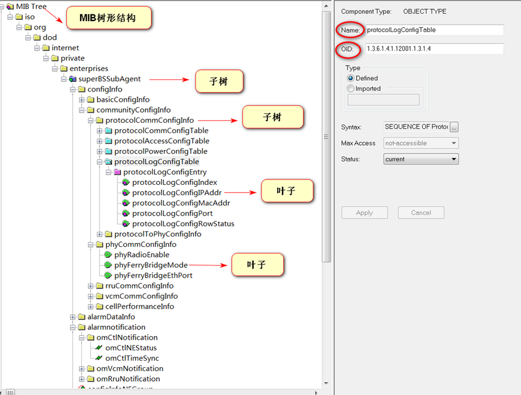


<br/>
# 2. 数据类型
## 2.1. 基础数据类型
基础数据类型如下：常用的类型为`Unsigned32`、`OBJTCT STRING`(char 类型)
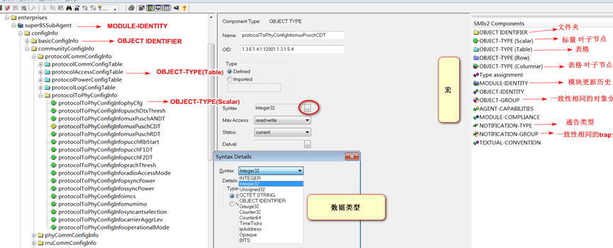


### 2.1.1. DatAandTime
时间类型；

### 2.1.2. MacAddress
Mac地址；

### 2.1.3. TimeTicks
1秒为100ticks；
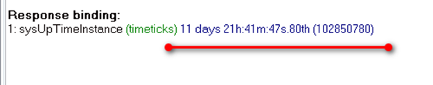


### 2.1.4. RowStatus
`rowstatus`类型；
### 2.1.5. TruthValue
true or false；
### 2.1.6. DispalyString
字符串；
### 2.1.7. OCTET STRING
十六进制字节流；

<br/>
## 2.2. 宏

如上图右侧部分为宏，左侧部分为相关宏的应用。
### 2.2.1. OBJECT IDENTIFIER
用于扩展子树（文件夹）；
### 2.2.2. OBJECT-TYPE(Scalar)
用于创建标量叶子节点对象；
### 2.2.3. OBJECT-TYPE(Table)
用于创建表格对象；
### 2.2.4. OBJECT-TYPE(Columnar)
用于创建表格列队向叶子节点；
### 2.2.5. NOTIFICATION-TYPE
用于创建trap对象；
### 2.2.6. MODULE-IDENTITY
用于描述模块的更新历史，相当于模块的父节点；
### 2.2.7. OBJECT-GROUP
将具有一致性需要的相关管理对象描述在一个组中，便于一致性说明、管理和实现；
### 2.2.8. NOTIFICATION-GROUP
将相关的通告类消息描述在一个组中，便于一致性说明、管理和实现；

<br/>
# 3. MIB的编写
## 3.1. 编写建议
### 3.1.1. 如何组织OID
MIB的设计、编写过程中的主要困难是如何划分MIB中的对象，即如何组织MIB。一般来说一个MIB模块可分为3个主要分支：通告对象、普通对象和一致性描述的定义。顶层结构如下图：
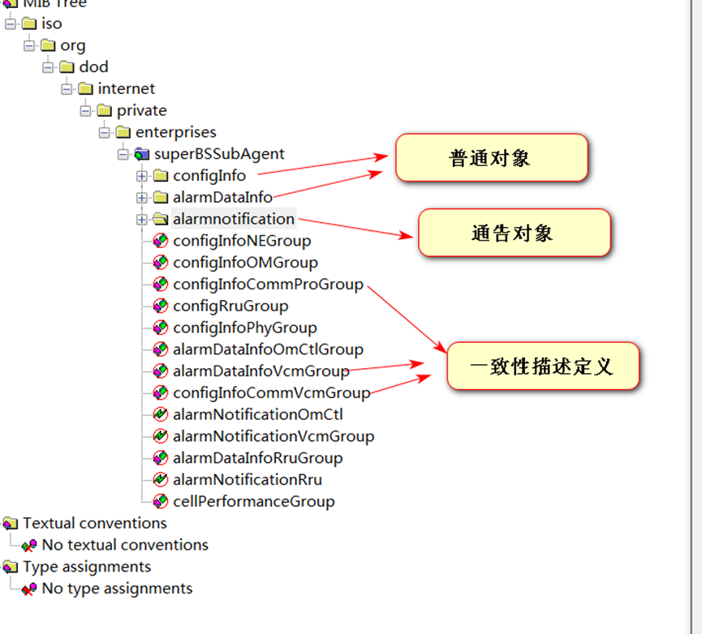

除了顶层结构的划分，下面的分支定义往往也会按照某种规则继续划分，规则如下：

* 根据业务功能进行分组：也就是将相似功能的对象分为一组；
* 根据数据类型进行分组：如控制量分一组、只读对象分一组、只写对象分一组；
* `TRAP`单独分一类；使用宏`NOTIFICATION-GROUP`将TRAP组织起来；
* 建议使用OBJECT-GROUP宏将某一类中属性或关系更为相近的普通对象归纳为一个子类；

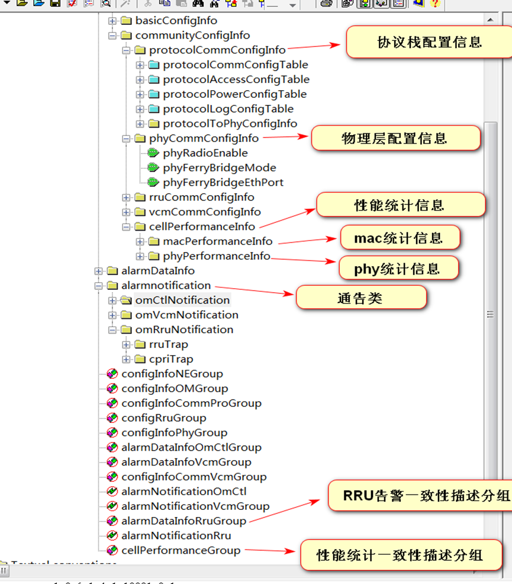

<br/>
### 3.1.2. 如何命名
命名的规范主要体现在三个方面：名称的长度、名称的大小写和名称的含义。

* 名称的长度：字符名称长度建议在`32字节`长度内；
* 名称大小写：`MODULE-IDENTITY`定义的模块描述符一般形如”`xxxMIB`”、”`xxxMib`”、”`xxxMibModule`”，该模块中的其他描述符建议以相同的前缀”`xxx`”开头；
* 名称的含义：名称应该体现明确的含义，能够见其名知其义，便于识别和记忆。名称设计缩写时，其缩写风格应该保持一致。定义MIB模块时，模块的名称也应该保持全局唯一，如果模块名重复，我们可能无法通过OID标签唯一的确认MIB中的对象。

<br/>
### 3.1.3. 如何正确使用数据类型
比较容易混淆的时整数数据类型，32位整数数据类型有`INTEGER`、`Integer32`、`Gauge32`、`Unsigned32`，`64位`整数数据类型为`Counter64`。
使用32位数据类型时有以下使用建议：

* 定义整形的枚举对象时只能使用INTEGER；
* 取值范围是`[-2^31 , (2^31)- 1]`时最好使用`Integer32`、也可使用`INTEGER`，不要使用其他两种类型；
* 当对象的取值范围是`[0, (2^32) - 1]`时，建议使用`Gauge32`，也可以使用`Unsigned32`；

<br/>
## 3.2. MIB的编写和编译工具

**MG-SOFT**套件：


### 3.2.1. MIB Builder
MIB Builder是属于**MG-SOFT**套件中的MIB编写工具，具有可视化界面、简单、可拖放等操作特点，具有严格的规则检查机制，通过该工具能够准确的定义私有MIB。
MIB Builder软件界面如下：

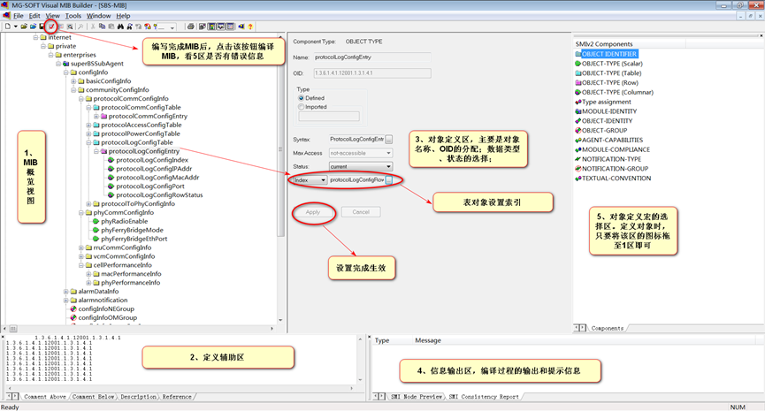

>对象属性设置，会生成对应的代码框架；(务必明确对象属性，否则生成多余垃圾代码)

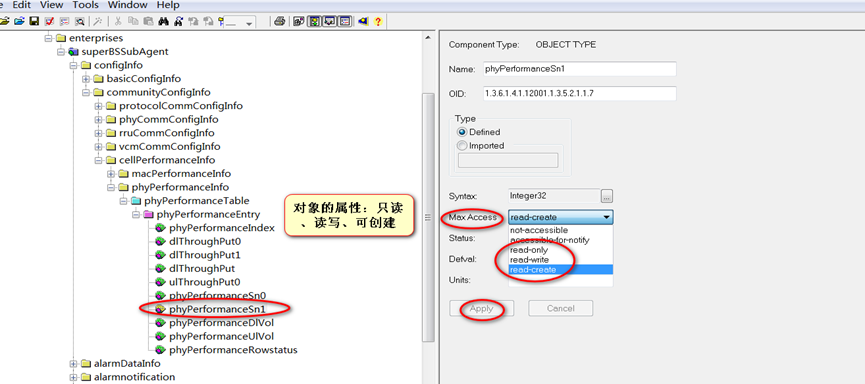


编译检测未出现错误提示如下：

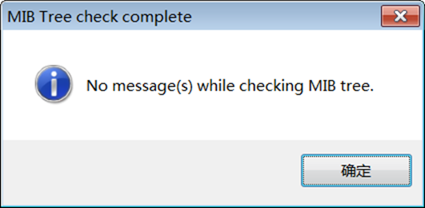

此时MIB对象的编写完成、编译语法正确，可导出MIB文件的文本文件，使用`mib2c`工具生成对应的框架代码。导出文本文件操作如下：

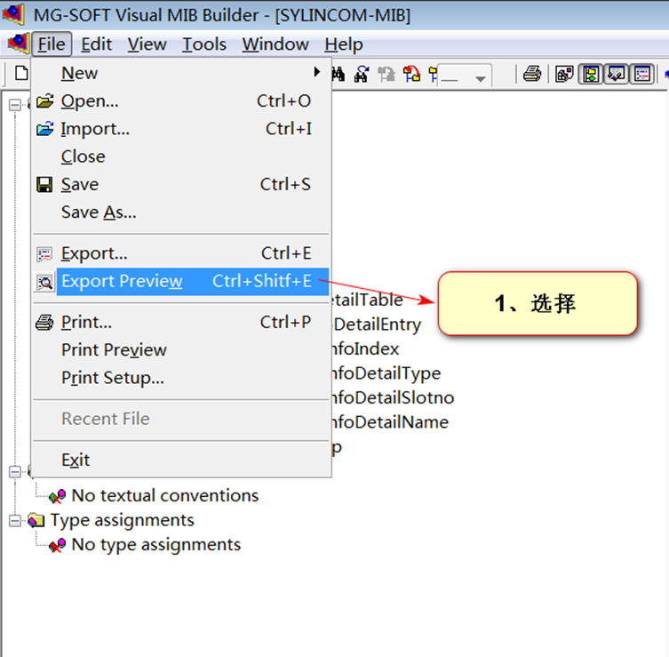

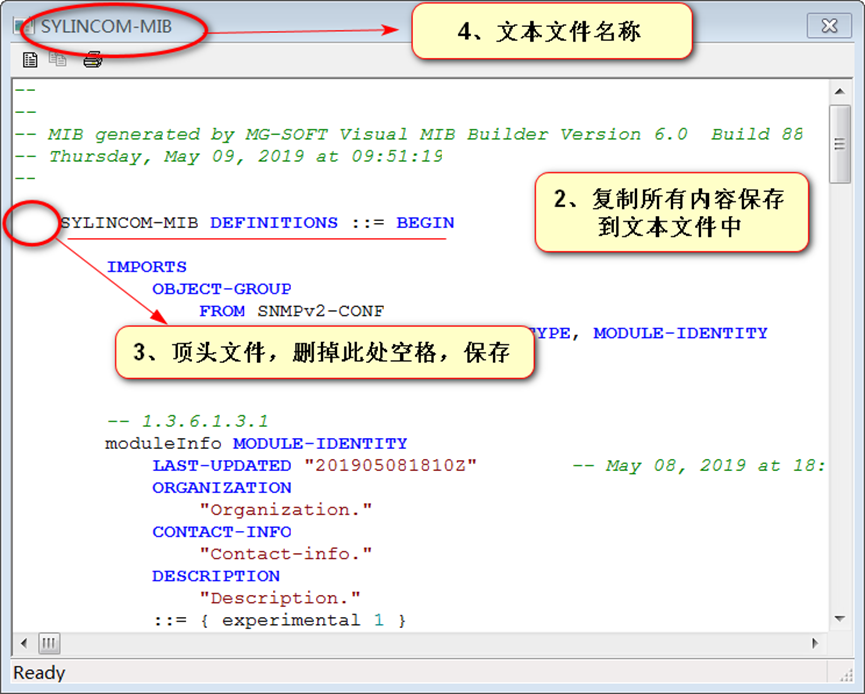

<br/>
### 3.2.2. MIB Compiler
`MIB Compiler`是编译MIB的工具。其主要功能是对MIB文件进行编写规则的检查，并提示相应的编译信息或告警信息。输入为MIB builder中编译完成后导出的文本文件，输出为`MG-SOFT`可识别的二进制文件，该文件的格式为SMIDB。该文件可用于`MIB Browser`(MIB浏览器)测试使用。
编译方法如下：
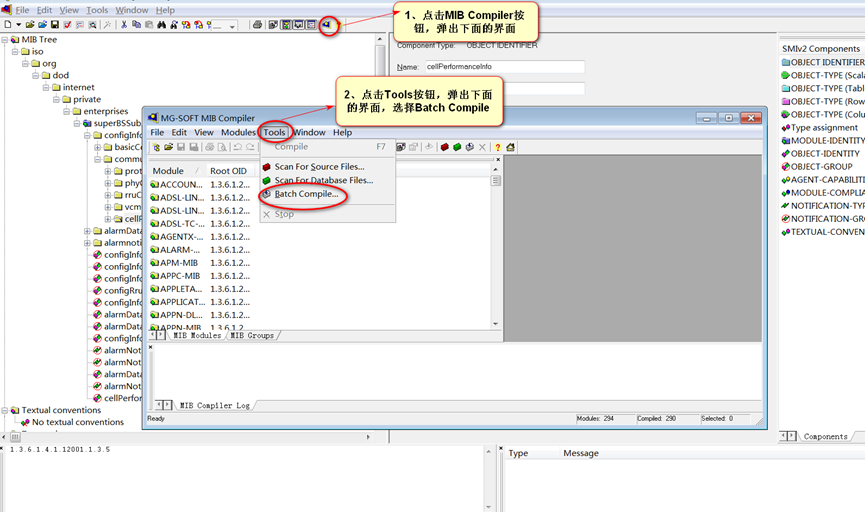

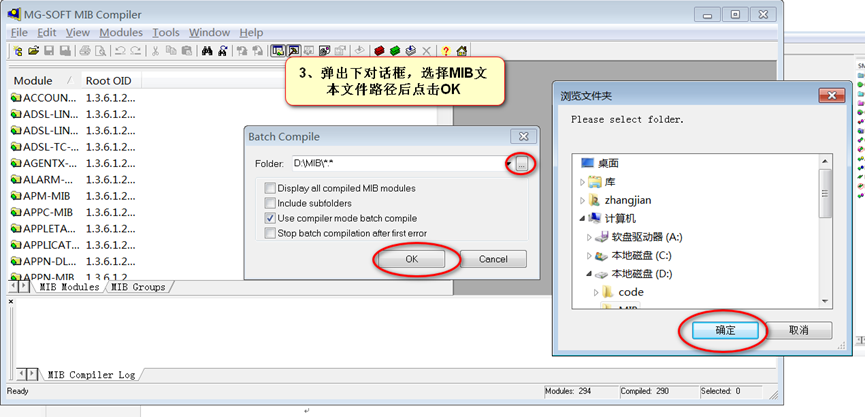

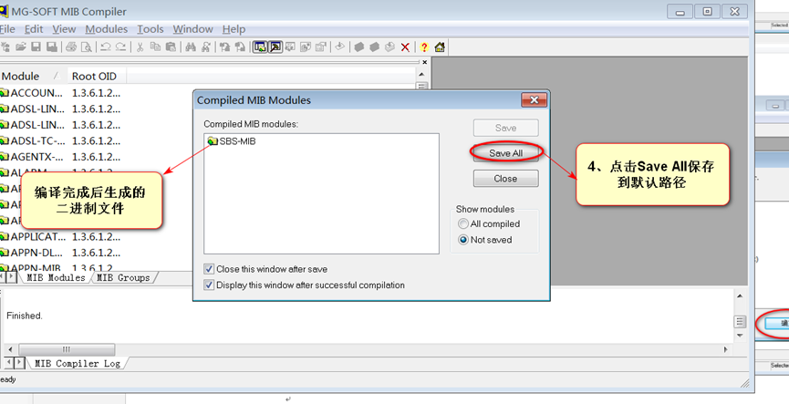


<br/>
# 4. 使用mib2c工具生成框架代码

## 4.1. 简述
`mib2c`顾名思义是将MIB转化为C语言代码的开发工具，它是net-snmp开发中最直接和高效的开发工具。它的输入时是某种代码框架的配置文件和MIB文件中的某一节点(树)，输出是该节点(树)对应的C代码框架，也就是个半成品。只要在输出的代码框架中添加具体业务的实现，就可以实现net-snmp的二次开发。

<br/>
## 4.2. 生成框架代码前的准备
MIB文件中有标量、表格，按照标准的MIB设计方法，这些管理对象都是组织在某个父节点下。mib2c的输入要求是某个这样的父节点或者单独的某个节点，而不是整个文件名（注入文件名）。这样针对不同的对象类型产生对应的代码实现，所以mib2c需要以某种方式找到MIB文件中对应的节点，需要做一下事情：

* 把新的MIB文本文件复制到路径`/usr/local/share/snmp/mibs`下；
* 进入`/usr/local/share/snmp/mibs`路径下执行 `export MIBS=ALL`命令；
```bash
export MIBS=ALL
```
上述操作完成后新的MIB文件被导入系统，可使用下面的命令查看MIB文件中的节点是否被系统接纳：
```
snmptranslate –TB S
```
`S`为节点名称；如下图：


至此，生成框架代码的前期工作准备完毕，即可使用命令生成对应节点的某种代码框架。


<br/>
## 4.3. 常用的框架代码配置文件
系统默认的各类框架代码的配置文件在/usr/local/share/snmp目录下，一般不需要对框架类的配置文件做修改，有需求再了解。

* `mib2c.scalar.conf`：适用于所有的标量对象；
* `mib2c.iterate.conf`：适用于对象的实例值需要某种迭代、反复查询的操作，该配置文件生成的代码使用的API对GET和GETNEXT请求效率较高。该代码框架的API核心函数中使用了大量的case处理get和set请求，代码不太美观；
* `mib2c.old-api.conf`：能够同时处理标量和表格的配置文件，代码紧凑、直观。比较常用；（统一使用这个模板）
* `mib2c.notify.conf`：生成通告消息相关的模板代码；

<br/>
## 4.4. 生成代码命令
进入`/usr/local/share/snmp/mibs`路径：

* `mib2c.scalar.conf`，生成scalar框架代码：
```
mib2c -c mib2c.scalar.conf S1::S2
```
* `mib2c.iterate.conf`，生成iterate框架代码：
```
mib2c -c mib2c.iterate.conf S1::S2
```
* `mib2c.old-api.conf`，生成oil-api框架代码：
```
mib2c -c mib2c.old-api.conf S1::S2
```
`S1`为MIB模块名称，`S2`为节点名称。命令执行完成后生成以S2命名的`.c`和`.h`文件在当前目录下。

<br/>
## 4.5. 框架代码二次开发
使用上述命令生成的代码有两个文件，一个`.c`文件和一个`.h`文件；`.h`文件基本不用修改，`.c`文件主要需要完成具体对象`get/set`操作的实现。

<br/>

### 4.5.1. 动态表header函数
下面这个是一个例子，里面的逻辑关系都一样，大家只需要根据自己的需求，修改索引长度以及`getfirst`、`getnext`函数。

```c
int header_onuVlanConfigTable(struct variable *vp,
    	    oid     *name,
    	    size_t  *length,
    	    int     exact,
    	    size_t  *var_len,
			long * pvid,
			long * pdev)
{
	int ret = MATCH_FAILED;

	long var_oid_len = vp->namelen;

	if(pdev && pvid )
	{
		if(exact)
		{
			if(*length == var_oid_len+VLAN_CONFIG_TABLE_INDEX_LEN)
			{
				*pvid = name[var_oid_len];
				*pdev = name[var_oid_len+1];

				ret = MATCH_SUCCEEDED;
			}
		}
		else
		{
			int rt = snmp_oid_compare(name, var_oid_len, vp->name, var_oid_len);
			if(rt < 0 || (rt == 0 && (*length < var_oid_len+VLAN_CONFIG_TABLE_INDEX_LEN)))
			{
				if(rtVlanConfigEntryGetFirst(pvid,pdev) == 0)
				{
					memcpy(name, vp->name, sizeof(oid)*vp->namelen);
					ret = MATCH_SUCCEEDED;
				}
			}
			else if(rt == 0)
			{
				*pvid = name[var_oid_len];
				*pdev = name[var_oid_len+1];

				if(rtVlanConfigEntryGetNext(pvid,pdev) == 0)
				{
					ret = MATCH_SUCCEEDED;
				}
			}
			else
			{
			}
		}
		if(ret == MATCH_SUCCEEDED)
		{
			*length = var_oid_len+VLAN_CONFIG_TABLE_INDEX_LEN;
			name[var_oid_len] = *pvid;
			name[var_oid_len+1] = *pdev;
		}
	}
	return ret;
}
```

<br/>
### 4.5.2. write函数（set操作）

```c
int
write_gwEthLoopVlanId(int      action,
            u_char   *var_val,
            u_char   var_val_type,
            size_t   var_val_len,
            u_char   *statP,
            oid      *name,
            size_t   name_len)
{
    long value;
    int size;

    switch ( action ) {
        case RESERVE1:
          if (var_val_type != ASN_OCTET_STR) {
              return SNMP_ERR_WRONGTYPE;
          }
          if (var_val_len > ETH_LOOPVLANLIST_LEN) {
              return SNMP_ERR_WRONGLENGTH;
          }
          break;

        case RESERVE2:
          break;

        case ACTION: /参考示例.c文件中action动作的逻辑处理/
            if(setGwEthLoopVlanList(var_val)==VOS_ERROR)
		return SNMP_ERR_COMMITFAILED;
          break;

        case COMMIT:
          break;
    }
    return SNMP_ERR_NOERROR;
}
```

<br/>
### 4.5.3. RowStatus逻辑
参考示例.c文件中RowStatus的处理逻辑；

<br/>
# 5. 测试MIB
## 5.1. MIB Browser测试
MIB浏览器提供了丰富的可视化测试方法，下图简单说明：
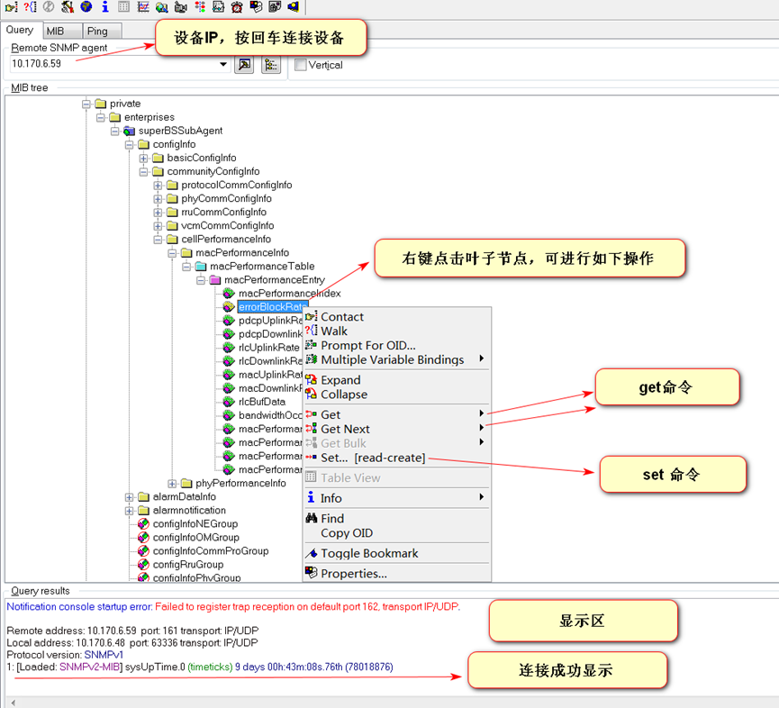

set命令：
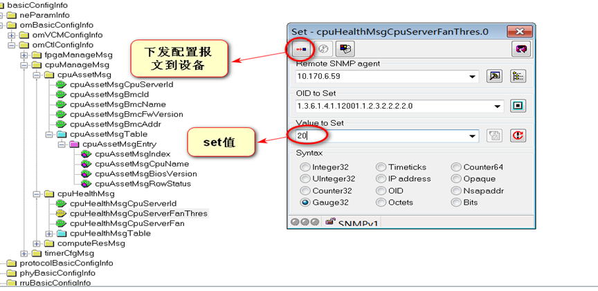

<br/>
<div align=right>以上内容由RTOAX整理自网络。</div>
