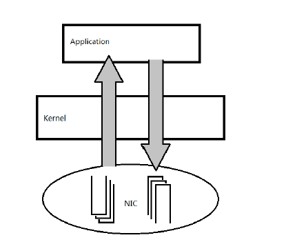
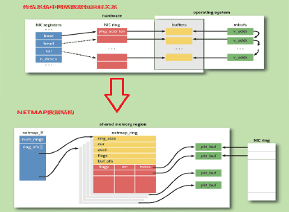

<center><font size='6'>TCP/IP协议栈 Netmap用户态协议栈</font></center>
<br/>
<center><font size='5'>RToax</font></center>
<center><font size='5'>2020年10月</font></center>
<br/>

# 1. Netmap 简介
Netmap 是一个高性能收发原始数据包的框架，由 Luigi Rizzo 等人开发完成，其包含了内核模块以及用户态库函数。其目标是，不修改现有操作系统软件以及不需要特殊硬件支持，实现用户态和网卡之间数据包的高性能传递。其原理图如下，数据包不经过操作系统内核进行处理，用户空间程序收发数据包时，直接与网卡进行通信。 
代码位置：https://github.com/luigirizzo/netmap 



## 1.1. 数据结构


在 Netmap 框架下，内核拥有数据包池，发送环接收环上的数据包不需要动态申请，有数据到达网卡时，当有数据到达后，直接从数据包池中取出一个数据包，然后将数据放入此数据包中，再将数据包的描述符放入接收环中。内核中的数据包池，通过 mmap 技术映射到用户空间。用户态程序最终通过 netmap_if 获取接收发送环 netmap_ring，进行数据包的获取发送。 

## 1.2. 特点总结

（1）性能高 ：数据包不走传统协议栈，不需要层层解析，用户态直接与网卡的接受环和发送环交互。性能高的具体原因有一下三个： 

* （a） 系统调用以及处理数据包的时间花费少 
* （b） 不需要进行数据包的内存分配：采用数据包池，当有数据到达后，直接从数据包池中取出一个数据包，然后将数据放入此数据包中，再将数据包的描述符放入接收环中。 （c） 数据拷贝次数少：内核中的数据包采用 mmap 技术映射到用户态。所以数据包在到达用户态时，不需要进行数据包的拷贝。 

（2） 稳定性高 ：有关网卡寄存器数据的维护都是在内核模块进行，用户不会直接操作寄存器。所以在用户态操作时，不会导致操作系统崩溃 
（3） 亲和性 ：可采用了 CPU 亲和性，实现 CPU 和网卡绑定，提高性能。 
（4） 易用性好 ：API 操作简单，用户态只需要调用 ioctl 函数即可完成数据包收发工作 （5） 与硬件解耦 ：不依赖硬件，只需要对网卡驱动程序稍微做点修改就可以使用此框架（几十行行），传统网卡驱动将数据包传递给操作系统内核中协议栈，而修改后的数据包直接放入 Netmap_ring 供用户使用。 


# 2. Netmap API 介绍

## 2.1. 简要说明

1.netmap API 主要为两个头文件 netmap.h 和 netmap_user.h ，当解压下载好的 netmap程序后，在./netmap/sys/net/目录下，本文主要对这两个头文件进行分析。 
2.我们从netmap_user.h 头文件开始看起。 

## 2.2. likely()和unlikely()

这两个宏定义是对编译器做优化的，并不会对变量做什么改变。后面看到这两个宏的调用自动忽略就好了。 
```c
#ifndef likely 
#define likely(x)    __builtin_expect(!!(x), 1) 
#define unlikely(x)    __builtin_expect(!!(x), 0) 
#endif /* likely and unlikely */ 
```

## 2.3. netmap.h头文件
1.netmap.h 被 netmap_user.h 调用，里面定义了一些宏和几个主要的结构体，如nmreq{}, netmap_if{}, netmap_ring{},  netmap_slot{}。 
2.一个网卡(或者网络接口)只有一个 netmap_if{}结构，在使用 mmap()申请的共享内存中，通过 netmap_if{}结构可以访问到任何一个发送/接收环(也就是 netmap_ring{}结构，一个netmap_if{}可以对应多发送/接收环,这应该和物理硬件有关 ，我在虚拟机下只有一对环，在真实主机上有两队环)。 
3.找到 netmap_ring{}的地址后，我们就可以找到环中每一个 buffer 的地址(buffer 里面存储的是将要发送/接收的数据包)。后面会讲解这是如何实现的。 
4.通过一个 nifp 是如何访问到多个收/发环的，通过一个 ring 如何找到多个不同的 buffer地址的，其实都是通过存储这些结构体相邻的后面一部分空间实现。(申请共享内存的时候，这些均已被设计好) 

## 2.4. 几个重要的宏定义

### 2.4.1. _NETMAP_OFFSET 
```c
#define _NETMAP_OFFSET(type, ptr, offset) \ 
    ((type)(void *)((char *)(ptr) + (offset))) 
```
解释：该宏定义的作用是将 ptr 指针(强转成 char *类型)向右偏移 offset 个字节，再将其转化为指定的类型 type。 

### 2.4.2. NETMAP_IF 

```c
#define NETMAP_TXRING(nifp, index) _NETMAP_OFFSET(struct netmap_ring *, \ 
    nifp, (nifp)->ring_ofs[index] ) 
```
解释：1.通过该宏定义，可以找到 nifp 的第 index 个发送环的地址(index 是从 0 开始的)， ring_ofs[index]为偏移量，由内核生成。    

TODO


<br/>
<div align=right>以上内容由RTOAX翻译整理自网络。
</div>