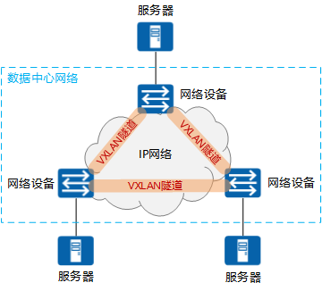
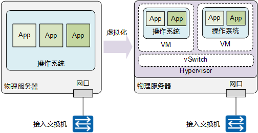
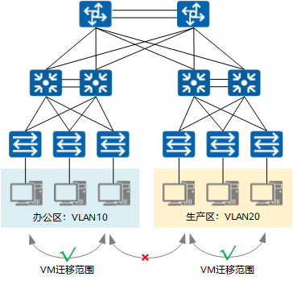
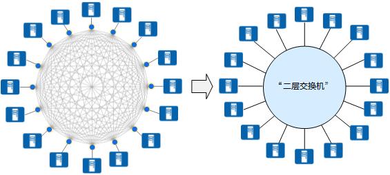
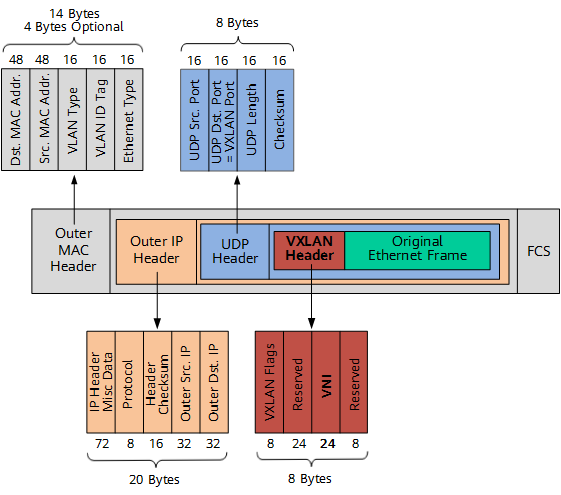
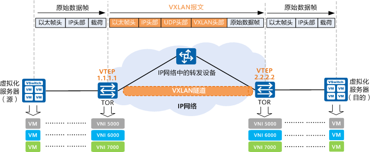
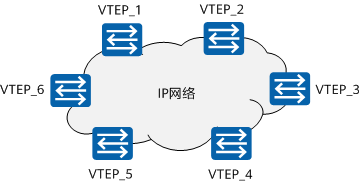

TCP/IP协议栈 什么是VXLAN

 

RToax

2021年4月15日

 

> [https://support.huawei.com/enterprise/zh/doc/EDOC1100087027](https://support.huawei.com/enterprise/zh/doc/EDOC1100087027)

# 1. 什么是VXLAN

VXLAN（Virtual eXtensible Local Area Network，虚拟扩展局域网），是由IETF定义的NVO3（Network Virtualization over Layer 3）标准技术之一，是对传统VLAN协议的一种扩展。VXLAN的特点是将L2的以太帧封装到UDP报文（即L2 over L4）中，并在L3网络中传输。

如图1-1所示，VXLAN本质上是一种隧道技术，在源网络设备与目的网络设备之间的IP网络上，建立一条逻辑隧道，将用户侧报文经过特定的封装后通过这条隧道转发。从用户的角度来看，接入网络的服务器就像是连接到了一个虚拟的二层交换机的不同端口上（可把蓝色虚框表示的数据中心VXLAN网络看成一个二层虚拟交换机），可以方便地通信。

VXLAN已经成为当前构建数据中心的主流技术，是因为它能很好地满足数据中心里虚拟机动态迁移和多租户等需求。

# 2. 为什么需要VXLAN
为什么需要VXLAN呢？这和数据中心服务器侧的虚拟化趋势紧密相关，一方面服务器虚拟化后出现了虚拟机动态迁移，要求提供一个无障碍接入的网络；另一方面，数据中心规模越发庞大，租户数量激增，需要网络提供隔离海量租户的能力。采用VXLAN可以满足上述两个关键需求。

虚拟机动态迁移，要求提供一个无障碍接入的网络
什么是服务器虚拟化技术？

传统的数据中心物理服务器利用率太低，平均只有10%～15%，浪费了大量的电力能源和机房资源，所以出现了服务器虚拟化技术。如图1-2所示，服务器虚拟化技术是把一台物理服务器虚拟化成多台逻辑服务器，这种逻辑服务器被称为虚拟机（VM）。每个VM都可以独立运行，有自己的操作系统、APP，当然也有自己独立的MAC地址和IP地址，它们通过服务器内部的虚拟交换机（vSwitch）与外部实体网络连接。

通过服务器虚拟化，可以有效地提高服务器的利用率，降低能源消耗，降低数据中心的运营成本，所以虚拟化技术目前得到了广泛的应用。

# 3. 什么是虚拟机动态迁移？

所谓虚拟机动态迁移，就是在保证虚拟机上服务正常运行的同时，将一个虚拟机系统从一个物理服务器移动到另一个物理服务器的过程。该过程对于最终用户来说是无感知的，从而使得管理员能够在不影响用户正常使用的情况下，灵活调配服务器资源，或者对物理服务器进行维修和升级。

在服务器虚拟化后，虚拟机动态迁移变得常态化，为了保证迁移时业务不中断，就要求在虚拟机迁移时，不仅虚拟机的IP地址不变，而且虚拟机的运行状态也必须保持原状（例如TCP会话状态），所以虚拟机的动态迁移只能在同一个二层域中进行，而不能跨二层域迁移。

如图1-3所示，传统的二三层网络架构限制了虚拟机的动态迁移范围，迁移只能在一个较小的局部范围内进行，应用受到了极大的限制。

为了打破这种限制，实现虚拟机的大范围甚至跨地域的动态迁移，就要求把VM迁移可能涉及的所有服务器都纳入同一个二层网络域，这样才能实现VM的大范围无障碍迁移。

VXLAN如何满足虚拟机动态迁移时对网络的要求？

众所周知，同一台二层交换机可以实现下挂服务器之间的二层通信，而且服务器从该二层交换机的一个端口迁移到另一个端口时，IP地址是可以保持不变的。这样就可以满足虚拟机动态迁移的需求了。VXLAN的设计理念和目标正是由此而来的。

从上一个小节我们可以知道，VXLAN本质上是一种隧道技术，当源和目的之间有通信需求时，便在数据中心IP网络之上创建一条虚拟的隧道，透明转发用户数据。而数据中心内相互通信的需求众多，这种隧道的建立方式几乎是全互联形态才能满足通信需求。

VXLAN可以提供一套方法论，在数据中心IP网络基础上，构建一张全互联的二层隧道虚拟网络，保证任意两点之间都能通过VXLAN隧道来通信，并忽略底层网络的结构和细节。从服务器的角度看，VXLAN为它们将整个数据中心基础网络虚拟成了一台巨大的“二层交换机”，所有服务器都连接在这台虚拟二层交换机上。而基础网络之内如何转发都是这台“巨大交换机”内部的事情，服务器完全无需关心。

基于这种“二层交换机”的模型，就很容易理解为什么VXLAN可以实现VM动态迁移了：将虚拟机从“二层交换机”的一个端口换到另一个端口，完全无需变更IP地址。

> 说明
> 使用这种理念的技术协议，除了VXLAN外，还有NVGRE、STT等，本文仅对VXLAN进行说明。

数据中心租户数量激增，要求提供一个可隔离海量租户的网络
众所周知，在传统的VLAN网络中，标准定义所支持的可用VLAN数量只有4000个左右。服务器虚拟化后，一台物理服务器中承载了多台虚拟机，每个虚拟机都有独立的IP地址和MAC地址，相当于接入数据中心的服务器成倍扩大了。另外，公有云或其它大型虚拟化云数据中心动辄需容纳上万甚至更多租户，VLAN的能力显然已经力不从心。

VXLAN如何来解决上述问题呢？VXLAN在VXLAN帧头中引入了类似VLAN ID的网络标识，称为VXLAN网络标识VNI（VXLAN Network ID），由24比特组成，理论上可支持多达16M的VXLAN段，从而满足了大规模不同网络之间的标识、隔离需求。下文我们会介绍VNI的详细作用。

# 4. VXLAN与VLAN之间有何不同
VLAN作为传统的网络隔离技术，在标准定义中VLAN的数量只有4000个左右，无法满足大型数据中心的租户间隔离需求。另外，VLAN的二层范围一般较小且固定，无法支持虚拟机大范围的动态迁移。

VXLAN完美地弥补了VLAN的上述不足，一方面通过VXLAN中的24比特VNI字段（如图1-5所示），提供多达16M租户的标识能力，远大于VLAN的4000；另一方面，VXLAN本质上在两台交换机之间构建了一条穿越数据中心基础IP网络的虚拟隧道，将数据中心网络虚拟成一个巨型“二层交换机”，满足虚拟机大范围动态迁移的需求。

虽然从名字上看，VXLAN是VLAN的一种扩展协议，但VXLAN构建虚拟隧道的本领已经与VLAN迥然不同了。

下面就让我们来看下，VXLAN报文到底长啥样。

如上图所示，VTEP对VM发送的原始以太帧（Original L2 Frame）进行了以下“包装”：

* VXLAN Header: 增加VXLAN头（8字节），其中包含24比特的VNI字段，用来定义VXLAN网络中不同的租户。此外，还包含VXLAN Flags（8比特，取值为00001000）和两个保留字段（分别为24比特和8比特）。

* UDP Header：VXLAN头和原始以太帧一起作为UDP的数据。UDP头中，目的端口号（VXLAN Port）固定为4789，源端口号（UDP Src. Port）是原始以太帧通过哈希算法计算后的值。

* Outer IP Header： 封装外层IP头。其中，源IP地址（Outer Src. IP）为源VM所属VTEP的IP地址，目的IP地址（Outer Dst. IP）为目的VM所属VTEP的IP地址。

* Outer MAC Header：封装外层以太头。其中，源MAC地址（Src. MAC Addr.）为源VM所属VTEP的MAC地址，目的MAC地址（Dst. MAC Addr.）为到达目的VTEP的路径中下一跳设备的MAC地址。

# 5. VXLAN隧道是如何建立的
本节将为您介绍VXLAN隧道的建立过程，并在这个过程中更好地理解VXLAN的工作原理。

## 5.1. 什么是VXLAN中的VTEP和VNI
下面让我们来进一步了解VXLAN的网络模型以及一些常见的概念。如图1-6所示，两台服务器之间通过VXLAN网络进行通信。

从上图中可以发现，VXLAN在两台TOR交换机之间建立了一条隧道，将服务器发出的原始数据帧加以“包装”，好让原始报文可以在承载网络（比如IP网络）上传输。当到达目的服务器所连接的TOR交换机后，离开VXLAN隧道，并将原始数据帧恢复出来，继续转发给目的服务器。

另外，VXLAN网络中出现了一些传统数据中心网络中没有的新元素，如VTEP、VNI等，它们的作用是什么呢？下面将向您介绍这几个新元素。

## 5.2. 什么是VXLAN VTEP
如图1-6所示，VTEP（VXLAN Tunnel Endpoints，VXLAN隧道端点）是VXLAN网络的边缘设备，是VXLAN隧道的起点和终点，VXLAN对用户原始数据帧的封装和解封装均在VTEP上进行。

VTEP是VXLAN网络中绝对的主角，VTEP既可以是一台独立的网络设备（比如华为的CloudEngine系列交换机），也可以是在服务器中的虚拟交换机。源服务器发出的原始数据帧，在VTEP上被封装成VXLAN格式的报文，并在IP网络中传递到另外一个VTEP上，并经过解封转还原出原始的数据帧，最后转发给目的服务器。

VTEP在VXLAN隧道的建立和转发过程中的详细工作，可以参见下文的VXLAN隧道是如何建立的

## 5.3. 什么是VXLAN VNI
前文提到，以太网数据帧中VLAN只占了12比特的空间，这使得VLAN的隔离能力在数据中心网络中力不从心。而VNI的出现，就是专门解决这个问题的。

如图1-6所示，VNI（VXLAN Network Identifier，VXLAN 网络标识符），VNI是一种类似于VLAN ID的用户标识，一个VNI代表了一个租户，属于不同VNI的虚拟机之间不能直接进行二层通信。如图1-5所示，VXLAN报文封装时，给VNI分配了24比特的长度空间，使其可以支持海量租户的隔离。

VNI在VXLAN隧道的建立和转发过程中的详细工作，可以参见下文的VXLAN隧道是如何建立的

另外，在分布式网关部署场景下，VNI还可分为二层VNI和三层VNI，它们的作用不同：

二层VNI是普通的VNI，以1：1方式映射到广播域BD，实现VXLAN报文同子网的转发（详情可参见下文的什么是“同一大二层域”）。

三层VNI和VPN实例进行关联，用于VXLAN报文跨子网的转发（三层VNI的工作详情将在另外一篇EVPN相关的文档中展开描述）。

# 6. 哪些VTEP之间需要建立VXLAN隧道
一条VXLAN隧道是由两个VTEP来确定建立的。数据中心网络中存在很多个VTEP，如图1-7所示，那么哪些VTEP间需要建立VXLAN隧道呢？

如前所述，通过VXLAN隧道，“二层域”可以突破物理上的界限，实现大二层网络中VM之间的通信。所以，连接在不同VTEP上的VM之间如果有“大二层”互通的需求，这两个VTEP之间就需要建立VXLAN隧道。换言之，同一大二层域内的VTEP之间都需要建立VXLAN隧道。

例如，假设图1-7中VTEP_1连接的VM、VTEP_2连接的VM以及VTEP_3连接的VM之间需要“大二层”互通，那VTEP_1、VTEP_2和VTEP_3之间就需要两两建立VXLAN隧道，如图1-8所示。

 

以上内容由RTOAX翻译整理自网络。

